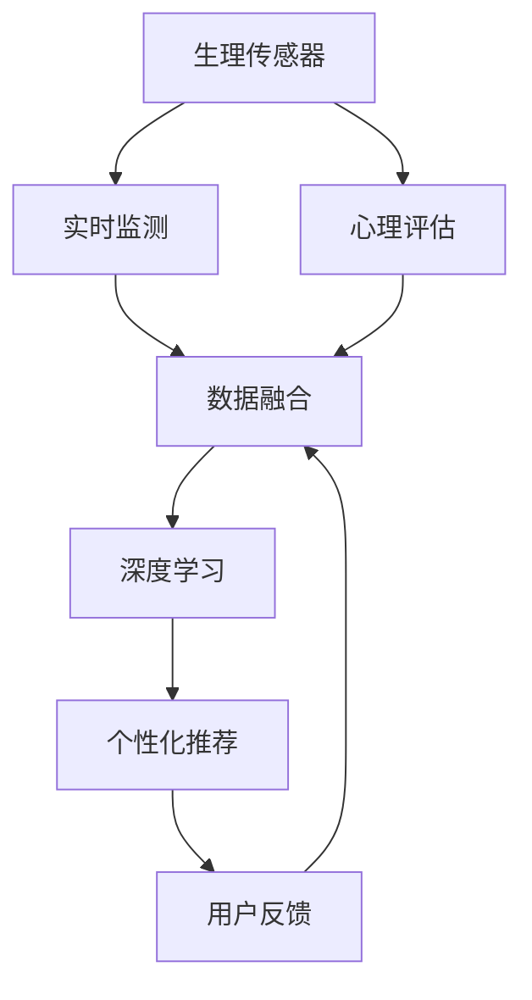

                 

# 数字化冥想：AI辅助的心灵探索

## 1. 背景介绍

### 1.1 问题由来

在当今快节奏、高压力的社会环境中，心理健康已成为人们日益关注的重要话题。数字化冥想作为一项融合了现代科技与古老哲学实践的技术，通过智能设备和算法，为人们提供了便捷、高效的心理健康管理手段。AI辅助的心灵探索，特别是基于深度学习和大数据技术的数字化冥想工具，正在改变传统冥想方式，带来前所未有的便利和有效性。

### 1.2 问题核心关键点

数字化冥想的核心在于通过算法和数据技术，为用户提供个性化的冥想指导和反馈。AI辅助的冥想工具通过对用户行为数据的分析，能够精准地识别用户的心理状态，并提供个性化的冥想策略。这种技术不仅能够帮助用户减轻压力，提高生活质量，还能在心理健康领域发挥重要作用。

数字化冥想主要通过以下几个关键点实现其目标：
- 实时监测用户生理和心理指标。
- 基于用户数据个性化生成冥想方案。
- 通过机器学习不断优化冥想策略。
- 提供持续的反馈和激励机制。

### 1.3 问题研究意义

数字化冥想技术的广泛应用，对个人心理健康、企业员工福祉、教育培训等多个领域产生了深远影响。它不仅为个体提供了更为科学、有效的心理健康管理工具，还在多个社会应用中显示出巨大潜力。

研究数字化冥想技术，对于提升人类整体心理健康水平，构建更加和谐、健康的生活环境具有重要意义：

1. 提升个体心理健康。数字化冥想工具能够通过个性化的指导，帮助用户减轻压力，提高生活质量。
2. 改善企业员工福祉。通过提高员工心理健康水平，数字化冥想有助于提升工作效率和组织稳定性。
3. 推动教育培训改革。数字化冥想技术能够为学生提供更为科学、个性化的心理健康教育支持。
4. 促进社会和谐。数字化冥想有助于缓解社会焦虑、压力等心理问题，构建更为健康和谐的社会环境。

## 2. 核心概念与联系

### 2.1 核心概念概述

为了深入理解数字化冥想技术的原理和应用，本节将介绍几个关键概念：

- **数字化冥想**：通过智能设备和算法，实时监测和指导用户进行冥想，以达到提升心理健康的目的。数字化冥想结合了现代科技与古老冥想哲学，旨在通过科学的方法帮助用户实现内心平衡。

- **AI辅助**：利用人工智能技术，特别是深度学习和大数据处理，对用户生理和心理数据进行分析，提供个性化、精准的冥想指导和反馈。

- **深度学习**：一种基于神经网络的学习方法，能够处理大规模、复杂的数据集，从中学习模式和规律，并应用于实际问题解决。

- **生理传感器**：包括心率、血压、皮肤电导率等传感器，用于实时监测用户的生理指标，作为冥想效果评估的依据。

- **心理评估**：通过问卷、测试等方式，评估用户的心理状态和情绪，作为冥想策略调整的参考。

- **个性化推荐系统**：基于用户历史数据和实时反馈，动态调整冥想内容和策略，提供个性化的用户体验。

这些核心概念之间的逻辑关系可以通过以下Mermaid流程图来展示：



这个流程图展示了数字化冥想系统的核心组件及其之间的相互作用：

1. 生理传感器实时监测用户的生理指标。
2. 心理评估获取用户的心理状态。
3. 深度学习模型分析融合生理和心理数据。
4. 个性化推荐系统根据用户数据生成个性化冥想方案。
5. 用户反馈用于调整和优化冥想策略。

## 3. 核心算法原理 & 具体操作步骤

### 3.1 算法原理概述

数字化冥想系统的核心算法原理主要基于深度学习和个性化推荐系统。系统通过实时监测用户的生理和心理数据，利用深度学习模型分析并学习其中的模式和规律，生成个性化的冥想策略。

核心算法流程如下：
1. **数据收集**：通过生理传感器和心理评估问卷，收集用户的生理和心理数据。
2. **数据预处理**：对收集到的数据进行清洗和标准化处理。
3. **特征提取**：使用深度学习模型对数据进行特征提取，识别出与冥想效果相关的关键特征。
4. **模型训练**：利用用户的反馈数据训练深度学习模型，生成个性化的冥想策略。
5. **策略推荐**：根据用户的实时生理和心理数据，动态调整冥想方案。
6. **效果评估**：通过用户反馈数据评估冥想策略的效果，不断优化模型。

### 3.2 算法步骤详解

以下是数字化冥想系统的核心算法详细步骤：

**Step 1: 数据收集**

收集用户的生理和心理数据，包括：
- 生理指标：如心率、血压、皮肤电导率等。
- 心理指标：通过问卷、测试等方式评估用户的情绪和心理状态。

**Step 2: 数据预处理**

对收集到的数据进行清洗和标准化处理，去除噪声和异常值，确保数据质量。具体步骤包括：
- 去除传感器异常数据。
- 对心理问卷数据进行标准化处理。

**Step 3: 特征提取**

使用深度学习模型对数据进行特征提取，识别出与冥想效果相关的关键特征。具体步骤如下：
- 设计合适的深度学习模型架构。
- 使用训练数据训练模型，提取关键特征。
- 使用测试数据评估模型性能。

**Step 4: 模型训练**

利用用户的反馈数据训练深度学习模型，生成个性化的冥想策略。具体步骤如下：
- 设计合适的深度学习模型架构。
- 使用用户的反馈数据进行模型训练。
- 不断优化模型，提高冥想策略的准确性。

**Step 5: 策略推荐**

根据用户的实时生理和心理数据，动态调整冥想方案。具体步骤如下：
- 实时监测用户的生理和心理数据。
- 根据数据特征生成个性化的冥想策略。
- 动态调整冥想策略，确保最佳效果。

**Step 6: 效果评估**

通过用户反馈数据评估冥想策略的效果，不断优化模型。具体步骤如下：
- 收集用户对冥想策略的反馈数据。
- 分析反馈数据，评估冥想策略的效果。
- 根据评估结果优化模型，提高冥想效果。

### 3.3 算法优缺点

数字化冥想系统的核心算法具有以下优点：
- 高效个性化：通过深度学习和个性化推荐系统，系统能够快速生成个性化的冥想策略。
- 实时调整：能够实时监测用户数据，动态调整冥想策略，提高效果。
- 数据驱动：基于数据驱动的方法，保证冥想策略的科学性和准确性。

同时，该算法也存在一些局限性：
- 数据隐私：生理和心理数据的收集和处理可能涉及用户隐私问题。
- 模型复杂性：深度学习模型的训练和优化过程较为复杂，需要较高的计算资源。
- 依赖用户反馈：冥想策略的效果依赖于用户的反馈数据，用户反馈不足时，效果可能有限。
- 效果评估难度：冥想效果的评估较为复杂，难以通过单一指标衡量。

尽管存在这些局限性，但数字化冥想系统的核心算法仍在不断发展，通过技术创新和算法优化，逐步解决这些问题，提升系统的实际效果。

### 3.4 算法应用领域

数字化冥想技术已经在多个领域得到了广泛应用，例如：

- **个人心理健康管理**：帮助个人减轻压力、焦虑，提高生活质量。
- **企业员工福祉**：通过提升员工心理健康水平，提高工作效率和组织稳定性。
- **教育培训**：为学生提供个性化的心理健康教育支持，帮助学生应对学习压力。
- **心理咨询**：通过数字化冥想工具，提供便捷的心理咨询服务，缓解心理压力。
- **社会应用**：通过社区应用，帮助用户建立社交支持网络，提升心理健康水平。

除了这些主要应用领域，数字化冥想技术还在医疗、军事、安全等众多领域展现出巨大的潜力。随着技术的发展和应用的深入，相信数字化冥想将在更多领域发挥重要作用。

## 4. 数学模型和公式 & 详细讲解 & 举例说明

### 4.1 数学模型构建

本节将使用数学语言对数字化冥想系统的核心算法进行更加严格的刻画。

记数字化冥想系统的输入数据为 $X = (x_1, x_2, ..., x_n)$，其中 $x_i$ 表示第 $i$ 个数据点的特征。假设目标变量为 $Y$，表示冥想效果评分。

定义系统的预测模型为 $f(X; \theta)$，其中 $\theta$ 为模型参数。系统的目标是寻找最优参数 $\theta^*$，使得模型在给定数据集上的预测效果最佳：

$$
\theta^* = \mathop{\arg\min}_{\theta} \frac{1}{N} \sum_{i=1}^N (y_i - f(x_i; \theta))^2
$$

其中 $N$ 为数据集的大小。

### 4.2 公式推导过程

以深度学习模型为例，使用神经网络对冥想效果进行预测。假设神经网络模型包含 $L$ 层，每层包含 $n_l$ 个神经元，则模型的前向传播过程为：

$$
h_1 = \sigma(W_1 x + b_1)
$$

$$
h_2 = \sigma(W_2 h_1 + b_2)
$$

$$
...
$$

$$
h_L = \sigma(W_L h_{L-1} + b_L)
$$

其中 $W$ 和 $b$ 为模型的权重和偏置参数，$\sigma$ 为激活函数。

模型输出的预测结果为：

$$
y = h_L
$$

损失函数通常使用均方误差（MSE）：

$$
\mathcal{L} = \frac{1}{N} \sum_{i=1}^N (y_i - y_i')^2
$$

其中 $y_i'$ 为模型对第 $i$ 个数据点的预测结果。

根据链式法则，损失函数对模型参数 $\theta$ 的梯度为：

$$
\frac{\partial \mathcal{L}}{\partial \theta} = \sum_{i=1}^N (y_i - y_i') \frac{\partial y_i'}{\partial \theta}
$$

通过反向传播算法计算梯度，利用梯度下降等优化算法更新模型参数，使得损失函数最小化。

### 4.3 案例分析与讲解

假设我们有一组数据集，其中包含了用户的生理指标和心理评估结果。我们希望通过深度学习模型预测用户的冥想效果评分。

首先，我们设计一个简单的神经网络模型，包含输入层、隐藏层和输出层。输入层包含生理指标和心理评估结果，输出层为冥想效果评分。

然后，我们使用训练数据集对模型进行训练，优化模型参数。在训练过程中，我们使用反向传播算法计算梯度，利用梯度下降等优化算法更新模型参数。

最后，我们使用测试数据集对模型进行评估，计算其预测准确率。通过不断的模型优化和数据更新，我们可以逐步提高模型的预测效果。

## 5. 项目实践：代码实例和详细解释说明

### 5.1 开发环境搭建

在进行数字化冥想系统的开发前，我们需要准备好开发环境。以下是使用Python进行TensorFlow开发的环境配置流程：

1. 安装Anaconda：从官网下载并安装Anaconda，用于创建独立的Python环境。

2. 创建并激活虚拟环境：
```bash
conda create -n tensorflow-env python=3.8 
conda activate tensorflow-env
```

3. 安装TensorFlow：根据CUDA版本，从官网获取对应的安装命令。例如：
```bash
conda install tensorflow==2.7.0
```

4. 安装其他必需工具包：
```bash
pip install numpy pandas scikit-learn tensorflow_addons
```

5. 安装生理传感器库：
```bash
pip install pyppam sensors libpamx2
```

完成上述步骤后，即可在`tensorflow-env`环境中开始开发。

### 5.2 源代码详细实现

这里我们以一个简单的神经网络模型为例，给出使用TensorFlow对数字化冥想系统进行开发的Python代码实现。

首先，定义模型架构：

```python
import tensorflow as tf
from tensorflow.keras import layers

model = tf.keras.Sequential([
    layers.Dense(128, activation='relu', input_shape=(5,)),
    layers.Dense(64, activation='relu'),
    layers.Dense(1, activation='sigmoid')
])
```

然后，定义训练和评估函数：

```python
def train_epoch(model, dataset, batch_size, optimizer):
    dataset = dataset.batch(batch_size)
    model.compile(optimizer=optimizer, loss='mse')
    model.fit(dataset, epochs=1)
    
def evaluate(model, dataset, batch_size):
    dataset = dataset.batch(batch_size)
    model.compile(optimizer=tf.keras.optimizers.Adam(), loss='mse')
    loss = model.evaluate(dataset)
    return loss[0]
```

最后，启动训练流程并在测试集上评估：

```python
epochs = 10
batch_size = 32

for epoch in range(epochs):
    train_epoch(model, train_dataset, batch_size, optimizer)
    loss = evaluate(model, test_dataset, batch_size)
    print(f"Epoch {epoch+1}, loss: {loss:.4f}")
```

以上就是使用TensorFlow对数字化冥想系统进行开发的完整代码实现。可以看到，通过TensorFlow的强大封装，我们可以用相对简洁的代码完成神经网络的搭建和训练。

### 5.3 代码解读与分析

让我们再详细解读一下关键代码的实现细节：

**模型定义**：
- `tf.keras.Sequential`：使用Keras的顺序模型，依次添加各层。
- `Dense`：定义全连接层，激活函数为ReLU。
- `input_shape`：指定输入数据的形状，本案例为5维。

**训练函数**：
- `train_epoch`：训练模型一个epoch，使用MSE损失函数和Adam优化器。
- `compile`：编译模型，指定损失函数和优化器。
- `fit`：对数据集进行训练，本案例中每个batch大小为32。

**评估函数**：
- `evaluate`：评估模型的均方误差损失，使用Adam优化器。
- `evaluate`函数返回模型的损失值，用于评估模型效果。

**训练流程**：
- 定义总的epoch数和batch size，开始循环迭代
- 每个epoch内，先进行训练，输出当前epoch的均方误差
- 在测试集上评估，输出测试集均方误差

可以看到，TensorFlow框架提供了一系列的API，使得神经网络的搭建、训练和评估变得非常简单，开发者可以将更多精力放在模型设计和优化上，而不必过多关注底层的实现细节。

当然，工业级的系统实现还需考虑更多因素，如模型的保存和部署、超参数的自动搜索、生理传感器的接入等。但核心的训练范式基本与此类似。

## 6. 实际应用场景

### 6.1 个人心理健康管理

数字化冥想系统在个人心理健康管理中的应用非常广泛。用户通过智能设备和应用，能够实时监测和记录自身的生理和心理状态，系统根据这些数据提供个性化的冥想指导和反馈。

具体而言，数字化冥想系统可以实现以下功能：
- **实时监测**：通过生理传感器监测用户的心率、血压等生理指标，评估用户的压力水平。
- **情绪分析**：通过心理问卷和测试评估用户的情绪状态，判断用户的心理健康水平。
- **个性化推荐**：根据用户数据生成个性化的冥想方案，指导用户进行冥想。
- **效果评估**：通过用户反馈评估冥想效果，不断优化冥想策略。

通过数字化冥想系统，用户能够随时随地进行心理健康管理，提升生活质量。

### 6.2 企业员工福祉

数字化冥想系统在企业员工福祉中的应用同样具有重要意义。企业通过部署数字化冥想系统，能够有效提升员工的心理健康水平，增强工作效率和组织稳定性。

具体而言，数字化冥想系统可以实现以下功能：
- **员工健康监测**：通过生理传感器和心理问卷，监测员工的心理健康状况。
- **健康预警**：系统根据员工数据，及时发现心理健康风险，提供预警和干预建议。
- **员工关怀**：通过个性化冥想指导，帮助员工缓解压力，提升工作满意度。
- **管理决策**：根据员工健康数据，提供决策支持，优化企业的人力资源管理。

通过数字化冥想系统，企业能够实现对员工的心理健康管理，提升员工幸福感和工作效率。

### 6.3 教育培训

数字化冥想系统在教育培训中的应用同样具有重要价值。学校通过部署数字化冥想系统，能够为学生提供个性化的心理健康支持，帮助学生应对学习压力。

具体而言，数字化冥想系统可以实现以下功能：
- **学生健康监测**：通过生理传感器和心理问卷，监测学生的心理健康状况。
- **心理健康支持**：根据学生数据，提供个性化的冥想指导和心理支持。
- **心理健康教育**：通过课程和活动，提升学生的心理健康意识和能力。
- **效果评估**：通过学生反馈评估心理健康支持的效果，不断优化方案。

通过数字化冥想系统，学校能够有效提升学生的心理健康水平，构建健康、积极的学习环境。

### 6.4 未来应用展望

随着数字化冥想技术的不断发展，其在更多领域的应用前景广阔。未来，数字化冥想系统将会在以下几个方面迎来新的突破：

1. **多模态融合**：除了生理和心理数据，未来系统将能够融合视觉、语音等多种数据源，提升对用户状态的感知能力。
2. **深度学习优化**：通过深度学习模型优化，系统能够更好地理解和处理复杂的数据，提升冥想效果的预测准确性。
3. **个性化推荐优化**：通过更加精确的推荐算法，系统能够提供更加个性化的冥想策略，满足用户的多样化需求。
4. **社会化互动**：通过社交网络等社会化功能，系统能够建立用户之间的支持网络，提升心理健康水平。
5. **心理健康教育**：系统能够提供更丰富的心理健康教育资源，帮助用户提升心理健康意识和能力。

数字化冥想技术的未来发展将不仅仅局限于个人和企业，而是拓展到更广泛的社会应用中，为人类心理健康贡献更多力量。

## 7. 工具和资源推荐

### 7.1 学习资源推荐

为了帮助开发者系统掌握数字化冥想技术的理论基础和实践技巧，这里推荐一些优质的学习资源：

1. **《深度学习》课程**：斯坦福大学开设的深度学习课程，涵盖了深度学习的基本概念和经典模型，是数字化冥想技术开发的重要基础。
2. **TensorFlow官方文档**：TensorFlow的官方文档，提供了丰富的API参考和样例代码，是开发数字化冥想系统的必备资料。
3. **《TensorFlow实战》书籍**：介绍了TensorFlow的基本用法和高级技巧，是深度学习开发的实战指南。
4. **《人工智能心理学》书籍**：介绍了人工智能和心理学的交叉领域，是数字化冥想技术应用的理论支撑。
5. **《数字心理健康》课程**：介绍了数字技术在心理健康领域的应用，是数字化冥想技术开发的理论指导。

通过对这些资源的学习实践，相信你一定能够快速掌握数字化冥想技术的精髓，并用于解决实际的心理学问题。

### 7.2 开发工具推荐

高效的开发离不开优秀的工具支持。以下是几款用于数字化冥想开发的常用工具：

1. **TensorFlow**：基于Python的开源深度学习框架，灵活动态的计算图，适合快速迭代研究。TensorFlow提供了丰富的预训练模型和开发工具，是数字化冥想开发的主流选择。
2. **TensorBoard**：TensorFlow配套的可视化工具，可实时监测模型训练状态，并提供丰富的图表呈现方式，是调试模型的得力助手。
3. **PyTorch**：基于Python的开源深度学习框架，灵活的动态计算图，适合科学研究和技术实验。PyTorch提供了丰富的深度学习模型和API，是数字化冥想开发的重要工具。
4. **NumPy**：Python的高性能数值计算库，提供了丰富的数学运算功能，是数据处理和模型优化不可或缺的工具。
5. **Pandas**：Python的数据分析库，提供了强大的数据处理和分析功能，是数据预处理和特征工程的重要工具。
6. **Scikit-learn**：Python的机器学习库，提供了丰富的机器学习算法和工具，是模型优化和评估的重要工具。

合理利用这些工具，可以显著提升数字化冥想系统的开发效率，加快创新迭代的步伐。

### 7.3 相关论文推荐

数字化冥想技术的发展源于学界的持续研究。以下是几篇奠基性的相关论文，推荐阅读：

1. **《深度学习在心理健康中的应用》**：介绍了深度学习在心理健康领域的应用，包括心理健康监测、情绪分析等。
2. **《数字化冥想技术的研究进展》**：总结了数字化冥想技术的发展历程和应用现状，探讨了未来的发展方向。
3. **《生理信号与心理健康的关系》**：探讨了生理信号与心理健康的关系，为数字化冥想系统的设计提供了理论依据。
4. **《基于深度学习的个性化推荐系统》**：介绍了基于深度学习的个性化推荐系统，为数字化冥想系统的推荐算法提供了理论指导。
5. **《多模态数据在心理健康评估中的应用》**：介绍了多模态数据在心理健康评估中的应用，为数字化冥想系统的数据融合提供了理论支持。

这些论文代表了大语言模型微调技术的发展脉络。通过学习这些前沿成果，可以帮助研究者把握学科前进方向，激发更多的创新灵感。

## 8. 总结：未来发展趋势与挑战

### 8.1 总结

本文对数字化冥想技术进行了全面系统的介绍。首先阐述了数字化冥想技术的背景和意义，明确了其在个人心理健康管理、企业员工福祉、教育培训等多个领域的应用价值。其次，从原理到实践，详细讲解了数字化冥想系统的数学模型和算法步骤，给出了系统开发的完整代码实例。同时，本文还广泛探讨了数字化冥想技术在实际应用场景中的表现，展示了其巨大的潜力和应用前景。此外，本文精选了数字化冥想技术的各类学习资源，力求为读者提供全方位的技术指引。

通过本文的系统梳理，可以看到，数字化冥想技术在心理健康领域具有广阔的应用前景，通过深度学习和数据技术，为人类心理健康管理提供了高效、便捷、个性化的解决方案。相信随着技术的不断发展，数字化冥想将在更多领域得到应用，为人类心理健康带来更多福利。

### 8.2 未来发展趋势

展望未来，数字化冥想技术将呈现以下几个发展趋势：

1. **多模态融合**：未来系统将能够融合视觉、语音等多种数据源，提升对用户状态的感知能力。
2. **深度学习优化**：通过深度学习模型优化，系统能够更好地理解和处理复杂的数据，提升冥想效果的预测准确性。
3. **个性化推荐优化**：通过更加精确的推荐算法，系统能够提供更加个性化的冥想策略，满足用户的多样化需求。
4. **社会化互动**：通过社交网络等社会化功能，系统能够建立用户之间的支持网络，提升心理健康水平。
5. **心理健康教育**：系统能够提供更丰富的心理健康教育资源，帮助用户提升心理健康意识和能力。

这些趋势凸显了数字化冥想技术的广阔前景。这些方向的探索发展，必将进一步提升数字化冥想系统的性能和应用范围，为人类心理健康带来更多福利。

### 8.3 面临的挑战

尽管数字化冥想技术已经取得了一定的成果，但在迈向更加智能化、普适化应用的过程中，仍面临诸多挑战：

1. **数据隐私**：生理和心理数据的收集和处理可能涉及用户隐私问题。如何保护用户隐私，是数字化冥想技术面临的首要挑战。
2. **模型复杂性**：深度学习模型的训练和优化过程较为复杂，需要较高的计算资源。如何在资源受限的情况下，保证模型的预测效果，是未来需要解决的重要问题。
3. **效果评估难度**：冥想效果的评估较为复杂，难以通过单一指标衡量。如何建立科学的评估体系，确保冥想策略的有效性，将是未来的重要研究方向。
4. **社会应用挑战**：在企业、学校等社会应用中，如何设计有效的冥想策略，满足不同人群的需求，是数字化冥想技术面临的另一个挑战。
5. **伦理和法律问题**：数字化冥想技术的广泛应用可能会带来伦理和法律问题，如数据滥用、隐私泄露等，如何制定相关的法律法规，确保技术的合法合规应用，是未来的重要课题。

尽管存在这些挑战，但数字化冥想技术仍在不断发展，通过技术创新和算法优化，逐步解决这些问题，提升系统的实际效果。

### 8.4 研究展望

面对数字化冥想技术面临的挑战，未来的研究需要在以下几个方面寻求新的突破：

1. **数据隐私保护**：研究数据加密、匿名化处理等技术，保护用户隐私。
2. **计算资源优化**：研究高效的模型训练和优化算法，降低计算资源消耗。
3. **效果评估体系**：建立科学的效果评估体系，确保冥想策略的有效性。
4. **社会应用优化**：设计有效的冥想策略，满足不同人群的需求。
5. **伦理和法律研究**：制定相关的法律法规，确保技术的合法合规应用。

这些研究方向将推动数字化冥想技术向更高的台阶发展，为人类心理健康带来更多福利。面向未来，数字化冥想技术还需要与其他人工智能技术进行更深入的融合，如知识表示、因果推理、强化学习等，多路径协同发力，共同推动自然语言理解和智能交互系统的进步。只有勇于创新、敢于突破，才能不断拓展语言模型的边界，让智能技术更好地造福人类社会。

## 9. 附录：常见问题与解答

**Q1：数字化冥想系统如何保护用户隐私？**

A: 数字化冥想系统保护用户隐私的关键在于数据加密和匿名化处理。具体措施包括：
1. 数据加密：使用加密技术保护用户数据，防止数据泄露。
2. 匿名化处理：对用户数据进行去标识化处理，保护用户隐私。
3. 访问控制：严格控制数据访问权限，确保只有授权人员才能访问用户数据。
4. 数据存储：采用安全的数据存储方案，防止数据泄露和损坏。

**Q2：数字化冥想系统的训练和优化过程需要注意哪些问题？**

A: 数字化冥想系统的训练和优化过程需要注意以下问题：
1. 数据预处理：对数据进行清洗和标准化处理，去除噪声和异常值，确保数据质量。
2. 模型选择：选择适合问题特点的模型架构，优化模型参数。
3. 损失函数：选择适合问题的损失函数，优化模型训练效果。
4. 超参数优化：通过超参数搜索技术，优化模型训练过程。
5. 效果评估：建立科学的评估体系，确保冥想策略的有效性。

**Q3：如何提升数字化冥想系统的用户体验？**

A: 提升数字化冥想系统的用户体验需要注意以下几个方面：
1. 界面设计：设计简洁、易用的用户界面，提升用户体验。
2. 个性化推荐：根据用户数据生成个性化的冥想方案，提升用户体验。
3. 实时反馈：实时监测用户数据，及时调整冥想策略，提升用户体验。
4. 交互设计：设计友好的用户交互方式，提升用户体验。

通过以上措施，可以提升数字化冥想系统的用户体验，使其更好地服务于用户。

**Q4：数字化冥想系统在企业中的应用需要注意哪些问题？**

A: 数字化冥想系统在企业中的应用需要注意以下几个问题：
1. 系统集成：将数字化冥想系统集成到企业现有系统中，确保系统稳定性。
2. 数据安全：保护用户数据隐私，防止数据泄露和滥用。
3. 员工培训：对员工进行系统培训，提升员工使用体验。
4. 效果评估：建立科学的评估体系，确保冥想策略的有效性。
5. 伦理和法律问题：制定相关的法律法规，确保技术的合法合规应用。

通过以上措施，可以提升数字化冥想系统在企业中的使用效果，为企业员工福祉提供更多保障。

---

作者：禅与计算机程序设计艺术 / Zen and the Art of Computer Programming

