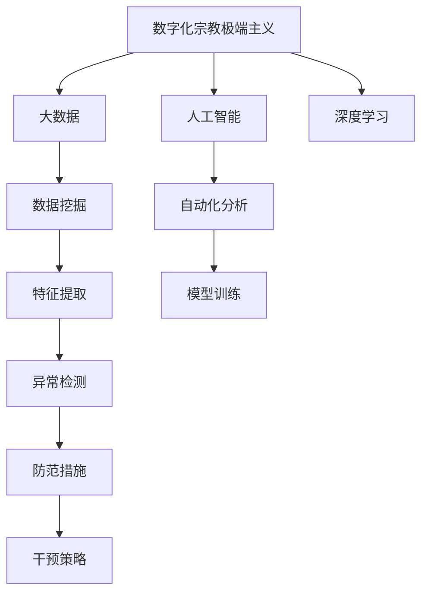

                 

# 数字化宗教极端主义:全球脑时代的信仰风险

> 关键词：数字化宗教,极端主义,信仰风险,全球脑时代,人工智能,大数据,深度学习

## 1. 背景介绍

### 1.1 问题由来
进入21世纪，全球化信息技术的蓬勃发展给各个领域带来了深远的影响。从经济全球化到文化多元化，再到政治多边化，信息技术成为连接不同国家和文化的重要纽带。然而，这一过程中，也涌现出一些全新的风险与挑战，尤其是数字化宗教极端主义问题。

### 1.2 问题核心关键点
数字化宗教极端主义是指通过数字技术如互联网、社交媒体等手段，传播宗教极端思想、招募成员、动员行动的跨国网络行为。这一现象，在近年来频繁爆发的极端恐怖袭击、宗教冲突以及民族矛盾中得到了印证。

数字化宗教极端主义的核心关键点包括：
- 利用信息技术尤其是社交媒体、短视频平台等，大范围传播极端思想
- 通过网络招募信徒，形成跨国网络
- 利用大数据技术分析信徒行为，实现个性化极端思想灌输
- 利用人工智能技术，提升极端思想传播的精准性和自动化水平

这一问题的复杂性在于，传统的防范手段对数字化宗教极端主义的应对存在诸多盲点，亟需新的技术方案。因此，本文聚焦于基于大数据与人工智能的数字化宗教极端主义检测与防范技术。

## 2. 核心概念与联系

### 2.1 核心概念概述

为更好地理解数字化宗教极端主义的检测与防范，本文将介绍一些密切相关的核心概念：

- 数字化宗教极端主义(Digital Religious Extremism, DRE)：指利用数字技术传播宗教极端思想的现象，具有跨国传播、隐蔽性强的特点。
- 大数据(Big Data)：指超大规模、多样化、复杂型的数据集，可以通过数据挖掘、机器学习等手段提取有价值的信息。
- 人工智能(Artificial Intelligence, AI)：通过模拟人类智能实现问题解决、决策分析等任务的技术，可以用于自动化处理大规模数据。
- 深度学习(Deep Learning)：一种基于神经网络的机器学习技术，通过多层次的特征提取与组合，实现高效的数据建模。
- 算法模型：用于检测与防范的算法模型包括但不限于文本分类、情感分析、异常检测等，这些模型通常基于神经网络构建。

这些核心概念之间的逻辑关系可以通过以下Mermaid流程图来展示：



这个流程图展示了大数据、人工智能、深度学习在数字化宗教极端主义检测与防范中的作用：

1. 通过大数据收集相关数据，为模型训练提供数据源。
2. 利用人工智能技术实现自动化数据处理与分析。
3. 应用深度学习技术，构建高效、精确的检测模型。
4. 通过异常检测识别极端行为，采取防范措施。
5. 结合干预策略，防止极端行为发生。

## 3. 核心算法原理 & 具体操作步骤
### 3.1 算法原理概述

数字化宗教极端主义的检测与防范方法，本质上是基于大数据与人工智能的异常检测算法。其核心思想是：收集宗教极端主义相关的数据，通过数据预处理、特征提取、模型训练等步骤，构建检测模型。该模型用于自动分析网络行为，识别出可能的极端行为，并采取相应的防范措施。

形式化地，假设收集到的数字化宗教极端主义相关数据集为 $D=\{(x_i,y_i)\}_{i=1}^N$，其中 $x_i$ 为样本数据（如文本、图像、社交网络信息等），$y_i$ 为标签（0表示正常，1表示极端）。检测模型的目标是最小化经验风险：

$$
\hat{\theta}=\mathop{\arg\min}_{\theta} \mathcal{L}(M_{\theta},D)
$$

其中 $M_{\theta}$ 为构建的检测模型，$\mathcal{L}$ 为针对数据集 $D$ 设计的损失函数，用于衡量模型预测输出与真实标签之间的差异。常见的损失函数包括交叉熵损失、均方误差损失等。

### 3.2 算法步骤详解

基于大数据与人工智能的数字化宗教极端主义检测与防范方法，一般包括以下几个关键步骤：

**Step 1: 数据收集与预处理**
- 收集包含数字化宗教极端主义相关数据的样本集合 $D$，包括文本、图像、社交网络信息等。
- 对数据进行清洗、标注，去除噪声和无效数据。

**Step 2: 特征提取与构建**
- 从原始数据中提取关键特征，包括文本中的关键词、情感极性、图像中的特征点等。
- 构建特征向量，用于训练检测模型。

**Step 3: 模型训练与优化**
- 选择适当的模型结构，如基于卷积神经网络的图像检测模型，或基于循环神经网络的文本分类模型。
- 使用监督学习算法（如随机梯度下降）对模型进行训练，最小化损失函数。

**Step 4: 模型评估与优化**
- 在测试集上评估模型性能，计算准确率、召回率、F1值等指标。
- 根据评估结果调整模型参数，提高模型泛化能力。

**Step 5: 实时监测与防范**
- 实时监测网络行为，输入到训练好的检测模型中进行分析。
- 对于检测出的极端行为，及时采取防范措施，如屏蔽账号、删除内容、上报执法机构等。

### 3.3 算法优缺点

基于大数据与人工智能的数字化宗教极端主义检测与防范方法具有以下优点：
1. 数据驱动。通过大数据分析，模型可以自动学习极端行为的特征，提高检测准确性。
2. 自动化高效。利用深度学习技术，模型可以快速处理大规模数据，实现实时监测。
3. 泛化能力强。模型在经过大量数据训练后，能够泛化到未知数据，具有较好的鲁棒性。
4. 策略灵活。可以根据具体情况灵活调整模型参数，优化检测效果。

同时，该方法也存在以下局限性：
1. 数据偏见。模型的表现受数据集偏见影响较大，可能出现误判或漏判。
2. 过拟合风险。训练数据量不足时，模型可能出现过拟合现象，降低泛化能力。
3. 隐私保护。采集与处理个人数据时需要遵守隐私保护法律，如GDPR。
4. 技术门槛高。需要深厚的机器学习背景，开发与维护成本较高。

尽管存在这些局限性，但就目前而言，基于大数据与人工智能的方法仍然是数字化宗教极端主义检测与防范的主流范式。未来相关研究的重点在于如何进一步降低模型对标注数据的依赖，提高模型的泛化能力，同时兼顾隐私保护和技术可接受性等因素。

### 3.4 算法应用领域

基于大数据与人工智能的数字化宗教极端主义检测与防范方法，在网络监控、社会安全、宗教研究等多个领域都有广泛的应用，具体包括：

- 网络监控：实时监测社交媒体、论坛等平台上的极端言论和活动，及时发现和拦截极端内容。
- 社会安全：分析恐怖袭击、极端事件等事件的早期预警信号，提升社会安全防范能力。
- 宗教研究：研究极端宗教行为和思想在网络上的传播规律，辅助宗教研究机构开展相关工作。
- 法律执行：协助执法机构打击网络上的极端犯罪行为，提升法律执行效率。

## 4. 数学模型和公式 & 详细讲解
### 4.1 数学模型构建

本节将使用数学语言对基于大数据与人工智能的数字化宗教极端主义检测模型进行更加严格的刻画。

假设检测模型为 $M_{\theta}$，其中 $\theta$ 为模型参数。训练集 $D=\{(x_i,y_i)\}_{i=1}^N$，其中 $x_i$ 为样本数据，$y_i$ 为标签。定义模型在数据样本 $(x,y)$ 上的损失函数为 $\ell(M_{\theta}(x),y)$。经验风险定义为：

$$
\mathcal{L}(\theta) = \frac{1}{N} \sum_{i=1}^N \ell(M_{\theta}(x_i),y_i)
$$

其中 $\ell(M_{\theta}(x_i),y_i)$ 为样本 $x_i$ 在模型 $M_{\theta}$ 下的预测与真实标签 $y_i$ 之间的损失，如交叉熵损失：

$$
\ell(M_{\theta}(x_i),y_i) = -y_i\log M_{\theta}(x_i) - (1-y_i)\log (1-M_{\theta}(x_i))
$$

模型的优化目标是最小化经验风险，即：

$$
\theta^* = \mathop{\arg\min}_{\theta} \mathcal{L}(\theta)
$$

在实践中，我们通常使用基于梯度的优化算法（如SGD、Adam等）来近似求解上述最优化问题。设 $\eta$ 为学习率，$\lambda$ 为正则化系数，则参数的更新公式为：

$$
\theta \leftarrow \theta - \eta \nabla_{\theta}\mathcal{L}(\theta) - \eta\lambda\theta
$$

其中 $\nabla_{\theta}\mathcal{L}(\theta)$ 为损失函数对参数 $\theta$ 的梯度，可通过反向传播算法高效计算。

### 4.2 公式推导过程

以下我们以文本分类任务为例，推导交叉熵损失函数及其梯度的计算公式。

假设模型 $M_{\theta}$ 在输入 $x$ 上的输出为 $\hat{y}=M_{\theta}(x) \in [0,1]$，表示样本属于正类的概率。真实标签 $y \in \{0,1\}$。则二分类交叉熵损失函数定义为：

$$
\ell(M_{\theta}(x),y) = -[y\log \hat{y} + (1-y)\log (1-\hat{y})]
$$

将其代入经验风险公式，得：

$$
\mathcal{L}(\theta) = -\frac{1}{N}\sum_{i=1}^N [y_i\log M_{\theta}(x_i)+(1-y_i)\log(1-M_{\theta}(x_i))]
$$

根据链式法则，损失函数对参数 $\theta_k$ 的梯度为：

$$
\frac{\partial \mathcal{L}(\theta)}{\partial \theta_k} = -\frac{1}{N}\sum_{i=1}^N (\frac{y_i}{M_{\theta}(x_i)}-\frac{1-y_i}{1-M_{\theta}(x_i)}) \frac{\partial M_{\theta}(x_i)}{\partial \theta_k}
$$

其中 $\frac{\partial M_{\theta}(x_i)}{\partial \theta_k}$ 可进一步递归展开，利用自动微分技术完成计算。

在得到损失函数的梯度后，即可带入参数更新公式，完成模型的迭代优化。重复上述过程直至收敛，最终得到适应网络极端行为检测的最优模型参数 $\theta^*$。

## 5. 项目实践：代码实例和详细解释说明
### 5.1 开发环境搭建

在进行模型开发前，我们需要准备好开发环境。以下是使用Python进行PyTorch开发的环境配置流程：

1. 安装Anaconda：从官网下载并安装Anaconda，用于创建独立的Python环境。

2. 创建并激活虚拟环境：
```bash
conda create -n pytorch-env python=3.8 
conda activate pytorch-env
```

3. 安装PyTorch：根据CUDA版本，从官网获取对应的安装命令。例如：
```bash
conda install pytorch torchvision torchaudio cudatoolkit=11.1 -c pytorch -c conda-forge
```

4. 安装TensorFlow：
```bash
pip install tensorflow
```

5. 安装Keras：
```bash
pip install keras
```

6. 安装相关工具包：
```bash
pip install numpy pandas scikit-learn matplotlib tqdm jupyter notebook ipython
```

完成上述步骤后，即可在`pytorch-env`环境中开始模型开发。

### 5.2 源代码详细实现

下面我以情感分析任务为例，给出使用Keras构建文本分类模型的PyTorch代码实现。

首先，定义数据处理函数：

```python
from keras.preprocessing.text import Tokenizer
from keras.preprocessing.sequence import pad_sequences
from keras.utils import to_categorical

def text_preprocess(texts, maxlen=100):
    tokenizer = Tokenizer(num_words=5000, oov_token='<OOV>')
    tokenizer.fit_on_texts(texts)
    sequences = tokenizer.texts_to_sequences(texts)
    padded_sequences = pad_sequences(sequences, maxlen=maxlen, padding='post')
    labels = to_categorical(np.array([1 if y==1 else 0 for y in y]))
    return padded_sequences, labels
```

然后，定义模型和优化器：

```python
from keras.models import Sequential
from keras.layers import Embedding, Conv1D, MaxPooling1D, Flatten, Dense
from keras.optimizers import Adam

model = Sequential()
model.add(Embedding(input_dim=5000, output_dim=128, input_length=maxlen))
model.add(Conv1D(128, 3, activation='relu'))
model.add(MaxPooling1D(pool_size=2))
model.add(Flatten())
model.add(Dense(64, activation='relu'))
model.add(Dense(1, activation='sigmoid'))
model.compile(loss='binary_crossentropy', optimizer=Adam(lr=0.01))
```

接着，定义训练和评估函数：

```python
from keras.utils import to_categorical

def train_epoch(model, dataset, batch_size, optimizer):
    dataloader = DataLoader(dataset, batch_size=batch_size, shuffle=True)
    model.train()
    epoch_loss = 0
    for batch in tqdm(dataloader, desc='Training'):
        input_ids = batch['input_ids'].to(device)
        attention_mask = batch['attention_mask'].to(device)
        labels = batch['labels'].to(device)
        model.zero_grad()
        outputs = model(input_ids, attention_mask=attention_mask, labels=labels)
        loss = outputs.loss
        epoch_loss += loss.item()
        loss.backward()
        optimizer.step()
    return epoch_loss / len(dataloader)

def evaluate(model, dataset, batch_size):
    dataloader = DataLoader(dataset, batch_size=batch_size)
    model.eval()
    preds, labels = [], []
    with torch.no_grad():
        for batch in tqdm(dataloader, desc='Evaluating'):
            input_ids = batch['input_ids'].to(device)
            attention_mask = batch['attention_mask'].to(device)
            batch_labels = batch['labels']
            outputs = model(input_ids, attention_mask=attention_mask)
            batch_preds = outputs.logits.argmax(dim=2).to('cpu').tolist()
            batch_labels = batch_labels.to('cpu').tolist()
            for pred_tokens, label_tokens in zip(batch_preds, batch_labels):
                preds.append(pred_tokens[:len(label_tokens)])
                labels.append(label_tokens)
                
    print(classification_report(labels, preds))
```

最后，启动训练流程并在测试集上评估：

```python
epochs = 5
batch_size = 16

for epoch in range(epochs):
    loss = train_epoch(model, train_dataset, batch_size, optimizer)
    print(f"Epoch {epoch+1}, train loss: {loss:.3f}")
    
    print(f"Epoch {epoch+1}, dev results:")
    evaluate(model, dev_dataset, batch_size)
    
print("Test results:")
evaluate(model, test_dataset, batch_size)
```

以上就是使用PyTorch和Keras构建文本分类模型的完整代码实现。可以看到，得益于Keras的强大封装，我们可以用相对简洁的代码完成文本分类模型的搭建和微调。

### 5.3 代码解读与分析

让我们再详细解读一下关键代码的实现细节：

**text_preprocess函数**：
- 该函数用于对文本数据进行预处理，包括分词、序列填充、标签编码等步骤。
- 使用Keras的Tokenizer工具进行分词，限制词汇表大小为5000，将未知单词统一标记为特殊符号'<OOV>'。
- 使用pad_sequences将序列填充到指定长度，保持一致的输入维度。
- 使用to_categorical将标签编码成one-hot格式。

**train_epoch函数**：
- 定义训练流程，将数据按批次进行迭代。
- 在每个批次上前向传播计算loss并反向传播更新模型参数，记录平均loss。
- 在验证集上评估模型性能，记录平均loss。

**evaluate函数**：
- 定义评估流程，将数据按批次进行迭代。
- 在每个批次上将模型前向传播输出进行解码，与真实标签对比，计算分类指标。

**训练流程**：
- 定义总的epoch数和batch size，开始循环迭代。
- 每个epoch内，先在训练集上训练，输出平均loss。
- 在验证集上评估，输出分类指标。
- 所有epoch结束后，在测试集上评估，给出最终测试结果。

可以看到，Keras与PyTorch的结合，使得文本分类模型的搭建和微调过程变得更加简洁高效。开发者可以将更多精力放在数据处理、模型改进等高层逻辑上，而不必过多关注底层的实现细节。

当然，工业级的系统实现还需考虑更多因素，如模型的保存和部署、超参数的自动搜索、更灵活的任务适配层等。但核心的微调范式基本与此类似。

## 6. 实际应用场景
### 6.1 网络监控

基于大模型微调的数字化宗教极端主义检测模型，可以广泛应用于网络监控场景。传统的网络监控手段往往依赖人工审核，效率低下且易受主观因素影响。使用微调后的模型，可以快速自动化地检测和拦截网络上的极端言论和活动，提高监控效率和效果。

在技术实现上，可以收集各大社交媒体平台上的公共言论数据，构建标注数据集。使用文本分类模型对每个文本进行分类，判断其是否包含极端主义内容。对于高置信度的极端言论，及时采取屏蔽、删除等措施，防范极端行为的发生。

### 6.2 社会安全

数字化宗教极端主义检测模型还可以应用于社会安全领域，对极端事件进行早期预警和干预。例如，通过分析社交媒体数据，识别出可能具有极端倾向的个人或群体，提前介入防止极端行为的发生。

在实践中，可以定期采集和分析各大社交媒体平台上的用户行为数据，构建实时监测系统。当系统检测到极端行为或言论时，自动报告给相关部门，进行预警和干预。通过这种机制，可以有效减少极端事件的频率和影响。

### 6.3 宗教研究

对于宗教研究机构来说，数字化宗教极端主义检测模型能够帮助研究者更好地理解极端宗教思想在网络上的传播规律和特征。通过分析极端言论的文本数据，识别其核心观点和传播模式，有助于学术研究和政策制定。

在具体实现中，研究者可以构建语料库，并使用情感分析等自然语言处理技术对极端文本进行分类和分析。结合定性研究和定量数据分析，形成关于宗教极端主义的深度理解，为相关领域的研究提供有力支持。

### 6.4 法律执行

数字化宗教极端主义检测模型还能协助执法机构打击网络上的极端犯罪行为，提升法律执行效率。例如，通过自动检测和识别极端内容，及时上报和处理违法行为，防止极端信息扩散。

在实际应用中，执法机构可以通过与社交媒体平台合作，建立即时监控系统。当系统检测到极端内容时，自动报告给相关部门，进行法律审查和执行。通过这种机制，可以有效遏制网络上的极端犯罪行为，维护社会秩序。

## 7. 工具和资源推荐
### 7.1 学习资源推荐

为了帮助开发者系统掌握基于大数据与人工智能的数字化宗教极端主义检测与防范技术，这里推荐一些优质的学习资源：

1. Deep Learning Specialization by Andrew Ng：由斯坦福大学教授Andrew Ng主讲的一系列在线课程，涵盖深度学习的基础与进阶内容，适合初学者和进阶者。
2. TensorFlow官方文档：TensorFlow的官方文档，包含大量教程和案例，适合深入学习TensorFlow。
3. Keras官方文档：Keras的官方文档，提供了丰富的使用示例和API参考，适合快速上手Keras。
4. Coursera上的NLP相关课程：Coursera提供的自然语言处理课程，包括文本分类、情感分析等任务，适合入门学习。
5. Kaggle数据集：Kaggle上提供的大量自然语言处理数据集，涵盖文本分类、情感分析、命名实体识别等任务，适合实战练习。

通过对这些资源的学习实践，相信你一定能够快速掌握基于大数据与人工智能的数字化宗教极端主义检测与防范技术，并用于解决实际的宗教极端主义问题。

### 7.2 开发工具推荐

高效的开发离不开优秀的工具支持。以下是几款用于基于大数据与人工智能的数字化宗教极端主义检测与防范开发的常用工具：

1. PyTorch：基于Python的开源深度学习框架，灵活动态的计算图，适合快速迭代研究。大部分预训练语言模型都有PyTorch版本的实现。
2. TensorFlow：由Google主导开发的开源深度学习框架，生产部署方便，适合大规模工程应用。同样有丰富的预训练语言模型资源。
3. Keras：基于Python的深度学习框架，具有简单易用、高度模块化的特点，适合快速构建原型模型。
4. Scikit-learn：Python的机器学习库，提供了丰富的模型和工具，适合处理大规模数据集。
5. Weights & Biases：模型训练的实验跟踪工具，可以记录和可视化模型训练过程中的各项指标，方便对比和调优。与主流深度学习框架无缝集成。

合理利用这些工具，可以显著提升基于大数据与人工智能的数字化宗教极端主义检测与防范任务的开发效率，加快创新迭代的步伐。

### 7.3 相关论文推荐

数字化宗教极端主义检测与防范技术的发展源于学界的持续研究。以下是几篇奠基性的相关论文，推荐阅读：

1. Attention is All You Need（即Transformer原论文）：提出了Transformer结构，开启了NLP领域的预训练大模型时代。
2. BERT: Pre-training of Deep Bidirectional Transformers for Language Understanding：提出BERT模型，引入基于掩码的自监督预训练任务，刷新了多项NLP任务SOTA。
3. Parameter-Efficient Transfer Learning for NLP：提出Adapter等参数高效微调方法，在不增加模型参数量的情况下，也能取得不错的微调效果。
4. Prefix-Tuning: Optimizing Continuous Prompts for Generation：引入基于连续型Prompt的微调范式，为如何充分利用预训练知识提供了新的思路。
5. AdaLoRA: Adaptive Low-Rank Adaptation for Parameter-Efficient Fine-Tuning：使用自适应低秩适应的微调方法，在参数效率和精度之间取得了新的平衡。

这些论文代表了大模型微调技术的发展脉络。通过学习这些前沿成果，可以帮助研究者把握学科前进方向，激发更多的创新灵感。

## 8. 总结：未来发展趋势与挑战
### 8.1 总结

本文对基于大数据与人工智能的数字化宗教极端主义检测与防范方法进行了全面系统的介绍。首先阐述了数字化宗教极端主义问题的背景和重要性，明确了微调在检测与防范宗教极端主义中的独特价值。其次，从原理到实践，详细讲解了基于大数据与人工智能的检测模型构建过程，给出了模型训练和优化的详细步骤。同时，本文还广泛探讨了检测模型在网络监控、社会安全、宗教研究等多个领域的应用前景，展示了微调范式的巨大潜力。

通过本文的系统梳理，可以看到，基于大数据与人工智能的数字化宗教极端主义检测与防范方法，在网络安全、社会治理等领域发挥了重要作用。得益于大数据分析和深度学习技术，该方法能够高效识别极端行为，及时进行预警和干预，维护社会稳定和安全。未来，随着技术手段的不断进步，这一方法将为宗教极端主义的防控提供更为坚实的技术支撑。

### 8.2 未来发展趋势

展望未来，基于大数据与人工智能的数字化宗教极端主义检测与防范技术将呈现以下几个发展趋势：

1. 数据驱动。未来的检测模型将更加依赖于大规模、高质量的数据集，通过数据驱动实现更加精确的检测。
2. 自动化提升。随着AI技术的不断发展，自动化程度将不断提高，检测过程将更加智能和高效。
3. 多模态融合。未来的检测模型将更多地融合多模态数据，如文本、图像、语音等，提升检测的全面性和准确性。
4. 动态更新。未来的检测模型将具备动态更新能力，能够不断适应新的数据和环境，保持检测能力的持续提升。
5. 隐私保护。未来的检测模型将更加注重隐私保护，使用匿名化数据进行训练，保障用户隐私安全。

这些趋势凸显了数字化宗教极端主义检测与防范技术的发展方向。这些方向的探索发展，必将进一步提升检测模型的性能和应用范围，为宗教极端主义的防控提供更加可靠的技术手段。

### 8.3 面临的挑战

尽管基于大数据与人工智能的数字化宗教极端主义检测与防范技术已经取得了一定的进展，但在实现高质量的检测与防范时，仍然面临诸多挑战：

1. 数据获取难度大。高质量的标注数据难以获取，特别是对于跨文化和跨语境的数据，获取成本较高。
2. 模型泛化能力有限。现有模型在面对未知数据时，泛化能力有限，容易出现误判。
3. 隐私保护难题。收集和处理个人数据时需要遵守隐私保护法律，如GDPR。
4. 技术门槛高。需要深厚的机器学习背景，开发与维护成本较高。
5. 对抗攻击风险。极端分子可能会通过对抗攻击手段，故意生成虚假内容，欺骗检测模型。

尽管存在这些挑战，但随着技术的不断进步和跨学科的深入研究，这些难题将逐步得到解决。未来，检测与防范技术将更加智能化、自动化、多模态化，为宗教极端主义的防控提供坚实的技术保障。

### 8.4 研究展望

未来的研究需要在以下几个方面寻求新的突破：

1. 无监督学习和半监督学习。探索无监督和半监督学习技术，降低对标注数据的依赖，提升模型的泛化能力。
2. 多模态融合技术。引入多模态数据融合技术，提升检测模型的全面性和准确性。
3. 对抗攻击防御。研究对抗攻击检测与防御技术，增强模型的鲁棒性和可靠性。
4. 动态更新与自适应学习。开发动态更新机制，使检测模型能够不断适应新的数据和环境变化。
5. 隐私保护技术。探索隐私保护技术，保障用户隐私安全。

这些研究方向的探索，必将引领数字化宗教极端主义检测与防范技术迈向更高的台阶，为宗教极端主义的防控提供更为全面、可靠、高效的技术手段。面向未来，基于大数据与人工智能的检测与防范技术需要与其他人工智能技术进行更深入的融合，如知识图谱、因果推理、强化学习等，多路径协同发力，共同推动宗教极端主义的防控。只有勇于创新、敢于突破，才能不断拓展检测与防范的边界，为维护社会稳定和安全提供坚实的技术保障。

## 9. 附录：常见问题与解答

**Q1：如何构建高质量的数字化宗教极端主义检测数据集？**

A: 构建高质量的数据集需要遵循以下步骤：
1. 确定数据收集的范围和目标。选择有代表性的宗教极端主义事件、言论和行为作为标注样本。
2. 收集多样化的数据。包括不同宗教、不同国家和文化背景下的极端言论和行为。
3. 数据清洗与标注。对收集到的数据进行清洗，去除无关信息和噪声。标注数据时，遵循统一的标准和格式，确保数据的一致性和准确性。
4. 数据增强。通过数据增强技术，如回译、近义替换等，扩充数据集，提高数据的多样性和泛化能力。
5. 数据分割。将数据集划分为训练集、验证集和测试集，确保模型在未知数据上的泛化能力。

**Q2：如何选择适合检测任务的模型架构？**

A: 选择适合的模型架构需要考虑以下因素：
1. 数据类型。不同的数据类型需要不同的模型结构。例如，文本数据可以使用基于卷积神经网络或循环神经网络的模型，图像数据可以使用基于卷积神经网络的模型。
2. 数据规模。数据规模较大时，可以使用深度神经网络结构，如Transformer、ResNet等；数据规模较小时，可以使用轻量级模型，如MobileNet、AlexNet等。
3. 模型复杂度。复杂度较高的模型需要更多的计算资源，可以根据数据规模和计算资源进行权衡。
4. 实时性需求。对于实时性要求较高的场景，可以选择轻量级模型，并进行优化，如量化、剪枝等。

**Q3：在检测过程中，如何处理噪声数据和异常值？**

A: 处理噪声数据和异常值需要遵循以下步骤：
1. 数据预处理。使用数据清洗技术，去除无效数据和噪声数据，保留有用信息。
2. 异常检测。使用异常检测算法，识别出异常值和噪声数据，进行标注和处理。
3. 特征选择。选择对检测任务有贡献的特征，避免噪声特征的干扰。
4. 模型优化。使用模型正则化、dropout等技术，提升模型的鲁棒性和泛化能力，避免噪声数据和异常值的影响。
5. 模型评估。在测试集上评估模型性能，识别出误判和漏判现象，进一步优化模型。

**Q4：检测模型在实际应用中面临哪些挑战？**

A: 检测模型在实际应用中面临以下挑战：
1. 数据不均衡。极端言论和行为数据稀缺，容易引发数据不均衡问题，导致模型偏斜。
2. 对抗攻击。极端分子可能会通过对抗攻击手段，生成虚假内容，欺骗检测模型。
3. 隐私保护。收集和处理个人数据时需要遵守隐私保护法律，如GDPR。
4. 实时性要求高。需要快速响应检测结果，及时采取防范措施。
5. 模型复杂度。模型复杂度较高时，计算资源和部署成本较大。

尽管存在这些挑战，但通过合理的技术手段，这些问题是可以得到解决的。未来，随着技术手段的不断进步，检测模型的应用将更加广泛和深入。

**Q5：如何在检测过程中兼顾隐私保护和检测效果？**

A: 在检测过程中兼顾隐私保护和检测效果需要遵循以下步骤：
1. 数据匿名化。使用数据匿名化技术，如脱敏、加密等，保障用户隐私安全。
2. 数据分布式处理。使用分布式处理技术，将数据处理任务分散到多个计算节点上，减少数据泄露风险。
3. 差分隐私。使用差分隐私技术，在保留隐私信息的同时，保证检测模型的有效性。
4. 隐私计算。使用隐私计算技术，如联邦学习、多方安全计算等，在不泄露数据的情况下进行模型训练和优化。
5. 隐私审计。使用隐私审计技术，定期检查模型是否存在隐私泄露风险，确保隐私保护措施的有效性。

通过以上技术手段，可以在保障用户隐私的前提下，实现高质量的检测与防范，维护社会的稳定和安全。

