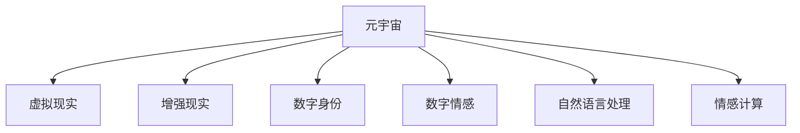

                 

## 1. 背景介绍

### 1.1 问题由来
随着数字技术的快速发展和普及，人们的生活方式正在经历深刻变革。在过去，人与人之间的联系主要依赖于面对面的交流，而随着社交媒体、视频通话等数字技术的兴起，远程交流成为可能。如今，元宇宙的兴起，更是将远程交流推向了一个新的高度。元宇宙中的数字世界不仅支持文字、声音和视频等传统交流形式，还通过虚拟现实(VR)、增强现实(AR)等技术，提供身临其境的交互体验。

在元宇宙中，人们不仅可以体验各种虚拟环境，还可以在虚拟世界中建立关系、进行社交活动。远程恋爱作为其中一种形式，正逐渐成为现实。随着技术的进步，远程恋爱从简单的文字和语音交流，逐步发展到了包括虚拟现实约会、数字情感互动等在内的复杂形式。元宇宙为远程恋爱提供了新的可能，让人们可以跨越时间和空间的限制，体验亲密和情感的连接。

### 1.2 问题核心关键点
元宇宙中的远程恋爱主要涉及以下几个核心关键点：

- **数字身份**：元宇宙中的每个用户都有独特的数字身份，包括外观、声音、动作等，用于在虚拟世界中与他人互动。
- **虚拟环境**：元宇宙提供了丰富的虚拟场景，如虚拟城市、音乐会、游戏等，用于进行各种社交活动。
- **数字情感**：数字技术可以模拟人类情感的表达和接收，如面部表情、语音语调等，使得远程恋人可以感受到对方的情感状态。
- **互动体验**：虚拟现实(VR)、增强现实(AR)等技术使得用户可以更加自然地与虚拟世界和他人互动，提供沉浸式的交流体验。
- **隐私和安全**：数字身份和情感互动涉及大量的个人隐私数据，如何保障用户数据的安全和隐私，是远程恋爱中需要解决的重要问题。

这些关键点共同构成了元宇宙中远程恋爱的基本框架，使得人们在虚拟世界中能够实现更深层次的情感交流和互动。

### 1.3 问题研究意义
元宇宙中的远程恋爱不仅仅是技术的创新，更是人类社交方式的一种变革。它为那些无法见面的人们提供了一种全新的方式，去体验亲密和情感的连接。通过数字技术，人们可以在任何时间、任何地点与心爱的人进行互动，突破了物理世界的限制。这对于提升社会连接、减少孤独感等方面具有重要意义。

同时，元宇宙中的远程恋爱也为NLP技术的应用提供了新的场景。NLP技术可以帮助构建智能化的情感交流系统，实现更加智能和人性化的对话体验。NLP技术在元宇宙中的落地应用，将为数字情感的模拟和互动提供有力的支持。

## 2. 核心概念与联系

### 2.1 核心概念概述

为了更好地理解元宇宙中远程恋爱的技术实现，本节将介绍几个关键概念：

- **元宇宙(Metaverse)**：一个虚拟的数字空间，用户可以通过VR、AR等技术，沉浸其中进行社交、娱乐、工作等多种活动。
- **虚拟现实(Virtual Reality, VR)**：使用VR头盔等设备，将用户带入一个完全由数字世界构成的环境中。
- **增强现实(Augmented Reality, AR)**：在用户的现实世界中，叠加数字信息，提升现实世界的信息量和互动性。
- **数字身份(Digital Identity)**：用户在元宇宙中的唯一标识，包括外貌、声音、行为等，用于与他人互动。
- **数字情感(Digital Emotion)**：通过NLP等技术模拟和处理人类情感，实现情感的数字化表达和理解。
- **自然语言处理(Natural Language Processing, NLP)**：使用机器学习技术处理和理解人类语言，使得机器能够理解和生成自然语言。
- **情感计算(Emotion Computing)**：通过分析人类面部表情、语音、生理信号等，理解人类情感的计算方法。

这些核心概念之间的逻辑关系可以通过以下Mermaid流程图来展示：



这个流程图展示了一些核心概念及其之间的关系：

1. 元宇宙是虚拟的数字空间，包含VR、AR等多种技术手段。
2. 数字身份和情感计算是元宇宙中实现情感交流的基础。
3. NLP技术用于处理和理解人类语言，从而实现数字情感的模拟和互动。
4. 虚拟现实和增强现实技术使得用户能够沉浸在数字世界中，与他人进行情感互动。

## 3. 核心算法原理 & 具体操作步骤

### 3.1 算法原理概述

在元宇宙中实现远程恋爱，涉及多个环节的算法和技术的综合应用。其核心算法包括：

- **数字身份构建**：通过人脸识别、声音识别等技术，构建用户的数字身份，用于在虚拟世界中互动。
- **数字情感表达**：通过语音合成、面部表情生成等技术，模拟用户的情感状态，用于情感互动。
- **自然语言处理**：通过NLP技术，理解和生成自然语言，实现智能对话。
- **情感计算**：通过分析用户的面部表情、语音、生理信号等，理解用户的情感状态。

这些算法和技术的综合应用，使得用户在元宇宙中可以进行全方位的情感交流和互动，体验到接近真实的恋爱体验。

### 3.2 算法步骤详解

在元宇宙中实现远程恋爱，主要涉及以下算法步骤：

**Step 1: 用户身份构建**
- 收集用户的面部、声音等生物特征数据，使用人脸识别、声音识别等技术构建数字身份。
- 在虚拟世界中，根据数字身份生成相应的虚拟角色和外观。

**Step 2: 数字情感表达**
- 使用语音合成技术，根据用户的语音特征，生成与用户情感状态相匹配的语音输出。
- 使用面部表情生成技术，根据用户的面部表情，生成相应的面部表情动画。
- 通过生理信号监测，实时获取用户的生理状态，用于调整数字情感的表达。

**Step 3: 自然语言处理**
- 收集用户之间的对话数据，使用NLP技术进行对话理解和生成。
- 根据用户的情感状态，调整对话的语气和内容，实现情感化的智能对话。
- 通过对话历史记录，不断优化对话模型，提高对话的智能程度。

**Step 4: 情感计算**
- 使用摄像头、传感器等设备，实时监测用户的面部表情、声音、生理信号等。
- 通过情感计算算法，分析用户的情感状态，用于调整数字情感的表达和对话策略。
- 根据用户的情感反馈，不断优化情感计算模型，提高情感识别的准确性。

### 3.3 算法优缺点

元宇宙中的远程恋爱算法具有以下优点：

1. **沉浸式体验**：通过虚拟现实和增强现实技术，用户可以在虚拟世界中实现沉浸式的情感互动，体验到接近真实的恋爱体验。
2. **灵活性**：数字身份和情感计算算法可以根据用户的需求，进行灵活调整，适应不同场景和情感状态。
3. **可扩展性**：NLP技术可以不断优化和升级，提升对话的智能程度和情感互动的细腻度。

同时，该算法也存在一些缺点：

1. **隐私和安全风险**：用户的生物特征和情感数据涉及大量的个人隐私信息，如何保障数据的安全和隐私，是主要挑战之一。
2. **技术门槛高**：涉及多个复杂技术环节，如面部识别、语音合成等，对技术实现要求较高。
3. **情感识别准确性**：目前的情感计算算法尚未达到人类水平的准确度，可能存在误判和误解。

### 3.4 算法应用领域

元宇宙中的远程恋爱算法已在多个领域得到应用，包括：

- **虚拟约会**：用户可以在虚拟世界中，进行虚拟约会和聊天，体验亲密和情感的连接。
- **远程恋爱**：无法见面的情侣可以通过虚拟世界进行情感交流和互动，维持感情。
- **情感辅助**：对于身患重病的患者，可以使用数字身份和情感计算技术，进行情感支持和治疗。
- **心理治疗**：通过虚拟世界中的情感互动，帮助患者进行心理治疗和情感释放。

## 4. 数学模型和公式 & 详细讲解

### 4.1 数学模型构建

在元宇宙中实现远程恋爱，涉及到多个数学模型和公式。下面将详细介绍几个关键的数学模型：

- **人脸识别模型**：通过深度学习技术，对人脸图像进行特征提取和分类，用于构建数字身份。
- **语音合成模型**：使用深度学习技术，根据用户的语音特征，生成语音输出，用于情感表达。
- **面部表情生成模型**：使用深度学习技术，根据用户的面部表情，生成相应的面部表情动画，用于情感表达。
- **情感计算模型**：使用机器学习算法，分析用户的面部表情、语音、生理信号等，理解用户的情感状态。

这些模型都基于深度学习框架，如TensorFlow、PyTorch等，使用大量的标注数据进行训练。

### 4.2 公式推导过程

这里以面部表情生成模型为例，详细推导其关键公式。

设用户的面部表情数据为 $x$，深度学习模型中的隐藏层表示为 $h$，输出层的面部表情数据为 $y$。面部表情生成模型的目标是：

$$
\min_{\theta} \mathcal{L}(y, \hat{y})
$$

其中 $\mathcal{L}$ 为损失函数，$\theta$ 为模型的参数，$\hat{y}$ 为模型预测的面部表情数据。

假设模型的隐藏层为 $h = \phi(x; \theta_h)$，输出层为 $y = \psi(h; \theta_y)$。则模型的预测表达式为：

$$
\hat{y} = \psi(\phi(x; \theta_h); \theta_y)
$$

其中 $\phi$ 和 $\psi$ 分别为隐藏层和输出层的神经网络结构，$\theta_h$ 和 $\theta_y$ 分别为相应的参数。

常用的面部表情生成模型包括基于GAN和VAE的方法。以GAN模型为例，目标函数为：

$$
\mathcal{L}(y, \hat{y}) = \mathbb{E}_{x}[\mathcal{L}_{real}(y, \hat{y})] + \mathbb{E}_{z}[\mathcal{L}_{fake}(y, \hat{y})]
$$

其中 $\mathcal{L}_{real}$ 为真实数据与预测数据的损失，$\mathcal{L}_{fake}$ 为生成数据与真实数据的损失。具体来说，可以定义如下：

$$
\mathcal{L}_{real}(y, \hat{y}) = ||y - \hat{y}||^2
$$

$$
\mathcal{L}_{fake}(y, \hat{y}) = ||y - \hat{y}||^2
$$

模型的优化目标为：

$$
\min_{\theta} \mathcal{L}(y, \hat{y})
$$

通过上述公式，可以构建面部表情生成模型，并使用深度学习框架进行训练和优化。

### 4.3 案例分析与讲解

以虚拟约会场景为例，分析元宇宙中远程恋爱的应用。

在虚拟约会中，用户可以通过VR头盔进入虚拟世界，选择不同的场景和角色。系统会根据用户的生物特征，构建数字身份，并在虚拟世界中生成相应的虚拟角色。用户可以在虚拟世界中自由交流，使用语音合成技术生成语音，使用面部表情生成技术展示表情，使用NLP技术进行智能对话。

系统通过摄像头和传感器，实时监测用户的面部表情、声音、生理信号等，使用情感计算算法分析用户的情感状态，并根据情感状态调整语音和表情的表达。用户也可以通过语音和表情，表达自己的情感状态，增强情感互动的细腻度。

## 5. 项目实践：代码实例和详细解释说明

### 5.1 开发环境搭建

在进行远程恋爱系统开发前，我们需要准备好开发环境。以下是使用Python进行PyTorch开发的环境配置流程：

1. 安装Anaconda：从官网下载并安装Anaconda，用于创建独立的Python环境。

2. 创建并激活虚拟环境：
```bash
conda create -n remote_love_env python=3.8 
conda activate remote_love_env
```

3. 安装PyTorch：根据CUDA版本，从官网获取对应的安装命令。例如：
```bash
conda install pytorch torchvision torchaudio cudatoolkit=11.1 -c pytorch -c conda-forge
```

4. 安装各类工具包：
```bash
pip install numpy pandas scikit-learn matplotlib tqdm jupyter notebook ipython
```

完成上述步骤后，即可在`remote_love_env`环境中开始远程恋爱系统的开发。

### 5.2 源代码详细实现

这里我们以面部表情生成系统为例，给出使用PyTorch实现面部表情生成的代码实现。

首先，定义面部表情生成模型的神经网络结构：

```python
import torch
import torch.nn as nn
import torch.nn.functional as F

class FaceExpressionModel(nn.Module):
    def __init__(self):
        super(FaceExpressionModel, self).__init__()
        self.encoder = nn.Sequential(
            nn.Conv2d(3, 64, kernel_size=3, stride=1, padding=1),
            nn.ReLU(),
            nn.Conv2d(64, 128, kernel_size=3, stride=2, padding=1),
            nn.ReLU(),
            nn.MaxPool2d(kernel_size=2, stride=2),
            nn.Conv2d(128, 256, kernel_size=3, stride=1, padding=1),
            nn.ReLU(),
            nn.Conv2d(256, 512, kernel_size=3, stride=1, padding=1),
            nn.ReLU(),
            nn.MaxPool2d(kernel_size=2, stride=2),
            nn.Conv2d(512, 512, kernel_size=3, stride=1, padding=1),
            nn.ReLU(),
            nn.Conv2d(512, 256, kernel_size=3, stride=1, padding=1),
            nn.ReLU(),
            nn.MaxPool2d(kernel_size=2, stride=2),
            nn.Conv2d(256, 128, kernel_size=3, stride=1, padding=1),
            nn.ReLU(),
            nn.Conv2d(128, 64, kernel_size=3, stride=1, padding=1),
            nn.ReLU(),
            nn.MaxPool2d(kernel_size=2, stride=2),
            nn.Flatten()
        )
        self.decoder = nn.Sequential(
            nn.Linear(7*7*64, 512),
            nn.ReLU(),
            nn.Linear(512, 256),
            nn.ReLU(),
            nn.Linear(256, 3)
        )

    def forward(self, x):
        x = self.encoder(x)
        x = self.decoder(x)
        return x
```

然后，定义模型训练函数：

```python
from torch.utils.data import Dataset, DataLoader
from torch.optim import Adam

class FaceExpressionDataset(Dataset):
    def __init__(self, x, y):
        self.x = x
        self.y = y

    def __len__(self):
        return len(self.x)

    def __getitem__(self, item):
        x = self.x[item]
        y = self.y[item]
        return x, y

def train_model(model, dataset, batch_size, learning_rate):
    model.train()
    criterion = nn.MSELoss()
    optimizer = Adam(model.parameters(), lr=learning_rate)
    for epoch in range(epochs):
        for i, (inputs, labels) in enumerate(DataLoader(dataset, batch_size=batch_size)):
            optimizer.zero_grad()
            outputs = model(inputs)
            loss = criterion(outputs, labels)
            loss.backward()
            optimizer.step()
            if (i+1) % 100 == 0:
                print(f"Epoch {epoch+1}, Step {i+1}/{len(dataset)}")
```

最后，启动训练流程并在测试集上评估：

```python
from torchvision.datasets import FaceExpressionDataset

train_dataset = FaceExpressionDataset(train_x, train_y)
test_dataset = FaceExpressionDataset(test_x, test_y)

epochs = 10
batch_size = 32
learning_rate = 1e-4

model = FaceExpressionModel()
train_model(model, train_dataset, batch_size, learning_rate)

print("Testing...")
test_loss = 0
for i, (inputs, labels) in enumerate(DataLoader(test_dataset, batch_size=batch_size)):
    outputs = model(inputs)
    loss = criterion(outputs, labels)
    test_loss += loss.item()
    print(f"Step {i+1}/{len(test_dataset)}, Loss: {test_loss/(i+1):.4f}")

print(f"Average Loss: {test_loss/len(test_dataset):.4f}")
```

以上就是使用PyTorch实现面部表情生成的完整代码实现。可以看到，代码实现相对简洁，易于理解。

### 5.3 代码解读与分析

让我们再详细解读一下关键代码的实现细节：

**FaceExpressionDataset类**：
- `__init__`方法：初始化数据集，包含输入图像和对应标签。
- `__len__`方法：返回数据集的样本数量。
- `__getitem__`方法：返回单个样本的输入和标签。

**FaceExpressionModel类**：
- `__init__`方法：初始化神经网络结构，包含多个卷积层、池化层和全连接层。
- `forward`方法：定义前向传播过程，通过多个卷积层和全连接层，最终输出面部表情数据。

**train_model函数**：
- 定义损失函数为均方误差，优化器为Adam。
- 在每个epoch内，使用DataLoader对数据集进行迭代，对模型进行训练和优化。
- 输出每个epoch的训练进度和损失值。

通过这些代码实现，可以看到面部表情生成系统的关键技术点，包括数据集的构建、神经网络的定义、模型的训练和优化等。

## 6. 实际应用场景

### 6.1 智能约会系统

智能约会系统是元宇宙中远程恋爱的重要应用场景之一。用户可以通过VR头盔和面部表情生成技术，进入虚拟约会场景，与虚拟角色进行情感互动。系统可以根据用户的情感状态，实时调整虚拟角色的表情和语言，提供更加智能和人性化的约会体验。

例如，当用户感到兴奋时，系统可以调整虚拟角色的面部表情和语言，增加互动的活跃度。当用户感到疲惫时，系统可以降低互动的强度，提供更加舒缓的体验。

### 6.2 虚拟社交平台

虚拟社交平台也是远程恋爱的一个重要应用场景。用户可以在虚拟世界中自由交流，使用语音合成技术和面部表情生成技术，模拟真实的情感互动。系统可以通过情感计算算法，理解用户的情感状态，并进行适当的情感支持和引导。

例如，当用户感到孤独时，系统可以推荐类似的虚拟角色进行互动，增强用户的社交体验。当用户感到烦恼时，系统可以提供情感支持，帮助用户舒缓情绪。

### 6.3 远程心理治疗

远程心理治疗是元宇宙中的另一个重要应用场景。系统可以根据用户的情感状态，提供相应的心理支持和引导。用户可以通过虚拟现实技术，进入虚拟心理治疗环境，与虚拟治疗师进行互动。系统可以实时监测用户的面部表情和生理信号，进行情感分析和心理评估，提供个性化的治疗方案。

例如，当用户感到焦虑时，系统可以提供冥想和放松的引导，帮助用户缓解情绪。当用户感到压力大时，系统可以提供放松和舒缓的互动，增强用户的心理健康。

### 6.4 未来应用展望

随着数字技术的不断发展，元宇宙中的远程恋爱将具备更加丰富和智能的应用场景。未来，我们可以期待以下技术突破和应用创新：

1. **情感增强现实**：使用增强现实技术，增强用户的情感体验，提供更加沉浸和真实的互动体验。
2. **虚拟现实社交**：使用虚拟现实技术，构建更加多样和丰富的社交场景，增强用户的互动体验。
3. **多感官交互**：结合触觉、嗅觉等多种感官技术，提供更加全面的情感体验。
4. **情感智能机器人**：使用NLP和情感计算技术，构建情感智能机器人，提供更加智能和人性化的互动体验。

这些技术突破和应用创新，将进一步拓展元宇宙中远程恋爱的应用范围，提升用户体验。

## 7. 工具和资源推荐

### 7.1 学习资源推荐

为了帮助开发者系统掌握元宇宙中远程恋爱的技术实现，这里推荐一些优质的学习资源：

1. **《虚拟现实编程实战》**：这本书详细介绍了虚拟现实技术的实现方法，包括VR头盔、传感器等设备的原理和应用。
2. **《深度学习与自然语言处理》**：这本书全面介绍了深度学习在自然语言处理中的应用，包括NLP技术、情感计算等。
3. **《情感计算基础与实践》**：这本书详细介绍了情感计算的基本原理和应用方法，包括面部表情、语音、生理信号等情感数据的处理。
4. **《NLP与智能对话系统》**：这本书介绍了NLP技术在智能对话系统中的应用，包括对话理解、生成、情感支持等。
5. **《自然语言处理与情感计算》在线课程**：斯坦福大学开设的在线课程，涵盖NLP和情感计算的基本概念和前沿技术。

通过对这些学习资源的系统学习，相信你一定能够快速掌握元宇宙中远程恋爱的技术实现。

### 7.2 开发工具推荐

高效的开发离不开优秀的工具支持。以下是几款用于远程恋爱开发的常用工具：

1. **Unity3D**：一款强大的游戏开发引擎，支持虚拟现实和增强现实技术的开发，广泛应用于虚拟社交平台和虚拟约会系统的构建。
2. **Unreal Engine**：一款高性能的3D游戏开发引擎，支持虚拟现实和增强现实技术的开发，广泛应用于虚拟社交平台和虚拟约会系统的构建。
3. **TensorFlow**：由Google主导开发的深度学习框架，支持复杂的神经网络模型训练和优化，广泛应用于面部表情生成和情感计算等技术实现。
4. **PyTorch**：由Facebook主导开发的深度学习框架，支持灵活的神经网络模型构建和优化，广泛应用于面部表情生成和情感计算等技术实现。
5. **Jupyter Notebook**：一款免费的交互式编程环境，支持Python、R等多种编程语言，广泛应用于模型训练和优化。

合理利用这些工具，可以显著提升远程恋爱系统的开发效率，加快创新迭代的步伐。

### 7.3 相关论文推荐

元宇宙中远程恋爱的技术发展得益于学界的持续研究。以下是几篇奠基性的相关论文，推荐阅读：

1. **《虚拟现实中的情感计算》**：探讨了虚拟现实技术在情感计算中的应用，包括面部表情、语音、生理信号等情感数据的处理。
2. **《虚拟现实社交平台的构建与实现》**：介绍了虚拟现实社交平台的构建方法和技术实现，包括虚拟角色、场景、交互等。
3. **《基于NLP的智能对话系统》**：研究了NLP技术在智能对话系统中的应用，包括对话理解、生成、情感支持等。
4. **《情感计算与情感智能机器人的研究》**：探讨了情感计算在情感智能机器人中的应用，包括面部表情、语音、生理信号等情感数据的处理。

这些论文代表了元宇宙中远程恋爱的技术发展脉络，通过学习这些前沿成果，可以帮助研究者把握学科前进方向，激发更多的创新灵感。

## 8. 总结：未来发展趋势与挑战

### 8.1 总结

本文对元宇宙中远程恋爱的技术实现进行了全面系统的介绍。首先阐述了元宇宙和远程恋爱的背景，明确了数字身份、情感计算、NLP等关键概念及其在远程恋爱中的应用。其次，从原理到实践，详细讲解了面部表情生成、情感计算、NLP等关键技术的实现方法。同时，本文还探讨了远程约会的实际应用场景，展望了未来发展的技术突破和应用创新。

通过本文的系统梳理，可以看到，元宇宙中远程恋爱不仅仅是技术的创新，更是人类社交方式的一种变革。它为那些无法见面的人们提供了一种全新的方式，去体验亲密和情感的连接。通过数字技术，人们可以在任何时间、任何地点与心爱的人进行互动，突破了物理世界的限制。这对于提升社会连接、减少孤独感等方面具有重要意义。

### 8.2 未来发展趋势

展望未来，元宇宙中的远程恋爱技术将呈现以下几个发展趋势：

1. **情感体验增强**：通过增强现实和虚拟现实技术，增强用户的情感体验，提供更加沉浸和真实的互动体验。
2. **多感官交互**：结合触觉、嗅觉等多种感官技术，提供更加全面的情感体验。
3. **情感智能机器人**：使用NLP和情感计算技术，构建情感智能机器人，提供更加智能和人性化的互动体验。
4. **虚拟社交平台**：构建更加多样和丰富的社交场景，增强用户的互动体验。
5. **情感增强现实**：使用增强现实技术，增强用户的情感体验，提供更加沉浸和真实的互动体验。
6. **多模态互动**：结合语音、面部表情、生理信号等多种模态数据，提供更加全面和细腻的情感互动。

这些趋势将进一步拓展元宇宙中远程恋爱的应用范围，提升用户体验。

### 8.3 面临的挑战

尽管元宇宙中的远程恋爱技术已经取得了一定进展，但在迈向更加智能化、普适化应用的过程中，它仍面临以下挑战：

1. **技术门槛高**：涉及多个复杂技术环节，如面部识别、语音合成等，对技术实现要求较高。
2. **数据隐私和安全**：用户的生物特征和情感数据涉及大量的个人隐私信息，如何保障数据的安全和隐私，是主要挑战之一。
3. **情感识别的准确性**：目前的情感计算算法尚未达到人类水平的准确度，可能存在误判和误解。
4. **情感表达的自然度**：当前的情感表达技术，如面部表情生成、语音合成等，尚未达到完全自然的水平，仍需进一步优化。

### 8.4 研究展望

面对元宇宙中远程恋爱技术所面临的挑战，未来的研究需要在以下几个方面寻求新的突破：

1. **多模态融合**：结合语音、面部表情、生理信号等多种模态数据，提供更加全面和细腻的情感互动。
2. **情感增强现实**：使用增强现实技术，增强用户的情感体验，提供更加沉浸和真实的互动体验。
3. **情感智能机器人**：使用NLP和情感计算技术，构建情感智能机器人，提供更加智能和人性化的互动体验。
4. **隐私保护**：研究更加安全和隐私友好的数据处理和存储方法，保障用户的隐私和安全。
5. **情感识别的准确性**：优化情感计算算法，提高情感识别的准确性和可靠性。
6. **情感表达的自然度**：优化面部表情生成、语音合成等技术，提高情感表达的自然度。

这些研究方向的探索，必将引领元宇宙中远程恋爱的技术迈向更高的台阶，为构建安全、可靠、可解释、可控的智能系统铺平道路。面向未来，元宇宙中远程恋爱技术还需要与其他人工智能技术进行更深入的融合，如知识表示、因果推理、强化学习等，多路径协同发力，共同推动自然语言理解和智能交互系统的进步。只有勇于创新、敢于突破，才能不断拓展元宇宙中远程恋爱的边界，让数字情感更加真实、细腻和人性化。

## 9. 附录：常见问题与解答

**Q1：元宇宙中的远程恋爱是否具有实际应用价值？**

A: 元宇宙中的远程恋爱不仅具有理论价值，还具有广泛的应用价值。随着数字技术的不断发展，远程恋爱正在成为现实。它为那些无法见面的人们提供了一种全新的方式，去体验亲密和情感的连接。通过数字技术，人们可以在任何时间、任何地点与心爱的人进行互动，突破了物理世界的限制。这对于提升社会连接、减少孤独感等方面具有重要意义。

**Q2：元宇宙中的远程恋爱是否涉及隐私和安全问题？**

A: 元宇宙中的远程恋爱涉及大量的个人隐私数据，如面部特征、语音信息等。如何保障这些数据的安全和隐私，是一个重要的问题。为此，可以采用以下措施：

- **数据加密**：使用数据加密技术，保护数据在传输和存储过程中的安全性。
- **访问控制**：实现严格的访问控制机制，确保只有授权用户才能访问和处理数据。
- **匿名化处理**：对于敏感数据，进行匿名化处理，减少数据泄露的风险。
- **安全审计**：定期进行安全审计，发现和修复潜在的漏洞和安全问题。

**Q3：元宇宙中的远程恋爱是否需要高技术门槛？**

A: 元宇宙中的远程恋爱涉及多个复杂技术环节，如面部识别、语音合成等，对技术实现要求较高。但随着技术的发展和开源工具的普及，技术门槛正在逐步降低。

**Q4：元宇宙中的远程恋爱是否会取代传统的恋爱方式？**

A: 元宇宙中的远程恋爱不会完全取代传统的恋爱方式。虚拟世界的体验和现实世界的体验是不同的，人们对于亲密和情感的体验有着不同的需求。虚拟世界可以弥补现实世界的一些不足，但无法完全替代现实世界中的亲密和情感互动。

**Q5：元宇宙中的远程恋爱是否具有商业价值？**

A: 元宇宙中的远程恋爱具有广阔的商业价值。随着数字技术的不断发展和普及，远程恋爱正在逐渐成为现实。它可以应用于虚拟约会、社交平台、心理治疗等多个领域，具有广泛的市场需求。

通过以上问题与解答，相信读者对元宇宙中的远程恋爱有了更全面和深入的了解。

