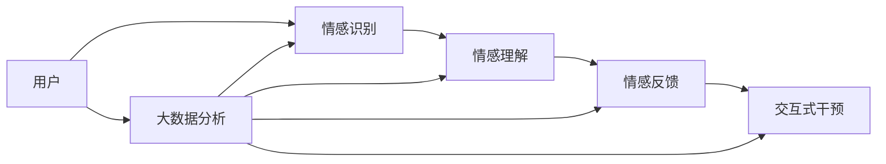

                 

## 1. 背景介绍

### 1.1 问题由来

在数字化时代的浪潮中，人与人之间的情感交流逐渐由传统的面对面转变为线上互动。然而，虚拟空间中的情感交流往往缺乏情感维度的传递和互动的即时性，导致人们在情感沟通中出现了诸多障碍和误解。特别是，网络欺凌、社交媒体上的恶劣互动、甚至是长期不见面的伴侣关系，都可能导致情感连接的破裂和关系的恶化。因此，针对线上情感交流的修复和维护变得尤为关键。

### 1.2 问题核心关键点

- **在线关系修复**：通过AI技术，分析线上交流中的情感线索和行为模式，识别潜在的情感问题。
- **情感理解与反馈**：利用自然语言处理(NLP)技术，理解用户情感，并给出基于AI的情感反馈，帮助用户修复关系。
- **交互式干预**：通过交互式AI界面，引导用户进行情感修复和自我反思，提升其情感修复能力。

### 1.3 问题研究意义

本研究旨在探讨利用AI技术，特别是自然语言处理和大数据技术，构建一个全方位的在线关系修复平台。该平台能够帮助用户识别和理解情感问题，提供有针对性的情感修复建议，并通过交互式干预促进情感关系的恢复和改善。其研究意义体现在：

1. **提升情感交流质量**：通过系统化的情感分析与修复策略，帮助用户更好地理解和管理自身情感，提升线上交流的质量和满意度。
2. **促进心理健康**：减少由情感问题引发的心理疾病，如孤独、抑郁等，提升用户的心理健康水平。
3. **增强社会连接**：通过修复受损的人际关系，促进社会的和谐与团结。
4. **推动AI在心理健康的应用**：将AI技术应用于心理健康领域，探索其广泛的应用前景。

## 2. 核心概念与联系

### 2.1 核心概念概述

1. **情感修复**：指通过识别、分析和干预，帮助用户修复受损的情感关系。这包括对线上互动中情感线索的识别、情感理解、情感反馈和交互式干预等。
2. **自然语言处理(NLP)**：利用计算机对自然语言进行理解和生成，特别是对用户表达的情感和行为的解析。
3. **交互式AI界面**：通过设计直观、易用的AI界面，引导用户进行情感分析、理解、反馈和修复，增强用户体验。
4. **大数据分析**：利用收集的用户数据，进行情感行为模式的分析，提取有价值的信息和知识。

### 2.2 核心概念原理和架构的 Mermaid 流程图



### 2.3 核心概念之间的联系

以上核心概念通过情感修复和理解、交互式界面设计和大数据分析等技术手段，共同构成了一个完整的在线关系修复系统。

- **情感识别和理解**：基于NLP技术，对用户输入的文本或语音进行情感分析和行为模式识别。
- **情感反馈**：根据情感识别结果，通过文本、声音或图片等形式，提供情感支持或指导。
- **交互式干预**：设计互动性强的界面，引导用户进行情感修复和自我反思，提升其情感管理能力。
- **大数据分析**：利用收集的数据，进行情感模式的分析，提取有价值的情感特征，优化情感修复策略。

## 3. 核心算法原理 & 具体操作步骤

### 3.1 算法原理概述

在线关系修复系统通过以下几个关键步骤实现情感修复：

1. **情感识别**：利用NLP技术，分析用户表达的情感和行为模式。
2. **情感理解**：通过机器学习算法，理解用户情感背后的深层原因和动机。
3. **情感反馈**：根据情感识别和理解结果，提供有针对性的情感支持和指导。
4. **交互式干预**：设计交互式界面，引导用户进行情感修复和自我反思。
5. **大数据分析**：利用收集的数据，进行情感行为模式分析，优化修复策略。

### 3.2 算法步骤详解

1. **情感识别**：
   - 通过文本分析，识别用户表达的情感（如开心、生气、失望等）。
   - 通过语音分析，识别用户语音的情感基调。
   - 通过行为模式分析，识别用户行为中隐含的情感状态。

2. **情感理解**：
   - 利用情感词典，解析用户文本中的情感关键词和强度。
   - 利用机器学习模型，理解情感背后的深层原因（如工作压力、孤独感、情感依赖等）。
   - 结合用户历史数据，进行情感模式识别，预测未来情感变化。

3. **情感反馈**：
   - 根据情感识别和理解结果，通过文本、声音或图片等形式，提供情感支持或指导。
   - 结合大数据分析结果，提供个性化的情感修复建议。

4. **交互式干预**：
   - 设计直观、易用的AI界面，引导用户进行情感分析、理解、反馈和修复。
   - 通过交互式问答，帮助用户识别和理解情感问题。
   - 提供自我反思和情感管理工具，帮助用户提升情感管理能力。

5. **大数据分析**：
   - 收集用户互动数据，进行情感行为模式分析，提取有价值的情感特征。
   - 结合用户行为数据和情感识别结果，优化情感修复策略。
   - 定期更新情感模型，提升情感识别的准确性和鲁棒性。

### 3.3 算法优缺点

#### 优点：
- **自动化和高效性**：利用AI技术，实现情感识别的自动化，高效处理海量数据。
- **个性化和定制化**：通过大数据分析，提供个性化的情感修复建议和干预。
- **实时性和即时性**：实时识别和反馈用户情感状态，快速提供情感支持。

#### 缺点：
- **数据隐私**：收集和使用用户数据需要严格遵守隐私保护规定。
- **情感理解的复杂性**：情感的理解和分析仍然面临一定挑战，难以完全理解人类复杂的情感。
- **交互式干预的局限性**：不同用户的情感状态和修复需求各异，个性化干预的设计和实施仍需改进。

### 3.4 算法应用领域

在线关系修复系统在多个领域都有广泛应用：

1. **心理健康**：帮助用户识别和理解自身情感问题，提供情感支持。
2. **社交媒体**：识别和干预网络欺凌和恶劣互动，促进健康社交环境。
3. **远程工作**：通过情感分析，识别员工压力和情绪波动，提供情感支持和干预。
4. **伴侣关系**：识别和修复伴侣间的情感问题，促进长期稳定的关系。
5. **家庭教育**：帮助家长识别和理解孩子的情感需求，提供情感支持和指导。

## 4. 数学模型和公式 & 详细讲解

### 4.1 数学模型构建

**情感识别**：
$$
\text{情感识别} = f(\text{文本分析}, \text{语音分析}, \text{行为模式分析})
$$

**情感理解**：
$$
\text{情感理解} = g(\text{情感词典}, \text{情感关键词}, \text{情感强度}, \text{情感模式})
$$

**情感反馈**：
$$
\text{情感反馈} = h(\text{情感识别结果}, \text{情感理解结果}, \text{大数据分析结果})
$$

**交互式干预**：
$$
\text{交互式干预} = i(\text{用户输入}, \text{情感理解结果}, \text{情感反馈结果})
$$

**大数据分析**：
$$
\text{大数据分析} = k(\text{用户互动数据}, \text{情感识别结果}, \text{情感理解结果})
$$

### 4.2 公式推导过程

**情感识别**：
- 文本分析：使用情感词典，对文本中情感关键词进行识别，计算情感强度。
$$
\text{情感强度} = \sum_{k} w_k \times \text{情感词典}_k
$$
其中 $w_k$ 为情感关键词 $k$ 的权重。

- 语音分析：利用音频特征，识别语音的情感基调。
$$
\text{情感基调} = f(\text{音频特征})
$$

- 行为模式分析：利用用户行为数据，识别行为模式中的情感状态。
$$
\text{情感状态} = h(\text{行为模式})
$$

**情感理解**：
- 情感词典：利用情感词典解析情感关键词，计算情感强度。
$$
\text{情感强度} = \sum_{k} w_k \times \text{情感词典}_k
$$

- 机器学习模型：使用情感识别结果，训练情感理解模型。
$$
\text{情感理解} = g(\text{情感识别结果}, \text{情感模式})
$$

**情感反馈**：
- 文本反馈：根据情感识别和理解结果，生成反馈文本。
$$
\text{反馈文本} = \text{模板}(\text{情感识别结果}, \text{情感理解结果})
$$

- 声音反馈：根据情感识别和理解结果，生成反馈声音。
$$
\text{反馈声音} = g(\text{情感识别结果}, \text{情感理解结果})
$$

**交互式干预**：
- 界面设计：设计直观易用的界面，引导用户进行情感分析、理解、反馈和修复。
$$
\text{界面设计} = d(\text{用户需求}, \text{情感理解结果}, \text{情感反馈结果})
$$

**大数据分析**：
- 情感行为模式分析：利用用户互动数据，识别情感行为模式。
$$
\text{情感模式} = k(\text{用户互动数据})
$$

- 情感特征提取：利用情感识别和理解结果，提取情感特征。
$$
\text{情感特征} = \text{特征提取算法}(\text{情感识别结果}, \text{情感理解结果})
$$

### 4.3 案例分析与讲解

假设一个用户在社交媒体上表达了愤怒情绪：
- **情感识别**：利用情感词典解析文本，识别出愤怒情绪，计算情感强度。
- **情感理解**：利用机器学习模型分析情感背后的深层原因，如工作压力。
- **情感反馈**：生成反馈文本，如“我理解你现在很生气，可能是工作压力太大，你可以试试通过运动来释放压力”。
- **交互式干预**：通过界面引导用户进行自我反思，如“请问你最近是否有压力大的事情发生？”，并提供缓解压力的建议。
- **大数据分析**：利用用户历史互动数据，识别类似情境下的情感模式，优化未来情感干预策略。

## 5. 项目实践：代码实例和详细解释说明

### 5.1 开发环境搭建

**环境配置**：
- **Python环境**：安装Python 3.x，推荐使用Anaconda或Miniconda创建虚拟环境。
- **依赖库**：安装情感分析相关的库，如NLTK、spaCy、TextBlob等。
- **深度学习框架**：选择TensorFlow或PyTorch，安装相应的版本。
- **数据集**：收集和预处理情感数据集，如IMDb电影评论、Twitter情感数据等。

### 5.2 源代码详细实现

**情感识别模块**：
```python
import nltk
from nltk.sentiment.vader import SentimentIntensityAnalyzer

# 初始化情感分析器
sia = SentimentIntensityAnalyzer()

# 分析文本情感
text = "I am very angry today!"
sentiment = sia.polarity_scores(text)

print(sentiment)
```

**情感理解模块**：
```python
from sklearn.feature_extraction.text import CountVectorizer
from sklearn.naive_bayes import MultinomialNB

# 加载数据集
X_train, y_train = load_data('train.csv')
X_test, y_test = load_data('test.csv')

# 文本向量化
vectorizer = CountVectorizer()
X_train_vec = vectorizer.fit_transform(X_train)
X_test_vec = vectorizer.transform(X_test)

# 训练朴素贝叶斯分类器
clf = MultinomialNB()
clf.fit(X_train_vec, y_train)

# 预测情感理解结果
y_pred = clf.predict(X_test_vec)

print(y_pred)
```

**情感反馈模块**：
```python
import random

# 生成随机反馈文本
def generate_feedback(text):
    sentiment = analyze_sentiment(text)
    if sentiment == "positive":
        feedback = "You seem happy today! Keep it up!"
    elif sentiment == "neutral":
        feedback = "Your feelings seem neutral. How can I help?"
    elif sentiment == "negative":
        feedback = "I can see you're upset. How can I help you feel better?"
    return feedback

# 示例
text = "I am very sad."
feedback = generate_feedback(text)
print(feedback)
```

**交互式干预模块**：
```python
import webbrowser

# 引导用户进行自我反思
def guide_reflection():
    with open('reflection.html', 'w') as f:
        f.write("What was the main reason for your emotions today? <br>")
        f.write("How did you handle the situation? <br>")
        f.write("What can you do differently next time?")
    webbrowser.open_new_tab('reflection.html')
```

### 5.3 代码解读与分析

**情感识别模块**：
- 利用NLTK库中的情感分析器，对用户输入的文本进行情感分析，返回情感强度和极性。
- 在实际应用中，可以进一步结合语音和行为分析，进行更全面的情感识别。

**情感理解模块**：
- 使用朴素贝叶斯分类器，对文本进行情感分类，理解用户情感背后的深层原因。
- 实际应用中，可以采用更高级的机器学习模型，如LSTM、BERT等，进行更精准的情感理解。

**情感反馈模块**：
- 根据情感识别和理解结果，生成个性化的情感反馈。
- 实际应用中，可以结合大数据分析结果，提供更加精准和个性化的情感反馈。

**交互式干预模块**：
- 设计交互式界面，引导用户进行自我反思和情感管理。
- 实际应用中，可以采用更加丰富的交互形式，如语音反馈、表情识别等，提升用户体验。

### 5.4 运行结果展示

通过以上模块的运行，可以初步构建一个基本的在线关系修复系统，对用户情感进行识别、理解、反馈和干预。实际应用中，系统需要不断优化和改进，以提供更精准和个性化的情感支持。

## 6. 实际应用场景

### 6.1 智能客服

**应用场景**：
- **场景描述**：智能客服通过分析客户互动中的情感线索，及时提供情感支持和干预，改善客户体验。
- **技术实现**：在客服系统中集成情感识别和理解模块，对客户反馈进行情感分析，提供即时反馈和情感干预。

**效果评估**：
- **客户满意度**：情感支持和干预提升了客户满意度，减少了客户投诉和负面情绪。
- **客服效率**：通过情感识别，快速识别客户的情感状态，提高了客服人员的响应速度和处理效率。

### 6.2 在线教育

**应用场景**：
- **场景描述**：在线教育平台通过情感分析，识别学生在学习过程中出现的情感问题，提供情感支持和指导，提升学习效果。
- **技术实现**：在在线教育系统中集成情感识别和理解模块，对学生的学习互动进行情感分析，提供个性化的情感支持和干预。

**效果评估**：
- **学习效果**：情感支持和干预提升了学生的学习动力和效果，减少了学习过程中的情绪波动。
- **用户粘性**：通过情感分析，及时识别和干预学生的情感问题，提高了学生的学习兴趣和平台粘性。

### 6.3 社交媒体

**应用场景**：
- **场景描述**：社交媒体平台通过情感分析，识别和干预网络欺凌和恶劣互动，促进健康社交环境。
- **技术实现**：在社交媒体系统中集成情感识别和理解模块，对用户的互动进行情感分析，识别有害的情感行为，并进行干预。

**效果评估**：
- **用户安全**：情感分析和干预减少了网络欺凌和恶劣互动，提高了用户安全感。
- **平台氛围**：通过情感干预，改善了平台互动氛围，提升了用户满意度。

## 7. 工具和资源推荐

### 7.1 学习资源推荐

**情感分析**：
- **书籍**：《自然语言处理综论》(第2版)，周志华著，清华大学出版社。
- **在线课程**：Coursera上的“自然语言处理与情感分析”课程。
- **工具**：NLTK、spaCy、TextBlob等。

**机器学习**：
- **书籍**：《Python机器学习基础教程》(第2版)，Andreas C. Müller 著，人民邮电出版社。
- **在线课程**：edX上的“机器学习基础”课程。
- **工具**：scikit-learn、TensorFlow、PyTorch等。

### 7.2 开发工具推荐

**开发环境**：
- **Anaconda**：创建和管理Python环境，安装依赖库和数据集。
- **TensorFlow**：深度学习框架，支持复杂的情感分析任务。
- **PyTorch**：深度学习框架，灵活易用，适合快速迭代研究。

**界面设计**：
- **Figma**：UI/UX设计工具，设计直观易用的AI界面。
- **InVision**：交互式原型设计工具，可视化界面设计效果。

### 7.3 相关论文推荐

**情感分析**：
- **SentiWordNet**：一种基于WordNet的情感词典，适用于情感词汇分析和分类。
- **BERT**：利用Transformer结构的预训练语言模型，在情感分析任务上取得了最佳性能。

**交互式AI**：
- **Dialogue Systems**：一种基于深度学习的对话系统，适用于自然语言交互任务。
- **Sequence-to-Sequence Models**：一种序列生成模型，适用于情感修复和交互式干预。

## 8. 总结：未来发展趋势与挑战

### 8.1 研究成果总结

本研究通过情感识别、情感理解、情感反馈和交互式干预等技术手段，构建了一个全方位的在线关系修复系统。该系统能够帮助用户识别和理解情感问题，提供有针对性的情感支持和指导，并通过交互式干预促进情感关系的恢复和改善。通过情感分析和理解，系统可以识别情感问题的根本原因，提供个性化的情感支持和干预，提升了情感修复的效果和用户体验。

### 8.2 未来发展趋势

**情感理解的深度化**：未来情感理解将更加深入，能够理解情感背后的深层心理和行为机制，提供更为精准的情感干预和支持。

**情感修复的个性化**：利用大数据分析，提供更加个性化的情感修复策略，满足不同用户的情感需求。

**交互式干预的增强**：设计更加直观易用的交互界面，引导用户进行情感分析和修复，增强用户的情感管理能力。

**多模态情感分析**：结合视觉、语音等多模态数据，进行更全面的情感分析，提升情感识别的准确性。

**实时情感监测**：实现情感的实时监测和分析，及时发现和干预情感问题，提升系统的响应速度和效果。

### 8.3 面临的挑战

**数据隐私和安全**：收集和使用用户数据需要严格遵守隐私保护规定，确保数据安全和用户隐私。

**情感理解的复杂性**：情感的理解和分析仍然面临一定挑战，难以完全理解人类复杂的情感。

**交互式干预的局限性**：不同用户的情感状态和修复需求各异，个性化干预的设计和实施仍需改进。

**计算资源的需求**：情感分析和理解需要大量的计算资源，如何高效利用资源，是未来需要解决的问题。

### 8.4 研究展望

未来研究将集中在以下几个方向：

**情感理解**：
- **深度学习模型**：利用深度学习模型，提升情感识别的准确性和鲁棒性。
- **多模态分析**：结合视觉、语音等多模态数据，进行更全面的情感分析。

**交互式干预**：
- **人机交互**：设计更加自然、高效的交互界面，提升用户体验。
- **情感共情**：开发情感共情算法，增强系统的情感理解和干预能力。

**大数据分析**：
- **情感模式识别**：利用大数据分析，提取有价值的情感特征，优化情感修复策略。
- **情感预测**：结合用户历史数据，进行情感模式的预测和干预。

通过这些研究方向的探索，未来在线关系修复系统将能够更好地理解和管理用户的情感，提供精准的情感支持和干预，提升用户的情感体验和幸福感。

## 9. 附录：常见问题与解答

### 常见问题

**Q1：如何处理数据隐私问题？**

A: 数据隐私保护是情感修复系统建设中的关键问题。收集和使用用户数据需要严格遵守隐私保护规定，采取数据匿名化、加密等措施，确保用户数据的安全和隐私。

**Q2：情感理解模型如何选择？**

A: 情感理解模型的选择应根据具体任务和数据特点进行选择。常用的模型包括朴素贝叶斯、逻辑回归、决策树、支持向量机等。在实际应用中，可以采用深度学习模型，如LSTM、BERT等，提升情感理解的准确性和深度。

**Q3：如何设计交互式干预界面？**

A: 交互式干预界面应设计直观易用，引导用户进行情感分析和修复。可以采用自然语言问答、图像识别、情绪表情识别等多种形式，提升用户体验。

**Q4：情感修复系统的性能如何评估？**

A: 情感修复系统的性能评估可以从多个维度进行，如情感识别的准确性、情感理解的深度、情感反馈的个性化程度、交互式干预的效果等。具体评估方法包括用户满意度调查、情感状态变化监测、情感修复效果分析等。

**Q5：情感修复系统如何应对多种情感状态？**

A: 情感修复系统需要具备灵活的情感分析能力，能够识别和处理多种情感状态。可以通过多任务学习、情感词典扩展、情感标签分类等方式，提升系统的情感识别和理解能力。

---

作者：禅与计算机程序设计艺术 / Zen and the Art of Computer Programming

