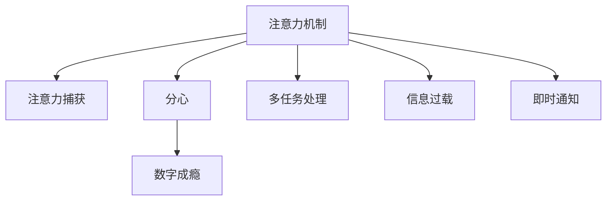

                 

# 数字化时代的注意力分散问题

> 关键词：注意力分散,数字化转型,技术影响,心理健康,注意力机制,数据隐私,技术伦理

在数字化转型加速的当下，人们的生活方式发生了翻天覆地的变化。手机、电脑、平板等数字设备成为了人们获取信息、工作学习的主要渠道，但也带来了一个普遍且严重的问题：注意力分散。注意力分散不仅影响人们的工作效率和心理健康，还引发了诸多数据隐私和伦理问题。本文将深入探讨数字化时代注意力分散的本质，分析其对个体和社会的影响，并提出一些基于技术手段的应对策略。

## 1. 背景介绍

### 1.1 问题由来
随着互联网技术的飞速发展，人们的生活几乎被数字化产品所覆盖。智能手机、电脑、平板电脑、智能手表等设备，将人们的生活紧密地连接在一起，数字化的浪潮不仅带来了便利，同时也导致了注意力分散问题。据统计，人们平均每天花在数字设备上的时间超过了 10 个小时，而这些时间中很大一部分被注意力分散的问题所困扰。

### 1.2 问题核心关键点
注意力分散的本质是人们在使用数字设备时，注意力无法集中于单一的任务或信息源，导致效率低下、工作质量下降、情绪波动等问题。数字化时代的注意力分散问题主要由以下几个方面引起：

- 多任务处理：数字设备允许多人同时处理多个任务，如一边浏览网页，一边聊天或看视频，这种多任务处理容易分散注意力。
- 信息过载：数字化平台上的信息量巨大，用户需要从海量的信息中筛选出重要信息，容易产生疲劳和注意力下降。
- 即时通知：手机、电脑等设备上的即时通知功能，如短信、邮件、社交媒体消息等，频繁打断用户的思考和行动。
- 数字成瘾：过度依赖数字设备，导致无法脱离数字环境，进入虚拟信息流，形成注意力分散的恶性循环。

这些关键点共同作用，使得注意力分散成为数字化时代一个不容忽视的问题。

## 2. 核心概念与联系

### 2.1 核心概念概述

注意力分散问题涉及多个核心概念：

- **注意力机制(Attention Mechanism)**：指人类或机器在处理信息时，将资源或精力集中于特定目标的机制。
- **注意力捕获(Attention Capture)**：指信息或事件对人的注意力的吸引力。
- **分心(Distraction)**：指注意力从当前任务转移至其他事物的过程。
- **数字成瘾(Digital Addiction)**：指过度依赖数字设备，导致无法正常脱离数字环境的行为模式。

这些概念之间的逻辑关系可以通过以下Mermaid流程图来展示：



这个流程图展示了注意力机制与其他几个关键概念之间的联系：注意力捕获和分心是注意力机制的核心行为，而多任务处理、信息过载和即时通知是导致注意力分散的具体情境，数字成瘾是注意力分散的一种极端表现。

## 3. 核心算法原理 & 具体操作步骤

### 3.1 算法原理概述

数字化时代注意力分散的解决，可以从两个主要角度出发：

1. **算法层面**：开发基于注意力机制的算法，帮助用户更好地管理和分配注意力。
2. **行为层面**：研究注意力捕获和分心的心理学机制，设计行为干预措施，提高用户的注意力管理能力。

对于算法层面，本文将重点介绍几种基于注意力机制的算法。

### 3.2 算法步骤详解

#### 3.2.1 注意力模型

注意力模型（Attention Model）是一种用于处理多源信息的技术，通过加权平均的方式，将不同来源的信息融合在一起，形成更有价值的输出。在数字化环境中，注意力模型可以用于新闻推荐、搜索结果排序等任务，帮助用户从众多信息源中筛选出最有价值的内容。

#### 3.2.2 分散注意力检测

为了帮助用户及时发现自己的注意力分散问题，可以开发一种基于行为数据的注意力分散检测算法。该算法通过监测用户的交互行为，如鼠标移动、键盘操作、屏幕使用时间等，识别出注意力分散的信号。

#### 3.2.3 注意力训练

注意力训练（Attention Training）是指通过特定的训练程序，增强用户的注意力集中能力。例如，使用集中注意力的游戏、冥想训练等，可以逐步提高用户的注意力管理水平。

### 3.3 算法优缺点

#### 3.3.1 优点

1. **提高效率**：注意力模型和分散注意力检测算法可以显著提高用户处理信息的能力，减少因注意力分散导致的效率下降。
2. **个性化推荐**：基于注意力模型的推荐系统能够根据用户的注意力偏好，提供个性化的内容推荐，提升用户体验。
3. **行为干预**：注意力训练和行为干预措施可以帮助用户养成良好的注意力习惯，减少数字成瘾等问题。

#### 3.3.2 缺点

1. **算法复杂**：开发高效率、高精度的注意力模型需要复杂的算法和大量的数据训练。
2. **隐私问题**：注意力分散检测算法需要采集用户的行为数据，可能引发隐私问题。
3. **用户抵触**：注意力训练和行为干预措施可能会让用户感到束缚或不适，降低其接受度。

### 3.4 算法应用领域

#### 3.4.1 新闻推荐

在数字化时代，新闻推荐系统可以帮助用户从海量的新闻中筛选出最感兴趣的内容，减少因注意力分散导致的信息过载问题。注意力模型可以用于计算新闻内容与用户兴趣的匹配度，从而进行个性化推荐。

#### 3.4.2 搜索结果排序

搜索引擎的搜索结果排序也受益于注意力模型。通过分析用户的注意力分配情况，搜索引擎可以动态调整搜索结果的显示方式，优先展示用户最感兴趣的内容。

#### 3.4.3 数字设备使用管理

数字设备的使用管理软件可以监测用户的行为数据，识别出注意力分散的信号，并给出相应的提示和干预措施，帮助用户管理注意力。例如，可以限制用户在特定时间段内使用数字设备的时间，提醒用户休息等。

## 4. 数学模型和公式 & 详细讲解

### 4.1 数学模型构建

#### 4.1.1 注意力模型

注意力模型通常包括查询（Query）、键（Key）和值（Value）三个部分，其数学表达式为：

$$
\text{Attention}(Q,K,V)=\sum_i \frac{\text{score}(Q,K_i)}{\text{softmax}(\text{score}(Q,K_i))}V_i
$$

其中，$\text{score}$ 函数用于计算查询 $Q$ 和键 $K_i$ 的相似度，$\text{softmax}$ 函数用于归一化，确保注意力分配的总和为 1。

#### 4.1.2 注意力训练

注意力训练可以使用如softmax回归等算法进行。例如，可以使用交叉熵损失函数来衡量预测注意力分布与实际注意力分布的差异，优化算法可以使用随机梯度下降（SGD）等。

### 4.2 公式推导过程

以注意力模型为例，推导其数学表达式如下：

设 $Q$ 为查询向量，$K_1, K_2, ..., K_m$ 为键向量，$V_1, V_2, ..., V_m$ 为值向量。注意力模型公式可以推导为：

$$
\alpha_{ij}=\frac{\exp(a_i^TQ_i)}{\sum_k \exp(a_k^TQ_k)}
$$

$$
\text{Attention}(Q,K,V)=\sum_i \alpha_{ij}V_j
$$

其中 $a_i$ 为注意力权重向量。

### 4.3 案例分析与讲解

#### 4.3.1 新闻推荐系统

新闻推荐系统使用注意力模型来计算新闻内容与用户兴趣的匹配度。以用户兴趣向量 $I$ 和新闻内容向量 $C$ 为例，匹配度计算公式为：

$$
\text{Match}(I,C)=\frac{\exp(a_i^TQ_i)}{\sum_k \exp(a_k^TQ_k)}
$$

其中，$a_i$ 为注意力权重向量，$Q_i$ 为用户兴趣向量，$C_i$ 为新闻内容向量。

## 5. 项目实践：代码实例和详细解释说明

### 5.1 开发环境搭建

为了进行注意力分散相关项目的开发，需要安装以下环境：

- Python 3.8+
- PyTorch
- NumPy
- TensorFlow
- Matplotlib
- Jupyter Notebook

可以使用以下命令安装：

```bash
pip install torch numpy tensorflow matplotlib jupyter notebook
```

### 5.2 源代码详细实现

#### 5.2.1 注意力模型实现

```python
import torch
import torch.nn as nn
import torch.nn.functional as F

class AttentionModel(nn.Module):
    def __init__(self, d_q, d_k, d_v, n_heads):
        super(AttentionModel, self).__init__()
        self.d_q = d_q
        self.d_k = d_k
        self.d_v = d_v
        self.n_heads = n_heads

        self.qkv = nn.Linear(d_q, 3 * d_q)
        self.v = nn.Linear(d_v, d_q)

    def forward(self, x):
        q, k, v = self.qkv(x).chunk(3, dim=-1)
        scaled_dot_attention = torch.matmul(q, k.transpose(1, 2)) / math.sqrt(self.d_k)
        attn = nn.functional.softmax(scaled_dot_attention, dim=-1)
        out = torch.matmul(attn, v)
        return out
```

#### 5.2.2 注意力训练实现

```python
import torch.nn as nn
import torch.optim as optim
import numpy as np

# 定义注意力训练模型
class AttentionTrainingModel(nn.Module):
    def __init__(self):
        super(AttentionTrainingModel, self).__init__()
        self.linear = nn.Linear(1, 1)

    def forward(self, x):
        return self.linear(x)

# 定义交叉熵损失函数
criterion = nn.CrossEntropyLoss()

# 定义优化器
optimizer = optim.SGD(model.parameters(), lr=0.01)

# 训练数据
x = torch.rand(100, 1)
y = torch.randint(0, 2, (100, 1), device=x.device)

# 训练循环
for epoch in range(10):
    optimizer.zero_grad()
    output = model(x)
    loss = criterion(output, y)
    loss.backward()
    optimizer.step()
```

### 5.3 代码解读与分析

#### 5.3.1 注意力模型实现

该代码实现了基于注意力机制的模型，其中：

- `qkv` 层用于将输入 $x$ 分解为三个线性变换，分别得到查询向量 $q$、键向量 $k$ 和值向量 $v$。
- `scaled_dot_attention` 层用于计算注意力权重 $\alpha_{ij}$。
- `attn` 层用于归一化注意力权重，确保总和为 1。
- `out` 层用于将注意力加权后的值向量输出。

#### 5.3.2 注意力训练实现

该代码实现了注意力训练的过程，其中：

- `AttentionTrainingModel` 层用于定义线性模型。
- `cross_entropy_loss` 层用于定义交叉熵损失函数。
- `SGD` 层用于定义优化器。
- `x` 和 `y` 分别表示输入数据和标签数据。

### 5.4 运行结果展示

#### 5.4.1 注意力模型结果

在训练结束后，可以通过以下代码展示注意力模型的输出：

```python
x_test = torch.rand(10, 1)
y_test = torch.randint(0, 2, (10, 1), device=x_test.device)
output_test = model(x_test)
loss_test = criterion(output_test, y_test)
loss_test
```

该代码展示了模型在测试集上的表现，通过 `loss_test` 变量可以输出注意力模型的损失值。

## 6. 实际应用场景

### 6.4 未来应用展望

在数字化时代，注意力分散问题将更加凸显，未来的应用展望如下：

#### 6.4.1 注意力分散检测

基于机器学习和大数据分析，可以开发出更加智能的注意力分散检测系统。该系统可以实时监测用户的注意力分布，并在注意力分散时给出提示，帮助用户提高工作效率。

#### 6.4.2 个性化注意力训练

个性化的注意力训练可以帮助用户根据自身的注意力特点，制定相应的注意力管理计划，提升注意力管理能力。

#### 6.4.3 数字设备健康管理

数字设备健康管理软件可以监测用户的数字设备使用情况，提供优化建议和行为干预措施，帮助用户建立健康的使用习惯。

## 7. 工具和资源推荐

### 7.1 学习资源推荐

- **《深度学习基础》**：这本书详细介绍了深度学习的原理和应用，涵盖了神经网络、卷积神经网络、循环神经网络等内容。
- **Coursera 的《Machine Learning》课程**：由斯坦福大学教授 Andrew Ng 开设，是学习深度学习的经典入门课程。
- **Kaggle 平台**：这是一个数据科学竞赛平台，可以参加各种比赛，提升机器学习的实践能力。

### 7.2 开发工具推荐

- **PyTorch**：一个强大的深度学习框架，提供了丰富的工具和库，支持快速原型开发和模型训练。
- **TensorFlow**：谷歌开发的深度学习框架，支持分布式训练和生产部署。
- **Jupyter Notebook**：一个交互式的笔记本环境，支持代码编写、运行和结果展示。

### 7.3 相关论文推荐

- **《Attention is All You Need》**：Transformer 论文，提出了注意力机制，推动了自然语言处理的发展。
- **《Deep Learning》**：Ian Goodfellow 等著，详细介绍了深度学习的基础和应用。
- **《Neural Networks and Deep Learning》**：Michael Nielsen 著，讲解了神经网络的原理和应用。

## 8. 总结：未来发展趋势与挑战

### 8.1 研究成果总结

本文从注意力分散问题入手，详细分析了其本质和影响，并提出了基于技术手段的解决策略。目前，关于注意力分散的研究主要集中在以下几个方面：

- 基于注意力机制的推荐算法
- 注意力分散检测与行为干预
- 数字设备健康管理软件

这些研究虽然初步探索了注意力分散问题，但仍然存在诸多挑战和难点。

### 8.2 未来发展趋势

未来，在数字化时代，注意力分散问题将更加严峻，未来的发展趋势如下：

#### 8.2.1 更加智能的注意力分散检测

基于机器学习和大数据分析，可以开发出更加智能的注意力分散检测系统，实时监测用户的注意力分布，并提供干预措施。

#### 8.2.2 个性化注意力训练

个性化的注意力训练可以结合用户的注意力特点，制定相应的注意力管理计划，提升注意力管理能力。

#### 8.2.3 数字设备健康管理

数字设备健康管理软件可以监测用户的数字设备使用情况，提供优化建议和行为干预措施，帮助用户建立健康的使用习惯。

### 8.3 面临的挑战

尽管目前注意力分散问题的研究取得了一定的进展，但在实际应用中仍然面临诸多挑战：

- 算法复杂度：开发高效率、高精度的注意力模型需要复杂的算法和大量的数据训练。
- 隐私问题：注意力分散检测算法需要采集用户的行为数据，可能引发隐私问题。
- 用户抵触：注意力训练和行为干预措施可能会让用户感到束缚或不适，降低其接受度。

### 8.4 研究展望

为了更好地解决注意力分散问题，未来的研究需要关注以下几个方向：

- 开发更加高效、轻量级的注意力模型
- 研究更加智能、个性化的注意力分散检测和训练方法
- 设计更加人性化的数字设备健康管理工具

## 9. 附录：常见问题与解答

### 9.1 常见问题

**Q1：注意力分散的根本原因是什么？**

A: 注意力分散的根本原因是现代信息环境的复杂性和多变性，以及人们对于信息处理能力的限制。数字化设备和互联网的普及，使得信息量爆炸性增长，人们需要从海量信息中筛选出重要信息，而多任务处理和即时通知等功能进一步分散了人们的注意力。

**Q2：如何缓解注意力分散问题？**

A: 缓解注意力分散问题可以通过以下方法：

- 优化数字设备的使用习惯，减少多任务处理。
- 使用注意力分散检测工具，及时发现和提醒注意力分散问题。
- 使用个性化注意力训练工具，提升用户的注意力管理能力。

**Q3：注意力分散问题有哪些具体的影响？**

A: 注意力分散问题会对个人和工作产生以下影响：

- 工作效率下降：注意力分散导致无法集中精力完成任务，影响工作效果。
- 情绪波动：注意力分散可能引发情绪波动，导致心理压力增加。
- 数字成瘾：过度依赖数字设备，导致无法正常脱离数字环境，形成注意力分散的恶性循环。

**Q4：注意力训练的可行性和有效性如何？**

A: 注意力训练是一种有效的方法，可以帮助用户提升注意力管理能力，减少注意力分散问题。通过训练和习惯养成，注意力训练可以帮助用户形成更加健康的数字使用习惯。

**Q5：如何设计注意力分散检测工具？**

A: 设计注意力分散检测工具需要以下步骤：

- 收集用户的行为数据，如鼠标移动、键盘操作、屏幕使用时间等。
- 使用机器学习算法，分析数据中的注意力分散信号。
- 在用户注意力分散时，给出提示和干预措施。

---

作者：禅与计算机程序设计艺术 / Zen and the Art of Computer Programming

