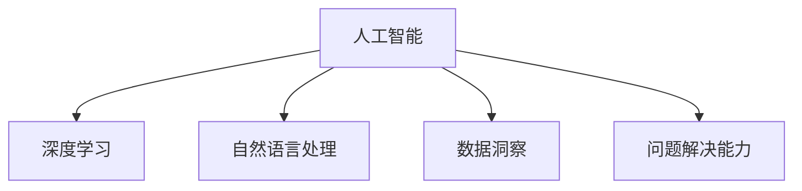

                 

# 数字化洞察力：AI增强的问题解决能力

> 关键词：数字化转型, 人工智能, 问题解决能力, 数据洞察, 深度学习, 自然语言处理(NLP), 机器学习, 数据科学

## 1. 背景介绍

在数字化时代，数据已经成为一个重要的战略资产，而如何从数据中获取洞察并利用其增强决策和问题解决能力，成为了企业和组织关注的焦点。随着人工智能(AI)技术的迅速发展，AI在数据洞察和问题解决中的应用也愈发广泛和深入。本博客旨在探讨AI如何通过增强问题解决能力，帮助企业和组织在数字化转型中取得竞争优势。

### 1.1 问题由来

在信息爆炸的时代，传统的数据分析和处理方式已经无法满足企业对实时、精准数据洞察的需求。人工智能技术，特别是深度学习和自然语言处理(NLP)等技术，能够自动化地处理和分析大量复杂数据，从中提取出有用的信息，为企业提供深刻的洞察力。

### 1.2 问题核心关键点

1. **数据与洞察**：如何将大数据转化为有价值的数据洞察。
2. **问题解决**：如何在复杂环境下，自动化、高效地解决实际问题。
3. **技术工具**：如何选择合适的AI技术和工具，提升问题解决能力。
4. **数据质量**：如何保证数据的准确性和完整性，避免偏见和误差。
5. **解释性与透明性**：如何确保AI模型的决策过程透明，可解释性强。

### 1.3 问题研究意义

提升企业和组织的问题解决能力，对于其在数字化时代的生存和发展至关重要。AI技术可以自动化地从海量数据中提取洞察，辅助决策制定，加速问题解决。此外，AI技术还能够优化业务流程，提高运营效率，从而实现业务模式的创新和转型。

## 2. 核心概念与联系

### 2.1 核心概念概述

为了更好地理解AI如何增强问题解决能力，本节将介绍几个密切相关的核心概念：

- **人工智能(AI)**：使用机器学习、深度学习等技术，使计算机具备类似人类的智能。
- **深度学习**：一种基于神经网络的机器学习方法，能够处理复杂的非线性问题。
- **自然语言处理(NLP)**：使计算机能够理解和生成自然语言，包括文本分析、情感分析、机器翻译等任务。
- **数据洞察**：从数据中提取出的有价值的信息，帮助企业理解市场趋势、客户需求等。
- **问题解决能力**：通过技术手段自动地发现、分析和解决实际问题。

这些核心概念之间的逻辑关系可以通过以下Mermaid流程图来展示：



这个流程图展示了大语言模型的核心概念及其之间的关系：

1. 人工智能通过深度学习和自然语言处理等技术，使计算机具备智能。
2. 深度学习使计算机能够处理复杂的数据非线性问题。
3. 自然语言处理使计算机能够理解和生成自然语言。
4. 数据洞察是从数据中提取有价值的信息。
5. 问题解决能力是基于上述技术手段，自动地发现、分析和解决实际问题。

## 3. 核心算法原理 & 具体操作步骤

### 3.1 算法原理概述

AI增强的问题解决能力，主要通过深度学习、自然语言处理等技术手段实现。这些技术能够从大量数据中提取出模式和关系，并用于分析和解决实际问题。以下是对几个核心算法的概述：

1. **深度学习**：通过多层神经网络，学习数据的复杂模式和关系。
2. **自然语言处理(NLP)**：使用语言模型、序列到序列模型等，使计算机能够理解和生成自然语言。
3. **数据洞察**：通过文本挖掘、聚类分析等技术，从数据中提取有用的信息。
4. **问题解决能力**：通过优化算法、强化学习等方法，自动化地解决实际问题。

### 3.2 算法步骤详解

AI增强问题解决能力的核心步骤如下：

1. **数据收集与预处理**：收集和整理需要分析的数据，并进行清洗和标准化。
2. **特征提取与建模**：从数据中提取关键特征，并使用深度学习模型进行建模。
3. **模型训练与优化**：通过大量标注数据训练模型，并使用优化算法调整模型参数。
4. **结果分析与解释**：对模型输出结果进行分析和解释，形成数据洞察。
5. **问题解决与验证**：将数据洞察应用于实际问题解决，并进行验证和调整。

### 3.3 算法优缺点

AI增强问题解决能力具有以下优点：

1. **高效性**：能够自动化地处理大量数据，提取有用的信息。
2. **精确性**：通过深度学习模型，能够处理复杂的数据模式和关系。
3. **泛化性**：模型能够在不同数据集和问题场景中泛化应用。
4. **可解释性**：通过模型的可解释性技术，能够理解模型的决策过程。

同时，这些算法也存在一些局限性：

1. **数据依赖**：需要大量的标注数据进行模型训练，数据获取和处理成本高。
2. **模型复杂**：深度学习模型参数量大，训练和推理资源消耗大。
3. **结果不确定**：模型的输出结果可能受到数据质量、模型选择等因素的影响。
4. **伦理与偏见**：模型可能包含数据中的偏见，需要谨慎使用。

### 3.4 算法应用领域

AI增强问题解决能力的应用领域非常广泛，包括但不限于：

1. **金融**：自动化交易策略，风险评估，客户行为分析等。
2. **医疗**：疾病诊断，患者行为预测，药物研发等。
3. **零售**：个性化推荐，库存管理，客户满意度分析等。
4. **制造**：生产过程优化，质量控制，设备维护等。
5. **物流**：路径规划，需求预测，仓库管理等。

## 4. 数学模型和公式 & 详细讲解 & 举例说明

### 4.1 数学模型构建

AI增强问题解决能力的数学模型构建，通常包括以下几个步骤：

1. **数据表示**：将数据表示为向量或矩阵形式。
2. **特征提取**：从数据中提取关键特征，如TF-IDF、Word Embedding等。
3. **模型训练**：使用深度学习模型进行训练，如卷积神经网络(CNN)、循环神经网络(RNN)等。
4. **结果评估**：使用评价指标评估模型性能，如准确率、召回率、F1-score等。

### 4.2 公式推导过程

以下是一个简单的例子，展示如何使用神经网络进行分类问题的求解：

假设输入向量为 $x$，输出向量为 $y$，目标函数为交叉熵损失函数。神经网络包含 $k$ 个隐层节点，权重矩阵为 $W$，偏置向量为 $b$。

- **前向传播**：

  $$
  h_1 = W_1x + b_1
  $$

  $$
  h_2 = \sigma(W_2h_1 + b_2)
  $$

  $$
  y = W_3h_2 + b_3
  $$

  其中 $\sigma$ 为激活函数，如ReLU、Sigmoid等。

- **交叉熵损失函数**：

  $$
  \ell = -\frac{1}{N}\sum_{i=1}^N(y_i\log\hat{y}_i + (1-y_i)\log(1-\hat{y}_i))
  $$

- **反向传播**：

  $$
  \frac{\partial\ell}{\partial W} = \frac{\partial\ell}{\partial y}\frac{\partial y}{\partial h_2}\frac{\partial h_2}{\partial h_1}\frac{\partial h_1}{\partial W}
  $$

  $$
  \frac{\partial\ell}{\partial b} = \frac{\partial\ell}{\partial y}\frac{\partial y}{\partial h_2}\frac{\partial h_2}{\partial h_1}
  $$

  通过反向传播算法，更新权重矩阵 $W$ 和偏置向量 $b$，最小化损失函数 $\ell$。

### 4.3 案例分析与讲解

以医疗领域的疾病诊断为例，展示如何使用AI增强问题解决能力。

- **数据准备**：收集病人的电子病历，包括病史、症状、检查结果等，并将其转换为向量形式。
- **特征提取**：使用自然语言处理技术，提取关键特征如症状频率、检查结果等。
- **模型训练**：使用深度学习模型进行训练，如卷积神经网络(CNN)、循环神经网络(RNN)等。
- **结果分析**：使用评价指标评估模型性能，如准确率、召回率、F1-score等。

## 5. 项目实践：代码实例和详细解释说明

### 5.1 开发环境搭建

在进行AI增强问题解决能力的项目实践前，我们需要准备好开发环境。以下是使用Python进行TensorFlow和Keras开发的典型环境配置流程：

1. 安装Anaconda：从官网下载并安装Anaconda，用于创建独立的Python环境。

2. 创建并激活虚拟环境：
```bash
conda create -n tensorflow-env python=3.8 
conda activate tensorflow-env
```

3. 安装TensorFlow：根据CUDA版本，从官网获取对应的安装命令。例如：
```bash
conda install tensorflow=2.4.0
```

4. 安装Keras：
```bash
pip install keras
```

5. 安装各类工具包：
```bash
pip install numpy pandas scikit-learn matplotlib tqdm jupyter notebook ipython
```

完成上述步骤后，即可在`tensorflow-env`环境中开始AI增强问题解决能力的项目实践。

### 5.2 源代码详细实现

下面我们以金融领域的风险评估为例，给出使用TensorFlow和Keras进行AI增强问题解决能力的代码实现。

```python
import tensorflow as tf
from tensorflow.keras import layers, models

# 定义模型架构
model = models.Sequential()
model.add(layers.Dense(64, activation='relu', input_shape=(10,)))
model.add(layers.Dense(32, activation='relu'))
model.add(layers.Dense(1, activation='sigmoid'))

# 编译模型
model.compile(optimizer='adam', loss='binary_crossentropy', metrics=['accuracy'])

# 训练模型
model.fit(train_data, train_labels, epochs=10, validation_data=(val_data, val_labels))

# 评估模型
test_loss, test_acc = model.evaluate(test_data, test_labels)
print('Test accuracy:', test_acc)
```

### 5.3 代码解读与分析

让我们再详细解读一下关键代码的实现细节：

**定义模型架构**：
- 使用Keras定义神经网络模型，包含两个隐藏层和一个输出层。
- 隐藏层使用ReLU激活函数，输出层使用Sigmoid激活函数。
- 输入维度为10，表示输入特征向量的大小。

**编译模型**：
- 使用Adam优化器，二元交叉熵损失函数，精度作为评价指标。

**训练模型**：
- 使用训练集数据和标签进行模型训练，设定训练轮数为10。
- 使用验证集数据和标签进行模型验证。

**评估模型**：
- 使用测试集数据和标签评估模型性能，输出测试准确率。

## 6. 实际应用场景

### 6.1 金融风险评估

在金融领域，AI可以通过风险评估模型，自动化地分析客户的行为和信用记录，预测其违约风险。这不仅能够提高风险管理的效率，还能降低运营成本。

具体而言，可以通过收集客户的交易记录、信用报告、社交媒体信息等数据，建立风险评估模型。模型能够从这些数据中提取出关键特征，并利用深度学习技术，进行风险评估和预测。通过实时监测和分析，金融机构可以及时发现潜在风险，采取相应的措施。

### 6.2 医疗诊断辅助

AI在医疗诊断中也有广泛应用，能够辅助医生进行疾病诊断和预测。通过收集病人的电子病历、检查结果、基因信息等数据，训练深度学习模型，能够自动识别出疾病特征，辅助医生进行诊断和治疗决策。

例如，可以使用卷积神经网络(CNN)对医学影像进行分类和诊断。模型能够从影像中提取关键特征，并利用大量标注数据进行训练，输出疾病的诊断结果。通过与医生协同工作，AI可以显著提高诊断的准确性和效率。

### 6.3 智能客服

智能客服系统通过AI技术，能够自动处理客户咨询，提高服务效率和客户满意度。通过收集客户的咨询记录和反馈，训练自然语言处理模型，能够理解和生成自然语言，提供个性化的服务。

例如，可以使用序列到序列模型，将客户的咨询转化为结构化的查询，并匹配相应的知识库和回答模板。通过不断学习和优化，智能客服系统能够更好地理解和回应客户，提高问题解决的准确性和效率。

### 6.4 未来应用展望

随着AI技术的不断发展，AI增强问题解决能力将在更多领域得到应用，为各行各业带来变革性影响。

在智慧城市治理中，AI可以通过智能交通、环境监测、公共安全等应用，提高城市管理的自动化和智能化水平，构建更安全、高效的未来城市。

在教育领域，AI可以通过个性化推荐、智能辅导、作业批改等应用，因材施教，提高教学质量和学习效果。

在企业生产中，AI可以通过优化生产流程、预测设备故障、质量控制等应用，提高生产效率和产品质量。

此外，在智慧医疗、智能制造、智能交通等多个领域，AI增强问题解决能力也将不断涌现，为经济社会发展注入新的动力。

## 7. 工具和资源推荐

### 7.1 学习资源推荐

为了帮助开发者系统掌握AI增强问题解决的理论基础和实践技巧，这里推荐一些优质的学习资源：

1. 《深度学习》书籍：Ian Goodfellow等人所著，全面介绍了深度学习的理论和实践，是理解AI增强问题解决的基础。
2. TensorFlow官方文档：TensorFlow的官方文档，提供了丰富的教程和样例代码，适合初学者学习。
3. Keras官方文档：Keras的官方文档，介绍了如何使用Keras进行深度学习模型的开发和训练。
4. Coursera《深度学习专项课程》：由Andrew Ng等人主讲，深入浅出地介绍了深度学习的基本概念和应用。
5. Kaggle数据科学竞赛：提供丰富的数据集和挑战题目，通过实际项目训练AI增强问题解决的能力。

通过对这些资源的学习实践，相信你一定能够快速掌握AI增强问题解决的核心技术和应用方法。

### 7.2 开发工具推荐

高效的开发离不开优秀的工具支持。以下是几款用于AI增强问题解决开发的常用工具：

1. TensorFlow：基于Python的开源深度学习框架，灵活的计算图和自动微分功能，适合快速迭代研究。
2. Keras：Keras是一个高层次的神经网络API，支持快速构建深度学习模型。
3. PyTorch：由Facebook开发的深度学习框架，动态计算图和丰富的API支持，适合学术研究和工程开发。
4. Weights & Biases：模型训练的实验跟踪工具，记录和可视化模型训练过程，方便调试和优化。
5. TensorBoard：TensorFlow配套的可视化工具，实时监测模型训练状态，提供丰富的图表呈现方式。

合理利用这些工具，可以显著提升AI增强问题解决的开发效率，加速创新迭代的步伐。

### 7.3 相关论文推荐

AI增强问题解决能力的研究源于学界的持续研究。以下是几篇奠基性的相关论文，推荐阅读：

1. AlexNet：在ImageNet数据集上取得了显著效果，标志着深度学习在图像识别领域的应用。
2. Attention is All You Need：提出了Transformer结构，开启了NLP领域的预训练大模型时代。
3. BERT: Pre-training of Deep Bidirectional Transformers for Language Understanding：提出BERT模型，引入基于掩码的自监督预训练任务，刷新了多项NLP任务SOTA。
4. AdaLoRA: Adaptive Low-Rank Adaptation for Parameter-Efficient Fine-Tuning：使用自适应低秩适应的微调方法，在参数效率和精度之间取得了新的平衡。
5. Supermasks: An Automated Supervised Correction for Noisy Labels：提出Supermasks算法，用于处理数据中的噪声标签，提升模型的泛化能力。

这些论文代表了大语言模型微调技术的发展脉络。通过学习这些前沿成果，可以帮助研究者把握学科前进方向，激发更多的创新灵感。

## 8. 总结：未来发展趋势与挑战

### 8.1 总结

本文对AI增强问题解决能力进行了全面系统的介绍。首先阐述了AI在问题解决中的重要作用，明确了其对数字化转型的驱动作用。其次，从原理到实践，详细讲解了AI增强问题解决能力的核心算法和操作步骤，提供了代码实现和详细解释。同时，本文还探讨了AI在金融、医疗、智能客服等实际场景中的应用，展示了其广泛的应用前景。最后，推荐了相关的学习资源和开发工具，力求为读者提供全方位的技术指引。

通过本文的系统梳理，可以看到，AI增强问题解决能力在数字化时代具有广阔的应用前景，能够显著提升企业和组织的问题解决能力，推动业务模式的创新和转型。

### 8.2 未来发展趋势

展望未来，AI增强问题解决能力将呈现以下几个发展趋势：

1. **智能化水平提升**：通过更复杂的深度学习模型和更丰富的数据集，提高AI模型的智能化水平，使其能够更好地理解和解决复杂问题。
2. **多模态融合**：将文本、图像、语音等多模态数据进行融合，构建更加全面和准确的数据洞察。
3. **实时化处理**：通过优化计算图和推理算法，实现实时化处理，满足企业对实时数据洞察的需求。
4. **自动化部署**：通过自动化工具和平台，实现模型的快速部署和优化，降低人工干预成本。
5. **跨领域应用**：将AI技术应用于更多垂直领域，如教育、医疗、交通等，推动行业创新和转型。

### 8.3 面临的挑战

尽管AI增强问题解决能力已经取得了显著进展，但在迈向更加智能化、普适化应用的过程中，仍面临诸多挑战：

1. **数据质量问题**：如何保证数据的准确性和完整性，避免数据中的噪声和偏见。
2. **模型可解释性**：如何使AI模型的决策过程透明，可解释性强，避免"黑盒"问题。
3. **资源消耗**：如何优化计算图和推理算法，减少资源消耗，实现高效部署。
4. **隐私保护**：如何在保证数据隐私的前提下，进行数据洞察和问题解决。
5. **伦理与偏见**：如何避免AI模型中的伦理和偏见问题，确保模型的公平和公正。

### 8.4 研究展望

面对AI增强问题解决能力所面临的挑战，未来的研究需要在以下几个方面寻求新的突破：

1. **数据增强与标注**：通过数据增强和半监督学习等方法，提升数据质量，减少对标注数据的依赖。
2. **模型可解释性**：通过可解释性技术，如LIME、SHAP等，提高模型的可解释性。
3. **模型优化**：通过模型压缩、模型蒸馏等方法，优化模型结构，减少资源消耗。
4. **隐私保护**：通过联邦学习、差分隐私等技术，保护数据隐私。
5. **伦理与偏见**：引入伦理导向的评估指标，优化模型训练目标，避免伦理和偏见问题。

这些研究方向的探索，必将引领AI增强问题解决能力迈向更高的台阶，为构建安全、可靠、可解释、可控的智能系统铺平道路。面向未来，AI增强问题解决能力还需要与其他人工智能技术进行更深入的融合，如知识表示、因果推理、强化学习等，多路径协同发力，共同推动自然语言理解和智能交互系统的进步。只有勇于创新、敢于突破，才能不断拓展语言模型的边界，让智能技术更好地造福人类社会。

## 9. 附录：常见问题与解答

**Q1：AI增强问题解决能力是否适用于所有问题？**

A: AI增强问题解决能力在大多数问题上都能取得不错的效果，特别是对于数据量较大的问题。但对于一些复杂且无规则的问题，AI可能无法有效解决。需要根据具体情况选择合适的方法和工具。

**Q2：如何提升AI模型的智能化水平？**

A: 提升AI模型的智能化水平，可以通过以下几个方面进行：
1. 增加数据量和质量，提高模型的泛化能力。
2. 使用更复杂的深度学习模型，如卷积神经网络、循环神经网络、Transformer等。
3. 引入多模态数据融合，提高模型的理解能力。
4. 使用自动机器学习(AutoML)技术，自动选择和优化模型参数。

**Q3：AI增强问题解决能力在实际应用中需要注意哪些问题？**

A: AI增强问题解决能力在实际应用中需要注意以下几个问题：
1. 数据质量和隐私保护，确保数据的准确性和完整性，避免数据泄露。
2. 模型可解释性和公平性，确保模型的决策过程透明，避免偏见。
3. 资源消耗和部署效率，优化计算图和推理算法，提高处理速度。
4. 实时性和稳定性，确保模型能够在实时环境中稳定运行。

**Q4：如何优化AI模型的训练过程？**

A: 优化AI模型的训练过程，可以通过以下几个方面进行：
1. 使用GPU/TPU等高性能设备，加快模型训练速度。
2. 使用分布式训练，提高模型训练效率。
3. 使用学习率调度策略，如学习率衰减、warmup等，提高模型收敛速度。
4. 使用正则化技术，如L2正则、Dropout等，避免过拟合。

**Q5：AI增强问题解决能力在企业中的应用前景如何？**

A: AI增强问题解决能力在企业中具有广泛的应用前景，能够显著提升企业的决策效率和运营管理水平。具体应用包括：
1. 金融风险评估，提升风险管理能力。
2. 医疗诊断辅助，提高诊断准确性和效率。
3. 智能客服，提升客户满意度和服务效率。
4. 智能制造，优化生产流程，提高产品质量和效率。
5. 智慧城市，提高城市管理和公共安全水平。

---

作者：禅与计算机程序设计艺术 / Zen and the Art of Computer Programming

