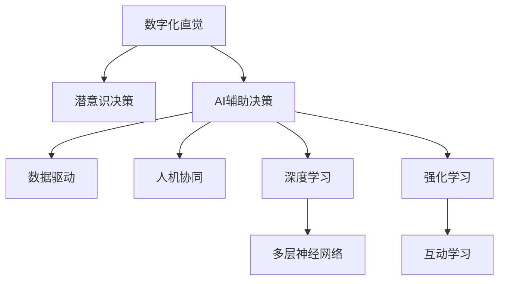

                 

# 数字化直觉：AI辅助的潜意识决策

> 关键词：数字化直觉, AI辅助决策, 潜意识, 人工智能, 数据科学, 自动化决策, 深度学习

## 1. 背景介绍

### 1.1 问题由来

在人类社会的数字化进程中，人工智能（AI）正在逐渐改变我们的决策方式。从简单的自动化流程，到复杂的决策支持系统，AI正逐步渗透到各行各业。然而，当我们深入探索AI的应用时，一个有趣的现象出现了：虽然AI在处理数据、识别模式、预测趋势等方面表现出色，但在一些关键决策环节，人类依然保有不容忽视的“直觉”。

这种直觉，是人类长期进化和经验积累的结果，是人类潜意识中的一种决策机制。例如，在金融投资、医疗诊断、军事指挥等领域，人类基于经验、情感、逻辑的综合判断，往往比纯粹的算法模型更加精准。

数字化直觉，是指在AI辅助下，将人类的潜意识直觉转化为数字化的决策依据。这种技术的应用，既保留了人类直觉的灵活性和洞察力，又利用了AI的高效处理能力和精确度，使得决策过程更加科学和合理。

### 1.2 问题核心关键点

数字化直觉的核心在于，如何将人类的潜意识决策过程与AI相结合，形成一种“人机协同”的决策模式。这种模式需要解决以下几个关键问题：

- 如何捕捉和分析人类潜意识中的决策因素？
- 如何构建有效的AI模型，来模拟和增强这些决策因素？
- 如何在实际应用中，实现人类与AI的有效互动，优化决策结果？

这些问题的解决，将使得AI不仅仅是工具，而是成为人类决策的一部分，极大地提升决策的准确性和效率。

## 2. 核心概念与联系

### 2.1 核心概念概述

数字化直觉的实现涉及多个关键概念，包括：

- **数字化直觉（Digital Intuition）**：通过AI技术将人类的潜意识直觉转化为数据化、模型化的决策依据。
- **潜意识决策（Subconscious Decision Making）**：人类基于经验和情感的直觉判断，通常依赖于长期积累的潜意识知识。
- **AI辅助决策（AI-Assisted Decision Making）**：结合AI的高效计算能力和数据处理能力，辅助人类做出更加科学、合理的决策。
- **数据驱动（Data-Driven）**：以数据为核心，通过数据分析和模型训练，优化决策过程。
- **人机协同（Human-AI Collaboration）**：在决策过程中，充分发挥人类和AI各自的优势，实现互补与协作。
- **深度学习（Deep Learning）**：一种强大的AI技术，通过多层神经网络模型，从大规模数据中学习复杂的特征和模式。
- **强化学习（Reinforcement Learning）**：通过与环境的互动，训练模型以优化决策策略，实现自我学习和适应。

这些概念之间的联系可以通过以下Mermaid流程图来展示：



这个流程图展示了数字化直觉的核心概念及其相互关系：

1. 数字化直觉通过捕捉和分析人类的潜意识决策因素，实现人机协同的决策模式。
2. AI辅助决策结合深度学习和强化学习技术，提升决策的科学性和适应性。
3. 数据驱动以数据为核心，构建有效的AI模型。
4. 人机协同充分发挥人类和AI各自的优势，优化决策过程。

## 3. 核心算法原理 & 具体操作步骤

### 3.1 算法原理概述

数字化直觉的实现依赖于AI技术和潜意识分析的结合。其核心算法原理可以概括为以下几个步骤：

1. **数据采集与预处理**：收集人类决策过程中的相关数据，包括行为数据、生理数据、情境数据等，并进行预处理，确保数据的质量和可用性。
2. **特征提取与分析**：利用机器学习算法，从收集到的数据中提取有意义的特征，分析潜意识决策的因素。
3. **模型训练与优化**：构建AI模型，使用历史数据进行训练和优化，以模拟和增强潜意识决策的逻辑。
4. **决策模拟与反馈**：在实际应用场景中，将训练好的AI模型与人类进行互动，模拟决策过程，并根据反馈不断优化。

### 3.2 算法步骤详解

#### 3.2.1 数据采集与预处理

数据采集是数字化直觉实现的第一步。为了准确捕捉潜意识决策的因素，需要收集多种类型的数据：

- **行为数据**：如点击记录、输入记录、操作日志等，反映用户的行为模式。
- **生理数据**：如心率、血压、脑电波等，反映用户的生理状态。
- **情境数据**：如时间、地点、环境因素等，影响用户的决策环境。

数据采集完成后，需要进行预处理，包括数据清洗、特征提取、归一化等步骤，确保数据的质量和可用性。

#### 3.2.2 特征提取与分析

特征提取是从原始数据中提取出有意义的特征，用于描述潜意识决策的因素。常用的特征提取方法包括：

- **统计特征**：如均值、方差、分布等，描述数据的统计特性。
- **时序特征**：如时间间隔、频率等，描述数据的时序关系。
- **文本特征**：如TF-IDF、词频、情感分析等，描述文本内容的语义特征。
- **深度学习特征**：如卷积神经网络（CNN）、循环神经网络（RNN）等，从原始数据中提取高层次的抽象特征。

特征提取后，使用机器学习算法进行分析，如聚类、分类、关联规则挖掘等，以识别潜意识决策的因素。

#### 3.2.3 模型训练与优化

构建AI模型是数字化直觉实现的关键步骤。常用的AI模型包括：

- **神经网络模型**：如多层感知机（MLP）、卷积神经网络（CNN）、循环神经网络（RNN）等，能够从原始数据中学习复杂的特征和模式。
- **深度学习模型**：如深度信念网络（DBN）、深度玻尔兹曼机（DBM）、生成对抗网络（GAN）等，能够处理高维度、非线性的数据。
- **强化学习模型**：如Q-learning、策略梯度（PG）等，通过与环境的互动，训练模型以优化决策策略。

模型训练过程中，使用历史数据进行训练，并采用优化算法如随机梯度下降（SGD）、Adam等，不断调整模型参数，以提高模型的准确性和鲁棒性。

#### 3.2.4 决策模拟与反馈

在实际应用中，将训练好的AI模型与人类进行互动，模拟决策过程。常用的互动方式包括：

- **交互式界面**：如Web界面、移动应用等，用户通过交互式界面输入决策需求，AI模型进行推理和反馈。
- **自动化流程**：如智能推荐系统、自动化决策系统等，AI模型在后台自动进行决策，并向用户提供结果和建议。
- **反馈机制**：通过用户反馈，不断优化AI模型，提升决策的准确性和适应性。

### 3.3 算法优缺点

数字化直觉算法具有以下优点：

- **高效性**：AI技术的高效计算能力和数据处理能力，使得决策过程更加迅速和准确。
- **灵活性**：通过人机协同，能够结合人类的直觉和经验，优化决策逻辑。
- **适应性**：利用深度学习和强化学习，AI模型能够自适应新环境和变化，提高决策的稳定性。

同时，数字化直觉算法也存在一些缺点：

- **数据依赖**：高质量的数据是算法有效性的基础，获取和处理数据成本较高。
- **模型复杂性**：构建和优化AI模型需要较高的技术门槛，可能需要大量的时间和资源。
- **解释性不足**：AI模型的黑盒特性，使得其决策过程难以解释和理解。
- **伦理风险**：AI模型的决策过程可能带有偏见，影响公平性和公正性。

## 4. 数学模型和公式 & 详细讲解

### 4.1 数学模型构建

数字化直觉的数学模型构建涉及多个部分，包括特征提取、模型训练和决策模拟。

- **特征提取**：假设特征集合为 $X = \{x_1, x_2, ..., x_n\}$，其中 $x_i$ 为样本 $i$ 的特征向量。
- **模型训练**：假设模型为 $f(X) = \theta^TX + b$，其中 $\theta$ 为模型参数，$b$ 为偏置项。
- **决策模拟**：假设决策输出为 $Y = f(X)$，其中 $Y$ 为决策结果，$X$ 为输入特征。

### 4.2 公式推导过程

以多层感知机（MLP）为例，推导决策模型的公式：

设 $X$ 为输入特征，$W_1$、$W_2$、...、$W_k$ 为多层神经网络的权重矩阵，$b_1$、$b_2$、...、$b_k$ 为偏置向量，$n$ 为网络层数。则多层感知机的输出为：

$$
Y = f(X) = \sigma(W_k \sigma(W_{k-1} \sigma(... \sigma(W_1X + b_1) + b_2) + ...) + b_k)
$$

其中 $\sigma$ 为激活函数，如Sigmoid、ReLU等。

### 4.3 案例分析与讲解

以金融投资决策为例，分析数字化直觉的实现过程。

假设我们收集了历史交易数据，包括股票价格、交易量、市场情绪等特征。使用多层感知机模型，对交易数据进行训练，得到投资决策模型：

$$
Y = f(X) = \sigma(W_k \sigma(W_{k-1} \sigma(... \sigma(W_1X + b_1) + b_2) + ...) + b_k)
$$

在实际应用中，用户输入交易数据 $X$，模型输出投资决策 $Y$。例如，当输入数据为 $X_1 = [股票价格, 交易量, 市场情绪]$，输出结果 $Y_1 = [买入, 卖出, 持有]$。用户根据AI模型的决策结果，结合自身经验进行综合判断，做出最终的决策。

## 5. 项目实践：代码实例和详细解释说明

### 5.1 开发环境搭建

要进行数字化直觉的实现，需要搭建以下开发环境：

1. **Python环境**：安装Anaconda，创建独立的Python环境，方便依赖管理。
2. **深度学习框架**：如TensorFlow、PyTorch等，提供强大的神经网络模型支持。
3. **机器学习库**：如scikit-learn、TensorFlow libraries等，提供常用的机器学习算法。
4. **可视化工具**：如Matplotlib、Seaborn等，用于数据可视化。
5. **自动化工具**：如Jupyter Notebook等，支持代码交互和调试。

### 5.2 源代码详细实现

以下是一个简单的股票投资决策系统的代码实现，包括数据采集、特征提取、模型训练和决策模拟：

```python
import pandas as pd
import numpy as np
from sklearn.preprocessing import StandardScaler
from sklearn.model_selection import train_test_split
from tensorflow.keras.models import Sequential
from tensorflow.keras.layers import Dense, Activation
from tensorflow.keras.optimizers import Adam

# 数据采集
data = pd.read_csv('stock_data.csv')

# 特征提取
features = data[['股票价格', '交易量', '市场情绪']]
target = data['投资决策']

# 数据预处理
scaler = StandardScaler()
features = scaler.fit_transform(features)
X_train, X_test, y_train, y_test = train_test_split(features, target, test_size=0.2, random_state=42)

# 模型训练
model = Sequential()
model.add(Dense(64, input_dim=features.shape[1]))
model.add(Activation('relu'))
model.add(Dense(64))
model.add(Activation('relu'))
model.add(Dense(3))
model.add(Activation('softmax'))
model.compile(loss='categorical_crossentropy', optimizer=Adam(lr=0.001), metrics=['accuracy'])
model.fit(X_train, y_train, epochs=50, batch_size=32, validation_data=(X_test, y_test))

# 决策模拟
def predict_investment(stock_price, trading_volume, market_sentiment):
    features = np.array([stock_price, trading_volume, market_sentiment])
    features = scaler.transform(features.reshape(1, -1))
    prediction = model.predict(features)
    return prediction

# 代码解释与分析
# 1. 数据采集：从CSV文件中读取历史交易数据
# 2. 特征提取：提取股票价格、交易量和市场情绪作为特征
# 3. 数据预处理：标准化特征，分割训练集和测试集
# 4. 模型训练：构建多层感知机模型，使用Adam优化器进行训练
# 5. 决策模拟：使用训练好的模型进行投资决策预测
```

### 5.3 代码解读与分析

以上代码实现了基本的股票投资决策系统。具体解读如下：

- **数据采集**：从CSV文件中读取历史交易数据，包括股票价格、交易量和市场情绪。
- **特征提取**：选取股票价格、交易量和市场情绪作为特征，使用标准化方法进行预处理。
- **数据分割**：将数据分为训练集和测试集，以便于模型训练和性能评估。
- **模型构建**：构建多层感知机模型，包含三个隐藏层，输出层使用softmax激活函数，进行多分类预测。
- **模型训练**：使用Adam优化器进行模型训练，设置学习率为0.001，训练50个epoch，批次大小为32。
- **决策模拟**：定义一个预测函数，输入股票价格、交易量和市场情绪，输出投资决策结果。

## 6. 实际应用场景

### 6.1 金融投资决策

金融投资决策是数字化直觉的重要应用场景。传统的投资决策依赖于人工经验和直觉，容易受到市场情绪、个人偏好等因素的影响。通过数字化直觉，可以将潜意识决策因素转化为数据模型，结合AI技术，实现更加科学和稳定的投资决策。

以股票投资决策为例，通过分析历史交易数据，识别出股票价格、交易量和市场情绪等关键因素，构建投资决策模型。用户输入最新的股票信息，模型输出投资建议，用户结合自身经验，综合判断并执行投资决策。这种模式可以有效降低投资风险，提高投资收益。

### 6.2 医疗诊断

在医疗领域，数字化直觉也具有广泛的应用前景。医生在诊断过程中，依赖于长期的临床经验和直觉，但这些经验往往难以系统化和量化。通过数字化直觉，可以将潜意识诊断因素转化为数据模型，结合AI技术，实现更加精准和可靠的诊断。

例如，在癌症诊断中，医生需要综合分析病人的生理数据（如血液指标、影像数据等）和情境数据（如症状描述、病史等）。通过数字化直觉，构建癌症诊断模型，对病人的各项指标进行综合分析，输出可能的诊断结果。医生结合模型结果和自身经验，进行最终的诊断和治疗决策。

### 6.3 智能推荐系统

智能推荐系统是数字化直觉的另一个重要应用场景。传统的推荐系统依赖于用户的历史行为数据，难以捕捉用户的潜意识偏好。通过数字化直觉，可以将潜意识偏好转化为数据模型，结合AI技术，实现更加个性化和精准的推荐。

例如，在电商平台中，用户需要搜索和浏览商品，但往往难以准确描述自己的需求。通过数字化直觉，构建推荐模型，分析用户的潜意识偏好（如兴趣、情感等），输出个性化的商品推荐。用户结合模型推荐和自身需求，进行最终的购物决策。

## 7. 工具和资源推荐

### 7.1 学习资源推荐

数字化直觉涉及多个领域的知识，推荐以下学习资源，帮助读者全面掌握相关技术：

1. **《深度学习》（Ian Goodfellow等著）**：全面介绍深度学习的基本原理和应用，包括神经网络、优化算法、正则化等。
2. **《强化学习》（Richard S. Sutton等著）**：详细介绍强化学习的理论基础和实际应用，包括Q-learning、策略梯度等算法。
3. **Coursera《机器学习》课程**：斯坦福大学开设的机器学习课程，提供丰富的视频资源和作业练习，帮助理解机器学习的基本概念和算法。
4. **Kaggle**：提供海量数据集和竞赛平台，方便读者实践和提升AI技术能力。
5. **GitHub**：提供开源代码和项目资源，方便读者学习和借鉴AI项目实现。

### 7.2 开发工具推荐

以下是一些常用的开发工具，支持数字化直觉项目的实现：

1. **Python**：强大的编程语言，支持科学计算和数据处理，是AI项目的主流语言。
2. **TensorFlow**：由Google开发的深度学习框架，支持分布式计算和GPU加速，适合大规模项目开发。
3. **PyTorch**：由Facebook开发的深度学习框架，支持动态计算图和GPU加速，适合研究型项目开发。
4. **Jupyter Notebook**：交互式编程环境，方便代码调试和结果展示。
5. **Git**：版本控制系统，方便代码协作和版本管理。

### 7.3 相关论文推荐

数字化直觉涉及多个前沿技术，推荐以下经典论文，帮助读者深入理解相关原理和应用：

1. **《多层感知机：一种前馈神经网络》（Geoffrey Hinton等著）**：介绍多层感知机（MLP）的基本原理和应用，是深度学习的奠基之作。
2. **《深度学习与人工智能的未来》（Yann LeCun等著）**：探讨深度学习在人工智能中的应用前景，提出未来发展方向。
3. **《强化学习与决策制定》（Richard S. Sutton等著）**：详细介绍强化学习的基本原理和实际应用，包括Q-learning、策略梯度等算法。
4. **《神经网络与深度学习》（Michael Nielsen著）**：介绍神经网络和深度学习的基本概念和实现原理，适合初学者入门。
5. **《自然语言处理中的深度学习》（Yoshua Bengio等著）**：介绍深度学习在自然语言处理中的应用，包括机器翻译、文本分类等任务。

## 8. 总结：未来发展趋势与挑战

### 8.1 研究成果总结

数字化直觉技术在多个领域取得了显著进展，显著提升了决策的科学性和可靠性。通过结合AI技术和潜意识分析，数字化直觉技术使得人类直觉与AI模型相融合，实现了更加高效、精准的决策过程。

### 8.2 未来发展趋势

数字化直觉技术将持续发展，呈现以下几个趋势：

1. **多模态融合**：结合视觉、听觉、触觉等多模态数据，增强模型的感知能力和适应性。
2. **实时计算**：通过优化模型结构和算法，实现实时计算和决策，提高决策的效率和速度。
3. **智能推理**：利用因果推理和逻辑推理技术，提高决策的可解释性和可信度。
4. **跨领域应用**：在更多领域实现数字化直觉的应用，如医疗、金融、教育等，拓展数字化直觉的应用边界。
5. **伦理与公平**：加强AI模型的伦理审查和公平性保障，确保决策过程的公正性和透明度。

### 8.3 面临的挑战

尽管数字化直觉技术取得了显著进展，但在实际应用中也面临一些挑战：

1. **数据隐私和安全**：如何保护用户数据隐私，防止数据泄露和滥用，是数字化直觉面临的重要问题。
2. **模型可解释性**：AI模型的黑盒特性，使得其决策过程难以解释和理解，影响用户的信任和接受度。
3. **伦理与公平性**：AI模型可能带有偏见和歧视，影响决策的公平性和公正性，需要加强伦理审查和监管。
4. **技术复杂性**：数字化直觉技术的实现需要较高的技术门槛，需要跨学科的协作和合作。
5. **资源消耗**：高维数据的处理和深度学习的计算，需要大量的计算资源和时间，制约数字化直觉的应用。

### 8.4 研究展望

未来，数字化直觉技术需要在以下几个方面进行更多的探索和研究：

1. **数据隐私保护**：开发隐私保护技术，确保用户数据的安全和隐私。
2. **模型可解释性**：加强模型解释性研究，提高模型的透明度和可信度。
3. **跨学科融合**：结合心理学、社会学等学科，深入理解潜意识决策的机制。
4. **伦理与公平性**：建立伦理审查机制，确保AI决策的公正性和透明度。
5. **多模态融合**：结合多模态数据，增强模型的感知能力和适应性。

总之，数字化直觉技术将不断推动AI在各个领域的深入应用，提升决策的科学性和可靠性。未来，我们需要在技术、伦理、应用等多方面进行深入研究，实现数字化直觉技术的全面突破。

## 9. 附录：常见问题与解答

**Q1：如何采集潜意识决策因素？**

A: 采集潜意识决策因素通常需要结合多种数据来源，包括生理数据、行为数据和情境数据等。例如，在金融投资决策中，可以通过分析用户的交易记录、生理指标（如心率、血压）和情境数据（如市场情绪、新闻事件），捕捉潜意识决策的因素。

**Q2：如何提高模型的可解释性？**

A: 提高模型的可解释性是数字化直觉技术的重要目标。常用的方法包括：
1. 可视化技术：使用可视化工具（如TensorBoard、Seaborn等）展示模型内部特征和决策过程。
2. 特征解释方法：通过特征重要性分析（如LIME、SHAP等），解释模型对各个特征的依赖关系。
3. 模型简化：通过剪枝、降维等技术，简化模型结构，提高模型的可解释性。

**Q3：如何应对数据隐私问题？**

A: 应对数据隐私问题，需要从数据采集、存储和传输等多个环节进行保护。常用的方法包括：
1. 数据加密：对用户数据进行加密处理，防止数据泄露和滥用。
2. 匿名化处理：对用户数据进行匿名化处理，保护用户隐私。
3. 访问控制：限制对用户数据的访问权限，确保数据安全。

**Q4：如何优化模型性能？**

A: 优化模型性能是数字化直觉技术的关键。常用的方法包括：
1. 数据增强：通过数据增强技术（如回译、旋转、噪声等），扩充训练数据集。
2. 模型优化：使用正则化技术（如L2正则、Dropout等），防止过拟合。
3. 超参数调优：通过超参数调优（如网格搜索、随机搜索等），找到最优的模型参数。
4. 模型融合：使用模型融合技术（如集成学习、stacking等），提高模型的泛化能力和鲁棒性。

通过上述方法，可以有效提升数字化直觉技术的模型性能，实现更加科学和可靠的决策。

**Q5：如何实现多模态融合？**

A: 实现多模态融合需要结合多种数据源，包括文本、图像、音频等。常用的方法包括：
1. 数据融合：通过特征融合技术（如拼接、堆叠等），将不同模态的数据融合到一个模型中。
2. 多模态学习：通过多模态学习技术（如共学习、对抗学习等），学习不同模态数据的协同表示。
3. 模型迁移：将单模态模型迁移到多模态模型中，实现多模态数据的处理和分析。

通过多模态融合，可以增强模型的感知能力和适应性，提高决策的准确性和鲁棒性。

---

作者：禅与计算机程序设计艺术 / Zen and the Art of Computer Programming

