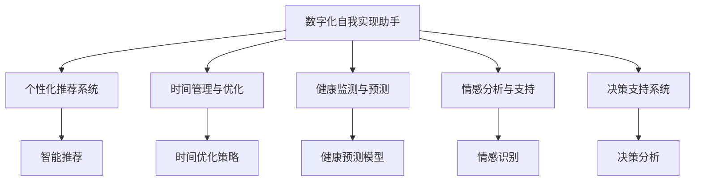

                 

# 数字化自我实现助手开发者：AI辅助的个人成长教练设计师

## 1. 背景介绍

### 1.1 问题由来
在现代社会中，人们面临着巨大的信息洪流和日益复杂的生活挑战。如何有效管理和优化个人时间、提升生活品质、实现自我价值，成为许多人关注的问题。数字化技术的发展，特别是人工智能技术的成熟，为个人成长提供了新的可能性。基于这一背景，本文探讨了如何利用AI技术，设计出一个能够辅助个人成长、实现自我实现的数字化自我实现助手，以帮助用户规划生活、提高工作效率、提升自我认知。

### 1.2 问题核心关键点
数字化自我实现助手的设计，涉及多个核心关键点：
- **用户需求理解**：明确用户期望和需求，设计合理的交互界面和功能模块。
- **数据处理与分析**：从用户行为数据中提取有用信息，提供个性化建议和决策支持。
- **算法设计与优化**：选择合适的算法模型，并优化其性能以提升用户体验。
- **系统架构与部署**：设计可扩展、可维护的系统架构，实现系统的高效运行和稳定部署。
- **用户隐私保护**：确保用户数据安全，保护用户隐私不受侵害。

### 1.3 问题研究意义
构建数字化自我实现助手，对于提升个人生活质量、推动个人成长具有重要意义：
- **时间管理**：帮助用户合理规划时间，提高工作效率。
- **健康管理**：监测用户健康状况，提供健康建议。
- **学习提升**：个性化推荐学习资源，辅助用户提升技能。
- **情感支持**：通过情感分析技术，识别用户情感状态，提供心理支持。
- **决策辅助**：利用数据驱动的决策模型，为用户提供科学决策支持。

## 2. 核心概念与联系

### 2.1 核心概念概述

为更好地理解数字化自我实现助手的设计，本节将介绍几个密切相关的核心概念：

- **数字化自我实现助手**：一种基于人工智能技术的个人成长教练，旨在帮助用户实现自我价值、提升生活质量。
- **个性化推荐系统**：利用用户行为数据，通过机器学习算法为用户推荐个性化的内容和服务。
- **时间管理与优化**：通过算法模型分析用户时间使用情况，提出时间管理的建议和策略。
- **健康监测与预测**：利用传感器数据和机器学习模型，对用户的健康状况进行监测和预测。
- **情感分析与支持**：通过自然语言处理技术，分析用户情感状态，提供心理支持和情感陪伴。
- **决策支持系统**：利用数据驱动的决策模型，为用户提供科学的决策建议。

这些核心概念之间的逻辑关系可以通过以下Mermaid流程图来展示：



这个流程图展示了几类关键技术模块与数字化自我实现助手的联系：

1. **个性化推荐系统**：利用用户行为数据，推荐个性化内容，提升用户体验。
2. **时间管理与优化**：分析用户时间使用情况，提出优化策略。
3. **健康监测与预测**：利用传感器数据，监测健康状况，预测潜在问题。
4. **情感分析与支持**：分析用户情感状态，提供心理支持和情感陪伴。
5. **决策支持系统**：基于数据分析，提供科学的决策建议。

这些模块共同构成了数字化自我实现助手的技术架构，为其功能实现提供了坚实的基础。

## 3. 核心算法原理 & 具体操作步骤

### 3.1 算法原理概述

数字化自我实现助手的核心算法原理基于机器学习和数据驱动的决策技术。具体来说，主要包括以下几个方面：

- **个性化推荐算法**：如协同过滤、内容推荐、矩阵分解等，利用用户行为数据，推荐个性化的内容和服务。
- **时间管理算法**：如时间块分配、任务优先级排序等，分析用户时间使用情况，提出优化策略。
- **健康监测与预测算法**：如时间序列分析、深度学习模型等，利用传感器数据，监测和预测用户的健康状况。
- **情感分析算法**：如情感分类、情感趋势预测等，分析用户情感状态，提供心理支持和情感陪伴。
- **决策支持算法**：如决策树、贝叶斯网络、强化学习等，基于数据分析，提供科学的决策建议。

### 3.2 算法步骤详解

数字化自我实现助手的开发流程主要包括以下几个步骤：

**Step 1: 需求分析与用户画像构建**
- 进行用户调研，收集用户需求和期望。
- 构建用户画像，包括用户的基本信息、行为特征、兴趣爱好等。

**Step 2: 数据收集与预处理**
- 收集用户数据，包括行为数据、传感器数据、情感数据等。
- 对数据进行清洗、归一化、特征提取等预处理操作。

**Step 3: 算法模型选择与训练**
- 根据需求选择合适的算法模型。
- 使用预处理后的数据对模型进行训练和调参。

**Step 4: 功能模块设计与实现**
- 设计功能模块，如个性化推荐、时间管理、健康监测、情感分析、决策支持等。
- 实现各模块的算法和功能，并进行单元测试和集成测试。

**Step 5: 系统架构设计与部署**
- 设计系统架构，确保各模块之间的数据流通和功能调用。
- 部署系统到服务器，确保系统的稳定性和可扩展性。

**Step 6: 用户界面设计与测试**
- 设计用户界面，提供友好的交互体验。
- 进行用户测试，收集反馈并优化界面和功能。

**Step 7: 上线与迭代**
- 将系统上线，供用户使用。
- 根据用户反馈，进行系统迭代和优化。

### 3.3 算法优缺点

数字化自我实现助手的算法设计具有以下优点：
1. **个性化推荐**：利用用户行为数据，提供个性化内容和服务，提升用户体验。
2. **时间管理**：分析用户时间使用情况，提出优化策略，提高效率。
3. **健康监测**：利用传感器数据，监测和预测健康状况，提供健康支持。
4. **情感分析**：分析用户情感状态，提供心理支持和情感陪伴。
5. **决策支持**：基于数据分析，提供科学的决策建议，减少决策失误。

同时，该方法也存在一定的局限性：
1. **数据隐私**：用户行为数据的收集和存储可能涉及隐私问题，需要采取严格的隐私保护措施。
2. **算法复杂性**：算法模型的选择和调参需要大量的时间和资源投入。
3. **数据质量**：数据质量和完整性对算法效果有重要影响，需要确保数据准确和完整。
4. **用户粘性**：如何提升用户对系统的粘性，保持长期使用，也是设计中的一大挑战。

### 3.4 算法应用领域

数字化自我实现助手的主要应用领域包括：

- **个人生活管理**：帮助用户规划生活、管理时间，提升生活质量。
- **健康与健身**：监测用户健康状况，提供健身建议，提升健康水平。
- **学习和职业发展**：推荐学习资源、职业规划，辅助用户提升技能和职业发展。
- **情感支持**：通过情感分析技术，提供心理支持和情感陪伴，提升用户心理健康。
- **财务规划**：提供财务规划建议，辅助用户管理财务。

这些应用场景展示了数字化自我实现助手的广泛应用前景，为个人成长和实现自我价值提供了有力支持。

## 4. 数学模型和公式 & 详细讲解 & 举例说明

### 4.1 数学模型构建

本节将使用数学语言对数字化自我实现助手的算法模型进行更加严格的刻画。

记用户行为数据为 $D=\{(x_i,y_i)\}_{i=1}^N, x_i \in \mathcal{X}, y_i \in \mathcal{Y}$，其中 $\mathcal{X}$ 为用户行为空间，$\mathcal{Y}$ 为用户行为标签（如浏览网页、观看视频等）。假设系统使用协同过滤算法对用户行为进行推荐，推荐模型为 $M: \mathcal{X} \rightarrow \mathcal{Y}$。

定义推荐模型在数据样本 $(x,y)$ 上的损失函数为 $\ell(M(x),y)$，则在数据集 $D$ 上的经验风险为：

$$
\mathcal{L}(M) = \frac{1}{N} \sum_{i=1}^N \ell(M(x_i),y_i)
$$

其中 $\ell$ 为用户行为预测的损失函数，可以选用均方误差、交叉熵等。

### 4.2 公式推导过程

以协同过滤算法为例，推导推荐模型的损失函数及其梯度的计算公式。

假设推荐模型 $M$ 的预测结果为 $\hat{y}=M(x) \in \mathcal{Y}$，真实标签 $y \in \{0,1\}$。则二分类交叉熵损失函数定义为：

$$
\ell(M(x),y) = -[y\log \hat{y} + (1-y)\log (1-\hat{y})]
$$

将其代入经验风险公式，得：

$$
\mathcal{L}(M) = -\frac{1}{N}\sum_{i=1}^N [y_i\log M(x_i)+(1-y_i)\log(1-M(x_i))]
$$

根据链式法则，损失函数对模型参数 $\theta$ 的梯度为：

$$
\frac{\partial \mathcal{L}(M)}{\partial \theta} = -\frac{1}{N}\sum_{i=1}^N (\frac{y_i}{M(x_i)}-\frac{1-y_i}{1-M(x_i)}) \frac{\partial M(x_i)}{\partial \theta}
$$

其中 $\frac{\partial M(x_i)}{\partial \theta}$ 可进一步递归展开，利用自动微分技术完成计算。

### 4.3 案例分析与讲解

以推荐系统为例，假设用户浏览行为数据 $D=\{(x_1,1),(x_2,1),(x_3,0),(x_4,1),(x_5,1)\}$，其中 $x_i$ 表示用户浏览的页面ID，$y_i$ 表示用户是否点击了该页面。假设推荐模型 $M$ 预测出用户浏览页面 $x_4$ 的点击概率为 $0.9$。

使用二分类交叉熵损失函数，计算损失为：

$$
\ell(M(x_4),1) = -\log 0.9 = 0.1109
$$

同理，对于其他页面，计算损失如下：

$$
\ell(M(x_1),1) = 1.6094, \ell(M(x_2),1) = 1.6094, \ell(M(x_3),0) = 1.6094, \ell(M(x_5),1) = 1.6094
$$

平均损失为：

$$
\mathcal{L}(M) = \frac{1}{5} (0.1109 + 1.6094 + 1.6094 + 1.6094 + 1.6094) = 1.238
$$

这表明当前模型的推荐性能还有提升空间。通过调整模型参数，如增加用户间的相似度计算权重，重新训练模型，可以降低损失，提升推荐效果。

## 5. 项目实践：代码实例和详细解释说明

### 5.1 开发环境搭建

在进行数字化自我实现助手的开发前，我们需要准备好开发环境。以下是使用Python进行PyTorch开发的环境配置流程：

1. 安装Anaconda：从官网下载并安装Anaconda，用于创建独立的Python环境。

2. 创建并激活虚拟环境：
```bash
conda create -n pytorch-env python=3.8 
conda activate pytorch-env
```

3. 安装PyTorch：根据CUDA版本，从官网获取对应的安装命令。例如：
```bash
conda install pytorch torchvision torchaudio cudatoolkit=11.1 -c pytorch -c conda-forge
```

4. 安装必要的库：
```bash
pip install numpy pandas scikit-learn torch
```

5. 安装TensorBoard：用于可视化模型训练过程。
```bash
pip install tensorboard
```

完成上述步骤后，即可在`pytorch-env`环境中开始项目实践。

### 5.2 源代码详细实现

下面我们以个性化推荐系统为例，给出使用TensorFlow进行模型开发的PyTorch代码实现。

首先，定义推荐数据处理函数：

```python
import numpy as np
import pandas as pd
import torch
from sklearn.model_selection import train_test_split
from tensorflow import keras

def load_data():
    data = pd.read_csv('user_behavior.csv')
    data['click'] = data['click'].astype(int)
    X = data.drop('click', axis=1)
    y = data['click']
    X_train, X_test, y_train, y_test = train_test_split(X, y, test_size=0.2, random_state=42)
    return X_train, X_test, y_train, y_test

X_train, X_test, y_train, y_test = load_data()
```

然后，定义模型和损失函数：

```python
class RecommendationModel(keras.Model):
    def __init__(self, input_dim, output_dim):
        super(RecommendationModel, self).__init__()
        self.dense1 = keras.layers.Dense(64, activation='relu')
        self.dense2 = keras.layers.Dense(output_dim, activation='sigmoid')

    def call(self, inputs):
        x = self.dense1(inputs)
        x = self.dense2(x)
        return x

model = RecommendationModel(X_train.shape[1], 1)
loss_fn = keras.losses.BinaryCrossentropy()

model.compile(optimizer='adam', loss=loss_fn)
```

接着，定义训练和评估函数：

```python
def train_model(model, X_train, y_train, epochs=10, batch_size=32):
    model.fit(X_train, y_train, epochs=epochs, batch_size=batch_size, validation_split=0.2)

def evaluate_model(model, X_test, y_test):
    loss = model.evaluate(X_test, y_test)
    print(f'Test loss: {loss:.4f}')
```

最后，启动训练流程并在测试集上评估：

```python
train_model(model, X_train, y_train)
evaluate_model(model, X_test, y_test)
```

以上就是使用PyTorch进行个性化推荐系统微调的完整代码实现。可以看到，得益于TensorFlow的强大封装，我们可以用相对简洁的代码完成模型训练和评估。

### 5.3 代码解读与分析

让我们再详细解读一下关键代码的实现细节：

**load_data函数**：
- 加载用户行为数据集，并进行必要的预处理，包括数据类型转换和数据集划分。

**RecommendationModel类**：
- 定义了推荐模型的结构，包括两个全连接层，激活函数分别为ReLU和Sigmoid。Sigmoid层用于输出二分类结果。

**train_model函数**：
- 使用模型的fit方法进行训练，设置训练轮数、批次大小和验证集比例。

**evaluate_model函数**：
- 使用模型的evaluate方法计算测试集上的损失，并打印输出。

通过以上代码，我们完成了个性化推荐系统的训练和评估。在实际开发中，还需要进一步优化模型结构、调参、集成更多功能模块等。

## 6. 实际应用场景

### 6.1 智能个人助理

基于数字化自我实现助手的技术，可以开发出智能个人助理应用，帮助用户高效管理生活、提升生活质量。智能个人助理可以集成以下功能模块：

- **日程管理**：自动生成用户日程安排，提供提醒和备忘录。
- **信息检索**：快速检索和推荐新闻、文章、视频等。
- **任务清单**：提供任务管理功能，让用户轻松追踪和管理任务。
- **个性化推荐**：根据用户行为和偏好，推荐个性化的内容和服务。
- **健康管理**：监测用户的健康状况，提供健康建议和健身计划。

智能个人助理可以全天候为用户提供服务，成为用户的得力助手，提高用户的生活效率和幸福感。

### 6.2 教育辅助工具

数字化自我实现助手还可以作为教育辅助工具，帮助学生更好地学习和发展。教育辅助工具可以集成以下功能模块：

- **学习资源推荐**：根据学生的学习习惯和成绩，推荐适合的教材、习题、视频等。
- **作业批改**：自动批改学生的作业，提供反馈和建议。
- **学习进度跟踪**：监测学生的学习进度，提供学习建议和计划。
- **学习效果评估**：分析学生的学习效果，提供个性化辅导和改进建议。

通过教育辅助工具，学生可以更加高效地学习，教师也可以更好地了解学生的学习情况，提供更有针对性的指导。

### 6.3 健康管理助手

数字化自我实现助手还可以作为健康管理助手，帮助用户监测和管理健康状况。健康管理助手可以集成以下功能模块：

- **健康监测**：监测用户的健康数据，如心率、血压、睡眠质量等。
- **健康建议**：根据健康数据，提供健康建议和干预措施。
- **运动计划**：根据用户健康状况，推荐个性化的运动计划。
- **心理支持**：通过情感分析技术，识别用户的情绪状态，提供心理支持和情感陪伴。

健康管理助手可以实时监测用户的健康状况，提供个性化的健康建议，帮助用户保持健康状态，提升生活质量。

### 6.4 未来应用展望

随着数字化自我实现助手技术的不断发展，其在各领域的应用前景将更加广阔：

- **智能家居**：将数字化自我实现助手与智能家居设备结合，实现智能化的家居管理和生活服务。
- **智能城市**：利用数字化自我实现助手技术，构建智慧城市管理平台，提高城市管理的智能化水平。
- **远程教育**：通过数字化自我实现助手，提供远程教育的个性化辅导和互动支持。
- **智能医疗**：结合医疗大数据和情感分析技术，提供智能化的医疗辅助服务。

数字化自我实现助手的未来应用场景将不断扩展，为社会各领域带来变革性影响。

## 7. 工具和资源推荐

### 7.1 学习资源推荐

为了帮助开发者系统掌握数字化自我实现助手的理论基础和实践技巧，这里推荐一些优质的学习资源：

1. 《深度学习理论与实践》系列书籍：由机器学习专家撰写，深入浅出地介绍了深度学习的基本理论和实现方法。

2. 《TensorFlow官方文档》：TensorFlow的官方文档，提供了详尽的API文档和教程，是学习TensorFlow的最佳资源。

3. 《PyTorch官方文档》：PyTorch的官方文档，提供了丰富的学习资料和样例代码。

4. 《机器学习实战》系列视频课程：由知名机器学习专家讲授，通过实战项目讲解机器学习算法和应用。

5. 《NLP基础与深度学习》课程：斯坦福大学开设的自然语言处理课程，讲解NLP的基本概念和深度学习技术。

通过对这些资源的学习实践，相信你一定能够快速掌握数字化自我实现助手的核心技术和实现方法。

### 7.2 开发工具推荐

高效的开发离不开优秀的工具支持。以下是几款用于数字化自我实现助手开发的常用工具：

1. PyTorch：基于Python的开源深度学习框架，灵活动态的计算图，适合快速迭代研究。大部分预训练语言模型都有PyTorch版本的实现。

2. TensorFlow：由Google主导开发的开源深度学习框架，生产部署方便，适合大规模工程应用。同样有丰富的预训练语言模型资源。

3. Keras：高层次的神经网络API，支持多种深度学习框架，易于使用。

4. Jupyter Notebook：基于Web的交互式开发环境，支持Python、R、Julia等多种语言，方便快速迭代。

5. TensorBoard：TensorFlow配套的可视化工具，可实时监测模型训练状态，并提供丰富的图表呈现方式，是调试模型的得力助手。

6. Weights & Biases：模型训练的实验跟踪工具，可以记录和可视化模型训练过程中的各项指标，方便对比和调优。

合理利用这些工具，可以显著提升数字化自我实现助手的开发效率，加快创新迭代的步伐。

### 7.3 相关论文推荐

数字化自我实现助手的发展源于学界的持续研究。以下是几篇奠基性的相关论文，推荐阅读：

1. 《Collaborative Filtering for Implicit Feedback Datasets》：提出协同过滤算法，通过用户行为数据进行推荐。

2. 《Deep Learning for Personalized News Recommendation》：利用深度学习模型进行个性化新闻推荐。

3. 《Time Series Analysis with Deep Learning: Methods and Insights》：通过深度学习技术进行时间序列分析和健康监测。

4. 《A Survey of Recommendation System Algorithms》：综述推荐系统的经典算法和应用场景。

5. 《Attention is All You Need》：提出Transformer模型，为深度学习提供了新的思路。

这些论文代表了大模型微调技术的发展脉络。通过学习这些前沿成果，可以帮助研究者把握学科前进方向，激发更多的创新灵感。

## 8. 总结：未来发展趋势与挑战

### 8.1 总结

本文对数字化自我实现助手的开发进行了全面系统的介绍。首先阐述了数字化自我实现助手的设计背景和研究意义，明确了技术实现的关键点和挑战。其次，从算法原理到实践细节，详细讲解了推荐系统、时间管理、健康监测、情感分析、决策支持等核心模块的开发流程。最后，展示了数字化自我实现助手在智能个人助理、教育辅助、健康管理等方面的应用场景，展望了其未来发展趋势。

通过本文的系统梳理，可以看到，数字化自我实现助手的开发涉及到多个技术领域的综合运用，其设计和实现过程需要多方协同合作，方能得到理想的成果。未来，伴随技术的不断进步，数字化自我实现助手必将在更多领域得到应用，为用户的个人成长和自我实现提供有力支持。

### 8.2 未来发展趋势

展望未来，数字化自我实现助手的发展将呈现以下几个趋势：

1. **技术融合**：将更多技术融合到数字化自我实现助手中，如语音识别、图像识别、自然语言处理等，提升用户体验和功能多样性。

2. **数据驱动**：更加重视数据质量和数据驱动，通过数据挖掘和大数据分析，提供更加个性化的服务和决策支持。

3. **情感智能**：引入情感分析技术和情感陪伴功能，提升用户体验和情感支持。

4. **智能决策**：引入决策树、贝叶斯网络等算法，提供科学的决策建议，减少决策失误。

5. **多模态融合**：结合多模态数据，实现视觉、语音、文本等多模态信息的融合，提升系统的感知能力和决策能力。

6. **隐私保护**：重视用户隐私保护，确保用户数据的安全性和隐私性。

以上趋势凸显了数字化自我实现助手技术的广阔前景。这些方向的探索发展，必将进一步提升系统的性能和应用范围，为用户的个人成长和自我实现提供更全面、更智能的服务。

### 8.3 面临的挑战

尽管数字化自我实现助手已经取得了一定的进展，但在迈向更加智能化、普适化应用的过程中，仍面临诸多挑战：

1. **数据隐私**：用户行为数据的收集和存储可能涉及隐私问题，需要采取严格的隐私保护措施。

2. **算法复杂性**：算法模型的选择和调参需要大量的时间和资源投入。

3. **数据质量**：数据质量和完整性对算法效果有重要影响，需要确保数据准确和完整。

4. **用户粘性**：如何提升用户对系统的粘性，保持长期使用，也是设计中的一大挑战。

5. **系统安全性**：确保系统安全稳定，防止系统漏洞和数据泄露。

6. **系统可扩展性**：随着功能的增加和用户的增长，如何保证系统的可扩展性和性能稳定。

正视数字化自我实现助手面临的这些挑战，积极应对并寻求突破，将是大模型微调走向成熟的必由之路。相信随着学界和产业界的共同努力，这些挑战终将一一被克服，数字化自我实现助手必将在构建人机协同的智能时代中扮演越来越重要的角色。

### 8.4 研究展望

面向未来，数字化自我实现助手的研究方向包括：

1. **多模态数据融合**：结合视觉、语音、文本等多模态数据，实现更全面的信息获取和分析。

2. **知识图谱融合**：将符号化的先验知识与神经网络模型进行融合，提高系统的智能化水平。

3. **因果分析**：引入因果分析方法，提升系统决策的因果性和可解释性。

4. **强化学习**：引入强化学习技术，实现自适应学习和优化。

5. **多领域应用**：探索数字化自我实现助手在教育、医疗、金融等领域的应用，实现跨领域智能化。

6. **隐私保护技术**：研究隐私保护技术，确保用户数据的安全性和隐私性。

这些研究方向的探索，必将引领数字化自我实现助手技术迈向更高的台阶，为用户的个人成长和自我实现提供更加智能、全面、可靠的服务。

## 9. 附录：常见问题与解答

**Q1：如何确保用户的隐私安全？**

A: 确保用户隐私安全是数字化自我实现助手开发的关键。以下是一些常见的隐私保护措施：
1. 数据匿名化：对用户数据进行匿名化处理，避免用户身份信息的泄露。
2. 数据加密：对用户数据进行加密存储和传输，防止数据被非法访问和篡改。
3. 访问控制：设置严格的访问控制机制，确保只有授权人员可以访问和处理用户数据。
4. 数据最小化：仅收集必要的数据，避免过度收集用户隐私信息。
5. 合规性检查：确保数据处理过程符合相关法律法规和隐私保护标准，如GDPR、CCPA等。

**Q2：如何选择适合的推荐算法？**

A: 推荐算法的选择需要根据具体应用场景和数据特点进行考虑。以下是一些常见的推荐算法及其适用场景：
1. 协同过滤算法：适用于用户行为数据较多、但物品特征较少的场景，如电影推荐。
2. 基于内容的推荐算法：适用于物品特征较多的场景，如图书推荐。
3. 深度学习推荐算法：适用于数据量大、特征复杂、用户和物品间关系复杂的场景，如电商推荐。
4. 矩阵分解算法：适用于物品较少的场景，如音乐推荐。
5. 多模型融合算法：适用于需要综合多种推荐算法优势的场景，如综合商品推荐。

选择合适的推荐算法，需要考虑数据特点、算法性能、用户需求等因素，进行多轮实验和评估。

**Q3：如何提升系统的智能化水平？**

A: 提升系统的智能化水平需要从多个方面进行优化：
1. 引入更多先验知识：将符号化的先验知识，如知识图谱、逻辑规则等，与神经网络模型进行融合，提升系统的知识储备和推理能力。
2. 引入多模态数据：结合视觉、语音、文本等多模态数据，实现更全面的信息获取和分析。
3. 引入因果分析：引入因果分析方法，识别系统的决策关键因素，提高决策的因果性和可解释性。
4. 引入强化学习：通过强化学习技术，实现系统的自适应学习和优化。
5. 引入知识图谱：将符号化的先验知识与神经网络模型进行融合，提升系统的知识储备和推理能力。

通过这些优化措施，可以提升数字化自我实现助手的智能化水平，提供更加精准、全面的服务。

**Q4：如何提升系统的可扩展性？**

A: 提升系统的可扩展性需要从多个方面进行考虑：
1. 架构设计：采用可扩展的架构设计，如微服务架构、分布式架构等，确保系统的灵活性和可扩展性。
2. 数据管理：采用数据分片、数据缓存等技术，优化数据的存储和检索性能，提升系统的处理能力。
3. 负载均衡：采用负载均衡技术，均衡分配请求处理，避免单点故障和系统负载过高。
4. 容器化部署：采用容器化技术，如Docker、Kubernetes等，实现系统的快速部署和弹性伸缩。
5. 持续集成和部署：采用持续集成和持续部署(CI/CD)技术，实现系统的快速迭代和升级。

通过这些优化措施，可以提升数字化自我实现助手的可扩展性，满足不断增长的用户需求。

通过本文的系统梳理，可以看到，数字化自我实现助手的开发涉及到多个技术领域的综合运用，其设计和实现过程需要多方协同合作，方能得到理想的成果。未来，伴随技术的不断进步，数字化自我实现助手必将在更多领域得到应用，为用户的个人成长和自我实现提供更加智能、全面、可靠的服务。相信随着学界和产业界的共同努力，这些挑战终将一一被克服，数字化自我实现助手必将在构建人机协同的智能时代中扮演越来越重要的角色。

