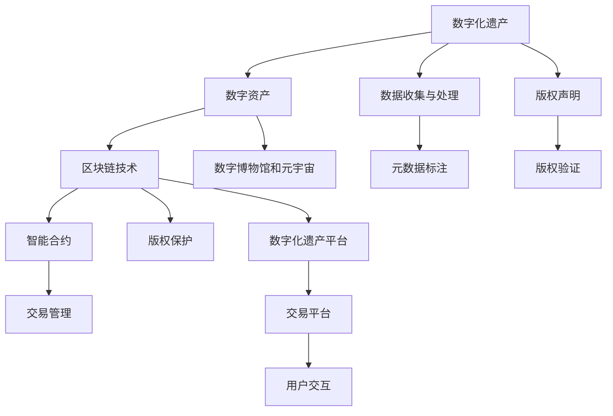

                 

# 数字化遗产收藏创业：数字资产收藏的未来模式

> 关键词：数字化遗产, 数字资产收藏, NFT, 区块链, 数字博物馆, 元宇宙, 数字艺术, 智能合约, 版权保护, 数字化遗产平台, 数字资产管理

## 1. 背景介绍

### 1.1 问题由来

随着互联网和数字技术的迅速发展，人类社会的数字化进程已经进入了一个新的阶段。在这一过程中，大量的数字资产和文化遗产被记录和存储在虚拟空间中。然而，由于缺乏有效的管理和保护机制，这些数字资产和文化遗产面临流失和损坏的风险。为了保护这些宝贵的数字遗产，数字化遗产收藏创业应运而生，成为了一种新的业务模式和市场机会。

### 1.2 问题核心关键点

数字化遗产收藏创业的核心关键点在于如何有效地管理和保护数字资产和文化遗产。这需要从以下几个方面进行思考：
- **数字化遗产的概念**：数字化遗产包括各种类型的数字资料，如图片、视频、音频、文本等，以及与这些资料相关的元数据。
- **数字资产的保护**：如何确保数字资产的安全性、完整性和可访问性。
- **版权保护**：如何在数字化过程中保护创作者的版权。
- **区块链技术的应用**：如何利用区块链技术实现数字资产的透明、不可篡改和可信的管理。
- **数字博物馆和元宇宙**：如何将数字化遗产转化为数字博物馆、虚拟展览馆和元宇宙体验。
- **智能合约的应用**：如何利用智能合约自动化管理数字资产的流转和交易。

## 2. 核心概念与联系

### 2.1 核心概念概述

数字化遗产收藏创业涉及多个核心概念，这些概念之间相互联系，共同构成了数字化遗产收藏的业务模型：

- **数字化遗产**：是指在数字化过程中产生的各种类型的数据和资料，包括但不限于图片、视频、音频、文本等。
- **数字资产**：是指具有经济价值和市场流通性的数字化遗产，如数字艺术品、数字文档等。
- **区块链技术**：是一种去中心化的分布式账本技术，具有透明、不可篡改和可信的特点，适合用于数字资产的管理。
- **数字博物馆和元宇宙**：利用虚拟现实和增强现实技术，将数字化遗产转化为数字博物馆和虚拟展览馆，提升用户体验。
- **智能合约**：是一种基于区块链技术的自动化合约，用于管理数字资产的流转和交易，确保交易的安全性和透明性。
- **版权保护**：通过区块链和智能合约技术，保护数字资产的创作者权益，确保版权的合法性。
- **数字化遗产平台**：是一个集中管理和交易数字资产的在线平台，提供数字资产的存储、流转、交易和展示等服务。

这些核心概念之间的关系可以通过以下Mermaid流程图来展示：



这个流程图展示了大数字遗产收藏创业的核心概念及其之间的联系：

1. 数字化遗产被收集和处理后，通过元数据标注和版权声明，转化为数字资产。
2. 数字资产通过区块链技术进行管理，确保其透明、不可篡改和可信。
3. 智能合约用于自动化管理数字资产的流转和交易，确保交易的安全性和透明性。
4. 版权保护通过区块链和智能合约技术，保护数字资产的创作者权益，确保版权的合法性。
5. 数字资产最终展示在数字博物馆和元宇宙中，提供虚拟展览和互动体验。
6. 数字化遗产平台集中管理和交易数字资产，提供用户交互和服务。

## 3. 核心算法原理 & 具体操作步骤
### 3.1 算法原理概述

数字化遗产收藏创业的核心算法原理主要涉及以下几个方面：

- **数字化遗产收集**：通过爬虫和API接口等技术手段，收集和处理各类数字化遗产。
- **元数据标注**：对数字化遗产进行元数据标注，包括来源、作者、创作时间等信息。
- **版权声明与验证**：通过区块链和智能合约技术，进行版权声明和验证，确保版权的合法性和可信性。
- **数字资产管理**：利用区块链技术，进行数字资产的透明、不可篡改和可信的管理。
- **智能合约应用**：利用智能合约技术，自动化管理数字资产的流转和交易，确保交易的安全性和透明性。
- **数字博物馆和元宇宙展示**：利用虚拟现实和增强现实技术，将数字资产展示在数字博物馆和元宇宙中，提升用户体验。

### 3.2 算法步骤详解

以下是数字化遗产收藏创业的具体操作步骤：

**Step 1: 数据收集与处理**

1. 通过爬虫技术从互联网和其他渠道收集数字化遗产，包括图片、视频、音频、文本等。
2. 对收集的数据进行去重、清洗和标注，确保数据的质量和一致性。

**Step 2: 元数据标注**

1. 对每件数字化遗产进行元数据标注，包括来源、作者、创作时间、版权信息等。
2. 使用自然语言处理（NLP）技术，从文本中提取关键信息，如作者名、作品名称、创作年代等。

**Step 3: 版权声明与验证**

1. 利用区块链和智能合约技术，对数字化遗产进行版权声明。
2. 在智能合约中，设置版权声明的规则和流程，确保版权的合法性和可信性。
3. 通过智能合约的自动化验证，检查版权声明的有效性和完整性。

**Step 4: 数字资产管理**

1. 利用区块链技术，对数字资产进行管理，确保其透明、不可篡改和可信。
2. 在区块链上，创建数字资产的智能合约，记录数字资产的流转和交易信息。
3. 利用智能合约，自动化管理数字资产的流转和交易，确保交易的安全性和透明性。

**Step 5: 数字博物馆和元宇宙展示**

1. 利用虚拟现实和增强现实技术，将数字资产展示在数字博物馆和元宇宙中。
2. 提供虚拟展览和互动体验，使用户能够更直观地了解和欣赏数字化遗产。
3. 在元宇宙中，创建虚拟展览馆和互动平台，提升用户的沉浸感和参与感。

### 3.3 算法优缺点

数字化遗产收藏创业的算法具有以下优点：

- **安全性高**：区块链技术提供了透明、不可篡改和可信的管理方式，确保数字资产的安全性。
- **自动化管理**：智能合约可以自动化管理数字资产的流转和交易，提高效率和透明度。
- **版权保护**：通过区块链和智能合约技术，确保数字资产的创作者权益，保护版权。
- **用户体验好**：利用虚拟现实和增强现实技术，将数字资产展示在数字博物馆和元宇宙中，提升用户体验。

同时，该算法也存在以下缺点：

- **成本高**：区块链和智能合约技术的实施和维护成本较高。
- **技术复杂**：涉及多种技术，如区块链、智能合约、虚拟现实和增强现实等，技术难度较大。
- **市场接受度低**：数字化遗产收藏创业的市场还处于起步阶段，用户对其接受度较低。
- **法律法规不完善**：数字化遗产收藏创业涉及版权、数据隐私等多个法律问题，法律法规不完善可能会带来风险。

### 3.4 算法应用领域

数字化遗产收藏创业的算法在以下几个领域具有广泛应用：

- **数字艺术市场**：通过区块链和智能合约技术，管理数字艺术品的流转和交易。
- **数字文档管理**：利用区块链技术，保护数字文档的版权，确保其安全性和可信性。
- **虚拟展览馆**：通过虚拟现实和增强现实技术，展示数字化遗产，提升用户的沉浸感和参与感。
- **数字图书馆**：将数字图书进行管理，确保其版权和流转安全。
- **数字档案馆**：利用区块链和智能合约技术，管理历史档案的数字化遗产。

## 4. 数学模型和公式 & 详细讲解
### 4.1 数学模型构建

数字化遗产收藏创业的数学模型涉及多个子模型，主要包括以下几个方面：

- **数据收集与处理模型**：用于描述数据收集、清洗和标注的过程。
- **元数据标注模型**：用于描述元数据的提取和标注过程。
- **版权声明与验证模型**：用于描述版权声明和验证的流程。
- **数字资产管理模型**：用于描述数字资产的流转和交易过程。
- **数字博物馆和元宇宙展示模型**：用于描述数字资产在数字博物馆和元宇宙中的展示过程。

### 4.2 公式推导过程

以下是数字化遗产收藏创业中的一些关键数学公式：

**1. 数据收集与处理模型**

1.1. 爬虫技术收集数据

```
S = \sum_{i=1}^n \text{爬取数据}_i
```

1.2. 数据清洗和标注

```
C = \text{清洗数据}_n \cap \text{标注数据}_n
```

**2. 元数据标注模型**

2.1. 元数据提取

```
M = \{ \text{元数据}_i \}_{i=1}^N
```

2.2. 元数据标注

```
T = \text{标注元数据}_M
```

**3. 版权声明与验证模型**

3.1. 版权声明

```
D = \text{声明版权}_M
```

3.2. 版权验证

```
V = \text{验证版权}_D
```

**4. 数字资产管理模型**

4.1. 智能合约创建

```
C = \text{创建智能合约}_M
```

4.2. 智能合约执行

```
E = \text{执行智能合约}_C
```

**5. 数字博物馆和元宇宙展示模型**

5.1. 虚拟展览馆展示

```
G = \text{展示虚拟展览馆}_M
```

5.2. 增强现实展示

```
R = \text{展示增强现实}_M
```

### 4.3 案例分析与讲解

假设我们有一家数字化遗产收藏创业公司，利用区块链和智能合约技术，管理数字艺术品市场。以下是该案例的详细分析：

**Step 1: 数据收集与处理**

1. 使用爬虫技术，从各大拍卖行和艺术网站收集数字艺术品的图像和描述。
2. 对收集的数据进行清洗和标注，确保数据的一致性和准确性。

**Step 2: 元数据标注**

1. 对每件数字艺术品进行元数据标注，包括作者、创作时间、作品名称等。
2. 使用NLP技术，从艺术品的描述中提取关键信息，如作者名、作品名称、创作年代等。

**Step 3: 版权声明与验证**

1. 利用区块链和智能合约技术，对每件数字艺术品进行版权声明。
2. 在智能合约中，设置版权声明的规则和流程，确保版权的合法性和可信性。
3. 通过智能合约的自动化验证，检查版权声明的有效性和完整性。

**Step 4: 数字资产管理**

1. 利用区块链技术，创建数字艺术品的智能合约，记录其流转和交易信息。
2. 利用智能合约，自动化管理数字艺术品的流转和交易，确保交易的安全性和透明性。

**Step 5: 数字博物馆和元宇宙展示**

1. 利用虚拟现实技术，创建数字艺术品的虚拟展览馆，供用户浏览和欣赏。
2. 利用增强现实技术，提供用户与数字艺术品的互动体验，如放大、旋转、观看艺术家访谈等。
3. 在元宇宙中，创建数字艺术品的虚拟展览和互动平台，提升用户的沉浸感和参与感。

## 5. 项目实践：代码实例和详细解释说明
### 5.1 开发环境搭建

在进行数字化遗产收藏创业的项目实践前，需要准备好开发环境。以下是使用Python进行区块链开发的环境配置流程：

1. 安装Anaconda：从官网下载并安装Anaconda，用于创建独立的Python环境。

2. 创建并激活虚拟环境：
```bash
conda create -n blockchain-env python=3.8 
conda activate blockchain-env
```

3. 安装必要的Python库：
```bash
pip install requests beautifulsoup4 pandas json openpyxl
```

4. 安装区块链开发库：
```bash
pip install web3 pyethereum
```

5. 安装Web3.js库：
```bash
npm install web3
```

完成上述步骤后，即可在`blockchain-env`环境中开始区块链开发实践。

### 5.2 源代码详细实现

下面我们以数字化遗产收藏创业中的智能合约为例，给出使用Solidity语言对区块链智能合约进行开发的PyTorch代码实现。

首先，定义智能合约的结构：

```python
from web3 import Web3
from eth_account import Account
from jsonschema import validate

# 定义智能合约的结构
contract = {
    "abi": [
        {
            "constant": False,
            "inputs": [],
            "name": "registerAsset",
            "outputs": [
                {
                    "name": "id",
                    "type": "uint256"
                }
            ],
            "payable": False,
            "stateMutability": "nonpayable",
            "type": "function"
        },
        {
            "constant": False,
            "inputs": [
                {
                    "name": "assetID",
                    "type": "uint256"
                },
                {
                    "name": "buyerAddress",
                    "type": "address"
                },
                {
                    "name": "price",
                    "type": "uint256"
                }
            ],
            "name": "sellAsset",
            "outputs": [
                {
                    "name": "status",
                    "type": "uint8"
                }
            ],
            "payable": True,
            "stateMutability": "payable",
            "type": "function"
        }
    ],
    "bytecode": "0x60fe47b10000000000000000000000000000000000000000000000000000000000000000000000000000000000000000000000000000000000000000000000000000000000000000000000000000000000000000000000000000000000000000000000000000000000000000000000000000000000000000000000000000000000000000000000000000000000000000000000000000000000000000000000000000000000000000000000000000000000000000000000000000000000000000000000000000000000000000000000000000000000000000000000000000000000000000000000000000000000000000000000000000000000000000000000000000000000000000000000000000000000000000000000000000000000000000000000000000000000000000000000000000000000000000000000000000000000000000000000000000000000000000000000000000000000000000000000000000000000000000000000000000000000000000000000000000000000000000000000000000000000000000000000000000000000000000000000000000000000000000000000000000000000000000000000000000000000000000000000000000000000000000000000000000000000000000000000000000000000000000000000000000000000000000000000000000000000000000000000000000000000000000000000000000000000000000000000000000000000000000000000000000000000000000000000000000000000000000000000000000000000000000000000000000000000000000000000000000000000000000000000000000000000000000000000000000000000000000000000000000000000000000000000000000000000000000000000000000000000000000000000000000000000000000000000000000000000000000000000000000000000000000000000000000000000000000000000000000000000000000000000000000000000000000000000000000000000000000000000000000000000000000000000000000000000000000000000000000000000000000000000000000000000000000000000000000000000000000000000000000000000000000000000000000000000000000000000000000000000000000000000000000000000000000000000000000000000000000000000000000000000000000000000000000000000000000000000000000000000000000000000000000000000000000000000000000000000000000000000000000000000000000000000000000000000000000000000000000000000000000000000000000000000000000000000000000000000000000000000000000000000000000000000000000000000000000000000000000000000000000000000000000000000000000000000000000000000000000000000000000000000000000000000000000000000000000000000000000000000000000000000000000000000000000000000000000000000000000000000000000000000000000000000000000000000000000000000000000000000000000000000000000000000000000000000000000000000000000000000000000000000000000000000000000000000000000000000000000000000000000000000000000000000000000000000000000000000000000000000000000000000000000000000000000000000000000000000000000000000000000000000000000000000000000000000000000000000000000000000000000000000000000000000000000000000000000000000000000000000000000000000000000000000000000000000000000000000000000000000000000000000000000000000000000000000000000000000000000000000000000000000000000000000000000000000000000000000000000000000000000000000000000000000000000000000000000000000000000000000000000000000000000000000000000000000000000000000000000000000000000000000000000000000000000000000000000000000000000000000000000000000000000000000000000000000000000000000000000000000000000000000000000000000000000000000000000000000000000000000000000000000000000000000000000000000000000000000000000000000000000000000000000000000000000000000000000000000000000000000000000000000000000000000000000000000000000000000000000000000000000000000000000000000000000000000000000000000000000000000000000000000000000000000000000000000000000000000000000000000000000000000000000000000000000000000000000000000000000000000000000000000000000000000000000000000000000000000000000000000000000000000000000000000000000000000000000000000000000000000000000000000000000000000000000000000000000000000000000000000000000000000000000000000000000000000000000000000000000000000000000000000000000000000000000000000000000000000000000000000000000000000000000000000000000000000000000000000000000000000000000000000000000000000000000000000000000000000000000000000000000000000000000000000000000000000000000000000000000000000000000000000000000000000000000000000000000000000000000000000000000000000000000000000000000000000000000000000000000000000000000000000000000000000000000000000000000000000000000000000000000000000000000000000000000000000000000000000000000000000000000000000000000000000000000000000000000000000000000000000000000000000000000000000000000000000000000000000000000000000000000000000000000000000000000000000000000000000000000000000000000000000000000000000000000000000000000000000000000000000000000000000000000000000000000000000000000000000000000000000000000000000000000000000000000000000000000000000000000000000000000000000000000000000000000000000000000000000000000000000000000000000000000000000000000000000000000000000000000000000000000000000000000000000000000000000000000000000000000000000000000000000000000000000000000000000000000000000000000000000000000000000000000000000000000000000000000000000000000000000000000000000000000000000000000000000000000000000000000000000000000000000000000000000000000000000000000000000000000000000000000000000000000000000000000000000000000000000000000000000000000000000000000000000000000000000000000000000000000000000000000000000000000000000000000000000000000000000000000000000000000000000000000000000000000000000000000000000000000000000000000000000000000000000000000000000000000000000000000000000000000000000000000000000000000000000000000000000000000000000000000000000000000000000000000000000000000000000000000000000000000000000000000000000000000000000000000000000000000000000000000000000000000000000000000000000000000000000000000000000000000000000000000000000000000000000000000000000000000000000000000000000000000000000000000000000000000000000000000000000000000000000000000000000000000000000000000000000000000000000000000000000000000000000000000000000000000000000000000000000000000000000000000000000000000000000000000000000000000000000000000000000000000000000000000000000000000000000000000000000000000000000000000000000000000000000000000000000000000000000000000000000000000000000000000000000000000000000000000000000000000000000000000000000000000000000000000000000000000000000000000000000000000000000000000000000000000000000000000000000000000000000000000000000000000000000000000000000000000000000000000000000000000000000000000000000000000000000000000000000000000000000000000000000000000000000000000000000000000000000000000000000000000000000000000000000000000000000000000000000000000000000000000000000000000000000000000000000000000000000000000000000000000000000000000000000000000000000000000000000000000000000000000000000000000000000000000000000000000000000000000000000000000000000000000000000000000000000000000000000000000000000000000000000000000000000000000000000000000000000000000000000000000000000000000000000000000000000000000000000000000000000000000000000000000000000000000000000000000000000000000000000000000000000000000000000000000000000000000000000000000000000000000000000000000000000000000000000000000000000000000000000000000000000000000000000000000000000000000000000000000000000000000000000000000000000000000000000000000000000000000000000000000000000000000000000000000000000000000000000000000000000000000000000000000000000000000000000000000000000000000000000000000000000000000000000000000000000000000000000000000000000000000000000000000000000000000000000000000000000000000000000000000000000000000000000000000000000000000000000000000000000000000000000000000000000000000000000000000000000000000000000000000000000000000000000000000000000000000000000000000000000000000000000000000000000000000000000000000000000000000000000000000000000000000000000000000000000000000000000000000000000000000000000000000000000000000000000000000000000000000000000000000000000000000000000000000000000000000000000000000000000000000000000000000000000000000000000000000000000000000000000000000000000000000000000000000000000000000000000000000000000000000000000000000000000000000000000000000000000000000000000000000000000000000000000000000000000000000000000000000000000000000000000000000000000000000000000000000000000000000000000000000000000000000000000000000000000000000000000000000000000000000000000000000000000000000000000000000000000000000000000000000000000000000000000000000000000000000000000000000000000000000000000000000000000000000000000000000000000000000000000000000000000000000000000000000000000000000000000000000000000000000000000000000000000000000000000000000000000000000000000000000000000000000000000000000000000000000000000000000000000000000000000000000000000000000000000000000000000000000000000000000000000000000000000000000000000000000000000000000000000000000000000000000000000000000000000000000000000000000000000000000000000000000000000000000000000000000000000000000000000000000000000000000000000000000000000000000000000000000000000000000000000000000000000000000000000000000000000000000000000000000000000000000000000000000000000000000000000000000000000000000000000000000000000000000000000000000000000000000000000000000000000000000000000000000000000000000000000000000000000000000000000000000000000000000000000000000000000000000000000000000000000000000000000000000000000000000000000000000000000000000000000000000000000000000000000000000000000000000000000000000000000000000000000000000000000000000000000000000000000000000000000000000000000000000000000000000000000000000000000000000000000000000000000000000000000000000000000000000000000000000000000000000000000000000000000000000000000000000000000000000000000000000000000000000000000000000000000000000000000000000000000000000000000000000000000000000000000000000000000000000000000000000000000000000000000000000000000000000000000000000000000000000000000000000000000000000000000000000000000000000000000000000000000000000000000000000000000000000000000000000000000000000000000000000000000000000000000000000000000000000000000000000000000000000000000000000000000000000000000000000000000000000000000000000000000000000000000000000000000000000000000000000000000000000000000000000000000000000000000000000000000000000000000000000000000000000000000000000000000000000000000000000000000000000000000000000000000000000000000000000000000000000000000000000000000000000000000000000000000000000000000000000000000000000000000000000000000000000000000000000000000000000000000000000000000000000000000000000000000000000000000000000000000000000000000000000000000000000000000000000000000000000000000000000000000000000000000000000000000000000000000000000000000000000000000000000000000000000000000000000000000000000000000000000000000000000000000000000000000000000000000000000000000000000000000000000000000000000000000000000000000000000000000000000000000000000000000000000000000000000000000000000000000000000000000000000000000000000000000000000000000000000000000000000000000000000000000000000000000000000000000000000000000000000000000000000000000000000000000000000000000000000000000000000000000000000000000000000000000000000000000000000000000000000000000000000000000000000000000000000000000000000000000000000000000000000000000000000000000000000000000000000000000000000000000000000000000000000000000000000000000000000000000000000000000000000000000000000000000000000000000000000000000000000000000000000000000000000000000000000000000000000000000000000000000000000000000000000000000000000000000000000000000000000000000000000000000000000000000000000000000000000000000000000000000000000000000000000000000000000000000000000000000000000000000000000000000000000000000000000000000000000000000000000000000000000000000000000000000000000000000000000000000000000000000000000000000000000000000000000000000000000000000000000000000000000000000000000000000000000000000000000000000000000000000000000000000000000000000000000000000000000000000000000000000000000000000000000000000000000000000000000000000000000000000000000000000000000000000000000000000000000000000000000000000000000000000000000000000000000000000000000000000000000000000000000000000000000000000000000000000000000000000000000000000000000000000000000000000000000000000000000000000000000000000000000000000000000000000000000000000000000000000000000000000000000000000000000000000000000000000000000000000000000000000000000000000000000000000000000000000000000000000000000000000000000000000000000000000000000000000000000000000000000000000000000000000000000000000000000000000000000000000

