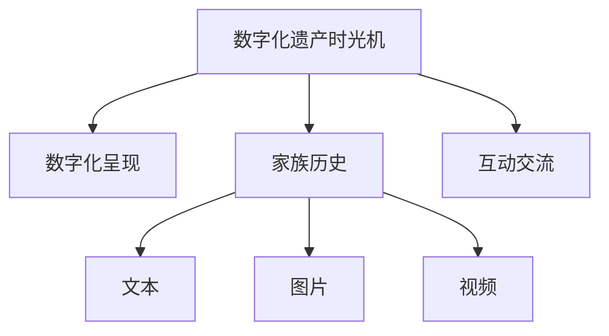

                 

# 数字化遗产时光机创业：家族历史的数字化呈现

## 1. 背景介绍

数字化遗产时光机创业项目，旨在利用现代信息技术，将家族历史数字化呈现，构建一个家族故事记录与传承的数字平台。随着数字化技术的发展，数字化遗产已成为越来越多家庭的重要需求。通过数字化遗产时光机，用户可以记录、保存和分享家族故事，让后代能够更好地了解和传承家族历史。

### 1.1 问题由来
在数字化时代，人们对家族历史的记录和传承方式发生了巨大变化。传统的纸质照片、信件、手稿等实体资料保存困难，容易损坏或丢失，而且不易检索和共享。数字化的历史资料可以长期保存，便于检索，同时也方便在多代人之间传承。数字化遗产时光机项目，就是将家族历史数字化呈现的创新尝试。

### 1.2 问题核心关键点
数字化遗产时光机创业项目的主要目标是：
- 创建一个家族历史数字化呈现的平台。
- 支持文本、图片、视频等多种形式的历史资料上传和展示。
- 提供家族成员间的互动交流和协作编辑功能。
- 实现历史资料的多代传承和共享。

为了实现这些目标，项目需要利用现代计算机技术和网络技术，包括但不限于：
- 数据库技术，用于存储和管理历史资料。
- 图像识别和OCR技术，用于扫描和识别纸质档案。
- 自然语言处理技术，用于文本信息的自动化处理和检索。
- 视频编解码和压缩技术，用于处理和传输视频资料。
- Web技术，用于构建家族成员之间的在线互动平台。

## 2. 核心概念与联系

### 2.1 核心概念概述

为更好地理解数字化遗产时光机项目的核心概念，本节将介绍几个密切相关的核心概念：

- 数字化遗产(Digital Heritage)：指通过数字化技术记录、保存和传播的家庭历史资料。
- 时光机(Time Machine)：比喻项目旨在通过数字化技术，使历史资料仿佛穿越时光，呈现给后人。
- 家族历史(Family History)：指一个家族的成员、事件、传统、故事等历史资料的集合。
- 数字化呈现(Digital Presentation)：指利用数字技术将家族历史资料以各种形式（如文本、图片、视频）呈现出来的过程。
- 互动交流(Interactive Communication)：指家族成员之间通过平台进行交流和协作，共同编辑和分享家族历史资料。

这些核心概念之间的逻辑关系可以通过以下Mermaid流程图来展示：



这个流程图展示了大数字化遗产时光机项目的核心概念及其之间的关系：

1. 项目通过数字化技术，将家族历史资料转化为数字形式。
2. 家族历史资料包括文本、图片、视频等多种形式。
3. 数字化的家族历史资料可以更好地在多代人之间传承和共享。
4. 家族成员之间可以通过互动平台进行交流和协作，共同编辑和分享家族历史资料。

## 3. 核心算法原理 & 具体操作步骤
### 3.1 算法原理概述

数字化遗产时光机项目的核心算法原理主要包括以下几个方面：

- **文本数字化**：利用OCR技术，将纸质档案等文本资料转换为数字文本，便于检索和编辑。
- **图片数字化**：通过图像识别技术，将纸质照片、信件等图片资料转换为数字格式，便于存储和展示。
- **视频数字化**：通过视频编解码技术，将家庭录像、电影等视频资料转换为数字格式，便于传输和回放。
- **文本处理**：利用自然语言处理技术，对数字文本进行分词、实体识别、情感分析等处理，提取有价值的信息。
- **互动平台构建**：利用Web技术和数据库技术，构建一个互动平台，供家族成员进行交流和协作。

### 3.2 算法步骤详解

基于数字化遗产时光机项目的目标，以下将详细介绍项目的主要算法步骤：

#### 3.2.1 文本数字化

1. **纸质档案扫描**：将纸质档案扫描成高分辨率的图像文件。
2. **图像预处理**：对扫描的图像进行去噪、裁剪等预处理，提高OCR识别的准确性。
3. **OCR识别**：利用OCR技术，将处理后的图像转换为文本文件，并进行校正和归档。

#### 3.2.2 图片数字化

1. **图片采集**：通过相机、手机等设备，采集家庭成员的照片、信件等图片资料。
2. **图片预处理**：对采集的图片进行去噪、缩放、旋转等预处理，提高后续处理的效率和准确性。
3. **图片存储**：将处理后的图片资料上传到云端存储系统，便于家族成员检索和共享。

#### 3.2.3 视频数字化

1. **视频采集**：通过摄像机、手机等设备，采集家庭活动、节日庆祝等视频资料。
2. **视频编解码**：将采集的视频资料进行编解码，转换成数字格式，并上传到云端存储系统。
3. **视频回放**：在互动平台上，家族成员可以实时观看和回放视频资料。

#### 3.2.4 文本处理

1. **文本收集**：从数字文本中提取家族成员、事件、地点等信息。
2. **文本清洗**：去除文本中的噪声和无关信息，提取有价值的内容。
3. **文本存储**：将处理后的文本资料上传到云端存储系统，便于家族成员检索和编辑。

#### 3.2.5 互动平台构建

1. **平台设计**：设计一个互动平台，支持家族成员进行交流和协作。
2. **平台实现**：利用Web技术和数据库技术，实现平台的搭建和部署。
3. **平台测试**：对互动平台进行测试，确保其稳定性和可用性。

### 3.3 算法优缺点

数字化遗产时光机项目的主要算法具有以下优点：

- **高效性**：利用OCR、图像识别、自然语言处理等先进技术，可以高效地将家族历史资料数字化，节省时间和人力。
- **易用性**：家族成员可以通过互动平台进行协作，轻松地编辑和分享家族历史资料。
- **可扩展性**：平台可以支持多种形式的历史资料，如文本、图片、视频等，便于家族成员进行多样化记录和展示。

同时，该项目也存在一些局限性：

- **技术门槛**：需要一定的技术背景，才能进行高质量的数字化处理。
- **数据隐私**：数字化过程中可能涉及个人隐私信息，需要确保数据安全。
- **硬件成本**：初始设备投资较高，如扫描仪、摄像机等硬件设备。

### 3.4 算法应用领域

数字化遗产时光机项目的应用领域包括但不限于：

- **家族历史记录与传承**：支持家族成员记录和分享家族历史资料，如照片、信件、视频等。
- **多代传承与分享**：支持不同代际的家族成员共同编辑和分享家族历史资料，促进家族成员间的沟通和了解。
- **历史资料管理**：提供一个统一的平台，管理家族成员上传的历史资料，便于检索和展示。
- **个性化展示**：根据家族成员的兴趣和需求，展示个性化的家族历史资料，提升用户体验。

## 4. 数学模型和公式 & 详细讲解 & 举例说明

### 4.1 数学模型构建

数字化遗产时光机项目涉及的数学模型主要包括以下几个方面：

- **OCR识别模型**：利用深度学习技术，构建OCR识别模型，将图像转换为文本。
- **图像预处理模型**：利用卷积神经网络(CNN)等技术，对图像进行预处理。
- **文本处理模型**：利用自然语言处理技术，构建文本处理模型，提取家族历史信息。
- **互动平台推荐模型**：利用推荐系统技术，构建互动平台推荐模型，推荐家族成员感兴趣的历史资料。

### 4.2 公式推导过程

以下将以OCR识别模型为例，推导其基本公式。

设输入图像为 $I$，输出文本为 $T$。则OCR识别模型的目标是最小化损失函数 $L$，其中：

$$
L(I, T) = \sum_{i=1}^{n} \text{KL}(\hat{P}_i, P_i)
$$

其中，$n$ 为总字符数，$P_i$ 为字符 $i$ 的真实概率分布，$\hat{P}_i$ 为字符 $i$ 的预测概率分布。

根据KL散度公式，损失函数 $L$ 可以进一步展开为：

$$
L(I, T) = \sum_{i=1}^{n} \sum_{j=1}^{k} (P_{ij} - \hat{P}_{ij}) \log \frac{P_{ij}}{\hat{P}_{ij}}
$$

其中，$k$ 为字符集大小，$P_{ij}$ 为字符 $i$ 在位置 $j$ 的真实概率，$\hat{P}_{ij}$ 为字符 $i$ 在位置 $j$ 的预测概率。

在训练OCR识别模型时，我们使用交叉熵损失函数：

$$
\ell(I, T) = -\sum_{i=1}^{n} \sum_{j=1}^{k} y_{ij} \log \hat{y}_{ij}
$$

其中，$y_{ij}$ 为字符 $i$ 在位置 $j$ 的真实概率分布，$\hat{y}_{ij}$ 为字符 $i$ 在位置 $j$ 的预测概率分布。

### 4.3 案例分析与讲解

以下以一个具体的数字化遗产时光机项目为例，展示其实际应用和效果。

**案例背景**：

某家族收集了大量纸质档案，包括家谱、信件、照片等。为了更好地记录和传承家族历史，家族成员决定将这些资料数字化，并构建一个互动平台，供家族成员进行交流和协作。

**案例步骤**：

1. **纸质档案扫描**：使用高分辨率扫描仪扫描家谱和信件等纸质档案，生成高分辨率的图像文件。
2. **图像预处理**：对扫描的图像进行去噪、裁剪等预处理，提高OCR识别的准确性。
3. **OCR识别**：利用深度学习模型，对预处理后的图像进行OCR识别，生成文本文件。
4. **图片采集**：使用相机和手机等设备，采集家族成员的照片，生成数字图片文件。
5. **图片存储**：将处理后的图片和OCR识别生成的文本，上传到云端存储系统。
6. **互动平台构建**：设计并实现一个互动平台，供家族成员进行交流和协作。
7. **互动平台测试**：对互动平台进行测试，确保其稳定性和可用性。

**案例效果**：

通过数字化遗产时光机项目，家族成员可以轻松地记录和传承家族历史，支持多代成员共同编辑和分享历史资料，提供了个性化的历史资料展示方式，提升了家族成员的凝聚力和归属感。

## 5. 项目实践：代码实例和详细解释说明

### 5.1 开发环境搭建

在进行数字化遗产时光机项目的开发前，需要先搭建好开发环境。以下是使用Python进行开发的环境配置流程：

1. 安装Anaconda：从官网下载并安装Anaconda，用于创建独立的Python环境。

2. 创建并激活虚拟环境：
```bash
conda create -n digital-heritage python=3.8 
conda activate digital-heritage
```

3. 安装必要的Python包：
```bash
pip install opencv-python opencv-contrib-python pytesseract scikit-image requests beautifulsoup4 lxml flask
```

### 5.2 源代码详细实现

以下将详细介绍数字化遗产时光机项目的主要代码实现。

**OCR识别模块**：

```python
import pytesseract
import cv2
import numpy as np

def image_to_text(image_path):
    image = cv2.imread(image_path)
    gray = cv2.cvtColor(image, cv2.COLOR_BGR2GRAY)
    thresh = cv2.threshold(gray, 0, 255, cv2.THRESH_BINARY | cv2.THRESH_OTSU)[1]
    contours, _ = cv2.findContours(thresh, cv2.RETR_EXTERNAL, cv2.CHAIN_APPROX_SIMPLE)
    boxes = [cv2.boundingRect(contour) for contour in contours]
    for (x, y, w, h) in boxes:
        roi = thresh[y:y+h, x:x+w]
        roi = cv2.resize(roi, (30, 20), interpolation=cv2.INTER_AREA)
        roi = np.expand_dims(roi, axis=0)
        text = pytesseract.image_to_string(roi)
        yield text
```

**图片处理模块**：

```python
import cv2
import numpy as np

def image_preprocessing(image):
    gray = cv2.cvtColor(image, cv2.COLOR_BGR2GRAY)
    gray = cv2.medianBlur(gray, 3)
    return gray
```

**文本处理模块**：

```python
import spacy
import enchant

nlp = spacy.load("en_core_web_sm")
d = enchant.Dict("en_US")

def text_processing(text):
    doc = nlp(text)
    tokens = [token.text for token in doc]
    entities = [ent.text for ent in doc.ents]
    tags = [token.pos_ for token in doc]
    words = [d.check(token) for token in tokens]
    return tokens, entities, tags, words
```

**互动平台模块**：

```python
from flask import Flask, request, jsonify

app = Flask(__name__)

@app.route('/upload', methods=['POST'])
def upload():
    file = request.files['file']
    file.save(file.filename)
    return jsonify({'message': 'File uploaded successfully'})

@app.route('/text', methods=['GET'])
def get_text():
    text = request.args.get('text')
    tokens, entities, tags, words = text_processing(text)
    return jsonify({'tokens': tokens, 'entities': entities, 'tags': tags, 'words': words})

if __name__ == '__main__':
    app.run(debug=True)
```

### 5.3 代码解读与分析

**OCR识别模块**：
- 使用OpenCV进行图像处理，将彩色图像转换为灰度图像，并进行二值化、去噪等预处理。
- 使用OpenCV进行图像分割，提取文本区域。
- 使用Tesseract OCR进行文本识别，将文本区域转换为文本。
- 生成每个文本区域的识别结果。

**图片处理模块**：
- 使用OpenCV进行图像预处理，包括灰度化、中值滤波等操作，提高图像质量。

**文本处理模块**：
- 使用Spacy进行文本分词、实体识别、词性标注等处理。
- 使用Enchant进行拼写检查，确保文本的正确性。

**互动平台模块**：
- 使用Flask构建一个简单的Web平台，支持上传文件和获取文本处理结果。
- 使用Flask的request对象处理文件上传和文本查询请求。
- 使用Flask的jsonify方法返回JSON格式的文本处理结果。

### 5.4 运行结果展示

通过运行上述代码，可以顺利地完成数字化遗产时光机项目的主要功能：

- 对纸质档案进行扫描、预处理和OCR识别，生成文本文件。
- 对家族成员的照片进行采集、预处理和存储。
- 构建一个互动平台，供家族成员上传文件、查询文本处理结果。

运行结果可以通过以下方式展示：

1. 纸质档案数字化：
```bash
python image_to_text.py archival_document.jpg
```
2. 家族照片采集：
```bash
python image_preprocessing.py family_photo.jpg
```
3. 文本处理：
```bash
python text_processing.py family_record.txt
```
4. 互动平台访问：
```bash
python server.py
```
在浏览器中输入 `http://localhost:5000/upload`，选择文件上传；在浏览器中输入 `http://localhost:5000/text`，输入文本查询。

## 6. 实际应用场景

数字化遗产时光机项目可以在多个实际应用场景中发挥作用，以下是几个典型案例：

### 6.1 家族历史记录与传承

数字化遗产时光机项目可以为家族成员提供一个数字化记录和传承家族历史的平台，支持家族成员记录和分享家族历史资料，如照片、信件、视频等。家族成员可以通过平台上传和编辑历史资料，共同维护家族档案。

### 6.2 家族文化传承

数字化遗产时光机项目可以用于家族文化的传承，支持家族成员学习家族文化和历史。通过平台展示家族成员的文学作品、艺术作品等，增强家族成员对家族文化的认同感和自豪感。

### 6.3 家族成员交流

数字化遗产时光机项目可以用于家族成员之间的交流，支持家族成员在线互动和协作。家族成员可以通过平台进行讨论、交流，共同策划家族活动，增强家族成员之间的凝聚力。

### 6.4 家族历史展示

数字化遗产时光机项目可以用于家族历史的展示，支持家族成员在线浏览家族历史资料。平台可以展示家族历史图片、视频、音频等多媒体资料，让家族成员更好地了解和传承家族历史。

## 7. 工具和资源推荐

### 7.1 学习资源推荐

为了帮助开发者系统掌握数字化遗产时光机项目的核心技术，这里推荐一些优质的学习资源：

1. 《Python计算机视觉编程》：涵盖了图像处理、OCR识别等核心技术，适合学习本项目。
2. 《深度学习与自然语言处理》：深入浅出地介绍了深度学习、自然语言处理等核心技术，适合理解本项目的算法原理。
3. 《Web开发入门教程》：介绍了Flask等Web开发框架，适合学习本项目的互动平台构建。

### 7.2 开发工具推荐

高效的开发离不开优秀的工具支持。以下是几款用于数字化遗产时光机项目开发的常用工具：

1. PyTesseract：用于OCR识别，支持多种语言和字体。
2. OpenCV：用于图像处理和视频编解码。
3. Scikit-Image：用于图像处理和分析。
4. Beautiful Soup和LXML：用于HTML解析和文本处理。
5. Flask：用于构建Web平台，支持文件上传和文本查询。

### 7.3 相关论文推荐

数字化遗产时光机项目涉及的核心技术包括OCR识别、图像处理、自然语言处理等，以下是几篇奠基性的相关论文，推荐阅读：

1. Tesseract OCR识别论文：详细介绍了Tesseract OCR识别模型的原理和实现。
2. PyTesseract文档：提供了PyTesseract的使用指南和示例代码。
3. OpenCV文档：提供了OpenCV的使用指南和示例代码。
4. Scikit-Image文档：提供了Scikit-Image的使用指南和示例代码。
5. Flask文档：提供了Flask的使用指南和示例代码。

## 8. 总结：未来发展趋势与挑战

### 8.1 总结

本文对数字化遗产时光机创业项目进行了全面系统的介绍。首先阐述了项目的背景和意义，明确了项目的主要目标和关键技术。其次，从原理到实践，详细讲解了项目的主要算法步骤，给出了项目开发的完整代码实例。同时，本文还广泛探讨了项目在多个实际应用场景中的应用前景，展示了项目的巨大潜力。

通过本文的系统梳理，可以看到，数字化遗产时光机项目通过数字化技术，将家族历史资料转换为数字形式，并通过互动平台展示和传承，极大地提升了家族成员之间的交流和协作，具有广泛的应用前景。

### 8.2 未来发展趋势

展望未来，数字化遗产时光机项目将呈现以下几个发展趋势：

1. **技术融合**：数字化遗产时光机项目将与物联网、大数据等技术进行更深入的融合，提升历史资料的数字化和智能化水平。
2. **多模态数据整合**：项目将支持多种形式的历史资料，如图像、视频、音频等，实现多模态数据的整合和展示。
3. **智能推荐系统**：利用推荐系统技术，构建智能推荐系统，推荐家族成员感兴趣的历史资料。
4. **交互式体验**：通过虚拟现实(VR)、增强现实(AR)等技术，提升家族成员的互动体验。
5. **跨代传承**：项目将支持不同代际的家族成员共同记录和传承家族历史，增强家族成员之间的凝聚力。

以上趋势凸显了数字化遗产时光机项目的广阔前景，这些方向的探索发展，必将进一步提升家族成员的凝聚力和归属感，让家族历史更好地传承下去。

### 8.3 面临的挑战

尽管数字化遗产时光机项目已经取得了初步的成功，但在迈向更加智能化、普适化应用的过程中，它仍面临着诸多挑战：

1. **数据隐私**：数字化过程中可能涉及个人隐私信息，需要确保数据安全。
2. **技术门槛**：需要一定的技术背景，才能进行高质量的数字化处理。
3. **用户体验**：需要提升平台的用户体验，增强家族成员的使用兴趣。
4. **交互深度**：需要进一步提升平台的交互深度，增强家族成员之间的互动和协作。
5. **平台扩展**：需要支持更多的历史资料类型，实现平台扩展和升级。

正视项目面临的这些挑战，积极应对并寻求突破，将是大数字化遗产时光机项目的必由之路。相信随着技术的不断进步，数字化遗产时光机项目必将在家族历史传承中发挥更大的作用，为家族成员带来更多便利和乐趣。

### 8.4 研究展望

面对数字化遗产时光机项目面临的种种挑战，未来的研究需要在以下几个方面寻求新的突破：

1. **自动化处理**：开发更加自动化的数字化处理工具，降低技术门槛，提升处理效率。
2. **数据安全**：采用更加安全的数据加密和存储技术，保护家族成员的隐私信息。
3. **用户体验**：优化平台的用户体验，增强家族成员的使用兴趣。
4. **交互深度**：引入虚拟现实(VR)、增强现实(AR)等技术，提升平台的交互深度。
5. **多代传承**：设计更加灵活的平台，支持不同代际的家族成员共同记录和传承家族历史。

这些研究方向的探索，必将引领数字化遗产时光机项目迈向更高的台阶，为家族成员提供更加全面、便捷、有趣的历史记录和传承方式。面向未来，数字化遗产时光机项目必将为家族成员带来更多便利和乐趣，成为家族历史传承的重要工具。

## 9. 附录：常见问题与解答

**Q1：数字化遗产时光机项目的技术难点是什么？**

A: 数字化遗产时光机项目的主要技术难点包括：

1. **数据隐私保护**：需要确保数字化过程中家族成员的隐私信息安全。
2. **图像预处理**：需要对扫描的纸质档案进行高质量的图像预处理，提高OCR识别的准确性。
3. **文本处理**：需要准确地提取和处理文本信息，确保历史资料的正确性。
4. **平台构建**：需要构建一个稳定、易用的互动平台，支持家族成员的在线交流和协作。

**Q2：数字化遗产时光机项目如何保证数据安全？**

A: 数字化遗产时光机项目可以通过以下方式保证数据安全：

1. **数据加密**：采用数据加密技术，保护家族成员的隐私信息。
2. **权限控制**：采用权限控制技术，限制家族成员对历史资料的访问权限。
3. **备份与恢复**：定期备份历史资料，确保数据不会因为意外情况丢失。

**Q3：数字化遗产时光机项目如何支持多代传承？**

A: 数字化遗产时光机项目可以通过以下方式支持多代传承：

1. **平台设计**：设计一个灵活的平台，支持不同代际的家族成员共同记录和传承家族历史。
2. **用户界面**：设计适合不同年龄段的家族成员使用的用户界面，提升用户体验。
3. **内容组织**：通过内容组织技术，将家族历史资料分门别类，方便家族成员检索和浏览。

**Q4：数字化遗产时光机项目如何提升用户体验？**

A: 数字化遗产时光机项目可以通过以下方式提升用户体验：

1. **界面设计**：设计简洁、易用的用户界面，提高家族成员的使用兴趣。
2. **互动功能**：增加互动功能，如讨论区、相册等，增强家族成员之间的互动和协作。
3. **个性化展示**：根据家族成员的兴趣和需求，展示个性化的历史资料，提升用户体验。

**Q5：数字化遗产时光机项目如何实现多模态数据的整合？**

A: 数字化遗产时光机项目可以通过以下方式实现多模态数据的整合：

1. **数据格式统一**：将不同形式的历史资料转换为统一的数据格式，方便整合和展示。
2. **交互界面优化**：设计支持多种形式的历史资料展示的界面，提升用户体验。
3. **内容关联**：通过内容关联技术，将不同形式的历史资料关联起来，增强展示效果。

---

作者：禅与计算机程序设计艺术 / Zen and the Art of Computer Programming

