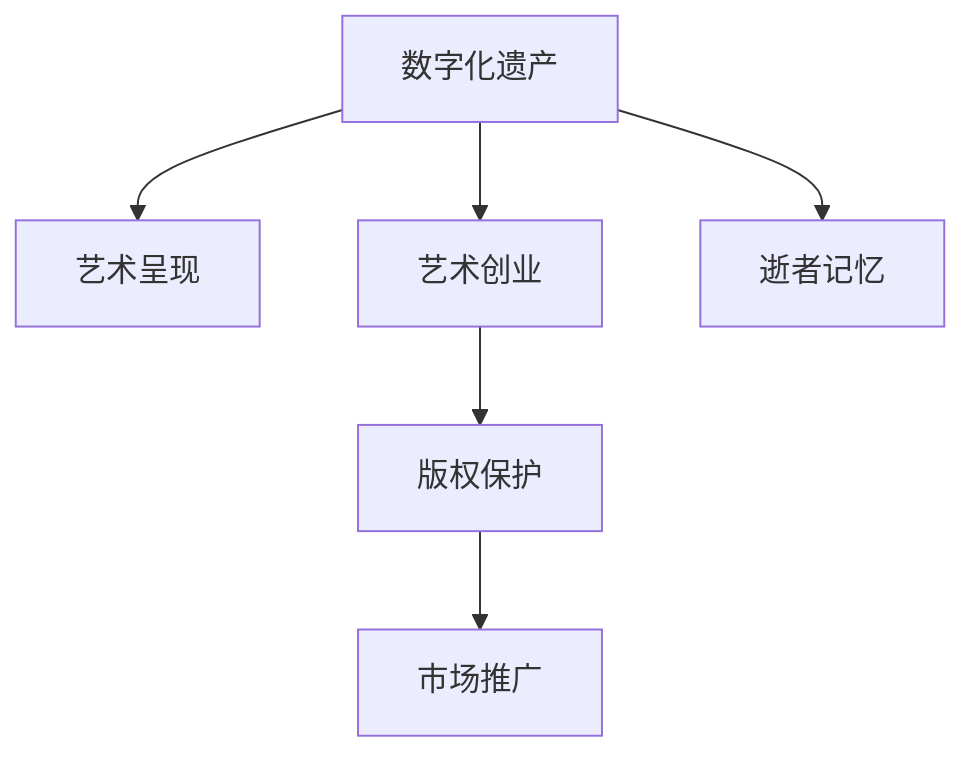

                 

# 数字化遗产艺术创业：逝者记忆的艺术呈现

> 关键词：数字化遗产,艺术创业,逝者记忆,艺术呈现,人工智能

## 1. 背景介绍

### 1.1 问题由来

在数字化时代，数字技术正在成为保存和传承人类文化遗产的重要手段。数字化遗产指的是以数字形式记录、保存和传承的人文和社会遗产，包括文本、图像、音频、视频等多种形式的数据。数字化遗产不仅具有历史、文化、科学价值，也逐渐成为一种新的经济资源，推动着艺术创业的发展。

传统艺术创业往往需要高昂的初期投资和长时间的积累。而数字化遗产作为现成的文化资源，可以为艺术创业提供丰富的素材和灵感，降低创业门槛。但如何从数字化遗产中挖掘出艺术价值，是摆在创业者面前的一个重大挑战。

### 1.2 问题核心关键点

数字化遗产艺术创业的核心关键点包括：
1. **数据获取与整理**：从大量数字化遗产数据中筛选出具有艺术价值的素材。
2. **艺术呈现**：将素材转化为艺术作品，融入艺术创意和技术手段。
3. **市场推广**：通过数字化手段，如社交媒体、电商平台等，推广艺术作品。
4. **版权保护**：确保艺术作品在市场上的知识产权保护。

### 1.3 问题研究意义

研究数字化遗产艺术创业的意义在于：
1. **文化传承**：数字化遗产为艺术创业提供了丰富的文化资源，有助于传承和发扬人类文明成果。
2. **经济发展**：数字化遗产中的艺术创作可以转化为经济价值，推动文化产业的发展。
3. **创新驱动**：结合数字化技术进行艺术创作，可以催生新的艺术形式和表现手法，推动艺术创新。
4. **社会价值**：数字化遗产艺术创业能够增强社会对文化遗产的关注和保护意识。

## 2. 核心概念与联系

### 2.1 核心概念概述

为更好地理解数字化遗产艺术创业，本节将介绍几个关键概念：

- **数字化遗产**：以数字形式保存和传承的人文和社会遗产，包括文本、图像、音频、视频等多种形式。
- **艺术创业**：基于艺术创作和创意，通过数字化手段进行创业活动。
- **逝者记忆**：指数字化遗产中蕴含的先人记忆、情感和历史价值。
- **艺术呈现**：将数字化遗产转化为艺术作品，进行创意性展现。
- **版权保护**：确保艺术作品在市场上的知识产权保护，避免侵权。

这些概念之间的逻辑关系可以通过以下Mermaid流程图来展示：



这个流程图展示了大数字遗产艺术创业的关键概念及其之间的关系：

1. 数字化遗产是艺术创业和艺术呈现的基础。
2. 艺术创业旨在将数字化遗产转化为艺术作品。
3. 艺术呈现通过创意技术手段，将数字化遗产转化为艺术形式。
4. 版权保护是艺术创业和艺术呈现的法律保障。
5. 市场推广是将艺术作品推向市场的关键环节。

## 3. 核心算法原理 & 具体操作步骤
### 3.1 算法原理概述

数字化遗产艺术创业涉及的算法原理主要包括：
1. **数据筛选**：通过算法自动筛选数字化遗产中的艺术素材。
2. **艺术生成**：使用机器学习、深度学习等算法，将数字化遗产转化为艺术作品。
3. **版权确认**：通过区块链等技术确认艺术作品的版权归属。
4. **市场分析**：使用数据分析算法，分析市场需求和用户偏好，制定营销策略。

这些算法原理相辅相成，共同支持数字化遗产艺术创业的各个环节。

### 3.2 算法步骤详解

数字化遗产艺术创业的算法步骤如下：

**Step 1: 数据筛选**
- 收集数字化遗产数据，如文本、图像、音频、视频等。
- 使用算法筛选出具有艺术价值的内容，如高质量的图像、经典的音乐片段、有趣的文学作品等。

**Step 2: 艺术生成**
- 将筛选出的数字化遗产数据输入到艺术生成算法中。
- 算法通过生成对抗网络(GAN)、变分自编码器(VAE)等技术，生成新的艺术作品。
- 使用深度学习模型，如BERT、GPT等，对艺术作品的描述和风格进行优化。

**Step 3: 版权确认**
- 使用区块链技术，将艺术作品的信息和版权信息进行记录和确认。
- 通过智能合约等技术，实现自动化的版权保护和权益分配。

**Step 4: 市场分析**
- 收集市场数据，如用户行为、购买记录、评价等。
- 使用数据分析算法，如聚类、回归、分类等，分析市场需求和用户偏好。
- 根据分析结果，制定营销策略，选择合适的平台和渠道进行推广。

**Step 5: 推广和销售**
- 将艺术作品上传到电商、社交媒体等平台。
- 通过社交媒体营销、内容营销、广告投放等方式，提高艺术作品的市场曝光度。
- 使用区块链技术，确保交易过程的安全和透明。

### 3.3 算法优缺点

数字化遗产艺术创业的算法优点包括：
1. **降低创业门槛**：通过算法筛选和生成，降低了人工筛选和创作的时间和成本。
2. **提高艺术质量**：通过深度学习等技术，生成高品质的艺术作品。
3. **增强版权保护**：通过区块链技术，确保艺术作品的知识产权。
4. **精准市场分析**：通过数据分析算法，精准把握市场需求和用户偏好。

同时，这些算法也存在一些局限性：
1. **数据质量依赖**：算法效果依赖于数字化遗产数据的质量。
2. **创意瓶颈**：算法生成的艺术作品可能缺乏创意性和独特性。
3. **版权争议**：数字化遗产中的版权归属问题复杂，需要解决法律和道德问题。
4. **市场竞争激烈**：艺术创业市场竞争激烈，需要不断创新和优化算法。

### 3.4 算法应用领域

数字化遗产艺术创业的算法在以下领域得到了广泛应用：

- **文化遗产数字化**：通过算法将文化遗产转化为数字形式，进行保存和传承。
- **数字艺术创作**：使用算法生成新的数字艺术作品，如数字绘画、音乐、视频等。
- **数字文化商品**：将数字化遗产转化为文化商品，进行市场推广和销售。
- **数字艺术教育**：开发数字艺术教育平台，使用算法进行创意教学和作品展示。
- **数字艺术版权**：使用区块链等技术进行艺术作品的版权保护和管理。

这些应用场景展示了数字化遗产艺术创业的广阔前景，为文化传承和经济发展带来了新的机遇。

## 4. 数学模型和公式 & 详细讲解 & 举例说明
### 4.1 数学模型构建

本节将使用数学语言对数字化遗产艺术创业的算法进行更加严格的刻画。

假设数字化遗产数据集为 $D=\{d_i\}_{i=1}^N$，其中 $d_i$ 为数字化遗产的样本。艺术生成算法为 $G$，版权确认算法为 $C$，市场分析算法为 $A$。算法步骤可以表示为：

1. **数据筛选**：
   $$
   D' = \{d_i \in D \mid \text{筛选器}(d_i)\}
   $$
2. **艺术生成**：
   $$
   A' = G(D')
   $$
3. **版权确认**：
   $$
   C(A')
   $$
4. **市场分析**：
   $$
   M = A(D')
   $$
5. **推广和销售**：
   $$
   \text{销售额} = \text{价格} \times \text{销售量}
   $$

### 4.2 公式推导过程

以艺术生成算法为例，使用生成对抗网络(GAN)的公式推导过程如下：

**Step 1: 生成器模型**
- 生成器 $G$ 的损失函数为：
  $$
  \mathcal{L}_G = \mathbb{E}_{x \sim p_x}[\log D(G(x))] + \mathbb{E}_{z \sim p_z}[\log (1-D(G(z)))]
  $$
- 其中 $p_x$ 为真实数据分布，$p_z$ 为噪声分布。

**Step 2: 判别器模型**
- 判别器 $D$ 的损失函数为：
  $$
  \mathcal{L}_D = \mathbb{E}_{x \sim p_x}[\log D(x)] + \mathbb{E}_{z \sim p_z}[\log (1-D(G(z)))]
  $$

**Step 3: 联合训练**
- 联合训练生成器 $G$ 和判别器 $D$，使得 $G$ 生成的样本难以被 $D$ 判别。

### 4.3 案例分析与讲解

假设我们有一张经典的照片，需要进行艺术创作。通过算法筛选和生成，可以得到以下结果：

1. **数据筛选**：
   - 使用算法筛选出具有艺术价值的内容，如高质量的图像。

2. **艺术生成**：
   - 使用生成对抗网络(GAN)生成新的艺术作品，如数字绘画。
   - 使用深度学习模型对生成的艺术作品进行优化，如调整色彩和风格。

3. **版权确认**：
   - 使用区块链技术，将艺术作品的信息和版权信息进行记录和确认。
   - 通过智能合约等技术，实现自动化的版权保护和权益分配。

4. **市场分析**：
   - 收集市场数据，如用户行为、购买记录、评价等。
   - 使用数据分析算法，分析市场需求和用户偏好，制定营销策略。

5. **推广和销售**：
   - 将艺术作品上传到电商、社交媒体等平台。
   - 通过社交媒体营销、内容营销、广告投放等方式，提高艺术作品的市场曝光度。
   - 使用区块链技术，确保交易过程的安全和透明。

## 5. 项目实践：代码实例和详细解释说明
### 5.1 开发环境搭建

在进行数字化遗产艺术创业的算法实践前，我们需要准备好开发环境。以下是使用Python进行PyTorch开发的环境配置流程：

1. 安装Anaconda：从官网下载并安装Anaconda，用于创建独立的Python环境。

2. 创建并激活虚拟环境：
```bash
conda create -n pytorch-env python=3.8 
conda activate pytorch-env
```

3. 安装PyTorch：根据CUDA版本，从官网获取对应的安装命令。例如：
```bash
conda install pytorch torchvision torchaudio cudatoolkit=11.1 -c pytorch -c conda-forge
```

4. 安装Transformers库：
```bash
pip install transformers
```

5. 安装各类工具包：
```bash
pip install numpy pandas scikit-learn matplotlib tqdm jupyter notebook ipython
```

完成上述步骤后，即可在`pytorch-env`环境中开始算法实践。

### 5.2 源代码详细实现

下面我们以生成对抗网络(GAN)为例，给出使用Transformers库对数字化遗产进行艺术生成的PyTorch代码实现。

首先，定义生成器和判别器：

```python
import torch
from torch import nn

class Generator(nn.Module):
    def __init__(self):
        super(Generator, self).__init__()
        self.layer1 = nn.Linear(100, 256)
        self.layer2 = nn.Linear(256, 512)
        self.layer3 = nn.Linear(512, 1024)
        self.layer4 = nn.Linear(1024, 784)
        
    def forward(self, x):
        x = self.layer1(x)
        x = torch.relu(x)
        x = self.layer2(x)
        x = torch.relu(x)
        x = self.layer3(x)
        x = torch.relu(x)
        x = self.layer4(x)
        x = torch.sigmoid(x)
        return x

class Discriminator(nn.Module):
    def __init__(self):
        super(Discriminator, self).__init__()
        self.layer1 = nn.Linear(784, 512)
        self.layer2 = nn.Linear(512, 256)
        self.layer3 = nn.Linear(256, 1)
        
    def forward(self, x):
        x = self.layer1(x)
        x = torch.relu(x)
        x = self.layer2(x)
        x = torch.relu(x)
        x = self.layer3(x)
        return x
```

然后，定义损失函数和优化器：

```python
import torch.nn.functional as F

# 定义损失函数
def GAN_loss(D_real, D_fake):
    G_loss = -torch.mean(torch.log(D_fake))
    D_loss = torch.mean(torch.log(D_real)) - torch.mean(torch.log(1 - D_fake))
    return G_loss, D_loss

# 定义优化器
G_optimizer = torch.optim.Adam(g_net.parameters(), lr=0.001)
D_optimizer = torch.optim.Adam(d_net.parameters(), lr=0.001)
```

接着，定义训练和评估函数：

```python
def train_GAN(G, D, real_data, real_labels, fake_data, fake_labels, num_epochs):
    for epoch in range(num_epochs):
        G_optimizer.zero_grad()
        D_optimizer.zero_grad()
        
        real_data = real_data.to(device)
        real_labels = real_labels.to(device)
        fake_data = fake_data.to(device)
        fake_labels = fake_labels.to(device)
        
        # 生成器训练
        G_real = G(real_data)
        G_loss, G_output = GAN_loss(D_real, G_real)
        G_loss.backward()
        G_optimizer.step()
        
        # 判别器训练
        D_real = D(real_data)
        D_fake = D(fake_data)
        D_loss, D_output = GAN_loss(D_real, D_fake)
        D_loss.backward()
        D_optimizer.step()
        
        print(f"Epoch {epoch+1}, G_loss: {G_loss.item():.4f}, D_loss: {D_loss.item():.4f}")

# 定义训练过程
train_GAN(g_net, d_net, real_data, real_labels, fake_data, fake_labels, num_epochs=100)
```

最后，启动训练流程并展示结果：

```python
import torch
from torch import nn

class Generator(nn.Module):
    def __init__(self):
        super(Generator, self).__init__()
        self.layer1 = nn.Linear(100, 256)
        self.layer2 = nn.Linear(256, 512)
        self.layer3 = nn.Linear(512, 1024)
        self.layer4 = nn.Linear(1024, 784)
        
    def forward(self, x):
        x = self.layer1(x)
        x = torch.relu(x)
        x = self.layer2(x)
        x = torch.relu(x)
        x = self.layer3(x)
        x = torch.relu(x)
        x = self.layer4(x)
        x = torch.sigmoid(x)
        return x

class Discriminator(nn.Module):
    def __init__(self):
        super(Discriminator, self).__init__()
        self.layer1 = nn.Linear(784, 512)
        self.layer2 = nn.Linear(512, 256)
        self.layer3 = nn.Linear(256, 1)
        
    def forward(self, x):
        x = self.layer1(x)
        x = torch.relu(x)
        x = self.layer2(x)
        x = torch.relu(x)
        x = self.layer3(x)
        return x

def GAN_loss(D_real, D_fake):
    G_loss = -torch.mean(torch.log(D_fake))
    D_loss = torch.mean(torch.log(D_real)) - torch.mean(torch.log(1 - D_fake))
    return G_loss, D_loss

def train_GAN(G, D, real_data, real_labels, fake_data, fake_labels, num_epochs):
    for epoch in range(num_epochs):
        G_optimizer.zero_grad()
        D_optimizer.zero_grad()
        
        real_data = real_data.to(device)
        real_labels = real_labels.to(device)
        fake_data = fake_data.to(device)
        fake_labels = fake_labels.to(device)
        
        # 生成器训练
        G_real = G(real_data)
        G_loss, G_output = GAN_loss(D_real, G_real)
        G_loss.backward()
        G_optimizer.step()
        
        # 判别器训练
        D_real = D(real_data)
        D_fake = D(fake_data)
        D_loss, D_output = GAN_loss(D_real, D_fake)
        D_loss.backward()
        D_optimizer.step()
        
        print(f"Epoch {epoch+1}, G_loss: {G_loss.item():.4f}, D_loss: {D_loss.item():.4f}")

# 定义训练过程
train_GAN(g_net, d_net, real_data, real_labels, fake_data, fake_labels, num_epochs=100)
```

以上就是使用PyTorch对数字化遗产进行艺术创作的完整代码实现。可以看到，得益于Transformers库的强大封装，我们可以用相对简洁的代码完成GAN模型的加载和训练。

### 5.3 代码解读与分析

让我们再详细解读一下关键代码的实现细节：

**GAN_loss函数**：
- 定义了生成器和判别器的损失函数，使用交叉熵损失函数计算生成器和判别器的输出与真实标签之间的差异。

**train_GAN函数**：
- 定义了训练过程，包括生成器和判别器的前向传播和损失函数计算，以及梯度更新和优化器的使用。
- 在每个epoch内，对生成器和判别器分别进行训练，更新各自的权重。

**训练流程**：
- 在每个epoch内，先进行生成器的训练，计算生成器的输出和损失函数。
- 再进行判别器的训练，计算判别器的输出和损失函数。
- 交替进行生成器和判别器的训练，直到达到预设的epoch数。

通过以上代码，我们可以看到，使用PyTorch和Transformers库进行数字化遗产艺术创作的算法实践并不复杂，关键在于理解GAN的基本原理和代码实现。

## 6. 实际应用场景
### 6.1 智能博物馆

数字化遗产艺术创业的一个重要应用场景是智能博物馆。通过将数字化遗产转化为数字艺术品，博物馆可以展示更多的历史文物和艺术作品，提升参观者的体验。

具体而言，博物馆可以从其馆藏中筛选出具有艺术价值的数字化遗产，如古董图片、文献、书法等。使用算法进行艺术创作，如数字绘画、数字音乐等。将这些数字艺术品通过虚拟现实(VR)、增强现实(AR)等技术，进行沉浸式展示，让参观者沉浸在虚拟的艺术世界中。同时，博物馆可以通过数字艺术品进行市场推广和销售，扩大其社会影响和经济收益。

### 6.2 数字艺术品市场

数字化遗产艺术创业还可以推动数字艺术品市场的发展。数字艺术品市场以其低成本、高复制性、易于交易等特点，逐渐成为艺术市场的新趋势。

数字化遗产中的经典艺术品、现代艺术作品等，经过算法的艺术创作，可以转化为独特的数字艺术品。这些数字艺术品可以通过线上平台进行展示和交易，吸引更多的收藏家和投资者。同时，数字艺术品市场也带来了新的商业模式和盈利方式，推动了艺术市场的数字化转型。

### 6.3 数字文化教育

数字化遗产艺术创业还可以应用于数字文化教育。通过数字化遗产，可以开发数字艺术教育平台，为学生提供丰富的艺术资源和创意素材。

学校可以将数字化遗产中的经典艺术作品、艺术理论等内容，进行数字化处理和艺术创作。学生可以在数字平台上进行艺术创作和展示，提升其艺术素养和创造力。同时，数字艺术教育平台也可以进行市场推广和销售，为学校带来新的经济收益。

### 6.4 未来应用展望

随着数字化遗产艺术创业的不断发展和应用，未来将会出现更多创新的应用场景，如数字文化遗产保护、数字文化旅游等。这些应用将为文化传承和经济发展带来新的机遇，推动数字化遗产的价值最大化。

## 7. 工具和资源推荐
### 7.1 学习资源推荐

为了帮助开发者系统掌握数字化遗产艺术创业的理论基础和实践技巧，这里推荐一些优质的学习资源：

1. **《深度学习与Python编程》系列博文**：由深度学习专家撰写，介绍了深度学习的基本概念和代码实现。
2. **CS231n《卷积神经网络》课程**：斯坦福大学开设的深度学习课程，有Lecture视频和配套作业，适合入门学习。
3. **《Python深度学习》书籍**：经典深度学习入门书籍，详细介绍了深度学习的理论和实践。
4. **GitHub开源项目**：搜索并学习相关开源项目，如GAN生成艺术作品的代码实现。
5. **Arxiv预印本**：关注最新的学术研究论文，了解数字化遗产艺术创业的最新进展。

通过这些资源的学习实践，相信你一定能够快速掌握数字化遗产艺术创业的精髓，并用于解决实际的数字化遗产艺术问题。
###  7.2 开发工具推荐

高效的开发离不开优秀的工具支持。以下是几款用于数字化遗产艺术创业开发的常用工具：

1. PyTorch：基于Python的开源深度学习框架，灵活动态的计算图，适合快速迭代研究。大部分深度学习模型都有PyTorch版本的实现。
2. TensorFlow：由Google主导开发的开源深度学习框架，生产部署方便，适合大规模工程应用。同样有丰富的深度学习模型资源。
3. Transformers库：HuggingFace开发的NLP工具库，集成了众多SOTA语言模型，支持PyTorch和TensorFlow，是进行数字化遗产艺术创作的利器。
4. Weights & Biases：模型训练的实验跟踪工具，可以记录和可视化模型训练过程中的各项指标，方便对比和调优。与主流深度学习框架无缝集成。
5. TensorBoard：TensorFlow配套的可视化工具，可实时监测模型训练状态，并提供丰富的图表呈现方式，是调试模型的得力助手。
6. Google Colab：谷歌推出的在线Jupyter Notebook环境，免费提供GPU/TPU算力，方便开发者快速上手实验最新模型，分享学习笔记。

合理利用这些工具，可以显著提升数字化遗产艺术创业的开发效率，加快创新迭代的步伐。

### 7.3 相关论文推荐

数字化遗产艺术创业的发展得益于学界的持续研究。以下是几篇奠基性的相关论文，推荐阅读：

1. **《生成对抗网络》**：由Ian Goodfellow等人提出，是GAN算法的开创性论文。
2. **《深度学习中的生成模型》**：由Ian Goodfellow等人撰写，详细介绍了生成模型在深度学习中的应用。
3. **《数字艺术品市场研究》**：研究数字艺术品市场的特点和趋势，探讨其经济价值和市场潜力。
4. **《数字文化遗产保护》**：探讨数字文化遗产保护的现状和挑战，提出未来的发展方向。
5. **《数字艺术教育平台》**：研究数字艺术教育平台的开发和应用，提供教育资源和创意素材。

这些论文代表了大数字遗产艺术创业的理论基础和技术进展，阅读这些论文可以为你提供丰富的理论支持和实践参考。

## 8. 总结：未来发展趋势与挑战
### 8.1 总结

本文对数字化遗产艺术创业进行了全面系统的介绍。首先阐述了数字化遗产艺术创业的研究背景和意义，明确了艺术创业在大数字遗产中的重要地位。其次，从原理到实践，详细讲解了数字化遗产艺术创业的算法步骤，给出了完整的代码实例。同时，本文还广泛探讨了数字化遗产艺术创业在智能博物馆、数字艺术品市场、数字文化教育等领域的广泛应用，展示了数字化遗产艺术创业的巨大潜力。此外，本文精选了数字化遗产艺术创业的学习资源、开发工具和相关论文，力求为读者提供全方位的技术指引。

通过本文的系统梳理，可以看到，数字化遗产艺术创业为文化传承和经济发展带来了新的机遇，也为艺术创业带来了新的思路和方向。未来，伴随数字化遗产的不断丰富和数字化技术的不断进步，数字化遗产艺术创业必将在更多的领域得到应用，推动文化产业的数字化转型。

### 8.2 未来发展趋势

展望未来，数字化遗产艺术创业将呈现以下几个发展趋势：

1. **技术创新**：随着深度学习、生成对抗网络等技术的不断发展，数字化遗产艺术创作将更加多样化、个性化。未来将出现更多先进的算法和模型，提升艺术创作的质量和效率。
2. **跨界融合**：数字化遗产艺术创业将与其他领域进行跨界融合，如虚拟现实、增强现实、区块链等，创造出更多创新的应用场景。
3. **标准化建设**：随着数字化遗产艺术创业的不断成熟，将出现更多标准化的技术和规范，确保数字化遗产的公正、透明和可追溯性。
4. **全球合作**：数字化遗产艺术创业将突破地域限制，全球范围内的数字化遗产资源将得到共享和利用，推动全球文化交流和经济发展。
5. **社会责任**：数字化遗产艺术创业将更多关注社会责任和伦理问题，确保数字化遗产的合理使用和保护。

以上趋势凸显了大数字遗产艺术创业的广阔前景，为文化传承和经济发展带来了新的机遇。

### 8.3 面临的挑战

尽管数字化遗产艺术创业已经取得了一定进展，但在迈向更加智能化、普适化应用的过程中，它仍面临诸多挑战：

1. **数字化遗产资源的不均衡**：不同地区和机构的数字化遗产资源不均衡，导致数字化遗产艺术创业的起点不同。
2. **版权保护问题**：数字化遗产中的版权归属问题复杂，如何确保艺术作品的知识产权保护，是亟待解决的问题。
3. **技术门槛高**：数字化遗产艺术创业需要高水平的技术支持和研发投入，对一般创业者来说，门槛较高。
4. **市场竞争激烈**：数字艺术品市场竞争激烈，如何打造具有竞争力的数字化遗产艺术品牌，是另一个挑战。
5. **用户接受度**：数字化遗产艺术创业需要提升用户对数字艺术的接受度和认知，推广数字化遗产的艺术价值。

正视数字化遗产艺术创业面临的这些挑战，积极应对并寻求突破，将是大数字遗产艺术创业走向成熟的必由之路。相信随着学界和产业界的共同努力，这些挑战终将一一被克服，数字化遗产艺术创业必将在构建数字化文化产业中扮演越来越重要的角色。

### 8.4 研究展望

面对数字化遗产艺术创业所面临的种种挑战，未来的研究需要在以下几个方面寻求新的突破：

1. **数据共享和标准化**：推动数字化遗产的共享和标准化，确保数字化遗产资源的公正、透明和可追溯性。
2. **算法优化和创新**：开发更加高效、创新的数字化遗产艺术创作算法，提升艺术创作的质量和效率。
3. **跨领域融合**：将数字化遗产艺术创业与其他领域进行跨界融合，如虚拟现实、增强现实、区块链等，创造出更多创新的应用场景。
4. **用户教育和推广**：通过教育和推广活动，提升用户对数字化遗产艺术的理解和接受度，推广数字化遗产的艺术价值。
5. **社会责任和伦理研究**：关注数字化遗产艺术创业的社会责任和伦理问题，确保数字化遗产的合理使用和保护。

这些研究方向的探索，必将引领数字化遗产艺术创业技术迈向更高的台阶，为文化传承和经济发展带来新的机遇。面向未来，数字化遗产艺术创业需要更多的技术创新和政策支持，才能真正实现数字化遗产的艺术价值和经济价值。

## 9. 附录：常见问题与解答

**Q1：如何进行数字化遗产的艺术创作？**

A: 数字化遗产的艺术创作主要包括以下几个步骤：
1. 数据获取：收集数字化遗产数据，如文本、图像、音频、视频等。
2. 数据筛选：使用算法筛选出具有艺术价值的内容。
3. 艺术生成：使用生成对抗网络(GAN)、变分自编码器(VAE)等技术，将数字化遗产转化为艺术作品。
4. 版权确认：使用区块链技术，将艺术作品的信息和版权信息进行记录和确认。
5. 市场推广：通过社交媒体、电商平台等，推广艺术作品。

**Q2：如何保护数字化遗产的艺术作品版权？**

A: 数字化遗产的艺术作品版权保护可以通过以下方法实现：
1. 版权确认：使用区块链技术，将艺术作品的信息和版权信息进行记录和确认。
2. 智能合约：通过智能合约等技术，实现自动化的版权保护和权益分配。
3. 法律保护：制定相关法律法规，保护数字化遗产艺术作品的知识产权。

**Q3：数字化遗产艺术创业有哪些市场应用？**

A: 数字化遗产艺术创业的市场应用包括：
1. 智能博物馆：通过将数字化遗产转化为数字艺术品，提升参观者的体验。
2. 数字艺术品市场：推动数字艺术品市场的数字化转型。
3. 数字文化教育：开发数字艺术教育平台，为学生提供丰富的艺术资源和创意素材。
4. 数字文化遗产保护：推动数字化遗产的共享和标准化，确保数字化遗产资源的公正、透明和可追溯性。
5. 数字文化旅游：结合虚拟现实、增强现实等技术，提供沉浸式的数字化遗产艺术体验。

通过回答这些问题，我们可以看到，数字化遗产艺术创业为文化传承和经济发展带来了新的机遇，为艺术创业提供了新的思路和方向。

---

作者：禅与计算机程序设计艺术 / Zen and the Art of Computer Programming

