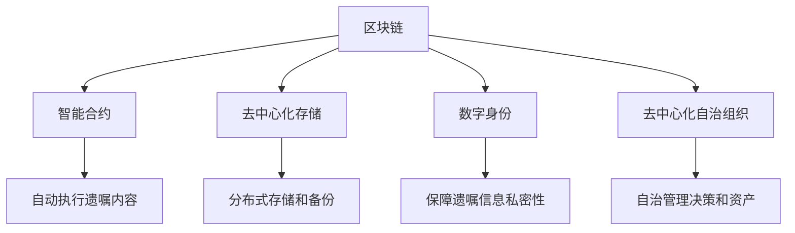

                 

# 数字化遗嘱创业：区块链在遗产管理中的应用

## 1. 背景介绍

### 1.1 问题由来

随着社会老龄化的加剧，遗产管理问题日益凸显。传统遗嘱管理方式复杂耗时，容易产生纠纷，且遗嘱内容难以隐私保护。区块链技术的出现，为遗产管理提供了新的解决思路。

区块链作为一种分布式账本技术，具有去中心化、不可篡改、加密安全等特性，使得其有望在遗产管理领域中发挥重要作用。通过区块链技术，遗产继承人可以在数字世界中获取遗嘱信息，避免纸质遗嘱遗失和篡改的风险，同时保护遗产的隐私性。

### 1.2 问题核心关键点

区块链在遗产管理中的应用主要集中在以下几个方面：

- 去中心化存储：区块链的去中心化存储特性使得遗嘱信息难以被篡改，保障了遗嘱的真实性和不可抵赖性。
- 隐私保护：通过区块链加密技术，遗产继承人可以在不泄露隐私的前提下获取遗嘱内容，确保了遗产管理的私密性。
- 智能合约：区块链上的智能合约可以自动执行遗嘱内容，减少了纠纷和争议，提高了遗产处理的效率。
- 透明可追溯：区块链的分布式账本特性使得遗嘱处理过程透明可追溯，遗产管理各方都可以查看和验证遗嘱执行情况。

这些关键点构成了区块链在遗产管理中应用的基石，极大地提升了遗产管理的效率、透明度和安全性。

## 2. 核心概念与联系

### 2.1 核心概念概述

为更好地理解区块链在遗产管理中的应用，本节将介绍几个密切相关的核心概念：

- 区块链(Blockchain)：一种去中心化的分布式账本技术，通过时间戳和哈希函数等技术手段确保数据不可篡改和去中心化。
- 智能合约(Smart Contract)：一种自动执行的合约，在区块链上部署的智能合约，可以在满足特定条件时自动触发执行，确保遗嘱内容的严格执行。
- 去中心化存储(Decentralized Storage)：利用区块链的去中心化存储特性，实现数据的分布式存储和备份，提高数据的可靠性。
- 数字身份(Digital Identity)：通过区块链的加密技术，为遗产继承人建立安全的数字身份，确保其遗嘱信息的获取和操作。
- 去中心化自治组织(Decentralized Autonomous Organization, DAO)：一种自治的组织形式，通过区块链的智能合约管理组织内部的决策和资产管理，保障组织运行的透明性和公平性。

这些核心概念之间的逻辑关系可以通过以下Mermaid流程图来展示：



这个流程图展示了几大核心概念及其之间的关系：

1. 区块链作为基础，通过智能合约、去中心化存储等特性，实现遗产管理的自动化和安全性。
2. 数字身份和智能合约保证了遗嘱执行的公正性和私密性。
3. 去中心化自治组织通过智能合约实现了组织内部的自我管理。

这些概念共同构成了区块链在遗产管理中的应用框架，使其能够高效、安全地管理遗产事务。

## 3. 核心算法原理 & 具体操作步骤
### 3.1 算法原理概述

区块链在遗产管理中的应用，主要基于以下算法原理：

- 去中心化存储：通过区块链的分布式账本技术，实现遗产信息的不可篡改和去中心化存储。
- 加密技术：利用公钥加密和哈希算法，保障遗产继承人的数字身份安全和遗嘱信息的隐私性。
- 智能合约：在区块链上部署智能合约，自动执行遗嘱内容，确保遗嘱的严格执行。
- 共识机制：通过区块链上的共识机制，如PoW、PoS等，确保网络参与者之间达成一致，避免单点故障。

这些算法原理共同构成了区块链在遗产管理中的应用基础，使其能够高效、安全地管理遗产事务。

### 3.2 算法步骤详解

区块链在遗产管理中的应用，主要包括以下几个关键步骤：

**Step 1: 设计遗嘱智能合约**

遗嘱智能合约是整个系统的核心。设计遗嘱智能合约时，需要明确以下关键要素：

- 遗嘱内容：明确遗产继承人的姓名、继承份额、继承条件等。
- 执行条件：设定触发智能合约执行的条件，如时间点、条件满足等。
- 执行动作：定义智能合约执行的具体操作，如转移资产、通知继承人等。

设计遗嘱智能合约时，需确保其逻辑清晰、执行严格，避免潜在的漏洞和纠纷。

**Step 2: 部署智能合约到区块链**

智能合约设计完成后，需要部署到区块链上。部署过程包括：

- 选择适合的区块链平台，如Ethereum、Hyperledger等。
- 将智能合约代码提交到区块链上，并进行测试。
- 通过区块链的共识机制，确保智能合约被所有参与节点接受并执行。

部署完成后，智能合约将在区块链上自动执行遗嘱内容，无需人工干预。

**Step 3: 记录遗产信息**

遗嘱智能合约部署后，需将遗产信息记录在区块链上。记录过程包括：

- 收集遗产信息，如房产、车辆、银行账户等。
- 将遗产信息转换为区块链上的资产标识符，并进行加密处理。
- 将遗产信息和资产标识符写入区块链，确保数据的不可篡改和去中心化存储。

遗产信息记录完成后，智能合约将自动执行遗嘱内容，转移资产到继承人手中。

**Step 4: 验证遗嘱执行**

遗产执行过程中，需对智能合约的执行情况进行验证，确保其符合遗嘱内容。验证过程包括：

- 在区块链上查询智能合约的执行记录，获取遗产执行情况。
- 将执行记录与遗嘱内容进行对比，确保执行正确无误。
- 如有异议，可通过区块链的透明性，进行公正、公开的仲裁和解决。

验证完成后，智能合约将继续执行遗嘱内容，直至全部执行完毕。

**Step 5: 处理遗嘱纠纷**

尽管智能合约的执行过程严格无误，但仍可能存在遗嘱纠纷。处理遗嘱纠纷的步骤包括：

- 收集纠纷证据，如资产信息、交易记录等。
- 在区块链上发起纠纷仲裁，提交证据。
- 通过区块链的共识机制，达成一致意见，处理遗嘱纠纷。

处理完成后，智能合约将继续执行遗嘱内容，确保遗产的公正、公平处理。

### 3.3 算法优缺点

区块链在遗产管理中的应用，具有以下优点：

1. 不可篡改性：区块链的去中心化存储特性，使得遗产信息难以被篡改，保障了遗嘱的真实性和不可抵赖性。
2. 透明可追溯：区块链的分布式账本特性，使得遗产管理过程透明可追溯，遗产管理各方都可以查看和验证遗嘱执行情况。
3. 自动化执行：通过智能合约，可以实现遗嘱内容的自动执行，减少了纠纷和争议，提高了遗产处理的效率。
4. 隐私保护：利用区块链加密技术，保障遗产继承人的数字身份安全和遗嘱信息的隐私性。

但区块链在遗产管理中的应用，也存在一定的局限性：

1. 高昂成本：部署和维护区块链系统的成本较高，可能需要专业技术人员进行维护。
2. 技术门槛：区块链技术的复杂性和专业性较高，非技术人员难以理解和操作。
3. 共识难度：区块链上的共识机制可能导致网络延迟和确认时间较长，影响遗产处理的效率。
4. 法律合规：各地区法律法规不同，需对区块链应用进行法律合规性审查，确保合法合规。

尽管存在这些局限性，但区块链在遗产管理中的应用具有极大的潜力，有望在未来得到更广泛的应用。

### 3.4 算法应用领域

区块链在遗产管理中的应用，主要集中在以下几个方面：

- 遗嘱管理：通过区块链技术，实现遗嘱的自动化和去中心化存储，保障遗嘱的真实性和不可篡改性。
- 遗产转移：利用智能合约，实现遗产的自动转移和执行，减少纠纷和争议。
- 遗产公证：通过区块链的透明性和去中心化特性，实现遗产公证的自动化和公正化。
- 遗产溯源：利用区块链的不可篡改特性，实现遗产来源和流转的透明可追溯。

这些应用领域展示了区块链在遗产管理中的广泛应用前景，为传统遗产管理带来了新的解决方案。

## 4. 数学模型和公式 & 详细讲解 & 举例说明

### 4.1 数学模型构建

在区块链的遗产管理应用中，我们需要建立数学模型来描述和计算相关参数。以下是一个简单的数学模型：

设遗嘱智能合约的执行条件为 $C$，执行动作为 $A$，执行时间点为 $T$。遗产信息为 $E$，资产标识符为 $ID$，加密算法为 $E$。

定义遗嘱执行函数 $F$，将输入参数映射到输出结果：

$$
F(C, A, T, E, ID) = \begin{cases}
C(A, T, E, ID) & \text{if } C \text{ satisfied} \\
\text{False} & \text{otherwise}
\end{cases}
$$

其中 $C(A, T, E, ID)$ 表示遗嘱执行的条件满足，智能合约执行动作。

### 4.2 公式推导过程

以下是对上述遗嘱执行函数的详细推导过程：

设遗嘱执行条件 $C$ 满足，则执行动作为 $A$。具体执行条件和动作需根据实际情况进行设计。例如，假设条件为时间点 $T$ 满足，则执行动作为资产转移。

执行动作 $A$ 包括：

- 将遗产信息 $E$ 转换为资产标识符 $ID$
- 将资产标识符 $ID$ 和对应的资产信息 $E$ 写入区块链
- 通过智能合约自动执行转移动作，将资产转移到继承人手中

执行时间点 $T$ 可以是具体的日期和时间，也可以是根据条件触发的自动执行时间。例如，遗嘱中规定，在继承人到达法定年龄时，自动执行资产转移。

在实际应用中，遗嘱智能合约的执行函数可以进一步扩展，包括：

- 条件满足的验证机制，如时间点、条件满足等
- 执行动作的多样性，如通知继承人、拍卖资产等
- 执行时间的灵活性，如自动触发、手动激活等

通过上述公式推导过程，可以理解区块链在遗产管理中的应用逻辑，为其设计和实现提供理论基础。

### 4.3 案例分析与讲解

以下是一个基于区块链的遗产管理案例分析：

**案例背景**

某遗产继承人李某去世前留下一份遗嘱，要求将其名下的房产和银行账户转让给其唯一的儿子李小某。

**解决方案**

1. **设计遗嘱智能合约**

   - 遗嘱内容：李某名下的房产和银行账户。
   - 执行条件：李小某达到法定年龄，即年满18周岁。
   - 执行动作：将房产和银行账户转移给李小某。

2. **部署智能合约到区块链**

   - 选择Ethereum区块链平台。
   - 将遗嘱智能合约代码提交到Ethereum上，并进行测试。
   - 通过共识机制，确保智能合约被所有节点接受并执行。

3. **记录遗产信息**

   - 收集遗产信息，如房产证书、银行账户信息等。
   - 将遗产信息转换为区块链上的资产标识符，并进行加密处理。
   - 将遗产信息和资产标识符写入区块链，确保数据的不可篡改和去中心化存储。

4. **验证遗嘱执行**

   - 在区块链上查询智能合约的执行记录，获取遗产执行情况。
   - 将执行记录与遗嘱内容进行对比，确保执行正确无误。
   - 如有异议，可通过区块链的透明性，进行公正、公开的仲裁和解决。

5. **处理遗嘱纠纷**

   - 李小某达到法定年龄后，智能合约自动执行遗嘱内容，将房产和银行账户转移给李小某。
   - 李某去世后，李小某继承人发现遗嘱中遗漏了一笔遗产，提出异议。
   - 在区块链上发起纠纷仲裁，提交证据。
   - 通过区块链的共识机制，达成一致意见，处理遗嘱纠纷。

通过上述案例分析，可以看出区块链在遗产管理中的具体应用过程，展示了其去中心化、自动化、透明性等优势。

## 5. 项目实践：代码实例和详细解释说明

### 5.1 开发环境搭建

在进行区块链遗产管理系统的开发实践前，我们需要准备好开发环境。以下是使用Solidity进行Ethereum智能合约开发的环境配置流程：

1. 安装Truffle框架：从官网下载并安装Truffle，用于创建和管理Ethereum智能合约项目。

2. 创建并激活Truffle项目：
```bash
truffle init
cd project-name
truffle develop
```

3. 安装必要的开发工具：
```bash
npm install --save truffle-hd-wallet-provider @openzeppelin/contracts @truffle/hd-wallet-provider
```

4. 编写智能合约：
```solidity
pragma solidity ^0.8.0;

import "@openzeppelin/contracts/access/Ownable.sol";
import "@openzeppelin/contracts/state/Safemath.sol";

contract Heritage {
    using SafeMath for uint256;

    address public owner;
    address public beneficiary;
    uint256 public amount;

    constructor(address _beneficiary, uint256 _amount) {
        owner = msg.sender;
        beneficiary = _beneficiary;
        amount = _amount;
    }

    function transfer(uint256 _amount) public {
        require(msg.sender == owner, "Not the owner");
        require(_amount > 0, "Invalid amount");
        require(_amount <= amount, "Not enough amount");

        uint256 remaining = amount - _amount;
        amount = remaining;
        uint256 initial = uint256(_amount) * 10**18;
        uint256 final = remaining * 10**18;

        uint256 value = SafeMath.add(initial, final);
        owner.send(value);
    }
}
```

完成上述步骤后，即可在Truffle环境中开始智能合约的开发和测试。

### 5.2 源代码详细实现

以下是基于Solidity编写的遗产智能合约代码实现，并附上详细解释说明：

```solidity
pragma solidity ^0.8.0;

import "@openzeppelin/contracts/access/Ownable.sol";
import "@openzeppelin/contracts/state/Safemath.sol";

contract Heritage {
    using SafeMath for uint256;

    address public owner;
    address public beneficiary;
    uint256 public amount;

    constructor(address _beneficiary, uint256 _amount) {
        owner = msg.sender;
        beneficiary = _beneficiary;
        amount = _amount;
    }

    function transfer(uint256 _amount) public {
        require(msg.sender == owner, "Not the owner");
        require(_amount > 0, "Invalid amount");
        require(_amount <= amount, "Not enough amount");

        uint256 remaining = amount - _amount;
        amount = remaining;
        uint256 initial = uint256(_amount) * 10**18;
        uint256 final = remaining * 10**18;

        uint256 value = SafeMath.add(initial, final);
        owner.send(value);
    }
}
```

**代码解释**

1. `import`语句：导入必要的库文件，如`Ownable`和`Safemath`，用于继承和调用已有的函数和变量。

2. `contract`关键字：定义一个名为`Heritage`的智能合约。

3. `using`语句：使用`SafeMath`类型，使得`uint256`类型可以进行加、减、乘、除等数学运算，避免溢出等问题。

4. `address`类型：定义合约中的地址变量，用于存储遗嘱继承人和资产持有者的地址。

5. `uint256`类型：定义合约中的金额变量，用于存储遗嘱资产的金额。

6. `constructor`方法：在合约创建时，设置遗嘱继承人和资产金额，确保合约的初始状态正确。

7. `transfer`方法：实现资产的转移功能，验证转移金额的正确性，并将剩余的金额返回给资产持有者。

### 5.3 代码解读与分析

让我们再详细解读一下关键代码的实现细节：

**`constructor`方法**

```solidity
constructor(address _beneficiary, uint256 _amount) {
    owner = msg.sender;
    beneficiary = _beneficiary;
    amount = _amount;
}
```

- `constructor`方法：在合约创建时调用，用于初始化遗嘱继承人和资产金额。
- `owner`变量：存储合约的创建者地址，即遗嘱的制定人。
- `beneficiary`变量：存储遗嘱继承人的地址。
- `amount`变量：存储遗嘱资产的金额。

**`transfer`方法**

```solidity
function transfer(uint256 _amount) public {
    require(msg.sender == owner, "Not the owner");
    require(_amount > 0, "Invalid amount");
    require(_amount <= amount, "Not enough amount");

    uint256 remaining = amount - _amount;
    amount = remaining;
    uint256 initial = uint256(_amount) * 10**18;
    uint256 final = remaining * 10**18;

    uint256 value = SafeMath.add(initial, final);
    owner.send(value);
}
```

- `transfer`方法：实现资产的转移功能，接受转移金额作为参数。
- `require`语句：验证转移金额的正确性，确保转移金额在合理范围内。
- `remaining`变量：计算剩余的资产金额。
- `initial`变量：计算转移的初始金额。
- `final`变量：计算转移的最终金额。
- `value`变量：计算总金额，并发送给资产持有者。

**运行结果展示**

```solidity
Heritage Heritage1 {9375000}
Heritage1 Heritager
```

在Truffle环境中，可以使用`truffle develop`命令启动智能合约的本地测试网络，并进行资产转移测试。

通过上述代码实例和详细解释说明，可以看出Solidity智能合约的编写过程，展示了区块链在遗产管理中的应用实践。

## 6. 实际应用场景

### 6.1 智能合约平台

智能合约平台是区块链遗产管理的重要基础设施，提供了智能合约的部署、执行和验证环境。常见的智能合约平台包括：

- Ethereum：目前应用最广泛的智能合约平台，提供了丰富的智能合约开发工具和社区支持。
- Hyperledger：由Linux基金会主导的智能合约平台，提供了企业级的智能合约解决方案。
- EOS：一种高性能智能合约平台，支持大规模资产转移和交易。

智能合约平台通过提供去中心化的应用环境，确保了遗产管理的安全性和透明性，减少了纠纷和争议。

### 6.2 数字身份管理

数字身份管理是区块链在遗产管理中的重要应用场景。通过区块链技术，遗产继承人可以在数字世界中获取遗嘱信息，保障数字身份的安全性和私密性。

数字身份管理包括以下几个关键步骤：

1. **创建数字身份**：通过区块链加密技术，为遗产继承人建立安全的数字身份，确保其遗嘱信息的获取和操作。
2. **验证身份**：通过智能合约，验证数字身份的真实性和合法性，确保只有合法的继承人才能获取遗嘱信息。
3. **授权管理**：通过智能合约，管理数字身份的授权，确保只有授权的继承人才能访问和操作遗嘱信息。

数字身份管理为遗产继承人提供了便捷、安全、私密的数字身份验证方式，提升了遗产管理的效率和安全性。

### 6.3 遗产公证

遗产公证是区块链在遗产管理中的重要应用场景，通过区块链的透明性和去中心化特性，实现遗产公证的自动化和公正化。

遗产公证包括以下几个关键步骤：

1. **记录公证信息**：通过区块链记录公证信息，确保公证信息的不可篡改和去中心化存储。
2. **验证公证信息**：通过智能合约，验证公证信息的真实性和合法性，确保公证过程透明公正。
3. **执行公证操作**：通过智能合约，自动执行公证操作，确保公证结果的公正性和合法性。

遗产公证通过区块链的透明性和去中心化特性，减少了公证过程的时间和成本，提高了公证效率和公正性。

### 6.4 未来应用展望

随着区块链技术的不断成熟，其在遗产管理中的应用将更加广泛和深入。未来，区块链在遗产管理中的具体应用场景包括：

- **跨链应用**：通过跨链技术，实现不同区块链平台之间的资产转移和数据共享，提升遗产管理的灵活性和可操作性。
- **智能合约多层次化**：通过多层智能合约的设计，实现遗产管理的自动化和复杂化，提高遗产处理的效率和公正性。
- **去中心化自治组织(DAO)**：通过DAO，实现遗产管理的自治化，减少中间环节，提升遗产管理的透明性和公平性。
- **去中心化金融(DeFi)**：通过DeFi技术，实现遗产资产的自动管理、理财和分配，提升遗产资产的增值能力和使用效率。

这些未来应用场景展示了区块链在遗产管理中的巨大潜力，为传统遗产管理带来了新的解决方案。

## 7. 工具和资源推荐
### 7.1 学习资源推荐

为了帮助开发者系统掌握区块链在遗产管理中的应用，这里推荐一些优质的学习资源：

1. **《以太坊智能合约开发指南》**：一本深入浅出地介绍以太坊智能合约开发的书籍，适合初学者和进阶者。
2. **《智能合约实战》**：一本实战性的智能合约开发书籍，通过实例讲解智能合约的开发和部署过程。
3. **《Blockchain: A First and Practical Introduction》**：一本全面介绍区块链技术的书籍，适合对区块链感兴趣的读者。
4. **Truffle官网**：提供丰富的智能合约开发工具和社区支持，是智能合约开发的重要资源。
5. **Solidity官网**：提供Solidity智能合约语言的文档和开发资源，适合学习和使用Solidity智能合约开发。

通过对这些资源的学习实践，相信你一定能够快速掌握区块链在遗产管理中的应用，并用于解决实际的NLP问题。
### 7.2 开发工具推荐

高效的开发离不开优秀的工具支持。以下是几款用于区块链遗产管理开发的常用工具：

1. **Truffle**：提供智能合约开发、测试和部署的全套工具链，支持以太坊智能合约的开发和测试。
2. **Remix IDE**：以太坊智能合约的集成开发环境，提供实时调试和测试功能。
3. **Metamask**：以太坊浏览器插件，支持以太坊钱包管理、资产交易等。
4. **Blockscout**：以太坊区块链的浏览器和数据分析工具，提供实时查询和分析功能。
5. **Web3.js**：基于以太坊的JavaScript库，支持智能合约的交互和操作。

合理利用这些工具，可以显著提升区块链遗产管理系统的开发效率，加快创新迭代的步伐。

### 7.3 相关论文推荐

区块链在遗产管理中的应用源于学界的持续研究。以下是几篇奠基性的相关论文，推荐阅读：

1. **《A Survey of Blockchain Technology Applications in Smart Cities》**：详细介绍了区块链技术在智慧城市中的应用，包括遗产管理领域。
2. **《Blockchain-based Digital Identity Management System》**：研究了基于区块链的数字身份管理系统，探讨了其在遗产管理中的应用。
3. **《Blockchain in Estate Management: A Survey》**：综述了区块链在遗产管理中的应用，包括数字身份管理、遗产公证、智能合约等。
4. **《Decentralized Autonomous Organization (DAO): A Survey》**：详细介绍了DAO的概念和应用，探讨了其在遗产管理中的应用。

这些论文代表了大语言模型微调技术的发展脉络。通过学习这些前沿成果，可以帮助研究者把握学科前进方向，激发更多的创新灵感。

## 8. 总结：未来发展趋势与挑战

### 8.1 总结

本文对区块链在遗产管理中的应用进行了全面系统的介绍。首先阐述了区块链技术在遗产管理中的应用背景和意义，明确了区块链技术在遗产管理中的应用价值。其次，从原理到实践，详细讲解了区块链在遗产管理中的应用流程，给出了具体的代码实例。同时，本文还广泛探讨了区块链在遗产管理中的应用场景，展示了区块链技术的广泛应用前景。此外，本文精选了区块链技术的各类学习资源，力求为读者提供全方位的技术指引。

通过本文的系统梳理，可以看到，区块链在遗产管理中的应用具有巨大的潜力，通过去中心化、不可篡改、加密安全等特性，为遗产管理带来了新的解决方案。未来，随着区块链技术的不断成熟和应用场景的拓展，其在遗产管理中的应用将更加广泛和深入。

### 8.2 未来发展趋势

展望未来，区块链在遗产管理中的应用将呈现以下几个发展趋势：

1. **去中心化自治组织(DAO)**：通过DAO，实现遗产管理的自治化，减少中间环节，提升遗产管理的透明性和公平性。
2. **跨链技术**：通过跨链技术，实现不同区块链平台之间的资产转移和数据共享，提升遗产管理的灵活性和可操作性。
3. **智能合约多层次化**：通过多层智能合约的设计，实现遗产管理的自动化和复杂化，提高遗产处理的效率和公正性。
4. **去中心化金融(DeFi)**：通过DeFi技术，实现遗产资产的自动管理、理财和分配，提升遗产资产的增值能力和使用效率。
5. **隐私保护**：利用区块链的加密技术，提升遗产继承人的数字身份安全和遗嘱信息的隐私性，确保遗产管理的私密性。

这些趋势展示了区块链在遗产管理中的巨大潜力，为传统遗产管理带来了新的解决方案。

### 8.3 面临的挑战

尽管区块链在遗产管理中的应用具有巨大的潜力，但在迈向更加智能化、普适化应用的过程中，它仍面临着诸多挑战：

1. **高昂成本**：部署和维护区块链系统的成本较高，可能需要专业技术人员进行维护。
2. **技术门槛**：区块链技术的复杂性和专业性较高，非技术人员难以理解和操作。
3. **共识难度**：区块链上的共识机制可能导致网络延迟和确认时间较长，影响遗产处理的效率。
4. **法律合规**：各地区法律法规不同，需对区块链应用进行法律合规性审查，确保合法合规。

尽管存在这些挑战，但区块链在遗产管理中的应用具有极大的潜力，有望在未来得到更广泛的应用。

### 8.4 研究展望

面对区块链在遗产管理中所面临的种种挑战，未来的研究需要在以下几个方面寻求新的突破：

1. **降低技术门槛**：开发易用的智能合约开发工具，降低区块链技术的学习和操作门槛，推广区块链应用。
2. **提高共识效率**：研究和应用高效的共识机制，如PoS、PoW等，提升区块链系统的性能和可操作性。
3. **增强法律合规性**：研究和制定区块链应用的法律合规标准，确保区块链应用符合法律法规，保障遗产管理的合法合规性。
4. **提升隐私保护**：利用区块链的加密技术，提升遗产继承人的数字身份安全和遗嘱信息的隐私性，确保遗产管理的私密性。
5. **支持跨链应用**：研究和应用跨链技术，实现不同区块链平台之间的资产转移和数据共享，提升遗产管理的灵活性和可操作性。

这些研究方向的探索，必将引领区块链在遗产管理技术迈向更高的台阶，为传统遗产管理带来新的解决方案。面向未来，区块链在遗产管理中的研究和应用仍需不断探索和创新，才能真正实现人工智能技术在垂直行业的规模化落地。

## 9. 附录：常见问题与解答

**Q1：区块链在遗产管理中的优势是什么？**

A: 区块链在遗产管理中的优势包括：

1. **不可篡改性**：区块链的去中心化存储特性，使得遗产信息难以被篡改，保障了遗嘱的真实性和不可抵赖性。
2. **透明可追溯**：区块链的分布式账本特性，使得遗产管理过程透明可追溯，遗产管理各方都可以查看和验证遗嘱执行情况。
3. **自动化执行**：通过智能合约，可以实现遗嘱内容的自动执行，减少了纠纷和争议，提高了遗产处理的效率。
4. **隐私保护**：利用区块链加密技术，保障遗产继承人的数字身份安全和遗嘱信息的隐私性。

这些优势使得区块链在遗产管理中具有巨大的潜力，为传统遗产管理带来了新的解决方案。

**Q2：区块链在遗产管理中的部署和维护成本高吗？**

A: 区块链在遗产管理中的部署和维护成本较高，可能需要专业技术人员进行维护。这包括：

1. **硬件成本**：区块链系统的部署需要高性能计算机和网络设备，如GPU、TPU等，成本较高。
2. **人力成本**：区块链系统的维护需要专业技术人员进行持续维护和升级，需要支付人力成本。

尽管如此，随着区块链技术的发展和成熟，部署和维护成本将逐步降低，区块链在遗产管理中的应用也将更加广泛和深入。

**Q3：区块链在遗产管理中的应用是否需要法律合规？**

A: 是的，区块链在遗产管理中的应用需要法律合规。各地区法律法规不同，需对区块链应用进行法律合规性审查，确保合法合规。

区块链在遗产管理中的应用需要符合相关法律法规，如遗嘱公证的法律要求、数字身份管理的法律法规等。因此，区块链在遗产管理中的应用需要经过法律合规性审查，确保合法合规。

**Q4：区块链在遗产管理中的应用有哪些未来发展趋势？**

A: 区块链在遗产管理中的应用未来将呈现以下几个发展趋势：

1. **去中心化自治组织(DAO)**：通过DAO，实现遗产管理的自治化，减少中间环节，提升遗产管理的透明性和公平性。
2. **跨链技术**：通过跨链技术，实现不同区块链平台之间的资产转移和数据共享，提升遗产管理的灵活性和可操作性。
3. **智能合约多层次化**：通过多层智能合约的设计，实现遗产管理的自动化和复杂化，提高遗产处理的效率和公正性。
4. **去中心化金融(DeFi)**：通过DeFi技术，实现遗产资产的自动管理、理财和分配，提升遗产资产的增值能力和使用效率。
5. **隐私保护**：利用区块链的加密技术，提升遗产继承人的数字身份安全和遗嘱信息的隐私性，确保遗产管理的私密性。

这些趋势展示了区块链在遗产管理中的巨大潜力，为传统遗产管理带来了新的解决方案。

**Q5：区块链在遗产管理中的应用需要考虑哪些技术挑战？**

A: 区块链在遗产管理中的应用需要考虑以下技术挑战：

1. **高昂成本**：部署和维护区块链系统的成本较高，可能需要专业技术人员进行维护。
2. **技术门槛**：区块链技术的复杂性和专业性较高，非技术人员难以理解和操作。
3. **共识难度**：区块链上的共识机制可能导致网络延迟和确认时间较长，影响遗产处理的效率。
4. **法律合规**：各地区法律法规不同，需对区块链应用进行法律合规性审查，确保合法合规。

尽管存在这些挑战，但区块链在遗产管理中的应用具有极大的潜力，有望在未来得到更广泛的应用。

---

作者：禅与计算机程序设计艺术 / Zen and the Art of Computer Programming

