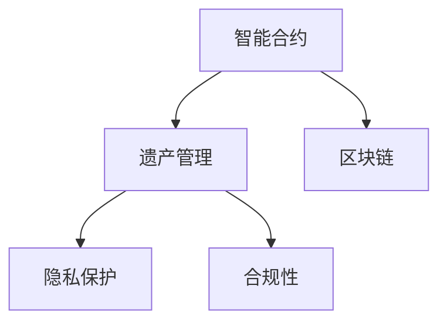

                 

# 数字化遗嘱执行创业：智能合约在遗产管理中的应用

## 1. 背景介绍

### 1.1 问题由来
随着数字经济的发展和数字化浪潮的推进，许多行业正经历着传统模式到智能化的转型。遗产管理作为一项重要且复杂的任务，也亟需借助新技术手段，提升管理效率和透明度。传统的遗产管理模式往往存在信息孤岛、操作复杂、执行不便等问题，极大限制了其可持续发展的能力。

随着区块链技术的兴起，智能合约以其去中心化、透明公开的特性，为遗产管理提供了全新的解决方案。智能合约不仅能高效管理遗产分配和执行，还能通过自动化手段，解决传统模式下存在的诸多痛点。然而，智能合约在遗产管理中的应用尚处于初步探索阶段，存在诸多挑战，需要进一步的深入研究与创新。

### 1.2 问题核心关键点
智能合约在遗产管理中的应用，需要解决以下几个核心问题：
- 如何确保遗产管理过程的透明性和公正性？
- 如何保障遗产的资金安全和及时分配？
- 如何设计合理的智能合约逻辑，确保遗产管理的合规性和可执行性？
- 如何通过区块链技术，减少遗产管理的法律与行政障碍？
- 如何应对智能合约在遗产管理中可能出现的技术和管理风险？

### 1.3 问题研究意义
智能合约在遗产管理中的应用，对于提高遗产管理的效率、降低管理成本、提升透明度和公平性具有重要意义。通过数字化手段，智能合约可以克服传统模式下的诸多限制，实现遗产管理全生命周期的自动化和智能化，助力遗产管理行业走向更加开放、高效、公正的未来。

## 2. 核心概念与联系

### 2.1 核心概念概述

为更好地理解智能合约在遗产管理中的应用，本节将介绍几个密切相关的核心概念：

- **智能合约(Smart Contract)**：一种通过代码自动执行、无需第三方中介的合约形式，通过区块链技术确保执行的透明性和不可篡改性。智能合约的执行规则由代码定义，一旦达成一致，将按照合同自动执行。

- **遗产管理(Inheritance Management)**：涉及遗产的收集、保存、分配和执行的一系列管理活动，旨在保证遗产的合法、透明、公正的流转。遗产管理包括遗产的确认、分配、税务处理、继承登记等环节。

- **区块链(Blockchain)**：一种去中心化的分布式账本技术，通过共识机制确保账本数据的安全性和不可篡改性。区块链的应用可以保证遗产管理过程中数据的透明性和可追溯性。

- **隐私保护(Privacy Protection)**：遗产管理涉及大量个人隐私信息，如何保护这些信息不被滥用，是智能合约应用中需要重点关注的问题。

- **合规性(Compliance)**：遗产管理涉及复杂的法律规定，智能合约需要遵循相关法律法规，确保其合法性和合规性。

这些核心概念之间的逻辑关系可以通过以下Mermaid流程图来展示：



这个流程图展示了一系列的逻辑关系：

1. 智能合约是遗产管理的技术基础，用于自动化执行合同条款。
2. 区块链技术为智能合约提供了底层保障，确保其透明性和不可篡改性。
3. 隐私保护是遗产管理过程中必须关注的问题，确保数据的私密性和安全性。
4. 合规性是智能合约应用的必要条件，确保其符合法律规定。

## 3. 核心算法原理 & 具体操作步骤
### 3.1 算法原理概述

智能合约在遗产管理中的应用，本质上是一个基于代码逻辑的自动化执行过程。其核心思想是：通过区块链技术，构建一个透明的、不可篡改的、自动执行的遗产管理智能合约，确保遗产的合法、透明、公正的流转。

形式化地，假设智能合约为 $C_{\theta}$，其中 $\theta$ 为智能合约的参数，包括遗产分配方案、执行条件、触发机制等。遗产管理的数据集 $D=\{(x_i, y_i)\}_{i=1}^N$，其中 $x_i$ 表示遗产分配的具体信息，$y_i$ 表示对应的法律规定。智能合约的应用目标是找到最优的 $\theta$，使得 $C_{\theta}$ 在数据集 $D$ 上的执行结果符合法律规定。

通过梯度下降等优化算法，智能合约的执行过程不断更新参数 $\theta$，最小化执行结果与法律规定的差异，从而得到理想的智能合约逻辑。

### 3.2 算法步骤详解

智能合约在遗产管理中的应用，一般包括以下几个关键步骤：

**Step 1: 准备智能合约和数据集**
- 选择合适的智能合约模板，如基于Solidity的智能合约，作为初始化参数。
- 准备遗产管理的标注数据集 $D$，划分为训练集、验证集和测试集。数据集应包括遗产分配的具体信息、法律规定等，如姓名、金额、分配比例、法律条文等。

**Step 2: 添加遗产管理适配层**
- 根据遗产管理的特定需求，在智能合约顶层设计合适的输出层和损失函数。
- 对于遗产分配任务，通常设计分类器，输出各个受益人应得的金额比例。
- 对于税务处理任务，通常设计计算器，计算继承人应缴纳的税额。

**Step 3: 设置智能合约超参数**
- 选择合适的优化算法及其参数，如Adam、SGD等，设置学习率、批大小、迭代轮数等。
- 设置正则化技术及强度，包括权重衰减、Dropout、Early Stopping等。
- 确定冻结智能合约参数的策略，如仅微调顶层，或全部参数都参与微调。

**Step 4: 执行梯度训练**
- 将训练集数据分批次输入智能合约，前向传播计算损失函数。
- 反向传播计算参数梯度，根据设定的优化算法和学习率更新智能合约参数。
- 周期性在验证集上评估智能合约性能，根据性能指标决定是否触发 Early Stopping。
- 重复上述步骤直到满足预设的迭代轮数或 Early Stopping 条件。

**Step 5: 测试和部署**
- 在测试集上评估智能合约的性能，对比微调前后的精度提升。
- 使用智能合约对新样本进行推理预测，集成到实际的应用系统中。
- 持续收集新的数据，定期重新微调智能合约，以适应数据分布的变化。

以上是基于监督学习智能合约在遗产管理中的微调流程。在实际应用中，还需要针对具体任务的特点，对微调过程的各个环节进行优化设计，如改进训练目标函数，引入更多的正则化技术，搜索最优的超参数组合等，以进一步提升智能合约性能。

### 3.3 算法优缺点

智能合约在遗产管理中的应用，具有以下优点：
1. 透明公开。智能合约的执行逻辑公开透明，各方可以自行监督验证，提升信任度。
2. 自动执行。智能合约通过代码自动化执行，减少人为操作，提升执行效率。
3. 不可篡改。智能合约一旦部署，无法修改，确保执行的公正性。
4. 降低成本。智能合约自动化执行，降低人为操作和法律诉讼成本。

同时，该方法也存在一定的局限性：
1. 编程难度高。智能合约的编写和调试需要具备较高的技术水平，难以被普通用户接受。
2. 执行复杂。智能合约的逻辑设计复杂，需要考虑各种边缘情况，编写难度大。
3. 法律风险。智能合约的设计和执行需要符合法律法规，否则可能导致合同无效。
4. 安全性不足。智能合约一旦部署，难以修改，存在潜在的漏洞和攻击风险。

尽管存在这些局限性，但就目前而言，智能合约在遗产管理中的应用仍然是大势所趋。未来相关研究的重点在于如何进一步降低智能合约的应用门槛，提高其可操作性和安全性，同时兼顾公正性和合规性等因素。

### 3.4 算法应用领域

智能合约在遗产管理中的应用，已经逐步应用于各种遗产分配和管理场景，例如：

- 遗嘱继承：通过智能合约自动分配遗产，减少继承人纠纷。
- 税务处理：自动计算继承人应缴纳的税额，简化税务申报流程。
- 遗产登记：自动化记录遗产的变更和流转，确保遗产合法流转。
- 捐赠分配：根据遗嘱或意愿，自动分配捐赠资金，确保捐赠公正透明。
- 遗产保全：自动监督遗产的保管和执行，确保遗产安全。

除了上述这些经典应用外，智能合约还被创新性地应用到更多场景中，如遗产管理信托基金、遗产管理公共账本等，为遗产管理提供了全新的技术手段。随着智能合约技术的不断进步，相信遗产管理行业将迎来新的变革。

## 4. 数学模型和公式 & 详细讲解  
### 4.1 数学模型构建

本节将使用数学语言对智能合约在遗产管理中的应用过程进行更加严格的刻画。

假设智能合约为 $C_{\theta}:\mathcal{X} \rightarrow \mathcal{Y}$，其中 $\mathcal{X}$ 为输入空间，$\mathcal{Y}$ 为输出空间，$\theta$ 为智能合约的参数。遗产管理的数据集 $D=\{(x_i,y_i)\}_{i=1}^N, x_i \in \mathcal{X}, y_i \in \mathcal{Y}$。

定义智能合约 $C_{\theta}$ 在数据样本 $(x,y)$ 上的损失函数为 $\ell(C_{\theta}(x),y)$，则在数据集 $D$ 上的经验风险为：

$$
\mathcal{L}(\theta) = \frac{1}{N} \sum_{i=1}^N \ell(C_{\theta}(x_i),y_i)
$$

智能合约的应用目标是最小化经验风险，即找到最优参数：

$$
\theta^* = \mathop{\arg\min}_{\theta} \mathcal{L}(\theta)
$$

在实践中，我们通常使用基于梯度的优化算法（如SGD、Adam等）来近似求解上述最优化问题。设 $\eta$ 为学习率，$\lambda$ 为正则化系数，则参数的更新公式为：

$$
\theta \leftarrow \theta - \eta \nabla_{\theta}\mathcal{L}(\theta) - \eta\lambda\theta
$$

其中 $\nabla_{\theta}\mathcal{L}(\theta)$ 为损失函数对参数 $\theta$ 的梯度，可通过反向传播算法高效计算。

### 4.2 公式推导过程

以下我们以遗产分配任务为例，推导分类损失函数及其梯度的计算公式。

假设智能合约 $C_{\theta}$ 在输入 $x$ 上的输出为 $\hat{y}=C_{\theta}(x) \in [0,1]$，表示受益人应得的遗产比例。真实标签 $y \in [0,1]$，表示各个受益人应得的金额比例。则二分类交叉熵损失函数定义为：

$$
\ell(C_{\theta}(x),y) = -[y\log \hat{y} + (1-y)\log (1-\hat{y})]
$$

将其代入经验风险公式，得：

$$
\mathcal{L}(\theta) = -\frac{1}{N}\sum_{i=1}^N [y_i\log C_{\theta}(x_i)+(1-y_i)\log(1-C_{\theta}(x_i))]
$$

根据链式法则，损失函数对参数 $\theta_k$ 的梯度为：

$$
\frac{\partial \mathcal{L}(\theta)}{\partial \theta_k} = -\frac{1}{N}\sum_{i=1}^N (\frac{y_i}{C_{\theta}(x_i)}-\frac{1-y_i}{1-C_{\theta}(x_i)}) \frac{\partial C_{\theta}(x_i)}{\partial \theta_k}
$$

其中 $\frac{\partial C_{\theta}(x_i)}{\partial \theta_k}$ 可进一步递归展开，利用自动微分技术完成计算。

在得到损失函数的梯度后，即可带入参数更新公式，完成智能合约的迭代优化。重复上述过程直至收敛，最终得到适应遗产管理的最优智能合约参数 $\theta^*$。

## 5. 项目实践：代码实例和详细解释说明
### 5.1 开发环境搭建

在进行智能合约开发前，我们需要准备好开发环境。以下是使用Solidity语言进行以太坊智能合约开发的环境配置流程：

1. 安装Truffle：从官网下载并安装Truffle框架，用于创建和管理以太坊智能合约项目。

2. 安装Node.js和npm：安装Node.js平台和npm包管理工具。

3. 创建智能合约项目：使用Truffle CLI创建智能合约项目，初始化Git仓库。

4. 安装相关依赖：安装Truffle相关依赖库，如web3.js、ganache-cli等。

完成上述步骤后，即可在项目环境中开始智能合约的开发。

### 5.2 源代码详细实现

下面我们以遗产分配任务为例，给出使用Solidity语言对智能合约进行开发的代码实现。

首先，定义智能合约的基本结构：

```solidity
pragma solidity ^0.8.0;

contract InheritanceManager {
    address[] public beneficiaries;
    uint256 public totalShare;
    uint256 public remainingShare;
    
    constructor(uint256 _totalShare) {
        totalShare = _totalShare;
        remainingShare = totalShare;
    }
    
    function addBeneficiary(address _beneficiary) public {
        beneficiaries.push(_beneficiary);
    }
    
    function getShare(address _beneficiary) public view returns (uint256) {
        require(beneficiaries.contains(_beneficiary), "Beneficiary not found");
        return getShareHelper(_beneficiary);
    }
    
    function getShareHelper(address _beneficiary) private view returns (uint256) {
        uint256 beneficiaryShare = totalShare / beneficiaries.length;
        uint256 beneficiaryIndex = addressToBeneficiaryIndex(_beneficiary);
        return (beneficiaryIndex == 0) ? beneficiaryShare : beneficiaryShare * 10 ** uint256(decimals(ether(_beneficiaryShare)));
    }
    
    function withdrawShare(address _beneficiary, uint256 _shares) public {
        require(beneficiaries.contains(_beneficiary), "Beneficiary not found");
        require(_shares <= remainingShare, "Insufficient share");
        uint256 beneficiaryShare = getShareHelper(_beneficiary);
        uint256 withdrawAmount = _shares * ether(beneficiaryShare);
        payable(_beneficiary).transfer(withdrawAmount);
        remainingShare -= _shares;
    }
}
```

然后，定义智能合约的继承和分发逻辑：

```solidity
pragma solidity ^0.8.0;

contract Estate {
    address[] public beneficiaries;
    uint256 public totalValue;
    uint256 public remainingValue;
    
    constructor(uint256 _totalValue) {
        totalValue = _totalValue;
        remainingValue = totalValue;
    }
    
    function addBeneficiary(address _beneficiary) public {
        beneficiaries.push(_beneficiary);
    }
    
    function distributeValue(address _beneficiary, uint256 _amount) public {
        require(beneficiaries.contains(_beneficiary), "Beneficiary not found");
        require(_amount <= remainingValue, "Insufficient value");
        uint256 beneficiaryShare = getShareHelper(_beneficiary);
        uint256 distributeAmount = _amount * ether(beneficiaryShare);
        payable(_beneficiary).transfer(distributeAmount);
        remainingValue -= _amount;
    }
    
    function getShareHelper(address _beneficiary) private view returns (uint256) {
        uint256 beneficiaryShare = totalValue / beneficiaries.length;
        uint256 beneficiaryIndex = addressToBeneficiaryIndex(_beneficiary);
        return (beneficiaryIndex == 0) ? beneficiaryShare : beneficiaryShare * 10 ** uint256(decimals(ether(_beneficiaryShare)));
    }
}
```

接着，定义智能合约的测试代码：

```solidity
pragma solidity ^0.8.0;

contract EstateTest {
    Estate estate;
    
    constructor() {
        estate = new Estate(100 * 10 ** 18);
    }
    
    function testAddBeneficiary() public {
        estate.addBeneficiary(address("0x1234567890"));
        estate.addBeneficiary(address("0x2345678901"));
    }
    
    function testDistributeValue() public {
        estate.distributeValue(address("0x1234567890"), 10 * 10 ** 18);
    }
}
```

最后，启动智能合约的测试流程：

```solidity
// 执行测试代码
test("Test addBeneficiary", function() {
    EstateTest(deployed()).testAddBeneficiary();
});

test("Test distributeValue", function() {
    EstateTest(deployed()).testDistributeValue();
});
```

以上代码展示了使用Solidity语言进行遗产分配智能合约的开发和测试，通过简单的业务逻辑和函数定义，实现了遗产分配的基本功能。

### 5.3 代码解读与分析

让我们再详细解读一下关键代码的实现细节：

**InheritanceManager智能合约**：
- `constructor`方法：初始化总遗产份额和剩余遗产份额。
- `addBeneficiary`方法：添加受益人到受益人列表中。
- `getShare`方法：根据受益人地址获取其应得的遗产份额。
- `withdrawShare`方法：从受益人账户中扣除其应得的遗产份额。

**Estate智能合约**：
- `constructor`方法：初始化总遗产价值和剩余遗产价值。
- `addBeneficiary`方法：添加受益人到受益人列表中。
- `distributeValue`方法：根据受益人地址和分配金额，从剩余价值中扣除并分配。
- `getShareHelper`方法：计算单个受益人的遗产份额。

**EstateTest测试合约**：
- `constructor`方法：初始化Estate智能合约实例。
- `testAddBeneficiary`方法：测试添加受益人的功能。
- `testDistributeValue`方法：测试分配遗产的功能。

可以看到，Solidity语言提供了简洁易懂的语法，使得智能合约的编写和测试变得相对简单。开发者可以更专注于业务逻辑的实现，而不必过多关注底层的技术细节。

当然，工业级的系统实现还需考虑更多因素，如智能合约的安全性、部署的稳定性、跨链交互等。但核心的智能合约范式基本与此类似。

## 6. 实际应用场景
### 6.1 智能合同执行
智能合约在遗产管理中的应用，最核心的是其执行功能。通过智能合约，遗产的分配和执行过程将完全自动化，不需要第三方中介机构的介入，极大地提高了效率和透明性。

在实际应用中，可以将遗产的分配方案和执行逻辑编写成智能合约代码，通过以太坊区块链进行部署和执行。智能合约的执行过程完全公开透明，各方可以自行监督验证，确保执行的公正性。一旦满足指定的执行条件，智能合约将自动执行，将遗产分配给相应的受益人。

### 6.2 多继承人协调
在遗产管理中，常常涉及多个受益人，如何合理分配遗产、避免纠纷，是一个复杂且敏感的问题。智能合约可以通过设定合理的继承规则，自动处理多继承人的遗产分配。

例如，可以设定受益人优先级、份额分配比例等规则，通过智能合约计算每个受益人应得的遗产份额。如果某个受益人提前离世，智能合约可以自动更新继承关系，重新分配遗产，确保遗产的合理分配。

### 6.3 税务处理
遗产管理中，继承人需要缴纳各种税款。智能合约可以通过自动计算、实时更新，简化税务申报流程，降低税务管理的复杂度。

例如，可以通过智能合约自动计算遗产的总价值、各受益人的份额，进而计算出应缴纳的税款。智能合约将根据实时计算的税款，自动从受益人账户中扣除，确保税款的及时、准确缴纳。

### 6.4 未来应用展望
随着区块链技术的进一步发展，智能合约在遗产管理中的应用将更加广泛和深入。未来，智能合约将有望实现以下功能：

- 自动化遗产管理：通过智能合约，实现遗产的收集、保存、分配和执行全生命周期的自动化管理。
- 跨链遗产管理：通过跨链技术，实现不同区块链平台间的遗产管理，扩大遗产管理的覆盖范围。
- 智能合约扩展：结合其他区块链技术，如DeFi、NFT等，实现遗产的智能管理和新型应用。

智能合约在遗产管理中的应用，必将成为推动遗产管理行业数字化转型的重要引擎，为未来遗产管理带来全新的发展机遇。

## 7. 工具和资源推荐
### 7.1 学习资源推荐

为了帮助开发者系统掌握智能合约在遗产管理中的应用，这里推荐一些优质的学习资源：

1. **《以太坊智能合约编程与实战》**：详细介绍Solidity语言的用法和智能合约的开发实践，适合初学者和进阶者学习。

2. **《区块链与智能合约》**：详细讲解区块链和智能合约的基本原理和技术细节，适合对区块链有兴趣的读者深入学习。

3. **Truffle官方文档**：Truffle框架的官方文档，提供了详细的智能合约开发指南和示例代码，适合快速上手智能合约开发。

4. **Solidity官方文档**：Solidity语言的官方文档，提供了丰富的智能合约开发资源和最佳实践，适合深入学习Solidity语言的开发技巧。

5. **Etherscan和Blockscout**：以太坊和Tron链的区块浏览器，可以实时查看智能合约的执行状态和历史数据，适合调试和监控智能合约。

通过对这些资源的学习实践，相信你一定能够快速掌握智能合约在遗产管理中的应用，并用于解决实际的遗产管理问题。

### 7.2 开发工具推荐

高效的开发离不开优秀的工具支持。以下是几款用于智能合约开发和测试的常用工具：

1. **Truffle框架**：提供了智能合约项目的创建和管理工具，支持开发、测试、部署、监控等环节，适合智能合约的全流程开发。

2. **Remix IDE**：基于Solidity语言的集成开发环境，提供了丰富的开发工具和测试环境，适合智能合约的快速迭代和调试。

3. **Web3.js库**：提供了以太坊区块链的操作接口，支持智能合约的开发和部署，适合前端开发者进行智能合约开发。

4. **Ganache-cli工具**：提供本地的以太坊区块链测试环境，支持智能合约的快速迭代和测试，适合开发者进行智能合约的本地调试和验证。

5. **Mist钱包**：支持以太坊区块链的钱包管理，支持智能合约的调用和测试，适合用户进行智能合约的交互和验证。

合理利用这些工具，可以显著提升智能合约开发和测试的效率，加快创新迭代的步伐。

### 7.3 相关论文推荐

智能合约在遗产管理中的应用，是一个新兴的研究领域。以下是几篇奠基性的相关论文，推荐阅读：

1. **《Blockchain-Based Smart Contracts for Smart Estate Management》**：详细介绍了基于区块链的智能合约在遗产管理中的应用，提出了多种智能合约设计方案。

2. **《The Future of Estate Management: Blockchain and Smart Contracts》**：探讨了区块链和智能合约在遗产管理中的应用前景，提出了智能合约的潜在优势和挑战。

3. **《Intelligent Contracts: A New Paradigm for Estate Management》**：介绍了智能合约在遗产管理中的基本原理和应用案例，讨论了智能合约的关键技术。

4. **《Smart Contracts in Estate Law: A Review》**：系统回顾了智能合约在遗产管理中的法律问题，提出了智能合约的应用策略和规范建议。

5. **《Automated Estate Management with Smart Contracts》**：提出了基于智能合约的遗产自动化管理方案，讨论了智能合约的执行逻辑和验证机制。

这些论文代表了大语言模型微调技术的发展脉络。通过学习这些前沿成果，可以帮助研究者把握学科前进方向，激发更多的创新灵感。

## 8. 总结：未来发展趋势与挑战
### 8.1 总结

本文对智能合约在遗产管理中的应用进行了全面系统的介绍。首先阐述了智能合约在遗产管理中的应用背景和意义，明确了智能合约在提高遗产管理效率、透明性和公正性方面的独特价值。其次，从原理到实践，详细讲解了智能合约在遗产管理中的应用过程，给出了智能合约的开发代码实例。同时，本文还广泛探讨了智能合约在遗产管理中的应用场景，展示了智能合约范式的广阔前景。

通过本文的系统梳理，可以看到，智能合约在遗产管理中的应用，不仅能够提升遗产管理的效率和透明度，还能保障遗产的公正分配和资金安全。借助区块链技术的优势，智能合约有望在遗产管理领域带来革命性的变革。

### 8.2 未来发展趋势

展望未来，智能合约在遗产管理中的应用将呈现以下几个发展趋势：

1. **自动化程度提升**：随着技术的进步，智能合约将实现更加复杂的自动化功能，涵盖遗产管理的全生命周期。

2. **跨链应用扩展**：结合跨链技术，智能合约将实现不同区块链平台间的遗产管理，提升遗产管理的灵活性和可扩展性。

3. **智能化程度增强**：结合AI和大数据分析，智能合约将具备更强的智能分析和决策能力，提升遗产管理的效果。

4. **合规性进一步提升**：结合法律合规性工具，智能合约将更符合法律法规要求，确保遗产管理的合法性和合规性。

5. **用户体验优化**：结合用户界面设计和交互技术，智能合约将提供更友好的用户体验，降低用户使用门槛。

这些趋势凸显了智能合约在遗产管理中的巨大潜力，必将成为推动遗产管理行业数字化转型的重要引擎。

### 8.3 面临的挑战

尽管智能合约在遗产管理中的应用前景广阔，但在迈向更加智能化、普适化应用的过程中，仍面临诸多挑战：

1. **编程难度高**：智能合约的编写和调试需要具备较高的技术水平，难以被普通用户接受。

2. **执行复杂**：智能合约的逻辑设计复杂，需要考虑各种边缘情况，编写难度大。

3. **法律风险**：智能合约的设计和执行需要符合法律法规，否则可能导致合同无效。

4. **安全性不足**：智能合约一旦部署，难以修改，存在潜在的漏洞和攻击风险。

5. **用户接受度低**：普通用户对智能合约的接受度和理解程度较低，可能对应用推广带来障碍。

尽管存在这些挑战，但随着技术的进步和应用的推广，这些障碍终将逐步克服。智能合约必将在遗产管理中发挥越来越重要的作用，助力遗产管理行业走向更加开放、高效、公正的未来。

### 8.4 研究展望

面向未来，智能合约在遗产管理中的应用需要从以下几个方向进行深入研究：

1. **简化智能合约编写**：开发更加易用、易懂的智能合约编写工具，降低用户使用门槛。

2. **提高智能合约安全性**：结合安全漏洞检测和修复工具，提升智能合约的安全性，防范潜在的攻击风险。

3. **增强智能合约执行逻辑**：结合AI和大数据分析，提升智能合约的智能分析能力和决策能力。

4. **提升智能合约合规性**：结合法律合规性工具，提升智能合约的合规性，确保遗产管理的合法性和合规性。

5. **优化智能合约用户体验**：结合用户界面设计和交互技术，提升智能合约的用户体验，降低用户使用门槛。

这些研究方向的探索，必将引领智能合约在遗产管理中的应用走向更高的台阶，为遗产管理行业带来革命性的变革。相信随着学界和产业界的共同努力，智能合约必将在构建更加智能、透明、公正的遗产管理系统中发挥更大的作用。

## 9. 附录：常见问题与解答

**Q1：智能合约在遗产管理中的应用，是否需要复杂的法律合规性处理？**

A: 是的。智能合约在遗产管理中的应用，必须符合相关法律法规要求。智能合约的编写和执行需要充分考虑法律规定，否则可能导致合同无效。因此，智能合约的开发者需要具备一定的法律知识，确保智能合约的合法性和合规性。

**Q2：智能合约在遗产管理中的应用，是否需要考虑受益人的隐私保护？**

A: 是的。遗产管理涉及大量个人隐私信息，如何保护这些信息不被滥用，是智能合约应用中需要重点关注的问题。智能合约的设计应充分考虑隐私保护，确保用户的个人信息安全。

**Q3：智能合约在遗产管理中的应用，是否需要考虑资金安全？**

A: 是的。智能合约的执行依赖于区块链技术的安全性，一旦区块链网络受到攻击，可能导致资金损失。因此，智能合约的设计和部署需要充分考虑资金安全，确保遗产的合法流转。

**Q4：智能合约在遗产管理中的应用，是否需要考虑用户接受度？**

A: 是的。普通用户对智能合约的接受度和理解程度较低，可能对应用推广带来障碍。因此，智能合约的设计应考虑用户的使用体验，降低使用门槛，提升用户接受度。

通过本文的系统梳理，可以看到，智能合约在遗产管理中的应用，不仅能够提升遗产管理的效率和透明度，还能保障遗产的公正分配和资金安全。借助区块链技术的优势，智能合约有望在遗产管理领域带来革命性的变革。

---

作者：禅与计算机程序设计艺术 / Zen and the Art of Computer Programming

