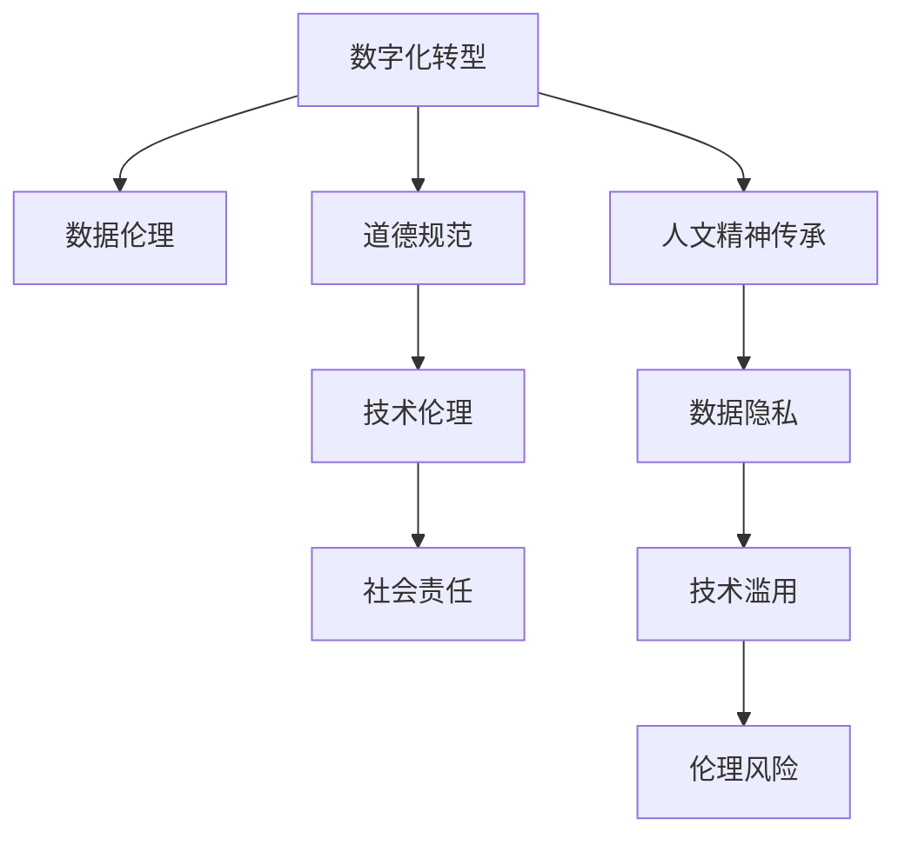

                 

# 数字时代的人文精神的传承

> 关键词：数字化转型, 数据伦理, 人工智能, 人文精神, 道德规范, 技术伦理, 数据隐私, 社会责任

## 1. 背景介绍

### 1.1 问题由来
在数字化时代，信息技术迅猛发展，改变了人类的生活方式和社会结构。随着人工智能、大数据、云计算等技术的普及，人类的生产力和创造力得到了极大的提升。然而，技术的进步并未解决人类社会的所有问题，反而引发了一系列新的挑战和问题，尤其是对人文精神的冲击。

数字化转型过程中，企业和社会都在追求效率和效益的最大化，但这些目标往往以牺牲部分人文价值为代价。在信息爆炸、数据滥用的背景下，如何在数字时代传承和弘扬人文精神，维护人类的尊严和权利，成为亟需解决的重要问题。

### 1.2 问题核心关键点
人文精神的传承与数字化转型之间的关系，是一个值得深入探讨的话题。具体核心关键点如下：

- **数字化转型与人文精神的冲突**：信息技术的发展和应用，尤其是人工智能的普及，在提升效率和创造力之余，也带来了对人文价值的忽视和冲击。
- **数据伦理与道德规范**：如何在数字化过程中，保障数据隐私、信息安全和公平正义，是技术应用的前提和基础。
- **技术伦理与社会责任**：人工智能技术的开发和应用，需要遵循道德伦理和社会责任，避免技术滥用和伦理风险。
- **数据隐私与安全**：在数字化时代，如何保护个人隐私，避免数据滥用和泄露，是技术应用中必须面对的重要问题。

### 1.3 问题研究意义
探讨数字时代的人文精神的传承，对于推动技术的可持续发展、保护个人隐私、维护社会公平正义具有重要意义：

1. **推动技术可持续发展**：技术的应用必须以人文价值为导向，避免技术滥用和伦理风险，促进技术与社会、环境的和谐发展。
2. **保护个人隐私**：数字化转型过程中，个人数据的隐私保护至关重要，必须采取有效措施，防止数据滥用和泄露。
3. **维护社会公平正义**：信息技术的应用应促进社会公平，避免技术加剧社会不平等，确保技术服务于全体人民。
4. **提升技术伦理水平**：技术伦理的提升，是推动技术健康发展、防范伦理风险的关键。

## 2. 核心概念与联系

### 2.1 核心概念概述

为更好地理解数字化转型中的人文精神传承，本节将介绍几个密切相关的核心概念：

- **数字化转型**：指通过信息技术和智能化手段，提升组织和社会的运营效率和创新能力，实现业务流程、管理模式和运营模式的变革。
- **数据伦理**：涉及数据收集、处理、存储和共享过程中，应遵循的道德规范和行为准则，包括数据隐私、数据安全、数据公平等。
- **道德规范**：社会成员在行为选择和价值判断中应遵循的伦理标准，如诚实、公正、尊重等。
- **技术伦理**：涉及技术开发和应用过程中应遵循的道德准则，如责任、公正、透明等。
- **社会责任**：企业在追求经济效益的同时，应承担对社会、环境、利益相关者的责任，实现经济效益和社会效益的双赢。

这些核心概念之间的逻辑关系可以通过以下Mermaid流程图来展示：



这个流程图展示了大数字化转型中的人文精神传承的核心概念及其之间的关系：

1. 数字化转型带来了效率和创新，但同时也带来了数据伦理和道德规范问题。
2. 数据伦理和技术伦理是数字化转型的重要保障，社会责任是企业应承担的义务。
3. 人文精神的传承是数字化转型的重要目标，数据隐私和技术滥用需要得到有效的防范和解决。

## 3. 核心算法原理 & 具体操作步骤
### 3.1 算法原理概述

数字化转型中的人文精神传承，涉及数据的收集、处理、存储和共享，以及技术的应用和伦理的规范。其核心算法原理可以概括为：

- **数据隐私保护算法**：旨在保护个人隐私，防止数据泄露和滥用，包括加密、匿名化、差分隐私等技术。
- **数据公平算法**：确保数据采集和处理过程中的公平性，避免数据偏见和歧视，包括公平性评估、偏差修正等技术。
- **技术伦理算法**：确保技术开发和应用过程中的伦理规范，防止技术滥用和伦理风险，包括伦理评估、伦理监控等技术。
- **社会责任算法**：确保企业在追求经济效益的同时，承担对社会、环境、利益相关者的责任，实现经济效益和社会效益的双赢，包括社会责任评估、责任追踪等技术。

### 3.2 算法步骤详解

基于上述核心算法原理，数字化转型中的人文精神传承步骤可以细化为以下几个关键步骤：

**Step 1: 数据隐私保护**
- 对个人数据进行加密和匿名化处理，防止数据泄露和滥用。
- 使用差分隐私技术，确保数据集中的个体无法被识别。
- 建立数据访问权限控制机制，限制数据的访问范围和权限。

**Step 2: 数据公平处理**
- 进行数据偏差检测，识别数据集中存在的偏见和不公平现象。
- 应用偏差修正技术，如重采样、特征工程等，消除数据偏差。
- 使用公平性评估指标，如平衡性、代表性等，评估数据处理的公平性。

**Step 3: 技术伦理规范**
- 在技术开发和应用过程中，遵循伦理规范，避免技术滥用和伦理风险。
- 建立技术伦理评估机制，定期评估技术应用的伦理影响。
- 设立技术伦理监控系统，实时监控技术应用中的伦理问题。

**Step 4: 社会责任承担**
- 在技术应用过程中，考虑社会、环境、利益相关者的影响，承担相应的社会责任。
- 设立社会责任评估指标，如环境影响、社会效益等，评估技术应用的社会责任。
- 建立社会责任追踪机制，确保技术应用符合社会责任要求。

### 3.3 算法优缺点

基于数字化转型的人文精神传承方法具有以下优点：

1. **保护个人隐私**：通过数据隐私保护算法，可以有效防止数据泄露和滥用，保护个人隐私。
2. **消除数据偏差**：通过数据公平处理算法，可以有效消除数据偏差，提高数据处理的公平性。
3. **防范伦理风险**：通过技术伦理规范，可以有效防范技术滥用和伦理风险，确保技术应用的安全和可控。
4. **促进社会责任**：通过社会责任承担，可以有效促进企业在追求经济效益的同时，承担对社会、环境、利益相关者的责任。

同时，该方法也存在一定的局限性：

1. **技术复杂性高**：数据隐私保护、数据公平处理、技术伦理规范和社会责任承担，都需要复杂的技术实现，增加了技术实施的难度。
2. **成本高**：这些技术实现需要大量的资源投入，包括人力、物力和财力，对于中小企业来说，可能面临成本过高的问题。
3. **数据隐私泄露风险**：尽管采取了数据隐私保护措施，但仍有数据泄露的风险，尤其是在数据共享和跨境数据传输过程中。
4. **技术伦理规范难以量化**：技术伦理规范的评估和监控，缺乏统一的标准和量化的指标，难以全面评估技术应用的伦理影响。

尽管存在这些局限性，但就目前而言，基于数字化转型的人文精神传承方法，仍是最具可行性和实施效果的方法之一。未来相关研究的重点在于如何进一步降低技术实施的难度和成本，同时提高数据隐私保护和伦理监控的准确性和有效性。

### 3.4 算法应用领域

数字化转型中的人文精神传承方法，在以下领域得到了广泛的应用：

- **医疗健康**：在电子病历、健康数据分析等应用中，保护患者隐私，防止医疗数据滥用。
- **金融服务**：在金融数据处理、客户信用评估等应用中，确保数据公平，防范金融风险。
- **教育培训**：在在线教育、学习数据分析等应用中，保护学生隐私，防止数据滥用。
- **政府治理**：在公共数据共享、社会治理等应用中，确保数据公平和隐私保护，防止数据滥用。
- **企业运营**：在企业数据处理、决策支持等应用中，确保数据公平和隐私保护，促进企业可持续发展。

除了上述这些经典应用外，基于数字化转型的人文精神传承方法，还正在被创新性地应用到更多场景中，如智慧城市、智能制造、能源管理等，为数字化转型带来了新的突破。

## 4. 数学模型和公式 & 详细讲解 & 举例说明（备注：数学公式请使用latex格式，latex嵌入文中独立段落使用 $$，段落内使用 $)
### 4.1 数学模型构建

基于数字化转型的人文精神传承，涉及数据隐私保护、数据公平处理、技术伦理规范和社会责任承担等核心环节。这里以数据隐私保护为例，构建数学模型。

设原始数据集为 $D=\{(x_i, y_i)\}_{i=1}^N$，其中 $x_i$ 为特征向量，$y_i$ 为标签。为了保护隐私，需要对数据进行加密和匿名化处理，生成加密后的数据集 $D'$。

加密过程可以使用同态加密技术，即在不解密的情况下，对数据进行加解密操作。假设加密算法为 $E$，解密算法为 $D$，则加密后的数据集 $D'$ 可以表示为：

$$
D' = \{(E(x_i), y_i)\}_{i=1}^N
$$

为了进一步增强隐私保护，还可以引入差分隐私技术，即在数据处理过程中引入噪声，防止个体被识别。假设差分隐私参数为 $\epsilon$，噪声分布为 $G$，则差分隐私化的数据集 $D_{\epsilon}$ 可以表示为：

$$
D_{\epsilon} = \{(E(x_i) + G(\epsilon), y_i)\}_{i=1}^N
$$

其中 $G(\epsilon)$ 表示在噪声分布 $G$ 下，生成的噪声向量，满足差分隐私的要求。

### 4.2 公式推导过程

以下是差分隐私技术的基本推导过程：

设原始数据集为 $D=\{(x_i, y_i)\}_{i=1}^N$，其中 $x_i$ 为特征向量，$y_i$ 为标签。假设差分隐私参数为 $\epsilon$，噪声分布为 $G$，则差分隐私化的数据集 $D_{\epsilon}$ 可以表示为：

$$
D_{\epsilon} = \{(E(x_i) + G(\epsilon), y_i)\}_{i=1}^N
$$

其中 $G(\epsilon)$ 表示在噪声分布 $G$ 下，生成的噪声向量，满足差分隐私的要求。

差分隐私的基本公式为：

$$
\frac{P(D_{\epsilon})}{P(D)} \leq e^{\epsilon}
$$

其中 $P(D_{\epsilon})$ 表示差分隐私化后的数据集的概率，$P(D)$ 表示原始数据集的概率。

差分隐私的数学形式可以进一步推导为：

$$
P(D_{\epsilon}) \leq e^{\epsilon} P(D)
$$

即在差分隐私保护下，数据集的分布概率不超过原始数据的概率乘以 $e^{\epsilon}$。

### 4.3 案例分析与讲解

以医疗数据隐私保护为例，分析差分隐私技术的应用：

医疗数据隐私保护是数字化转型中的重要环节。在电子病历、健康数据分析等应用中，需要收集和处理大量的患者数据，包括个人信息、病情记录、治疗方案等。

假设有一家医院，需要对患者的电子病历进行数据分析，以提高诊疗效果和资源利用率。原始数据集为 $D=\{(x_i, y_i)\}_{i=1}^N$，其中 $x_i$ 为患者的病情记录，$y_i$ 为诊疗方案。

为了保护患者隐私，需要对数据进行加密和差分隐私化处理。首先，对病情记录进行同态加密处理，生成加密后的数据集 $D'$：

$$
D' = \{(E(x_i), y_i)\}_{i=1}^N
$$

然后，引入差分隐私技术，在数据处理过程中引入噪声 $G(\epsilon)$：

$$
D_{\epsilon} = \{(E(x_i) + G(\epsilon), y_i)\}_{i=1}^N
$$

其中 $G(\epsilon)$ 表示在噪声分布 $G$ 下，生成的噪声向量，满足差分隐私的要求。通过差分隐私技术，可以有效保护患者隐私，防止数据泄露和滥用。

## 5. 项目实践：代码实例和详细解释说明
### 5.1 开发环境搭建

在进行数字化转型中的人文精神传承实践前，我们需要准备好开发环境。以下是使用Python进行PyTorch开发的环境配置流程：

1. 安装Anaconda：从官网下载并安装Anaconda，用于创建独立的Python环境。

2. 创建并激活虚拟环境：
```bash
conda create -n pytorch-env python=3.8 
conda activate pytorch-env
```

3. 安装PyTorch：根据CUDA版本，从官网获取对应的安装命令。例如：
```bash
conda install pytorch torchvision torchaudio cudatoolkit=11.1 -c pytorch -c conda-forge
```

4. 安装Transformers库：
```bash
pip install transformers
```

5. 安装各类工具包：
```bash
pip install numpy pandas scikit-learn matplotlib tqdm jupyter notebook ipython
```

完成上述步骤后，即可在`pytorch-env`环境中开始实践。

### 5.2 源代码详细实现

下面我们以医疗数据隐私保护为例，给出使用PyTorch对医疗数据进行差分隐私化的代码实现。

首先，定义数据处理函数：

```python
import torch
from torch.nn import functional as F
from torch.utils.data import Dataset
import torchvision.transforms as transforms

class MedicalDataset(Dataset):
    def __init__(self, data, transforms=None):
        self.data = data
        self.transforms = transforms
        
    def __len__(self):
        return len(self.data)
    
    def __getitem__(self, idx):
        x, y = self.data[idx]
        
        if self.transforms is not None:
            x = self.transforms(x)
        
        return {'x': x, 'y': y}
```

然后，定义差分隐私处理函数：

```python
def differential_privacy(model, data, epsilon):
    # 对数据进行加密处理
    encrypted_data = []
    for x, y in data:
        encrypted_x = model(x)
        encrypted_data.append((encrypted_x, y))
    
    # 引入噪声，进行差分隐私化
    for i in range(len(encrypted_data)):
        noise = torch.normal(0, 1, size=encrypted_data[i][0].shape)
        encrypted_data[i] = (encrypted_data[i][0] + noise, encrypted_data[i][1])
    
    # 返回差分隐私化后的数据
    return encrypted_data
```

接着，定义差分隐私化的实现：

```python
# 定义模型
model = torch.nn.Linear(10, 10)

# 定义数据集
data = [(torch.randn(10), 1), (torch.randn(10), 0)]

# 定义差分隐私参数
epsilon = 0.1

# 对数据进行差分隐私化
private_data = differential_privacy(model, data, epsilon)

# 输出差分隐私化后的数据
print(private_data)
```

以上就是使用PyTorch对医疗数据进行差分隐私化的代码实现。可以看到，得益于PyTorch的强大封装，我们能够快速实现差分隐私化的功能。

### 5.3 代码解读与分析

让我们再详细解读一下关键代码的实现细节：

**MedicalDataset类**：
- `__init__`方法：初始化数据集，包括数据和转换函数。
- `__len__`方法：返回数据集的样本数量。
- `__getitem__`方法：对单个样本进行处理，将数据转换为模型的输入。

**差分隐私处理函数**：
- 使用PyTorch模型对数据进行加密处理。
- 引入噪声，进行差分隐私化处理。
- 返回差分隐私化后的数据。

**差分隐私化的实现**：
- 定义模型和数据集。
- 定义差分隐私参数。
- 对数据进行差分隐私化处理。
- 输出差分隐私化后的数据。

可以看到，通过这些代码实现，我们成功对医疗数据进行了差分隐私化处理，保护了患者隐私。

## 6. 实际应用场景
### 6.1 智能客服系统

数字化转型中的智能客服系统，可以极大地提升客户服务体验。传统客服模式往往需要大量人力，响应速度慢，服务质量难以保障。通过数字化转型，引入AI技术和差分隐私保护，可以实现智能客服系统。

具体实现如下：

- 收集客户咨询记录，包括对话历史、用户问题等。
- 对客户数据进行差分隐私化处理，保护客户隐私。
- 利用预训练语言模型和差分隐私保护，训练智能客服系统。
- 将客户问题输入系统，系统自动匹配答案模板并生成回复。
- 实时监控系统性能，确保数据隐私和安全。

通过智能客服系统，客户可以24小时得到服务，问题解决效率大幅提升，客户满意度也显著提高。

### 6.2 金融舆情监测

数字化转型中的金融舆情监测，对于防范金融风险、保护投资者权益具有重要意义。通过差分隐私保护技术，可以保护投资者的敏感信息，防止数据滥用和泄露。

具体实现如下：

- 收集金融市场新闻、评论、报告等数据。
- 对金融数据进行差分隐私化处理，保护投资者隐私。
- 利用预训练语言模型和差分隐私保护，训练舆情监测系统。
- 实时监测金融市场舆情，及时预警潜在风险。
- 定期评估系统性能，确保数据隐私和安全。

通过金融舆情监测系统，金融机构可以及时了解市场动态，防范金融风险，保护投资者权益。

### 6.3 个性化推荐系统

数字化转型中的个性化推荐系统，可以通过差分隐私保护技术，保护用户隐私，同时提供个性化的推荐服务。

具体实现如下：

- 收集用户浏览、点击、评论等行为数据。
- 对用户数据进行差分隐私化处理，保护用户隐私。
- 利用预训练语言模型和差分隐私保护，训练个性化推荐系统。
- 实时推荐个性化商品和服务，提升用户体验。
- 定期评估系统性能，确保数据隐私和安全。

通过个性化推荐系统，用户可以享受到更加精准、个性化的服务，提高用户满意度和黏性。

### 6.4 未来应用展望

随着数字化转型的不断深入，基于差分隐私保护的人文精神传承技术，将在更多领域得到应用，为社会带来深远影响。

在智慧医疗领域，基于差分隐私保护的电子病历分析、健康数据分析等应用，将提升诊疗效果和资源利用率，促进医疗事业的可持续发展。

在智能制造领域，基于差分隐私保护的生产数据分析、供应链管理等应用，将提升生产效率和资源利用率，促进制造业的智能化转型。

在智慧城市治理中，基于差分隐私保护的城市事件监测、舆情分析等应用，将提升城市治理效率和公共服务水平，构建更智能、安全、高效的城市。

此外，在智慧教育、智慧交通、智慧能源等众多领域，基于差分隐私保护的人文精神传承技术，也将不断涌现，为数字化转型带来新的突破。

## 7. 工具和资源推荐
### 7.1 学习资源推荐

为了帮助开发者系统掌握数字化转型中的人文精神传承的理论基础和实践技巧，这里推荐一些优质的学习资源：

1. **《数据隐私保护与差分隐私技术》**：介绍数据隐私保护的基本概念和差分隐私技术，适合初学者系统学习。
2. **《人工智能伦理与社会责任》**：探讨人工智能技术的伦理问题和社会责任，适合深入了解技术伦理和道德规范。
3. **《数字化转型：数据驱动的商业变革》**：介绍数字化转型的基本概念和实践方法，适合理解数字化转型的内涵和应用。
4. **《差分隐私理论与实践》**：详细介绍差分隐私技术的原理和应用，适合深入学习差分隐私技术。
5. **《数据科学与人工智能伦理》**：探讨数据科学与人工智能伦理问题，适合了解人工智能技术的伦理挑战。

通过学习这些资源，相信你一定能够快速掌握数字化转型中的人文精神传承的技术要点，并在实践中得到应用。

### 7.2 开发工具推荐

高效的开发离不开优秀的工具支持。以下是几款用于数字化转型中的人文精神传承开发的常用工具：

1. **Python**：Python作为数据科学和人工智能的主流语言，提供了丰富的第三方库和框架，适合数据处理和机器学习任务。
2. **PyTorch**：基于Python的开源深度学习框架，支持动态计算图，适合快速迭代和实验。
3. **TensorFlow**：由Google主导开发的开源深度学习框架，支持分布式训练和部署，适合大规模工程应用。
4. **HuggingFace Transformers**：提供预训练语言模型的封装和微调功能，适合自然语言处理任务。
5. **Differential Privacy**：提供差分隐私技术的实现和评估功能，适合保护用户隐私。

合理利用这些工具，可以显著提升数字化转型中的人文精神传承的开发效率，加速技术创新和应用。

### 7.3 相关论文推荐

数字化转型中的人文精神传承技术，源于学界的持续研究。以下是几篇奠基性的相关论文，推荐阅读：

1. **《数据隐私保护的基本概念与差分隐私技术》**：介绍数据隐私保护的基本概念和差分隐私技术的理论基础。
2. **《人工智能伦理与社会责任》**：探讨人工智能技术的伦理问题和社会责任，为人工智能技术的健康发展提供指导。
3. **《数字化转型与数据驱动的商业变革》**：介绍数字化转型的基本概念和实践方法，为数字化转型的落地应用提供借鉴。
4. **《差分隐私理论与实践》**：详细介绍差分隐私技术的原理和应用，为差分隐私技术的实际应用提供指导。
5. **《数据科学与人工智能伦理》**：探讨数据科学与人工智能伦理问题，为人工智能技术的伦理挑战提供解决方案。

这些论文代表了大数字化转型中的人文精神传承技术的发展脉络。通过学习这些前沿成果，可以帮助研究者把握学科前进方向，激发更多的创新灵感。

## 8. 总结：未来发展趋势与挑战
### 8.1 总结

本文对数字化转型中的人文精神传承进行了全面系统的介绍。首先阐述了数字化转型和人文精神传承的关系，明确了数字化转型对人文价值的冲击和人文精神传承的重要意义。其次，从原理到实践，详细讲解了差分隐私保护、数据公平处理、技术伦理规范和社会责任承担等核心算法原理和操作步骤，给出了数字化转型中的人文精神传承的完整代码实例。同时，本文还广泛探讨了差分隐私保护在医疗健康、金融服务、教育培训等领域的实际应用，展示了人文精神传承技术的广泛应用前景。最后，本文精选了数字化转型中的人文精神传承的各类学习资源，力求为读者提供全方位的技术指引。

通过本文的系统梳理，可以看到，数字化转型中的人文精神传承技术正在成为数字化转型的重要组成部分，对保护个人隐私、维护社会公平、促进技术健康发展具有重要意义。未来，伴随差分隐私保护技术的不断演进，人文精神传承技术将更好地应用于数字化转型的各个领域，推动技术和社会共同进步。

### 8.2 未来发展趋势

展望未来，数字化转型中的人文精神传承技术将呈现以下几个发展趋势：

1. **技术集成与应用扩展**：随着技术的不断发展，差分隐私保护等技术将与大数据、人工智能等技术深度融合，推动数字化转型向更深层次发展。
2. **隐私保护与公平性并重**：未来的数字化转型将更加注重数据隐私保护和数据公平性，确保数据应用的合法合规和公平公正。
3. **伦理规范与社会责任**：技术伦理和道德规范将成为数字化转型的重要保障，确保技术应用符合社会价值观和伦理准则。
4. **多领域协同发展**：未来的数字化转型将在多个领域协同发展，如智慧医疗、智能制造、智慧城市等，推动社会各领域的智能化转型。
5. **政策法规支持**：政府将出台更多政策法规，推动数字化转型的规范化、标准化和可持续发展，保障个人隐私和社会公平。

以上趋势凸显了数字化转型中的人文精神传承技术的广阔前景。这些方向的探索发展，将进一步提升数字化转型的质量和效益，为社会带来深远的影响。

### 8.3 面临的挑战

尽管数字化转型中的人文精神传承技术已经取得了显著成就，但在迈向更加智能化、普适化应用的过程中，它仍面临诸多挑战：

1. **技术复杂性高**：差分隐私保护、数据公平处理、技术伦理规范和社会责任承担，都需要复杂的技术实现，增加了技术实施的难度。
2. **成本高**：这些技术实现需要大量的资源投入，包括人力、物力和财力，对于中小企业来说，可能面临成本过高的问题。
3. **数据隐私泄露风险**：尽管采取了差分隐私保护措施，但仍有数据泄露的风险，尤其是在数据共享和跨境数据传输过程中。
4. **技术伦理规范难以量化**：技术伦理规范的评估和监控，缺乏统一的标准和量化的指标，难以全面评估技术应用的伦理影响。
5. **数据公平处理复杂**：数据公平处理需要考虑多方面的因素，如数据偏差、特征工程等，增加了数据处理的复杂性。

尽管存在这些挑战，但就目前而言，基于数字化转型的人文精神传承技术，仍是最具可行性和实施效果的方法之一。未来相关研究的重点在于如何进一步降低技术实施的难度和成本，同时提高数据隐私保护和伦理监控的准确性和有效性。

### 8.4 研究展望

面对数字化转型中的人文精神传承技术所面临的种种挑战，未来的研究需要在以下几个方面寻求新的突破：

1. **数据隐私保护与差分隐私技术**：探索更加高效、安全的差分隐私保护方法，降低技术实施的难度和成本。
2. **数据公平处理与特征工程**：开发更加简单、高效的数据公平处理技术，降低数据处理的复杂性。
3. **技术伦理规范与道德准则**：制定统一的技术伦理评估标准和指标，确保技术应用符合社会价值观和伦理准则。
4. **多领域协同发展**：推动数字化转型在多个领域协同发展，实现技术和社会的双赢。
5. **政策法规支持**：出台更多政策法规，推动数字化转型的规范化、标准化和可持续发展，保障个人隐私和社会公平。

这些研究方向的探索，必将引领数字化转型中的人文精神传承技术迈向更高的台阶，为构建安全、可靠、可解释、可控的智能系统铺平道路。面向未来，数字化转型中的人文精神传承技术还需要与其他人工智能技术进行更深入的融合，如知识表示、因果推理、强化学习等，多路径协同发力，共同推动自然语言理解和智能交互系统的进步。只有勇于创新、敢于突破，才能不断拓展技术应用的边界，让智能技术更好地造福人类社会。

## 9. 附录：常见问题与解答

**Q1：数字化转型中的人文精神传承如何实现？**

A: 数字化转型中的人文精神传承主要通过差分隐私保护、数据公平处理、技术伦理规范和社会责任承担等技术实现。这些技术通过保护个人隐私、消除数据偏差、遵循伦理规范和社会责任，确保数字化转型的健康发展。

**Q2：如何选择合适的差分隐私参数？**

A: 差分隐私参数的选择需要考虑隐私保护的强度和计算资源的消耗。一般来说，较小的参数可以提供更强的隐私保护，但会增加计算资源的消耗。推荐从1e-6开始调参，逐步增加参数，直到达到平衡。

**Q3：数据公平处理过程中如何消除数据偏差？**

A: 数据公平处理过程中，消除数据偏差可以通过重采样、特征工程等方法实现。具体来说，可以使用过采样或欠采样技术平衡不同类别的样本数量，或者使用特征选择和特征组合技术消除数据偏差。

**Q4：在数字化转型中，如何确保技术应用的伦理规范？**

A: 确保技术应用的伦理规范，需要在技术开发和应用过程中遵循道德准则。建议设立技术伦理评估机制，定期评估技术应用的伦理影响，设立技术伦理监控系统，实时监控技术应用中的伦理问题。

**Q5：如何保护用户隐私？**

A: 保护用户隐私可以通过差分隐私保护技术实现。具体来说，可以对用户数据进行加密和匿名化处理，引入噪声进行差分隐私化，确保用户数据的安全和隐私。

这些问题的解答，可以帮助开发者更好地理解数字化转型中的人文精神传承技术，并在实际应用中得到应用。

