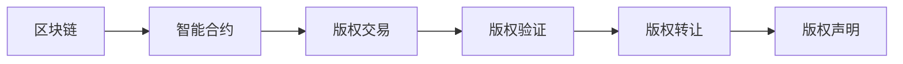

                 

# 数字版权创业：区块链在知识产权中的应用

## 1. 背景介绍

随着互联网技术的蓬勃发展，数字内容的创作和传播已经变得更加便捷，但同时也带来了数字版权保护的新挑战。传统版权管理依赖纸质文档和法律手段，费时费力且难以应对日益复杂的网络环境。然而，区块链技术的出现为数字版权保护提供了一种新的可能性。

区块链，作为一种去中心化的分布式账本技术，具有不可篡改、可追溯、可验证的特点，能够为数字版权保护提供一种透明、安全的解决方案。通过区块链，数字内容的创作者可以自行记录和控制自己的版权信息，减少对第三方机构和法律手段的依赖。

本文将系统介绍区块链技术在数字版权保护中的应用，涵盖区块链的核心概念、关键技术、实际应用场景等，并通过具体案例分析展示区块链在数字版权创业中的实际价值。

## 2. 核心概念与联系

### 2.1 核心概念概述

区块链（Blockchain）是一种去中心化的分布式账本技术，其核心思想是将数据存储在多个节点上，形成一个分布式数据库。每个数据区块包含一系列的交易记录，并通过密码学方法链接到前一个区块，形成一个不可篡改的链式结构。

**智能合约（Smart Contracts）**：一种在区块链上自动执行的合约，当预设条件满足时，自动执行合约中的操作。智能合约可以用于自动处理版权交易、版权验证等。

**非同质化代币（NFTs）**：一种基于区块链的独特资产，每个代币都是独一无二的，可以用于表示和交易版权等数字资产。

**不可替代代币（ERC-20）**：一种以太坊上的标准化代币，常用于数字资产的交易和所有权证明。

### 2.2 核心概念原理和架构的 Mermaid 流程图(Mermaid 流程节点中不要有括号、逗号等特殊字符)



## 3. 核心算法原理 & 具体操作步骤

### 3.1 算法原理概述

区块链通过分布式共识算法和加密技术，确保数据的安全性和不可篡改性。智能合约则通过编程方式，实现对版权信息的自动化管理。区块链的不可篡改性保证了版权信息的真实性和透明性，智能合约的自动化管理则简化了版权交易的流程。

### 3.2 算法步骤详解

**Step 1: 搭建区块链网络**
- 选择适合的区块链平台（如以太坊、Hyperledger等）。
- 搭建区块链网络，配置节点和共识算法。

**Step 2: 部署智能合约**
- 编写智能合约代码，使用Solidity等语言。
- 部署到区块链上，并进行测试。

**Step 3: 发行数字版权**
- 将版权信息编码成NFT代币，并发行到区块链上。
- 记录版权信息（如创作者、版权声明、使用权限等）。

**Step 4: 进行版权交易**
- 使用智能合约处理版权转让、许可等交易。
- 记录交易记录，更新区块链上的版权信息。

**Step 5: 验证和审计**
- 通过区块链的不可篡改性，验证版权信息。
- 使用审计工具，验证智能合约的执行情况。

### 3.3 算法优缺点

**优点：**
- 去中心化：版权信息由分布式网络存储，无需第三方中介。
- 安全性：区块链的加密和共识算法保证了数据的安全性。
- 透明性：版权信息公开记录，可追溯、可验证。
- 自动化：智能合约自动处理版权交易，减少人工干预。

**缺点：**
- 复杂性：技术门槛较高，需要理解区块链和智能合约原理。
- 成本高：搭建区块链网络和部署智能合约需要较高的资源投入。
- 可扩展性：区块链网络容量有限，难以处理大规模交易。
- 依赖平台：现有区块链平台（如以太坊）存在性能瓶颈和费用问题。

### 3.4 算法应用领域

区块链在数字版权保护中的应用主要涵盖以下几个领域：

1. **版权声明与发行**：创作者可以在区块链上发行自己的数字作品，通过智能合约记录版权信息。
2. **版权交易与转让**：创作者可以通过智能合约自动处理版权交易，包括许可、转让等。
3. **版权验证与保护**：通过区块链的不可篡改性，验证版权信息的真实性和完整性。
4. **版权管理与追踪**：智能合约可以自动记录版权的使用情况，提供版权追踪功能。
5. **版权维权**：在版权被侵权时，通过区块链上的版权记录，方便进行维权。

## 4. 数学模型和公式 & 详细讲解 & 举例说明

### 4.1 数学模型构建

假设有一个版权所有者A，希望在区块链上发行一份数字作品X的版权。

**Step 1: 创建版权记录**
- 版权记录包括版权所有者A的公钥、作品X的哈希值、版权声明等信息。
- 使用智能合约将版权记录编码成NFT代币，并发行到区块链上。

**Step 2: 记录版权信息**
- 使用智能合约记录版权所有者A的公钥和作品X的哈希值。
- 使用哈希算法对版权声明进行哈希，得到摘要。

**Step 3: 验证版权信息**
- 使用智能合约验证版权所有者A的公钥和作品X的哈希值。
- 通过哈希算法验证版权声明的摘要是否正确。

### 4.2 公式推导过程

假设版权记录为 $R=\{A^{pub}, H(X), D^{hash}\}$，其中：
- $A^{pub}$ 为版权所有者A的公钥。
- $H(X)$ 为作品X的哈希值。
- $D^{hash}$ 为版权声明的摘要。

版权验证公式为：
$$
verify(R) = verify(A^{pub}, H(X), D^{hash})
$$

版权声明的哈希算法为：
$$
D^{hash} = \text{hash}(D)
$$

其中，$D$ 为版权声明的明文。

### 4.3 案例分析与讲解

假设版权所有者A发行一份名为《时间旅行》的小说，版权记录 $R=\{A^{pub}, H(\text{《时间旅行》}), D^{hash}\}$。

**Step 1: 创建版权记录**
- 版权记录为 $R=\{A^{pub}, H(\text{《时间旅行》}), D^{hash}\}$，其中 $A^{pub}$ 为A的公钥，$H(\text{《时间旅行》}$ 为小说的哈希值，$D^{hash}$ 为版权声明的摘要。
- 使用智能合约将 $R$ 编码成NFT代币，并发行到区块链上。

**Step 2: 记录版权信息**
- 版权信息记录在智能合约中，包括版权所有者A的公钥和作品X的哈希值。
- 版权声明 $D$ 被哈希得到摘要 $D^{hash}$。

**Step 3: 验证版权信息**
- 版权所有者A可以验证版权记录是否正确。
- 任何第三方可以查询区块链，验证版权信息的真实性和完整性。

## 5. 项目实践：代码实例和详细解释说明

### 5.1 开发环境搭建

**Step 1: 安装以太坊开发环境**
- 安装以太坊钱包，如MetaMask或Ledger Nano。
- 安装Go或Truffle框架，搭建区块链开发环境。

**Step 2: 搭建智能合约**
- 使用Solidity语言编写智能合约。
- 在以太坊网络中部署智能合约，并进行测试。

### 5.2 源代码详细实现

**智能合约代码：**
```solidity
pragma solidity ^0.8.0;

contract Copyright {
    uint256 public nonce;
    address owner;
    bytes32[] public hashList;
    bytes32[] public claimList;

    constructor() {
        owner = msg.sender;
        nonce = 0;
    }

    function recordHash(uint256 hash) public {
        hashList.push(hash);
        claimList.push(0);
    }

    function recordClaim(uint256 hash, address user) public {
        require(hashList[hash] == 0);
        require(msg.sender == owner);
        claimList[hash] = user;
    }

    function verifyClaim(uint256 hash) public view returns (bool) {
        return claimList[hash] != 0;
    }
}
```

**代码解读与分析：**
- 该智能合约用于记录和验证版权信息。
- `recordHash`函数用于记录作品哈希值，`recordClaim`函数用于记录版权声明，`verifyClaim`函数用于验证版权声明。

### 5.3 运行结果展示

**智能合约部署结果：**
- 成功部署智能合约后，可以看到其地址、余额等信息。
- 使用智能合约进行版权声明和验证操作。

## 6. 实际应用场景

### 6.1 数字出版

数字出版行业一直以来都面临着版权保护的问题。传统的版权管理依赖纸质文档和法律手段，繁琐且易出错。区块链技术可以改变这一局面。

通过区块链，出版社可以发行数字作品的版权，记录版权信息和发行情况。读者可以在区块链上验证版权信息，购买版权并进行使用。这样既能保护版权所有者的权益，又能方便读者的版权购买和使用。

**实际应用：** 一家数字出版社发行了一份小说《未来的我》，将版权信息记录在区块链上。读者A购买版权后，可以合法使用小说。

### 6.2 数字艺术品

数字艺术品是一种新兴的版权形式，艺术家可以通过区块链发行自己的数字艺术品，记录版权信息和交易历史。区块链的不可篡改性保证了数字艺术品的真实性和透明性。

**实际应用：** 艺术家B发行了一幅数字画作《星空》，使用NFT代币记录版权信息。收藏家C购买了该艺术品，可以在区块链上验证版权信息，并查看交易历史。

### 6.3 数字音乐

音乐行业面临着版权侵权、盗版等问题。通过区块链，音乐创作者可以记录自己的音乐作品，自动管理版权和使用权限。

**实际应用：** 音乐人D发行了一首歌曲《希望》，使用NFT代币记录版权信息。听众E购买歌曲后，可以合法使用，并在区块链上验证版权信息。

## 7. 工具和资源推荐

### 7.1 学习资源推荐

1. **《区块链：数字货币技术与安全》**：深入介绍区块链技术的原理、实现和安全问题。
2. **《以太坊开发者手册》**：详细讲解以太坊平台的使用和智能合约开发。
3. **《NFT的艺术与商业》**：探讨NFT在艺术和商业领域的应用前景。
4. **Solidity官方文档**：以太坊智能合约的官方文档，提供完整的智能合约编写和部署指南。

### 7.2 开发工具推荐

1. **Metamask**：以太坊钱包，支持区块链网络的使用和管理。
2. **Truffle**：以太坊智能合约开发框架，提供开发、测试、部署等功能。
3. **Remix**：以太坊智能合约编辑器，支持智能合约的编写和调试。
4. **Web3.js**：以太坊的JavaScript库，提供与以太坊网络的交互功能。

### 7.3 相关论文推荐

1. **《区块链技术在数字版权保护中的应用研究》**：介绍了区块链在数字版权保护中的作用和实现方法。
2. **《基于智能合约的数字版权管理研究》**：探讨了智能合约在数字版权管理中的应用和优势。
3. **《区块链与数字版权技术的融合》**：讨论了区块链与数字版权技术的结合及其应用前景。

## 8. 总结：未来发展趋势与挑战

### 8.1 研究成果总结

区块链技术为数字版权保护提供了新的可能性，通过智能合约和NFT代币等手段，简化了版权管理流程，提高了版权信息的透明性和安全性。

### 8.2 未来发展趋势

1. **去中心化程度提升**：未来区块链技术将进一步去中心化，降低对中心化机构的依赖。
2. **智能合约普及**：随着智能合约技术的成熟，将有更多应用场景可以使用智能合约进行版权管理。
3. **NFT市场增长**：NFT市场将进一步扩展，数字艺术品、游戏、虚拟现实等更多领域将使用NFT进行版权管理。
4. **跨链技术发展**：不同区块链之间的互操作性将进一步增强，实现跨链版权管理。
5. **隐私保护增强**：区块链技术将增强版权信息的隐私保护，防止版权信息被滥用。

### 8.3 面临的挑战

1. **技术门槛高**：区块链和智能合约技术复杂，需要较高的技术门槛。
2. **隐私问题**：版权信息的公开透明可能导致隐私泄露。
3. **性能瓶颈**：现有区块链平台的性能瓶颈限制了大规模版权管理的可行性。
4. **法律问题**：现有法律法规与区块链版权管理的冲突和衔接问题仍需解决。

### 8.4 研究展望

1. **跨链版权管理**：研究不同区块链之间的互操作性，实现跨链版权管理。
2. **智能合约优化**：研究智能合约的优化技术，提高智能合约的执行效率和安全性。
3. **隐私保护技术**：研究区块链的隐私保护技术，防止版权信息被滥用。
4. **法规制度建设**：研究区块链版权管理的法律法规，推动区块链技术在数字版权保护中的合法应用。

## 9. 附录：常见问题与解答

**Q1: 区块链和智能合约是什么？**
A: 区块链是一种去中心化的分布式账本技术，通过密码学方法确保数据的安全性和不可篡改性。智能合约是一种自动执行的合约，当预设条件满足时，自动执行合约中的操作。

**Q2: 区块链在数字版权保护中有哪些优势？**
A: 区块链具有去中心化、安全性、透明性和自动化的特点，能够为数字版权保护提供透明、安全的解决方案。

**Q3: 智能合约如何保护版权信息？**
A: 智能合约可以记录版权信息，自动验证和处理版权交易，防止版权信息被篡改和滥用。

**Q4: 区块链在数字版权创业中有哪些实际应用场景？**
A: 区块链可以应用于数字出版、数字艺术品、数字音乐等版权管理场景，简化版权管理和保护流程。

**Q5: 区块链在数字版权保护中面临哪些挑战？**
A: 区块链技术复杂，需要较高的技术门槛；版权信息的公开透明可能导致隐私泄露；现有区块链平台的性能瓶颈限制了大规模版权管理的可行性；现有法律法规与区块链版权管理的冲突和衔接问题仍需解决。

---

作者：禅与计算机程序设计艺术 / Zen and the Art of Computer Programming

