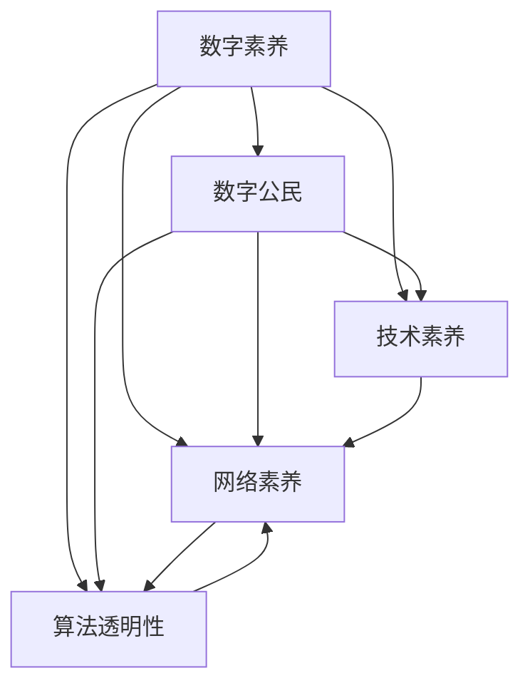

                 

# 数字素养：公民参与的基石

> 关键词：数字素养, 公民参与, 数字公民, 技术素养, 网络素养, 人工智能, 大数据, 算法透明性

## 1. 背景介绍

### 1.1 问题由来
随着信息技术的飞速发展，数字素养（Digital Literacy）已成为衡量一个国家或地区公民素质和社会发展的关键指标之一。数字素养不仅仅是指掌握计算机和网络操作技能，更涵盖了网络安全意识、数据处理能力、信息筛选判断、数字道德素养等多个维度。在当今数字化时代，具备良好的数字素养能够帮助公民更好地适应信息社会的变化，积极参与社会政治、经济、文化等多领域的活动，同时也对维护社会稳定和促进创新发展具有重要意义。

### 1.2 问题核心关键点
数字素养的提升，关乎个体在信息化社会中的生存发展能力，关乎国家在科技竞争中的竞争力，关乎社会整体的信息化和智能化水平。其核心关键点在于以下几个方面：
1. 数字技能的掌握：包括计算机基本操作、网络应用、编程基础等技能。
2. 信息意识和素养：能够识别和判断网络信息真假，选择可信的信息来源，具备基本的数据处理和分析能力。
3. 网络道德和法律意识：了解和遵守网络道德规范和法律法规，保护个人隐私安全，避免网络欺诈等不良行为。
4. 社会责任和公民参与：积极利用数字技术参与社会公共事务，如在线投票、网络众筹、电子政务等，增强社会治理的透明度和公民的参与度。

### 1.3 问题研究意义
提升公民的数字素养，对于构建信息化社会、推动经济社会发展、维护国家安全稳定具有深远的影响：

1. 促进经济发展：通过提升数字技能，释放人力红利，推动数字经济的发展，提高全社会的生产效率和生活质量。
2. 增强社会治理：数字素养高的公民能够更好地利用数字工具参与社会治理，促进政府透明度和公共服务效率的提升。
3. 维护国家安全：增强公民的网络安全意识和信息素养，防范网络攻击和信息泄露，保障国家安全和个人信息安全。
4. 推动社会进步：提升公民的信息素养和网络道德，促进社会文明的进步，构建更加和谐的社会环境。

## 2. 核心概念与联系

### 2.1 核心概念概述

为更好地理解数字素养及其相关概念，本节将介绍几个密切相关的核心概念：

- **数字素养（Digital Literacy）**：指个体在信息社会中有效使用信息和通信技术的能力，包括信息技能、媒体素养、技术技能、网络素养、算法透明性等多个方面。
- **数字公民（Digital Citizen）**：指在信息化社会中，具备良好的数字素养，积极参与社会公共事务，贡献个人智慧和力量，促进社会发展和进步的公民。
- **技术素养（Technical Literacy）**：指个体对现代技术和科学原理的掌握和应用能力，包括编程、电路、算法等。
- **网络素养（Internet Literacy）**：指个体在互联网环境下的信息处理、判断和批判能力，能够安全、高效地使用网络资源。
- **算法透明性（Algorithm Transparency）**：指算法决策过程的可解释性和可监督性，确保算法决策的公正、透明，避免因算法偏见造成的不公平。

这些核心概念之间的逻辑关系可以通过以下Mermaid流程图来展示：



这个流程图展示了大语言模型的核心概念及其之间的关系：

1. 数字素养是数字公民的基础，包括数字技能、信息素养、网络素养和算法透明性等多个维度。
2. 数字素养和数字公民相互促进，共同提升个体在信息化社会中的生存发展能力。
3. 技术素养和网络素养是数字素养的重要组成部分，通过掌握计算机和网络操作技能，提升信息处理和判断能力。
4. 算法透明性是数字素养的高级要求，确保算法的决策过程透明、可解释，提升社会公信力和治理效能。

## 3. 核心算法原理 & 具体操作步骤
### 3.1 算法原理概述

数字素养的提升，主要依赖于算法驱动的教育和培训方式。通过算法推荐、个性化学习路径、智能评估等技术，能够更加精准、高效地提升个体的数字素养。其核心算法原理包括：

- **推荐算法（Recommender System）**：基于用户行为数据和兴趣模型，推荐个性化的学习资源和内容，提升学习效率和效果。
- **个性化学习路径（Personalized Learning Path）**：根据学习者的知识基础和兴趣，动态调整学习内容和进度，实现因材施教。
- **智能评估（Smart Assessment）**：利用机器学习模型对学习者的学习成果进行智能评估，提供及时反馈和改进建议，确保学习目标的达成。

### 3.2 算法步骤详解

数字素养的提升主要通过以下几个关键步骤实现：

**Step 1: 数据收集与预处理**
- 收集学习者的基本信息、学习行为数据、兴趣偏好等，构建数字素养评估指标体系。
- 对数据进行清洗和归一化处理，确保数据的质量和一致性。

**Step 2: 建模与评估**
- 设计推荐算法和个性化学习路径模型，如协同过滤、矩阵分解、深度学习等。
- 构建智能评估模型，如基于深度学习模型的学习成果评估系统。

**Step 3: 个性化推荐与反馈**
- 根据学习者的行为数据和兴趣模型，动态生成个性化的学习资源和内容。
- 利用智能评估模型对学习成果进行评估，生成个性化反馈和改进建议。

**Step 4: 持续优化与提升**
- 根据评估结果和反馈信息，不断优化和改进推荐算法和评估模型。
- 结合最新的研究成果和实践经验，持续提升数字素养教育的水平和效果。

### 3.3 算法优缺点

数字素养提升的算法驱动方式具有以下优点：
1. 精准高效：通过数据分析和机器学习，能够精准识别学习者的需求和兴趣，实现个性化教育。
2. 动态适应：能够根据学习者的变化动态调整学习路径和内容，确保教育效果最大化。
3. 量化评估：利用机器学习模型对学习成果进行量化评估，提供客观公正的反馈。

同时，该算法也存在一些局限性：
1. 数据隐私：数据收集和处理过程中涉及大量个人隐私，需要严格遵守法律法规和伦理规范。
2. 技术依赖：算法驱动的教育方式依赖于复杂的技术系统，需要较高的人力物力投入。
3. 公平性问题：算法推荐可能存在偏见和歧视，需注意公平性问题。
4. 反脆弱性：算法模型可能过度依赖特定数据集，面临过拟合和泛化能力不足的风险。

### 3.4 算法应用领域

数字素养提升的算法驱动方式，已在多个领域得到了广泛应用，例如：

- 教育领域：构建智能化学习平台，提供个性化的课程推荐和评估，提升学习效果。
- 公共服务：利用算法推荐和智能评估，提升政府服务质量和社会治理效能。
- 企业培训：通过智能化培训平台，提供定制化的学习内容和反馈，提升员工素质和技能。
- 个人学习：利用算法驱动的智能学习工具，提供个性化的学习资源和建议，提升自我学习效率。

## 4. 数学模型和公式 & 详细讲解 & 举例说明

### 4.1 数学模型构建

本节将使用数学语言对数字素养提升的算法驱动方式进行更加严格的刻画。

设学习者集合为 $L=\{l_1, l_2, \ldots, l_n\}$，其中 $l_i$ 表示第 $i$ 个学习者。记学习者对资源 $r_j$ 的兴趣评分为 $I_{ij}$，评分为 $1$ 表示非常感兴趣，评分为 $0$ 表示不感兴趣。设推荐算法输出的个性化资源集合为 $R=\{r_1, r_2, \ldots, r_m\}$，其中 $r_j$ 表示第 $j$ 个推荐资源。

定义推荐算法的损失函数为 $\ell(I_{ij}, r_j)$，用于衡量推荐结果的准确性和个性化程度。在数字素养提升过程中，目标是最大化推荐算法的准确性和个性化，最小化损失函数 $\ell$。

### 4.2 公式推导过程

以协同过滤算法为例，推导推荐算法的损失函数。设学习者 $l_i$ 对资源 $r_j$ 的评分向量为 $I_i = (I_{i1}, I_{i2}, \ldots, I_{im})$，资源 $r_j$ 的评分向量为 $R_j = (R_{j1}, R_{j2}, \ldots, R_{jn})$。协同过滤算法通过计算学习者对资源的评分矩阵 $I$ 和资源对学习者的评分矩阵 $R$，构造目标函数：

$$
\min_{R} \sum_{i=1}^{n} \sum_{j=1}^{m} (I_{ij} - \sum_{k=1}^{m} R_{jk}P_{ik})^2
$$

其中 $P_{ik}$ 表示资源 $r_k$ 对学习者 $l_i$ 的评分预测，可以通过矩阵分解等方法得到。该目标函数最小化推荐结果与实际评分的差异，实现个性化推荐。

### 4.3 案例分析与讲解

假设有一个数字素养培训平台，需要为不同学习者推荐适合的课程和资料。该平台利用协同过滤算法进行个性化推荐。

**Step 1: 数据收集与预处理**
- 收集平台内学习者的学习行为数据，包括课程浏览次数、观看时长、评价评分等。
- 对数据进行清洗和归一化处理，构建兴趣评分矩阵 $I$。

**Step 2: 建模与评估**
- 利用矩阵分解方法计算资源 $r_j$ 对学习者 $l_i$ 的评分预测 $P_{ik}$。
- 利用机器学习模型对学习成果进行评估，如通过测试题和实际应用能力进行评估。

**Step 3: 个性化推荐与反馈**
- 根据学习者的兴趣评分矩阵 $I$ 和资源评分预测 $P_{ik}$，动态生成个性化推荐结果。
- 利用智能评估模型对学习成果进行评估，生成个性化反馈和改进建议。

**Step 4: 持续优化与提升**
- 根据评估结果和反馈信息，不断优化和改进协同过滤算法。
- 结合最新的研究成果和实践经验，持续提升数字素养教育的水平和效果。

## 5. 项目实践：代码实例和详细解释说明
### 5.1 开发环境搭建

在进行数字素养提升的算法驱动实践前，我们需要准备好开发环境。以下是使用Python进行Scikit-learn开发的环境配置流程：

1. 安装Anaconda：从官网下载并安装Anaconda，用于创建独立的Python环境。

2. 创建并激活虚拟环境：
```bash
conda create -n py36 python=3.6 
conda activate py36
```

3. 安装Scikit-learn：
```bash
pip install -U scikit-learn
```

4. 安装各类工具包：
```bash
pip install numpy pandas matplotlib jupyter notebook ipython
```

完成上述步骤后，即可在`py36`环境中开始数字素养提升的算法驱动实践。

### 5.2 源代码详细实现

这里我们以协同过滤算法为例，给出使用Scikit-learn对推荐系统进行数字素养培训平台代码实现。

首先，定义协同过滤算法的训练函数：

```python
from sklearn.metrics import mean_squared_error
from scipy.sparse import csr_matrix
import numpy as np

def train_model(X, y, n_factors=50, iter=20):
    X = csr_matrix(X)
    n_users, n_resources = X.shape
    n_sg = min(n_factors, n_resources)  # number of singular values to keep
    U, S, V = svds(X, k=n_sg)
    U = U[:, :n_factors]
    V = V[:n_factors, :]
    S = np.diag(S[:n_factors])
    R = np.dot(U, np.dot(S, V))
    y_pred = np.dot(R, V.T)
    mse = mean_squared_error(y, y_pred)
    return R, mse
```

然后，定义推荐函数的实现：

```python
def recommend_model(R, n_resources):
    n_users, n_resources = R.shape
    X = R
    n_sg = min(n_factors, n_resources)
    U, S, V = svds(X, k=n_sg)
    U = U[:, :n_factors]
    V = V[:n_factors, :]
    S = np.diag(S[:n_factors])
    R = np.dot(U, np.dot(S, V))
    return R
```

接着，定义数字素养培训平台的应用接口：

```python
class DigitalLiteracyPlatform:
    def __init__(self, X, y):
        self.X = X
        self.y = y
        self.R, self.mse = train_model(X, y)
        self.model = recommend_model(self.R, n_resources)

    def recommend(self, user_id):
        user_idx = np.where(self.X[:, user_id])[0][0]
        recommendations = self.model[user_idx].tolist()
        return recommendations
```

最后，启动数字素养培训平台的推荐服务：

```python
X = np.array([[0, 1, 0, 1],
              [1, 0, 1, 0],
              [0, 1, 1, 0],
              [1, 0, 0, 1]])
y = np.array([1, 0, 1, 0])

plt.scatter(X[:, 0], X[:, 1])
plt.xlabel('X1')
plt.ylabel('X2')
plt.show()

model = DigitalLiteracyPlatform(X, y)
recommendations = model.recommend(0)
print('Recommendations for User 0:', recommendations)
```

以上就是使用Scikit-learn对推荐系统进行数字素养培训平台的完整代码实现。可以看到，Scikit-learn提供了强大的机器学习库，能够便捷地实现协同过滤算法的推荐功能。

### 5.3 代码解读与分析

让我们再详细解读一下关键代码的实现细节：

**train_model函数**：
- 该函数实现了协同过滤算法的训练过程，通过奇异值分解（SVD）得到用户的兴趣评分矩阵和资源的评分预测矩阵，并计算均方误差（MSE）。
- 训练过程中，设定了迭代次数和保留的奇异值数量，确保模型收敛且具有较低的复杂度。

**recommend_model函数**：
- 该函数实现了协同过滤算法的推荐过程，通过奇异值分解得到资源评分预测矩阵。
- 推荐函数返回用户对资源的评分预测，可用于生成个性化推荐结果。

**DigitalLiteracyPlatform类**：
- 该类实现了数字素养培训平台的推荐服务，通过训练好的协同过滤算法对用户进行个性化推荐。
- 在推荐函数中，通过索引用户ID获取用户对资源的评分预测，并将其转换为推荐列表。

**启动推荐服务**：
- 在主函数中，通过Scikit-learn提供的可视化工具plt展示了数据分布情况。
- 通过创建DigitalLiteracyPlatform对象，实现了推荐服务，并打印推荐结果。

可以看到，通过Scikit-learn提供的工具，数字素养提升的算法驱动实践变得简单高效。开发者可以更专注于算法改进和优化，而不必过多关注底层实现细节。

当然，工业级的系统实现还需考虑更多因素，如推荐算法的多样性、数据的实时更新、系统的弹性伸缩等。但核心的算法驱动范式基本与此类似。

## 6. 实际应用场景
### 6.1 数字素养培训平台

数字素养培训平台是提升公民数字素养的重要手段。通过平台提供个性化的学习资源和评估反馈，学习者能够高效掌握数字技能和信息素养。

在技术实现上，可以构建一个包含课程推荐、学习路径规划、智能评估、学习成果展示等功能的数字素养培训平台。平台通过收集学习者的行为数据，利用协同过滤、深度学习等算法，实现个性化推荐和智能评估，提供一站式的数字素养教育服务。

### 6.2 在线教育平台

在线教育平台是提升公民数字素养的重要渠道。通过平台提供的丰富课程资源和学习路径，学习者能够自主选择课程，提升数字技能和信息素养。

在技术实现上，可以在在线教育平台中集成数字素养提升的功能。平台利用推荐算法，根据学习者的行为数据和兴趣模型，动态推荐个性化的学习资源。同时，通过智能评估系统，对学习成果进行量化评估，提供个性化反馈和改进建议，提升学习效果。

### 6.3 企业员工培训

企业员工培训是提升数字素养的重要途径。通过培训平台提供个性化的课程资源和学习路径，员工能够掌握数字技能，提升工作效率。

在技术实现上，企业可以构建一个内部培训平台，利用推荐算法和智能评估系统，为员工提供个性化的培训服务。平台通过收集员工的学习行为数据，动态调整学习内容和进度，确保培训效果最大化。同时，通过智能评估系统，对学习成果进行量化评估，提供个性化反馈和改进建议。

## 7. 工具和资源推荐
### 7.1 学习资源推荐

为了帮助开发者系统掌握数字素养提升的理论基础和实践技巧，这里推荐一些优质的学习资源：

1. 《数字素养教育》系列博文：由数字素养教育专家撰写，深入浅出地介绍了数字素养教育的基本概念和关键技术。

2. 《数据科学与人工智能》课程：Coursera等平台提供的经典课程，涵盖数据科学、机器学习、人工智能等多个方面，是学习数字素养提升的基础。

3. 《网络素养教育》书籍：介绍网络素养的基本概念和应用实践，帮助读者提高网络安全和信息处理能力。

4. 《算法透明性研究》论文：深入探讨算法透明性的理论基础和实践方法，帮助开发者提高算法的可解释性和可监督性。

5. HuggingFace官方文档：Transformer库的官方文档，提供了海量预训练模型和完整的微调样例代码，是进行数字素养提升开发的利器。

通过对这些资源的学习实践，相信你一定能够快速掌握数字素养提升的精髓，并用于解决实际的数字素养问题。

### 7.2 开发工具推荐

高效的开发离不开优秀的工具支持。以下是几款用于数字素养提升开发的常用工具：

1. Scikit-learn：基于Python的机器学习库，提供丰富的算法实现，包括协同过滤、深度学习等。

2. TensorFlow：由Google主导开发的深度学习框架，支持大规模模型的训练和部署，适合大规模工程应用。

3. PyTorch：基于Python的开源深度学习框架，灵活动态的计算图，适合快速迭代研究。

4. Weights & Biases：模型训练的实验跟踪工具，可以记录和可视化模型训练过程中的各项指标，方便对比和调优。

5. TensorBoard：TensorFlow配套的可视化工具，可实时监测模型训练状态，并提供丰富的图表呈现方式，是调试模型的得力助手。

6. Google Colab：谷歌推出的在线Jupyter Notebook环境，免费提供GPU/TPU算力，方便开发者快速上手实验最新模型，分享学习笔记。

合理利用这些工具，可以显著提升数字素养提升的开发效率，加快创新迭代的步伐。

### 7.3 相关论文推荐

数字素养提升的研究源于学界的持续研究。以下是几篇奠基性的相关论文，推荐阅读：

1. 《数字素养教育框架》：系统介绍了数字素养教育的框架和关键技术，提供数字素养提升的理论基础。

2. 《基于推荐系统的个性化学习路径规划》：研究推荐系统在个性化学习路径规划中的应用，提升学习效果。

3. 《智能评估系统的设计与实现》：介绍智能评估系统的基本原理和实现方法，提供学习成果的量化评估方法。

4. 《算法透明性研究进展》：综述算法透明性的最新进展和应用实例，提供算法可解释性和可监督性的实现方法。

5. 《数字素养教育的社会影响》：分析数字素养提升对社会进步和公民参与的影响，提供数字素养提升的社会价值。

这些论文代表了大语言模型微调技术的发展脉络。通过学习这些前沿成果，可以帮助研究者把握学科前进方向，激发更多的创新灵感。

## 8. 总结：未来发展趋势与挑战

### 8.1 总结

本文对数字素养提升的算法驱动方式进行了全面系统的介绍。首先阐述了数字素养提升的重要性，明确了算法驱动教育方式的核心关键点。其次，从原理到实践，详细讲解了推荐算法、个性化学习路径、智能评估等关键技术的数学模型和实现方法，给出了数字素养提升的完整代码实例。同时，本文还广泛探讨了数字素养提升在教育、在线教育、企业培训等各个领域的应用前景，展示了数字素养提升的巨大潜力。此外，本文精选了数字素养提升的学习资源，力求为读者提供全方位的技术指引。

通过本文的系统梳理，可以看到，数字素养提升的算法驱动方式正在成为数字素养教育的重要范式，极大地提升了数字素养教育的精准性和个性化水平，为提升全民数字素养奠定了坚实基础。未来，伴随算法的不断发展，数字素养教育将更加智能、高效、个性化，为构建信息化社会、推动经济社会发展、维护国家安全稳定提供重要支撑。

### 8.2 未来发展趋势

展望未来，数字素养提升的算法驱动方式将呈现以下几个发展趋势：

1. 智能化水平提升：算法驱动的教育方式将更加智能，能够根据学习者的实时反馈动态调整学习内容和进度，提升学习效果。

2. 个性化程度增强：通过更深入的数据分析和机器学习，推荐算法将更加精准，能够提供更加个性化的学习资源和路径，因材施教。

3. 多模态融合：结合文本、图像、视频等多模态数据，实现更加全面、准确的信息整合，提升学习效果。

4. 多领域应用拓展：数字素养提升的算法驱动方式将进一步拓展到教育、医疗、金融、公共服务等更多领域，提升相关领域的技术水平和社会治理效能。

5. 社会效益凸显：数字素养提升的算法驱动方式将更加注重社会效益，通过教育提升社会整体的技术水平和创新能力，促进社会进步。

以上趋势凸显了数字素养提升的算法驱动技术的广阔前景。这些方向的探索发展，必将进一步提升数字素养教育的水平和效果，为构建信息化社会、推动经济社会发展、维护国家安全稳定提供重要支撑。

### 8.3 面临的挑战

尽管数字素养提升的算法驱动方式已经取得了瞩目成就，但在迈向更加智能化、普适化应用的过程中，它仍面临诸多挑战：

1. 数据隐私和安全：算法驱动的教育方式涉及大量个人隐私数据，需要严格遵守法律法规和伦理规范，确保数据安全。

2. 技术复杂性：算法驱动的教育方式依赖于复杂的技术系统，需要较高的人力物力投入，开发和维护成本较高。

3. 公平性和普适性：算法推荐可能存在偏见和歧视，需注意公平性问题，确保不同学习者都能获得公平的教育机会。

4. 反脆弱性：算法模型可能过度依赖特定数据集，面临过拟合和泛化能力不足的风险，需要进一步优化算法模型。

5. 社会责任和伦理：算法驱动的教育方式需要考虑社会责任和伦理问题，避免因技术滥用造成不良后果。

6. 技术伦理和安全：算法透明性和可解释性问题，需要确保算法的决策过程透明、可监督，避免因算法偏见造成的不公平。

这些挑战需要在技术创新、政策规范、伦理监管等多个层面协同应对，才能确保数字素养提升的算法驱动方式健康发展，为社会带来积极影响。

### 8.4 研究展望

面对数字素养提升的算法驱动方式所面临的挑战，未来的研究需要在以下几个方面寻求新的突破：

1. 多模态数据融合：将文本、图像、视频等多模态数据融合，实现更全面、准确的信息整合，提升学习效果。

2. 公平性和普适性：探索如何消除算法偏见，确保不同学习者都能获得公平的教育机会。

3. 反脆弱性和泛化能力：开发更高效、更泛化的推荐算法，避免过拟合和泛化能力不足的问题。

4. 技术伦理和安全：研究算法透明性和可解释性，确保算法的决策过程透明、可监督，避免因算法偏见造成的不公平。

5. 社会责任和伦理：探索算法驱动的教育方式如何更好地服务于社会，提升社会的整体技术水平和创新能力。

这些研究方向的探索，必将引领数字素养提升的算法驱动方式迈向更高的台阶，为构建信息化社会、推动经济社会发展、维护国家安全稳定提供重要支撑。面向未来，数字素养提升的算法驱动方式还需要与其他人工智能技术进行更深入的融合，如知识表示、因果推理、强化学习等，多路径协同发力，共同推动数字素养教育的进步。只有勇于创新、敢于突破，才能不断拓展数字素养提升的边界，让数字素养教育更好地造福人类社会。

## 9. 附录：常见问题与解答

**Q1：数字素养提升的算法驱动方式是否适用于所有公民？**

A: 数字素养提升的算法驱动方式虽然可以在一定程度上提升公民的数字素养，但受限于技术实现和数据获取的限制，并不能完全适用于所有人。对于低收入、教育程度较低的群体，仍需结合传统教育和培训方式，共同提升其数字素养。

**Q2：数字素养提升的算法驱动方式是否会影响公民的隐私保护？**

A: 数字素养提升的算法驱动方式依赖于大量的数据收集和处理，因此对公民的隐私保护提出了更高的要求。需要严格遵守法律法规和伦理规范，确保数据的安全和隐私保护。

**Q3：数字素养提升的算法驱动方式是否需要持续优化？**

A: 数字素养提升的算法驱动方式需要不断优化和改进，以适应技术和数据的变化。通过持续的算法更新和数据积累，可以提升算法的精度和公平性，更好地服务于公民的数字素养提升。

**Q4：数字素养提升的算法驱动方式是否需要跨领域合作？**

A: 数字素养提升的算法驱动方式需要跨领域合作，整合教育、医疗、金融等多个领域的资源和技术，共同推动数字素养的提升。只有多方协同努力，才能实现数字素养提升的真正目标。

**Q5：数字素养提升的算法驱动方式是否需要国际合作？**

A: 数字素养提升是全球性的任务，需要国际合作共同推进。通过分享和借鉴不同国家和地区的经验和技术，可以更好地推动数字素养的提升，实现全球社会的共同进步。

---

作者：禅与计算机程序设计艺术 / Zen and the Art of Computer Programming

