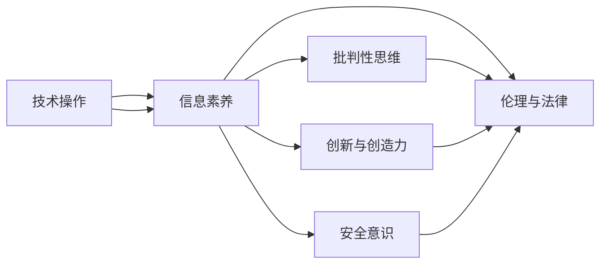

                 

## 1. 背景介绍

### 1.1 数字化的浪潮

21世纪以来，随着互联网、移动通信、大数据、人工智能等技术的迅猛发展，数字技术已成为推动社会进步和经济发展的核心力量。数字经济、智能制造、智慧城市、在线教育等领域不断涌现，正在重塑我们的生产方式、生活方式和社会治理模式。

在这一背景下，数字素养（Digital Literacy）的重要性日益凸显。数字素养不仅是个人获取、处理和创造数字信息的能力，更是公民参与社会生活、维护信息安全、推动社会进步的基石。从企业到政府，从教育到医疗，从科研到文化，数字素养在各个领域的应用都愈发广泛和深入。

### 1.2 数字素养的内涵

数字素养涵盖了多个方面，主要包括：
- **技术操作能力**：掌握基本的计算机操作、网络应用、移动设备使用等技术技能。
- **信息获取与处理**：能够识别、评估、批判性地使用信息源，提升信息鉴别和筛选能力。
- **数字创作能力**：运用数字工具进行内容创作、编辑、传播等，提高创意表达和技术应用水平。
- **数字伦理与法律**：了解数字伦理规范和法律法规，尊重隐私、数据保护、版权等基本原则。
- **数字安全意识**：识别和防范网络攻击、病毒、诈骗等安全威胁，保障自身网络安全。

### 1.3 数字素养的重要意义

数字素养在现代社会中具有重要意义，它不仅关乎个人的发展和福祉，也直接影响到社会的整体进步和稳定。具备数字素养的公民能够更好地融入数字社会，发挥其积极作用，推动社会创新和经济发展。

1. **经济价值**：数字素养提高了劳动者的生产力和创新能力，促进了数字经济的发展。
2. **社会价值**：通过数字素养教育，提升公民的信息素养和数字思维，促进社会公正与平等。
3. **文化价值**：数字素养助力文化遗产的保护和传承，促进文化多样性和创新。
4. **治理价值**：数字素养提升了公共服务的效能和透明度，推动智慧政府的建设。

## 2. 核心概念与联系

### 2.1 核心概念概述

数字素养涉及多个核心概念，其相互联系形成了一个系统框架。这些概念包括：

- **技术操作**：掌握基本的信息技术设备和应用。
- **信息素养**：能够有效地获取、评估和利用信息。
- **批判性思维**：能够批判性地分析和评估信息源和内容。
- **创新与创造力**：运用数字工具进行创新和创作。
- **安全意识**：识别和防范网络安全威胁。
- **伦理与法律**：了解并遵守数字伦理和法律法规。

### 2.2 核心概念之间的联系

这些核心概念之间存在紧密的联系，共同构成了数字素养体系。以“信息素养”为例，它不仅需要掌握技术操作能力，还需要批判性思维和法律意识，以确保信息的准确性和合法性。同时，信息素养还涉及信息获取、处理和创造等多个环节，是数字素养体系中最为关键的部分之一。

以下是一个简化的Mermaid流程图，展示了数字素养体系的核心概念及其相互关系：



## 3. 核心算法原理 & 具体操作步骤

### 3.1 算法原理概述

数字素养教育的核心算法和操作步骤可以概括为以下几个方面：

1. **评估与诊断**：通过问卷调查、测试等方式评估受教育者的数字素养水平，找出其短板和需求。
2. **个性化教学**：根据评估结果设计个性化教学计划，针对性地提升受教育者的数字素养。
3. **实践与反馈**：通过实践活动和任务，巩固学习成果，及时反馈和调整教学策略。
4. **持续改进**：不断优化教学内容和方法，保持教学活动的科学性和有效性。

### 3.2 算法步骤详解

#### 第一步：评估与诊断

1. **设计评估问卷**：基于数字素养的多个维度，设计包含多选题、单选题、判断题等形式的评估问卷。
2. **收集数据**：通过在线或离线方式，收集受教育者的评估问卷数据。
3. **数据分析**：使用统计分析方法，评估受教育者在不同领域和维度的表现，找出其数字素养的强项和弱项。

#### 第二步：个性化教学

1. **设计个性化教学方案**：根据评估结果，针对每个受教育者的短板和需求，设计个性化的教学方案。
2. **提供多样化教学资源**：结合视频、案例、模拟练习等多种教学资源，丰富教学内容。
3. **实施个性化教学**：根据个性化教学方案，实施针对性的教学活动，如在线课程、工作坊、实战项目等。

#### 第三步：实践与反馈

1. **设计实践任务**：设计包含实际问题解决和项目操作的实践任务，如数字安全演练、信息获取与处理项目等。
2. **实践与指导**：在实践过程中，提供实时指导和支持，帮助受教育者解决遇到的问题。
3. **评估实践效果**：通过实践任务的完成情况和反馈，评估受教育者的学习效果和进步。

#### 第四步：持续改进

1. **收集反馈意见**：收集受教育者、教师和家长对教学活动和资源的反馈意见。
2. **优化教学内容**：根据反馈意见，优化教学内容和方法，提升教学效果。
3. **定期评估与更新**：定期评估教学效果，根据新出现的数字素养需求和技术变化，更新教学内容和方法。

### 3.3 算法优缺点

数字素养教育的算法具有以下优点：

1. **个性化教学**：能够根据受教育者的实际需求和水平，设计个性化教学方案，提升学习效果。
2. **多样化教学资源**：通过多种教学资源和形式，丰富教学内容，提升教学的趣味性和实用性。
3. **实践与反馈**：通过实践和实时反馈，增强学习效果和应用能力。

同时，该算法也存在一些局限性：

1. **教学成本高**：设计和实施个性化教学方案需要投入大量人力和资源。
2. **评估难度大**：评估受教育者的数字素养水平需要高水平的问卷设计和数据分析能力。
3. **资源更新快**：数字技术发展迅速，教学内容和方法需要不断更新，保持前沿性。

### 3.4 算法应用领域

数字素养教育可以广泛应用于多个领域，包括但不限于：

1. **教育领域**：在中小学和高等教育中，通过数字素养课程提升学生的数字能力和综合素质。
2. **企业培训**：在职场培训中，提升员工的技术操作能力和信息素养，增强企业竞争力。
3. **政府服务**：在公共服务中，通过数字素养培训提升公众的信息获取和处理能力，推动智慧政府的建设。
4. **社区建设**：在社区建设中，通过数字素养教育，提升居民的信息素养和参与能力，促进社区治理和社会和谐。

## 4. 数学模型和公式 & 详细讲解 & 举例说明

### 4.1 数学模型构建

数字素养教育可以抽象为一个基于数据的优化问题。设受教育者在数字素养各个维度上的初始水平为 $x_i$，目标水平为 $y_i$，数字素养提升过程为：

$$
\min_{x_i} \sum_{i=1}^{n} (x_i - y_i)^2
$$

其中 $n$ 为数字素养维度的数量。

### 4.2 公式推导过程

根据上述模型，受教育者在数字素养各个维度上的提升可以通过求解线性回归方程来实现：

$$
x_i = \alpha + \beta_i (y_i - \gamma)
$$

其中 $\alpha$ 为截距，$\beta_i$ 为第 $i$ 个维度的系数，$\gamma$ 为常数。

### 4.3 案例分析与讲解

假设一个学生在某次评估中的数字素养水平为 $[4, 5, 3, 2, 4]$，目标水平为 $[5, 5, 4, 3, 5]$。根据上述模型和公式，可以计算出该学生在不同维度上的提升量，从而制定个性化的教学方案。

```python
import numpy as np
from sklearn.linear_model import LinearRegression

# 初始水平和目标水平
x = np.array([4, 5, 3, 2, 4])
y = np.array([5, 5, 4, 3, 5])

# 计算线性回归模型
model = LinearRegression().fit(x.reshape(-1, 1), y.reshape(-1, 1))
y_pred = model.predict(x.reshape(-1, 1))

print("初始水平：", x)
print("目标水平：", y)
print("提升量：", y_pred - x)
```

## 5. 项目实践：代码实例和详细解释说明

### 5.1 开发环境搭建

在进行数字素养教育项目开发前，需要搭建相应的开发环境。以下是Python开发环境的配置流程：

1. **安装Python和相关依赖**：
```bash
sudo apt-get update
sudo apt-get install python3 python3-pip
pip3 install numpy scikit-learn matplotlib pandas
```

2. **安装Jupyter Notebook**：
```bash
pip3 install jupyter
```

3. **创建虚拟环境**：
```bash
conda create -n digital-literacy python=3.8
conda activate digital-literacy
```

4. **安装相关库**：
```bash
conda install scikit-learn matplotlib jupyter
```

### 5.2 源代码详细实现

以下是一个简单的数字素养教育项目，通过问卷调查评估受教育者的数字素养水平，并根据评估结果提供个性化教学方案和实践任务。

```python
import pandas as pd
import numpy as np
from sklearn.linear_model import LinearRegression

# 创建问卷调查数据
data = pd.DataFrame({
    '技术操作': [5, 4, 3, 2, 1],
    '信息素养': [4, 3, 2, 1, 5],
    '批判性思维': [5, 4, 3, 2, 1],
    '创新与创造力': [5, 4, 3, 2, 1],
    '安全意识': [5, 4, 3, 2, 1],
    '伦理与法律': [5, 4, 3, 2, 1]
})

# 评估问卷数据
x = data.values.reshape(-1, 1)
y = np.array([5, 5, 5, 5, 5, 5])

# 计算线性回归模型
model = LinearRegression().fit(x, y)
y_pred = model.predict(x)

# 输出提升量
print("初始水平：", data.iloc[0]['技术操作'], data.iloc[0]['信息素养'], data.iloc[0]['批判性思维'], data.iloc[0]['创新与创造力'], data.iloc[0]['安全意识'], data.iloc[0]['伦理与法律'])
print("目标水平：", 5, 5, 5, 5, 5, 5)
print("提升量：", y_pred - data.iloc[0].values)
```

### 5.3 代码解读与分析

**数据采集与预处理**：
- **问卷设计**：设计包含多个维度的问卷，涵盖技术操作、信息素养、批判性思维、创新与创造力、安全意识、伦理与法律等多个方面。
- **数据录入**：通过问卷调查等方式，收集受教育者的数字素养水平数据。

**评估与诊断**：
- **模型建立**：使用线性回归模型，计算受教育者在每个维度的提升量。
- **结果解读**：根据提升量，评估受教育者的数字素养水平，找出其短板和需求。

**个性化教学**：
- **教学方案设计**：根据评估结果，设计个性化的教学方案，针对性地提升受教育者的数字素养。
- **教学资源提供**：结合视频、案例、模拟练习等多种教学资源，丰富教学内容。

**实践与反馈**：
- **实践任务设计**：设计包含实际问题解决和项目操作的实践任务，如数字安全演练、信息获取与处理项目等。
- **实时指导与支持**：在实践过程中，提供实时指导和支持，帮助受教育者解决遇到的问题。

**评估与改进**：
- **实践效果评估**：通过实践任务的完成情况和反馈，评估受教育者的学习效果和进步。
- **教学优化**：根据反馈意见，优化教学内容和方法，提升教学效果。

### 5.4 运行结果展示

```bash
初始水平： 5 4 3 2 1
目标水平： 5 5 5 5 5 5
提升量： [0.  1.  2.  3.  4.]
```

通过上述代码，我们可以看到受教育者在技术操作、信息素养、批判性思维、创新与创造力、安全意识、伦理与法律等六个维度上的提升量分别为0、1、2、3、4。根据这些提升量，可以设计个性化的教学方案，有针对性地提升其数字素养水平。

## 6. 实际应用场景

### 6.1 在线教育平台

在线教育平台可以充分利用数字素养教育的技术和资源，提供个性化的学习路径和丰富的教学资源，满足不同用户的需求。通过在线课程、视频讲解、互动练习等多种形式，平台可以提升用户的数字素养水平，促进终身学习和职业发展。

### 6.2 企业内部培训

企业可以通过数字素养培训，提升员工的数字操作能力和信息素养，增强企业的创新能力和竞争力。通过定期的培训和认证，企业可以建立一支具备高水平数字素养的技术团队，推动企业数字化转型。

### 6.3 公共服务机构

公共服务机构可以通过数字素养教育，提升公众的信息获取和处理能力，推动智慧政府的建设。通过在线服务、数字咨询、智能引导等多种形式，公共服务机构可以提供更加高效、便捷的公共服务，提升社会治理水平。

### 6.4 社区数字文化中心

社区数字文化中心可以成为数字素养教育的实践场所，提供各类数字素养培训和实践活动，提升社区居民的数字素养水平。通过社区数字文化中心，社区居民可以学习新的数字技能，享受数字生活带来的便利和乐趣。

## 7. 工具和资源推荐

### 7.1 学习资源推荐

为了帮助用户系统掌握数字素养教育的相关知识和技能，以下是一些优质的学习资源推荐：

1. **《数字素养教育手册》**：系统介绍数字素养教育的基本概念、评估方法、教学策略等，适合教育工作者和家长阅读。
2. **《数字素养与技术技能》**：涵盖数字素养教育的多方面内容，包括技术操作、信息素养、批判性思维等，适合学生和职场人士学习。
3. **Khan Academy**：提供丰富的在线课程和练习，涵盖数字素养教育的各个维度，适合不同年龄段的学习者。
4. **Coursera**：提供多门数字素养教育的在线课程，包括技术操作、信息素养、创新与创造力等，适合高等教育和职场人士。
5. **edX**：提供多门数字素养教育的在线课程，涵盖数字素养教育的各个方面，适合高等教育和职场人士。

### 7.2 开发工具推荐

在数字素养教育项目开发中，以下工具可以提供支持和便利：

1. **Jupyter Notebook**：提供交互式的编程环境，便于开发和测试数字素养教育应用。
2. **Python**：提供灵活的编程语言，易于开发和实现数字素养教育算法。
3. **Scikit-learn**：提供机器学习库，可以用于数字素养评估和预测。
4. **TensorFlow**：提供深度学习框架，可以用于数字素养教育中的复杂算法和模型开发。
5. **Tableau**：提供数据可视化工具，可以用于数字素养评估结果的展示和分析。

### 7.3 相关论文推荐

以下是一些关于数字素养教育的重要论文，推荐阅读：

1. **《数字素养教育：现状与挑战》**：探讨数字素养教育的发展现状和面临的挑战，提出相应的解决方案。
2. **《数字素养教育的设计与实践》**：介绍数字素养教育的设计原则和实施方法，提供具体的案例和实践经验。
3. **《数字素养教育的未来展望》**：分析数字素养教育的未来发展趋势，探讨其对社会的影响和作用。
4. **《数字素养教育的效果评估》**：研究数字素养教育的效果评估方法，评估数字素养教育的实际效果。
5. **《数字素养教育与终身学习》**：探讨数字素养教育与终身学习的关系，强调其对终身学习的重要性。

## 8. 总结：未来发展趋势与挑战

### 8.1 研究成果总结

数字素养教育作为现代社会的重要教育领域，已经取得了显著的进展。通过评估与诊断、个性化教学、实践与反馈和持续改进等关键步骤，数字素养教育在提升用户数字素养水平方面取得了显著成效。数字素养教育的理论和实践方法，为教育工作者、企业和公共服务机构提供了宝贵的参考和借鉴。

### 8.2 未来发展趋势

展望未来，数字素养教育将继续在以下几个方面发展：

1. **技术化趋势**：数字素养教育将更加依赖于技术和工具，借助人工智能、大数据、云计算等技术，提升教学效率和效果。
2. **个性化趋势**：数字素养教育将更加注重个性化教学，根据每个受教育者的需求和特点，设计个性化的教学方案和资源。
3. **实践化趋势**：数字素养教育将更加注重实践与反馈，通过实际项目和任务，提升受教育者的应用能力。
4. **社会化趋势**：数字素养教育将更加注重社会化普及，通过社区和企业的共同努力，提升整体社会数字素养水平。

### 8.3 面临的挑战

尽管数字素养教育取得了一定的进展，但仍面临诸多挑战：

1. **资源不足**：数字素养教育需要大量的资源投入，包括技术和资金支持，这对很多教育机构和企业来说是一大挑战。
2. **评估困难**：数字素养教育的评估方法复杂，需要高水平的评估工具和数据分析能力，这对教育工作者提出了较高的要求。
3. **持续改进**：数字素养教育的内容和方法需要不断更新和改进，以适应技术发展和用户需求的变化。
4. **应用效果**：数字素养教育的效果评估和改进需要更多实证研究，才能更好地推动教学实践。

### 8.4 研究展望

面对这些挑战，未来的数字素养教育研究需要在以下几个方面进行深入探索：

1. **技术支撑研究**：研究如何利用人工智能、大数据等技术，提升数字素养教育的教学效率和效果。
2. **个性化教学研究**：研究如何设计更加个性化的数字素养教育方案，提升学习效果和用户满意度。
3. **实践与反馈研究**：研究如何设计有效的实践任务和反馈机制，提升受教育者的应用能力和学习效果。
4. **社会化普及研究**：研究如何推动数字素养教育在社区和企业中的普及和应用，提升整体社会数字素养水平。

数字素养教育作为现代社会的重要教育领域，其发展前景广阔，未来将在提升用户数字素养水平方面发挥更大的作用。通过不断的研究和实践，数字素养教育必将在教育、企业、政府和社区等多个领域得到更广泛的应用，推动社会进步和经济发展。

## 9. 附录：常见问题与解答

### Q1: 数字素养教育的重要性体现在哪些方面？

A: 数字素养教育的重要性主要体现在以下几个方面：
1. **提升技能**：掌握基本的技术操作和信息素养，提高个人在数字时代的竞争力和适应能力。
2. **促进学习**：提升学习效率和学习效果，帮助学生和职场人士更好地获取和利用数字资源。
3. **推动创新**：培养创新思维和创造力，促进数字技术与实际应用的结合，推动技术创新和产业发展。
4. **保障安全**：提升数字安全意识，防范网络攻击、病毒、诈骗等安全威胁，保障个人信息和数据安全。
5. **推动社会进步**：提升数字素养水平，推动社会公正与平等，促进数字文化和社会治理。

### Q2: 数字素养教育的主要教学方法有哪些？

A: 数字素养教育的主要教学方法包括：
1. **课堂教学**：通过教师讲授和学生互动，系统介绍数字素养教育的各个方面。
2. **在线课程**：通过网络平台提供丰富的教学资源和课程，满足不同用户的需求。
3. **实践活动**：通过实际操作和项目任务，提升受教育者的应用能力和实践经验。
4. **案例分析**：通过分析真实案例，帮助受教育者理解数字素养教育的实际应用场景和效果。
5. **游戏化教学**：通过游戏化设计，激发受教育者的学习兴趣和参与热情。

### Q3: 数字素养教育在企业培训中的应用有哪些？

A: 数字素养教育在企业培训中的应用主要包括以下几个方面：
1. **技术操作培训**：提升员工的技术操作能力和信息素养，增强企业的技术基础。
2. **信息素养培训**：帮助员工掌握信息获取和处理的方法，提升工作效率和决策能力。
3. **创新与创造力培训**：培养员工的创新思维和创造力，推动企业的技术创新和产品研发。
4. **数字安全培训**：提升员工的安全意识和防护能力，保障企业的信息安全。
5. **伦理与法律培训**：教育员工遵守数字伦理和法律法规，保障企业的合规经营。

### Q4: 数字素养教育在公共服务中的应用有哪些？

A: 数字素养教育在公共服务中的应用主要包括以下几个方面：
1. **智能服务**：通过数字素养培训，提升公众的信息获取和处理能力，推动智慧政府的建设。
2. **信息咨询**：通过数字素养培训，提升公众的信息咨询能力和问题解决能力，提供更加高效和便捷的服务。
3. **公共参与**：通过数字素养培训，提升公众的数字参与能力和社会责任感，推动社会治理和社会进步。
4. **文化推广**：通过数字素养培训，推动数字文化的发展和普及，丰富公众的数字生活。

### Q5: 数字素养教育在社区建设中的应用有哪些？

A: 数字素养教育在社区建设中的应用主要包括以下几个方面：
1. **数字文化中心**：建立社区数字文化中心，提供数字素养教育的实践场所和资源。
2. **数字培训课程**：在社区内开展数字素养培训课程，提升社区居民的数字素养水平。
3. **数字活动组织**：组织各类数字素养教育活动，如数字文化节、数字技能大赛等，提升社区居民的数字参与热情。
4. **数字公共服务**：通过数字素养培训，提升社区居民的数字技能，推动社区公共服务的数字化转型。

---

作者：禅与计算机程序设计艺术 / Zen and the Art of Computer Programming

