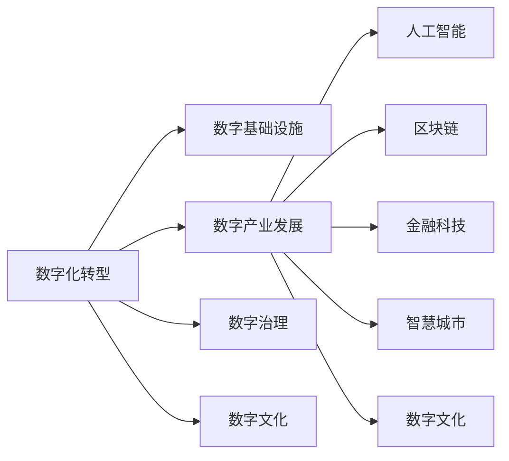

                 

# 数字经济：社会发展的助推器

> 关键词：数字经济, 人工智能, 大数据, 区块链, 金融科技, 智慧城市, 社会治理

## 1. 背景介绍

### 1.1 问题由来
数字经济，即通过信息与通信技术的深度融合，推动经济社会发展的一种新型经济形态。它以数字化、网络化、智能化为特征，正在深刻改变全球经济的发展格局和人类社会的运行模式。数字经济不仅是经济发展的新引擎，更是社会进步的加速器，推动着各行各业的创新升级，引领着未来发展趋势。

### 1.2 问题核心关键点
数字经济的核心在于数字技术与传统经济的深度融合。数字化转型已经成为企业提升竞争力的重要途径，推动了商业模式、管理方式、生产方式的变革。然而，数字化转型过程中也面临着数据安全、隐私保护、技术标准等诸多挑战。如何利用数字技术，构建安全、透明、可控的数字经济生态，成为了当前亟待解决的问题。

### 1.3 问题研究意义
深入研究数字经济的原理与应用，对于推动社会全面数字化转型，加速经济结构优化升级，构建人类命运共同体，具有重要意义：

1. 促进产业升级。数字经济能够催生新的产业模式和就业形态，推动传统产业数字化转型，提升全要素生产率。
2. 优化资源配置。通过大数据、云计算等技术，优化资源配置，提高经济运行效率。
3. 提升治理能力。数字技术可以提供全面的数据支撑，提升政府治理能力和公共服务水平。
4. 推动社会普惠。数字经济能够打破信息孤岛，促进社会公平，为全社会提供更公平、高效的服务。
5. 助力绿色发展。数字技术有助于实现绿色生产、节能减排，推动可持续发展。

## 2. 核心概念与联系

### 2.1 核心概念概述

数字经济涵盖了数字化技术应用和数字产业发展的各个方面，主要包括数字化转型、数字基础设施建设、数字产业发展、数字治理、数字文化等。以下将详细介绍其中几个关键概念：

1. **数字化转型**：指传统企业通过应用数字技术，实现业务流程、管理方式、商业模式等方面的变革，提升效率和竞争力。
2. **数字基础设施**：包括互联网、5G、云计算、大数据、物联网等，为数字经济发展提供了技术保障。
3. **数字产业发展**：包括人工智能、区块链、金融科技、智慧城市、数字文化等，形成数字经济的新支柱。
4. **数字治理**：指利用数字技术提升政府治理能力，构建透明、高效、公正的治理体系。
5. **数字文化**：指数字化、网络化、智能化对文化产业、文化生态的影响，推动文化创新和繁荣。

这些核心概念之间存在紧密联系，共同构成了数字经济的基本框架。

### 2.2 核心概念原理和架构的 Mermaid 流程图(Mermaid 流程节点中不要有括号、逗号等特殊字符)



该图展示了数字化转型与数字经济其他组成部分的联系。

## 3. 核心算法原理 & 具体操作步骤
### 3.1 算法原理概述

数字经济的运行和发展，离不开数字技术的支撑。数字技术主要包括人工智能、大数据、区块链、云计算等，通过数据采集、处理、分析、存储、传输等环节，实现对经济和社会的高效管理。数字经济的核心算法原理包括但不限于：

1. **人工智能**：通过机器学习、深度学习等算法，实现智能决策、智能运营、智能服务等功能。
2. **大数据**：通过数据挖掘、数据分析等技术，提取数据价值，优化资源配置。
3. **区块链**：通过分布式账本、智能合约等技术，实现数据透明、安全、可控。
4. **云计算**：通过虚拟化、弹性计算等技术，实现资源共享、按需服务。

### 3.2 算法步骤详解

以下以人工智能在数字经济中的应用为例，详细讲解其具体操作步骤：

1. **数据采集**：通过传感器、智能终端、互联网等手段，采集各类经济社会数据。
2. **数据处理**：对采集到的数据进行清洗、整理、标注等预处理操作，为后续算法训练提供数据支持。
3. **模型训练**：利用机器学习、深度学习等算法，在预处理后的数据上进行模型训练，得到可以用于预测、分类、聚类等任务的模型。
4. **模型部署**：将训练好的模型部署到生产环境中，实现对实时数据的预测和分析。
5. **模型评估与优化**：根据业务需求，对模型进行评估，发现问题并进行优化，提升模型性能。

### 3.3 算法优缺点

人工智能在数字经济中的应用具有以下优点：

1. **效率提升**：通过自动化、智能化手段，大幅提升业务处理效率。
2. **决策支持**：利用数据驱动的决策支持系统，提供科学的决策依据。
3. **服务创新**：实现个性化、定制化服务，提升用户体验。

同时，人工智能也存在一些局限性：

1. **数据依赖**：依赖于高质量、大规模的数据，数据获取难度大。
2. **算法透明性**：部分算法（如深度学习）存在“黑箱”问题，难以解释决策过程。
3. **安全风险**：存在模型被攻击、数据被篡改的风险。

### 3.4 算法应用领域

人工智能在数字经济中的应用已经覆盖了多个领域，包括但不限于：

1. **金融科技**：利用人工智能进行风险控制、信用评估、智能投顾、反欺诈等。
2. **智慧城市**：通过智能监控、交通管理、公共服务、安全防范等，提升城市管理水平。
3. **医疗健康**：利用智能诊断、医疗影像分析、健康管理等，提升医疗服务质量。
4. **工业制造**：通过智能预测、质量控制、生产调度等，提升制造效率和质量。
5. **零售电商**：利用智能推荐、个性化营销、客户服务、供应链管理等，提升用户体验和运营效率。

## 4. 数学模型和公式 & 详细讲解 & 举例说明（备注：数学公式请使用latex格式，latex嵌入文中独立段落使用 $$，段落内使用 $)
### 4.1 数学模型构建

以人工智能在金融科技领域的应用为例，构建一个简单的信用评估模型。假设信用数据集包含历史交易记录、个人信息、社会关系等特征，目标是预测用户是否违约。

假设特征向量 $x \in \mathbb{R}^n$，标签 $y \in \{0,1\}$，模型参数 $\theta$。则逻辑回归模型为：

$$
P(y=1|x,\theta) = \sigma(\theta^T x)
$$

其中 $\sigma$ 为sigmoid函数，$\theta^T x$ 为线性判别函数，输出概率值。

### 4.2 公式推导过程

假设训练集为 $\{(x_i,y_i)\}_{i=1}^N$，目标是最小化负对数似然损失：

$$
\mathcal{L}(\theta) = -\frac{1}{N}\sum_{i=1}^N [y_i \log P(y=1|x_i,\theta) + (1-y_i) \log P(y=0|x_i,\theta)]
$$

使用梯度下降算法求解：

$$
\theta \leftarrow \theta - \eta \nabla_{\theta}\mathcal{L}(\theta)
$$

其中 $\eta$ 为学习率，$\nabla_{\theta}\mathcal{L}(\theta)$ 为损失函数对参数 $\theta$ 的梯度。

### 4.3 案例分析与讲解

假设有一个信用评估任务，特征包含用户的年龄、收入、婚姻状况、居住地区等。模型在训练集上取得了较高的准确率，但在测试集上表现不佳。可能的原因包括：

1. 特征工程不足。需要进一步探索新的特征，或者对已有特征进行变换和组合。
2. 过拟合。需要增加正则化项，或者使用参数高效的模型（如AdaBoost、XGBoost等）。
3. 模型选择不当。需要尝试不同的模型，如支持向量机、决策树等。
4. 数据不平衡。需要处理数据不平衡问题，如重采样、权重调整等。

## 5. 项目实践：代码实例和详细解释说明
### 5.1 开发环境搭建

以下是使用Python进行TensorFlow开发的数字经济应用环境配置流程：

1. 安装Anaconda：从官网下载并安装Anaconda，用于创建独立的Python环境。

2. 创建并激活虚拟环境：
```bash
conda create -n pyenv python=3.8 
conda activate pyenv
```

3. 安装TensorFlow：根据CUDA版本，从官网获取对应的安装命令。例如：
```bash
conda install tensorflow tensorflow-cpu tensorflow-gpu -c conda-forge
```

4. 安装Keras：
```bash
pip install keras
```

5. 安装各类工具包：
```bash
pip install numpy pandas scikit-learn matplotlib tqdm jupyter notebook ipython
```

完成上述步骤后，即可在`pyenv`环境中开始数字经济应用开发。

### 5.2 源代码详细实现

以下以智慧城市中的交通管理为例，给出使用TensorFlow进行智能监控的代码实现。

```python
import tensorflow as tf
from tensorflow.keras import layers, models

# 定义模型结构
model = models.Sequential([
    layers.Dense(64, activation='relu', input_shape=(5,)),
    layers.Dense(32, activation='relu'),
    layers.Dense(1, activation='sigmoid')
])

# 编译模型
model.compile(loss='binary_crossentropy', optimizer='adam', metrics=['accuracy'])

# 训练模型
model.fit(train_dataset, epochs=10, validation_data=val_dataset)

# 评估模型
test_loss, test_acc = model.evaluate(test_dataset)
print('Test accuracy:', test_acc)
```

该代码展示了如何定义、编译、训练、评估一个简单的二分类模型。在实际应用中，需要根据具体任务调整模型结构和超参数，并进行特征工程、数据处理等操作。

### 5.3 代码解读与分析

让我们再详细解读一下关键代码的实现细节：

**特征工程**：
- 在模型训练前，需要对原始数据进行特征工程，如特征提取、特征选择、特征变换等。
- 在智慧城市交通管理中，需要提取交通流量、车辆速度、传感器数据等特征，并进行归一化处理。

**模型选择**：
- 根据任务特点选择合适的模型，如线性回归、逻辑回归、决策树、支持向量机等。
- 在智慧城市交通管理中，可以采用简单的逻辑回归模型，处理交通流量预测等任务。

**模型训练与评估**：
- 使用交叉验证、梯度下降等优化算法训练模型。
- 在智慧城市交通管理中，可以使用智能监控设备采集交通数据，训练模型预测未来交通流量。

**模型部署**：
- 将训练好的模型部署到生产环境中，实时处理数据。
- 在智慧城市交通管理中，将模型部署到交通管理中心，实现交通流量实时监控和预测。

## 6. 实际应用场景
### 6.1 智慧城市

数字技术在智慧城市中的应用，正在改变传统城市管理模式，提升城市治理效率和公共服务水平。以下是智慧城市中的几个典型应用场景：

1. **智能交通管理**：利用传感器、摄像头、GPS等设备采集交通数据，通过机器学习算法预测交通流量、优化交通信号，提升道路通行效率。
2. **公共安全监控**：通过智能监控系统实时监控公共区域，利用图像识别技术识别异常行为，提高安全防范能力。
3. **智能电网管理**：利用物联网设备采集电力数据，通过大数据分析预测电力负荷变化，优化电力供应，提高能源利用效率。
4. **智能水务管理**：利用传感器采集水质、水量数据，通过机器学习算法预测水资源需求，优化水资源分配，提升水资源利用率。
5. **智慧医疗**：利用人工智能技术进行智能诊断、医疗影像分析、健康管理等，提升医疗服务质量，缩短诊疗时间。

### 6.2 金融科技

金融科技是数字经济的重要组成部分，通过数字化手段推动金融服务的创新和升级。以下是金融科技中的几个典型应用场景：

1. **智能投顾**：利用人工智能算法分析市场数据，为投资者提供个性化的投资建议和组合优化方案。
2. **反欺诈**：利用机器学习算法识别异常交易行为，实时预警和防止金融欺诈。
3. **信用评估**：利用人工智能技术进行信用评分，提升贷款审批效率，降低坏账率。
4. **智能客服**：利用自然语言处理技术，提供7x24小时智能客服，提升客户体验。
5. **风险控制**：利用人工智能算法进行风险预测和量化，优化风险管理策略。

### 6.3 智慧农业

智慧农业利用数字技术，提升农业生产效率和农业信息化水平。以下是智慧农业中的几个典型应用场景：

1. **智能灌溉**：利用传感器监测土壤湿度、气象数据，通过机器学习算法优化灌溉方案，节约水资源。
2. **智能施肥**：利用传感器监测土壤养分、作物生长状态，通过机器学习算法优化施肥方案，提高作物产量和品质。
3. **病虫害预测**：利用图像识别技术识别病虫害情况，通过机器学习算法预测病虫害发生趋势，提前采取防治措施。
4. **智能收割**：利用传感器监测作物成熟度，通过机器学习算法优化收割时间，提升收割效率和质量。
5. **农业大数据分析**：利用大数据技术分析农业生产数据，优化农业生产管理，提高农业生产效益。

### 6.4 未来应用展望

随着数字技术的不断发展，未来数字经济的应用场景将更加丰富和多样化。以下是一些未来应用的展望：

1. **数字货币**：通过区块链技术实现跨境支付、资产管理等，提升金融服务效率。
2. **智慧物流**：利用物联网、大数据、人工智能技术，实现物流全流程的自动化、智能化。
3. **智慧教育**：利用数字技术实现个性化教育、在线教育、智慧校园等，提升教育质量。
4. **智慧零售**：通过智能推荐、智能营销、库存管理等，提升零售业态的效率和体验。
5. **智能制造**：利用人工智能技术进行预测维护、质量控制、生产优化等，提升制造企业的竞争力。

## 7. 工具和资源推荐
### 7.1 学习资源推荐

为了帮助开发者系统掌握数字经济的核心技术，以下是一些优质的学习资源：

1. 《深度学习》系列书籍：全面介绍深度学习原理和应用，是数字经济开发者的必备读物。
2. Coursera《机器学习》课程：斯坦福大学开设的机器学习课程，涵盖机器学习、深度学习等基础概念和算法。
3. Kaggle：全球最大的数据科学竞赛平台，提供丰富的数据集和竞赛机会，助力开发者提升实战能力。
4. GitHub：全球最大的代码托管平台，可以查找和分享数字经济应用的代码实现。
5. TensorFlow官方文档：提供完整的TensorFlow学习资源，包括教程、示例、API文档等。

通过对这些资源的学习实践，相信你一定能够快速掌握数字经济的核心技术，并用于解决实际的业务问题。

### 7.2 开发工具推荐

高效的开发离不开优秀的工具支持。以下是几款用于数字经济应用开发的常用工具：

1. Python：全球最流行的编程语言，生态丰富，适用于各类深度学习开发任务。
2. TensorFlow：由Google主导开发的深度学习框架，生产部署方便，支持分布式计算。
3. PyTorch：由Facebook开发的深度学习框架，灵活高效，适合研究和原型开发。
4. Keras：高层次神经网络API，封装了TensorFlow和PyTorch，易于上手。
5. Jupyter Notebook：基于Web的交互式编程环境，支持多种编程语言和工具集成。
6. Google Colab：谷歌推出的在线Jupyter Notebook环境，免费提供GPU/TPU算力，方便开发者快速实验最新模型。

合理利用这些工具，可以显著提升数字经济应用的开发效率，加快创新迭代的步伐。

### 7.3 相关论文推荐

数字经济的研究涉及众多领域，以下几篇奠基性的相关论文，推荐阅读：

1. 《Artificial Intelligence: A Modern Approach》：人工智能领域的经典教材，涵盖机器学习、深度学习等基础概念和算法。
2. 《Deep Learning》：深度学习领域的经典教材，由Ian Goodfellow等人编写，涵盖深度学习原理和应用。
3. 《Blockchain: Principles and Paradigms》：区块链领域的经典教材，由Daniel Gryler等人编写，涵盖区块链技术原理和应用。
4. 《Designing AI Applications》：人工智能应用设计的经典教材，由Brendan Judd等人编写，涵盖人工智能应用的开发和部署。
5. 《Big Data: Principles and Best Practices of Scalable Real-time Data Systems》：大数据领域的经典教材，由Joel Dean等人编写，涵盖大数据技术原理和应用。

这些论文代表了大数据、人工智能、区块链等数字经济核心技术的最新进展。通过学习这些前沿成果，可以帮助研究者把握学科前进方向，激发更多的创新灵感。

## 8. 总结：未来发展趋势与挑战
### 8.1 总结

本文对数字经济的核心概念和应用场景进行了全面系统的介绍。首先阐述了数字经济的定义、特征和重要意义，明确了数字化转型在推动经济发展和社会进步中的关键作用。其次，从原理到实践，详细讲解了数字经济的核心算法和具体操作步骤，给出了数字经济应用的完整代码实例。同时，本文还广泛探讨了数字经济在智慧城市、金融科技、智慧农业等多个行业领域的应用前景，展示了数字经济的巨大潜力。

通过本文的系统梳理，可以看到，数字经济正在深刻改变全球经济和社会的发展模式，为各行各业带来了全新的机遇和挑战。未来，伴随数字技术的不断创新，数字经济将进一步拓展应用边界，推动社会全面数字化转型。

### 8.2 未来发展趋势

展望未来，数字经济的发展将呈现以下几个趋势：

1. **智能化水平提升**：人工智能、大数据等技术将进一步提升数字经济运行的智能化水平，推动产业升级和创新。
2. **数字化生态完善**：数字基础设施将更加完善，数字经济生态体系将更加开放、协作。
3. **跨境合作增强**：数字经济的发展将打破国界限制，推动全球经济一体化进程。
4. **可持续性发展**：数字技术将助力实现绿色生产、节能减排，推动可持续发展。
5. **普惠化普及**：数字经济将促进信息公平，为全球更多地区提供平等的发展机会。

### 8.3 面临的挑战

尽管数字经济的发展前景广阔，但也面临着诸多挑战：

1. **数据安全和隐私保护**：数字经济高度依赖数据，数据安全和隐私保护成为一大难题。
2. **技术标准和规范**：数字技术的标准化、规范化亟待完善，避免技术壁垒和互操作性问题。
3. **伦理和道德**：数字经济的发展过程中，涉及诸多伦理和道德问题，如算法偏见、数据滥用等。
4. **资源和成本**：数字经济的发展需要大量的计算资源和资本投入，对中小企业构成较大压力。
5. **安全性和可靠性**：数字经济系统的稳定性和安全性面临诸多威胁，如网络攻击、数据泄露等。

### 8.4 研究展望

面对数字经济面临的挑战，未来的研究需要在以下几个方面寻求新的突破：

1. **数据隐私保护**：开发更高效、更安全的数据隐私保护技术，保障用户数据安全。
2. **技术标准化**：制定统一的数字技术标准和规范，推动数字经济健康发展。
3. **伦理和道德**：建立数字经济伦理规范，保障数字技术的公正、透明、可控。
4. **资源优化**：开发更高效的计算资源和资本投入，降低中小企业数字经济应用的门槛。
5. **安全防护**：开发更强大的安全防护技术，保障数字经济系统的稳定性和安全性。

这些研究方向的探索，必将引领数字经济迈向更高的台阶，为构建安全、可靠、可控的数字经济生态提供技术保障。面向未来，数字经济将进一步拓展应用边界，推动经济社会全面数字化转型。

## 9. 附录：常见问题与解答

**Q1：数字经济是否适用于所有行业？**

A: 数字经济适用于绝大多数行业，但不同行业对数字技术的依赖程度和应用模式各不相同。例如，传统制造业可以通过工业互联网进行数字化转型，而服务业则可以通过数字化服务提升运营效率。

**Q2：数字经济的应用开发是否需要大量资金投入？**

A: 数字经济的应用开发需要一定的资金投入，尤其是基础设施建设和技术研发方面。但随着云计算、人工智能等技术的普及，中小企业也可以利用云计算等平台，降低数字经济应用的成本。

**Q3：数字经济在数字化转型中需要注意哪些问题？**

A: 数字化转型过程中需要注意以下几个问题：

1. **技术选型**：选择合适的数字技术，结合业务需求进行选型，避免盲目跟风。
2. **数据安全**：保障数据安全和隐私保护，避免数据泄露和滥用。
3. **人才培养**：提升人才素质，培养跨领域、跨学科的复合型人才。
4. **业务协同**：推动业务流程和数字化技术深度融合，实现业务协同。
5. **持续改进**：持续改进数字化技术，优化数字化应用效果。

**Q4：如何评估数字经济应用的效果？**

A: 数字经济应用的效果评估可以从以下几个方面入手：

1. **业务效率提升**：通过数据分析，评估数字技术对业务效率的提升效果。
2. **成本节约**：通过财务数据分析，评估数字技术对企业成本的节约效果。
3. **用户体验改善**：通过用户反馈和满意度调查，评估数字技术对用户体验的改善效果。
4. **创新能力提升**：通过产品创新和市场竞争力分析，评估数字技术对企业创新能力的提升效果。
5. **社会贡献**：通过社会效益分析，评估数字技术对社会治理、公共服务等社会贡献效果。

总之，数字经济应用的效果评估需要结合具体业务场景，制定合理的评估指标，全面评估数字技术的应用效果。

---

作者：禅与计算机程序设计艺术 / Zen and the Art of Computer Programming

