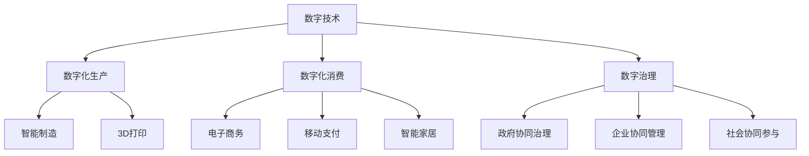
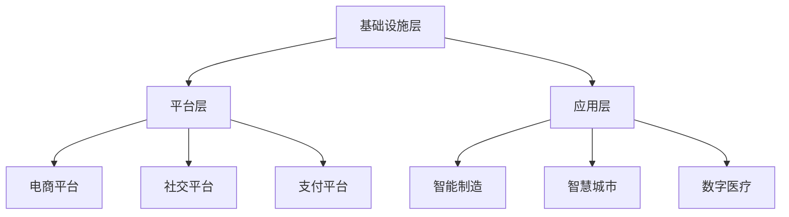

                 

## 1. 背景介绍

在过去的几十年中，数字化浪潮席卷全球，推动了社会的飞速发展和变革。从个人消费到企业运营，再到政府治理，数字技术的深入应用正在重塑着人类社会的运作方式和商业模式。然而，随着数字化的深入，一个全新的概念——数字经济应运而生，它不仅引领了新一轮的技术变革，更成为了社会发展的助推器。

### 1.1 数字经济的定义与起源

数字经济（Digital Economy）是指通过数字化技术的应用，实现经济活动的数字化、网络化、智能化和自动化，从而带动经济增长、提高效率、促进创新和就业的一种经济形态。它的起源可以追溯到上世纪90年代，随着互联网技术的发展和普及，数字技术开始从根本上改变人们的生活方式、工作模式和商业运作方式。

### 1.2 数字经济的特点

数字经济具有以下几大显著特点：

1. **信息化程度高**：数字经济高度依赖于信息技术，从大数据、云计算、人工智能到区块链，几乎所有领域都在利用数字化技术进行信息处理和分析。

2. **互联互通性**：数字经济实现了信息、物资、人才等资源的互联互通，打破了传统产业的物理边界，促进了跨领域、跨区域的合作和交流。

3. **个性化服务**：通过数据分析和算法优化，数字经济能够提供更加个性化、定制化的产品和服务，满足用户多样化的需求。

4. **高效协同**：数字技术的应用使得企业内部和产业链上下游的协同效率大大提升，形成了更加灵活、高效的供应链和生产体系。

5. **低成本、高灵活性**：数字化生产和管理模式降低了企业的运营成本，提高了业务的响应速度和市场竞争力。

## 2. 核心概念与联系

### 2.1 核心概念概述

数字经济的核心概念包括数字技术、数字化生产、数字化消费、数字治理等，这些概念相互联系、相互作用，共同推动着社会的发展和进步。

- **数字技术**：包括大数据、云计算、人工智能、物联网等，是数字经济的基础和动力。
- **数字化生产**：指通过数字化技术实现的生产流程的自动化、智能化和精益化，包括智能制造、3D打印、数字孪生等。
- **数字化消费**：指通过数字技术提供的个性化、便捷化的消费体验，如电子商务、移动支付、智能家居等。
- **数字治理**：指通过数字化手段实现政府、企业、社会等各类主体的协同治理，提升治理效率和公平性。

这些概念之间的关系可以通过以下Mermaid流程图来展示：



### 2.2 核心概念原理和架构的 Mermaid 流程图

数字经济的架构可以分为三层：基础设施层、平台层和应用层。

- **基础设施层**：包括5G、云计算、大数据等，为数字经济提供技术支撑。
- **平台层**：包括电商平台、社交平台、支付平台等，为数字经济提供服务和连接。
- **应用层**：包括智能制造、智慧城市、数字医疗等，为数字经济提供实际应用场景。



## 3. 核心算法原理 & 具体操作步骤

### 3.1 算法原理概述

数字经济的发展离不开算法和大数据的支持，本文将重点介绍其中两种关键算法：推荐算法和预测算法。

推荐算法（Recommendation Algorithm）通过分析用户的历史行为数据，为用户推荐其可能感兴趣的产品或服务。推荐算法的核心在于用户行为建模和物品相似度计算。

预测算法（Predictive Algorithm）通过分析历史数据，预测未来的趋势和行为。预测算法的核心在于数据的挖掘和模型的训练。

### 3.2 算法步骤详解

#### 3.2.1 推荐算法步骤详解

1. **数据收集**：收集用户的历史行为数据，如浏览记录、购买记录、评分记录等。

2. **用户建模**：对用户行为数据进行特征提取和建模，形成用户画像。

3. **物品建模**：对物品的属性和关系进行建模，如商品类别、价格、评价等。

4. **相似度计算**：计算用户和物品之间的相似度，找出与用户最相关的物品。

5. **推荐生成**：根据相似度计算结果，生成推荐列表。

6. **效果评估**：通过评估指标如点击率、转化率等，评估推荐效果，并根据评估结果调整模型参数。

#### 3.2.2 预测算法步骤详解

1. **数据收集**：收集历史数据，如销售数据、客户数据、市场数据等。

2. **数据预处理**：清洗、标准化数据，去除异常值和噪声。

3. **特征工程**：选择和构造特征，如时间、地点、人群特征等。

4. **模型训练**：选择合适的模型，如线性回归、随机森林、神经网络等，进行训练。

5. **效果评估**：通过评估指标如均方误差、准确率等，评估预测效果，并根据评估结果调整模型参数。

### 3.3 算法优缺点

#### 3.3.1 推荐算法优缺点

**优点**：

- **个性化推荐**：能够根据用户的历史行为数据，提供更加个性化的推荐，提高用户满意度。
- **实时更新**：能够实时分析用户行为数据，更新推荐结果，保持推荐的相关性和时效性。
- **跨领域推荐**：能够跨越不同领域进行推荐，如商品推荐、内容推荐、服务推荐等。

**缺点**：

- **冷启动问题**：新用户或新物品的推荐难度较大，需要大量数据和较长的适应期。
- **数据隐私**：推荐算法需要大量的用户数据，可能存在隐私泄露风险。
- **推荐准确性**：推荐算法的效果受数据质量和模型复杂度影响较大，存在推荐准确性不足的问题。

#### 3.3.2 预测算法优缺点

**优点**：

- **高精度预测**：通过历史数据训练模型，能够实现高精度的预测，帮助企业决策。
- **多维度分析**：能够从多个维度分析数据，如时间、地点、人群等，提供更全面的洞察。
- **自动化决策**：能够自动进行预测分析，减少人工干预，提高决策效率。

**缺点**：

- **数据质量要求高**：预测算法的性能依赖于数据的质量和完整性，数据不足或质量不高将影响预测效果。
- **模型复杂度高**：预测算法的模型复杂度较高，需要较长的训练时间和计算资源。
- **解释性差**：预测算法往往是“黑箱”模型，难以解释其决策逻辑。

### 3.4 算法应用领域

推荐算法和预测算法在数字经济中有着广泛的应用，以下列举几个典型领域：

- **电子商务**：电商平台通过推荐算法为用户推荐商品，提高销售转化率；通过预测算法预测销量，优化库存管理。
- **金融**：金融机构通过推荐算法为用户推荐理财产品，提高客户黏性；通过预测算法预测市场趋势，指导投资决策。
- **健康医疗**：医疗机构通过推荐算法为用户推荐健康方案，提高健康管理效果；通过预测算法预测疾病风险，优化治疗方案。
- **智能制造**：制造企业通过推荐算法优化生产流程，提高生产效率；通过预测算法预测设备故障，保障生产稳定。
- **智慧城市**：城市管理部门通过推荐算法推荐公共服务，提高居民满意度；通过预测算法预测交通流量，优化交通管理。

## 4. 数学模型和公式 & 详细讲解 & 举例说明

### 4.1 数学模型构建

推荐算法的核心在于用户和物品的相似度计算，这里以协同过滤算法为例，介绍其数学模型构建。

协同过滤算法分为基于用户的协同过滤和基于物品的协同过滤两种。基于用户的协同过滤通过计算用户之间的相似度，为用户推荐其相似用户喜欢的物品；基于物品的协同过滤通过计算物品之间的相似度，为用户推荐与已喜欢的物品相似的新物品。

### 4.2 公式推导过程

#### 4.2.1 用户相似度计算

基于用户的协同过滤算法中的用户相似度计算公式如下：

$$
similarity(u_i,u_j) = \frac{\sum_{k=1}^{n} \overline{x}_{ik} \overline{x}_{jk}}{\sqrt{\sum_{k=1}^{n} (\overline{x}_{ik})^2} \sqrt{\sum_{k=1}^{n} (\overline{x}_{jk})^2}}
$$

其中，$\overline{x}_{ik}$ 表示用户 $u_i$ 对物品 $k$ 的评分，$n$ 表示物品总数。

#### 4.2.2 物品相似度计算

基于物品的协同过滤算法中的物品相似度计算公式如下：

$$
similarity(i_i,i_j) = \frac{\sum_{k=1}^{m} \overline{x}_{ik} \overline{x}_{jk}}{\sqrt{\sum_{k=1}^{m} (\overline{x}_{ik})^2} \sqrt{\sum_{k=1}^{m} (\overline{x}_{jk})^2}}
$$

其中，$\overline{x}_{ik}$ 表示物品 $i_k$ 被用户 $u_j$ 评分，$m$ 表示用户总数。

### 4.3 案例分析与讲解

#### 4.3.1 电子商务推荐

以亚马逊推荐系统为例，亚马逊通过分析用户的历史购买数据，计算用户与物品之间的相似度，为用户推荐其可能感兴趣的商品。亚马逊的推荐系统采用了多种算法，如基于内容的推荐、协同过滤推荐等，并结合实时数据分析和A/B测试，不断优化推荐效果。

#### 4.3.2 金融预测

以招商银行为例，招商银行通过分析历史交易数据和市场信息，预测客户的信用评分和投资收益，为其提供个性化的金融服务。招商银行采用了神经网络模型进行预测，取得了较高的预测准确率。

## 5. 项目实践：代码实例和详细解释说明

### 5.1 开发环境搭建

为了进行推荐算法和预测算法的开发，需要搭建一个完整的开发环境，以下是一个基于Python的开发环境搭建流程：

1. **安装Python**：选择安装最新版本的Python，例如Python 3.8或3.9。

2. **安装必要的包**：安装NumPy、Pandas、Scikit-learn、TensorFlow等必要的包。

3. **配置开发工具**：配置IDE（如Jupyter Notebook、PyCharm等），并设置虚拟环境。

4. **搭建服务器**：搭建一个服务器环境，如AWS、Google Cloud等，用于存储和处理数据。

5. **配置数据库**：选择数据库系统（如MySQL、MongoDB等），用于存储和查询数据。

### 5.2 源代码详细实现

以下是一个基于协同过滤算法的推荐系统示例代码：

```python
import pandas as pd
from sklearn.metrics.pairwise import cosine_similarity

# 读取用户评分数据
df = pd.read_csv('ratings.csv')

# 计算用户相似度矩阵
user_similarity = cosine_similarity(df.values)

# 计算物品相似度矩阵
item_similarity = cosine_similarity(df.T.values)

# 计算推荐结果
def recommend(user_id, top_n=10):
    similarity_scores = user_similarity[user_id]
    recommendations = [(item, similarity_scores[i]) for i in range(len(similarity_scores)) if similarity_scores[i] > 0]
    recommendations = sorted(recommendations, key=lambda x: x[1], reverse=True)
    return recommendations[:top_n]

# 测试推荐系统
user_id = 1
top_n = 5
recommendations = recommend(user_id, top_n)
print(recommendations)
```

### 5.3 代码解读与分析

#### 5.3.1 数据处理

推荐系统的数据通常来自于用户的评分数据，使用Pandas库进行读取和处理。

#### 5.3.2 相似度计算

相似度计算是推荐算法的核心，这里使用了余弦相似度算法，通过计算用户和物品之间的相似度，生成推荐结果。

#### 5.3.3 推荐生成

推荐生成是基于相似度计算的结果，这里定义了一个简单的推荐函数，根据用户ID生成推荐列表。

#### 5.3.4 效果评估

推荐系统的效果评估可以通过多种指标进行，如准确率、召回率、F1分数等。通常使用交叉验证和A/B测试等方法进行评估和优化。

### 5.4 运行结果展示

运行上述代码，输出推荐列表，可以看到推荐的商品信息。

## 6. 实际应用场景

### 6.1 智慧零售

智慧零售通过数字化手段提升零售业务的效率和体验，推荐算法在其中扮演了重要角色。

#### 6.1.1 个性化推荐

智慧零售中的推荐算法能够根据用户的历史购买数据和浏览行为，生成个性化的商品推荐，提高用户满意度和购买转化率。例如，某电商平台通过推荐算法，为用户推荐其可能感兴趣的商品，提高了平台销售额。

#### 6.1.2 库存管理

推荐算法能够预测用户对商品的兴趣度，帮助企业优化库存管理，减少库存积压和缺货情况。例如，某服装品牌通过推荐算法，预测某商品的受欢迎程度，及时调整采购计划，避免了库存积压。

### 6.2 智能制造

智能制造通过数字化手段优化生产流程，预测算法在其中起到了关键作用。

#### 6.2.1 设备预测性维护

预测算法能够分析设备的运行数据，预测设备故障和维护需求，提高生产设备的可靠性和效率。例如，某汽车制造商通过预测算法，预测设备的故障风险，及时进行维护，减少了生产中断时间。

#### 6.2.2 供应链优化

预测算法能够预测市场需求和生产计划，优化供应链管理，降低库存成本和物流成本。例如，某电子产品制造商通过预测算法，预测市场需求变化，调整生产计划和库存策略，优化了供应链的效率和成本。

### 6.3 智慧城市

智慧城市通过数字化手段提升城市管理和居民生活质量，推荐算法在其中起到了重要的作用。

#### 6.3.1 公共服务推荐

推荐算法能够根据用户需求和历史使用记录，推荐公共服务，提高居民的满意度和使用频率。例如，某智慧城市通过推荐算法，为用户推荐最佳的公共交通路线，提高了居民的出行效率。

#### 6.3.2 环境监测

预测算法能够预测环境变化和污染风险，帮助城市管理者制定应对措施，改善居民生活质量。例如，某智慧城市通过预测算法，预测空气质量变化，及时采取减排措施，降低了环境污染。

## 7. 工具和资源推荐

### 7.1 学习资源推荐

为了帮助开发者系统掌握数字经济的核心技术，这里推荐一些优质的学习资源：

1. **《深度学习基础》**：吴恩达的深度学习课程，涵盖深度学习的基础理论、模型实现和应用。

2. **《推荐系统实践》**：李宏毅的推荐系统课程，介绍了推荐算法的原理和实现方法。

3. **《数字经济基础》**：中国信通院的数字经济报告，介绍了数字经济的基本概念和应用场景。

4. **《Python推荐系统实战》**：Python推荐系统的实战教程，涵盖推荐算法的实现和优化。

5. **《机器学习实战》**：机器学习实战教程，介绍了机器学习的基本理论和应用案例。

### 7.2 开发工具推荐

为了提高数字经济应用的开发效率，推荐以下开发工具：

1. **Python**：Python是数字经济开发的主要语言，具有丰富的科学计算库和数据处理工具。

2. **NumPy**：Python的数值计算库，支持高效的数组和矩阵计算。

3. **Pandas**：Python的数据处理库，支持数据的读取、清洗和分析。

4. **Scikit-learn**：Python的机器学习库，支持多种算法和模型。

5. **TensorFlow**：Google的深度学习框架，支持多种模型和应用。

### 7.3 相关论文推荐

为了深入理解数字经济的核心技术，推荐以下相关论文：

1. **《基于协同过滤的推荐算法研究》**：介绍协同过滤算法的原理和实现方法。

2. **《深度学习在推荐系统中的应用》**：介绍深度学习在推荐系统中的应用，如CTR预测和用户行为建模。

3. **《预测算法在智能制造中的应用》**：介绍预测算法在智能制造中的应用，如设备预测性维护和供应链优化。

4. **《智慧零售中的推荐系统》**：介绍推荐系统在智慧零售中的应用，如个性化推荐和库存管理。

5. **《数字经济对社会发展的推动作用》**：研究数字经济对社会发展的推动作用，提出未来发展的方向和策略。

## 8. 总结：未来发展趋势与挑战

### 8.1 研究成果总结

数字经济已经成为推动社会发展的关键力量，通过数字化手段，提高了生产效率、优化了资源配置、提升了用户体验，带来了巨大的经济和社会效益。推荐算法和预测算法作为数字经济的核心技术，在各个领域得到了广泛应用。

### 8.2 未来发展趋势

未来，数字经济将继续保持高速发展，推动更多行业实现数字化转型。推荐算法和预测算法将得到更加广泛的应用，以下列举几个发展趋势：

1. **个性化推荐**：推荐算法将更加注重个性化推荐，提高用户满意度和转化率。

2. **实时推荐**：推荐算法将实时分析用户行为数据，提供实时的推荐结果。

3. **跨领域推荐**：推荐算法将跨越不同领域进行推荐，如商品推荐、内容推荐、服务推荐等。

4. **多模态推荐**：推荐算法将结合多模态数据，提供更加全面的推荐结果。

5. **协同推荐**：推荐算法将结合社交网络和协同过滤，提供更准确的推荐结果。

### 8.3 面临的挑战

尽管数字经济带来了巨大的发展机遇，但也面临着诸多挑战：

1. **数据隐私和安全**：推荐算法和预测算法需要大量的用户数据，可能存在隐私泄露和数据安全问题。

2. **模型复杂度**：推荐算法和预测算法的模型复杂度较高，需要较长的训练时间和计算资源。

3. **用户接受度**：用户对推荐算法和预测算法的接受度较低，需要加强用户教育和引导。

4. **模型透明性**：推荐算法和预测算法往往是“黑箱”模型，难以解释其决策逻辑。

### 8.4 研究展望

未来，数字经济的发展需要更多的技术创新和应用突破，推荐算法和预测算法将发挥越来越重要的作用。以下列举几个研究方向：

1. **可解释性研究**：提高推荐算法和预测算法的可解释性，增强用户的信任和接受度。

2. **隐私保护研究**：加强数据隐私保护技术，保障用户数据安全和隐私。

3. **跨领域应用研究**：将推荐算法和预测算法应用于更多领域，如医疗、金融、教育等。

4. **多模态融合研究**：结合多模态数据，提高推荐算法和预测算法的准确性和全面性。

## 9. 附录：常见问题与解答

### 9.1 Q1：什么是数字经济？

A: 数字经济是指通过数字化技术的应用，实现经济活动的数字化、网络化、智能化和自动化，从而带动经济增长、提高效率、促进创新和就业的一种经济形态。

### 9.2 Q2：推荐算法和预测算法有什么区别？

A: 推荐算法通过分析用户的历史行为数据，为用户推荐其可能感兴趣的产品或服务；预测算法通过分析历史数据，预测未来的趋势和行为。

### 9.3 Q3：数字经济对社会发展的推动作用有哪些？

A: 数字经济通过数字化手段，提高了生产效率、优化了资源配置、提升了用户体验，带来了巨大的经济和社会效益，推动了社会的发展和进步。

### 9.4 Q4：数字经济面临哪些挑战？

A: 数字经济面临数据隐私和安全、模型复杂度、用户接受度、模型透明性等诸多挑战，需要通过技术创新和应用突破，才能实现更好的发展。

### 9.5 Q5：数字经济有哪些未来发展趋势？

A: 数字经济将向个性化推荐、实时推荐、跨领域推荐、多模态推荐、协同推荐等方向发展，带来更全面、更精准的推荐和服务。

---

作者：禅与计算机程序设计艺术 / Zen and the Art of Computer Programming

