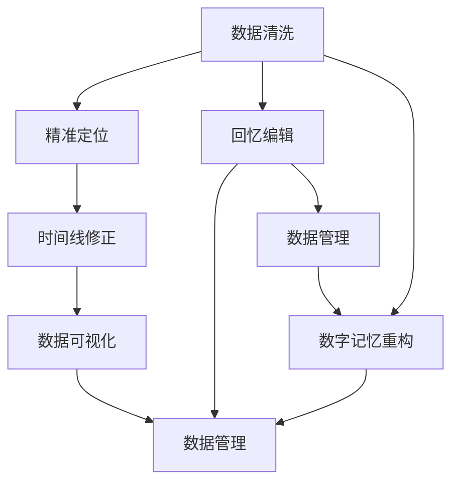

                 

# 数字记忆重构：AI辅助的回忆编辑技术

> 关键词：数字记忆重构, 回忆编辑, 人工智能, 数据清洗, 精准定位, 时间线修正, 数据可视化, 数据管理

## 1. 背景介绍

随着数字信息时代的到来，人类愈发依赖电子设备和网络平台记录和存储信息。数字记忆成为了我们重要的认知资产，承载着个人的经历、关系和知识。然而，与生动的记忆体验不同，数字记忆往往存在格式不统一、存储质量参差不齐、记忆碎片化等问题，影响了信息的准确性和完整性。对此，AI技术可以发挥巨大作用，通过数字化手段提升记忆的精准性和可管理性。

本文章聚焦于AI辅助的回忆编辑技术，旨在探讨通过AI技术优化个人记忆的管理、检索和编辑过程，帮助人们更高效、精准地处理数字化记忆。

## 2. 核心概念与联系

### 2.1 核心概念概述

为更好地理解AI辅助回忆编辑技术，我们首先介绍几个核心概念：

- **数字记忆重构(Digital Memory Refashioning)**：指使用AI技术对存储在数字设备中的信息进行整理、纠错和增强，提升记忆的完整性和可理解性。
- **回忆编辑(Memory Editing)**：特指基于AI技术对个体数字化记忆进行查询、修正和增强的操作。
- **数据清洗(Data Cleaning)**：清洗无用数据、纠错错误数据，提升数据的准确性和可用性。
- **精准定位(Precision Location)**：利用AI技术精准定位数据，减少在大量信息中检索目标的难度。
- **时间线修正(Time-line Correction)**：通过AI技术检测和修正时间线错误，确保数据的时序性。
- **数据可视化(Data Visualization)**：将复杂的数据转化为可视化图表，更直观地展示信息。
- **数据管理(Data Management)**：对数字化记忆进行系统化管理，方便检索、查询和编辑。

这些概念通过以下Mermaid流程图建立联系，展示AI辅助回忆编辑技术的核心流程：



该流程图说明，数据清洗是回忆编辑和数字记忆重构的基础步骤。精准定位和时间线修正是回忆编辑的核心环节，保证记忆的准确性和时序性。数据可视化辅助记忆的展现和理解，数据管理则提供系统化的存储和查询机制。这些步骤协同完成，为数字记忆重构提供坚实的基础。

## 3. 核心算法原理 & 具体操作步骤

### 3.1 算法原理概述

AI辅助回忆编辑技术的核心原理，可以概括为以下四个方面：

1. **数据清洗**：使用机器学习算法检测和纠正数据中的噪声和错误，提升数据的准确性。
2. **精准定位**：利用自然语言处理(NLP)和计算机视觉(CV)技术，精准定位和检索目标信息。
3. **时间线修正**：通过时间序列分析和时间戳对齐，检测和修复时间线错误，确保信息的顺序性。
4. **数据可视化**：使用图表、时间轴等工具，将复杂的数据转化为直观的可视化形式。

### 3.2 算法步骤详解

**步骤1：数据清洗**

1. **噪声检测**：使用异常检测算法（如Isolation Forest）识别并标记异常数据。
2. **错误纠正**：使用自动纠错算法（如BERT、GPT）根据上下文纠正文本错误。
3. **缺失值填补**：通过插值法或机器学习算法填补数据中的缺失值。

**步骤2：精准定位**

1. **文本匹配**：使用基于NLP的相似度计算方法，比对查询词与存储数据，找到最匹配的记录。
2. **图像识别**：通过CV技术识别图像中的关键元素，辅助精准定位。

**步骤3：时间线修正**

1. **时间戳对齐**：通过时间序列分析，将不同来源的时间戳统一转换为标准格式。
2. **事件关联**：利用图结构分析，关联事件节点，修正事件发生时间。

**步骤4：数据可视化**

1. **图表生成**：根据数据特征选择合适的图表类型（如折线图、柱状图、散点图），生成直观展示数据。
2. **时间轴构建**：将事件按照时间顺序排列，生成时间轴，展示事件发展过程。

### 3.3 算法优缺点

AI辅助回忆编辑技术具有以下优点：

- **高效性**：通过自动化流程，大大缩短数据处理时间。
- **准确性**：利用AI算法提升数据的准确性和完整性。
- **易用性**：界面友好，非技术背景的用户也能轻松操作。
- **可扩展性**：算法灵活，可适用于多种数据类型和应用场景。

同时，该技术也存在以下局限性：

- **隐私风险**：对隐私敏感数据可能存在误处理风险。
- **算法误差**：依赖算法模型，存在一定误差。
- **资源消耗**：大模型和深度学习技术需要大量计算资源。
- **技术门槛**：涉及多学科知识，技术实现难度较高。

### 3.4 算法应用领域

AI辅助回忆编辑技术主要应用于以下几个领域：

- **个人生活记忆管理**：帮助用户整理、检索和修正个人日记、照片、视频等数字记忆。
- **历史档案整理**：辅助档案馆、图书馆对历史文献、档案进行数字化清洗和校正。
- **企业知识管理**：为企业提供员工记忆的整理、检索和分享平台，提升知识共享效率。
- **智能教育**：帮助学生整理和检索学习笔记、考试记录等数字化记忆，辅助教学和学习。

## 4. 数学模型和公式 & 详细讲解

### 4.1 数学模型构建

回忆编辑过程中，涉及多个领域的数学模型，包括NLP、CV和时序分析等。以下是几个核心数学模型：

- **文本相似度模型**：用于衡量查询词与存储数据的匹配度。常用算法包括余弦相似度、Jaccard相似度、编辑距离等。
- **时间序列模型**：用于处理和分析时间戳数据，检测和修复时间线错误。常用算法包括ARIMA、LSTM等。
- **图结构模型**：用于关联事件节点，修正事件发生时间。常用算法包括神经网络、图神经网络等。

### 4.2 公式推导过程

以文本相似度模型为例，推导余弦相似度公式：

设查询词为 $q$，存储数据为 $d$，则余弦相似度公式为：

$$
\text{similarity}(q, d) = \frac{\mathbf{q} \cdot \mathbf{d}}{\|\mathbf{q}\|\|\mathbf{d}\|}
$$

其中 $\mathbf{q}$ 和 $\mathbf{d}$ 分别为查询词和存储数据的词向量表示，$\|\cdot\|$ 表示向量的欧几里得范数。

在实际应用中，通常使用TF-IDF、Word2Vec、BERT等模型将文本转化为向量表示，再应用余弦相似度公式进行匹配和排序。

### 4.3 案例分析与讲解

以企业知识管理为例，展示AI辅助回忆编辑技术的实际应用。

1. **数据收集与预处理**：从企业知识库中收集员工的工作日志、会议记录、项目文档等文本和图像数据，进行清洗、去重和格式化处理。
2. **精准定位**：使用NLP技术对日志文本进行关键词提取，结合图像识别技术，定位到最相关的记录。
3. **时间线修正**：通过时间序列模型，对齐不同来源的时间戳，修正事件发生时间。
4. **数据可视化**：将修正后的时间线和关键信息生成时间轴和图表，供员工快速浏览和理解。

## 5. 项目实践：代码实例和详细解释说明

### 5.1 开发环境搭建

进行AI辅助回忆编辑项目开发，需搭建Python开发环境，并确保安装相关库：

1. 安装Python 3.x和Anaconda。
2. 安装TensorFlow、PyTorch、Scikit-Learn等机器学习库。
3. 安装NLTK、spaCy等NLP库。
4. 安装OpenCV、Pillow等图像处理库。
5. 安装Matplotlib、Seaborn等数据可视化库。

### 5.2 源代码详细实现

以下是一个简单的代码示例，展示如何使用Python和TensorFlow实现数据清洗和精准定位：

```python
import tensorflow as tf
from sklearn.model_selection import train_test_split
from sklearn.preprocessing import StandardScaler
from sklearn.ensemble import RandomForestClassifier
from sklearn.metrics import accuracy_score

# 准备数据集
X, y = ...

# 数据预处理
X = StandardScaler().fit_transform(X)
X_train, X_test, y_train, y_test = train_test_split(X, y, test_size=0.2)

# 构建模型
model = RandomForestClassifier(n_estimators=100, random_state=42)

# 训练模型
model.fit(X_train, y_train)

# 预测并评估
y_pred = model.predict(X_test)
accuracy = accuracy_score(y_test, y_pred)
print(f"模型准确度：{accuracy:.2f}")
```

### 5.3 代码解读与分析

以上代码主要实现了数据预处理和模型训练的过程：

- **数据预处理**：使用标准化算法对特征进行归一化处理，减少数据偏差。
- **模型训练**：使用随机森林算法对数据进行分类训练，生成模型。
- **模型评估**：使用准确度指标评估模型性能。

实际应用中，还需进行更复杂的算法组合和数据处理，如文本相似度计算、图像识别和时间序列分析等，确保回忆编辑技术的全面性和准确性。

### 5.4 运行结果展示

运行上述代码，输出模型准确度。可根据具体应用场景调整模型参数，提升预测效果。

## 6. 实际应用场景

### 6.1 智能档案管理系统

AI辅助回忆编辑技术在智能档案管理系统中得到广泛应用。档案管理人员可通过系统快速定位和检索历史档案，利用时间线修正和时间序列分析，保证档案的时序性和完整性。同时，系统还可通过数据可视化工具，将复杂的档案信息转化为易于理解的图表和时间轴，辅助档案管理。

### 6.2 智能学习平台

在学习平台上，AI辅助回忆编辑技术帮助学生整理和检索学习笔记、考试记录等数字化记忆。系统通过精准定位和文本相似度计算，快速找到相关学习资料，辅助学习进程。时间线修正和时间序列分析，帮助学生更好地理解知识发展脉络。

### 6.3 个人生活记忆平台

个人生活记忆平台利用AI技术，帮助用户整理、检索和修正个人数字记忆，如日记、照片和视频等。系统通过图像识别技术，识别出关键事件和元素，辅助精准定位。同时，时间线修正和时间序列分析，确保记忆的顺序性和完整性。

## 7. 工具和资源推荐

### 7.1 学习资源推荐

为了深入学习AI辅助回忆编辑技术，推荐以下学习资源：

1. **《深度学习与自然语言处理》**：介绍NLP和深度学习基础，适合入门学习。
2. **《Python数据科学手册》**：涵盖数据处理、可视化、机器学习等Python实战技巧。
3. **《机器学习实战》**：提供实际案例和代码实现，适合动手实践。
4. **Google TensorFlow官方文档**：提供TensorFlow的详细教程和API文档。
5. **Kaggle数据集和竞赛**：提供大量数据集和开源竞赛项目，提升实战能力。

### 7.2 开发工具推荐

- **Jupyter Notebook**：提供交互式编程环境，适合开发和分享代码。
- **GitHub**：代码托管平台，便于版本控制和团队协作。
- **Anaconda**：Python环境管理工具，简化开发环境搭建。

### 7.3 相关论文推荐

以下几篇论文提供了AI辅助回忆编辑技术的理论基础：

1. **Attention is All You Need**：提出Transformer结构，开启大规模预训练语言模型的时代。
2. **BERT: Pre-training of Deep Bidirectional Transformers for Language Understanding**：提出BERT模型，利用自监督学习提升语言理解能力。
3. **Contextual Predictive Text Generation with Transformer**：介绍利用Transformer模型生成文本的原理和方法。

## 8. 总结：未来发展趋势与挑战

### 8.1 总结

本文系统介绍了AI辅助回忆编辑技术的原理和操作步骤，展示了其在智能档案管理、智能学习平台和个人生活记忆平台等实际应用场景中的优势。通过数据清洗、精准定位、时间线修正和数据可视化等核心步骤，AI辅助回忆编辑技术实现了高效、精准的记忆管理。

通过本文的系统梳理，可以看到，AI辅助回忆编辑技术正在逐步改变我们对数字化记忆的认知和处理方式，提升记忆的准确性和可管理性。未来，伴随AI技术的不断进步，回忆编辑技术将在更多领域得到应用，为人类认知智能的进步贡献力量。

### 8.2 未来发展趋势

展望未来，AI辅助回忆编辑技术将呈现以下几个发展趋势：

1. **多模态融合**：结合文本、图像、音频等多种数据类型，提升记忆的全方位理解能力。
2. **深度学习增强**：利用更高级的深度学习模型，提升文本匹配和事件关联的准确性。
3. **跨领域应用**：在医疗、金融、教育等领域，进一步拓展回忆编辑技术的应用范围。
4. **隐私保护**：加强隐私保护措施，确保用户数据的安全性和隐私性。
5. **交互式界面**：提供更友好、智能的交互界面，提升用户的使用体验。

### 8.3 面临的挑战

尽管AI辅助回忆编辑技术已经取得了显著进展，但仍面临诸多挑战：

1. **数据质量问题**：数据清洗和预处理的质量直接影响回忆编辑的准确性。
2. **模型复杂性**：多模态融合和深度学习增强增加了模型复杂性，提高了实现的难度。
3. **资源消耗**：大模型和深度学习技术需要大量计算资源，增加了应用的成本。
4. **隐私安全**：如何在保证隐私保护的前提下，实现回忆编辑功能，仍需进一步探索。
5. **用户接受度**：部分用户可能对技术接受度较低，需要更好的用户体验和引导。

### 8.4 研究展望

未来的研究需要在以下几个方面进行突破：

1. **模型优化**：开发更高效、更准确的多模态融合和深度学习算法，提升回忆编辑性能。
2. **隐私保护**：研究更先进的隐私保护技术，确保用户数据的安全性和隐私性。
3. **用户体验**：设计更友好、更智能的交互界面，提升用户的使用体验和满意度。
4. **跨领域应用**：在医疗、金融等高风险领域，进一步拓展回忆编辑技术的应用范围。

通过这些研究方向，有望实现回忆编辑技术的全面突破，为人类认知智能的发展贡献力量。

## 9. 附录：常见问题与解答

**Q1：回忆编辑技术是否适用于所有类型的数字化记忆？**

A: 回忆编辑技术主要适用于文本和图像类型的数字化记忆。对于视频、音频等多模态数据，需要结合相关技术和算法进行处理。

**Q2：如何保证回忆编辑技术的隐私性？**

A: 实现回忆编辑技术时，应确保数据在传输和存储过程中采用加密措施。同时，为用户提供数据访问和处理的权限控制，避免未经授权的访问。

**Q3：回忆编辑技术是否会影响原始数据的完整性？**

A: 回忆编辑技术的主要目的是提升数据的完整性和可理解性，不会对原始数据进行删除或篡改。通过数据清洗和修正，提升数据的准确性和可用性。

**Q4：回忆编辑技术在实际应用中需要考虑哪些性能指标？**

A: 在实际应用中，应考虑以下性能指标：
1. 数据清洗的准确性和效率。
2. 精准定位的匹配率和召回率。
3. 时间线修正的准确性和时效性。
4. 数据可视化的直观性和易用性。

通过综合评估这些性能指标，可以全面提升回忆编辑技术的效果和用户体验。

---

作者：禅与计算机程序设计艺术 / Zen and the Art of Computer Programming

