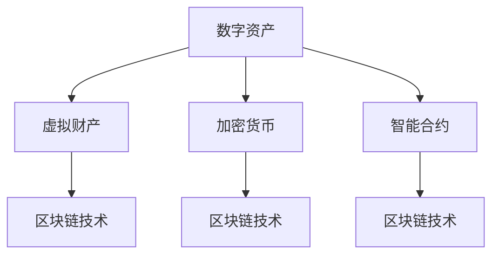

                 

# 数字资产创业：虚拟财产的价值挖掘

> 关键词：数字资产，虚拟财产，区块链技术，加密货币，智能合约，去中心化，金融创新

## 1. 背景介绍

### 1.1 问题由来
数字资产和虚拟财产作为一种新型的金融资产形式，其价值挖掘和利用已经成为全球金融创新与科技发展的热门话题。与传统的物理资产不同，数字资产和虚拟财产完全依赖于区块链和加密技术，它们具有去中心化、安全透明、难以篡改等特性，使得其应用范围和潜力得到了极大的扩展。然而，这一新兴领域同时也面临技术瓶颈、监管困境、市场波动等多重挑战。

数字资产创业不仅意味着创业公司的成功，更代表着一种新的经济形态的崛起。传统金融体系中，实物资产的转移往往需要中介机构，如银行、证券交易所等，而数字资产的转移则可以更加便捷、高效，降低了金融服务的门槛，为更多人提供了获取财富的机会。

### 1.2 问题核心关键点
本节的目的是介绍数字资产创业的基础理论、核心概念以及其在实践中的应用，以便创业者能够全面了解数字资产创业的风险与机遇，明确发展方向。

## 2. 核心概念与联系

### 2.1 核心概念概述

为更好地理解数字资产创业，本节将介绍几个关键概念：

- **数字资产（Digital Assets）**：指以加密技术为核心的新型金融资产，包括加密货币、代币、智能合约等。其本质是数字化的权益证明，可以在区块链网络上自由交易。
- **虚拟财产（Virtual Property）**：指在数字世界中具有所有权、使用权和交换价值的财产，如数字货币、数字艺术品等。虚拟财产的交换和所有权可以通过区块链技术来实现。
- **区块链技术（Blockchain Technology）**：基于去中心化的分布式账本技术，能够实现数据的安全存储和透明共享。区块链的不可篡改特性保证了数字资产和虚拟财产的安全性和可靠性。
- **加密货币（Cryptocurrencies）**：基于区块链技术的虚拟货币，如比特币（Bitcoin）、以太坊（Ethereum）等。它们用于交换价值和存储信息，是数字资产的重要形式。
- **智能合约（Smart Contracts）**：基于区块链技术的自动化合约，能够自动执行合约条款，减少中介成本，提高交易效率。

这些核心概念之间的关系可以通过以下Mermaid流程图来展示：



这个流程图展示了数字资产、虚拟财产与区块链技术、加密货币和智能合约之间的联系，它们共同构成了数字资产生态系统。

## 3. 核心算法原理 & 具体操作步骤

### 3.1 算法原理概述

数字资产创业的核心算法和操作步骤主要围绕区块链技术和智能合约展开。其基本原理是利用区块链的不可篡改特性和智能合约的自动执行功能，实现数字资产的可靠交易和高效管理。

### 3.2 算法步骤详解

数字资产创业的具体操作步骤可以分为以下几个阶段：

**阶段1：项目构思与规划**
- 定义项目目标：明确数字资产的功能和应用场景，如数字货币、去中心化交易所、数字资产管理等。
- 评估市场需求：分析目标市场的规模、用户需求和潜在竞争者。
- 制定项目计划：确定项目的时间表、预算和资源配置。

**阶段2：技术实现**
- 选择合适的区块链平台：根据项目需求选择适合的技术栈，如以太坊、比特币等。
- 设计智能合约：定义智能合约的逻辑和功能，编写智能合约代码。
- 测试与优化：在测试网络上测试智能合约，验证其正确性和安全性，并进行必要的优化。

**阶段3：项目上线与运营**
- 部署智能合约：将智能合约部署到主网，并完成项目的初始化。
- 用户体验优化：提升用户体验，增加用户黏性，如改进交易界面、提高交易速度等。
- 市场推广：通过多种渠道推广项目，吸引用户使用，扩大市场份额。

### 3.3 算法优缺点

数字资产创业的算法具有以下优点：
1. **去中心化**：基于区块链技术，减少了中介机构，降低了交易成本。
2. **透明性**：区块链上的数据公开透明，增加了信任度。
3. **安全性**：区块链和加密技术保证了资产的安全性和不可篡改性。
4. **高效性**：智能合约的自动执行提高了交易效率，减少了中介成本。

同时，数字资产创业也面临以下缺点：
1. **技术门槛高**：需要深厚的区块链和加密技术知识，难以快速入门。
2. **监管不确定**：各国的监管政策不一致，增加了项目的合规难度。
3. **市场波动大**：数字资产价格波动大，风险较高。
4. **开发成本高**：区块链技术开发成本较高，需要投入大量的人力和财力。

### 3.4 算法应用领域

数字资产创业在多个领域具有广泛的应用前景：

- **数字货币**：如比特币、以太坊等，用于交换价值和存储信息。
- **去中心化交易所（DEX）**：如Uniswap、SushiSwap等，提供无中介的资产交易平台。
- **数字资产管理**：如Compound、Aave等，提供去中心化的借贷和资产管理服务。
- **供应链金融**：如IBM的Walmart区块链供应链项目，通过智能合约实现供应链融资。
- **数字艺术品**：如Rarible、Foundation等，提供去中心化的数字艺术品交易平台。

## 4. 数学模型和公式 & 详细讲解 & 举例说明

### 4.1 数学模型构建

在数字资产创业中，数学模型的构建主要是围绕加密算法、智能合约逻辑和市场分析展开。以智能合约为例，其数学模型构建主要包括以下几个方面：

- **交易逻辑模型**：定义交易的逻辑规则，如买卖双方、成交价格、手续费等。
- **加密算法模型**：使用加密技术保证交易的安全性和不可篡改性，如哈希函数、数字签名等。
- **分布式账本模型**：定义区块链网络中的数据存储和传输规则，如区块生成、共识机制等。

### 4.2 公式推导过程

以智能合约中的数字签名为例，其数学模型推导过程如下：

- 设交易双方的公钥分别为 $PK_A$ 和 $PK_B$，私钥分别为 $SK_A$ 和 $SK_B$。
- 设交易信息为 $M$，通过哈希函数生成摘要 $H(M)$。
- 甲方使用私钥 $SK_A$ 对 $H(M)$ 进行加密，生成数字签名 $Sig_A=SK_A(H(M))$。
- 乙方通过公钥 $PK_A$ 验证数字签名 $Sig_A$，确认其合法性。

这个过程中，数字签名保证了交易信息的完整性和不可篡改性，确保了交易的安全性。

### 4.3 案例分析与讲解

以以太坊智能合约为例，其核心逻辑如下：

```python
def transfer(_from, _to, _value):
    if address(_to) == address(_from):
        raise Exception("Transfer to self")
    if address(_from) == address(0):
        raise Exception("Invalid sender address")
    if address(_to) == address(0):
        raise Exception("Invalid receiver address")
    if _value > 0:
        balance(_from) -= _value
        balance(_to) += _value
        emit("Transfer(_from,_to,_amount)")
```

这个智能合约实现了一个简单的资产转移功能，在接收方地址不为空的情况下，将资产从发件人地址转移到收件人地址，并记录交易日志。

## 5. 项目实践：代码实例和详细解释说明

### 5.1 开发环境搭建

在进行数字资产创业的项目实践前，我们需要准备好开发环境。以下是使用Python进行Solidity开发的环境配置流程：

1. 安装Node.js：从官网下载并安装Node.js，用于编写和管理智能合约代码。
2. 安装Truffle：从官网下载并安装Truffle，用于管理智能合约和部署环境。
3. 创建项目文件夹：创建一个新的项目文件夹，用于存放智能合约代码和配置文件。
4. 配置开发环境：在项目文件夹中，创建一个`.truffle-config.js`文件，配置Truffle开发环境。

### 5.2 源代码详细实现

下面以以太坊智能合约为例，给出使用Solidity进行数字资产创业的Pytho

```python
# 智能合约代码
contract TransferableToken {
    uint256 public totalSupply;
    uint256 balances[address[]];
    uint256 decimals;
    event Transfer(address indexed from, address indexed to, uint256 value);

    constructor(uint256 initialSupply) {
        totalSupply = initialSupply;
        decimals = 18;
        balances[msg.sender] = totalSupply;
    }

    function balanceOf(address account) public view returns (uint256 balance) {
        return balances[account];
    }

    function transfer(address receiver, uint256 amount) public returns (bool success) {
        require(amount > 0);
        require(balances[msg.sender] >= amount);
        balances[msg.sender] -= amount;
        balances[receiver] += amount;
        emit Transfer(msg.sender, receiver, amount);
        return true;
    }
}
```

这段代码定义了一个基于以太坊的智能合约，实现了资产转移功能。

### 5.3 代码解读与分析

以下是代码中关键部分的解读：

**constructor函数**：定义智能合约的初始状态，包括总供给量、持有者余额和精度。

**balanceOf函数**：用于查询一个地址的资产余额。

**transfer函数**：实现资产转移功能，将资产从发件人地址转移到收件人地址，并记录交易日志。

**事件（Event）**：用于记录交易信息，方便后续查询和分析。

### 5.4 运行结果展示

通过上述智能合约的部署和测试，可以验证其功能正确性，例如：

- 测试发件人地址为0或收件人地址为0的交易是否被拒绝。
- 测试资产转移是否成功，并记录交易日志。
- 测试查询资产余额是否正确。

## 6. 实际应用场景

### 6.1 智能合约平台

数字资产创业在智能合约平台上的应用最为广泛。以太坊、TRON等区块链平台都提供了智能合约的开发和部署环境，支持各种智能合约的实现。智能合约平台不仅提供了去中心化的交易服务，还支持各类金融衍生品、去中心化应用（DApp）的开发。

### 6.2 数字货币交易所

数字资产创业在数字货币交易所上的应用也具有重要意义。去中心化交易所（DEX）通过智能合约实现交易，具有高安全性、低手续费等优势。Uniswap、SushiSwap等平台已经成为了DeFi生态系统的重要组成部分。

### 6.3 供应链金融

数字资产创业在供应链金融上的应用可以大大降低供应链融资的成本和风险。通过智能合约的自动执行，可以实现供应链融资的自动化管理和风险控制，提高供应链的透明度和效率。

### 6.4 未来应用展望

随着区块链技术和数字资产的不断发展，数字资产创业将迎来更多新的应用场景：

- **身份认证**：基于区块链的数字身份认证系统，提高身份认证的安全性和可信度。
- **资产托管**：去中心化的资产托管系统，提供更加安全和高效的多资产管理服务。
- **数字身份经济**：基于区块链的数字身份经济，如数字身份认证、数字身份交易等。

## 7. 工具和资源推荐

### 7.1 学习资源推荐

为了帮助开发者系统掌握数字资产创业的理论基础和实践技巧，这里推荐一些优质的学习资源：

1. 《Blockchain Basics》课程：由比特币基金会提供，介绍了区块链的基本原理和技术实现。
2. 《Ethereum Yellow Paper》：以太坊官方白皮书，详细介绍了以太坊的技术架构和智能合约开发。
3. 《Solidity Smart Contracts》书籍：由Mikhail Kalinin所著，深入浅出地介绍了Solidity智能合约的开发和应用。
4. OpenZeppelin智能合约库：提供了大量的智能合约模板和最佳实践，是开发智能合约的重要工具。
5. ConsenSys Academy：提供丰富的区块链开发和智能合约课程，涵盖从入门到进阶的全方面内容。

通过对这些资源的学习实践，相信你一定能够快速掌握数字资产创业的精髓，并用于解决实际的区块链问题。

### 7.2 开发工具推荐

高效的开发离不开优秀的工具支持。以下是几款用于数字资产创业开发的常用工具：

1. MetaMask：以太坊官方钱包，支持数字资产的存储和管理，并提供了去中心化应用（DApp）的开发环境。
2. Truffle：用于管理智能合约和部署环境的框架，支持智能合约的开发、测试和部署。
3. Remix：以太坊官方开发工具，提供了交互式的开发环境，支持智能合约的调试和测试。
4. Infura：提供以太坊节点服务，支持智能合约的测试和部署。
5. Meta blockchain explorer：提供以太坊区块链的查询服务，方便开发者验证智能合约的执行结果。

合理利用这些工具，可以显著提升数字资产创业任务的开发效率，加快创新迭代的步伐。

### 7.3 相关论文推荐

数字资产创业在学术界的持续研究中不断进步。以下是几篇奠基性的相关论文，推荐阅读：

1. Nakamoto, S. (2008). Bitcoin: A Peer-to-Peer Electronic Cash System.
2. Di Mari, M., & Kim, J. (2018). Blockchain-based smart contracts: a new contract paradigm.
3. Buterin, V. (2013). A next-generation smart contract and decentralized application platform.
4. Swaminathan, N., & Hiltunen, T. (2018). Blockchain-based supply chain finance: opportunities and challenges.
5. Buys, E., Chinnam, J., & Grime, G. (2016). Smart contracts: an overview and survey.

这些论文代表了大规模数字资产创业的理论发展脉络。通过学习这些前沿成果，可以帮助研究者把握学科前进方向，激发更多的创新灵感。

## 8. 总结：未来发展趋势与挑战

### 8.1 总结

本文对数字资产创业的基础理论、核心概念以及其在实践中的应用进行了全面系统的介绍。首先阐述了数字资产创业的背景和意义，明确了数字资产创业的风险与机遇，提出了发展方向。其次，从原理到实践，详细讲解了数字资产创业的数学模型和操作步骤，给出了智能合约开发的具体代码实现。同时，本文还探讨了数字资产创业在智能合约平台、数字货币交易所、供应链金融等多个领域的应用前景，展示了数字资产创业的广阔潜力。

通过本文的系统梳理，可以看到，数字资产创业为金融创新和科技发展开辟了新的道路，数字资产和虚拟财产的价值被进一步挖掘。面向未来，数字资产创业需要不断优化技术、拓展应用，才能更好地服务于社会和经济发展。

### 8.2 未来发展趋势

展望未来，数字资产创业将呈现以下几个发展趋势：

1. **跨链技术**：随着跨链技术的不断成熟，数字资产将能够在不同区块链平台之间自由流通，增加其应用范围和流动性。
2. **去中心化身份认证**：基于区块链的去中心化身份认证系统将逐步普及，提高身份认证的安全性和可信度。
3. **数字身份经济**：基于区块链的数字身份经济将逐步发展，提供更加安全和便捷的身份服务。
4. **DeFi生态系统**：DeFi（去中心化金融）生态系统将不断扩展，提供更多的金融服务和应用场景。
5. **数字资产标准化**：数字资产的标准化将逐步实现，提高数字资产的互操作性和可接受性。

以上趋势凸显了数字资产创业的广阔前景，其应用范围和技术手段将不断拓展，为金融创新和科技发展带来新的机遇和挑战。

### 8.3 面临的挑战

尽管数字资产创业已经取得了一定的进展，但在迈向更加智能化、普适化应用的过程中，仍然面临诸多挑战：

1. **技术瓶颈**：区块链技术和智能合约开发需要深厚的技术知识，开发成本较高，且容易遇到技术难题。
2. **市场竞争**：数字资产创业领域竞争激烈，如何突出自身的独特优势，吸引用户和投资者，需要不断创新和优化。
3. **监管风险**：各国的监管政策不一致，增加了项目的合规难度，可能导致法律风险。
4. **市场波动**：数字资产价格波动大，风险较高，容易受到市场波动的影响。
5. **安全问题**：智能合约中的安全漏洞和攻击手段不断更新，如何保障数字资产的安全性和可靠性，需要持续关注和应对。

这些挑战需要数字资产创业者和研究者共同努力，不断优化技术、改进治理结构、加强监管合规，才能实现数字资产创业的可持续发展。

### 8.4 研究展望

面对数字资产创业所面临的挑战，未来的研究需要在以下几个方面寻求新的突破：

1. **跨链互操作**：开发跨链协议和互操作技术，实现不同区块链平台之间的数据和资产自由流通。
2. **智能合约安全**：加强智能合约的安全性分析，开发防篡改、防攻击的智能合约技术。
3. **数字身份标准**：制定数字身份的标准和规范，提高数字身份的互操作性和可信度。
4. **去中心化治理**：开发去中心化的治理机制，提高项目的透明性和社区参与度。
5. **区块链融合**：将区块链技术与更多领域的技术进行融合，拓展数字资产的应用范围和深度。

这些研究方向的探索，必将引领数字资产创业技术迈向更高的台阶，为构建更加安全和可信赖的数字资产生态系统铺平道路。

## 9. 附录：常见问题与解答

**Q1：数字资产创业是否适用于所有行业？**

A: 数字资产创业适用于具有数字化、信息化需求的行业，如金融、供应链、数字娱乐等。但并不是所有行业都适合采用数字资产创业模式，需要根据具体情况进行评估。

**Q2：数字资产创业的初期投入有多大？**

A: 数字资产创业的初期投入包括技术研发、市场推广、团队建设等多个方面。具体投入大小取决于项目规模和需求，通常在数百万到数千万美元之间。

**Q3：数字资产创业的风险和回报如何？**

A: 数字资产创业的风险较高，但回报潜力大。成功的数字资产创业项目可能实现数十倍的收益，但也可能面临项目失败的风险。需要谨慎评估风险和回报，制定合理的投资策略。

**Q4：数字资产创业需要哪些技术知识？**

A: 数字资产创业需要深厚的区块链和智能合约开发技术，同时还需要了解金融、法律、市场分析等多方面的知识。推荐通过学习相关课程和阅读专业书籍，全面掌握数字资产创业所需的知识。

**Q5：数字资产创业的商业模式有哪些？**

A: 数字资产创业的商业模式包括去中心化交易所、数字资产管理、供应链金融等。每个模式都有其独特的应用场景和发展前景，需要根据具体项目需求进行选择。

作者：禅与计算机程序设计艺术 / Zen and the Art of Computer Programming

