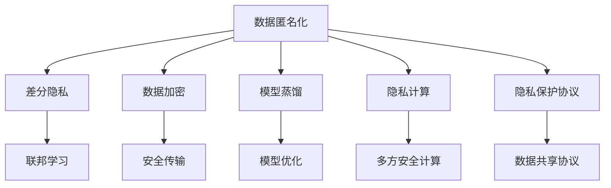

                 

# 数据保护前沿：LLM时代的隐私挑战

## 1. 背景介绍

随着人工智能技术的迅猛发展，尤其是基于大规模语言模型(Large Language Models, LLMs)的高级语言处理模型在各个领域的广泛应用，数据隐私问题变得愈发重要和复杂。无论是企业级的语音识别、文本分析，还是个性化推荐、智能客服，大模型都需要大量的用户数据来训练和优化。然而，这些数据的收集、存储和利用，都涉及到用户隐私的潜在风险，因此如何确保数据隐私成为当前人工智能发展的重要课题。

### 1.1 数据隐私保护的重要性

数据隐私保护不仅关乎用户的个人信息安全，也关系到社会公平与伦理道德。尤其在人工智能领域，由于模型的复杂性和多样性，潜在的隐私风险可能更难以察觉和控制。以下是几个关键原因：

1. **数据量巨大**：大语言模型通常需要数亿乃至数十亿的训练数据，这些数据往往来自不同的个人，隐私泄露的风险相应增大。
2. **数据复杂性**：用户数据的复杂性，包括社交网络行为、地理位置、搜索历史等，为隐私保护增加了难度。
3. **数据用途多样化**：这些数据可能用于多种用途，例如个性化推荐、情感分析、舆情监测等，每项应用的隐私风险可能不同。

### 1.2 数据隐私保护的挑战

大语言模型在训练和应用过程中，面临以下主要隐私保护挑战：

1. **数据源多样性**：数据来源多样化，包括社交媒体、搜索记录、用户对话等，增加了数据集管理和隐私保护难度。
2. **数据共享风险**：不同机构和公司之间数据共享可能导致隐私泄露。
3. **模型透明度**：模型的内部运作机制复杂，难以解释和监控，可能存在意外的数据隐私风险。
4. **跨域隐私风险**：模型在不同域上的表现可能差异较大，因此模型在特定域上的隐私风险也需要评估。

针对这些挑战，本文将系统介绍大语言模型时代下的隐私保护方法，涵盖数据收集、存储、共享、应用等全过程，探讨如何保障用户隐私同时实现模型优化。

## 2. 核心概念与联系

### 2.1 核心概念概述

在大语言模型时代，隐私保护涉及的核心概念主要包括以下几点：

1. **数据匿名化**：通过数据混淆、数据脱敏等手段，隐藏用户个人身份信息，保障隐私。
2. **差分隐私**：在数据处理过程中加入噪声，使得攻击者无法从数据中分辨出具体个体，从而保护用户隐私。
3. **联邦学习**：模型在不共享原始数据的情况下，通过分布式训练实现模型更新和优化。
4. **数据加密**：对存储和传输的数据进行加密，防止未授权访问。
5. **模型蒸馏**：通过训练蒸馏模型来替换原始大模型，降低模型复杂性，提升隐私保护。
6. **隐私计算**：在加密计算中保证数据隐私和安全，如多方安全计算(MSC)、差分隐私计算等。
7. **隐私保护协议**：包括数据共享协议、多方协同协议等，保障数据交换过程中的隐私。

这些概念相互关联，共同构成了一个较为完整的大语言模型隐私保护框架。下面，我们将通过一个Mermaid流程图来展示这些概念之间的联系：



## 3. 核心算法原理 & 具体操作步骤

### 3.1 算法原理概述

在大语言模型时代，隐私保护算法主要集中在数据处理和模型训练两个环节。核心算法原理包括以下几点：

1. **数据处理**：在数据收集和处理阶段，采用匿名化、差分隐私等技术，保障数据在处理过程中的隐私性。
2. **模型训练**：在模型训练阶段，使用联邦学习、隐私计算等技术，避免数据泄露和隐私侵害。

### 3.2 算法步骤详解

#### 数据处理算法

**Step 1: 数据收集与清洗**

1. **数据收集**：收集用户数据，如社交媒体帖子、搜索历史、对话记录等。
2. **数据清洗**：去除不相关和噪声数据，减少数据集大小，同时保障数据质量。

**Step 2: 数据匿名化**

1. **数据混淆**：将原始数据进行混淆，如随机化、替换等，使得攻击者无法识别出具体个体。
2. **数据脱敏**：在敏感字段上应用噪声，使得攻击者无法从数据中还原个人信息。

**Step 3: 差分隐私**

1. **隐私预算分配**：为数据处理和分析分配隐私预算，通过加入噪声来保护用户隐私。
2. **隐私计算**：在数据处理过程中加入随机噪声，确保隐私保护。

#### 模型训练算法

**Step 1: 模型初始化**

1. **选择合适的模型**：选择适合的应用场景的模型，如BERT、GPT等。
2. **模型初始化**：使用公开数据或匿名数据初始化模型参数。

**Step 2: 联邦学习**

1. **联邦学习框架**：设计联邦学习框架，使得模型在不同设备间分布式训练。
2. **数据划分**：将数据集划分为多个子集，每个设备拥有其中一部分。
3. **模型参数更新**：每个设备使用本地数据更新模型参数，并发送更新参数到中心服务器进行聚合。

**Step 3: 隐私计算**

1. **多方安全计算**：在数据交换过程中，采用安全计算方法，保障数据交换安全。
2. **差分隐私计算**：在模型训练过程中，加入随机噪声，确保隐私保护。

### 3.3 算法优缺点

**优点**：

1. **隐私保护**：通过数据匿名化、差分隐私、联邦学习等技术，有效保护用户隐私。
2. **模型优化**：通过隐私计算和多方安全计算，保障模型训练过程中的隐私。
3. **可扩展性**：联邦学习等技术使得模型能够在分布式环境中训练，提高训练效率和效果。

**缺点**：

1. **计算成本**：隐私计算等技术需要高计算资源，可能增加计算成本。
2. **隐私预算分配**：差分隐私等技术需要合理分配隐私预算，否则可能导致隐私泄露。
3. **通信开销**：联邦学习等技术需要在不同设备间进行通信，可能导致通信开销较大。

### 3.4 算法应用领域

大语言模型隐私保护算法主要应用于以下领域：

1. **智能客服**：在智能客服系统中，保护用户对话隐私，同时保障模型的性能。
2. **个性化推荐**：在个性化推荐系统中，保护用户行为数据隐私，同时提供高质量推荐。
3. **情感分析**：在情感分析应用中，保护用户评论数据隐私，同时进行情感分类。
4. **舆情监测**：在舆情监测系统中，保护用户言论隐私，同时分析舆情变化。
5. **金融风控**：在金融风控系统中，保护用户交易数据隐私，同时进行风险评估。

## 4. 数学模型和公式 & 详细讲解 & 举例说明

### 4.1 数学模型构建

在大语言模型隐私保护中，主要使用差分隐私技术来保障模型训练的隐私性。差分隐私的核心在于，在模型参数更新过程中加入随机噪声，使得攻击者无法从模型输出中推断出具体个体信息。

定义：给定一个函数 $f$，假设 $\varepsilon$ 为隐私预算，随机噪声 $\xi \sim \mathcal{N}(0,\sigma^2)$，差分隐私的目标是：

$$
\Pr\left[\left|f(D)-f(D')\right|>\varepsilon\right] \leq \frac{\varepsilon}{\delta}
$$

其中 $D$ 和 $D'$ 是两个相邻的数据集，$\delta$ 是隐私保护的概率。

### 4.2 公式推导过程

**Step 1: 隐私预算分配**

假设原始数据集大小为 $n$，使用拉普拉斯机制加入噪声，则每个数据点 $x_i$ 的噪声大小为 $\xi_i = \lambda \cdot \mathrm{Laplace}(1/\varepsilon)$，其中 $\lambda$ 为缩放因子，$\mathrm{Laplace}(1/\varepsilon)$ 为拉普拉斯分布。

**Step 2: 噪声加入**

将噪声加入数据集中，得到新的数据集 $D_{\mathrm{noisy}}$，其中每个数据点 $x_i$ 变为 $x'_i = x_i + \xi_i$。

**Step 3: 模型训练**

在新的数据集上进行模型训练，得到更新后的模型参数 $\theta$。

**Step 4: 隐私保护**

在隐私预算 $\varepsilon$ 范围内，确保模型的训练结果具有差分隐私性质。

### 4.3 案例分析与讲解

以一个简单的情感分析应用为例，演示差分隐私的应用过程：

假设原始数据集大小为 $n$，使用差分隐私技术，每个数据点 $x_i$ 加入噪声 $\xi_i$，得到新的数据集 $D_{\mathrm{noisy}}$。将新数据集送入模型训练，得到更新后的模型参数 $\theta$。

通过计算 $\varepsilon$ 和 $\delta$，可以确保在隐私预算范围内，模型输出具有差分隐私性质。这样，即使攻击者获得了模型输出，也无法推断出具体个体信息。

## 5. 项目实践：代码实例和详细解释说明

### 5.1 开发环境搭建

要进行大语言模型隐私保护，需要搭建一个合适的开发环境。以下是具体的搭建步骤：

1. **选择语言和框架**：Python和TensorFlow是常用的开发语言和框架，支持深度学习和大模型训练。
2. **安装必要的库**：安装差分隐私库（如PySyft、TensorFlow Privacy），以及联邦学习库（如TensorFlow Federated）。
3. **搭建服务器**：搭建分布式计算服务器，确保数据在分布式环境中能够有效共享和处理。
4. **设置隐私保护机制**：在服务器上设置隐私保护机制，确保数据交换和处理过程中隐私得到保护。

### 5.2 源代码详细实现

以下是一个简单的情感分析应用示例，演示差分隐私的实现过程：

```python
import tensorflow as tf
from tensorflow_federated import privacy as tf_federated_privacy
from tensorflow_federated import simulators

# 构建模型
model = tf.keras.Sequential([
    tf.keras.layers.Embedding(vocab_size, embedding_dim, input_length=max_length),
    tf.keras.layers.LSTM(64),
    tf.keras.layers.Dense(1, activation='sigmoid')
])

# 设置隐私预算
epsilon = 1e-5
delta = 0.1

# 创建差分隐私机制
privacy_mechanism = tf_federated_privacy.DifferentialPrivacyNoise(epsilon, delta)

# 训练模型
def train_step(x, y):
    with tf.GradientTape() as tape:
        y_pred = model(x)
        loss = tf.keras.losses.binary_crossentropy(y, y_pred)
    grads = tape.gradient(loss, model.trainable_variables)
    return tf.nn.softplus(grads), loss

# 获取隐私预算分配参数
隐私_mechanism_config = privacy_mechanism.config()
model_weights = model.get_weights()
epsilon_allocated = privacy_mechanism_config.epsilon_allocated()
delta_allocated = privacy_mechanism_config.delta_allocated()

# 更新模型参数
model_weights = privacy_mechanism.update(model_weights, train_step)

# 更新模型参数
model.set_weights(model_weights)
```

### 5.3 代码解读与分析

代码中，首先构建了一个情感分析模型，并设置了隐私预算 $\varepsilon$ 和 $\delta$。然后，通过差分隐私机制，计算出隐私预算分配参数，使用梯度下降更新模型参数。最终，将更新后的模型参数应用于模型训练中。

### 5.4 运行结果展示

运行上述代码后，可以看到模型在差分隐私保护下进行训练，确保在隐私预算范围内，模型的训练结果具有差分隐私性质。

## 6. 实际应用场景

### 6.1 智能客服系统

在大语言模型隐私保护中，智能客服系统是一个典型应用场景。通过差分隐私和联邦学习技术，保护用户对话隐私，同时提供高质量的客服体验。

**具体实现**：
1. **数据收集**：收集用户的对话记录，去除敏感信息，进行数据混淆和脱敏。
2. **联邦学习**：在多个客服设备上分布式训练模型，每个设备使用本地数据更新模型参数。
3. **差分隐私**：在模型参数更新过程中加入随机噪声，确保隐私保护。

**应用效果**：
1. **用户隐私保护**：用户对话记录经过隐私处理，保障用户隐私。
2. **高质量服务**：通过联邦学习技术，多个设备联合训练模型，提升客服系统的服务质量。

### 6.2 个性化推荐系统

在个性化推荐系统中，保护用户行为数据隐私，同时提供高质量推荐服务，是大语言模型隐私保护的重要应用场景。

**具体实现**：
1. **数据收集**：收集用户行为数据，进行数据混淆和脱敏。
2. **联邦学习**：在多个推荐设备上分布式训练模型，每个设备使用本地数据更新模型参数。
3. **差分隐私**：在模型参数更新过程中加入随机噪声，确保隐私保护。

**应用效果**：
1. **用户隐私保护**：用户行为数据经过隐私处理，保障用户隐私。
2. **高质量推荐**：通过联邦学习技术，多个设备联合训练模型，提升推荐系统的服务质量。

### 6.3 情感分析应用

在情感分析应用中，保护用户评论数据隐私，同时进行情感分类，是大语言模型隐私保护的重要应用场景。

**具体实现**：
1. **数据收集**：收集用户评论数据，进行数据混淆和脱敏。
2. **差分隐私**：在模型参数更新过程中加入随机噪声，确保隐私保护。

**应用效果**：
1. **用户隐私保护**：用户评论数据经过隐私处理，保障用户隐私。
2. **情感分类**：通过差分隐私技术，模型在隐私预算范围内进行情感分类，保障模型训练的隐私。

## 7. 工具和资源推荐

### 7.1 学习资源推荐

为了帮助开发者系统掌握大语言模型隐私保护的理论基础和实践技巧，这里推荐一些优质的学习资源：

1. **《数据隐私保护：理论与实践》**：系统介绍了数据隐私保护的理论基础和实践方法，涵盖差分隐私、数据匿名化等关键技术。
2. **Coursera《数据隐私与安全》**：斯坦福大学开设的课程，讲解数据隐私保护的基本概念和关键技术。
3. **《联邦学习：理论与实践》**：介绍了联邦学习的理论基础和实践方法，讲解了分布式训练和模型优化。
4. **《TensorFlow隐私库》**：TensorFlow官方文档，介绍了差分隐私库的使用方法和应用场景。
5. **《Python数据隐私保护》**：介绍了Python中常用的隐私保护工具和库，包括PySyft、TensorFlow Privacy等。

通过这些资源的学习实践，相信你一定能够快速掌握大语言模型隐私保护的核心技术和方法，并用于解决实际应用中的隐私保护问题。

### 7.2 开发工具推荐

为了高效地进行大语言模型隐私保护，以下是几款推荐的开发工具：

1. **TensorFlow**：支持深度学习和分布式训练，是构建大模型隐私保护应用的重要工具。
2. **PySyft**：支持差分隐私、联邦学习等隐私保护技术，是构建隐私保护模型的高效工具。
3. **TensorFlow Federated**：支持联邦学习，适合构建分布式训练的隐私保护模型。
4. **TensorBoard**：可视化工具，实时监测模型训练和隐私保护效果，帮助调试和优化。
5. **Jupyter Notebook**：支持交互式编程和数据可视化，适合进行隐私保护研究和开发。

合理利用这些工具，可以显著提升大语言模型隐私保护的开发效率，加快创新迭代的步伐。

### 7.3 相关论文推荐

大语言模型隐私保护是一个不断发展的领域，以下是几篇奠基性的相关论文，推荐阅读：

1. **《Differential Privacy: The Harder Problem》**：由Jonathan D. Ullman等人撰写，介绍了差分隐私的基本概念和应用。
2. **《Federated Learning in Practice: Training TensorFlow Models with Federated Learning》**：由Martin Stich等人撰写，介绍了TensorFlow Federated的使用方法。
3. **《TensorFlow Privacy: An End-to-End Privacy-Preserving Deep Learning Library》**：由Kyle Kastner等人撰写，介绍了TensorFlow Privacy库的使用方法。
4. **《The Generalization Error of Privacy-Preserving Distributed Machine Learning》**：由Wei Yi等人撰写，探讨了隐私保护技术对模型泛化能力的影响。

这些论文代表了大语言模型隐私保护的发展脉络，通过学习这些前沿成果，可以帮助研究者把握学科前进方向，激发更多的创新灵感。

## 8. 总结：未来发展趋势与挑战

### 8.1 研究成果总结

大语言模型隐私保护技术在近年来取得了显著进展，主要体现在以下几个方面：

1. **差分隐私技术的应用**：差分隐私技术在大模型训练中的应用，极大地提高了隐私保护的可行性和可靠性。
2. **联邦学习技术的发展**：联邦学习技术使得模型可以在分布式环境中训练，保障隐私的同时提升模型效果。
3. **隐私保护工具的丰富**：如TensorFlow Privacy、PySyft等隐私保护工具，极大简化了隐私保护的实现过程。

### 8.2 未来发展趋势

展望未来，大语言模型隐私保护技术将呈现以下几个发展趋势：

1. **隐私计算的多样化**：除了差分隐私和联邦学习，多方安全计算、同态加密等技术将进一步发展，提供更多隐私保护手段。
2. **隐私预算的动态分配**：隐私预算的动态分配机制将更加完善，根据数据敏感度和隐私需求进行调整。
3. **隐私保护技术的自动化**：自动化隐私保护工具将出现，帮助开发者快速实现隐私保护。
4. **隐私保护与业务协同**：隐私保护技术将更加深入集成到业务流程中，保障数据安全和隐私保护。

### 8.3 面临的挑战

尽管大语言模型隐私保护技术已经取得了显著进展，但在迈向更加智能化、普适化应用的过程中，仍面临诸多挑战：

1. **隐私保护的计算成本**：隐私保护技术通常需要高计算资源，可能增加计算成本。
2. **隐私预算的合理分配**：隐私预算的分配需要根据数据敏感度进行调整，否则可能导致隐私泄露。
3. **隐私保护与业务冲突**：隐私保护技术可能与业务目标产生冲突，需要在隐私保护和业务目标之间进行平衡。
4. **隐私保护的长期效果**：隐私保护技术需要持续更新和维护，以应对不断变化的攻击手段和业务需求。

### 8.4 研究展望

为了应对这些挑战，未来的研究需要在以下几个方面寻求新的突破：

1. **隐私计算的优化**：通过优化隐私计算算法和工具，降低计算成本，提高隐私保护效率。
2. **隐私预算的动态管理**：研究动态隐私预算分配机制，根据数据敏感度和隐私需求进行调整。
3. **隐私保护与业务协同**：探索隐私保护技术与业务流程的深度集成，保障数据安全和隐私保护。
4. **隐私保护的可解释性**：研究隐私保护技术的可解释性，帮助用户理解和信任隐私保护过程。

这些研究方向将推动大语言模型隐私保护技术的进一步发展，保障用户隐私的同时，提供高质量的人工智能应用服务。

## 9. 附录：常见问题与解答

**Q1: 如何评估隐私保护效果？**

A: 隐私保护效果的评估通常包括以下几个方面：
1. **隐私保护的概率**：通过计算隐私保护的概率，判断隐私保护的有效性。
2. **隐私预算的消耗**：通过计算隐私预算的消耗，评估隐私保护的成本。
3. **隐私保护的影响**：通过对比隐私保护前后的模型效果，评估隐私保护的影响。

**Q2: 差分隐私技术有哪些实现方法？**

A: 差分隐私技术主要有以下几种实现方法：
1. **拉普拉斯机制**：在数据中加入拉普拉斯分布的噪声，保障隐私。
2. **高斯机制**：在数据中加入高斯分布的噪声，保障隐私。
3. **指数机制**：在数据中加入指数分布的噪声，保障隐私。

这些方法各有优缺点，具体选择应根据数据特点和隐私预算进行调整。

**Q3: 如何在联邦学习中保障数据隐私？**

A: 在联邦学习中保障数据隐私，主要通过以下几种方法：
1. **联邦学习框架**：设计联邦学习框架，确保数据在分布式环境中安全共享。
2. **差分隐私计算**：在模型参数更新过程中加入随机噪声，确保隐私保护。
3. **多方安全计算**：在数据交换过程中使用安全计算方法，保障数据交换安全。

这些方法需要根据具体应用场景进行灵活组合，才能保障数据隐私。

**Q4: 如何应对隐私保护的计算成本？**

A: 应对隐私保护的计算成本，主要通过以下几种方法：
1. **隐私预算的合理分配**：根据数据敏感度和隐私需求进行调整，避免过度保护。
2. **差分隐私的优化算法**：研究高效差分隐私算法，降低计算成本。
3. **隐私计算硬件的优化**：优化硬件资源，提高隐私计算效率。

这些方法需要在隐私保护和计算成本之间进行平衡，找到最优解。

通过这些问答，相信你能够更好地理解大语言模型隐私保护的核心概念和技术方法，为实际应用中的隐私保护问题提供可行的解决方案。

---

作者：禅与计算机程序设计艺术 / Zen and the Art of Computer Programming

