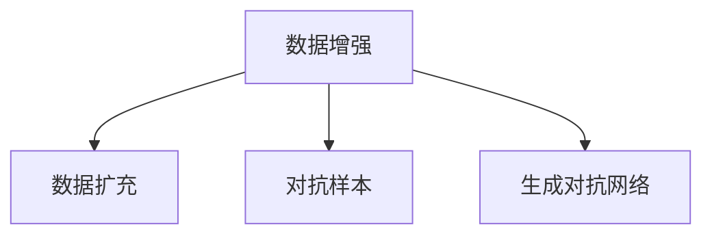

                 

# 数据增强技术：克服AI训练数据稀缺的利器

> 关键词：数据增强, 数据扩充, 数据集扩展, 对抗样本, 图像生成, 自然语言处理

## 1. 背景介绍

### 1.1 问题由来

在人工智能（AI）领域，尤其是深度学习（Deep Learning）中，数据是至关重要的。深度学习模型的性能依赖于大量高质量的标注数据，以确保其能够学习到复杂的特征和模式。然而，在实际应用中，高质量标注数据的获取往往成本高昂且耗时费力。此外，一些领域如医疗、司法、艺术等，由于隐私、伦理等原因，获取大量标注数据更为困难。

数据稀缺问题在许多领域中造成了极大的限制，尤其是在图像处理、自然语言处理（NLP）和语音识别等领域。例如，在医疗影像分析中，由于患者隐私和数据获取的难度，数据集的大小和多样性往往不足，导致模型过拟合和泛化能力差。同样，在自然语言处理任务中，由于语言的多样性和复杂性，生成高质量的标注数据同样具有挑战性。

### 1.2 问题核心关键点

数据增强技术是一种有效解决数据稀缺问题的方法，其基本思想是通过对原始数据进行一些变换，生成新的、多样化的数据来扩充数据集。这些新数据与原始数据具有相似的统计特性，但不完全相同，因此可以提供更多样化的训练信号，帮助模型更好地泛化。

核心关键点包括：

- **数据增强技术的核心原理**：通过简单的数据变换生成新的训练样本，避免模型过拟合。
- **常用的数据增强方法**：如随机裁剪、翻转、旋转、颜色抖动等。
- **数据增强的应用场景**：广泛应用于图像处理、自然语言处理、语音识别等领域。
- **数据增强的优缺点**：增加训练样本的多样性，提高模型的鲁棒性；但可能引入噪声，增加计算负担。

本文将详细讲解数据增强技术的原理与实践，通过具体案例分析及代码示例，帮助读者更好地理解并应用这一关键技术。

## 2. 核心概念与联系

### 2.1 核心概念概述

为更好地理解数据增强技术，本节将介绍几个密切相关的核心概念：

- **数据增强（Data Augmentation）**：通过数据变换生成新的训练样本，从而扩充数据集。
- **数据扩充（Data Expansion）**：通过数据合成或迁移学习等方式，生成新的训练样本，以增加数据集的多样性。
- **对抗样本（Adversarial Examples）**：通过故意在原始数据中添加噪声，生成扰动样本，以提高模型的鲁棒性。
- **生成对抗网络（GANs）**：一种生成模型，通过生成与原始数据相似但不完全相同的新数据，用于数据增强和数据生成。

这些核心概念之间的逻辑关系可以通过以下Mermaid流程图来展示：



这个流程图展示了大规模数据增强的核心概念及其之间的关系：

1. 数据增强技术通过简单的数据变换生成新的训练样本，从而扩充数据集。
2. 数据扩充通过合成新数据或迁移学习等方式增加数据集的多样性。
3. 对抗样本通过引入噪声来生成扰动样本，提高模型的鲁棒性。
4. 生成对抗网络通过生成与原始数据相似的新数据，用于数据增强和数据生成。

这些概念共同构成了大规模数据增强的框架，使得模型能够更好地泛化和鲁棒性。

## 3. 核心算法原理 & 具体操作步骤

### 3.1 算法原理概述

数据增强技术的核心原理是通过对原始数据进行随机变换，生成新的训练样本。这些新样本与原始样本具有相似的统计特性，但细节上有所不同。通过对模型训练过程中使用这些新样本，可以显著提高模型的泛化能力和鲁棒性。

形式化地，假设原始数据集为 $D=\{(x_i, y_i)\}_{i=1}^N$，其中 $x_i$ 为输入数据，$y_i$ 为对应的标签。数据增强的目的是生成新的数据集 $D'$，使得 $D'$ 与 $D$ 在统计特性上相似，但细节上有所差异。理想情况下，$D'$ 应该使得模型在 $D'$ 上的表现与在 $D$ 上相似。

### 3.2 算法步骤详解

数据增强的具体操作步骤如下：

**Step 1: 选择数据增强方法**

根据应用场景和数据类型，选择合适的数据增强方法。以下是一些常用的数据增强方法：

1. **图像数据增强**：包括随机裁剪、翻转、旋转、颜色抖动、亮度调节等。
2. **文本数据增强**：包括同义词替换、随机插入、随机删除等。
3. **语音数据增强**：包括速度调整、音量调整、噪声添加等。

**Step 2: 定义数据增强函数**

定义一个数据增强函数，用于对原始数据进行随机变换，生成新的数据样本。例如，对于图像数据增强，可以定义以下函数：

```python
import numpy as np
import cv2

def random_crop(image, size):
    h, w = image.shape[:2]
    crop_h, crop_w = size
    top = np.random.randint(0, h - crop_h + 1)
    left = np.random.randint(0, w - crop_w + 1)
    return image[top:top+crop_h, left:left+crop_w]

def random_flip(image):
    return np.fliplr(image) if np.random.rand() < 0.5 else image

def random_rotate(image):
    angle = np.random.rand() * 2 * np.pi
    return cv2.getRotationMatrix2D((image.shape[1] / 2, image.shape[0] / 2), angle, 1.0)[..., np.newaxis] @ image
```

**Step 3: 应用数据增强**

将数据增强函数应用于原始数据集，生成新的训练样本。例如，对于图像数据集，可以如下操作：

```python
import os
import glob
from PIL import Image

def read_images(directory):
    images = []
    for filename in glob.glob(os.path.join(directory, '*.jpg')):
        image = Image.open(filename)
        images.append(image)
    return images

def data_augmentation(images):
    augmented_images = []
    for image in images:
        cropped = random_crop(image, (224, 224))
        flipped = random_flip(cropped)
        rotated = random_rotate(flipped)
        augmented_images.append(rotated)
    return augmented_images

train_images = read_images('train')
train_augmented = data_augmentation(train_images)
```

**Step 4: 训练模型**

将增强后的数据集用于训练模型，以获得更好的泛化能力。例如，使用Keras框架训练一个简单的图像分类模型：

```python
from keras.models import Sequential
from keras.layers import Conv2D, MaxPooling2D, Flatten, Dense
from keras.preprocessing.image import ImageDataGenerator

model = Sequential()
model.add(Conv2D(32, (3, 3), activation='relu', input_shape=(224, 224, 3)))
model.add(MaxPooling2D((2, 2)))
model.add(Conv2D(64, (3, 3), activation='relu'))
model.add(MaxPooling2D((2, 2)))
model.add(Flatten())
model.add(Dense(64, activation='relu'))
model.add(Dense(10, activation='softmax'))

model.compile(optimizer='adam', loss='categorical_crossentropy', metrics=['accuracy'])

train_generator = ImageDataGenerator(
    rescale=1. / 255,
    shear_range=0.2,
    zoom_range=0.2,
    horizontal_flip=True
)
test_generator = ImageDataGenerator(rescale=1. / 255)

train_generator.fit(train_augmented)
model.fit_generator(train_generator, steps_per_epoch=train_generator.n // train_generator.batch_size, epochs=10)
```

在训练过程中，数据增强的实现通过`ImageDataGenerator`类完成，可以设置各种增强操作，如缩放、旋转、剪切等。

### 3.3 算法优缺点

数据增强技术具有以下优点：

- **增加训练样本的多样性**：通过随机变换生成新的训练样本，可以有效增加训练数据的多样性，减少过拟合。
- **提高模型的泛化能力**：增加训练样本的多样性有助于模型学习到更加鲁棒和泛化的特征。
- **减少标注成本**：数据增强可以有效地利用有限的标注数据，减少获取更多标注数据的成本。

同时，数据增强技术也存在一些缺点：

- **可能引入噪声**：某些增强操作可能会引入噪声，影响模型的性能。
- **计算负担增加**：生成新样本的计算开销可能较大，特别是在高维数据上。
- **增强效果可能受限制**：某些增强操作可能对特定数据类型或特定数据分布的增强效果有限。

尽管如此，数据增强技术在实际应用中已被证明是提高模型性能的有效手段，特别是在数据稀缺的情况下。

### 3.4 算法应用领域

数据增强技术广泛应用于图像处理、自然语言处理、语音识别等领域：

- **图像处理**：广泛应用于目标检测、图像分类、人脸识别等任务，通过随机裁剪、翻转、旋转等增强操作生成新的训练样本。
- **自然语言处理**：通过同义词替换、随机插入、随机删除等操作生成新的训练样本，应用于文本分类、情感分析等任务。
- **语音识别**：通过噪声添加、速度调整等操作生成新的训练样本，应用于语音识别、语音合成等任务。

此外，数据增强技术也被用于对抗样本生成、生成对抗网络（GANs）等领域，进一步提升模型的鲁棒性和生成能力。

## 4. 数学模型和公式 & 详细讲解  
### 4.1 数学模型构建

在形式化地描述数据增强技术时，我们通常将其视为一种数据扩充（Data Expansion）的过程。形式化地，假设原始数据集为 $D=\{(x_i, y_i)\}_{i=1}^N$，其中 $x_i$ 为输入数据，$y_i$ 为对应的标签。数据增强的目的是生成新的数据集 $D'$，使得 $D'$ 与 $D$ 在统计特性上相似，但细节上有所差异。

具体而言，假设对原始数据集 $D$ 进行一系列随机变换 $T=\{t_1, t_2, \ldots, t_k\}$，其中 $t_i$ 为第 $i$ 个数据增强操作。则增强后的数据集 $D'$ 为：

$$
D' = \{(x_i', y_i') | x_i' = t_i(x_i), y_i' = y_i\}
$$

这里 $x_i'$ 表示经过数据增强操作后的新样本，$y_i'$ 表示对应的标签。通过训练模型 $f$ 在 $D'$ 上进行优化，可以得到在原始数据集 $D$ 上的性能。

### 4.2 公式推导过程

以下我们以图像数据增强为例，推导随机裁剪操作的公式。

假设原始图像大小为 $h \times w$，随机裁剪操作的裁剪区域大小为 $c \times c$。随机裁剪的公式如下：

$$
x_{new} = x + \mathcal{N}(0, \sigma^2) \quad \text{where} \quad x \sim \mathcal{U}(0, h-c) \quad \text{and} \quad y \sim \mathcal{U}(0, w-c)
$$

这里 $\mathcal{N}(0, \sigma^2)$ 表示均值为0、方差为 $\sigma^2$ 的高斯分布，$\mathcal{U}(0, h-c)$ 表示在 $[0, h-c]$ 范围内的均匀分布。

通过随机裁剪操作，可以得到新的图像 $x_{new}$，大小为 $c \times c$。将其与原始图像 $x$ 一起作为输入，训练模型 $f$ 输出对应的标签 $y$。训练过程可以通过以下公式进行：

$$
\mathcal{L}(f; D) = \frac{1}{N} \sum_{i=1}^N \ell(f(x_i, y_i), y_i)
$$

其中 $\ell$ 为损失函数，$N$ 为数据集大小。训练目标是最小化损失函数 $\mathcal{L}$。

### 4.3 案例分析与讲解

以图像分类任务为例，使用随机裁剪和翻转等操作进行数据增强。以下是具体的代码实现：

```python
import numpy as np
import cv2
import matplotlib.pyplot as plt

def random_crop(image, size):
    h, w = image.shape[:2]
    crop_h, crop_w = size
    top = np.random.randint(0, h - crop_h + 1)
    left = np.random.randint(0, w - crop_w + 1)
    return image[top:top+crop_h, left:left+crop_w]

def random_flip(image):
    return np.fliplr(image) if np.random.rand() < 0.5 else image

def augment_image(image):
    cropped = random_crop(image, (224, 224))
    flipped = random_flip(cropped)
    return flipped

# 读取图像
image = cv2.imread('image.jpg')

# 数据增强
augmented_image = augment_image(image)

# 显示原始和增强后的图像
plt.subplot(1, 2, 1)
plt.imshow(image)
plt.title('Original Image')
plt.subplot(1, 2, 2)
plt.imshow(augmented_image)
plt.title('Augmented Image')
plt.show()
```

通过随机裁剪和翻转操作，可以生成新的图像样本，用于训练模型。

## 5. 项目实践：代码实例和详细解释说明

### 5.1 开发环境搭建

在进行数据增强实践前，我们需要准备好开发环境。以下是使用Python进行Keras开发的环境配置流程：

1. 安装Anaconda：从官网下载并安装Anaconda，用于创建独立的Python环境。

2. 创建并激活虚拟环境：
```bash
conda create -n keras-env python=3.8 
conda activate keras-env
```

3. 安装Keras：
```bash
conda install keras
```

4. 安装TensorFlow：
```bash
conda install tensorflow
```

5. 安装NumPy、PIL等常用库：
```bash
pip install numpy matplotlib PIL
```

完成上述步骤后，即可在`keras-env`环境中开始数据增强实践。

### 5.2 源代码详细实现

我们以图像分类任务为例，给出使用Keras框架进行图像数据增强的代码实现。

首先，定义数据增强函数：

```python
from keras.preprocessing.image import ImageDataGenerator

def data_augmentation(train_images):
    train_datagen = ImageDataGenerator(
        rescale=1. / 255,
        shear_range=0.2,
        zoom_range=0.2,
        horizontal_flip=True
    )
    return train_datagen.flow(train_images, batch_size=32)
```

然后，定义模型和优化器：

```python
from keras.models import Sequential
from keras.layers import Conv2D, MaxPooling2D, Flatten, Dense

model = Sequential()
model.add(Conv2D(32, (3, 3), activation='relu', input_shape=(224, 224, 3)))
model.add(MaxPooling2D((2, 2)))
model.add(Conv2D(64, (3, 3), activation='relu'))
model.add(MaxPooling2D((2, 2)))
model.add(Flatten())
model.add(Dense(64, activation='relu'))
model.add(Dense(10, activation='softmax'))

model.compile(optimizer='adam', loss='categorical_crossentropy', metrics=['accuracy'])
```

接着，使用数据增强生成训练样本：

```python
train_images = load_images('train')
train_generator = data_augmentation(train_images)
model.fit_generator(train_generator, steps_per_epoch=train_generator.n // train_generator.batch_size, epochs=10)
```

### 5.3 代码解读与分析

让我们再详细解读一下关键代码的实现细节：

**data_augmentation函数**：
- 定义一个`ImageDataGenerator`对象，设置随机裁剪、翻转、缩放等增强操作。
- 返回一个生成器对象，用于逐批次生成增强后的训练样本。

**model定义**：
- 定义一个简单的卷积神经网络（CNN）模型，用于图像分类任务。
- 使用`Sequential`模型将各层按照顺序堆叠起来。
- 编译模型，使用Adam优化器，交叉熵损失函数和准确率作为评估指标。

**模型训练**：
- 加载训练图像，并使用`data_augmentation`函数生成增强后的训练样本。
- 使用`fit_generator`方法训练模型，`steps_per_epoch`指定每批次训练样本的数量，`epochs`指定训练轮数。

通过以上代码实现，可以看到Keras框架对数据增强操作的封装，使得数据增强的实现变得简洁高效。

## 6. 实际应用场景

### 6.1 智能医疗

在智能医疗领域，数据增强技术可以帮助模型更好地泛化，提高诊断的准确性和鲁棒性。例如，医学影像分类任务中，可以采用随机裁剪、旋转、翻转等增强操作生成更多的训练样本，使得模型能够更好地学习到不同角度、尺寸和光照条件下的病变特征。

### 6.2 自然语言处理

在自然语言处理（NLP）任务中，数据增强技术可以帮助模型更好地理解语言的多样性。例如，文本分类任务中，可以通过同义词替换、随机插入、随机删除等操作生成新的训练样本，提高模型的泛化能力。

### 6.3 自动驾驶

在自动驾驶领域，数据增强技术可以帮助模型更好地适应复杂的驾驶场景。例如，车辆前视摄像头生成的图像可能受到天气、光照、行人遮挡等多种因素的影响，通过随机裁剪、旋转、翻转等操作生成更多的训练样本，可以帮助模型更好地学习到不同条件下的驾驶场景。

### 6.4 未来应用展望

随着深度学习技术的不断发展和数据增强技术的成熟，未来数据增强技术将在更多领域得到应用，为AI系统带来新的突破。

1. **多模态数据增强**：将文本、图像、语音等多种数据类型结合起来，进行综合的数据增强，提升系统的泛化能力和鲁棒性。
2. **对抗样本生成**：利用对抗样本生成技术，生成攻击性的数据样本，用于测试模型的鲁棒性和安全性。
3. **生成对抗网络**：结合生成对抗网络（GANs）技术，生成与原始数据相似但不完全相同的新数据，用于数据增强和数据生成。

## 7. 工具和资源推荐

### 7.1 学习资源推荐

为了帮助开发者系统掌握数据增强技术，这里推荐一些优质的学习资源：

1. 《深度学习实战》：详细讲解了深度学习模型和数据增强技术，包括图像、文本、语音等多种数据类型的增强方法。
2. Coursera《深度学习》课程：由斯坦福大学教授Andrew Ng主讲，系统讲解了深度学习的基础知识和应用，包括数据增强技术。
3. Kaggle数据增强教程：Kaggle社区分享了大量数据增强的代码和实战经验，适合实践学习。
4. GitHub数据增强库：GitHub上提供了许多开源数据增强库，如imgaug、transforms等，适合快速上手。

通过这些学习资源，相信你一定能够快速掌握数据增强技术的精髓，并用于解决实际的AI问题。

### 7.2 开发工具推荐

高效的开发离不开优秀的工具支持。以下是几款用于数据增强开发的常用工具：

1. Keras：基于Python的深度学习框架，提供了丰富的数据增强工具，简单易用。
2. TensorFlow：由Google主导开发的开源深度学习框架，支持大规模数据增强，适用于高计算量场景。
3. imgaug：一个Python库，支持图像数据增强，提供了多种增强操作和组合方式。
4. PyTorch：另一个开源深度学习框架，支持动态计算图，适用于快速迭代研究。
5. Matplotlib：用于数据可视化的工具，可以帮助开发者更好地理解数据增强效果。

合理利用这些工具，可以显著提升数据增强任务的开发效率，加快创新迭代的步伐。

### 7.3 相关论文推荐

数据增强技术的研究始于学界的持续探索。以下是几篇奠基性的相关论文，推荐阅读：

1. "Image Data Augmentation for Deep Learning"：对图像数据增强进行了系统回顾，介绍了多种增强操作和组合方式。
2. "Data Augmentation in Natural Language Processing"：对文本数据增强进行了详细讲解，包括同义词替换、随机插入等操作。
3. "Augmenting Video for Deep Learning"：对视频数据增强进行了系统回顾，介绍了多种增强操作和应用场景。
4. "Data Augmentation for Robust Models in Healthcare"：对医疗领域的数据增强进行了详细讲解，介绍了多种增强操作和应用场景。

这些论文代表了大数据增强技术的发展脉络。通过学习这些前沿成果，可以帮助研究者把握学科前进方向，激发更多的创新灵感。

## 8. 总结：未来发展趋势与挑战

### 8.1 总结

本文对数据增强技术进行了全面系统的介绍。首先阐述了数据增强技术的核心原理和实际应用中的重要性，明确了数据增强在提高模型泛化能力和鲁棒性方面的独特价值。其次，从原理到实践，详细讲解了数据增强技术的数学模型和关键步骤，给出了数据增强任务开发的完整代码实例。同时，本文还广泛探讨了数据增强方法在智能医疗、自然语言处理、自动驾驶等多个领域的应用前景，展示了数据增强范式的巨大潜力。最后，本文精选了数据增强技术的各类学习资源，力求为读者提供全方位的技术指引。

通过本文的系统梳理，可以看到，数据增强技术正在成为AI训练中不可或缺的一部分，特别是在数据稀缺的条件下，数据增强技术的应用更为广泛。未来，伴随深度学习技术的持续演进和数据增强方法的不断探索，相信AI系统将在更多的领域和场景中发挥更大的作用。

### 8.2 未来发展趋势

展望未来，数据增强技术将呈现以下几个发展趋势：

1. **多模态数据增强**：将文本、图像、语音等多种数据类型结合起来，进行综合的数据增强，提升系统的泛化能力和鲁棒性。
2. **对抗样本生成**：利用对抗样本生成技术，生成攻击性的数据样本，用于测试模型的鲁棒性和安全性。
3. **生成对抗网络**：结合生成对抗网络（GANs）技术，生成与原始数据相似但不完全相同的新数据，用于数据增强和数据生成。
4. **动态数据增强**：根据训练过程中的数据分布变化，动态调整数据增强策略，进一步提升模型的泛化能力。
5. **元学习数据增强**：结合元学习技术，在少量数据上通过数据增强和模型训练，生成更加多样化的数据，提升模型的泛化能力。

以上趋势凸显了数据增强技术的广阔前景。这些方向的探索发展，必将进一步提升AI系统的性能和应用范围，为构建智能系统带来新的突破。

### 8.3 面临的挑战

尽管数据增强技术已经取得了显著成果，但在应用过程中仍面临诸多挑战：

1. **计算负担增加**：数据增强操作可能会增加计算负担，特别是在高维数据上，需要优化计算效率。
2. **噪声引入**：某些增强操作可能会引入噪声，影响模型的性能，需要合理设计增强策略。
3. **数据分布失真**：增强操作可能导致数据分布失真，影响模型的泛化能力，需要平衡增强效果和数据分布。
4. **对抗样本攻击**：对抗样本可能被用于攻击系统，需要结合对抗训练等方法提升模型的鲁棒性。
5. **资源限制**：数据增强操作可能占用大量计算资源，需要合理设计资源分配策略。

这些挑战需要通过技术创新和实践优化来解决，进一步提升数据增强技术的应用效果。

### 8.4 研究展望

面对数据增强技术所面临的挑战，未来的研究需要在以下几个方面寻求新的突破：

1. **动态数据增强**：根据训练过程中的数据分布变化，动态调整数据增强策略，进一步提升模型的泛化能力。
2. **元学习数据增强**：结合元学习技术，在少量数据上通过数据增强和模型训练，生成更加多样化的数据，提升模型的泛化能力。
3. **多模态数据增强**：将文本、图像、语音等多种数据类型结合起来，进行综合的数据增强，提升系统的泛化能力和鲁棒性。
4. **对抗样本生成**：利用对抗样本生成技术，生成攻击性的数据样本，用于测试模型的鲁棒性和安全性。
5. **生成对抗网络**：结合生成对抗网络（GANs）技术，生成与原始数据相似但不完全相同的新数据，用于数据增强和数据生成。

这些研究方向的探索，必将引领数据增强技术迈向更高的台阶，为构建智能系统带来新的突破。面向未来，数据增强技术还需要与其他AI技术进行更深入的融合，如知识表示、因果推理、强化学习等，多路径协同发力，共同推动AI系统的进步。只有勇于创新、敢于突破，才能不断拓展数据增强技术的边界，让AI系统更好地造福人类社会。

## 9. 附录：常见问题与解答

**Q1：什么是数据增强？**

A: 数据增强是一种通过随机变换原始数据生成新的训练样本的技术，从而增加数据集的多样性，提高模型的泛化能力和鲁棒性。

**Q2：数据增强有哪些常用的方法？**

A: 数据增强的方法包括图像增强（如随机裁剪、翻转、旋转等）、文本增强（如同义词替换、随机插入、随机删除等）、语音增强（如噪声添加、速度调整等）。

**Q3：如何选择合适的数据增强方法？**

A: 根据应用场景和数据类型选择合适的数据增强方法。例如，对于图像数据，可以采用随机裁剪、翻转、旋转等增强操作；对于文本数据，可以采用同义词替换、随机插入、随机删除等操作。

**Q4：数据增强是否会影响模型的性能？**

A: 数据增强可以通过增加训练样本的多样性，提升模型的泛化能力和鲁棒性，但同时也可能引入噪声，影响模型的性能。因此，需要根据具体任务和数据类型进行合理设计。

**Q5：如何在计算资源有限的情况下进行数据增强？**

A: 可以在小规模数据上，通过数据增强和模型训练，生成更加多样化的数据，提升模型的泛化能力。同时，可以结合元学习技术，在少量数据上通过数据增强和模型训练，生成更多的训练样本。

这些回答可以帮助读者更好地理解数据增强技术的原理和应用，希望在实际开发中能够灵活应用，提升模型的性能和泛化能力。

---

作者：禅与计算机程序设计艺术 / Zen and the Art of Computer Programming

