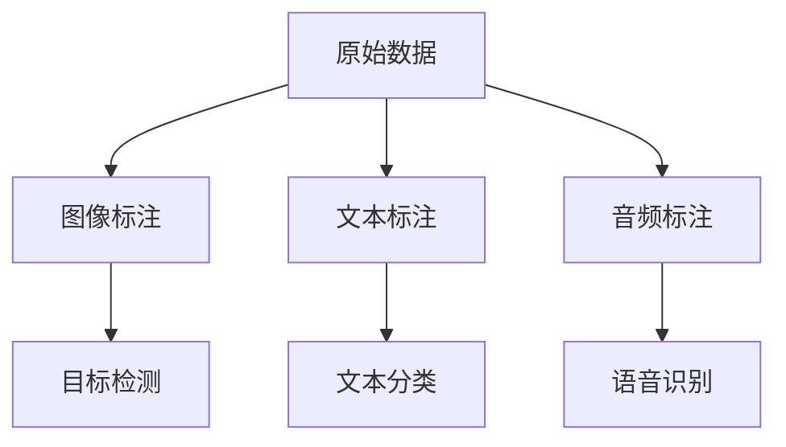

                 

# 数据标注：人工智能发展背后的幕后英雄

> 关键词：数据标注, 人工智能, 机器学习, 深度学习, 自然语言处理(NLP), 计算机视觉(CV), 工业应用, 标准化, 质量控制

## 1. 背景介绍

人工智能(AI)技术的飞跃发展，离不开数据标注这一幕后的重要支撑。标注数据是训练AI模型的基础，无论是在语音、图像、文本还是其他模态数据的处理中，高质量的数据标注都是提升模型性能的关键。然而，数据标注这一幕后英雄，却往往被外界忽视，其重要性不亚于模型本身。本文将系统介绍数据标注的相关概念，阐述其在AI发展中的核心作用，并展望其未来的趋势与挑战。

## 2. 核心概念与联系

### 2.1 核心概念概述

数据标注（Data Annotation）是指在原始数据上添加标签或注释的过程，通过人工或半自动的方式将数据转化为机器可以理解的形式。数据标注通常包括图像标注、文本标注、音频标注等。

- **图像标注**：为图像中的目标对象标注边界框、类别等属性，常用于目标检测、物体分割等计算机视觉任务。
- **文本标注**：为文本中的实体、情感、关系等标注属性，常用于文本分类、命名实体识别、情感分析等自然语言处理任务。
- **音频标注**：为音频中的语音、音乐等标注标签，常用于语音识别、语音情感识别等任务。

### 2.2 核心概念原理和架构的 Mermaid 流程图



该图展示了数据标注在不同模态数据上的应用场景：

- 原始数据经过图像标注后，用于计算机视觉任务。
- 原始数据经过文本标注后，用于自然语言处理任务。
- 原始数据经过音频标注后，用于语音处理任务。

### 2.3 核心概念之间的联系

数据标注是连接数据与模型的桥梁，其通过为数据添加标签，使得模型能够从数据中学习到有意义的特征，提升模型的预测能力和泛化性能。

- 数据标注为监督学习模型提供训练信号，通过最小化预测值与真实值之间的差异来优化模型。
- 数据标注帮助模型理解不同模态数据的特性，提高模型的通用性和适应性。
- 数据标注通过反馈循环，不断优化标注质量，提升数据标注过程的自动化水平。

## 3. 核心算法原理 & 具体操作步骤

### 3.1 算法原理概述

数据标注的原理可以归纳为两个步骤：数据收集与数据标注。在数据收集阶段，需要从多源获取原始数据；在数据标注阶段，需要由人工或半自动化的方式对数据进行标注，并选择合适的评估指标和优化方法。

#### 3.1.1 数据收集

数据收集是数据标注的第一步，其包括从多个渠道获取原始数据，并进行数据清洗和预处理。数据收集的质量直接影响数据标注的准确性和效率。

#### 3.1.2 数据标注

数据标注是指在原始数据上添加标签或注释的过程。标签可以是类别、位置、属性等，需要根据具体的任务需求来选择。标注方法包括人工标注、半自动标注和自动标注。

#### 3.1.3 评估与优化

评估与优化阶段，需要选择合适的评估指标（如准确率、召回率、F1值等），对标注结果进行评价，并根据评估结果对标注过程进行优化。

### 3.2 算法步骤详解

#### 3.2.1 数据收集

数据收集的主要步骤包括：

1. **数据源选择**：选择可靠的数据源，如公开数据集、企业数据、用户生成内容等。
2. **数据采集**：使用爬虫、API、数据导出来获取数据。
3. **数据清洗**：处理缺失值、异常值、重复数据等问题。
4. **数据预处理**：标准化、归一化、降维等预处理操作。

#### 3.2.2 数据标注

数据标注的主要步骤包括：

1. **标注方法选择**：根据任务需求选择人工标注、半自动标注或自动标注方法。
2. **标注工具使用**：使用专业标注工具（如Labelbox、V labeling等），提升标注效率。
3. **标注流程设计**：设计标注流程，确保标注一致性和质量。
4. **标注结果校验**：通过人工校验和自动化校验来确保标注结果的准确性。

#### 3.2.3 评估与优化

评估与优化的主要步骤包括：

1. **评估指标选择**：根据任务需求选择合适的评估指标。
2. **结果分析**：对标注结果进行分析，找出标注错误和偏差。
3. **优化标注流程**：通过反馈机制，优化标注流程，提升标注质量和效率。

### 3.3 算法优缺点

数据标注的优点包括：

1. **提升模型性能**：标注数据提供训练信号，帮助模型学习特征，提高模型性能。
2. **提高模型泛化能力**：通过标注数据，模型能够更好地理解数据分布，提高泛化性能。
3. **促进数据驱动**：标注数据使得模型更加依赖数据，提高模型的可解释性和可信度。

数据标注的缺点包括：

1. **成本高**：人工标注成本高，尤其是大规模数据集。
2. **质量不确定**：标注质量受标注者主观因素影响较大，难以保证一致性。
3. **时间消耗大**：标注过程时间消耗大，难以快速迭代优化。

### 3.4 算法应用领域

数据标注广泛应用于多个AI领域，包括：

- **计算机视觉**：图像标注、物体检测、图像分割等。
- **自然语言处理**：文本分类、命名实体识别、情感分析等。
- **语音识别**：语音转写、语音情感识别、语音合成等。
- **工业应用**：生产设备监测、质量控制、异常检测等。
- **医疗健康**：医学图像标注、医疗问答、病历分析等。

## 4. 数学模型和公式 & 详细讲解 & 举例说明

### 4.1 数学模型构建

数据标注的数学模型主要涉及标注结果的表示和评价。假设有一组标注数据 $D=\{(x_i, y_i)\}_{i=1}^N$，其中 $x_i$ 为原始数据，$y_i$ 为标注结果。

#### 4.1.1 标注结果表示

标注结果可以用多种方式表示，如标签形式、类别形式、边界框形式等。对于图像标注，通常使用边界框和类别表示。

#### 4.1.2 评估指标

评估指标包括准确率、召回率、F1值、IoU等。以准确率和召回率为例，其定义为：

$$
\text{Accuracy} = \frac{TP + TN}{TP + TN + FP + FN}
$$

$$
\text{Recall} = \frac{TP}{TP + FN}
$$

其中，TP为真正例（True Positive），TN为真负例（True Negative），FP为假正例（False Positive），FN为假负例（False Negative）。

### 4.2 公式推导过程

#### 4.2.1 准确率计算

准确率是评估分类模型的常用指标，其计算公式为：

$$
\text{Accuracy} = \frac{TP + TN}{TP + TN + FP + FN}
$$

#### 4.2.2 召回率计算

召回率是评估分类模型的另一重要指标，其计算公式为：

$$
\text{Recall} = \frac{TP}{TP + FN}
$$

### 4.3 案例分析与讲解

以文本分类任务为例，假设有如下标注数据：

$$
(x_1, y_1) = ("I love coding", "positive")
$$

$$
(x_2, y_2) = ("I hate studying", "negative")
$$

其中，$x_i$ 为文本数据，$y_i$ 为分类标签。对这两条数据进行标注时，首先需要确定标签集合，如 "positive" 和 "negative"，然后由人工或半自动的方式进行标注。假设标注结果为：

$$
(x_1, \hat{y}_1) = ("I love coding", "positive")
$$

$$
(x_2, \hat{y}_2) = ("I hate studying", "negative")
$$

使用准确率和召回率对标注结果进行评价：

$$
\text{Accuracy} = \frac{1 + 0}{1 + 0 + 0 + 0} = 1
$$

$$
\text{Recall} = \frac{1}{1 + 0} = 0.5
$$

## 5. 项目实践：代码实例和详细解释说明

### 5.1 开发环境搭建

数据标注项目一般需要大量的数据集和标注工具，因此需要搭建相应的开发环境。以下是一个基于Python和Labelbox的示例：

1. **安装Labelbox**：

```
pip install labelbox
```

2. **准备数据集**：

```
import labelbox as lb

# 加载数据集
dataset = lb.load_dataset("path/to/dataset")

# 展示数据集样本
for sample in dataset:
    print(sample)
```

3. **启动标注任务**：

```
# 创建标注任务
task = lb.create_task("path/to/task")

# 获取任务ID
task_id = task.id

# 开始标注任务
lb.start_annotating(task_id)
```

### 5.2 源代码详细实现

以图像标注为例，以下是使用Labelbox进行图像标注的代码实现：

```python
import labelbox as lb

# 加载数据集
dataset = lb.load_dataset("path/to/dataset")

# 创建标注任务
task = lb.create_task("path/to/task")

# 获取任务ID
task_id = task.id

# 开始标注任务
lb.start_annotating(task_id)
```

### 5.3 代码解读与分析

#### 5.3.1 数据集加载

使用Labelbox加载数据集，其中数据集存储路径为"path/to/dataset"。

#### 5.3.2 任务创建

使用Labelbox创建标注任务，其中任务存储路径为"path/to/task"。

#### 5.3.3 标注任务启动

使用Labelbox启动标注任务，即可进行图像标注。

### 5.4 运行结果展示

运行上述代码后，Labelbox会自动打开标注界面，展示数据集样本，标注者可以在界面上进行标注操作。

## 6. 实际应用场景

### 6.1 智能客服系统

在智能客服系统中，数据标注用于构建对话语料库和标注回答。通过对客户历史聊天记录的标注，智能客服系统能够理解客户的意图，并提供准确的答案。数据标注在此过程中起到了关键作用，使得模型能够从真实对话中学习到有用的特征。

### 6.2 金融舆情监测

金融舆情监测系统需要对大量的新闻、评论、社交媒体数据进行标注，以便识别市场趋势和风险信号。通过标注工具，可以快速对海量数据进行标注，提升金融舆情监测的效率和准确性。

### 6.3 个性化推荐系统

个性化推荐系统需要对用户的浏览、点击、购买等行为数据进行标注，以便模型能够理解用户的偏好。通过对数据进行标注，推荐系统能够更精准地推荐商品或内容，提升用户体验。

### 6.4 未来应用展望

未来，数据标注将在AI的各个领域发挥越来越重要的作用。随着自动化标注技术的发展，数据标注的成本将逐渐降低，标注过程将更加高效和可靠。同时，数据标注的质量将进一步提升，标注结果将更加准确和一致。

## 7. 工具和资源推荐

### 7.1 学习资源推荐

1. **《数据标注：理论与实践》**：详细介绍了数据标注的基本概念、标注流程和评估方法。
2. **《机器学习基础》**：介绍了机器学习的基本原理和数据标注的应用。
3. **《深度学习入门》**：介绍了深度学习的基本原理和数据标注的常用技术。
4. **《自然语言处理入门》**：介绍了自然语言处理的基本原理和数据标注的应用。

### 7.2 开发工具推荐

1. **Labelbox**：一个流行的标注工具，支持多种数据类型和标注任务。
2. **V Labeling**：另一个流行的标注工具，支持图像、视频、音频等多种模态数据的标注。
3. **Prodigy**：一个开源的标注工具，支持半自动标注和自动化标注。

### 7.3 相关论文推荐

1. **《深度学习在图像标注中的应用》**：介绍了深度学习在图像标注中的应用。
2. **《基于标注数据的机器学习模型优化》**：介绍了如何利用标注数据优化机器学习模型。
3. **《自然语言处理中的数据标注技术》**：介绍了自然语言处理中的数据标注技术。

## 8. 总结：未来发展趋势与挑战

### 8.1 研究成果总结

数据标注是AI发展的关键环节，其对模型的性能和泛化能力起着至关重要的作用。通过对数据进行标注，模型能够从原始数据中学习到有用的特征，提升预测准确性。

### 8.2 未来发展趋势

未来，数据标注将呈现出以下几个发展趋势：

1. **自动化标注**：随着自动化标注技术的不断发展，数据标注的成本将逐渐降低，标注过程将更加高效和可靠。
2. **多模态标注**：数据标注将不仅仅局限于图像、文本等单一模态，还将涉及多模态数据的标注。
3. **质量控制**：数据标注的质量将成为未来的重点，通过自动化和人工校验相结合，确保标注结果的准确性和一致性。

### 8.3 面临的挑战

数据标注仍然面临一些挑战：

1. **标注成本高**：人工标注成本高，难以大规模应用。
2. **标注质量不确定**：标注质量受标注者主观因素影响较大，难以保证一致性。
3. **标注时间消耗大**：标注过程时间消耗大，难以快速迭代优化。

### 8.4 研究展望

未来，数据标注需要在以下几个方面进行深入研究：

1. **自动化标注技术**：进一步发展自动化标注技术，提高标注效率和质量。
2. **多模态数据标注**：探索多模态数据的标注方法，提升模型的通用性和适应性。
3. **数据标注质量控制**：建立数据标注的质量控制机制，确保标注结果的准确性和一致性。

## 9. 附录：常见问题与解答

**Q1：数据标注有哪些常见问题？**

A: 数据标注的常见问题包括：

1. 标注数据质量不高：标注结果存在误差和偏差，影响模型性能。
2. 标注过程效率低：标注过程时间消耗大，难以快速迭代优化。
3. 标注成本高：人工标注成本高，难以大规模应用。

**Q2：如何解决数据标注的问题？**

A: 解决数据标注问题的方法包括：

1. 数据清洗和预处理：对数据进行清洗和预处理，减少噪声和异常值。
2. 标注流程设计：设计合理的标注流程，确保标注一致性和质量。
3. 自动化标注技术：发展自动化标注技术，提高标注效率和质量。

**Q3：数据标注在AI项目中如何应用？**

A: 数据标注在AI项目中的应用包括：

1. 计算机视觉：图像标注、物体检测、图像分割等。
2. 自然语言处理：文本分类、命名实体识别、情感分析等。
3. 语音识别：语音转写、语音情感识别、语音合成等。

---

作者：禅与计算机程序设计艺术 / Zen and the Art of Computer Programming

