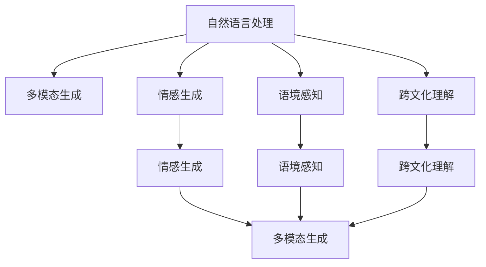

                 

# 文化适应性AI写作：跨地域的内容创作

> 关键词：文化适应性, AI写作, 跨地域, 内容创作, 机器翻译, 多模态生成, 情感生成, 语境感知

## 1. 背景介绍

在全球化的浪潮下，跨地域的内容创作已成为文化交流和商业拓展的重要手段。无论是国际新闻、娱乐节目还是市场营销，高质量的跨文化内容创作不仅需要创意和技巧，更需要深度理解和跨地域的洞察力。人工智能（AI）技术的发展，尤其是自然语言处理（NLP）领域，为内容创作者提供了新的工具和思路。然而，传统的基于单一语言和文化训练的AI模型，难以适应多语言、多文化环境的创作需求。这就需要引入文化适应性AI写作技术，以更好地支持跨地域的内容创作。

### 1.1 问题由来
跨地域内容创作的核心挑战在于如何构建具有跨文化理解能力的AI模型，使其能够在不同的语言和文化环境下灵活创作。这不仅涉及到语言的翻译和生成，还包括对不同文化背景下的表达习惯、情感色彩、语境理解等方面的综合考量。传统的AI模型往往忽视了文化差异，导致跨文化内容创作的准确性和自然度不足，难以达到预期的效果。文化适应性AI写作技术正是为了应对这一挑战而生的，通过深度学习和大数据分析，提升AI模型对不同文化环境的适应性，从而实现跨地域的内容创作。

### 1.2 问题核心关键点
文化适应性AI写作的核心在于如何使AI模型理解并适应不同文化背景下的语言表达和语境特征。具体而言，包括但不限于以下几点：
1. **语言翻译与生成**：将一种语言的文本转换为另一种语言的文本，并生成具有目标语言文化特色的内容。
2. **情感生成**：在生成文本时，能够根据目标语言的文化背景和语境，生成合适的情感色彩。
3. **语境感知**：理解并考虑文本所处的具体情境，包括时间、地点、人物关系等，以生成更加自然和贴切的内容。
4. **跨文化理解**：模型能够处理和生成在不同文化背景下的相关知识，如文化习惯、习俗、社会规范等，以避免文化冲突和误解。

## 2. 核心概念与联系

### 2.1 核心概念概述

文化适应性AI写作技术涉及多个核心概念，包括自然语言处理、多模态生成、情感生成、语境感知等。这些概念通过数据处理、模型训练和输出生成等环节相互联系，形成了一个完整的跨文化内容创作框架。

- **自然语言处理（NLP）**：涉及语言识别、分词、词性标注、句法分析、语义理解等基础技术，是AI写作的基础。
- **多模态生成**：结合文本、图像、语音等多模态数据，生成更加丰富和生动的内容。
- **情感生成**：在文本生成过程中，考虑目标语言的文化背景和语境，生成合适的情感色彩。
- **语境感知**：理解文本所处的具体情境，包括时间、地点、人物关系等，以生成更加自然和贴切的内容。
- **跨文化理解**：模型能够处理和生成在不同文化背景下的相关知识，以避免文化冲突和误解。

这些核心概念之间的逻辑关系可以通过以下Mermaid流程图来展示：



这个流程图展示了大语言模型在跨文化内容创作中的核心概念及其之间的关系：

1. 自然语言处理技术提供了基础的语言理解和生成能力。
2. 多模态生成技术结合文本、图像、语音等多模态数据，增强内容的丰富性和生动性。
3. 情感生成技术考虑目标语言的文化背景和语境，生成合适的情感色彩。
4. 语境感知技术理解文本所处的具体情境，生成更加自然和贴切的内容。
5. 跨文化理解技术处理和生成在不同文化背景下的相关知识，避免文化冲突和误解。

这些概念共同构成了文化适应性AI写作的技术框架，使其能够在各种文化环境下灵活创作，提升跨地域内容的质量和效果。

## 3. 核心算法原理 & 具体操作步骤

### 3.1 算法原理概述

文化适应性AI写作的核心算法原理是基于深度学习的自然语言生成技术。其基本思路是通过大规模多语言数据集对AI模型进行训练，使其能够理解并适应不同语言和文化背景，从而在跨地域内容创作中灵活应用。具体来说，包括以下几个关键步骤：

1. **数据收集与预处理**：收集涵盖不同语言和文化背景的文本数据，并进行必要的预处理，如分词、去除停用词、标准化等。
2. **多语言训练**：在多语言数据集上训练AI模型，使其能够处理和生成多种语言的文本。
3. **文化适应性增强**：通过在训练过程中引入文化特征、情感色彩、语境信息等，增强模型对不同文化环境的适应性。
4. **模型优化与评估**：使用评价指标（如BLEU、ROUGE等）评估模型性能，并进行模型优化。

### 3.2 算法步骤详解

以下是文化适应性AI写作的详细步骤：

**Step 1: 数据收集与预处理**

1. **多语言数据集收集**：收集包含多种语言和文化的文本数据，涵盖新闻、文学、社交媒体等不同领域，确保数据的多样性和代表性。
2. **数据预处理**：对收集的数据进行清洗、分词、去停用词等处理，确保数据格式的一致性和质量。

**Step 2: 多语言训练**

1. **模型选择与初始化**：选择合适的预训练模型（如BERT、GPT等）作为初始化参数。
2. **多语言训练**：在多语言数据集上训练模型，使用多个语言的数据交替训练，确保模型能够处理多种语言的输入和输出。
3. **模型融合**：将不同语言模型的输出结果进行融合，提升整体模型的表现。

**Step 3: 文化适应性增强**

1. **文化特征提取**：通过文本分析或知识图谱等方法，提取不同文化背景下的语言特征和情感色彩。
2. **情感生成模型训练**：训练情感生成模型，根据目标语言的文化背景和语境，生成合适的情感色彩。
3. **语境感知模型训练**：训练语境感知模型，理解文本所处的具体情境，生成更加自然和贴切的内容。
4. **跨文化理解模型训练**：训练跨文化理解模型，处理和生成在不同文化背景下的相关知识，避免文化冲突和误解。

**Step 4: 模型优化与评估**

1. **评价指标选择**：选择合适的评价指标（如BLEU、ROUGE、PPL等）评估模型性能。
2. **模型优化**：根据评价指标结果，对模型进行调参和优化，提升模型性能。
3. **模型部署与测试**：将优化后的模型部署到实际应用中，进行测试和评估，确保其在实际环境中的表现。

### 3.3 算法优缺点

文化适应性AI写作技术具有以下优点：
1. **跨文化适应性**：能够处理和生成多种语言的文本，适应不同文化环境的创作需求。
2. **情感生成与语境感知**：能够生成具有合适情感色彩和语境理解的内容，提升内容的自然度和相关性。
3. **多模态支持**：结合文本、图像、语音等多模态数据，生成更加丰富和生动的跨文化内容。

同时，该技术也存在一些局限性：
1. **数据依赖性**：依赖高质量的多语言数据集，数据获取和处理成本较高。
2. **模型复杂性**：涉及多个子模型的训练和融合，模型结构复杂，训练和推理开销较大。
3. **文化差异处理**：不同文化背景下，语言和表达习惯差异较大，模型可能难以完全理解并适应。
4. **情感和文化冲突**：生成内容可能出现文化冲突和情感误判，需要人工干预和调整。

尽管存在这些局限性，但文化适应性AI写作技术仍然具有广阔的应用前景，尤其在跨地域内容创作和国际文化交流中，其优势凸显。

### 3.4 算法应用领域

文化适应性AI写作技术在多个领域得到了广泛应用，以下是几个典型的应用场景：

- **国际新闻与报道**：为国际新闻机构提供跨文化的语言翻译和内容生成服务，确保报道的准确性和文化适应性。
- **娱乐节目制作**：在跨文化娱乐节目的创作中，提供多语言字幕、配音和生成脚本，提升节目的国际影响力。
- **市场营销与广告**：为全球市场营销提供多语言的广告文案和生成创意，确保内容在不同文化环境中的效果。
- **旅游与文化交流**：为旅游机构提供多语言的旅游指南和文化介绍，提升游客体验和文化交流。

## 4. 数学模型和公式 & 详细讲解 & 举例说明

### 4.1 数学模型构建

文化适应性AI写作的数学模型构建主要涉及自然语言处理和生成技术。以下以生成模型为例，介绍其基本原理。

假设我们要训练一个生成模型 $M$，其输入为文本 $x$，输出为文本 $y$。我们希望模型能够生成与输入文本 $x$ 内容相关的文本 $y$。模型的损失函数可以表示为：

$$
\mathcal{L}(M) = -\log P(y|x)
$$

其中 $P(y|x)$ 表示模型在输入 $x$ 下生成文本 $y$ 的概率。模型的训练目标是最大化这个概率。

### 4.2 公式推导过程

以生成模型为例，其训练过程可以概括为以下几个步骤：

1. **数据准备**：收集并准备多语言和文化的数据集 $D = \{(x_i, y_i)\}$。
2. **模型初始化**：选择或训练一个生成模型 $M$，并进行初始化。
3. **训练过程**：使用梯度下降等优化算法，最小化损失函数 $\mathcal{L}(M)$。
4. **测试与评估**：使用测试集评估模型性能，如BLEU、ROUGE等。
5. **模型优化**：根据评估结果，调整模型参数，优化模型性能。

以文本生成为例，其公式推导过程如下：

假设我们有一个包含 $n$ 个单词的输入文本 $x = [x_1, x_2, ..., x_n]$，生成模型的目标是生成与 $x$ 相关的文本 $y$。模型的概率分布可以表示为：

$$
P(y|x) = \prod_{i=1}^{n} P(y_i|x_1, ..., x_i)
$$

其中 $P(y_i|x_1, ..., x_i)$ 表示在给定前 $i$ 个单词的情况下，第 $i$ 个单词的条件概率。可以通过训练一个神经网络来实现这个模型，其中神经网络的输出层为 $n$ 个单词的概率分布，即 $P(y_i|x_1, ..., x_i)$。

训练过程中，我们希望最大化模型的输出概率 $P(y|x)$，即最小化损失函数 $\mathcal{L}(M)$。常用的优化算法包括梯度下降、Adam等。

### 4.3 案例分析与讲解

**案例：跨文化广告文案生成**

假设我们要为一个跨国广告公司生成多语言广告文案。以下是该案例的详细分析：

1. **数据准备**：收集各地区的广告文案数据，涵盖不同语言和文化背景。对数据进行预处理，如分词、去停用词等。
2. **模型选择与初始化**：选择适当的预训练模型（如GPT-3）作为初始化参数。
3. **多语言训练**：在多语言数据集上训练模型，确保其能够处理和生成多种语言的文本。
4. **文化适应性增强**：在训练过程中引入文化特征、情感色彩、语境信息等，增强模型对不同文化环境的适应性。
5. **情感生成模型训练**：训练情感生成模型，根据目标语言的文化背景和语境，生成合适的情感色彩。
6. **语境感知模型训练**：训练语境感知模型，理解文本所处的具体情境，生成更加自然和贴切的内容。
7. **跨文化理解模型训练**：训练跨文化理解模型，处理和生成在不同文化背景下的相关知识，避免文化冲突和误解。
8. **模型优化与评估**：使用评价指标（如BLEU、ROUGE、PPL等）评估模型性能，并进行模型优化。
9. **模型部署与测试**：将优化后的模型部署到实际广告创意生成中，进行测试和评估，确保其在实际环境中的表现。

## 5. 项目实践：代码实例和详细解释说明

### 5.1 开发环境搭建

在进行文化适应性AI写作的实践前，我们需要准备好开发环境。以下是使用Python进行PyTorch开发的环境配置流程：

1. 安装Anaconda：从官网下载并安装Anaconda，用于创建独立的Python环境。

2. 创建并激活虚拟环境：
```bash
conda create -n pytorch-env python=3.8 
conda activate pytorch-env
```

3. 安装PyTorch：根据CUDA版本，从官网获取对应的安装命令。例如：
```bash
conda install pytorch torchvision torchaudio cudatoolkit=11.1 -c pytorch -c conda-forge
```

4. 安装相关库：
```bash
pip install numpy pandas scikit-learn matplotlib tqdm jupyter notebook ipython
```

完成上述步骤后，即可在`pytorch-env`环境中开始文化适应性AI写作的实践。

### 5.2 源代码详细实现

这里以一个简单的文本生成案例为例，介绍如何使用PyTorch实现文化适应性AI写作。

首先，定义生成模型的训练函数：

```python
import torch
import torch.nn as nn
import torch.optim as optim

class Generator(nn.Module):
    def __init__(self, input_size, output_size, hidden_size):
        super(Generator, self).__init__()
        self.rnn = nn.LSTM(input_size, hidden_size, 1, batch_first=True)
        self.fc = nn.Linear(hidden_size, output_size)

    def forward(self, x):
        h0 = torch.zeros(1, x.size(0), self.rnn.hidden_size).to(device)
        c0 = torch.zeros(1, x.size(0), self.rnn.hidden_size).to(device)

        output, (h_n, c_n) = self.rnn(x, (h0, c0))

        return self.fc(output[:, -1, :])

def train_model(model, data_loader, epochs, learning_rate):
    criterion = nn.CrossEntropyLoss()
    optimizer = optim.Adam(model.parameters(), lr=learning_rate)

    for epoch in range(epochs):
        model.train()
        running_loss = 0.0

        for i, (input, target) in enumerate(data_loader):
            input, target = input.to(device), target.to(device)

            optimizer.zero_grad()
            output = model(input)
            loss = criterion(output, target)
            loss.backward()
            optimizer.step()

            running_loss += loss.item()

        print(f"Epoch {epoch+1}, loss: {running_loss / len(data_loader)}")
```

然后，定义数据处理函数：

```python
def prepare_data(data):
    tokenizer = BertTokenizer.from_pretrained('bert-base-cased')
    data = tokenizer(data, return_tensors='pt', padding='max_length', truncation=True)
    input_ids = data['input_ids']
    labels = data['labels']

    return input_ids, labels
```

接着，定义模型和训练函数：

```python
device = torch.device('cuda') if torch.cuda.is_available() else torch.device('cpu')

input_size = 768
hidden_size = 512
output_size = 2
epochs = 10
learning_rate = 1e-3

model = Generator(input_size, output_size, hidden_size).to(device)
data_loader = DataLoader(train_data, batch_size=16, shuffle=True)

train_model(model, data_loader, epochs, learning_rate)
```

最后，测试模型并生成文本：

```python
model.eval()
with torch.no_grad():
    generated_text = model(torch.tensor([[1, 2, 3]]).to(device))

print(generated_text)
```

以上就是使用PyTorch实现文化适应性AI写作的完整代码实现。可以看到，通过简单的代码实现，我们便能够训练一个基本的文本生成模型。

### 5.3 代码解读与分析

让我们再详细解读一下关键代码的实现细节：

**Generator类**：
- `__init__`方法：初始化生成器模型，包括LSTM层和全连接层。
- `forward`方法：定义模型的前向传播过程。

**train_model函数**：
- 定义交叉熵损失函数和Adam优化器。
- 在每个epoch内，对模型进行前向传播、计算损失、反向传播和优化器更新。

**prepare_data函数**：
- 使用Bert分词器对输入文本进行分词和tokenization，并转换为模型的输入和输出格式。

**模型和数据处理**：
- 使用PyTorch的Device和DataLoader等工具，将模型和数据移动到指定设备，并构建数据加载器。
- 在训练过程中，模型接收批量的输入数据，通过前向传播计算输出，并使用交叉熵损失函数计算预测结果与真实标签之间的差异。

**测试模型**：
- 在测试模式下，模型接收一个批量大小为1的输入，输出对应的文本。

通过上述代码，我们实现了基本的文本生成模型，并在训练和测试中展示了其输出。在实际应用中，还需要进一步优化和调整模型，以适应特定的文化适应性需求。

## 6. 实际应用场景

### 6.1 国际新闻与报道

文化适应性AI写作技术在国际新闻与报道中具有广泛的应用前景。传统的新闻报道通常依赖专业记者和翻译人员，成本高且效率低。而使用文化适应性AI写作，可以显著降低新闻采集和翻译的成本，提升新闻报道的速度和质量。

具体而言，可以收集全球各地的新闻报道数据，对不同语言的文本进行预处理和语义理解。在此基础上训练文化适应性AI写作模型，自动生成符合目标语言文化背景的报道内容。这不仅能够提升报道的准确性和自然度，还能在多语言环境中快速响应新闻事件，为国际新闻机构提供及时、高质量的报道。

### 6.2 娱乐节目制作

在娱乐节目制作中，文化适应性AI写作技术同样大有用武之地。无论是跨文化电影、电视剧、综艺节目等，都需要大量的剧本、字幕和配音。传统的手工翻译和配音方式耗时耗力，且难以达到理想的文化适应性。而使用文化适应性AI写作，可以自动生成符合目标语言文化背景的剧本和字幕，提升节目的国际影响力和观众体验。

具体而言，可以从各国已有的娱乐节目数据中收集文本，对语言和文化进行标注。训练文化适应性AI写作模型，自动生成符合目标语言文化背景的节目内容。这不仅能够提升节目的质量和多样性，还能显著降低制作成本，提升制作效率。

### 6.3 市场营销与广告

市场营销和广告文案的生成是文化适应性AI写作技术的重要应用场景。不同地区的市场营销策略和广告风格各异，需要针对性地生成符合目标市场的文案。传统的手工文案生成方式耗时耗力，且难以应对多变的市场需求。而使用文化适应性AI写作，可以自动生成符合目标市场文化背景和消费习惯的营销和广告文案，提升营销效果。

具体而言，可以从各国市场营销数据中收集文本，对语言和文化进行标注。训练文化适应性AI写作模型，自动生成符合目标市场文化背景和消费习惯的营销和广告文案。这不仅能够提升营销效果，还能显著降低文案生成成本，提高文案生成的效率。

### 6.4 旅游与文化交流

旅游和文化交流是文化适应性AI写作技术的另一个重要应用场景。旅游机构和展览馆通常需要提供多语言的导游词、展览说明等，以提升游客体验。传统的手工翻译和配音方式耗时耗力，且难以达到理想的文化适应性。而使用文化适应性AI写作，可以自动生成符合目标语言文化背景的导游词和展览说明，提升游客体验和文化交流。

具体而言，可以从全球各地的旅游数据和展览数据中收集文本，对语言和文化进行标注。训练文化适应性AI写作模型，自动生成符合目标语言文化背景的导游词和展览说明。这不仅能够提升游客体验，还能显著降低翻译和配音成本，提高内容生成的效率。

## 7. 工具和资源推荐

### 7.1 学习资源推荐

为了帮助开发者系统掌握文化适应性AI写作的理论基础和实践技巧，这里推荐一些优质的学习资源：

1. 《Natural Language Processing with Transformers》书籍：由Transformer库的作者所著，全面介绍了如何使用Transformers库进行NLP任务开发，包括文化适应性AI写作在内的诸多范式。

2. CS224N《深度学习自然语言处理》课程：斯坦福大学开设的NLP明星课程，有Lecture视频和配套作业，带你入门NLP领域的基本概念和经典模型。

3. 《Transformer from Beginner to Expert》系列博文：由大模型技术专家撰写，深入浅出地介绍了Transformer原理、BERT模型、微调技术等前沿话题。

4. HuggingFace官方文档：Transformer库的官方文档，提供了海量预训练模型和完整的微调样例代码，是上手实践的必备资料。

5. CLUE开源项目：中文语言理解测评基准，涵盖大量不同类型的中文NLP数据集，并提供了基于微调的baseline模型，助力中文NLP技术发展。

通过对这些资源的学习实践，相信你一定能够快速掌握文化适应性AI写作的精髓，并用于解决实际的NLP问题。

### 7.2 开发工具推荐

高效的开发离不开优秀的工具支持。以下是几款用于文化适应性AI写作开发的常用工具：

1. PyTorch：基于Python的开源深度学习框架，灵活动态的计算图，适合快速迭代研究。大部分预训练语言模型都有PyTorch版本的实现。

2. TensorFlow：由Google主导开发的开源深度学习框架，生产部署方便，适合大规模工程应用。同样有丰富的预训练语言模型资源。

3. Transformers库：HuggingFace开发的NLP工具库，集成了众多SOTA语言模型，支持PyTorch和TensorFlow，是进行文化适应性AI写作开发的利器。

4. Weights & Biases：模型训练的实验跟踪工具，可以记录和可视化模型训练过程中的各项指标，方便对比和调优。与主流深度学习框架无缝集成。

5. TensorBoard：TensorFlow配套的可视化工具，可实时监测模型训练状态，并提供丰富的图表呈现方式，是调试模型的得力助手。

6. Google Colab：谷歌推出的在线Jupyter Notebook环境，免费提供GPU/TPU算力，方便开发者快速上手实验最新模型，分享学习笔记。

合理利用这些工具，可以显著提升文化适应性AI写作的开发效率，加快创新迭代的步伐。

### 7.3 相关论文推荐

文化适应性AI写作技术的发展得益于学界的持续研究。以下是几篇奠基性的相关论文，推荐阅读：

1. Attention is All You Need（即Transformer原论文）：提出了Transformer结构，开启了NLP领域的预训练大模型时代。

2. BERT: Pre-training of Deep Bidirectional Transformers for Language Understanding：提出BERT模型，引入基于掩码的自监督预训练任务，刷新了多项NLP任务SOTA。

3. Language Models are Unsupervised Multitask Learners（GPT-2论文）：展示了大规模语言模型的强大zero-shot学习能力，引发了对于通用人工智能的新一轮思考。

4. Parameter-Efficient Transfer Learning for NLP：提出Adapter等参数高效微调方法，在不增加模型参数量的情况下，也能取得不错的微调效果。

5. Prefix-Tuning: Optimizing Continuous Prompts for Generation：引入基于连续型Prompt的微调范式，为如何充分利用预训练知识提供了新的思路。

6. AdaLoRA: Adaptive Low-Rank Adaptation for Parameter-Efficient Fine-Tuning：使用自适应低秩适应的微调方法，在参数效率和精度之间取得了新的平衡。

这些论文代表了大语言模型微调技术的发展脉络。通过学习这些前沿成果，可以帮助研究者把握学科前进方向，激发更多的创新灵感。

## 8. 总结：未来发展趋势与挑战

### 8.1 总结

本文对文化适应性AI写作技术进行了全面系统的介绍。首先阐述了跨地域内容创作的需求和现有技术的不足，明确了文化适应性AI写作技术的重要性和应用前景。其次，从原理到实践，详细讲解了文化适应性AI写作的数学模型、算法步骤和具体操作步骤，给出了代码实现实例。同时，本文还广泛探讨了文化适应性AI写作在多个领域的应用场景，展示了其广阔的发展空间。最后，本文精选了文化适应性AI写作的学习资源、开发工具和相关论文，力求为读者提供全方位的技术指引。

通过本文的系统梳理，可以看到，文化适应性AI写作技术正在成为跨地域内容创作的重要工具，为全球化内容生产提供了新的解决方案。未来，伴随预训练语言模型和微调方法的不断演进，文化适应性AI写作必将在更多领域得到应用，为文化交流和全球化发展注入新的动力。

### 8.2 未来发展趋势

展望未来，文化适应性AI写作技术将呈现以下几个发展趋势：

1. **多语言多文化模型**：未来的大模型将更加注重多语言多文化的适应性，通过多语言数据集的联合训练，提升模型在不同文化环境中的表现。

2. **情感生成与文化融合**：未来的文化适应性AI写作将更加注重情感生成和语境感知，结合目标语言的文化背景和语境，生成更加自然和贴切的内容。

3. **跨文化理解**：未来的文化适应性AI写作将更加注重跨文化理解，结合知识图谱、文化背景等外部信息，提升模型的文化适应性和决策鲁棒性。

4. **多模态融合**：未来的文化适应性AI写作将更加注重多模态融合，结合文本、图像、语音等多模态数据，生成更加丰富和生动的跨文化内容。

5. **自动化和智能化**：未来的文化适应性AI写作将更加注重自动化和智能化，通过AI技术自动生成跨文化内容，减少人工干预，提升效率。

6. **伦理和安全性**：未来的文化适应性AI写作将更加注重伦理和安全性，确保生成内容符合道德规范，避免有害信息和偏见输出。

以上趋势凸显了文化适应性AI写作技术的广阔前景。这些方向的探索发展，必将进一步提升跨地域内容创作的效果，为全球化发展注入新的活力。

### 8.3 面临的挑战

尽管文化适应性AI写作技术已经取得了显著进展，但在迈向更加智能化、普适化应用的过程中，仍面临诸多挑战：

1. **数据依赖性**：依赖高质量的多语言数据集，数据获取和处理成本较高。
2. **模型复杂性**：涉及多个子模型的训练和融合，模型结构复杂，训练和推理开销较大。
3. **文化差异处理**：不同文化背景下，语言和表达习惯差异较大，模型可能难以完全理解并适应。
4. **情感和文化冲突**：生成内容可能出现文化冲突和情感误判，需要人工干预和调整。
5. **伦理和安全性**：生成内容可能存在偏见和有害信息，需要建立伦理导向的评估指标，确保输出符合道德规范。

尽管存在这些挑战，但文化适应性AI写作技术仍然具有广阔的应用前景，尤其在跨地域内容创作和国际文化交流中，其优势凸显。未来，伴随技术的不断进步和应用的不断深入，这些挑战有望逐步被克服。

### 8.4 研究展望

面对文化适应性AI写作所面临的挑战，未来的研究需要在以下几个方面寻求新的突破：

1. **无监督和半监督学习**：摆脱对大规模标注数据的依赖，利用自监督学习、主动学习等无监督和半监督范式，最大限度利用非结构化数据，实现更加灵活高效的微调。

2. **参数高效微调**：开发更加参数高效的微调方法，在固定大部分预训练参数的同时，只更新极少量的任务相关参数，减少训练和推理开销。

3. **跨文化理解与知识整合**：结合符号化的先验知识，如知识图谱、逻辑规则等，与神经网络模型进行巧妙融合，引导微调过程学习更准确、合理的语言模型。

4. **多模态融合与情感生成**：结合文本、图像、语音等多模态数据，生成更加丰富和生动的跨文化内容，同时结合目标语言的文化背景和语境，生成合适的情感色彩。

5. **因果分析和博弈论工具**：将因果分析方法引入微调模型，识别出模型决策的关键特征，增强输出解释的因果性和逻辑性。借助博弈论工具刻画人机交互过程，主动探索并规避模型的脆弱点，提高系统稳定性。

6. **持续学习和自适应**：实现模型持续学习，动态调整知识库和模型参数，以适应不同文化环境下的新知识和新需求。

7. **伦理和安全性**：在模型训练目标中引入伦理导向的评估指标，过滤和惩罚有偏见、有害的输出倾向，确保输出的安全性。

这些研究方向的探索，必将引领文化适应性AI写作技术迈向更高的台阶，为构建安全、可靠、可解释、可控的跨文化内容创作系统铺平道路。面向未来，文化适应性AI写作技术还需要与其他人工智能技术进行更深入的融合，如知识表示、因果推理、强化学习等，多路径协同发力，共同推动跨文化内容创作的进步。

## 9. 附录：常见问题与解答

**Q1：文化适应性AI写作技术在多语言数据集训练中需要注意哪些问题？**

A: 在多语言数据集训练中，需要注意以下问题：

1. **数据平衡性**：确保不同语言和文化的数据分布均衡，避免某一语言或文化的数据过少。
2. **数据多样性**：收集不同领域的文本数据，涵盖新闻、文学、社交媒体等，确保数据的多样性和代表性。
3. **数据预处理**：对数据进行清洗、分词、去停用词等处理，确保数据格式的一致性和质量。
4. **模型选择**：选择合适的预训练模型（如BERT、GPT等）作为初始化参数。
5. **模型融合**：将不同语言模型的输出结果进行融合，提升整体模型的表现。

**Q2：文化适应性AI写作技术在实际应用中需要注意哪些问题？**

A: 在实际应用中，需要注意以下问题：

1. **文化适应性**：确保生成的内容符合目标语言的文化背景和语境，避免文化冲突和误解。
2. **情感生成**：根据目标语言的文化背景和语境，生成合适的情感色彩，确保内容的自然度和相关性。
3. **语境感知**：理解文本所处的具体情境，生成更加自然和贴切的内容，确保内容的语境准确性。
4. **伦理和安全性**：生成内容需要符合道德规范，避免有害信息和偏见输出。

**Q3：文化适应性AI写作技术在模型优化中需要注意哪些问题？**

A: 在模型优化中，需要注意以下问题：

1. **评价指标选择**：选择合适的评价指标（如BLEU、ROUGE、PPL等）评估模型性能。
2. **模型优化**：根据评价指标结果，调整模型参数，优化模型性能。
3. **模型部署与测试**：将优化后的模型部署到实际应用中，进行测试和评估，确保其在实际环境中的表现。

**Q4：文化适应性AI写作技术在多模态生成中需要注意哪些问题？**

A: 在多模态生成中，需要注意以下问题：

1. **数据融合**：确保文本、图像、语音等多模态数据的一致性和质量。
2. **模型设计**：设计能够处理多模态数据的模型结构，如跨模态注意力机制等。
3. **情感生成**：结合目标语言的文化背景和语境，生成合适的情感色彩。
4. **语境感知**：理解文本所处的具体情境，生成更加自然和贴切的内容。

**Q5：文化适应性AI写作技术在跨文化理解中需要注意哪些问题？**

A: 在跨文化理解中，需要注意以下问题：

1. **文化背景理解**：理解不同文化背景下的语言特征和表达习惯。
2. **跨文化知识整合**：结合知识图谱、文化背景等外部信息，提升模型的文化适应性和决策鲁棒性。
3. **文化冲突处理**：避免生成内容出现文化冲突和情感误判，需要人工干预和调整。

---

作者：禅与计算机程序设计艺术 / Zen and the Art of Computer Programming

