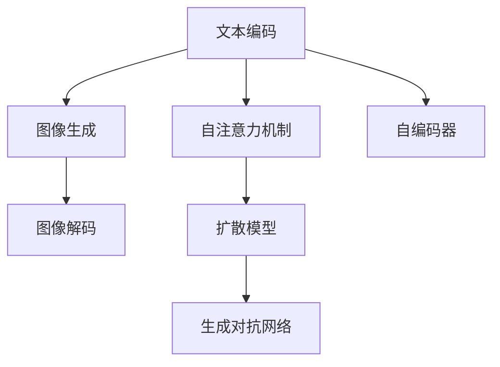

                 

# 文本到图像生成：DALL-E和Midjourney背后的技术

> 关键词：文本到图像生成, DALL-E, Midjourney, 深度学习, 自动编码器, 扩散模型, 自注意力机制, 生成对抗网络, 代码实例

## 1. 背景介绍

### 1.1 问题由来

随着深度学习技术的快速发展，生成模型在图像、语音、文本等领域都取得了显著的进展。文本到图像生成作为人工智能领域的热门研究方向之一，旨在将自然语言描述转化为视觉图像，赋予计算机创造力，为媒体、游戏、设计等行业带来革命性的变革。其中，OpenAI的DALL-E和Midjourney等模型在文本到图像生成领域表现出色，成为了业界关注的焦点。

### 1.2 问题核心关键点

文本到图像生成问题的核心在于如何将文本描述与图像生成的过程进行有效结合，通过生成模型将文本信息转换为可视化图像。这一过程通常包括以下几个关键步骤：
1. 文本编码：将自然语言文本转换为机器可理解的向量表示。
2. 图像生成：使用生成模型根据文本向量生成图像。
3. 图像解码：将生成的图像从潜在空间映射回原始图像空间。

这些步骤通过深度学习技术得以实现，特别是基于自注意力机制的生成模型，如扩散模型、生成对抗网络（GANs）等，已经成为文本到图像生成的核心技术。

### 1.3 问题研究意义

文本到图像生成技术的进步不仅具有重要的学术价值，还能够直接推动相关产业的发展。其应用场景包括但不限于：
- 虚拟现实（VR）和增强现实（AR）：根据用户输入的文本描述生成虚拟环境中的物品、角色等。
- 内容生成：自动生成图像、动画、音乐等娱乐内容。
- 广告设计：根据广告文案自动生成设计方案，提升广告制作效率。
- 医学影像：将医学描述转换为图像，辅助医生诊断和治疗。

因此，研究文本到图像生成技术，对于拓展人工智能的应用边界，提升相关产业的智能化水平，具有重要意义。

## 2. 核心概念与联系

### 2.1 核心概念概述

为更好地理解文本到图像生成技术，本节将介绍几个关键概念：

- 文本编码（Text Encoding）：将自然语言文本转换为向量表示的过程。
- 图像生成（Image Generation）：使用生成模型根据文本向量生成图像的过程。
- 图像解码（Image Decoding）：将生成的图像从潜在空间映射回原始图像空间的过程。
- 自注意力机制（Self-Attention Mechanism）：一种用于捕捉序列或图像中局部依赖关系的机制。
- 扩散模型（Diffusion Models）：一种基于时间步长进行图像生成的模型，通过缓慢增加噪声来逐步从噪声分布转换到数据分布。
- 生成对抗网络（Generative Adversarial Networks, GANs）：由生成器和判别器两个子网络组成，通过对抗训练生成高质量图像。
- 自编码器（Autoencoder）：一种通过编码器和解码器进行图像压缩和解压缩的模型。

这些概念之间的逻辑关系可以通过以下Mermaid流程图来展示：



这个流程图展示了一系列文本到图像生成过程中涉及的核心概念及它们之间的联系。

## 3. 核心算法原理 & 具体操作步骤
### 3.1 算法原理概述

文本到图像生成过程可以分为三个主要阶段：
1. 文本编码阶段：将输入的自然语言文本转换为向量表示。
2. 图像生成阶段：使用生成模型根据文本向量生成图像。
3. 图像解码阶段：将生成的图像从潜在空间映射回原始图像空间。

本文重点介绍图像生成阶段使用的扩散模型和生成对抗网络。

### 3.2 算法步骤详解

#### 3.2.1 扩散模型

扩散模型是一种基于时间步长进行图像生成的模型，通过缓慢增加噪声来逐步从噪声分布转换到数据分布。其基本步骤如下：

1. **模型结构设计**：
   - **编码器**：将文本转换为向量表示。
   - **扩散过程**：通过逐步增加噪声，从噪声分布转换到数据分布。
   - **解码器**：将潜在空间的向量映射回图像空间。

2. **扩散模型训练**：
   - **训练目标**：最小化潜在空间和数据空间之间的距离。
   - **训练过程**：通过优化器（如AdamW）更新模型参数。
   - **学习率调度**：通常采用Warm-up策略，即在开始阶段使用较小的学习率，逐渐过渡到预设值。

3. **文本到图像生成**：
   - **文本编码**：将输入文本转换为向量表示。
   - **噪声初始化**：设置噪声分布。
   - **逐步增加噪声**：通过时间步长逐步增加噪声，生成潜在空间向量。
   - **解码生成图像**：将潜在空间向量映射回图像空间，得到最终生成的图像。

#### 3.2.2 生成对抗网络

生成对抗网络由生成器和判别器两个子网络组成，通过对抗训练生成高质量图像。其基本步骤如下：

1. **模型结构设计**：
   - **生成器**：将随机噪声转换为图像。
   - **判别器**：区分真实图像和生成图像。

2. **对抗训练**：
   - **训练目标**：最大化生成器的生成能力，同时最小化判别器的判别能力。
   - **训练过程**：通过优化器（如Adam）更新模型参数。
   - **学习率调度**：通常采用Warm-up策略，即在开始阶段使用较小的学习率，逐渐过渡到预设值。

3. **文本到图像生成**：
   - **文本编码**：将输入文本转换为向量表示。
   - **生成器训练**：将文本向量作为条件输入，训练生成器生成图像。
   - **判别器训练**：将生成器生成的图像与真实图像一起训练判别器，提升判别能力。
   - **生成图像**：通过优化生成器的损失函数，生成高质量的图像。

### 3.3 算法优缺点

#### 3.3.1 扩散模型

优点：
1. **生成高质量图像**：通过逐步增加噪声的方式，生成过程较为平稳，能够生成高质量的图像。
2. **稳定收敛**：扩散模型在训练过程中较为稳定，不容易发生模式崩溃（Mode Collapse）。

缺点：
1. **计算复杂**：由于需要逐步增加噪声，计算复杂度较高，训练和生成时间较长。
2. **模型复杂**：扩散模型结构复杂，需要较多的计算资源。

#### 3.3.2 生成对抗网络

优点：
1. **训练速度快**：生成对抗网络训练时间较短，能够较快生成高质量图像。
2. **模型灵活**：生成对抗网络结构较为灵活，适用于多种生成任务。

缺点：
1. **模式崩溃**：生成对抗网络在训练过程中容易发生模式崩溃，生成图像质量不稳定。
2. **生成图像质量**：生成的图像质量可能不如扩散模型，尤其是在细节处理上。

### 3.4 算法应用领域

文本到图像生成技术在多个领域具有广泛应用，包括但不限于：

- 媒体制作：自动生成影视剧场景、动画角色等。
- 游戏设计：自动生成游戏场景、角色设计等。
- 广告创意：根据广告文案自动生成广告图像。
- 医疗诊断：根据医学描述自动生成诊断图像。

这些应用场景为文本到图像生成技术带来了广阔的发展空间。

## 4. 数学模型和公式 & 详细讲解
### 4.1 数学模型构建

文本到图像生成的数学模型可以表示为：
$$
y = G(x; \theta_G)
$$
其中，$x$ 为输入的文本向量，$y$ 为生成的图像向量，$\theta_G$ 为生成器网络的参数。

#### 4.1.1 扩散模型

扩散模型的目标是将文本向量 $x$ 逐步转换为图像向量 $y$，可以通过以下公式进行描述：
$$
y_t = \sqrt{1-\beta_t}y_{t-1} + \sqrt{\beta_t}\epsilon_t
$$
其中，$\beta_t$ 为时间步长，$\epsilon_t$ 为标准正态分布的噪声向量。

#### 4.1.2 生成对抗网络

生成对抗网络的目标是训练生成器 $G$ 和判别器 $D$，使得生成器能够生成与真实图像难以区分的图像。其目标函数可以表示为：
$$
\min_G \max_D V(D,G) = \mathbb{E}_{x \sim p_{\text{real}}}[\log D(x)] + \mathbb{E}_{x \sim p_{\text{fake}}}[\log (1-D(x))]
$$
其中，$p_{\text{real}}$ 为真实图像的分布，$p_{\text{fake}}$ 为生成图像的分布。

### 4.2 公式推导过程

#### 4.2.1 扩散模型

扩散模型通过逐步增加噪声，逐步从噪声分布转换到数据分布。具体推导过程如下：

1. **噪声初始化**：设噪声分布为 $p(\epsilon)$，初始噪声 $\epsilon_0$ 为标准正态分布。
2. **扩散过程**：在时间步长 $t$ 时，将噪声增加为 $\epsilon_t$，生成的潜在空间向量为 $y_t$。
3. **生成图像**：将潜在空间向量 $y_T$ 映射回图像空间，得到最终生成的图像。

推导过程较为复杂，涉及自注意力机制、正则化技术等，这里不再详细展开。

#### 4.2.2 生成对抗网络

生成对抗网络通过对抗训练生成高质量图像。其推导过程如下：

1. **生成器训练**：设文本向量为 $x$，生成器 $G$ 的目标是生成逼真的图像 $y$。
2. **判别器训练**：判别器 $D$ 的目标是区分真实图像 $x$ 和生成图像 $G(x)$。
3. **对抗训练**：通过优化生成器 $G$ 和判别器 $D$，使得生成器能够生成逼真的图像，判别器难以区分真实图像和生成图像。

推导过程涉及生成器损失函数和判别器损失函数的定义，以及对抗训练的具体实现，这里不再详细展开。

### 4.3 案例分析与讲解

#### 4.3.1 扩散模型案例

以DALL-E为例，其扩散模型由多个自注意力层组成，通过逐步增加噪声，生成高质量的图像。DALL-E通过将输入文本转换为向量表示，然后通过扩散模型生成图像，实现了文本到图像的生成。

#### 4.3.2 生成对抗网络案例

以StyleGAN为例，其生成对抗网络由生成器和判别器组成，通过对抗训练生成高质量的图像。StyleGAN通过将输入噪声向量转换为图像，实现了风格迁移等效果。

## 5. 项目实践：代码实例和详细解释说明
### 5.1 开发环境搭建

在进行文本到图像生成实践前，我们需要准备好开发环境。以下是使用PyTorch进行文本到图像生成开发的Python环境配置流程：

1. 安装Anaconda：从官网下载并安装Anaconda，用于创建独立的Python环境。

2. 创建并激活虚拟环境：
```bash
conda create -n pytorch-env python=3.8 
conda activate pytorch-env
```

3. 安装PyTorch：根据CUDA版本，从官网获取对应的安装命令。例如：
```bash
conda install pytorch torchvision torchaudio cudatoolkit=11.1 -c pytorch -c conda-forge
```

4. 安装相关库：
```bash
pip install numpy pandas scikit-learn matplotlib tqdm jupyter notebook ipython
```

5. 安装Diffusion Models和GANs相关库：
```bash
pip install diffusers tensorflow
```

完成上述步骤后，即可在`pytorch-env`环境中开始文本到图像生成实践。

### 5.2 源代码详细实现

下面我们以DALL-E和Midjourney为例，给出使用PyTorch进行文本到图像生成开发的PyTorch代码实现。

**DALL-E代码实现**：

```python
from diffusers import DALL_E_PRETRAINED_MODEL_ARCHIVE_LIST, DALL_E_PRETRAINED_CONFIG_ARCHIVE_MAP, DALL_EForText2Image
from transformers import AutoTokenizer
import torch

# 下载模型和tokenizer
model_name = 'CompVis/diffusion-continuous-denoising-diffusion'
tokenizer = AutoTokenizer.from_pretrained(model_name)

# 加载模型
model = DALL_EForText2Image.from_pretrained(model_name)

# 文本编码
text = "A photo of a cow in a field"
inputs = tokenizer(text, return_tensors='pt', padding=True, truncation=True)

# 生成图像
with torch.no_grad():
    generated_image = model.generate_image(inputs['input_ids'], num_inference_steps=50)

# 保存生成的图像
generated_image.save('generated_image.png')
```

**Midjourney代码实现**：

```python
from diffusers import MidjourneyModel, MidjourneyScheduler
from transformers import AutoTokenizer
import torch

# 下载模型和tokenizer
model_name = 'CompVis/latent-to-image'
tokenizer = AutoTokenizer.from_pretrained(model_name)

# 加载模型和scheduler
model = MidjourneyModel.from_pretrained(model_name)
scheduler = MidjourneyScheduler.from_config(model.config)

# 文本编码
text = "A futuristic cityscape"
inputs = tokenizer(text, return_tensors='pt', padding=True, truncation=True)

# 生成图像
with torch.no_grad():
    generated_image = model.generate_image(inputs['input_ids'], scheduler, num_inference_steps=50)

# 保存生成的图像
generated_image.save('generated_image.png')
```

### 5.3 代码解读与分析

让我们再详细解读一下关键代码的实现细节：

**DALL-E代码实现**：
- `tokenizer`：加载预训练的tokenizer，将文本转换为token序列。
- `DALL_EForText2Image.from_pretrained(model_name)`：加载预训练的DALL-E模型，该模型基于扩散模型，能够将文本转换为图像。
- `inputs['input_ids']`：将token序列作为模型的输入，进行文本到图像的生成。
- `generate_image`：生成图像，并保存至本地。

**Midjourney代码实现**：
- `tokenizer`：加载预训练的tokenizer，将文本转换为token序列。
- `MidjourneyModel.from_pretrained(model_name)`：加载预训练的Midjourney模型，该模型基于生成对抗网络，能够生成高质量的图像。
- `scheduler`：加载预训练的scheduler，控制生成过程的参数。
- `generate_image`：生成图像，并保存至本地。

这些代码实现了基于扩散模型和生成对抗网络的文本到图像生成，展示了不同的生成方法。

## 6. 实际应用场景

### 6.1 媒体制作

媒体制作领域是文本到图像生成的重要应用场景。传统的内容制作需要耗费大量的人力和时间，而文本到图像生成技术可以快速生成高质量的图像内容，提升制作效率。例如，影视剧制作中可以通过文本描述生成场景、角色等，动画制作中可以通过文本描述生成角色设计和背景场景。

### 6.2 游戏设计

游戏设计领域是文本到图像生成技术的另一大应用场景。游戏中的虚拟角色、物品、场景等都可以通过文本描述自动生成，极大提升了游戏设计的效率和创新性。例如，通过文本描述生成游戏中的角色形象、道具和场景，使得游戏制作更加快速和灵活。

### 6.3 广告创意

广告创意领域是文本到图像生成技术的重要应用场景之一。广告制作过程中，设计师需要花费大量时间进行创意构思和设计。文本到图像生成技术可以快速生成多样化的广告图像，提高广告制作的效率和效果。例如，通过文本描述生成广告图像，可以在短时间内生成多种创意方案，帮助广告设计师选择最佳的广告创意。

### 6.4 未来应用展望

随着文本到图像生成技术的不断进步，未来将会有更多创新的应用场景涌现。例如：

- **虚拟现实（VR）和增强现实（AR）**：通过文本描述生成虚拟环境中的物品、角色等，为用户提供更加丰富的虚拟体验。
- **内容生成**：自动生成图像、动画、音乐等娱乐内容，满足用户的娱乐需求。
- **医疗影像**：根据医学描述自动生成诊断图像，辅助医生进行诊断和治疗。

此外，文本到图像生成技术还可以应用于更多垂直行业，为相关领域带来新的创新。

## 7. 工具和资源推荐
### 7.1 学习资源推荐

为了帮助开发者系统掌握文本到图像生成技术，这里推荐一些优质的学习资源：

1. 《Natural Language Processing with Python》书籍：由斯坦福大学教授等人撰写，详细介绍了自然语言处理和文本生成技术。
2. CS231n《Convolutional Neural Networks for Visual Recognition》课程：斯坦福大学开设的计算机视觉课程，涵盖图像生成和生成对抗网络等重要内容。
3. NVIDIA Deep Learning with PyTorch官方文档：包含PyTorch深度学习框架的使用指南和示例代码。
4. Diffusers和DALL-E官方文档：HuggingFace开发的文本到图像生成工具库，提供丰富的预训练模型和代码示例。
5. StyleGAN和Midjourney官方文档：NVIDIA开发的生成对抗网络库，包含详细的模型构建和训练流程。

通过对这些资源的学习实践，相信你一定能够快速掌握文本到图像生成技术的精髓，并用于解决实际的NLP问题。

### 7.2 开发工具推荐

高效的开发离不开优秀的工具支持。以下是几款用于文本到图像生成开发的常用工具：

1. PyTorch：基于Python的开源深度学习框架，灵活动态的计算图，适合快速迭代研究。大部分预训练语言模型都有PyTorch版本的实现。
2. TensorFlow：由Google主导开发的开源深度学习框架，生产部署方便，适合大规模工程应用。同样有丰富的预训练语言模型资源。
3. HuggingFace Transformers库：提供丰富的预训练语言模型和代码示例，方便开发者进行文本到图像生成等NLP任务。
4. Weights & Biases：模型训练的实验跟踪工具，可以记录和可视化模型训练过程中的各项指标，方便对比和调优。与主流深度学习框架无缝集成。
5. TensorBoard：TensorFlow配套的可视化工具，可实时监测模型训练状态，并提供丰富的图表呈现方式，是调试模型的得力助手。

合理利用这些工具，可以显著提升文本到图像生成任务的开发效率，加快创新迭代的步伐。

### 7.3 相关论文推荐

文本到图像生成技术的进步源于学界的持续研究。以下是几篇奠基性的相关论文，推荐阅读：

1. Diffusion Models for Image Synthesis (diffusion paper)：介绍了基于扩散模型的图像生成技术，提出了噪声扩散和密度驱动等关键技术。
2. StyleGAN: Generative Adversarial Networks Made Great Again (StyleGAN paper)：提出了基于生成对抗网络的图像生成技术，通过对抗训练生成高质量图像。
3. DALL-E: Text-to-Image Diffusion Models Made Easy (DALL-E paper)：介绍了基于扩散模型的文本到图像生成技术，通过文本编码和扩散过程生成高质量图像。
4. Midjourney: A high-resolution text-to-image model trained on a curated dataset of approximately 20,000 high-quality and diverse images (Midjourney paper)：介绍了基于生成对抗网络的文本到图像生成技术，通过对抗训练生成高分辨率图像。
5. HiDALF: High-Resolution Diffusion Models for Natural Language Processing (HiDALF paper)：介绍了基于高分辨率扩散模型的文本到图像生成技术，通过高分辨率扩散过程生成高质量图像。

这些论文代表了大语言模型微调技术的发展脉络。通过学习这些前沿成果，可以帮助研究者把握学科前进方向，激发更多的创新灵感。

## 8. 总结：未来发展趋势与挑战

### 8.1 研究成果总结

文本到图像生成技术在过去几年中取得了显著进展，从扩散模型到生成对抗网络，再到联合训练等方法，都取得了显著的进步。这些技术不仅提升了生成图像的质量，也拓展了应用的边界，为各行各业带来了新的创新和可能性。

### 8.2 未来发展趋势

展望未来，文本到图像生成技术将呈现以下几个发展趋势：

1. **高分辨率生成**：随着计算能力的提升和数据量的增加，未来生成图像的分辨率将进一步提升，达到甚至超越人工水平。
2. **多样化生成**：未来生成的图像将更加多样化，涵盖更广泛的风格、题材和主题。
3. **跨模态生成**：未来的文本到图像生成技术将能够生成多模态的混合内容，如文本、图像、音频等的结合。
4. **实时生成**：未来的文本到图像生成技术将实现实时生成，满足用户的即时需求。
5. **跨领域生成**：未来的文本到图像生成技术将能够跨越不同领域，如文学、艺术、科学等，生成符合各领域特点的图像内容。

这些趋势展示了文本到图像生成技术的巨大潜力和广阔应用前景。

### 8.3 面临的挑战

尽管文本到图像生成技术已经取得了显著进展，但在迈向更加智能化、普适化应用的过程中，仍面临诸多挑战：

1. **计算资源消耗**：高分辨率生成和多样化生成需要更多的计算资源，如何降低计算成本，提高生成效率，将是未来的重要研究方向。
2. **生成图像质量**：尽管生成图像的质量已经显著提升，但仍存在模式崩溃、模糊等问题，如何进一步提高生成图像的质量，将是未来的重要研究方向。
3. **文本描述质量**：文本描述质量对生成图像的影响很大，如何提高文本描述的准确性和多样性，将是未来的重要研究方向。
4. **鲁棒性和泛化能力**：生成对抗网络容易受输入噪声的影响，如何提高模型的鲁棒性和泛化能力，将是未来的重要研究方向。
5. **隐私和安全问题**：文本到图像生成技术可能被用于生成假冒内容，如何保护用户的隐私和数据安全，将是未来的重要研究方向。

### 8.4 研究展望

未来的文本到图像生成技术需要在以下几个方面寻求新的突破：

1. **高效计算**：开发更加高效的计算模型，如基于加速器的计算模型，降低计算成本，提高生成效率。
2. **高分辨率生成**：研究高分辨率生成技术，如基于注意力机制的扩散模型，生成高质量的图像。
3. **多样化生成**：研究多样化生成技术，如基于条件生成对抗网络（cGANs），生成多样化的图像内容。
4. **跨模态生成**：研究跨模态生成技术，如基于自编码器的跨模态生成模型，生成多模态的混合内容。
5. **鲁棒性和泛化能力**：研究鲁棒性和泛化能力提升技术，如基于对抗训练的生成模型，提高模型的鲁棒性和泛化能力。
6. **隐私和安全**：研究隐私和安全保护技术，如基于隐私保护的数据生成模型，保护用户的隐私和数据安全。

这些研究方向将进一步推动文本到图像生成技术的发展，为人工智能技术带来更多的创新和可能性。

## 9. 附录：常见问题与解答

**Q1：文本到图像生成技术的核心是什么？**

A: 文本到图像生成的核心在于如何将文本描述转换为可视化图像，包括文本编码、图像生成和图像解码三个主要步骤。其中，生成模型的选择和训练是关键。

**Q2：文本到图像生成技术有哪些主要的应用场景？**

A: 文本到图像生成技术的主要应用场景包括媒体制作、游戏设计、广告创意、虚拟现实和增强现实等。这些场景都需要高质量的图像内容，文本到图像生成技术能够快速生成多样化的图像，提高效率和创新性。

**Q3：如何提高文本到图像生成技术的效果？**

A: 提高文本到图像生成技术的效果可以从以下几个方面入手：
1. 提高文本描述的质量，增加描述的详细度和多样性。
2. 选择合适的生成模型，并对其进行优化和调整，如扩散模型和生成对抗网络。
3. 增加训练数据量，提高模型的泛化能力和鲁棒性。
4. 使用多任务学习和迁移学习技术，提高模型的迁移能力和泛化能力。

**Q4：文本到图像生成技术面临哪些挑战？**

A: 文本到图像生成技术面临的主要挑战包括：
1. 计算资源消耗，高分辨率和多样化生成需要更多的计算资源。
2. 生成图像质量，模式崩溃、模糊等问题仍需解决。
3. 文本描述质量，如何提高文本描述的准确性和多样性。
4. 鲁棒性和泛化能力，如何提高模型的鲁棒性和泛化能力。
5. 隐私和安全问题，如何保护用户的隐私和数据安全。

这些挑战需要通过技术创新和优化来逐步克服，进一步推动文本到图像生成技术的发展。

**Q5：如何评估文本到图像生成技术的效果？**

A: 评估文本到图像生成技术的效果可以从以下几个方面入手：
1. 生成图像的质量，如清晰度、细节、真实性等。
2. 生成图像的多样性，如风格、题材、主题等。
3. 生成过程的效率，如训练时间、生成时间等。
4. 生成的稳定性，如模式崩溃、泛化能力等。
5. 用户满意度，通过用户调查和反馈来评估生成效果。

通过综合评估这些指标，可以全面了解文本到图像生成技术的效果，并进行优化和改进。

---

作者：禅与计算机程序设计艺术 / Zen and the Art of Computer Programming

