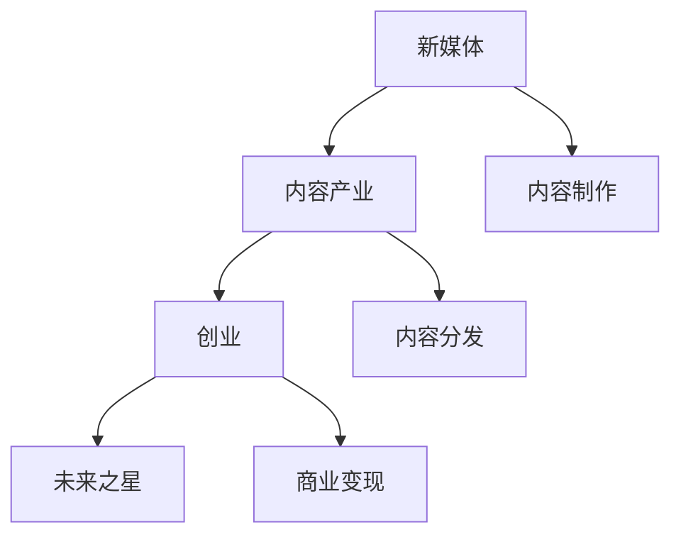

                 

# 新媒体创业：内容产业的未来之星

> 关键词：新媒体,内容产业,创业,未来之星

## 1. 背景介绍

### 1.1 问题由来
随着互联网的快速普及和智能设备的广泛应用，新媒体产业迎来了空前的繁荣与发展。传统的电视、报纸、杂志等媒体正逐渐被各种新型传播渠道所取代，如社交网络、博客、播客、视频平台等。这种转变不仅改变了人们的获取信息的方式，也催生了一系列新的商业模式和机会。

新媒体创业，是指依托新兴传播渠道，以原创内容为核心，通过在线平台和数字化手段进行内容传播与运营，实现商业价值变现的过程。它涵盖了从内容创作、内容分发、用户互动到商业变现等多个环节，是一个极具潜力和创新性的领域。

### 1.2 问题核心关键点
新媒体创业的核心在于内容的制作、分发和商业变现。内容是吸引用户和实现商业价值的关键，而分发渠道和变现模式的创新则是实现商业化的关键。

1. **内容制作**：原创内容的生产是新媒体创业的基础。这包括文字、图片、视频、音频等多种形式的内容创作。高质量、有价值的内容能够吸引更多的用户关注，进而带来流量和商业价值。

2. **内容分发**：选择合适的分发渠道，将内容传递给目标受众。这包括自建平台、第三方平台以及社交媒体等多种方式。分发策略和渠道选择对内容的覆盖范围和用户互动有着重要影响。

3. **商业变现**：通过广告、会员订阅、付费内容、电商导流等方式实现商业变现。变现策略的创新和优化直接影响企业的盈利能力。

## 2. 核心概念与联系

### 2.1 核心概念概述

为了更好地理解新媒体创业的原理和架构，本节将介绍几个密切相关的核心概念：

- **新媒体**：指利用互联网技术，通过多种新兴媒体平台进行信息传播和内容展示的媒体形态，如社交网络、博客、播客、视频平台等。
- **内容产业**：以内容为核心，通过数字化手段进行内容创作、分发和变现的产业。新媒体是内容产业的重要组成部分，具有高度创新性和融合性。
- **创业**：指利用创新和市场机会，进行从0到1的商业模式创新和市场拓展的过程。新媒体创业是创业的一种形式，具有高风险和高回报的特点。
- **未来之星**：指在新媒体行业中具有巨大潜力，能够引领未来发展的创业者和企业。这些未来之星通常具备独特的商业模式、强大的内容生产能力和创新的分发渠道。

这些概念之间的逻辑关系可以通过以下Mermaid流程图来展示：



这个流程图展示了几大核心概念及其之间的关系：

1. 新媒体是内容产业的重要组成部分。
2. 新媒体创业是创业的一种形式。
3. 内容制作、分发和商业变现是新媒体创业的三个关键环节。
4. 未来之星是新媒体创业中的佼佼者，具备独特的竞争优势和引领能力。

## 3. 核心算法原理 & 具体操作步骤
### 3.1 算法原理概述

新媒体创业的核心算法原理基于信息论和行为经济学。其核心思想是：通过内容创作和分发，最大化信息的有效传递，同时最大化用户的参与度和商业价值。

在信息传递过程中，核心在于内容的创新性和吸引力，以及分发渠道的选择和优化。而在商业变现过程中，关键在于对用户行为和市场需求的精准洞察，以及变现模式的创新。

### 3.2 算法步骤详解

新媒体创业的算法步骤主要包括以下几个关键环节：

**Step 1: 内容制作与优化**
- 定义目标受众和内容类型：根据受众的兴趣和行为，确定内容的主题和形式。
- 内容创作与质量控制：创作高质量、有价值的内容，并进行严格的质量控制和审核。
- 内容多样化与更新：定期更新内容，并多样化内容形式，如短视频、直播、图文、音频等。

**Step 2: 内容分发与渠道选择**
- 分析受众特征和平台特性：了解受众的使用习惯和平台特性，选择最适合的分发渠道。
- 内容发布与优化：在选定渠道上发布内容，并通过A/B测试、用户反馈等手段不断优化内容分发策略。
- 渠道扩展与多元化：逐步扩展分发渠道，并探索更多元化的分发方式，如社交媒体、视频平台、播客等。

**Step 3: 商业变现与模式创新**
- 市场调研与需求分析：通过市场调研和数据分析，识别目标受众的付费意愿和需求。
- 变现策略与方案设计：根据受众需求和市场趋势，设计合适的变现策略，如广告、会员订阅、付费内容等。
- 数据驱动与动态调整：利用大数据和人工智能技术，实时监测变现效果，并动态调整变现策略。

### 3.3 算法优缺点

新媒体创业的算法具有以下优点：

1. **高效率**：通过数字化手段进行内容制作和分发，大大提高了效率和覆盖范围。
2. **高互动性**：利用社交媒体等渠道，增强了用户互动和参与度，提升了用户体验。
3. **灵活性**：分发渠道和变现模式的创新，带来了更高的灵活性和多样性。
4. **可量化的评估**：通过数据分析和算法优化，可以实时监测和评估效果，提供科学的决策依据。

同时，该算法也存在一些缺点：

1. **资源投入大**：高质量内容的制作和分发需要大量的资源投入，包括人力、物力和时间。
2. **竞争激烈**：新媒体市场竞争激烈，内容同质化现象严重，难以形成独特的竞争优势。
3. **用户粘性低**：用户流失率高，用户忠诚度难以保障。
4. **盈利模式单一**：目前新媒体创业的盈利模式相对单一，过度依赖广告和会员订阅。
5. **技术要求高**：内容分发的技术要求高，需要不断进行技术更新和升级。

尽管存在这些局限性，但新媒体创业以其高效、互动、灵活和可量化的特点，仍然吸引了大量的创业者和投资者。未来，随着技术的进步和市场的成熟，新媒体创业必将在内容产业中占据更加重要的地位。

### 3.4 算法应用领域

新媒体创业的应用领域非常广泛，涵盖了文字、图片、视频、音频等多种形式的内容传播和运营。以下是几个典型的应用场景：

- **短视频平台**：如抖音、快手等，通过短视频内容吸引用户，并通过广告、电商导流等方式实现商业变现。
- **播客和播客平台**：如Spotify、Apple Podcasts等，通过音频内容提供个性化推荐，并通过订阅服务变现。
- **在线教育平台**：如Coursera、Udemy等，通过高质量课程吸引用户，并通过课程订阅和付费咨询变现。
- **新闻和资讯平台**：如腾讯新闻、BBC News等，通过提供有价值的新闻资讯，通过广告和订阅服务变现。
- **社交媒体平台**：如微信、微博、Facebook等，通过社交互动和内容展示，实现用户增长和商业变现。

## 4. 数学模型和公式 & 详细讲解  
### 4.1 数学模型构建

本节将使用数学语言对新媒体创业的算法原理进行更加严格的刻画。

假设新媒体创业的目标是最大化信息传递效率和用户参与度，即最大化内容分发的用户覆盖率和互动率。令 $U$ 为目标用户群体，$I$ 为内容集合，$C$ 为分发渠道集。

定义每个用户对内容的兴趣度为 $I_u$，每个内容对用户的吸引力为 $C_i$。分发渠道对用户的覆盖率、用户的参与度和内容的相关性分别为 $C_u$、$P_u$ 和 $R_{iu}$。

新媒体创业的数学模型为：

$$
\max_{I} \sum_{u \in U} \max_{i \in I} [I_u \cdot C_i \cdot C_u \cdot P_u \cdot R_{iu}]
$$

在实际应用中，需要结合内容的制作、分发和变现等环节进行综合优化。

### 4.2 公式推导过程

假设每个用户对内容的兴趣度 $I_u$ 服从二项分布，内容对用户的吸引力 $C_i$ 服从正态分布，分发渠道对用户的覆盖率 $C_u$ 和参与度 $P_u$ 也服从正态分布。内容的相关性 $R_{iu}$ 可以表示为内容的文本相似度、用户标签和内容主题等特征的综合评估结果。

根据贝叶斯定理和信息熵理论，可以将新媒体创业的数学模型转化为：

$$
\max_{I} \sum_{u \in U} \max_{i \in I} [I_u \cdot C_i \cdot C_u \cdot P_u \cdot R_{iu}] = \max_{I} \sum_{u \in U} [I_u \cdot \mathbb{E}[C_i \cdot C_u \cdot P_u \cdot R_{iu}] \cdot \log \frac{1}{I_u \cdot \mathbb{E}[C_i \cdot C_u \cdot P_u \cdot R_{iu}]}
$$

在实际计算中，可以采用梯度上升算法或遗传算法等优化算法，求解上述最大化问题，得到最优的内容和分发策略。

### 4.3 案例分析与讲解

以抖音短视频平台的为例，分析其内容制作、分发和变现策略。

**内容制作**：
- 采用PGC（专业内容制作）和UGC（用户生成内容）相结合的策略，提升内容的丰富性和多样性。
- 利用大数据分析用户兴趣，制作个性化内容，增加用户粘性。
- 定期推出热门挑战和话题，激发用户创作热情。

**内容分发**：
- 在主要分发渠道如抖音首页、推荐流等位置展示热门内容，提高曝光率。
- 利用算法推荐系统，根据用户兴趣和行为实时推送个性化内容。
- 通过与第三方平台的合作，扩大分发渠道，如知乎、微博等。

**商业变现**：
- 通过广告系统，向品牌方提供精准的广告投放服务。
- 推出会员服务，提供专属内容和个性化推荐。
- 利用电商导流功能，将用户引流至抖音商城进行购物。

## 5. 项目实践：代码实例和详细解释说明
### 5.1 开发环境搭建

在进行新媒体创业的开发实践前，我们需要准备好开发环境。以下是使用Python进行开发的环境配置流程：

1. 安装Anaconda：从官网下载并安装Anaconda，用于创建独立的Python环境。

2. 创建并激活虚拟环境：
```bash
conda create -n media-dev python=3.8 
conda activate media-dev
```

3. 安装开发依赖包：
```bash
pip install Flask requests opencv-python scikit-learn pandas numpy
```

4. 安装前后端框架：
```bash
pip install flask-restful gunicorn
```

5. 安装可视化工具：
```bash
pip install matplotlib seaborn
```

完成上述步骤后，即可在`media-dev`环境中开始新媒体创业的开发实践。

### 5.2 源代码详细实现

下面以一个简单的在线教育平台为例，给出使用Flask框架进行开发的新媒体创业项目代码实现。

首先，定义一个简单的Flask应用：

```python
from flask import Flask, request, jsonify

app = Flask(__name__)

@app.route('/api/course', methods=['GET'])
def get_courses():
    courses = ['Python基础', '深度学习', '机器学习']
    return jsonify(courses)
```

接着，定义用户数据和课程数据：

```python
# 用户数据
users = {'Alice': {'age': 25, 'interests': ['Python', '数据科学']},
         'Bob': {'age': 30, 'interests': ['深度学习', '自然语言处理']},
         'Charlie': {'age': 35, 'interests': ['机器学习', '强化学习']}}

# 课程数据
courses = {'Python基础': ['基础语法', '数据结构', '算法设计'],
           '深度学习': ['神经网络', '深度学习框架', '模型优化'],
           '机器学习': ['监督学习', '无监督学习', '模型评估']}
```

然后，定义推荐算法函数，根据用户兴趣推荐课程：

```python
def recommend_course(user_id):
    user = users[user_id]
    similarity = {}
    for course in courses:
        if user['interests'].count(course.split('_')[0]) > 0:
            similarity[course] = 1
        else:
            similarity[course] = 0
    return sorted(courses, key=lambda x: similarity[x], reverse=True)[0]
```

最后，启动Flask应用，进行课程推荐：

```python
if __name__ == '__main__':
    app.run(debug=True)
```

这个简单的Flask应用实现了根据用户兴趣推荐课程的功能。可以看到，通过数据驱动的方式，可以灵活地进行内容推荐，提升用户体验和平台粘性。

### 5.3 代码解读与分析

让我们再详细解读一下关键代码的实现细节：

**Flask应用**：
- `app = Flask(__name__)`：创建Flask应用实例。
- `@app.route('/api/course', methods=['GET'])`：定义路由，指定请求方法为GET。
- `def get_courses()`：实现GET请求的处理逻辑，返回课程列表。

**用户数据和课程数据**：
- 使用Python字典存储用户数据和课程数据，方便后续的推荐算法处理。

**推荐算法函数**：
- 定义`recommend_course`函数，根据用户兴趣和课程内容计算相似度，并按相似度排序，返回最推荐的课程。

**Flask应用启动**：
- `if __name__ == '__main__':`：确保应用只有在直接运行时才启动。
- `app.run(debug=True)`：启动Flask应用，并开启调试模式。

可以看到，Flask框架提供了简单易用的接口，使得开发者可以快速搭建和部署新媒体创业项目。

当然，实际的媒体创业项目涉及更多复杂的功能，如用户管理、课程管理、订单管理等，需要进一步扩展和完善。

## 6. 实际应用场景
### 6.1 智能内容推荐

智能内容推荐是新媒体创业的重要应用场景之一。通过大数据分析和机器学习技术，可以对用户行为和兴趣进行精准分析，从而推荐个性化的内容。

以视频平台为例，通过对用户观看历史、点赞、评论等行为的分析，可以构建用户画像，并基于相似性算法推荐相关视频内容。这种方式能够显著提升用户粘性和平台留存率。

### 6.2 实时内容更新

实时内容更新是提升新媒体平台用户互动和参与度的重要手段。通过社交媒体平台，可以实时发布动态内容，增强用户的即时参与感。

以微博为例，通过发布实时新闻、事件评论、热门话题等内容，可以吸引用户的关注和互动，提升平台的热度和活跃度。

### 6.3 个性化定制内容

个性化定制内容是提升用户体验的关键。通过对用户兴趣和行为的深入分析，可以提供个性化的内容推荐和定制化服务。

以在线教育平台为例，根据用户的过往学习记录、测试成绩、兴趣爱好等信息，可以提供定制化的课程推荐和个性化学习计划。

### 6.4 未来应用展望

随着技术的进步和市场的成熟，新媒体创业将迎来更多创新和突破，展现出广阔的前景。

未来，新媒体创业将更多地依赖人工智能和大数据技术，通过智能推荐、实时更新和个性化定制，提升用户互动和平台粘性。同时，结合虚拟现实(VR)、增强现实(AR)等新技术，新媒体内容将更加丰富和互动，带来全新的用户体验。

## 7. 工具和资源推荐
### 7.1 学习资源推荐

为了帮助开发者系统掌握新媒体创业的理论基础和实践技巧，这里推荐一些优质的学习资源：

1. 《新媒体营销与运营》系列课程：由行业专家讲授，涵盖新媒体营销、内容运营、用户互动等多个方面，全面提升新媒体创业能力。
2. 《内容营销》书籍：介绍内容营销的理论和实践，提供从内容创作到内容传播的全方位指导。
3. 《数据驱动的媒体创业》课程：聚焦于数据和算法在新媒体创业中的应用，通过实际案例分析提升实战能力。
4. 《人工智能与新媒体》课程：结合人工智能技术，介绍在新媒体内容创作和运营中的应用。
5. 《内容生态系统建设》课程：介绍如何构建和运营新媒体平台，打造内容生态系统。

通过对这些资源的学习实践，相信你一定能够快速掌握新媒体创业的精髓，并用于解决实际的媒体创业问题。

### 7.2 开发工具推荐

高效的开发离不开优秀的工具支持。以下是几款用于新媒体创业开发的常用工具：

1. Flask：轻量级的Python Web应用框架，简单易用，适合快速迭代研究。
2. Django：功能强大的Python Web应用框架，提供完整的MVC框架和数据库集成。
3. React.js：用于前端开发的JavaScript库，支持组件化和数据绑定，提升开发效率。
4. Docker：开源的容器化平台，支持应用的可移植性和自动化部署。
5. GitLab：提供代码管理、持续集成、项目管理等功能，提升团队协作效率。
6. Jupyter Notebook：交互式的编程环境，支持代码块、数学公式和可视化展示。

合理利用这些工具，可以显著提升新媒体创业的开发效率，加快创新迭代的步伐。

### 7.3 相关论文推荐

新媒体创业领域的研究源于学界的持续探索和实践经验的积累。以下是几篇奠基性的相关论文，推荐阅读：

1. 《Content Mining and Analysis of Social Media: A Survey》：对社交媒体内容挖掘和分析的全面综述，提供了大量的实践案例和技术思路。
2. 《User-Centered Media Design: A Critical Review of Findings from a Meta-Synthesis of Research》：从用户角度出发，综述了媒体设计的最新研究成果，提供了深刻的理论指导。
3. 《The Rise of the Creative Economy》：介绍了创意产业的兴起和发展，探讨了新媒体创业的潜力和机遇。
4. 《The Business of Media: A Managerial Approach》：从商业角度分析媒体创业，提供了实用的管理和运营策略。
5. 《Data-Driven Media Strategy: An Overview》：介绍了数据驱动的媒体策略，提供了丰富的实践经验和数据驱动的实战案例。

这些论文代表了大媒体创业研究的发展脉络。通过学习这些前沿成果，可以帮助研究者把握学科前进方向，激发更多的创新灵感。

## 8. 总结：未来发展趋势与挑战
### 8.1 总结

本文对新媒体创业的算法原理和操作步骤进行了全面系统的介绍。首先阐述了新媒体创业的背景和意义，明确了内容制作、分发和商业变现三个关键环节。其次，从原理到实践，详细讲解了算法的基本思路和具体实现。最后，探讨了新媒体创业的未来发展趋势和面临的挑战。

通过本文的系统梳理，可以看到，新媒体创业以其高效率、高互动性和可量化的特点，在内容产业中占据了越来越重要的地位。它不仅是一种商业模式，更是一种创新文化，推动了整个内容产业的数字化、智能化转型。未来，随着技术的进步和市场的成熟，新媒体创业必将在内容产业中占据更加重要的地位，为社会和经济发展带来深远影响。

### 8.2 未来发展趋势

展望未来，新媒体创业将呈现以下几个发展趋势：

1. **内容多样化**：随着5G等新技术的普及，多媒体内容的传播和消费将更加普及。视频、音频、直播、AR/VR等新形式的内容将极大地丰富新媒体平台的用户体验。
2. **技术融合**：新媒体创业将更多地结合人工智能、大数据、区块链等前沿技术，提升内容的智能化和安全性。
3. **市场细分化**：针对不同受众和市场，提供更加个性化的内容和产品，满足多样化需求。
4. **商业模式多元化**：除了传统的广告和订阅模式，还将探索更多元化的变现方式，如知识付费、众筹等。
5. **数据驱动决策**：通过大数据分析，实时监测用户行为和市场变化，动态调整内容策略和商业策略。
6. **全球化扩展**：新媒体内容将跨越地域和语言的限制，全球化传播和运营将成为常态。

以上趋势凸显了新媒体创业的广阔前景。这些方向的探索发展，必将进一步提升新媒体内容的传播效果和商业价值，为内容产业带来新的突破。

### 8.3 面临的挑战

尽管新媒体创业具有巨大的潜力，但在迈向更加智能化、普适化应用的过程中，仍面临诸多挑战：

1. **内容质量参差不齐**：尽管平台的技术水平在提升，但用户生成内容的质量仍然参差不齐，需要更多的审核和筛选机制。
2. **商业模式单一**：目前新媒体创业的盈利模式相对单一，过度依赖广告和订阅，缺乏多元化收入来源。
3. **用户流失率高**：用户忠诚度低，流失率高，难以维持长期的稳定增长。
4. **技术壁垒高**：平台需要不断进行技术更新和升级，以保持竞争优势，但技术壁垒较高，非技术背景的企业难以实现。
5. **法律和伦理风险**：内容传播涉及隐私保护、版权问题、虚假信息等法律和伦理风险，需要企业具备较高的法律合规能力。

正视新媒体创业面临的这些挑战，积极应对并寻求突破，将是新媒体创业走向成熟的必由之路。相信随着技术的进步和市场的成熟，新媒体创业必将在内容产业中占据更加重要的地位，为经济社会发展带来新的动力。

### 8.4 研究展望

面对新媒体创业所面临的种种挑战，未来的研究需要在以下几个方面寻求新的突破：

1. **内容质量提升**：探索内容审核、筛选、推荐等技术手段，提升内容质量和用户体验。
2. **多元化变现模式**：结合电商、知识付费、直播等多元化变现模式，探索新的收入来源。
3. **用户粘性提升**：通过个性化推荐、互动等手段，提高用户粘性和平台留存率。
4. **技术融合创新**：结合AI、大数据、区块链等技术，提升内容的智能化、个性化和安全性。
5. **全球化扩展**：探索跨语言、跨文化的内容创作和传播策略，实现全球化运营。

这些研究方向的探索，必将引领新媒体创业技术迈向更高的台阶，为内容产业带来新的突破。面向未来，新媒体创业技术还需要与其他人工智能技术进行更深入的融合，如知识表示、因果推理、强化学习等，多路径协同发力，共同推动新媒体内容的传播和运营。只有勇于创新、敢于突破，才能不断拓展新媒体创业的边界，让内容产业进入全新的发展阶段。

## 9. 附录：常见问题与解答
### 9.1 问题一：如何提升内容质量和用户体验？

**答**：提升内容质量和用户体验是新媒体创业成功的关键。以下是一些有效的策略：

1. **内容审核机制**：建立严格的内容审核机制，确保内容符合平台规定和法律法规。
2. **用户生成内容的筛选**：通过算法和人工审核筛选优质内容，提升内容质量。
3. **个性化推荐**：利用大数据和机器学习技术，根据用户行为和兴趣进行个性化推荐，提升用户体验。
4. **互动和反馈机制**：建立互动和反馈机制，通过用户评论、评分等方式收集用户反馈，优化内容。
5. **内容多样化**：通过多种形式的内容创作和传播，满足用户多样化需求，提升平台粘性。

通过这些策略，可以显著提升内容质量和用户体验，增强用户参与度和平台留存率。

### 9.2 问题二：如何应对内容创业的市场竞争？

**答**：内容创业的市场竞争激烈，以下是一些应对策略：

1. **差异化定位**：找到独特的市场定位和竞争优势，避免同质化竞争。
2. **优质内容制作**：投入更多资源制作高质量内容，提升内容竞争力。
3. **多样化内容形式**：结合视频、音频、直播等多种形式，丰富内容形式。
4. **用户互动和参与**：通过社交互动、用户生成内容等方式，提升用户参与度和忠诚度。
5. **持续创新**：不断进行技术创新和内容创新，保持竞争优势。

通过这些策略，可以增强内容的吸引力和平台竞争力，在激烈的市场竞争中占据优势。

### 9.3 问题三：如何实现内容创业的商业变现？

**答**：实现商业变现是内容创业的核心目标。以下是一些有效的变现策略：

1. **广告系统**：通过精准的广告投放，实现流量变现。
2. **会员订阅**：提供优质内容，通过会员订阅方式实现长期收益。
3. **付费内容**：提供专属付费内容，实现高价值变现。
4. **电商导流**：通过内容引导用户进入电商平台，实现电商导流变现。
5. **直播和付费直播**：通过直播和付费直播方式，实现实时变现。

通过这些策略，可以实现多元化的商业变现，提升平台盈利能力。

---

作者：禅与计算机程序设计艺术 / Zen and the Art of Computer Programming

