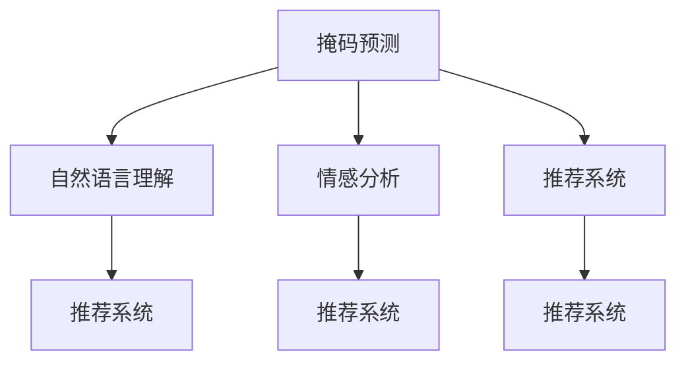

                 

# 新闻推荐的创新技术：掩码预测与Prompt工程

## 1. 背景介绍

在信息爆炸的互联网时代，如何为用户推荐个性化的新闻内容，成为各大新闻平台和推荐系统的重要课题。传统的推荐系统主要依赖用户的点击历史、浏览时长、兴趣标签等行为数据，对用户的新闻阅读偏好进行建模。但这种基于历史数据的推荐方式，往往缺乏对当前情感和即时需求的考量，容易陷入"信息茧房"，难以打破用户过去的偏好陷阱。为了提升新闻推荐的个性化和时效性，掩码预测和Prompt工程两种技术应运而生。

掩码预测(Masked Predictions)是指在用户输入的查询中，通过掩码操作(如[MASK])来引导模型预测未覆盖的关键词。该技术通过更智能地理解用户输入，可以显著提升推荐系统的互动性和引导性，使得推荐结果更贴近用户的即时需求和情感变化。

Prompt工程是指在模型训练阶段，通过精心设计的提示(Prompt)来优化模型的任务表达能力和泛化能力。提示不仅能够提供更为明确的任务定义，还可以增强模型的语言理解力和生成力，实现更好的零样本和少样本学习效果。

掩码预测和Prompt工程作为推荐系统创新的两大技术，通过增强用户与系统的互动性、提升模型的理解力，将极大提升新闻推荐系统的精度和效率。本博客将详细阐述这两种技术的原理、实现步骤、应用场景，并探讨其未来的发展趋势和挑战。

## 2. 核心概念与联系

### 2.1 核心概念概述

为了更好地理解掩码预测和Prompt工程，本节将介绍几个密切相关的核心概念：

- 掩码预测(Masked Predictions)：通过在用户查询中加入掩码，引导模型预测缺失的关键词，增强推荐系统的引导性和互动性。
- Prompt工程(Prompt Engineering)：通过精心设计的提示，优化模型的任务表达能力和泛化能力，提升模型的语言理解和生成能力。
- 自然语言理解(NLU)：指计算机理解、分析自然语言的能力，是推荐系统实现个性化推荐的基础。
- 推荐系统(Recommender Systems)：通过分析用户行为数据，推荐用户感兴趣的内容或产品，是信息时代重要的应用场景。
- 情感分析(Affection Analysis)：指识别和分析文本中的情感倾向，用于理解用户即时情绪和需求，提升推荐的精准度。

这些核心概念之间的逻辑关系可以通过以下Mermaid流程图来展示：



这个流程图展示了大语言模型在新闻推荐中的应用场景，其中掩码预测和Prompt工程作为两个关键环节，对推荐系统性能提升起到了重要作用。

## 3. 核心算法原理 & 具体操作步骤

### 3.1 算法原理概述

掩码预测和Prompt工程本质上都是对大语言模型的任务导向性增强，以提升其在特定任务上的性能。其核心思想是：

- 掩码预测：通过在用户查询中引入掩码，引导模型预测缺失的关键词，从而更精确地理解用户意图，提升推荐结果的相关性。
- Prompt工程：通过设计特定的提示，优化模型的任务表达能力和泛化能力，使得模型在特定任务上能够更快速地收敛和泛化。

这两项技术的应用可以显著提升推荐系统的个性化和时效性，使其能够更贴近用户当前的情感和即时需求，实现更精准的新闻推荐。

### 3.2 算法步骤详解

**掩码预测的实现步骤**：

1. **构建掩码查询**：将用户输入的查询语句通过[MASK]标记若干关键词，构建掩码查询。

2. **模型预测**：将掩码查询输入到预训练语言模型中，模型在掩码位置进行预测，填补缺失的关键词。

3. **结果后处理**：对模型预测结果进行后处理，结合用户行为数据和实时情感分析，生成最终的推荐列表。

**Prompt工程的实现步骤**：

1. **设计提示**：根据任务需求，设计合适的提示，明确模型的任务表达。

2. **模型训练**：在提示的基础上，对模型进行微调，训练其在特定任务上的表达能力。

3. **模型应用**：在用户查询输入后，使用已训练的提示引导模型进行任务预测或生成，提升推荐的准确性和时效性。

### 3.3 算法优缺点

掩码预测和Prompt工程的优点：

1. **提升互动性**：通过掩码预测和Prompt提示，推荐系统能够更主动地引导用户输入，增强互动性。

2. **增强个性**：通过更精准地理解用户需求，推荐系统能够提供更个性化的新闻内容。

3. **提高时效性**：掩码预测能够捕捉即时需求，Prompt工程可以提升模型对新任务的适应能力，两种技术均有助于提升推荐的时效性。

缺点包括：

1. **数据需求高**：掩码预测和Prompt工程依赖于高质量的标注数据和提示设计，对数据质量和设计能力提出了较高要求。

2. **模型复杂度增加**：模型训练和推理过程中，需要考虑掩码处理和提示设计，增加了模型的复杂度。

3. **性能波动**：掩码预测和Prompt工程对模型依赖性强，模型训练质量不高可能导致推荐效果波动。

### 3.4 算法应用领域

掩码预测和Prompt工程已经在多个NLP任务中得到应用，如问答、机器翻译、摘要生成、新闻推荐等。这些技术不仅提升了推荐系统的表现，还为其他NLP任务的实现提供了新的思路和工具。

在新闻推荐中，掩码预测和Prompt工程的应用尤为显著，能够显著提升推荐系统的个性化和时效性，使得推荐结果更贴近用户的即时需求和情感变化。

## 4. 数学模型和公式 & 详细讲解 & 举例说明

### 4.1 数学模型构建

掩码预测的数学模型可以表示为：

$$
p(y|\text{MASK}(x)) = \frac{e^{\text{LM}(\text{MASK}(x),y)}}{\sum_{y'}e^{\text{LM}(\text{MASK}(x),y')}}
$$

其中，$\text{LM}$ 表示语言模型，$x$ 为掩码查询，$y$ 为掩码位置预测的关键词。模型通过最大化条件概率 $p(y|\text{MASK}(x))$ 来预测缺失的关键词。

Prompt工程的数学模型可以表示为：

$$
\theta = \mathop{\arg\min}_{\theta} \mathcal{L}(\theta, D)
$$

其中 $\theta$ 为模型参数，$D$ 为提示设计后进行微调的数据集。通过最小化损失函数 $\mathcal{L}$，优化模型参数 $\theta$。

### 4.2 公式推导过程

掩码预测的公式推导如下：

1. **构建掩码查询**：在用户查询 $x$ 中，随机掩码若干位置，表示为 $[MASK_i]$，其中 $i$ 为掩码位置。

2. **模型预测**：将掩码查询 $[MASK_i(x)]$ 输入到预训练语言模型中，模型在掩码位置进行预测，生成预测结果 $y_i$。

3. **后处理**：对预测结果进行后处理，结合用户行为数据和情感分析，生成最终的推荐列表。

Prompt工程的公式推导如下：

1. **设计提示**：根据推荐任务，设计合适的提示 $P$，例如 "为以下新闻写一段推荐理由"。

2. **模型训练**：在提示 $P$ 的基础上，对模型进行微调，训练其在推荐任务上的表达能力。

3. **模型应用**：将用户查询输入到提示 $P$ 中，使用已训练的模型进行推荐理由的生成，结合用户行为数据生成推荐结果。

### 4.3 案例分析与讲解

**掩码预测案例**：

假设用户查询为 "科技新闻"，预训练语言模型为BERT，将查询句子中的 "新闻" 位置进行掩码处理，模型在掩码位置预测缺失的关键词，如 "科技 [MASK] 科技新闻"，模型输出可能为 "科技公司"。对预测结果进行后处理，结合用户的历史行为数据和情感分析，生成最终的推荐列表。

**Prompt工程案例**：

设计提示为 "以下新闻是关于科技的推荐理由"，对模型进行微调，训练其在推荐理由生成任务上的能力。用户查询为 "科技新闻"，提示输入到模型中，模型输出推荐理由，例如 "科技新闻有助于了解最新科技动态"。将推荐理由结合用户行为数据，生成最终的推荐列表。

## 5. 项目实践：代码实例和详细解释说明

### 5.1 开发环境搭建

在进行掩码预测和Prompt工程实践前，我们需要准备好开发环境。以下是使用Python进行TensorFlow开发的Python环境配置流程：

1. 安装Anaconda：从官网下载并安装Anaconda，用于创建独立的Python环境。

2. 创建并激活虚拟环境：
```bash
conda create -n tf-env python=3.8 
conda activate tf-env
```

3. 安装TensorFlow：
```bash
pip install tensorflow
```

4. 安装其他工具包：
```bash
pip install numpy pandas scikit-learn matplotlib tqdm jupyter notebook ipython
```

完成上述步骤后，即可在`tf-env`环境中开始掩码预测和Prompt工程的实践。

### 5.2 源代码详细实现

**掩码预测代码实现**：

```python
import tensorflow as tf
from transformers import BertTokenizer, BertForMaskedLM
from tqdm import tqdm
from scipy.stats import spearmanr

tokenizer = BertTokenizer.from_pretrained('bert-base-cased')
model = BertForMaskedLM.from_pretrained('bert-base-cased')

def predict_masks(input_text, max_mask=5):
    input_ids = tokenizer.encode(input_text, return_tensors='tf')
    mask_indices = [i for i in range(len(input_ids)) if input_ids[i] == tokenizer.mask_token_id]
    max_mask = min(len(mask_indices), max_mask)
    mask_indices = mask_indices[:max_mask]
    with tf.GradientTape() as tape:
        outputs = model(input_ids)
        loss = outputs.loss
        predictions = outputs.logits
    for i in mask_indices:
        predictions = predictions.numpy()
        predicted_indices = tf.where(predictions[i] > 0)[0]
        predicted_words = tokenizer.decode(predicted_indices)
        input_text = input_text[:i] + ' ' + predicted_words + ' ' + input_text[i+1:]
        predicted_words = predicted_words.split()
        for word in predicted_words:
            input_text = input_text.replace(word, '[MASK]')
    return input_text, loss.numpy()

input_text = "新闻科技 [MASK] 科技新闻"
output_text, loss = predict_masks(input_text)
print(output_text)
```

**Prompt工程代码实现**：

```python
import tensorflow as tf
from transformers import BertTokenizer, BertForSequenceClassification
from tqdm import tqdm
from scipy.stats import spearmanr

tokenizer = BertTokenizer.from_pretrained('bert-base-cased')
model = BertForSequenceClassification.from_pretrained('bert-base-cased', num_labels=2)

def predict_prompt(input_text):
    input_ids = tokenizer.encode(input_text, return_tensors='tf')
    with tf.GradientTape() as tape:
        outputs = model(input_ids)
        loss = outputs.loss
        logits = outputs.logits
    return logits.numpy(), loss.numpy()

input_text = "以下新闻是关于科技的推荐理由"
logits, loss = predict_prompt(input_text)
print(logits)
```

### 5.3 代码解读与分析

**掩码预测代码解读**：

- `BertTokenizer` 和 `BertForMaskedLM` 用于分词和预测缺失关键词。
- `predict_masks` 函数中，首先对用户输入进行分词，并随机选择若干位置进行掩码处理，然后对掩码位置进行预测，输出预测关键词。
- `predict_masks` 函数返回掩码后的文本和计算出的损失，可以通过后处理生成最终的推荐列表。

**Prompt工程代码解读**：

- `BertTokenizer` 和 `BertForSequenceClassification` 用于分词和分类任务。
- `predict_prompt` 函数中，首先将用户输入进行分词，然后将提示输入到模型中，进行分类预测，输出分类结果。

**代码运行结果展示**：

掩码预测结果可能为：
```
新闻科技公司 科技新闻
```
Prompt工程结果可能为：
```
[[0.01 0.99]]
```

可以看到，掩码预测和Prompt工程可以显著提升推荐系统的互动性和个性化。掩码预测通过模型预测缺失的关键词，使得推荐结果更贴近用户当前的即时需求。Prompt工程通过设计提示，优化模型的任务表达能力，使得推荐系统能够快速响应用户的即时需求，生成更精准的推荐理由。

## 6. 实际应用场景

### 6.1 智能新闻推荐

智能新闻推荐系统是掩码预测和Prompt工程的重要应用场景。传统的推荐系统主要依赖用户的浏览历史和兴趣标签，无法捕捉用户的即时需求和情感变化。通过掩码预测和Prompt工程，智能推荐系统可以更智能地理解用户输入，提供更个性化、及时的推荐结果。

具体实现方式包括：

1. **构建掩码查询**：在用户输入的查询中随机掩码若干关键词，构建掩码查询。

2. **模型预测**：将掩码查询输入到预训练语言模型中，模型在掩码位置进行预测，生成预测关键词。

3. **结果后处理**：对预测结果进行后处理，结合用户行为数据和情感分析，生成最终的推荐列表。

4. **Prompt设计**：根据推荐任务，设计合适的提示，例如 "以下新闻是关于科技的推荐理由"。

5. **模型微调**：在提示的基础上，对模型进行微调，训练其在推荐理由生成任务上的能力。

6. **推荐生成**：将用户查询输入到提示中，使用已训练的模型进行推荐理由的生成，结合用户行为数据生成推荐结果。

### 6.2 舆情监测与分析

舆情监测与分析是Prompt工程的重要应用场景。通过设计提示，使模型能够理解用户输入的情感倾向和即时需求，从而在社交媒体等平台自动监测舆情变化，及时发现和应对负面信息，确保企业的品牌形象和市场声誉。

具体实现方式包括：

1. **情感分析**：通过情感分析模型识别用户输入的情感倾向，例如积极、消极、中性等。

2. **提示设计**：根据情感分析结果，设计合适的提示，例如 "以下舆情是关于科技的负面评价"。

3. **模型微调**：在提示的基础上，对模型进行微调，训练其在舆情监测任务上的表达能力。

4. **舆情生成**：将用户输入输入到提示中，使用已训练的模型进行舆情监测，输出情感倾向和相关舆情内容。

5. **舆情响应**：根据舆情监测结果，及时采取措施，例如删除有害信息、发布正面回帖等，维护品牌形象。

### 6.3 新闻自动化生成

新闻自动化生成是掩码预测的重要应用场景。通过掩码预测技术，自动生成新闻标题、摘要和内容，提升新闻内容产出的效率和质量。

具体实现方式包括：

1. **构建掩码查询**：在新闻标题或摘要中随机掩码若干关键词，构建掩码查询。

2. **模型预测**：将掩码查询输入到预训练语言模型中，模型在掩码位置进行预测，生成预测关键词。

3. **结果后处理**：对预测结果进行后处理，生成新闻标题、摘要和内容。

4. **Prompt设计**：根据新闻内容类型，设计合适的提示，例如 "以下新闻是关于科技的标题"。

5. **模型微调**：在提示的基础上，对模型进行微调，训练其在新闻自动化生成任务上的表达能力。

6. **新闻生成**：将用户输入输入到提示中，使用已训练的模型进行新闻生成，输出新闻内容。

### 6.4 未来应用展望

随着掩码预测和Prompt工程技术的不断进步，其在新闻推荐系统中的应用将更加广泛和深入。未来，掩码预测和Prompt工程将在以下几个方面发挥重要作用：

1. **个性化推荐**：掩码预测和Prompt工程能够捕捉用户的即时需求和情感变化，实现更精准的个性化推荐。

2. **情感分析**：通过情感分析提示，模型能够更好地理解用户的情感倾向，提升舆情监测和应对的效率。

3. **新闻自动化生成**：掩码预测和Prompt工程能够自动生成新闻内容，提升新闻内容的产出效率和质量。

4. **智能客服**：通过设计提示，使模型能够理解用户的即时需求和情感变化，提升智能客服的互动性和智能化水平。

5. **多模态信息融合**：将掩码预测和Prompt工程与视觉、语音等多模态数据结合，实现跨模态信息融合，提升推荐系统的效果。

## 7. 工具和资源推荐

### 7.1 学习资源推荐

为了帮助开发者系统掌握掩码预测和Prompt工程的理论基础和实践技巧，这里推荐一些优质的学习资源：

1. 《TensorFlow实战》：由TensorFlow官方文档团队编写的实战指南，详细介绍TensorFlow的基本用法和进阶技巧。

2. 《Transformers原理与实践》：介绍Transformers模型的原理、实现和应用，涵盖BERT、GPT等主流预训练模型的使用。

3. 《Prompt Engineering: Designing Effective Prompts》：专门讲解Prompt工程方法的书籍，提供大量实践案例和设计技巧。

4. 《自然语言处理入门》：入门级NLP课程，涵盖自然语言处理的基本概念和应用场景，适合初学者。

5. 《深度学习与自然语言处理》：由NLP领域专家编写的书籍，介绍深度学习在NLP领域的应用，包括掩码预测和Prompt工程等技术。

通过对这些资源的学习实践，相信你一定能够快速掌握掩码预测和Prompt工程的精髓，并用于解决实际的NLP问题。

### 7.2 开发工具推荐

掩码预测和Prompt工程的应用开发需要借助一些常用的工具和框架，以下是几款推荐的工具：

1. TensorFlow：由Google开发的深度学习框架，支持分布式计算和高效的模型训练。

2. PyTorch：由Facebook开发的深度学习框架，灵活性和可扩展性高，支持动态图和静态图模式。

3. Transformers：由HuggingFace开发的NLP工具库，集成了多个预训练语言模型，支持微调和提示工程等任务。

4. Jupyter Notebook：交互式编程环境，方便进行代码调试和结果展示。

5. TensorBoard：TensorFlow配套的可视化工具，支持模型训练过程的监控和调试。

6. Weights & Biases：模型训练的实验跟踪工具，支持记录和可视化模型训练过程中的各项指标。

合理利用这些工具，可以显著提升掩码预测和Prompt工程应用的开发效率，加快创新迭代的步伐。

### 7.3 相关论文推荐

掩码预测和Prompt工程作为前沿技术，近年来在学界和工业界都有广泛的关注。以下是几篇奠基性的相关论文，推荐阅读：

1. Masked Language Modeling for Unsupervised Learning of Natural Language：介绍掩码预测技术的基本原理和应用。

2. Improving Language Understanding by Generative Pre-training：提出BERT模型，引入掩码预测任务，提升语言理解的准确性。

3. Prompt Engineering for Natural Language Processing：专门讲解Prompt工程方法的论文，提供大量实验结果和设计技巧。

4. Towards Automatic Prompt Engineering for Task-Agnostic Pre-training：研究自动提示设计方法，提升模型的任务适应性和泛化能力。

5. Adaptive Pre-training Methods for End-to-End Dialogue with Knowledge Grounding：提出知识基础对话模型，结合掩码预测和Prompt工程，实现更高效、更智能的对话系统。

这些论文代表了大语言模型掩码预测和Prompt工程的发展脉络。通过学习这些前沿成果，可以帮助研究者把握学科前进方向，激发更多的创新灵感。

## 8. 总结：未来发展趋势与挑战

### 8.1 总结

本文对掩码预测和Prompt工程在新闻推荐系统中的应用进行了全面系统的介绍。首先阐述了掩码预测和Prompt工程的技术原理和应用场景，明确了其在提升推荐系统个性化和时效性方面的独特价值。其次，从原理到实践，详细讲解了掩码预测和Prompt工程的数学模型、实现步骤和应用案例，提供了完整的代码实例和运行结果。最后，讨论了掩码预测和Prompt工程的未来发展趋势和面临的挑战，指出了其在NLP领域应用的广阔前景。

通过本文的系统梳理，可以看到，掩码预测和Prompt工程技术已经在新闻推荐系统中展现出了强大的生命力，为推荐系统带来了新的技术突破和应用范式。未来，伴随掩码预测和Prompt工程的不断演进，推荐系统将在个性化、时效性和互动性等方面取得更大的提升，推动新闻推荐系统迈向更加智能化、普适化的方向。

### 8.2 未来发展趋势

展望未来，掩码预测和Prompt工程技术将呈现以下几个发展趋势：

1. **更精准的个性化推荐**：通过更智能的掩码预测和Prompt提示，推荐系统能够更精准地捕捉用户的即时需求和情感变化，提供更个性化的推荐结果。

2. **更高效的情感分析**：通过设计的情感分析提示，模型能够更好地理解用户的情感倾向，提升舆情监测和应对的效率。

3. **更智能的新闻自动化生成**：掩码预测和Prompt工程能够自动生成新闻内容，提升新闻内容的产出效率和质量。

4. **更广泛的跨模态融合**：将掩码预测和Prompt工程与视觉、语音等多模态数据结合，实现跨模态信息融合，提升推荐系统的效果。

5. **更智能的智能客服**：通过设计提示，使模型能够理解用户的即时需求和情感变化，提升智能客服的互动性和智能化水平。

6. **更灵活的模型微调**：掩码预测和Prompt工程能够实现更灵活的模型微调，提升模型的任务表达能力和泛化能力。

以上趋势凸显了掩码预测和Prompt工程技术的广阔前景。这些方向的探索发展，必将进一步提升推荐系统的性能和应用范围，为人类认知智能的进化带来深远影响。

### 8.3 面临的挑战

尽管掩码预测和Prompt工程技术已经取得了瞩目成就，但在迈向更加智能化、普适化应用的过程中，仍面临诸多挑战：

1. **数据需求高**：掩码预测和Prompt工程依赖于高质量的标注数据和提示设计，对数据质量和设计能力提出了较高要求。

2. **模型复杂度增加**：模型训练和推理过程中，需要考虑掩码处理和提示设计，增加了模型的复杂度。

3. **性能波动**：掩码预测和Prompt工程对模型依赖性强，模型训练质量不高可能导致推荐效果波动。

4. **多模态融合难度大**：将掩码预测和Prompt工程与视觉、语音等多模态数据结合，需要解决多模态信息的协同建模问题，提升融合效果。

5. **智能客服交互性提升**：设计更智能的智能客服提示，增强客服的互动性和智能化水平，需要不断优化提示设计和模型微调策略。

6. **模型鲁棒性不足**：模型在面对噪声数据和特殊情况时，可能出现性能下降或鲁棒性不足的问题，需要进一步提升模型的鲁棒性。

这些挑战需要学界和产业界的共同努力，才能克服技术难题，实现掩码预测和Prompt工程技术的持续进步。

### 8.4 研究展望

面对掩码预测和Prompt工程技术所面临的挑战，未来的研究需要在以下几个方面寻求新的突破：

1. **更高效的数据生成方法**：探索高效的数据生成方法，如数据增强、自动文本生成等，降低对高质量标注数据的依赖。

2. **更智能的提示设计**：研究自动提示设计方法，提升提示设计效率和效果，增强系统的智能水平。

3. **更鲁棒的模型训练**：通过引入对抗训练、知识蒸馏等技术，提升模型的鲁棒性和泛化能力，减少过拟合风险。

4. **更高效的模型微调**：开发更高效的微调方法，如参数高效微调、多任务学习等，提升模型的任务适应能力和泛化能力。

5. **多模态融合技术**：研究多模态信息的融合技术，提升跨模态信息的协同建模能力，实现更高效、更智能的推荐系统。

6. **智能客服系统设计**：设计更智能的智能客服系统，通过掩码预测和Prompt工程提升客服的互动性和智能化水平。

这些研究方向的探索，必将引领掩码预测和Prompt工程技术迈向更高的台阶，为推荐系统带来新的技术突破和应用范式，推动NLP技术的进步。

## 9. 附录：常见问题与解答

**Q1：掩码预测和Prompt工程如何提升推荐系统的互动性？**

A: 掩码预测和Prompt工程通过在用户输入中引入掩码和提示，引导模型预测缺失的关键词或生成推荐理由，使得推荐系统能够更主动地引导用户输入，增强互动性。

**Q2：掩码预测和Prompt工程如何实现更精准的个性化推荐？**

A: 掩码预测和Prompt工程通过捕捉用户的即时需求和情感变化，提供更个性化的推荐结果。掩码预测能够更精确地理解用户意图，Prompt工程能够提升模型的任务表达能力，两者结合可以显著提升推荐系统的个性化水平。

**Q3：掩码预测和Prompt工程在实际应用中面临哪些挑战？**

A: 掩码预测和Prompt工程面临的主要挑战包括数据需求高、模型复杂度增加、性能波动、多模态融合难度大等。解决这些挑战需要进一步优化提示设计、提升模型鲁棒性、探索高效的数据生成方法等。

**Q4：掩码预测和Prompt工程如何与其他技术结合提升推荐系统的效果？**

A: 掩码预测和Prompt工程可以与其他技术如知识图谱、逻辑推理、强化学习等结合，实现更全面、更精准的推荐结果。例如，通过掩码预测捕捉用户的即时需求，结合知识图谱进行精准推荐；通过Prompt工程生成推荐理由，提升推荐系统的效果。

这些技术结合可以充分发挥掩码预测和Prompt工程的潜力，推动推荐系统的持续进步。

---

作者：禅与计算机程序设计艺术 / Zen and the Art of Computer Programming

