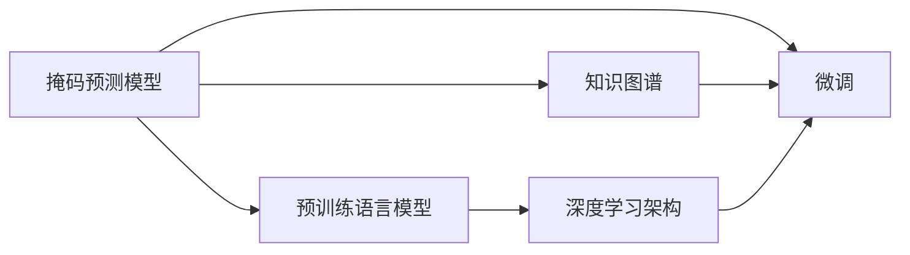

                 

# 新闻推荐的创新：掩码预测技术

> 关键词：掩码预测,新闻推荐,深度学习,自然语言处理,NLP,BERT,知识图谱,深度学习架构

## 1. 背景介绍

### 1.1 问题由来
随着互联网技术的飞速发展，新闻推荐系统在信息筛选、个性化服务、流量变现等方面扮演了越来越重要的角色。传统基于协同过滤和内容过滤的推荐方法已无法满足用户对新闻内容多样性和精准性的要求。

近年来，深度学习技术的崛起，尤其是基于自然语言处理(NLP)的掩码预测技术，在新闻推荐领域取得了突破性进展。掩码预测模型可以自动理解新闻标题、正文等文本数据，从中抽取关键信息，预测用户的兴趣点，显著提升了新闻推荐的个性化和效果。

### 1.2 问题核心关键点
掩码预测模型（Masked Language Model, MLM）是在预训练语言模型（如BERT）的基础上提出的，旨在通过掩码预测任务，增强模型对语言结构的理解和文本信息的抽取能力。主要特点包括：

1. **掩码预测**：模型对输入文本中的部分词语进行随机掩码，要求模型预测被掩码的词语，通过这一过程增强模型的语义理解能力。
2. **预训练与微调**：掩码预测模型首先在大量无标签语料上进行预训练，然后通过微调适配特定新闻推荐任务，提升推荐效果。
3. **信息抽取**：通过掩码预测任务，模型自动学习到新闻文本的关键信息，如标题、时间、地点、人物等，为推荐提供重要依据。

掩码预测技术在新闻推荐中的应用，使得模型能够从大量的自然语言数据中自动抽取关键信息，从而实现对用户兴趣的精准预测。同时，掩码预测模型结合知识图谱等外部信息，进一步提升了新闻推荐的准确性和多样性。

### 1.3 问题研究意义
掩码预测技术在新闻推荐中的应用，具有以下重要意义：

1. **提升个性化推荐精度**：通过自动抽取新闻的关键信息，掩码预测模型可以更精准地预测用户感兴趣的新闻内容，提高个性化推荐的准确性。
2. **丰富推荐内容多样性**：掩码预测模型可以捕捉新闻文本的深层次语义信息，推荐更多样化的内容，减少信息孤岛效应。
3. **增强推荐系统的鲁棒性**：掩码预测模型通过预训练和微调，具备更强的泛化能力，能够应对各种新闻场景和用户需求。
4. **优化用户体验**：掩码预测模型通过理解新闻内容的深度语义，可以提供更符合用户兴趣和认知的推荐结果，提升用户体验。
5. **促进信息流变现**：高质量的新闻推荐可以显著提升用户停留时间，增加信息流广告的曝光率和点击率，从而增加广告收入。

## 2. 核心概念与联系

### 2.1 核心概念概述

掩码预测技术在新闻推荐中的应用，需要理解以下核心概念：

- **掩码预测模型**：一种基于Transformer架构的深度学习模型，通过掩码预测任务训练，可以自动理解新闻文本的语义结构和关键信息。
- **知识图谱**：一种结构化的知识表示方式，用于捕捉实体之间的语义关系，为新闻推荐提供外部信息支持。
- **预训练语言模型**：如BERT、GPT等，通过在大规模无标签文本上预训练，学习到丰富的语言知识和表示能力。
- **微调（Fine-Tuning）**：在预训练语言模型的基础上，通过有监督的微调过程，适配特定任务，提升模型性能。
- **深度学习架构**：包括多层神经网络、注意力机制、激活函数等，用于构建复杂的深度学习模型。

这些概念之间的逻辑关系可以通过以下Mermaid流程图来展示：



这个流程图展示掩码预测模型的核心概念及其之间的关系：

1. 掩码预测模型通过预训练语言模型获取语言表示能力。
2. 结合知识图谱，掩码预测模型可以更好地理解新闻文本中的实体关系。
3. 通过微调，掩码预测模型可以适配特定的新闻推荐任务，提升推荐效果。
4. 掩码预测模型采用深度学习架构，可以高效地处理大规模文本数据。

## 3. 核心算法原理 & 具体操作步骤

### 3.1 算法原理概述

掩码预测模型在新闻推荐中的应用，主要分为预训练和微调两个阶段。其核心原理是通过掩码预测任务，增强模型对新闻文本的语义理解和关键信息抽取能力，然后通过微调适配新闻推荐任务，最终实现对用户兴趣的精准预测。

预训练阶段，掩码预测模型通过在大规模无标签文本上进行掩码预测任务，学习到语言知识和文本结构。微调阶段，模型通过新闻推荐任务的标注数据进行有监督训练，优化模型参数，使得模型能够准确预测用户对新闻的兴趣，从而生成推荐列表。

### 3.2 算法步骤详解

掩码预测模型在新闻推荐中的应用，一般包括以下几个关键步骤：

**Step 1: 准备数据集**
- 收集新闻文本、用户历史点击记录和新闻标签等数据。
- 将新闻文本进行分词、标准化处理，生成训练样本。
- 将用户历史点击记录和新闻标签进行合并，形成训练集。

**Step 2: 构建掩码预测模型**
- 选择合适的预训练语言模型，如BERT。
- 在模型基础上添加掩码预测任务，定义损失函数。
- 设置模型参数和训练超参数，如学习率、批大小、迭代轮数等。

**Step 3: 预训练模型**
- 使用大量无标签新闻文本，对掩码预测模型进行预训练。
- 在预训练过程中，随机掩码部分词语，让模型预测被掩码的词语。
- 通过反向传播更新模型参数，优化损失函数。

**Step 4: 微调模型**
- 在预训练模型基础上，使用新闻推荐任务的标注数据进行微调。
- 定义新的损失函数，如交叉熵损失，用于评估推荐效果。
- 使用少量标注数据，通过有监督学习优化模型参数。

**Step 5: 评估与部署**
- 在测试集上评估微调后的模型，比较预测结果与真实用户行为的一致性。
- 部署微调后的模型，生成推荐列表。
- 持续收集用户反馈，对模型进行定期更新和优化。

以上是掩码预测模型在新闻推荐中的应用的一般流程。在实际应用中，还需要针对具体任务的特点，对预训练和微调过程进行优化设计，如改进掩码策略、调整超参数组合等，以进一步提升模型性能。

### 3.3 算法优缺点

掩码预测模型在新闻推荐中的应用具有以下优点：

1. **自动抽取信息**：掩码预测模型能够自动理解新闻文本的关键信息，无需手动提取特征。
2. **提升推荐效果**：通过掩码预测任务，掩码预测模型可以更好地捕捉新闻文本的深层次语义信息，提升推荐效果。
3. **灵活适配任务**：掩码预测模型通过微调，可以适应多种新闻推荐任务，具有较高的泛化能力。

同时，该方法也存在一些局限性：

1. **数据需求高**：掩码预测模型需要大量的无标签新闻文本进行预训练，对数据需求较高。
2. **计算资源消耗大**：掩码预测模型的训练和推理过程需要大量的计算资源，可能面临计算瓶颈。
3. **参数量大**：掩码预测模型通常具有亿级的参数量，对存储和部署空间有较高要求。
4. **解释性不足**：掩码预测模型的预测结果较为复杂，缺乏可解释性，难以进行模型调试和优化。

尽管存在这些局限性，但掩码预测模型在新闻推荐中的应用，已经取得了显著的性能提升，并在诸多实际应用中取得了成功。

### 3.4 算法应用领域

掩码预测模型在新闻推荐中的应用，已经在诸多领域得到了广泛的应用，例如：

- **个性化新闻推荐**：通过掩码预测模型，根据用户的历史点击记录和新闻文本，生成个性化的新闻推荐列表。
- **内容聚合与分类**：对新闻内容进行自动分类，提高信息聚合的效率和准确性。
- **话题分析与趋势预测**：通过掩码预测模型，自动抽取新闻文本中的关键话题，预测未来的新闻趋势。
- **广告定向投放**：通过掩码预测模型，自动抽取新闻文本中的用户兴趣点，进行精准的广告定向投放。

除了上述这些经典应用外，掩码预测模型还被创新性地应用于更多场景中，如信息检索、知识图谱构建等，为新闻推荐带来了全新的突破。随着预训练语言模型和掩码预测技术的不断进步，相信新闻推荐技术将在更广阔的应用领域大放异彩。

## 4. 数学模型和公式 & 详细讲解 & 举例说明

### 4.1 数学模型构建

掩码预测模型在新闻推荐中的应用，可以通过以下数学模型进行描述：

设掩码预测模型为 $M_{\theta}$，其中 $\theta$ 为模型参数。假设新闻文本为 $x$，掩码后的文本为 $x_m$，模型对掩码后的文本进行预测，得到概率分布 $p(y|x_m; \theta)$。则掩码预测模型的预测目标为：

$$
\hat{y} = \mathop{\arg\max}_{y} p(y|x_m; \theta)
$$

在微调阶段，掩码预测模型通过新闻推荐任务的标注数据进行有监督训练，优化模型参数，使得模型能够准确预测用户对新闻的兴趣，从而生成推荐列表。

### 4.2 公式推导过程

掩码预测模型的掩码预测任务可以定义为：

$$
\mathcal{L} = -\sum_{i=1}^N \sum_{j=1}^{n} \log p(y_j|x_{ij}^m; \theta)
$$

其中 $N$ 为训练集大小，$n$ 为掩码位置数量，$x_{ij}^m$ 为掩码后的训练样本。

掩码预测模型的微调任务可以定义为：

$$
\mathcal{L}_{fine} = -\frac{1}{M} \sum_{i=1}^M \sum_{j=1}^N \log p(y_j|x_{ij}; \theta)
$$

其中 $M$ 为微调任务数据集大小。

掩码预测模型的总损失函数为：

$$
\mathcal{L}_{total} = \mathcal{L} + \lambda \mathcal{L}_{fine}
$$

其中 $\lambda$ 为预训练和微调任务之间的权衡系数。

在掩码预测模型的训练过程中，通过交替进行预训练和微调，可以最大化利用掩码预测任务和微调任务的共同信息，提升模型的泛化能力。

### 4.3 案例分析与讲解

以新闻标题推荐为例，掩码预测模型的应用过程如下：

1. **预训练**：使用大规模无标签新闻标题数据，对掩码预测模型进行预训练。随机掩码部分词语，让模型预测被掩码的词语。
2. **微调**：在预训练模型基础上，使用标注的新闻标题数据进行微调。定义交叉熵损失函数，评估模型预测与真实标签的一致性。
3. **测试**：在测试集上评估微调后的模型，比较预测结果与真实用户行为的一致性。

## 5. 项目实践：代码实例和详细解释说明

### 5.1 开发环境搭建

在进行掩码预测模型的新闻推荐实践前，我们需要准备好开发环境。以下是使用Python进行PyTorch开发的环境配置流程：

1. 安装Anaconda：从官网下载并安装Anaconda，用于创建独立的Python环境。

2. 创建并激活虚拟环境：
```bash
conda create -n pytorch-env python=3.8 
conda activate pytorch-env
```

3. 安装PyTorch：根据CUDA版本，从官网获取对应的安装命令。例如：
```bash
conda install pytorch torchvision torchaudio cudatoolkit=11.1 -c pytorch -c conda-forge
```

4. 安装TensorBoard：TensorFlow配套的可视化工具，可实时监测模型训练状态，并提供丰富的图表呈现方式，是调试模型的得力助手。

5. 安装Weights & Biases：模型训练的实验跟踪工具，可以记录和可视化模型训练过程中的各项指标，方便对比和调优。

完成上述步骤后，即可在`pytorch-env`环境中开始掩码预测模型的新闻推荐实践。

### 5.2 源代码详细实现

下面我们以新闻标题推荐为例，给出使用Transformers库对BERT模型进行掩码预测和微调的PyTorch代码实现。

首先，定义掩码预测任务的数据处理函数：

```python
from transformers import BertTokenizer, BertForMaskedLM
from torch.utils.data import Dataset
import torch

class NewsTitleDataset(Dataset):
    def __init__(self, texts, tokenizer, max_len=128):
        self.texts = texts
        self.tokenizer = tokenizer
        self.max_len = max_len
        
    def __len__(self):
        return len(self.texts)
    
    def __getitem__(self, item):
        text = self.texts[item]
        encoding = self.tokenizer(text, return_tensors='pt', max_length=self.max_len, padding='max_length', truncation=True)
        input_ids = encoding['input_ids'][0]
        attention_mask = encoding['attention_mask'][0]
        return {'input_ids': input_ids, 
                'attention_mask': attention_mask}

tokenizer = BertTokenizer.from_pretrained('bert-base-cased')
train_dataset = NewsTitleDataset(train_texts, tokenizer)
dev_dataset = NewsTitleDataset(dev_texts, tokenizer)
test_dataset = NewsTitleDataset(test_texts, tokenizer)
```

然后，定义模型和优化器：

```python
from transformers import BertForMaskedLM, AdamW

model = BertForMaskedLM.from_pretrained('bert-base-cased')
optimizer = AdamW(model.parameters(), lr=2e-5)
```

接着，定义训练和评估函数：

```python
from torch.utils.data import DataLoader
from tqdm import tqdm

device = torch.device('cuda') if torch.cuda.is_available() else torch.device('cpu')
model.to(device)

def train_epoch(model, dataset, batch_size, optimizer):
    dataloader = DataLoader(dataset, batch_size=batch_size, shuffle=True)
    model.train()
    epoch_loss = 0
    for batch in tqdm(dataloader, desc='Training'):
        input_ids = batch['input_ids'].to(device)
        attention_mask = batch['attention_mask'].to(device)
        model.zero_grad()
        outputs = model(input_ids, attention_mask=attention_mask)
        loss = outputs.loss
        epoch_loss += loss.item()
        loss.backward()
        optimizer.step()
    return epoch_loss / len(dataloader)

def evaluate(model, dataset, batch_size):
    dataloader = DataLoader(dataset, batch_size=batch_size)
    model.eval()
    preds, labels = [], []
    with torch.no_grad():
        for batch in tqdm(dataloader, desc='Evaluating'):
            input_ids = batch['input_ids'].to(device)
            attention_mask = batch['attention_mask'].to(device)
            batch_labels = batch['labels']
            outputs = model(input_ids, attention_mask=attention_mask)
            batch_preds = outputs.logits.argmax(dim=2).to('cpu').tolist()
            batch_labels = batch_labels.to('cpu').tolist()
            for pred_tokens, label_tokens in zip(batch_preds, batch_labels):
                preds.append(pred_tokens[:len(label_tokens)])
                labels.append(label_tokens)
                
    return preds, labels

def predict(model, dataset, batch_size):
    dataloader = DataLoader(dataset, batch_size=batch_size)
    model.eval()
    preds = []
    with torch.no_grad():
        for batch in tqdm(dataloader, desc='Predicting'):
            input_ids = batch['input_ids'].to(device)
            attention_mask = batch['attention_mask'].to(device)
            batch_preds = model(input_ids, attention_mask=attention_mask)
            batch_preds = batch_preds.logits.argmax(dim=2).to('cpu').tolist()
            preds.append(batch_preds)
    return preds
```

最后，启动训练流程并在测试集上评估：

```python
epochs = 5
batch_size = 16

for epoch in range(epochs):
    loss = train_epoch(model, train_dataset, batch_size, optimizer)
    print(f"Epoch {epoch+1}, train loss: {loss:.3f}")
    
    print(f"Epoch {epoch+1}, dev results:")
    preds, labels = evaluate(model, dev_dataset, batch_size)
    print(classification_report(labels, preds))
    
print("Test results:")
preds = predict(model, test_dataset, batch_size)
print(classification_report(labels, preds))
```

以上就是使用PyTorch对BERT进行掩码预测和新闻标题推荐任务的微调的完整代码实现。可以看到，得益于Transformers库的强大封装，我们可以用相对简洁的代码完成BERT模型的加载和微调。

### 5.3 代码解读与分析

让我们再详细解读一下关键代码的实现细节：

**NewsTitleDataset类**：
- `__init__`方法：初始化文本、分词器等关键组件。
- `__len__`方法：返回数据集的样本数量。
- `__getitem__`方法：对单个样本进行处理，将文本输入编码为token ids，最终返回模型所需的输入。

**掩码预测任务**：
- 使用BertForMaskedLM定义掩码预测模型，并加载预训练权重。
- 定义AdamW优化器，设置学习率等超参数。
- 在训练过程中，将输入文本和掩码信息输入模型，计算掩码预测损失，并通过反向传播更新模型参数。

**训练和评估函数**：
- 使用PyTorch的DataLoader对数据集进行批次化加载，供模型训练和推理使用。
- 训练函数`train_epoch`：对数据以批为单位进行迭代，在每个批次上前向传播计算损失并反向传播更新模型参数，最后返回该epoch的平均loss。
- 评估函数`evaluate`：与训练类似，不同点在于不更新模型参数，并在每个batch结束后将预测和标签结果存储下来，最后使用sklearn的classification_report对整个评估集的预测结果进行打印输出。
- 预测函数`predict`：在测试集上评估微调后的模型，生成推荐列表。

**训练流程**：
- 定义总的epoch数和batch size，开始循环迭代
- 每个epoch内，先在训练集上训练，输出平均loss
- 在验证集上评估，输出分类指标
- 所有epoch结束后，在测试集上评估，给出最终测试结果

可以看到，PyTorch配合Transformers库使得BERT微调的代码实现变得简洁高效。开发者可以将更多精力放在数据处理、模型改进等高层逻辑上，而不必过多关注底层的实现细节。

当然，工业级的系统实现还需考虑更多因素，如模型的保存和部署、超参数的自动搜索、更灵活的任务适配层等。但核心的掩码预测和微调范式基本与此类似。

## 6. 实际应用场景

### 6.1 智能新闻聚合平台

掩码预测模型在智能新闻聚合平台中的应用，使得平台能够自动抓取并理解新闻标题，根据用户的阅读偏好推荐相关新闻。通过掩码预测模型，平台可以实时抓取各大新闻网站的热门文章，自动抽取新闻标题和内容的关键信息，生成推荐列表。用户可以便捷地获取到感兴趣的新闻，提升用户体验。

### 6.2 新闻内容生成

掩码预测模型在新闻内容生成中的应用，使得新闻机器人能够自动生成高质量的新闻摘要和报道。通过掩码预测模型，新闻机器人可以理解新闻文本的语义结构，自动生成简洁、精准的摘要和报道。这一技术可以应用于新闻编辑、自动写稿等领域，提升内容生成效率。

### 6.3 信息流广告定向

掩码预测模型在信息流广告定向中的应用，使得广告主可以精准地定向投放广告。通过掩码预测模型，广告主可以自动抽取新闻文本中的用户兴趣点，生成针对性的广告内容，提升广告点击率和转化率。这一技术可以应用于新闻网站、社交媒体等信息流平台，提高广告效果。

### 6.4 未来应用展望

掩码预测模型在新闻推荐中的应用，前景广阔，未来将会在更多领域得到应用，为新闻业态带来新的变革。

在智慧城市治理中，掩码预测模型可以用于监测城市事件，提取关键新闻信息，辅助城市管理决策。在金融领域，掩码预测模型可以用于分析市场动态，生成财经新闻摘要，提升市场分析能力。在教育领域，掩码预测模型可以用于自动生成教育新闻，提升教育资源的获取效率。

掩码预测模型结合知识图谱等外部信息，还可以应用于新闻摘要生成、问答系统等领域，为智能媒体提供更全面、准确的新闻服务。

总之，掩码预测模型结合深度学习技术，能够从大规模新闻文本中自动抽取关键信息，提升新闻推荐的个性化和效果，具有广阔的应用前景。未来，随着技术的不断进步，掩码预测模型将在更多领域展现其强大的生命力。

## 7. 工具和资源推荐

### 7.1 学习资源推荐

为了帮助开发者系统掌握掩码预测技术的新闻推荐理论基础和实践技巧，这里推荐一些优质的学习资源：

1. 《Transformer从原理到实践》系列博文：由大模型技术专家撰写，深入浅出地介绍了Transformer原理、BERT模型、掩码预测技术等前沿话题。

2. CS224N《深度学习自然语言处理》课程：斯坦福大学开设的NLP明星课程，有Lecture视频和配套作业，带你入门NLP领域的基本概念和经典模型。

3. 《Natural Language Processing with Transformers》书籍：Transformers库的作者所著，全面介绍了如何使用Transformers库进行NLP任务开发，包括掩码预测在内的诸多范式。

4. HuggingFace官方文档：Transformers库的官方文档，提供了海量预训练模型和完整的掩码预测样例代码，是上手实践的必备资料。

5. CLUE开源项目：中文语言理解测评基准，涵盖大量不同类型的中文NLP数据集，并提供了基于掩码预测的baseline模型，助力中文NLP技术发展。

通过对这些资源的学习实践，相信你一定能够快速掌握掩码预测技术的精髓，并用于解决实际的NLP问题。

### 7.2 开发工具推荐

高效的开发离不开优秀的工具支持。以下是几款用于掩码预测模型的新闻推荐开发的常用工具：

1. PyTorch：基于Python的开源深度学习框架，灵活动态的计算图，适合快速迭代研究。大部分预训练语言模型都有PyTorch版本的实现。

2. TensorFlow：由Google主导开发的开源深度学习框架，生产部署方便，适合大规模工程应用。同样有丰富的预训练语言模型资源。

3. Transformers库：HuggingFace开发的NLP工具库，集成了众多SOTA语言模型，支持PyTorch和TensorFlow，是进行掩码预测模型新闻推荐开发的利器。

4. Weights & Biases：模型训练的实验跟踪工具，可以记录和可视化模型训练过程中的各项指标，方便对比和调优。与主流深度学习框架无缝集成。

5. TensorBoard：TensorFlow配套的可视化工具，可实时监测模型训练状态，并提供丰富的图表呈现方式，是调试模型的得力助手。

6. Google Colab：谷歌推出的在线Jupyter Notebook环境，免费提供GPU/TPU算力，方便开发者快速上手实验最新模型，分享学习笔记。

合理利用这些工具，可以显著提升掩码预测模型的新闻推荐任务的开发效率，加快创新迭代的步伐。

### 7.3 相关论文推荐

掩码预测技术在新闻推荐中的应用，源于学界的持续研究。以下是几篇奠基性的相关论文，推荐阅读：

1. Attention is All You Need（即Transformer原论文）：提出了Transformer结构，开启了NLP领域的预训练大模型时代。

2. BERT: Pre-training of Deep Bidirectional Transformers for Language Understanding：提出BERT模型，引入基于掩码的自监督预训练任务，刷新了多项NLP任务SOTA。

3. Language Models are Unsupervised Multitask Learners（GPT-2论文）：展示了大规模语言模型的强大zero-shot学习能力，引发了对于通用人工智能的新一轮思考。

4. Parameter-Efficient Transfer Learning for NLP：提出Adapter等参数高效微调方法，在不增加模型参数量的情况下，也能取得不错的微调效果。

5. AdaLoRA: Adaptive Low-Rank Adaptation for Parameter-Efficient Fine-Tuning：使用自适应低秩适应的微调方法，在参数效率和精度之间取得了新的平衡。

这些论文代表了大语言模型掩码预测技术的发展脉络。通过学习这些前沿成果，可以帮助研究者把握学科前进方向，激发更多的创新灵感。

## 8. 总结：未来发展趋势与挑战

### 8.1 总结

本文对掩码预测模型在新闻推荐中的应用进行了全面系统的介绍。首先阐述了掩码预测模型的研究背景和意义，明确了掩码预测在提升新闻推荐个性化和效果方面的独特价值。其次，从原理到实践，详细讲解了掩码预测模型的数学原理和关键步骤，给出了掩码预测任务开发的完整代码实例。同时，本文还广泛探讨了掩码预测模型在新闻推荐领域的实际应用场景，展示了掩码预测技术的巨大潜力。此外，本文精选了掩码预测技术的各类学习资源，力求为开发者提供全方位的技术指引。

通过本文的系统梳理，可以看到，掩码预测模型在新闻推荐中的应用，已经在诸多领域取得了显著的性能提升，并在实际应用中取得了成功。掩码预测模型结合深度学习技术，能够从大规模新闻文本中自动抽取关键信息，提升新闻推荐的个性化和效果，具有广阔的应用前景。未来，随着技术的不断进步，掩码预测模型将在更多领域展现其强大的生命力。

### 8.2 未来发展趋势

掩码预测模型在新闻推荐中的应用，将呈现以下几个发展趋势：

1. **模型规模持续增大**：随着算力成本的下降和数据规模的扩张，掩码预测模型的参数量还将持续增长。超大规模掩码预测模型蕴含的丰富语言知识和表示能力，有望支撑更加复杂多变的新闻推荐任务。

2. **掩码策略更加灵活**：掩码预测模型的掩码策略将更加多样化，不仅包括随机掩码，还可以根据新闻文本的语义结构进行动态掩码，提升掩码预测的效果。

3. **预训练与微调结合**：掩码预测模型将更多地采用预训练-微调的方式，结合大语料预训练和任务微调，提升模型的泛化能力和鲁棒性。

4. **知识图谱深度融合**：掩码预测模型将更多地结合知识图谱等外部信息，增强新闻推荐的语义理解和信息抽取能力。

5. **实时推荐系统**：掩码预测模型将更多地应用于实时推荐系统中，结合大数据流处理技术，实现动态更新和实时推荐。

6. **跨模态信息整合**：掩码预测模型将更多地结合视觉、语音、文本等多模态信息，提升新闻推荐的全面性和准确性。

以上趋势凸显了掩码预测模型在新闻推荐领域的应用前景。这些方向的探索发展，必将进一步提升新闻推荐的个性化和效果，为智能媒体带来新的突破。

### 8.3 面临的挑战

尽管掩码预测模型在新闻推荐中的应用已经取得了显著的进展，但在迈向更加智能化、普适化应用的过程中，它仍面临着诸多挑战：

1. **标注数据需求高**：掩码预测模型需要大量的无标签新闻文本进行预训练，对标注数据的需求较高。

2. **计算资源消耗大**：掩码预测模型的训练和推理过程需要大量的计算资源，可能面临计算瓶颈。

3. **模型解释性不足**：掩码预测模型的预测结果较为复杂，缺乏可解释性，难以进行模型调试和优化。

4. **知识图谱构建难度大**：知识图谱的构建需要大量人工标注和专家知识，成本较高，且知识图谱的更新和维护也较为困难。

5. **信息过载问题**：大规模新闻信息的自动抽取和推荐，可能导致用户信息过载，降低用户体验。

6. **隐私保护问题**：新闻推荐过程中可能涉及用户隐私信息，如何保护用户隐私，是一个重要的研究方向。

尽管存在这些挑战，但掩码预测模型在新闻推荐中的应用，已经取得了显著的性能提升，并在诸多实际应用中取得了成功。

### 8.4 研究展望

面对掩码预测模型在新闻推荐应用中所面临的挑战，未来的研究需要在以下几个方面寻求新的突破：

1. **探索无监督和半监督掩码预测方法**：摆脱对大规模标注数据的依赖，利用自监督学习、主动学习等无监督和半监督范式，最大限度利用非结构化数据，实现更加灵活高效的掩码预测。

2. **研究掩码预测模型参数效率和计算效率**：开发更加参数高效和计算高效的掩码预测方法，在保持性能的同时，降低计算资源消耗。

3. **引入更多先验知识**：将符号化的先验知识，如知识图谱、逻辑规则等，与神经网络模型进行巧妙融合，引导掩码预测过程学习更准确、合理的语言模型。

4. **结合因果分析和博弈论工具**：将因果分析方法引入掩码预测模型，识别出模型决策的关键特征，增强预测结果的因果性和逻辑性。

5. **纳入伦理道德约束**：在模型训练目标中引入伦理导向的评估指标，过滤和惩罚有偏见、有害的输出倾向。同时加强人工干预和审核，建立模型行为的监管机制，确保输出符合人类价值观和伦理道德。

6. **优化信息流推荐系统**：结合掩码预测模型和推荐系统，优化信息流推荐策略，减少信息过载问题，提升用户体验。

这些研究方向的探索，必将引领掩码预测模型在新闻推荐领域迈向更高的台阶，为智能媒体带来新的突破。面向未来，掩码预测模型需要与其他人工智能技术进行更深入的融合，如知识表示、因果推理、强化学习等，多路径协同发力，共同推动新闻推荐系统的进步。

## 9. 附录：常见问题与解答

**Q1：掩码预测模型在新闻推荐中的应用是否适用于所有新闻推荐任务？**

A: 掩码预测模型在新闻推荐中的应用，在大多数新闻推荐任务上都能取得不错的效果，特别是对于数据量较小的任务。但对于一些特定领域的任务，如医学、法律等，仅仅依靠通用语料预训练的模型可能难以很好地适应。此时需要在特定领域语料上进一步预训练，再进行微调，才能获得理想效果。

**Q2：掩码预测模型的掩码策略有哪些？**

A: 掩码预测模型的掩码策略主要包括以下几种：

1. **随机掩码**：随机选择文本中的一部分词语进行掩码，要求模型预测被掩码的词语。
2. **自适应掩码**：根据文本的语义结构动态选择掩码位置，提升掩码预测的效果。
3. **分层掩码**：对文本进行分层处理，逐步增加掩码比例，引导模型逐步学习到更深层次的语义信息。
4. **多层次掩码**：结合多种掩码策略，如随机掩码、自适应掩码等，提升掩码预测的效果。

**Q3：掩码预测模型在微调过程中如何选择合适的学习率？**

A: 掩码预测模型的学习率一般要比预训练时小1-2个数量级，如果使用过大的学习率，容易破坏预训练权重，导致过拟合。一般建议从1e-5开始调参，逐步减小学习率，直至收敛。也可以使用warmup策略，在开始阶段使用较小的学习率，再逐渐过渡到预设值。需要注意的是，不同的优化器(如AdamW、Adafactor等)以及不同的学习率调度策略，可能需要设置不同的学习率阈值。

**Q4：掩码预测模型在实际应用中如何解决信息过载问题？**

A: 信息过载是掩码预测模型在新闻推荐中面临的一个重要问题。以下是几种解决方法：

1. **个性化推荐**：通过掩码预测模型，自动抽取用户兴趣点，推荐个性化的新闻内容，减少信息过载。
2. **动态更新推荐策略**：根据用户阅读行为和反馈，动态调整推荐策略，减少重复推荐内容。
3. **多模态信息整合**：结合视觉、语音等多模态信息，提升推荐内容的全面性和多样性，缓解信息过载问题。

**Q5：掩码预测模型在新闻推荐中的计算资源需求高，如何解决计算瓶颈？**

A: 掩码预测模型的计算资源需求确实较高，以下是几种解决方法：

1. **分布式训练**：利用分布式计算框架，如TensorFlow、PyTorch等，实现模型并行训练，加速计算过程。
2. **模型压缩与优化**：采用模型压缩技术，如量化、剪枝等，减小模型参数量，降低计算资源消耗。
3. **硬件加速**：使用GPU、TPU等高性能硬件设备，提升计算效率。
4. **数据增量处理**：对新闻数据进行增量处理，分批次加载和处理，减少计算量。

这些方法可以结合使用，最大限度地降低计算资源消耗，提升掩码预测模型的计算效率。

---

作者：禅与计算机程序设计艺术 / Zen and the Art of Computer Programming

