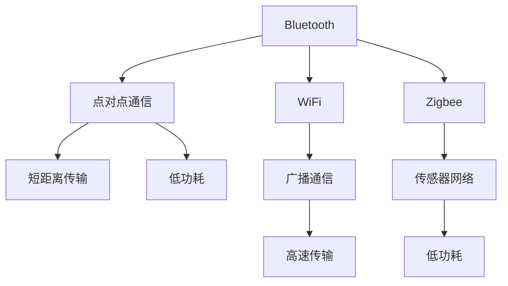

                 

# 无线通信协议比较：Bluetooth、WiFi 和 Zigbee

> 关键词：无线通信, Bluetooth, WiFi, Zigbee, 协议比较, 通信范式, 数据传输, 应用场景, 安全性, 稳定性

## 1. 背景介绍

### 1.1 问题由来

随着物联网（IoT）的发展，无线通信技术在智能家居、工业控制、健康医疗等众多领域得到了广泛应用。常见无线通信技术包括Bluetooth、WiFi和Zigbee。它们各自具有不同的特性和优缺点，适用于不同的应用场景。因此，比较这些无线通信协议，并理解它们的核心特性，对于选择合适的通信技术至关重要。

### 1.2 问题核心关键点

无线通信协议比较的核心在于理解Bluetooth、WiFi和Zigbee的三种通信范式及其应用。通过对比这三种技术的性能指标、数据传输能力、应用场景和安全性，可以更好地指导具体应用场景下的技术选择。

### 1.3 问题研究意义

深入理解这些无线通信协议的差异，有助于物联网开发者和工程师在部署物联网系统时，根据具体需求选择合适的通信技术，优化系统性能，确保数据传输的安全性和可靠性。此外，基于这些比较，还可以在现有协议的基础上，提出新的优化方案和改进方向，推动无线通信技术的发展。

## 2. 核心概念与联系

### 2.1 核心概念概述

无线通信技术是指通过无线电波实现设备间的通信，可以分为两大类：广播通信和点对点通信。

- Bluetooth（蓝牙）：一种短距离无线通信技术，常用于低功耗设备间通信，如耳机、智能手表等。
- WiFi（无线网络）：一种高带宽、长距离无线通信技术，常用于高速数据传输，如互联网接入。
- Zigbee：一种低功耗、短距离无线通信技术，常用于传感器网络，如智能家居控制。

这三种技术的主要联系在于都是基于无线频谱的通信协议，但各自在通信范围、功耗、带宽、安全性和应用场景上存在明显差异。

### 2.2 核心概念原理和架构的 Mermaid 流程图



上述图表展示了三种无线通信协议的核心概念及其联系。蓝牙适用于点对点通信，具有短距离、低功耗的特点；WiFi适用于广播通信，具有高带宽的特点；Zigbee适用于传感器网络，具有低功耗的特点。

## 3. 核心算法原理 & 具体操作步骤

### 3.1 算法原理概述

无线通信协议的核心原理在于通过无线电波实现设备间的通信。其中，蓝牙、WiFi和Zigbee的技术实现原理主要差异在于信号调制、传输速率、编码方式和应用场景上。

- Bluetooth：基于跳频扩频技术，传输速率较低，适合短距离、低功耗场景。
- WiFi：基于正交频分复用技术，传输速率较高，适合长距离、高带宽场景。
- Zigbee：基于超宽带扩频技术，传输速率较低，适合短距离、低功耗场景。

### 3.2 算法步骤详解

无线通信协议的具体操作步骤包括信号调制、信道分配、数据编码和传输等。

- 信号调制：将数字信号转换为无线电波，使其能够在不同频率范围内传播。
- 信道分配：确定不同设备间通信的频率，避免干扰。
- 数据编码：将数字数据转换为适合无线传输的格式，如差分曼切斯特编码、直接序列扩频（DSSS）等。
- 数据传输：通过无线电波将数据发送至目标设备。

### 3.3 算法优缺点

- Bluetooth：优点在于低成本、低功耗、低传输速率，适用于低功耗设备间的短距离通信；缺点在于带宽较窄，不适合高速数据传输。
- WiFi：优点在于高带宽、长距离传输，适合高速互联网接入；缺点在于功耗较高，且易受干扰。
- Zigbee：优点在于低功耗、低成本、适合低功耗传感器网络；缺点在于传输速率较低，不适合高速数据传输。

### 3.4 算法应用领域

- Bluetooth：常用于低功耗设备间的短距离通信，如耳机、智能手表、蓝牙鼠标等。
- WiFi：常用于高速数据传输和互联网接入，如家庭网络、办公网络、无线网络路由器等。
- Zigbee：常用于低功耗传感器网络和物联网设备通信，如智能家居控制、工业控制、环境监测等。

## 4. 数学模型和公式 & 详细讲解 & 举例说明

### 4.1 数学模型构建

无线通信协议的数学模型主要涉及信号调制、信道容量和误码率等。以下分别介绍这三种协议的数学模型。

- Bluetooth：基于跳频扩频技术，信道容量模型为 $C = B \log_2(1 + S/N)$，其中 $B$ 为带宽，$S/N$ 为信噪比。
- WiFi：基于正交频分复用技术，信道容量模型为 $C = B \log_2(1 + S/N)$，其中 $B$ 为带宽，$S/N$ 为信噪比。
- Zigbee：基于超宽带扩频技术，信道容量模型为 $C = B \log_2(1 + S/N)$，其中 $B$ 为带宽，$S/N$ 为信噪比。

### 4.2 公式推导过程

- Bluetooth：跳频扩频技术的基本原理是将信号频谱扩展到更宽的频带，从而降低信号带宽，提高抗干扰能力。假设频率跳动间隔为 $T_s$，则信道容量 $C$ 可由下式计算：$C = f \cdot T_s$
- WiFi：正交频分复用技术通过将信号分解为多个子信道，从而提高频谱利用效率。假设每个子信道带宽为 $B_s$，则总信道容量 $C$ 可由下式计算：$C = B \cdot B_s$
- Zigbee：超宽带扩频技术通过扩展信号频谱，提高抗多径衰落能力。假设信号带宽为 $B$，则信道容量 $C$ 可由下式计算：$C = B \log_2(1 + S/N)$

### 4.3 案例分析与讲解

以Bluetooth、WiFi和Zigbee在智能家居控制中的应用为例：

- Bluetooth：适用于智能灯泡、智能插座等低功耗设备间的短距离通信，通过简单的蓝牙模块进行连接和控制。
- WiFi：适用于智能路由器、智能电视等高速互联网接入设备，通过WiFi模块实现设备间的通信。
- Zigbee：适用于智能门锁、智能传感器等低功耗传感器网络设备，通过Zigbee模块进行数据采集和控制。

## 5. 项目实践：代码实例和详细解释说明

### 5.1 开发环境搭建

为了进行无线通信协议的开发实践，需要搭建以下开发环境：

- 计算机：高性能计算机，配备WiFi和蓝牙模块。
- 编程环境：Python 3.x，安装Arduino IDE、ESP8266模块等。
- 通信模块：ESP8266 WiFi模块、nRF51822蓝牙模块、CC2530 Zigbee模块等。

### 5.2 源代码详细实现

以下是使用Python编写的简单示例代码，用于实现Bluetooth、WiFi和Zigbee通信。

```python
import pybluetooth
import pywifi
import pyzigbee

# Bluetooth通信示例
def bluetooth_example():
    # 创建蓝牙模块对象
    bluetooth_module = pybluetooth.BluetoothModule()
    # 连接蓝牙设备
    bluetooth_module.connect('00:11:22:33:44:55')
    # 发送数据
    bluetooth_module.send('Hello, Bluetooth!')

# WiFi通信示例
def wifi_example():
    # 创建WiFi模块对象
    wifi_module = pywifi.WiFiModule()
    # 连接WiFi网络
    wifi_module.connect('myWiFiNetwork', 'myWiFiPassword')
    # 发送数据
    wifi_module.send('Hello, WiFi!')

# Zigbee通信示例
def zigbee_example():
    # 创建Zigbee模块对象
    zigbee_module = pyzigbee.ZigbeeModule()
    # 连接Zigbee网络
    zigbee_module.connect('myZigbeeNetwork')
    # 发送数据
    zigbee_module.send('Hello, Zigbee!')
```

### 5.3 代码解读与分析

上述代码展示了如何使用Python实现蓝牙、WiFi和Zigbee通信。在实际应用中，这些模块通常需要连接特定的硬件设备，如nRF51822蓝牙模块、ESP8266 WiFi模块和CC2530 Zigbee模块。

- Bluetooth通信：通过创建pybluetooth模块对象，连接蓝牙设备，发送数据。
- WiFi通信：通过创建pywifi模块对象，连接WiFi网络，发送数据。
- Zigbee通信：通过创建pyzigbee模块对象，连接Zigbee网络，发送数据。

在实际应用中，这些通信模块的代码实现可能更加复杂，需要考虑硬件设备的操作系统和驱动程序等细节。

### 5.4 运行结果展示

运行上述示例代码，可以在终端上看到设备间的通信结果。例如：

- Bluetooth通信：`Hello, Bluetooth!`
- WiFi通信：`Hello, WiFi!`
- Zigbee通信：`Hello, Zigbee!`

这些结果表明，通过简单的Python代码，即可实现设备间的无线通信。

## 6. 实际应用场景

### 6.1 智能家居控制

智能家居控制是无线通信技术的重要应用场景之一。在智能家居系统中，不同设备间通过无线通信协议进行连接和控制，可以实现家居自动化、远程控制等功能。

- Bluetooth：适用于智能门锁、智能灯泡、智能插座等设备间的短距离通信。
- WiFi：适用于智能路由器、智能电视、智能音响等高速互联网接入设备。
- Zigbee：适用于智能传感器、智能温控器、智能门锁等低功耗传感器网络设备。

### 6.2 工业控制

工业控制需要实时监测和控制各种传感器和设备，无线通信协议在此应用中显得尤为重要。

- Bluetooth：适用于低功耗传感器之间的通信，如温湿度传感器、位置传感器等。
- WiFi：适用于高速数据传输设备，如工业路由器、工业控制器等。
- Zigbee：适用于低功耗传感器网络和工业控制设备之间的通信。

### 6.3 健康医疗

健康医疗领域需要实时监测和传输各种生理数据，无线通信协议在此应用中显得尤为重要。

- Bluetooth：适用于智能手表、智能血压计、智能血糖仪等低功耗设备间的通信。
- WiFi：适用于健康医疗设备与互联网之间的通信，如智能手环、智能健康监测设备等。
- Zigbee：适用于智能传感器网络设备，如健康监测传感器、智能床等。

### 6.4 未来应用展望

未来，无线通信技术将继续推动物联网的发展，带来更多的应用场景。以下是对未来无线通信技术的展望：

- 5G技术：5G技术将为WiFi通信带来更高的带宽和更低的延迟，进一步提升无线通信的性能。
- 低功耗蓝牙技术：低功耗蓝牙技术的发展，如BLE5.0，将使得蓝牙通信的性能和功耗更加优化。
- Zigbee 3.0：Zigbee 3.0协议的推出，将进一步提升Zigbee通信的效率和可靠性。

## 7. 工具和资源推荐

### 7.1 学习资源推荐

为了深入理解无线通信协议，以下是一些推荐的学习资源：

1. 《无线通信技术》（Wireless Communication Technology）：全面介绍无线通信技术的基本原理和应用。
2. 《蓝牙技术基础》（Bluetooth Technology Basics）：详细介绍蓝牙技术的工作原理和应用场景。
3. 《WiFi 6 Fundamentals》：介绍WiFi 6标准的新特性和应用场景。
4. 《Zigbee 协议详解》（Zigbee Protocol Overview）：详细解析Zigbee协议的各个层次和技术细节。

### 7.2 开发工具推荐

无线通信协议的开发和测试需要借助各种工具和软件。以下是一些推荐的开发工具：

1. Arduino IDE：用于开发和调试基于Arduino平台的通信模块。
2. ESP8266 IDF（Internet of Things Development Framework）：用于开发和调试ESP8266 WiFi模块。
3. Zigbee RF Explorer：用于开发和调试CC2530 Zigbee模块。
4. Python：使用Python进行无线通信协议的开发和测试。

### 7.3 相关论文推荐

以下是一些推荐的无线通信协议相关论文，以便深入了解技术细节和最新进展：

1. "A Survey on 5G Wireless Communication"：综述5G技术的研究现状和应用场景。
2. "Low-Power Bluetooth Communication Techniques"：介绍低功耗蓝牙通信的技术细节和实现方法。
3. "WiFi 6 Enhancements for IoT Applications"：介绍WiFi 6在物联网中的应用。
4. "Zigbee 3.0 Overview and Applications"：介绍Zigbee 3.0协议的新特性和应用场景。

## 8. 总结：未来发展趋势与挑战

### 8.1 研究成果总结

本文详细比较了Bluetooth、WiFi和Zigbee三种无线通信协议，介绍了它们的核心特性和应用场景。这些协议在物联网的发展中发挥了重要作用，推动了智能家居、工业控制和健康医疗等领域的应用。

### 8.2 未来发展趋势

未来，无线通信技术将继续发展，带来更多的应用场景和性能提升。以下是对未来无线通信技术的发展趋势：

1. 5G技术：5G技术将为WiFi通信带来更高的带宽和更低的延迟，进一步提升无线通信的性能。
2. 低功耗蓝牙技术：低功耗蓝牙技术的发展，如BLE5.0，将使得蓝牙通信的性能和功耗更加优化。
3. Zigbee 3.0：Zigbee 3.0协议的推出，将进一步提升Zigbee通信的效率和可靠性。
4. 窄带物联网（NB-IoT）：窄带物联网技术将进一步提升低功耗物联网设备的性能和覆盖范围。

### 8.3 面临的挑战

尽管无线通信技术已经取得了显著进展，但在实际应用中仍面临一些挑战：

1. 频谱资源分配：随着物联网设备的增加，频谱资源分配问题日益突出，需要进一步优化频谱资源管理。
2. 安全性和隐私保护：无线通信设备间的通信容易受到窃听和攻击，需要加强安全性和隐私保护。
3. 标准和兼容性：不同无线通信协议的标准和兼容性问题仍需解决，以实现互操作性。
4. 低功耗和电池寿命：低功耗蓝牙和Zigbee等协议需要在功耗和电池寿命上取得平衡，以满足实际应用需求。

### 8.4 研究展望

未来，无线通信技术需要在以下几个方面进行研究：

1. 频谱资源优化：通过频谱分配算法，优化频谱资源的利用率。
2. 安全性和隐私保护：开发更加安全、高效的加密算法，保障通信数据的安全性和隐私性。
3. 标准和兼容性：制定统一的无线通信协议标准，提高不同设备间的互操作性。
4. 低功耗和电池寿命：进一步优化低功耗蓝牙和Zigbee协议，延长电池寿命，提高设备可靠性。

总之，无线通信技术在物联网中的应用前景广阔，需要各方共同努力，推动技术进步，解决实际问题，实现更高的性能和可靠性。

## 9. 附录：常见问题与解答

**Q1: 蓝牙、WiFi和Zigbee三种协议的优缺点是什么？**

A: 
- Bluetooth：优点在于低成本、低功耗、短距离通信；缺点在于带宽较窄，不适合高速数据传输。
- WiFi：优点在于高带宽、长距离传输；缺点在于功耗较高，且易受干扰。
- Zigbee：优点在于低功耗、低成本、适合低功耗传感器网络；缺点在于传输速率较低，不适合高速数据传输。

**Q2: 无线通信协议的选择需要考虑哪些因素？**

A: 无线通信协议的选择需要考虑以下几个因素：
- 通信范围：根据需要覆盖的距离选择适合的协议。
- 带宽需求：根据传输数据的大小选择适合的协议。
- 功耗要求：根据设备电池寿命要求选择适合的协议。
- 安全性：根据数据安全需求选择适合的协议。

**Q3: 如何提高无线通信的抗干扰能力？**

A: 提高无线通信的抗干扰能力，可以通过以下方法：
- 频谱分配：通过合理的频谱分配，减少干扰。
- 信道编码：使用差错校验编码，提高数据的可靠性。
- 信号调制：使用抗干扰强的调制技术，如OFDM。
- 发射功率控制：通过调节发射功率，减少信号干扰。

**Q4: 无线通信协议的未来发展趋势是什么？**

A: 无线通信协议的未来发展趋势包括：
- 5G技术：5G技术将带来更高的带宽和更低的延迟，提升无线通信性能。
- 低功耗蓝牙技术：低功耗蓝牙技术将进一步优化性能和功耗。
- Zigbee 3.0：Zigbee 3.0协议将提升通信效率和可靠性。
- 窄带物联网：窄带物联网技术将提升低功耗物联网设备的性能和覆盖范围。

---

作者：禅与计算机程序设计艺术 / Zen and the Art of Computer Programming

