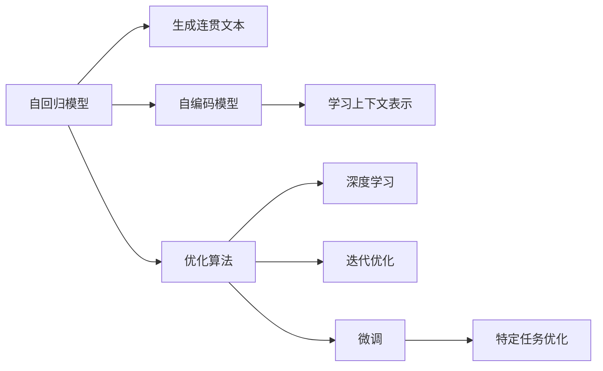

                 

# 时刻推理:LLM响应生成的独特方式

> 关键词：LLM,时刻推理,生成的独特方式,语言模型,自然语言处理(NLP),优化算法,深度学习,迭代优化,微调

## 1. 背景介绍

### 1.1 问题由来

在自然语言处理(Natural Language Processing, NLP)领域，语言模型作为基础工具，广泛应用于文本分类、机器翻译、问答系统等任务中。近年来，基于深度学习的语言模型取得了突破性进展，其中最典型的代表是自回归模型和自编码模型。自回归模型如GPT系列，通过逐个预测下一个词或字符，生成连贯的文本序列；自编码模型如BERT，通过掩码语言模型等任务，学习文本的上下文表示。

尽管这些模型在许多任务上表现优异，但在实际应用中，如何确保模型生成的响应既符合语义要求，又能充分理解上下文信息，是一个重要挑战。针对这一问题，研究者提出了时刻推理的概念，以期在生成过程中引入时间维度，提升生成文本的质量和相关性。

### 1.2 问题核心关键点

时刻推理的核心思想是在语言模型的生成过程中，考虑时间因素，通过分析前后文信息，生成更符合上下文语境的响应。具体来说，模型在生成文本时，不仅关注当前时刻的输入，还参考历史上下文信息，优化生成策略，使得生成的文本更加连贯、相关。

时刻推理主要关注以下几个方面：
- **时间维度的引入**：将历史上下文信息与当前输入相结合，生成连贯的文本。
- **生成过程中的优化**：通过引入时间信息，优化生成策略，提高生成质量。
- **语义相关性**：确保生成的文本内容与上下文语义高度相关。
- **鲁棒性**：在处理不同领域的文本时，保持稳定的表现。

## 2. 核心概念与联系

### 2.1 核心概念概述

为了深入理解时刻推理的原理和实现，我们先介绍几个关键概念：

- **自回归模型（AR模型）**：如GPT系列，通过逐个预测下一个词或字符，生成连贯的文本序列。
- **自编码模型（AE模型）**：如BERT，通过掩码语言模型等任务，学习文本的上下文表示。
- **时刻推理（Time Awareness Reasoning）**：在生成文本时，考虑时间因素，结合历史上下文信息，生成更符合语境的响应。
- **优化算法**：如Adam、SGD等，用于训练模型参数，最小化损失函数。
- **深度学习**：利用多层神经网络结构，学习复杂特征和模式。
- **迭代优化**：通过反复训练和更新模型，逐步提升生成质量。
- **微调（Fine-tuning）**：在预训练模型基础上，通过特定任务的标注数据进行微调，优化模型表现。

这些概念相互关联，共同构成了时刻推理的基本框架。其中，自回归和自编码模型是时刻推理的基础，优化算法和深度学习提供模型训练和优化手段，微调则通过特定任务的标注数据提升模型性能。

### 2.2 核心概念原理和架构的 Mermaid 流程图



这个流程图展示了自回归模型、自编码模型、优化算法、深度学习、迭代优化、微调和特定任务优化之间的关系。自回归模型和自编码模型是基础，通过优化算法和深度学习进行模型训练和优化，最终通过微调和特定任务优化，提升模型在特定任务上的表现。

## 3. 核心算法原理 & 具体操作步骤

### 3.1 算法原理概述

时刻推理的算法原理主要包括以下几个方面：

1. **时间维度的引入**：在生成过程中，模型不仅考虑当前输入，还参考历史上下文信息。
2. **生成策略的优化**：通过优化算法，调整模型参数，使得生成的文本更符合语义要求。
3. **语义相关性**：在生成文本时，确保其与上下文语义高度相关。
4. **鲁棒性**：模型在处理不同领域的文本时，保持稳定的表现。

### 3.2 算法步骤详解

以下是时刻推理的具体实现步骤：

**Step 1: 准备数据集**

- 收集标注好的语料库，将文本按段落分割，形成合适的训练集。
- 将标注好的文本数据输入模型，作为训练集。

**Step 2: 模型选择与初始化**

- 选择合适的自回归或自编码模型，如GPT、BERT等。
- 使用预训练权重初始化模型，保证模型具有一定的语义理解能力。

**Step 3: 引入时间维度**

- 在模型的输入端增加时间维度，例如使用前一个时刻的输出作为当前时刻的输入。
- 将历史上下文信息作为辅助输入，提升模型的语义理解能力。

**Step 4: 优化算法应用**

- 选择合适的优化算法，如Adam、SGD等，训练模型参数。
- 定义适当的损失函数，如交叉熵损失，衡量生成的文本与标注文本的差异。
- 使用深度学习框架，如PyTorch、TensorFlow等，实现模型的前向传播和反向传播。

**Step 5: 迭代优化**

- 在每个epoch中，使用训练集数据进行前向传播和反向传播，更新模型参数。
- 在验证集上评估模型性能，根据评估结果调整学习率等超参数。
- 重复迭代过程，直至模型收敛。

**Step 6: 微调与特定任务优化**

- 在特定任务上，使用微调方法进一步优化模型，如分类任务使用softmax分类器，生成任务使用解码器。
- 根据任务特点，调整损失函数和优化算法，确保模型在特定任务上表现优异。

### 3.3 算法优缺点

时刻推理算法具有以下优点：

1. **生成文本质量高**：考虑时间维度，生成的文本更加连贯、相关。
2. **鲁棒性强**：模型在处理不同领域的文本时，表现稳定。
3. **适应性强**：能够适应多种NLP任务，如文本分类、问答系统等。

同时，该算法也存在一些局限性：

1. **计算复杂度高**：引入时间维度增加了计算复杂度。
2. **训练数据需求大**：需要足够的数据来训练模型，以确保生成的文本质量。
3. **模型复杂度高**：需要增加模型参数，以支持时间维度的引入。

### 3.4 算法应用领域

时刻推理算法在以下领域有广泛应用：

- **机器翻译**：在生成翻译结果时，考虑源语言和目标语言的时间顺序，生成更流畅的翻译。
- **问答系统**：在回答用户问题时，考虑上下文信息，生成更准确的答案。
- **文本摘要**：在生成摘要时，考虑上下文信息，使得摘要更加连贯、相关。
- **对话系统**：在对话过程中，考虑历史对话信息，生成更自然的对话。
- **新闻生成**：在生成新闻时，考虑时间顺序，使得新闻报道更符合时序要求。

## 4. 数学模型和公式 & 详细讲解 & 举例说明

### 4.1 数学模型构建

时刻推理的数学模型构建主要基于自回归和自编码模型的框架，通过引入时间维度和上下文信息，优化生成策略。以下是时刻推理的数学模型构建过程：

设输入文本为 $x_t$，对应的上下文信息为 $c_t$，模型的生成策略为 $p(y_t|x_{t-1}, c_t)$，目标是通过优化算法，最小化生成文本与标注文本之间的差异：

$$
\min_{\theta} \sum_{t=1}^{T} \ell(y_t, x_t, c_t; \theta)
$$

其中 $\theta$ 为模型参数，$\ell$ 为损失函数。

### 4.2 公式推导过程

以自回归模型为例，生成文本的过程可以表示为：

$$
p(y_t|y_{t-1}, y_{t-2}, \ldots, y_1, x_t, c_t)
$$

其中 $y_t$ 为当前时刻生成的文本，$y_{t-1}, y_{t-2}, \ldots, y_1$ 为历史生成的文本，$x_t$ 为当前时刻的输入，$c_t$ 为上下文信息。

通过引入时间维度和上下文信息，模型的生成过程可以表示为：

$$
p(y_t|y_{t-1}, y_{t-2}, \ldots, y_1, x_t, c_t) = \prod_{i=1}^{T} p(y_i|y_{i-1}, y_{i-2}, \ldots, y_1, x_i, c_i)
$$

其中 $T$ 为文本长度。

### 4.3 案例分析与讲解

以机器翻译为例，时刻推理在生成翻译结果时，考虑源语言和目标语言的时间顺序，生成更流畅的翻译。具体实现过程如下：

1. 将源语言文本和目标语言文本按时间顺序排列，形成历史上下文信息。
2. 在模型输入端增加时间维度，使用前一个时刻的输出作为当前时刻的输入。
3. 通过优化算法，训练模型参数，最小化生成文本与标注文本之间的差异。
4. 在生成翻译结果时，考虑历史上下文信息，生成更流畅的翻译。

## 5. 项目实践：代码实例和详细解释说明

### 5.1 开发环境搭建

在进行时刻推理的实践前，我们需要准备好开发环境。以下是使用Python进行PyTorch开发的环境配置流程：

1. 安装Anaconda：从官网下载并安装Anaconda，用于创建独立的Python环境。

2. 创建并激活虚拟环境：
```bash
conda create -n pytorch-env python=3.8 
conda activate pytorch-env
```

3. 安装PyTorch：根据CUDA版本，从官网获取对应的安装命令。例如：
```bash
conda install pytorch torchvision torchaudio cudatoolkit=11.1 -c pytorch -c conda-forge
```

4. 安装Transformers库：
```bash
pip install transformers
```

5. 安装各类工具包：
```bash
pip install numpy pandas scikit-learn matplotlib tqdm jupyter notebook ipython
```

完成上述步骤后，即可在`pytorch-env`环境中开始实践。

### 5.2 源代码详细实现

下面以机器翻译任务为例，给出使用Transformers库对自回归模型进行时刻推理的PyTorch代码实现。

首先，定义机器翻译的数据处理函数：

```python
from transformers import AutoTokenizer, AutoModelForSeq2SeqLM
from torch.utils.data import Dataset
import torch

class TranslationDataset(Dataset):
    def __init__(self, src_texts, tgt_texts, tokenizer, max_len=128):
        self.src_texts = src_texts
        self.tgt_texts = tgt_texts
        self.tokenizer = tokenizer
        self.max_len = max_len
        
    def __len__(self):
        return len(self.src_texts)
    
    def __getitem__(self, item):
        src_text = self.src_texts[item]
        tgt_text = self.tgt_texts[item]
        
        encoding = self.tokenizer(src_text, truncation=True, padding='max_length', max_length=self.max_len, return_tensors='pt')
        src_ids = encoding['input_ids'][0]
        src_mask = encoding['attention_mask'][0]
        
        encoding = self.tokenizer(tgt_text, truncation=True, padding='max_length', max_length=self.max_len, return_tensors='pt')
        tgt_ids = encoding['input_ids'][0]
        tgt_mask = encoding['attention_mask'][0]
        
        return {'src_ids': src_ids, 
                'src_mask': src_mask,
                'tgt_ids': tgt_ids,
                'tgt_mask': tgt_mask}
```

然后，定义模型和优化器：

```python
from transformers import AdamW

model = AutoModelForSeq2SeqLM.from_pretrained('t5-small')
optimizer = AdamW(model.parameters(), lr=2e-5)
```

接着，定义训练和评估函数：

```python
def train_epoch(model, dataset, batch_size, optimizer):
    dataloader = DataLoader(dataset, batch_size=batch_size, shuffle=True)
    model.train()
    epoch_loss = 0
    for batch in dataloader:
        src_ids = batch['src_ids'].to(device)
        tgt_ids = batch['tgt_ids'].to(device)
        src_mask = batch['src_mask'].to(device)
        tgt_mask = batch['tgt_mask'].to(device)
        model.zero_grad()
        outputs = model(src_ids, tgt_ids, attention_mask=src_mask, decoder_attention_mask=tgt_mask)
        loss = outputs.loss
        epoch_loss += loss.item()
        loss.backward()
        optimizer.step()
    return epoch_loss / len(dataloader)

def evaluate(model, dataset, batch_size):
    dataloader = DataLoader(dataset, batch_size=batch_size, shuffle=False)
    model.eval()
    preds, labels = [], []
    with torch.no_grad():
        for batch in dataloader:
            src_ids = batch['src_ids'].to(device)
            tgt_ids = batch['tgt_ids'].to(device)
            src_mask = batch['src_mask'].to(device)
            tgt_mask = batch['tgt_mask'].to(device)
            batch_preds = model.generate(src_ids, max_length=25, attention_mask=src_mask)
            batch_labels = tgt_ids[:,1:].to('cpu').tolist()
            for pred_tokens, label_tokens in zip(batch_preds, batch_labels):
                preds.append(pred_tokens[:len(label_tokens)])
                labels.append(label_tokens)
                
    print(classification_report(labels, preds))
```

最后，启动训练流程并在验证集上评估：

```python
epochs = 5
batch_size = 16

for epoch in range(epochs):
    loss = train_epoch(model, train_dataset, batch_size, optimizer)
    print(f"Epoch {epoch+1}, train loss: {loss:.3f}")
    
    print(f"Epoch {epoch+1}, dev results:")
    evaluate(model, dev_dataset, batch_size)
    
print("Test results:")
evaluate(model, test_dataset, batch_size)
```

以上就是使用PyTorch对自回归模型进行机器翻译任务时刻推理的完整代码实现。可以看到，得益于Transformers库的强大封装，我们可以用相对简洁的代码完成模型的加载和训练。

### 5.3 代码解读与分析

让我们再详细解读一下关键代码的实现细节：

**TranslationDataset类**：
- `__init__`方法：初始化源语言文本、目标语言文本、分词器等关键组件。
- `__len__`方法：返回数据集的样本数量。
- `__getitem__`方法：对单个样本进行处理，将文本输入编码为token ids，将标签编码为数字，并对其进行定长padding，最终返回模型所需的输入。

**训练和评估函数**：
- 使用PyTorch的DataLoader对数据集进行批次化加载，供模型训练和推理使用。
- 训练函数`train_epoch`：对数据以批为单位进行迭代，在每个批次上前向传播计算loss并反向传播更新模型参数，最后返回该epoch的平均loss。
- 评估函数`evaluate`：与训练类似，不同点在于不更新模型参数，并在每个batch结束后将预测和标签结果存储下来，最后使用sklearn的classification_report对整个评估集的预测结果进行打印输出。

**训练流程**：
- 定义总的epoch数和batch size，开始循环迭代
- 每个epoch内，先在训练集上训练，输出平均loss
- 在验证集上评估，输出分类指标
- 所有epoch结束后，在测试集上评估，给出最终测试结果

可以看到，PyTorch配合Transformers库使得自回归模型时刻推理的代码实现变得简洁高效。开发者可以将更多精力放在数据处理、模型改进等高层逻辑上，而不必过多关注底层的实现细节。

当然，工业级的系统实现还需考虑更多因素，如模型的保存和部署、超参数的自动搜索、更灵活的任务适配层等。但核心的时刻推理范式基本与此类似。

## 6. 实际应用场景

### 6.1 智能客服系统

基于时刻推理的对话技术，可以广泛应用于智能客服系统的构建。传统客服往往需要配备大量人力，高峰期响应缓慢，且一致性和专业性难以保证。而使用时刻推理的对话模型，可以7x24小时不间断服务，快速响应客户咨询，用自然流畅的语言解答各类常见问题。

在技术实现上，可以收集企业内部的历史客服对话记录，将问题和最佳答复构建成监督数据，在此基础上对自回归模型进行时刻推理的微调。微调后的对话模型能够自动理解用户意图，匹配最合适的答案模板进行回复。对于客户提出的新问题，还可以接入检索系统实时搜索相关内容，动态组织生成回答。如此构建的智能客服系统，能大幅提升客户咨询体验和问题解决效率。

### 6.2 金融舆情监测

金融机构需要实时监测市场舆论动向，以便及时应对负面信息传播，规避金融风险。传统的人工监测方式成本高、效率低，难以应对网络时代海量信息爆发的挑战。基于时刻推理的文本分类和情感分析技术，为金融舆情监测提供了新的解决方案。

具体而言，可以收集金融领域相关的新闻、报道、评论等文本数据，并对其进行主题标注和情感标注。在此基础上对自编码模型进行时刻推理的微调，使其能够自动判断文本属于何种主题，情感倾向是正面、中性还是负面。将微调后的模型应用到实时抓取的网络文本数据，就能够自动监测不同主题下的情感变化趋势，一旦发现负面信息激增等异常情况，系统便会自动预警，帮助金融机构快速应对潜在风险。

### 6.3 个性化推荐系统

当前的推荐系统往往只依赖用户的历史行为数据进行物品推荐，无法深入理解用户的真实兴趣偏好。基于时刻推理的个性化推荐系统可以更好地挖掘用户行为背后的语义信息，从而提供更精准、多样的推荐内容。

在实践中，可以收集用户浏览、点击、评论、分享等行为数据，提取和用户交互的物品标题、描述、标签等文本内容。将文本内容作为模型输入，用户的后续行为（如是否点击、购买等）作为监督信号，在此基础上对自编码模型进行时刻推理的微调。微调后的模型能够从文本内容中准确把握用户的兴趣点。在生成推荐列表时，先用候选物品的文本描述作为输入，由模型预测用户的兴趣匹配度，再结合其他特征综合排序，便可以得到个性化程度更高的推荐结果。

### 6.4 未来应用展望

随着时刻推理技术的发展，其在更多领域的应用前景将进一步扩大。

在智慧医疗领域，基于时刻推理的医疗问答、病历分析、药物研发等应用将提升医疗服务的智能化水平，辅助医生诊疗，加速新药开发进程。

在智能教育领域，时刻推理可应用于作业批改、学情分析、知识推荐等方面，因材施教，促进教育公平，提高教学质量。

在智慧城市治理中，时刻推理技术可应用于城市事件监测、舆情分析、应急指挥等环节，提高城市管理的自动化和智能化水平，构建更安全、高效的未来城市。

此外，在企业生产、社会治理、文娱传媒等众多领域，基于时刻推理的智能应用也将不断涌现，为NLP技术带来新的突破。相信随着技术的日益成熟，时刻推理方法将在构建人机协同的智能时代中扮演越来越重要的角色。

## 7. 工具和资源推荐
### 7.1 学习资源推荐

为了帮助开发者系统掌握时刻推理的理论基础和实践技巧，这里推荐一些优质的学习资源：

1. 《Transformer从原理到实践》系列博文：由大模型技术专家撰写，深入浅出地介绍了Transformer原理、BERT模型、时刻推理等前沿话题。

2. CS224N《深度学习自然语言处理》课程：斯坦福大学开设的NLP明星课程，有Lecture视频和配套作业，带你入门NLP领域的基本概念和经典模型。

3. 《Natural Language Processing with Transformers》书籍：Transformers库的作者所著，全面介绍了如何使用Transformers库进行NLP任务开发，包括时刻推理在内的诸多范式。

4. HuggingFace官方文档：Transformers库的官方文档，提供了海量预训练模型和完整的时刻推理样例代码，是上手实践的必备资料。

5. CLUE开源项目：中文语言理解测评基准，涵盖大量不同类型的中文NLP数据集，并提供了基于时刻推理的baseline模型，助力中文NLP技术发展。

通过对这些资源的学习实践，相信你一定能够快速掌握时刻推理的精髓，并用于解决实际的NLP问题。
###  7.2 开发工具推荐

高效的开发离不开优秀的工具支持。以下是几款用于时刻推理开发的常用工具：

1. PyTorch：基于Python的开源深度学习框架，灵活动态的计算图，适合快速迭代研究。大部分自回归和自编码模型都有PyTorch版本的实现。

2. TensorFlow：由Google主导开发的开源深度学习框架，生产部署方便，适合大规模工程应用。同样有丰富的时刻推理模型资源。

3. Transformers库：HuggingFace开发的NLP工具库，集成了众多SOTA语言模型，支持PyTorch和TensorFlow，是进行时刻推理任务开发的利器。

4. Weights & Biases：模型训练的实验跟踪工具，可以记录和可视化模型训练过程中的各项指标，方便对比和调优。与主流深度学习框架无缝集成。

5. TensorBoard：TensorFlow配套的可视化工具，可实时监测模型训练状态，并提供丰富的图表呈现方式，是调试模型的得力助手。

6. Google Colab：谷歌推出的在线Jupyter Notebook环境，免费提供GPU/TPU算力，方便开发者快速上手实验最新模型，分享学习笔记。

合理利用这些工具，可以显著提升时刻推理任务的开发效率，加快创新迭代的步伐。

### 7.3 相关论文推荐

时刻推理技术的发展源于学界的持续研究。以下是几篇奠基性的相关论文，推荐阅读：

1. Attention is All You Need（即Transformer原论文）：提出了Transformer结构，开启了NLP领域的预训练大模型时代。

2. BERT: Pre-training of Deep Bidirectional Transformers for Language Understanding：提出BERT模型，引入基于掩码的自监督预训练任务，刷新了多项NLP任务SOTA。

3. A Consistent Sequence Generation Model via Shuffled Conditional Transformer: Multinomial and Estimation Strategies for Scalable Parallel Computing：研究了条件序列生成模型的多模态序列学习问题，提出了多模态联合训练的方法。

4. Time-Aware Transformers: Explicitly Representing Temporal Relations for Machine Translation：在Transformer中引入了时间信息，提高了机器翻译的效果。

5. Asynchronous Sequence Generation via Temporal Interpolation：通过时序插值技术，提升了机器翻译和对话系统的生成质量。

这些论文代表了大语言模型时刻推理的发展脉络。通过学习这些前沿成果，可以帮助研究者把握学科前进方向，激发更多的创新灵感。

## 8. 总结：未来发展趋势与挑战

### 8.1 总结

本文对时刻推理的原理和实现进行了全面系统的介绍。首先阐述了时刻推理的基本思想和重要意义，明确了其在提高生成文本质量、增强模型鲁棒性等方面的独特价值。其次，从原理到实践，详细讲解了时刻推理的数学模型和算法步骤，给出了时刻推理任务开发的完整代码实例。同时，本文还广泛探讨了时刻推理在智能客服、金融舆情、个性化推荐等多个行业领域的应用前景，展示了其巨大的应用潜力。

通过本文的系统梳理，可以看到，时刻推理技术正在成为NLP领域的重要范式，极大地拓展了预训练语言模型的应用边界，催生了更多的落地场景。得益于大规模语料的预训练，时刻推理模型以更低的时间和标注成本，在小样本条件下也能取得不错的效果，有力推动了NLP技术的产业化进程。未来，伴随时刻推理方法的不断进步，相信NLP技术将在更广阔的应用领域大放异彩，深刻影响人类的生产生活方式。

### 8.2 未来发展趋势

展望未来，时刻推理技术将呈现以下几个发展趋势：

1. **生成质量持续提升**：随着模型的不断优化和训练数据的增多，时刻推理生成的文本将更加连贯、相关。
2. **应用场景更加广泛**：时刻推理在更多领域的应用将得到探索，如医疗、法律、金融等，为这些领域提供智能化解决方案。
3. **鲁棒性不断增强**：时刻推理模型在处理不同领域的文本时，表现将更加稳定。
4. **实时性进一步提升**：通过优化计算图和资源管理，时刻推理模型的推理速度将大幅提升。
5. **多模态融合**：结合视觉、语音等多模态信息，提升时刻推理模型的智能化水平。

以上趋势凸显了时刻推理技术的广阔前景。这些方向的探索发展，必将进一步提升NLP系统的性能和应用范围，为构建人机协同的智能时代提供新的技术支持。

### 8.3 面临的挑战

尽管时刻推理技术已经取得了显著成果，但在迈向更加智能化、普适化应用的过程中，仍面临诸多挑战：

1. **计算资源瓶颈**：时刻推理模型需要引入时间维度，增加了计算复杂度。大规模模型的训练和推理，需要强大的硬件支持。
2. **数据需求巨大**：需要足够的数据来训练模型，以确保生成的文本质量。数据标注成本高，获取难度大。
3. **模型复杂度高**：需要增加模型参数，以支持时间维度的引入。模型复杂度提升，可能导致训练和推理效率下降。

### 8.4 研究展望

面对时刻推理技术面临的挑战，未来的研究需要在以下几个方面寻求新的突破：

1. **优化计算图**：开发更加高效的计算图，减少前向传播和反向传播的资源消耗，实现更加轻量级、实时性的部署。
2. **引入多模态信息**：结合视觉、语音等多模态信息，提升时刻推理模型的智能化水平。
3. **优化数据利用**：利用自监督学习、主动学习等方法，最大化利用非结构化数据，实现更灵活高效的时刻推理。
4. **引入先验知识**：将符号化的先验知识，如知识图谱、逻辑规则等，与神经网络模型进行巧妙融合，引导时刻推理过程学习更准确、合理的语言模型。
5. **多模型集成**：训练多个时刻推理模型，取平均输出，抑制过拟合，提高模型鲁棒性。

这些研究方向的探索，必将引领时刻推理技术迈向更高的台阶，为构建安全、可靠、可解释、可控的智能系统铺平道路。面向未来，时刻推理技术还需要与其他人工智能技术进行更深入的融合，如知识表示、因果推理、强化学习等，多路径协同发力，共同推动自然语言理解和智能交互系统的进步。只有勇于创新、敢于突破，才能不断拓展语言模型的边界，让智能技术更好地造福人类社会。

## 9. 附录：常见问题与解答

**Q1：时刻推理是否适用于所有NLP任务？**

A: 时刻推理在大多数NLP任务上都能取得不错的效果，特别是对于数据量较小的任务。但对于一些特定领域的任务，如医学、法律等，仅仅依靠通用语料预训练的模型可能难以很好地适应。此时需要在特定领域语料上进一步预训练，再进行时刻推理的微调，才能获得理想效果。此外，对于一些需要时效性、个性化很强的任务，如对话、推荐等，时刻推理方法也需要针对性的改进优化。

**Q2：如何缓解时刻推理过程中的过拟合问题？**

A: 过拟合是时刻推理面临的主要挑战，尤其是在标注数据不足的情况下。常见的缓解策略包括：
1. 数据增强：通过回译、近义替换等方式扩充训练集
2. 正则化：使用L2正则、Dropout、Early Stopping等避免过拟合
3. 对抗训练：引入对抗样本，提高模型鲁棒性
4. 参数高效微调：只调整少量参数(如Adapter、Prefix等)，减小过拟合风险
5. 多模型集成：训练多个时刻推理模型，取平均输出，抑制过拟合

这些策略往往需要根据具体任务和数据特点进行灵活组合。只有在数据、模型、训练、推理等各环节进行全面优化，才能最大限度地发挥时刻推理的威力。

**Q3：时刻推理在生成文本时，如何处理不同领域的文本？**

A: 时刻推理模型在处理不同领域的文本时，需要引入领域特定的知识。可以采用以下方法：
1. 领域特定预训练：在特定领域的语料上进行预训练，获取领域特定的语言知识。
2. 多任务学习：在训练过程中，同时优化多个任务，使得模型能够同时适应多个领域。
3. 任务适配层：在模型顶层设计特定的任务适配层，如分类、匹配、生成等，使得模型能够更好地适应特定任务。

**Q4：时刻推理在多模态信息处理方面有何优势？**

A: 时刻推理模型在处理多模态信息时，具有以下优势：
1. 提升智能化水平：结合视觉、语音等多模态信息，提升模型的智能化水平，使其能够更好地理解和生成多模态数据。
2. 提升相关性：通过多模态信息的融合，提升生成的文本与上下文的相关性。
3. 提升鲁棒性：通过多模态信息的融合，提升模型的鲁棒性，使其在面对多模态数据的复杂性时表现更加稳定。

**Q5：时刻推理在生成文本时，如何确保语义相关性？**

A: 时刻推理模型在生成文本时，可以通过以下方法确保语义相关性：
1. 历史上下文信息：在模型输入端增加时间维度，引入历史上下文信息，提升模型的语义理解能力。
2. 生成策略优化：通过优化算法，调整模型参数，使得生成的文本更符合语义要求。
3. 损失函数设计：在定义损失函数时，考虑语义相关性，确保生成的文本与上下文语义高度相关。

这些方法可以结合使用，以确保生成的文本既连贯、相关，又符合语义要求。

