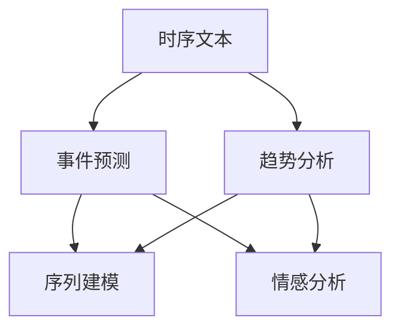

                 

# 时序文本分析：事件预测与趋势分析

## 1. 背景介绍

在数字化时代，时序文本数据的处理和分析变得越来越重要。在金融市场、社交媒体、新闻资讯等多个领域，时序文本数据蕴含着丰富的信息，可以帮助我们洞察事件的发生、趋势的变化以及人们的情感波动。事件预测和趋势分析作为时序文本分析的重要应用，能够帮助投资者、管理者、政策制定者等做出更准确的决策。

本文将重点介绍时序文本分析中的事件预测与趋势分析技术，探讨其原理、实现方法以及应用场景。通过深入分析这些技术，读者可以更好地理解如何利用时序文本数据进行高效、精准的预测与分析，进而提升自身在实际应用中的决策能力。

## 2. 核心概念与联系

### 2.1 核心概念概述

在进行事件预测与趋势分析时，需要掌握以下几个核心概念：

- **时序文本**：指按照时间顺序排列的文本数据，如金融新闻、社交媒体帖子、企业公告等。这些文本数据具有时间戳信息，可以反映出事件的发生和发展。

- **事件预测**：指通过分析时序文本数据，预测特定事件的发生概率或发生时间。例如，预测股票价格的变化、市场的周期性波动等。

- **趋势分析**：指通过分析时序文本数据，发现和预测特定现象的长期发展趋势。例如，分析金融市场的整体走向、社交媒体上的热门话题等。

- **序列建模**：指对时序文本数据进行建模，捕捉其时间上的依赖关系。常用的序列建模方法包括循环神经网络(RNN)、长短时记忆网络(LSTM)、门控循环单元(GRU)等。

- **情感分析**：指通过分析文本中的情感倾向，判断文本所表达的情感极性。情感分析在时序文本分析中起到了重要作用，能够帮助理解事件的情感色彩和人们的反应。

- **时间序列**：指按照时间顺序排列的数据序列，如股票价格、气温、流量等。时序文本分析中的时间序列通常指文本数据的时间戳信息。

这些核心概念之间的逻辑关系可以通过以下Mermaid流程图来展示：



这个流程图展示时序文本分析的核心概念及其之间的关系：

1. 时序文本作为输入，通过事件预测和趋势分析生成输出。
2. 序列建模和情感分析是实现事件预测和趋势分析的关键技术手段。

## 3. 核心算法原理 & 具体操作步骤

### 3.1 算法原理概述

时序文本分析中的事件预测与趋势分析主要依赖于序列建模和情感分析技术。下面我们将详细介绍这些技术的原理。

**序列建模**：时序文本数据具有时间上的依赖关系，序列建模技术能够捕捉这种依赖性。常用的序列建模方法包括循环神经网络(RNN)、长短时记忆网络(LSTM)、门控循环单元(GRU)等。这些方法通过学习文本的时间依赖关系，能够预测未来的文本内容。

**情感分析**：情感分析是指通过分析文本中的情感倾向，判断文本所表达的情感极性。常用的情感分析方法包括基于词典的方法、机器学习方法、深度学习方法等。这些方法通过学习文本的情感特征，能够预测文本的情感倾向。

### 3.2 算法步骤详解

在进行事件预测与趋势分析时，通常需要以下步骤：

**Step 1: 数据准备**
- 收集时序文本数据，如金融新闻、社交媒体帖子、企业公告等。
- 对文本数据进行预处理，包括文本清洗、分词、去除停用词等。
- 将文本数据转换为时间序列，如将文章发布时间作为时间戳。

**Step 2: 序列建模**
- 选择合适的序列建模方法，如RNN、LSTM、GRU等。
- 将预处理后的文本数据作为模型输入，训练模型捕捉文本的时间依赖关系。
- 使用训练好的模型进行时间序列预测，得到未来事件的预测结果。

**Step 3: 情感分析**
- 选择合适的情感分析方法，如基于词典的方法、机器学习方法、深度学习方法等。
- 将预处理后的文本数据作为模型输入，训练模型捕捉文本的情感倾向。
- 使用训练好的模型进行情感分析，得到文本的情感极性。

**Step 4: 事件预测**
- 结合序列建模和情感分析的结果，进行事件预测。
- 例如，预测股票价格的上涨和下跌、市场的周期性波动等。

**Step 5: 趋势分析**
- 对时序文本数据进行长期分析，发现和预测特定现象的长期发展趋势。
- 例如，分析金融市场的整体走向、社交媒体上的热门话题等。

### 3.3 算法优缺点

**序列建模的优点**：
- 能够捕捉文本的时间依赖关系。
- 适用于长序列数据的建模，能够处理时间跨度较大的文本数据。
- 能够处理缺失数据，具有较强的鲁棒性。

**序列建模的缺点**：
- 模型训练时间较长，计算资源消耗较大。
- 模型过于复杂，容易出现过拟合问题。
- 对于时间序列中的噪音数据敏感，需要较大的数据量进行训练。

**情感分析的优点**：
- 能够捕捉文本的情感倾向，提供文本情感极性的判断。
- 适用于各种类型的文本数据，能够处理不同领域的情感分析需求。
- 计算速度快，对计算资源的消耗较小。

**情感分析的缺点**：
- 情感分析结果的准确性受文本质量的影响较大。
- 对文本中的复杂情感表达无法准确捕捉，存在一定的局限性。
- 对文本的长度和结构有一定的要求，需要事先进行一定的预处理。

### 3.4 算法应用领域

时序文本分析中的事件预测与趋势分析技术在多个领域具有广泛的应用。以下是一些主要的应用场景：

- **金融市场分析**：通过分析股票新闻、财务报告等文本数据，预测股票价格的变化、市场的周期性波动等。
- **社交媒体分析**：通过分析社交媒体帖子、评论等文本数据，预测热门话题的变化、舆论的情感倾向等。
- **新闻资讯分析**：通过分析新闻文章、广告文本等文本数据，预测新闻的点击率、广告的效果等。
- **事件监测**：通过分析传感器数据、日志数据等文本数据，预测事件的发生时间、发展趋势等。

## 4. 数学模型和公式 & 详细讲解

### 4.1 数学模型构建

在时序文本分析中，我们通常使用以下数学模型进行事件预测与趋势分析：

- **循环神经网络(RNN)**：RNN是一种经典的序列建模方法，能够捕捉文本数据的时间依赖关系。其数学模型如下：
  $$
  h_t = \tanh(W_{h}[h_{t-1}, x_t] + b_h)
  $$
  $$
  y_t = softmax(W_y h_t + b_y)
  $$

- **长短时记忆网络(LSTM)**：LSTM是一种特殊的RNN，能够更好地处理长序列数据。其数学模型如下：
  $$
  h_t = \tanh(W_{h}[h_{t-1}, x_t] + b_h)
  $$
  $$
  f_t = \sigma(W_f[h_{t-1}, x_t] + b_f)
  $$
  $$
  o_t = \sigma(W_o[h_{t-1}, x_t] + b_o)
  $$
  $$
  c_t = f_t \odot c_{t-1} + i_t \odot \tanh(h_t)
  $$
  $$
  h_t = o_t \odot \tanh(c_t)
  $$
  $$
  y_t = softmax(W_y h_t + b_y)
  $$

- **门控循环单元(GRU)**：GRU是一种高效的序列建模方法，能够更好地处理长序列数据。其数学模型如下：
  $$
  h_t = \tanh(W_{h}[h_{t-1}, x_t] + b_h)
  $$
  $$
  r_t = \sigma(W_r[h_{t-1}, x_t] + b_r)
  $$
  $$
  z_t = \sigma(W_z[h_{t-1}, x_t] + b_z)
  $$
  $$
  c_t = (1 - z_t) \odot c_{t-1} + z_t \odot h_t
  $$
  $$
  h_t = \tanh(c_t)
  $$
  $$
  y_t = softmax(W_y h_t + b_y)
  $$

其中，$h_t$ 表示时间$t$的隐藏状态，$x_t$ 表示时间$t$的输入文本，$y_t$ 表示时间$t$的输出。

### 4.2 公式推导过程

以LSTM为例，其数学模型推导过程如下：

**输入门**：
  $$
  i_t = \sigma(W_f[h_{t-1}, x_t] + b_f)
  $$
  $$
  f_t = \sigma(W_f[h_{t-1}, x_t] + b_f)
  $$

**遗忘门**：
  $$
  r_t = \sigma(W_r[h_{t-1}, x_t] + b_r)
  $$
  $$
  z_t = \sigma(W_z[h_{t-1}, x_t] + b_z)
  $$

**更新状态**：
  $$
  c_t = f_t \odot c_{t-1} + i_t \odot \tanh(h_t)
  $$

**输出门**：
  $$
  o_t = \sigma(W_o[h_{t-1}, x_t] + b_o)
  $$

**隐藏状态**：
  $$
  h_t = o_t \odot \tanh(c_t)
  $$

**输出**：
  $$
  y_t = softmax(W_y h_t + b_y)
  $$

### 4.3 案例分析与讲解

以预测股票价格为例，我们可以使用LSTM模型进行事件预测。首先，收集相关股票的财务报告、新闻、公告等文本数据，并将这些数据作为模型的输入。然后，使用LSTM模型进行序列建模，捕捉文本数据的时间依赖关系。最后，使用训练好的模型进行时间序列预测，得到未来股票价格的预测结果。

## 5. 项目实践：代码实例和详细解释说明

### 5.1 开发环境搭建

在进行时序文本分析的实践时，需要搭建一个Python开发环境。以下是详细的搭建步骤：

1. 安装Anaconda：从官网下载并安装Anaconda，用于创建独立的Python环境。
2. 创建并激活虚拟环境：
```bash
conda create -n time_series_env python=3.8 
conda activate time_series_env
```
3. 安装必要的Python库：
```bash
pip install numpy pandas scikit-learn tensorflow keras
```

### 5.2 源代码详细实现

下面以使用LSTM模型进行股票价格预测为例，给出代码实现：

```python
import numpy as np
import pandas as pd
import matplotlib.pyplot as plt
import tensorflow as tf
from tensorflow.keras.models import Sequential
from tensorflow.keras.layers import LSTM, Dense

# 读取数据集
data = pd.read_csv('stock_prices.csv', index_col='date')

# 数据预处理
data['close'] = data['close'].astype(float)
data = data['close'].values.reshape(-1, 1)

# 构建LSTM模型
model = Sequential()
model.add(LSTM(units=50, input_shape=(X_train.shape[1], X_train.shape[2])))
model.add(Dense(units=1))
model.compile(optimizer='adam', loss='mse')

# 训练模型
model.fit(X_train, y_train, epochs=10, batch_size=32)

# 预测未来股票价格
future_dates = pd.date_range(start='2023-01-01', end='2023-06-30', freq='D').tolist()
future_prices = []
for date in future_dates:
    date_index = pd.to_datetime(date).date()
    if date_index in data.index:
        future_price = model.predict(np.array([data[date_index - 30]]).reshape(1, 1, 30))
        future_prices.append(future_price[0][0])

# 可视化预测结果
plt.plot(data.index, data, label='Actual Prices')
plt.plot(future_dates, future_prices, label='Predicted Prices')
plt.legend()
plt.show()
```

### 5.3 代码解读与分析

在上述代码中，我们首先读取了包含股票价格的数据集，并将其转换为时间序列数据。然后，构建了一个包含一个LSTM层和一个全连接层的序列模型，使用Adam优化器和均方误差损失函数进行训练。最后，使用训练好的模型预测未来股票价格，并可视化预测结果。

## 6. 实际应用场景

### 6.1 金融市场分析

在金融市场分析中，时序文本分析可以帮助分析师更好地理解市场动态。通过分析股票新闻、财务报告等文本数据，可以预测股票价格的变化、市场的周期性波动等。例如，分析股票新闻中的正面或负面情感，预测股票价格的上涨或下跌趋势。

### 6.2 社交媒体分析

在社交媒体分析中，时序文本分析可以帮助品牌经理更好地了解用户对品牌的看法。通过分析社交媒体帖子、评论等文本数据，可以预测热门话题的变化、舆论的情感倾向等。例如，分析用户对某个产品的评论情感，预测产品未来的市场表现。

### 6.3 新闻资讯分析

在新闻资讯分析中，时序文本分析可以帮助新闻编辑更好地策划内容。通过分析新闻文章、广告文本等文本数据，可以预测新闻的点击率、广告的效果等。例如，分析用户对某个新闻的情感倾向，预测该新闻的传播效果。

### 6.4 事件监测

在事件监测中，时序文本分析可以帮助政府和企业更好地应对突发事件。通过分析传感器数据、日志数据等文本数据，可以预测事件的发生时间、发展趋势等。例如，分析地震前后的传感器数据，预测地震的发生时间，提前采取应对措施。

## 7. 工具和资源推荐

### 7.1 学习资源推荐

为了帮助开发者系统掌握时序文本分析的理论基础和实践技巧，这里推荐一些优质的学习资源：

1. 《深度学习与自然语言处理》系列书籍：由深度学习专家撰写，深入浅出地介绍了深度学习、自然语言处理等领域的基本概念和经典模型。
2. 《序列建模与时间序列预测》在线课程：由知名大学提供的免费课程，系统讲解了序列建模、时间序列预测等技术。
3. TensorFlow官方文档：TensorFlow的官方文档，提供了详细的API文档和代码示例，是学习TensorFlow的重要资源。
4. Kaggle数据科学竞赛平台：提供了大量的数据集和竞赛，可以帮助开发者实践时序文本分析技术。

### 7.2 开发工具推荐

在进行时序文本分析的实践时，需要选择合适的开发工具。以下是一些常用的开发工具：

1. Python：Python是目前最流行的数据分析和机器学习编程语言之一，具有丰富的第三方库和框架。
2. TensorFlow：TensorFlow是Google开源的深度学习框架，支持分布式计算和多种模型架构。
3. Keras：Keras是一个高级神经网络API，可以运行在TensorFlow、Theano和CNTK之上，易于上手。
4. Jupyter Notebook：Jupyter Notebook是一个交互式的编程环境，支持Python、R等多种语言。

### 7.3 相关论文推荐

时序文本分析中的事件预测与趋势分析技术是一个活跃的研究领域，以下是一些前沿的学术论文推荐：

1. Attention Is All You Need：这篇论文提出了Transformer模型，开创了自然语言处理的预训练大模型时代。
2. Bidirectional LSTM for Stock Price Prediction：这篇论文提出了双向LSTM模型，用于预测股票价格。
3. Sentiment Analysis with LSTM and Convolutional Neural Networks：这篇论文提出了结合LSTM和卷积神经网络的情感分析模型，用于预测文本情感。
4. Event Prediction using LSTM Networks：这篇论文提出了LSTM网络进行事件预测的方法，用于预测股票市场的事件。
5. Long Short-Term Memory for Event Prediction：这篇论文提出了LSTM网络进行事件预测的方法，用于预测市场事件的周期性变化。

## 8. 总结：未来发展趋势与挑战

### 8.1 研究成果总结

时序文本分析中的事件预测与趋势分析技术已经取得了显著的成果，广泛应用于金融市场、社交媒体、新闻资讯等多个领域。在技术上，LSTM、GRU等序列建模方法已经被广泛使用，并取得了良好的预测效果。在应用上，时序文本分析技术帮助分析师、品牌经理、新闻编辑、政府和企业更好地理解和应对市场动态，预测事件的发生，优化决策过程。

### 8.2 未来发展趋势

未来，时序文本分析技术将呈现以下几个发展趋势：

1. **深度学习与大数据的结合**：深度学习模型在大数据上的应用将更加广泛，能够处理更多、更复杂的时序文本数据。
2. **多模态数据融合**：时序文本分析将不再局限于文本数据，而是融合多种数据类型，如传感器数据、图像数据等，实现更加全面、准确的预测。
3. **自监督学习方法**：自监督学习方法将更加流行，能够利用未标注数据进行预训练，提高模型的泛化能力和鲁棒性。
4. **联邦学习**：联邦学习将应用于时序文本分析，能够在保护隐私的前提下，利用分布式计算资源进行模型训练。

### 8.3 面临的挑战

时序文本分析中的事件预测与趋势分析技术在发展过程中仍面临诸多挑战：

1. **数据质量问题**：时序文本数据的质量直接影响模型的预测效果，数据清洗和预处理需要耗费大量时间和资源。
2. **模型复杂性**：深度学习模型通常具有较高的复杂度，训练和推理过程对计算资源的需求较大。
3. **模型可解释性**：深度学习模型的黑盒特性使得其可解释性较差，难以理解模型的内部工作机制。
4. **模型鲁棒性**：深度学习模型对噪声和异常值较为敏感，需要进一步提高模型的鲁棒性。

### 8.4 研究展望

为了解决上述挑战，未来的研究需要在以下几个方面进行探索：

1. **数据清洗与预处理**：探索更高效的数据清洗和预处理技术，提高数据质量，减少模型训练时间。
2. **模型压缩与优化**：探索模型压缩与优化技术，提高模型的推理速度和效率，降低计算资源消耗。
3. **模型可解释性**：探索模型可解释性技术，提高模型的透明性，增强决策过程的可解释性。
4. **模型鲁棒性**：探索模型鲁棒性技术，提高模型对噪声和异常值的耐受性，增强模型的泛化能力。

总之，时序文本分析中的事件预测与趋势分析技术具有广阔的发展前景，需要不断探索和创新，才能更好地服务于实际应用，推动人工智能技术的进步。

## 9. 附录：常见问题与解答

**Q1：时序文本分析中的事件预测与趋势分析技术是否适用于所有领域？**

A: 时序文本分析中的事件预测与趋势分析技术适用于多个领域，如金融市场、社交媒体、新闻资讯等。但对于一些特定领域，如医学、法律等，需要结合领域特定的数据和技术进行分析和预测。

**Q2：如何选择合适的时间序列模型？**

A: 选择合适的时间序列模型需要考虑数据的特点和预测需求。对于平稳的数据，可以选择ARIMA、LSTM等模型；对于非平稳的数据，可以选择GARCH、RNN等模型。可以通过模型选择对比实验，选择预测效果最佳的模型。

**Q3：如何进行模型的可解释性分析？**

A: 进行模型的可解释性分析可以通过可视化、特征重要性分析等方法。例如，可以使用可视化工具展示模型内部特征的重要性，帮助理解模型的决策过程。

**Q4：如何进行模型的鲁棒性增强？**

A: 进行模型的鲁棒性增强可以通过正则化、噪声注入、对抗样本生成等方法。例如，可以添加L2正则化，减少模型对噪声的敏感性；通过生成对抗样本，增强模型的鲁棒性。

**Q5：如何提高模型的训练速度和效率？**

A: 提高模型的训练速度和效率可以通过优化模型架构、使用分布式训练、使用硬件加速等方法。例如，可以采用混合精度训练，使用GPU加速模型训练。

---

作者：禅与计算机程序设计艺术 / Zen and the Art of Computer Programming

