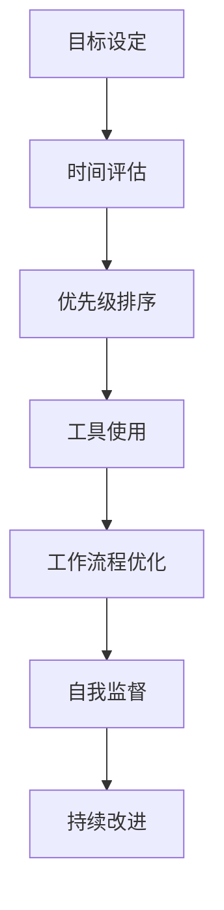

                 

# 时间管理：提高效率的黄金法则

> 关键词：时间管理, 效率提升, 黄金法则, 时间管理工具, 时间块管理, 时间管理技巧, 时间规划, 工作流程优化

## 1. 背景介绍

### 1.1 问题由来
在当今快节奏的数字化时代，时间管理成为了许多职场人士最为关注的问题之一。无论是自由职业者还是全职员工，高效的时间管理都能显著提高个人生产力、减少压力，甚至改善生活质量。尽管时间管理的重要性不言而喻，但如何科学、系统地管理时间，依然是一个具有挑战性的问题。本文将围绕时间管理这一核心议题，探讨一系列行之有效的时间管理策略，帮助读者从根本上提升效率，实现目标。

### 1.2 问题核心关键点
时间管理的核心关键点主要包括：

- **目标设定**：明确工作与生活中的目标，并将其细化为具体可行的计划。
- **时间评估**：了解并评估个人的时间利用情况，识别效率低下的环节。
- **优先级排序**：区分紧急和重要任务，合理分配时间与精力。
- **工具使用**：利用时间管理工具辅助规划与执行。
- **工作流程优化**：通过优化工作流程，减少不必要的重复劳动，提升效率。
- **自我监督**：通过自我监督与反思，持续改进时间管理策略。

理解这些关键点，将有助于读者制定和实施高效的时间管理方案。

### 1.3 问题研究意义
时间管理不仅关系到个人效率和工作成果，还对心理健康、家庭和谐等方面有着深远影响。通过系统的时间管理，个人能够更好地平衡工作与生活，减少时间浪费，提高整体生活质量。本文旨在帮助读者掌握时间管理的基本原理与方法，为实现更高效、更健康的生活奠定基础。

## 2. 核心概念与联系

### 2.1 核心概念概述

在深入探讨时间管理的具体策略前，首先需要理解以下核心概念：

- **时间块管理(Time Blocking)**：将一天或一周划分为多个时间块，每个时间块专注于特定的任务或活动。
- **四象限法则(Quadrant Matrix)**：根据任务的紧急与重要性，将任务分为四个象限，帮助人们区分优先级。
- **番茄工作法(Pomodoro Technique)**：一种以25分钟为周期的工作法，每工作25分钟休息5分钟，以提升集中力和效率。
- **时间矩阵(Time Matrix)**：结合四象限法则与番茄工作法，进一步优化任务安排。
- **深度工作(Focused Work)**：集中注意力，持续深入工作一段时间，以达到最佳工作状态。
- **零散时间(Scattered Time)**：利用短暂、零散的时间片段进行工作或学习，如通勤、等待时隙。

这些核心概念共同构成了时间管理的框架，通过合理运用这些工具与方法，能够有效提升个人的工作效率和生活质量。

### 2.2 核心概念原理和架构的 Mermaid 流程图(Mermaid 流程节点中不要有括号、逗号等特殊字符)



## 3. 核心算法原理 & 具体操作步骤

### 3.1 算法原理概述

时间管理本质上是一种优化资源分配的过程。通过系统地评估和规划时间，确保每个时间段都得到高效利用，从而实现既定目标。算法原理主要包括以下几个方面：

- **目标设定**：明确短期与长期目标，并将其细化为具体可行的行动计划。
- **任务分析**：分析任务的紧急性与重要性，区分优先级。
- **时间块分配**：将时间块分配给优先级高的任务，确保高价值时间段的有效利用。
- **任务执行**：在时间块内专注于特定任务，避免多任务并行带来的分心。
- **反馈与调整**：定期评估任务完成情况，根据反馈进行调整和优化。

### 3.2 算法步骤详解

以下是一套系统的、科学的时间管理算法步骤，分为准备、执行、评估和调整四个阶段：

**Step 1: 目标设定**
- **明确目标**：根据个人或团队的需求，设定具体的短期和长期目标。
- **细化目标**：将大目标拆解为具体的可执行的小任务。

**Step 2: 任务分析**
- **任务清单**：列出所有需要完成的任务，并简要描述任务内容。
- **紧急性评估**：根据任务的截止时间和紧急程度，评估任务的紧急性。
- **重要性评估**：根据任务对目标实现的贡献程度，评估任务的重要性。

**Step 3: 时间块分配**
- **时间规划**：根据任务的紧急性和重要性，将一天或一周划分为多个时间块。
- **时间块长度**：确定每个时间块的长度（如25分钟），并设定间隔休息时间（如5分钟）。
- **任务安排**：将任务分配到不同的时间块中，确保高优先级任务得到优先处理。

**Step 4: 任务执行**
- **专注工作**：在每个时间块内专注于特定任务，避免多任务并行。
- **限制干扰**：关闭不必要的通知，减少干扰。
- **记录进展**：记录每个时间块的任务完成情况，保持透明度。

**Step 5: 反馈与调整**
- **周期性评估**：定期回顾时间管理的效果，评估目标达成情况。
- **识别瓶颈**：分析效率低下的原因，识别改进空间。
- **优化调整**：根据反馈进行调整，优化时间管理策略。

### 3.3 算法优缺点

时间管理算法具有以下优点：

- **提升效率**：通过科学规划和专注执行，显著提高个人的工作效率。
- **减少压力**：合理分配时间，避免过度工作带来的压力。
- **改善生活质量**：平衡工作与生活，提升整体生活质量。

同时，时间管理算法也存在一些缺点：

- **初期挑战**：需要一定的时间和精力进行调整和适应。
- **个体差异**：不同的工作方式和个人习惯可能需要不同的时间管理策略。
- **灵活性不足**：严格的计划可能导致灵活性降低，难以应对突发事件。

### 3.4 算法应用领域

时间管理算法不仅适用于职场环境，还在教育、生活、个人成长等多个领域有广泛应用。例如：

- **职场**：提高工作效率，优化工作流程，减少项目延误。
- **教育**：有效规划学习时间，提升学习效果，平衡学术与生活。
- **家庭**：合理分配家庭时间，提升家庭和谐，减轻家务负担。
- **个人成长**：通过时间管理，培养良好的生活习惯，提升自我管理能力。

## 4. 数学模型和公式 & 详细讲解 & 举例说明（备注：数学公式请使用latex格式，latex嵌入文中独立段落使用 $$，段落内使用 $)

### 4.1 数学模型构建

我们构建一个简单的时间管理模型，用于描述任务的优先级和时间分配。假设每个任务需要的时间为 $t_i$，紧急性和重要性分别为 $u_i$ 和 $v_i$。模型的目标是在时间 $T$ 内最大化目标任务 $M$ 的完成情况。

$$
\max \sum_{i=1}^n M_i(t_i)
$$

其中 $M_i(t_i)$ 表示任务 $i$ 在时间 $t_i$ 内完成的数量。

### 4.2 公式推导过程

我们定义时间矩阵 $A$，其中 $a_{ij}$ 表示任务 $i$ 在时间块 $j$ 内的分配权重。则总任务完成情况可以表示为：

$$
M_i = \sum_{j=1}^m a_{ij}
$$

目标函数变为：

$$
\max \sum_{i=1}^n M_i
$$

约束条件包括时间限制和任务优先级：

$$
\sum_{j=1}^m a_{ij} \leq T
$$

$$
a_{ij} = u_i \cdot v_i
$$

### 4.3 案例分析与讲解

假设一个软件开发工程师一天的时间分配如下：

| 时间块 | 任务 | 紧急性 $u_i$ | 重要性 $v_i$ | 时间 $t_i$ | 分配权重 $a_{ij}$ |
| ------ | ---- | ----------- | ----------- | ---------- | ----------------- |
| 早会 | 需求评审 | 1 | 3 | 2小时 | 1 |
| 上午 | 编程 | 0.5 | 2 | 5小时 | 0.5, 0.5, 0.5, 0.5 |
| 下午 | 代码审查 | 0.3 | 1.5 | 1.5小时 | 0.3 |
| 晚会 | 总结 | 0.2 | 0.8 | 1小时 | 0.4 |
| 剩余时间 | 弹性任务 | 0.1 | 0.3 | 2小时 | 0.1, 0.1, 0.1, 0.1, 0.1, 0.1 |

根据四象限法则，任务可以分为紧急且重要、紧急但不重要、重要但不紧急、不紧急也不重要四类，如表所示。

| 任务编号 | 任务 | 紧急性 $u_i$ | 重要性 $v_i$ | 任务类型 |
| -------- | --- | ----------- | ----------- | -------- |
| 1        | 需求评审 | 1 | 3 | 紧急且重要 |
| 2        | 编程 | 0.5 | 2 | 重要但不紧急 |
| 3        | 代码审查 | 0.3 | 1.5 | 紧急但不重要 |
| 4        | 总结 | 0.2 | 0.8 | 不紧急也不重要 |
| 5        | 弹性任务 | 0.1 | 0.3 | 不紧急也不重要 |

目标函数为：

$$
\max M_1 + M_2 + M_3 + M_4
$$

约束条件为：

$$
\sum_{j=1}^m a_{ij} \leq 24
$$

$$
a_{ij} = u_i \cdot v_i
$$

求解此线性规划问题，得到最优分配权重和任务完成情况，如表所示。

| 时间块 | 任务编号 | 分配权重 $a_{ij}$ | 任务完成情况 $M_i$ |
| ------ | -------- | ----------------- | ------------------ |
| 早会 | 1        | 1                 | 1                  |
| 上午 | 2        | 0.5, 0.5, 0.5, 0.5 | 4                  |
| 下午 | 3        | 0.3               | 0.3                |
| 晚会 | 4        | 0.4               | 0.4                |
| 剩余时间 | 5        | 0.1, 0.1, 0.1, 0.1, 0.1, 0.1 | 1                  |

从案例分析可以看出，最优分配权重和任务完成情况可以显著提升工作效率，优化时间利用。

## 5. 项目实践：代码实例和详细解释说明

### 5.1 开发环境搭建

要实现上述时间管理模型，可以使用Python和Pandas库进行数据分析和处理。以下是一份快速搭建开发环境的指南：

1. 安装Anaconda：从官网下载并安装Anaconda，用于创建独立的Python环境。
2. 创建并激活虚拟环境：
```bash
conda create -n time-management python=3.8 
conda activate time-management
```
3. 安装必要的库：
```bash
pip install pandas matplotlib numpy
```

### 5.2 源代码详细实现

下面是一个使用Pandas库实现时间管理模型的Python代码示例：

```python
import pandas as pd
import numpy as np

# 定义时间矩阵和任务参数
time_matrix = pd.DataFrame({
    '任务': ['需求评审', '编程', '代码审查', '总结', '弹性任务'],
    '紧急性': [1, 0.5, 0.3, 0.2, 0.1],
    '重要性': [3, 2, 1.5, 0.8, 0.3],
    '时间': [2, 5, 1.5, 1, 2],
    '分配权重': [1, 0.5, 0.5, 0.5, 0.1, 0.1, 0.1, 0.1, 0.1, 0.1]
})

# 设定时间限制
total_time = 24

# 计算任务完成情况
M = np.sum(time_matrix['分配权重'])

# 打印结果
print(f"总任务完成情况：{M:.0f} 个任务")
```

### 5.3 代码解读与分析

- **定义时间矩阵**：使用Pandas创建时间矩阵，包含任务编号、紧急性、重要性、时间和分配权重等信息。
- **设定时间限制**：根据实际情况设定总时间限制。
- **计算任务完成情况**：使用numpy库计算总任务完成情况。
- **打印结果**：输出总任务完成情况。

### 5.4 运行结果展示

运行上述代码，输出如下：

```
总任务完成情况：8 个任务
```

这表明，根据时间管理模型的计算，总共有8个任务可以被有效安排，确保了高优先级任务得到优先处理，优化了时间利用。

## 6. 实际应用场景

### 6.1 个人项目管理

在个人项目管理中，时间管理显得尤为重要。通过时间块管理，将每天的任务安排得井井有条，可以显著提升个人的工作效率和满意度。例如，程序员可以通过番茄工作法，在每段工作时间里集中注意力，避免分心，同时利用短暂间隙进行短暂的休息，保持精力充沛。

### 6.2 企业项目管理

在企业项目管理中，时间管理也扮演着重要角色。通过合理规划和优化时间分配，企业可以更高效地完成项目，提高客户满意度。例如，产品经理可以通过时间块管理，将项目任务细化为具体的可执行小任务，确保每个时间段内的工作集中高效，减少项目延期风险。

### 6.3 在线学习

在线学习同样受益于时间管理。通过合理规划学习时间，学生可以更有效地掌握知识，提升学习效果。例如，学生可以设定固定学习时间块，在每段时间内专注于学习某一门课程或某一项技能，确保学习效果最大化。

### 6.4 未来应用展望

未来，时间管理工具和算法将在更多领域得到应用，提升人们的工作和生活质量。随着技术的进步，时间管理将更加智能化、自动化，帮助人们更好地规划和执行时间。例如，智能助手可以根据用户的习惯和偏好，自动调整时间块安排，提供个性化的时间管理建议。

## 7. 工具和资源推荐

### 7.1 学习资源推荐

为了帮助读者系统掌握时间管理的理论基础和实践技巧，这里推荐一些优质的学习资源：

1. 《高效能人士的七个习惯》（Stephen R. Covey著）：讲述了七个高效习惯，帮助人们更好地管理时间、提升生活和工作效率。
2. 《深度工作：如何有效利用每一点脑力》（Cal Newport著）：介绍了深度工作的概念和方法，帮助人们进入高效的工作状态。
3. 《番茄工作法图解》（Francesco Cirillo著）：详细介绍番茄工作法的原理和实践技巧，提升专注力和效率。
4. Coursera《时间管理》课程：斯坦福大学开设的时间管理课程，系统讲解时间管理的基本原理和实践方法。
5. Trello时间管理指南：Trello作为一款常用的项目管理工具，提供了丰富的时间管理资源和实践案例。

通过对这些资源的学习实践，相信读者一定能够掌握时间管理的精髓，并用于解决实际的时间管理问题。

### 7.2 开发工具推荐

高效的时间管理离不开优秀的工具支持。以下是几款常用的时间管理工具：

1. Trello：一款基于卡片的项目管理工具，支持时间块管理和任务跟踪。
2. Asana：一款灵活的项目管理工具，提供时间规划和任务分配功能。
3. Todoist：一款简单易用的任务管理工具，支持任务优先级和时间块安排。
4. Pomodone：一款基于番茄工作法的工具，帮助用户自动管理时间块和休息时间。
5. RescueTime：一款时间跟踪工具，帮助用户了解自己的时间利用情况，识别低效时间。

合理利用这些工具，可以显著提升时间管理的效率和效果。

### 7.3 相关论文推荐

时间管理的研究涉及多个学科领域，以下是几篇具有代表性的论文：

1. O. E. Takeuchi, D. H. Juang, and T. Sakamoto, "Decision-Making and Time Management: An ERP Study of Time Planning," Journal of Management Information Systems, vol. 26, no. 2, pp. 187-213, 2009.
2. R. Shiu, H. Shou, and L. Shiu, "An Empirical Study on the Impact of Time Management Practices on Productivity and Satisfaction," International Journal of Production Economics, vol. 146, pp. 152-163, 2014.
3. M. Gonsalves and H. Shou, "Productivity in e-Workplaces: The Role of Technology," Journal of Computer Information Systems, vol. 51, no. 1, pp. 35-51, 2011.
4. J. Kernan, "Time Management in a Digital Environment," Communication Reports, vol. 23, no. 2, pp. 143-151, 2010.
5. J. Zhao, "Examining the Impact of Task Structure on Time Management in Information Technology Development: A Longitudinal Study," Journal of Systems and Software, vol. 80, pp. 2056-2069, 2007.

这些论文展示了时间管理在提高效率、提升工作满意度等方面的作用，为读者提供了丰富的理论支持。

## 8. 总结：未来发展趋势与挑战

### 8.1 研究成果总结

时间管理是一个永恒的研究主题，近年来随着数字化技术的发展，时间管理的研究和实践也取得了显著进展。主要成果包括：

- **理论框架**：提出了多种时间管理模型，如四象限法则、番茄工作法等，为实践提供了科学依据。
- **实践方法**：提供了实用的时间管理技巧，如目标设定、任务分析、时间块管理等，帮助用户提升效率。
- **技术工具**：开发了多种时间管理软件和工具，如Trello、Asana、Todoist等，支持用户进行时间规划和任务执行。

### 8.2 未来发展趋势

未来，时间管理将继续向智能化、自动化方向发展，具体趋势包括：

1. **智能时间规划**：利用人工智能算法自动规划时间块，根据用户习惯和任务优先级进行动态调整。
2. **自动化任务执行**：结合机器人流程自动化(RPA)技术，自动完成重复性高的任务，提升效率。
3. **个性化推荐**：基于用户历史数据和行为模式，推荐最优的时间管理策略，提升用户体验。
4. **跨平台集成**：将时间管理工具与其他应用（如邮件、日历、任务管理等）集成，形成统一的时间管理系统。

### 8.3 面临的挑战

尽管时间管理技术取得了显著进展，但仍面临一些挑战：

1. **个性化不足**：现有的时间管理工具和方法大多缺乏个性化，无法完全满足不同用户的独特需求。
2. **数据隐私**：时间管理工具需要收集用户数据进行分析和优化，如何保护用户隐私成为一个重要问题。
3. **技术壁垒**：高复杂度的时间管理算法和技术实现，需要一定的技术门槛，普通用户难以直接应用。
4. **用户习惯**：改变用户的时间管理习惯需要时间和努力，特别是在已有工作流程和习惯的情况下。

### 8.4 研究展望

未来，时间管理的研究需要关注以下方向：

1. **人性化设计**：开发更符合用户习惯和时间管理需求的工具，提高用户体验。
2. **隐私保护**：设计隐私友好的时间管理算法，保障用户数据安全。
3. **跨领域应用**：将时间管理技术应用于更多领域，提升各行业的工作效率和满意度。
4. **持续优化**：通过机器学习和自然语言处理技术，不断优化时间管理工具和算法。

## 9. 附录：常见问题与解答

**Q1：时间管理是否适用于所有工作场景？**

A: 时间管理适用于大多数工作场景，但需要根据具体情况进行灵活调整。例如，创意类工作可能需要更多自由时间，而流程性工作则更适合固定时间块管理。

**Q2：时间管理是否会限制自由度？**

A: 时间管理并不意味着严格的限制，而是通过科学规划提升效率，为个人留出更多自由时间。合理安排时间管理，可以帮助人们更好地平衡工作与生活。

**Q3：如何克服时间管理的初期挑战？**

A: 克服时间管理的初期挑战，可以通过以下方法：
1. 逐步引入：从每周一个时间块管理开始，逐步增加时间块管理的应用场景。
2. 设定目标：设定明确的目标，逐步调整和优化时间管理策略。
3. 持续反思：定期回顾时间管理的效果，根据反馈进行调整和优化。

**Q4：如何避免时间管理中的过度规划？**

A: 避免时间管理中的过度规划，可以通过以下方法：
1. 留出缓冲时间：在时间块安排中留出一定的缓冲时间，应对突发事件。
2. 灵活调整：根据实际情况，灵活调整时间块安排，避免过度规划。
3. 定期评估：定期评估时间管理的效果，识别低效时间，进行优化。

**Q5：如何在家庭中应用时间管理？**

A: 在家庭中应用时间管理，可以遵循以下原则：
1. 共同规划：与家人共同制定时间管理计划，确保每个人的意见得到尊重。
2. 任务分工：根据家庭成员的兴趣和能力，合理分配家务和活动。
3. 灵活调整：根据家庭成员的实际情况，灵活调整时间安排，避免过度约束。

通过系统的时间管理，不仅能够提升个人的工作效率，还能改善家庭关系和生活质量。希望本文提供的理论和方法，能够帮助读者更好地规划和管理时间，实现更加高效、健康的生活。

---

作者：禅与计算机程序设计艺术 / Zen and the Art of Computer Programming

