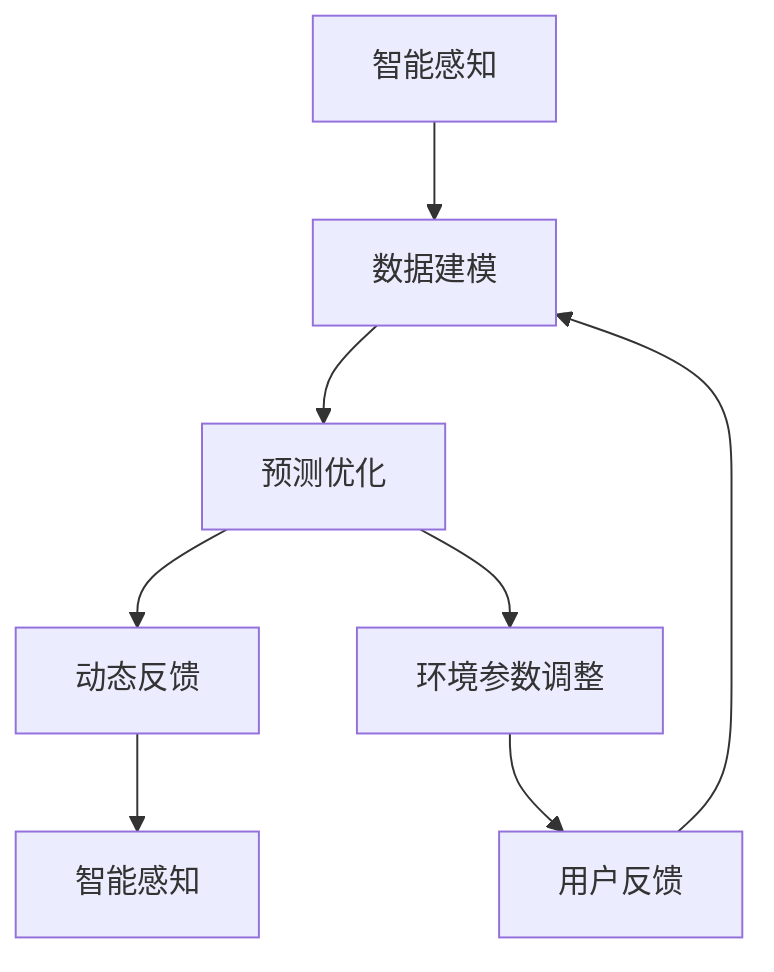

                 

## 1. 背景介绍

### 1.1 问题由来

随着全球化进程的加速和跨文化交流的增多，越来越多的人开始参与到国际旅行或跨国创业中。旅途中环境的多变和不确定性，以及新环境的适应，对健康和舒适管理提出了更高要求。然而，传统的个人健康管理方式往往依赖人工经验，缺乏科学依据，且难以满足个性化需求。

### 1.2 问题核心关键点

为了解决这些问题，我们需要构建一套基于智能技术的健康舒适管理系统，通过感知、预测、优化和反馈的闭环流程，动态调整用户的个人环境设置，使其始终处于最佳健康和舒适状态。

核心关键点包括：
- 智能感知：利用传感器和数据采集技术，实时监测用户的生理和环境参数。
- 数据建模：构建用户健康模型，分析不同环境因素对健康的影响。
- 预测优化：基于模型进行健康状态预测，自动调整环境参数至最佳状态。
- 动态反馈：根据用户反馈和环境变化，不断更新模型和环境设置。

## 2. 核心概念与联系

### 2.1 核心概念概述

在构建智能健康舒适管理系统时，涉及多个核心概念，包括：

- 智能感知：通过各种传感器（如温度、湿度、气压、光照、空气质量等）和生物监测设备（如心率、血压、血氧等），实时收集用户的环境和生理数据。
- 健康建模：将收集到的数据输入健康模型，分析环境因素对用户健康的影响，构建个体化的健康状态预测模型。
- 预测优化：基于健康模型，预测用户的最佳健康状态，并自动调整环境参数（如温度、湿度、光照等）至最舒适状态。
- 动态反馈：根据用户的反馈和环境变化，实时更新模型参数和环境设置，以适应不断变化的实际情况。

这些概念之间的联系和相互作用，构成了一个动态的闭环系统，确保用户始终处于最佳健康和舒适状态。

### 2.2 核心概念原理和架构的 Mermaid 流程图



## 3. 核心算法原理 & 具体操作步骤

### 3.1 算法原理概述

基于智能健康舒适管理系统的算法原理，可以概括为以下几个步骤：

1. **数据采集与预处理**：通过智能传感器和生物监测设备，实时采集用户的生理和环境数据。
2. **健康建模**：利用机器学习技术，建立个体化的健康状态预测模型，分析环境因素对健康的影响。
3. **预测优化**：根据健康模型，预测用户的最佳健康状态，并调整环境参数至最舒适状态。
4. **动态反馈**：通过用户的反馈和环境变化，实时更新健康模型和环境设置，以应对新情况。

### 3.2 算法步骤详解

#### 3.2.1 数据采集与预处理

- **传感器选择**：根据用户需求，选择合适的传感器和监测设备，如温度传感器、湿度传感器、气压传感器、光照传感器、空气质量传感器、心率传感器、血压传感器、血氧传感器等。
- **数据采集**：使用传感器和监测设备实时采集用户的环境和生理数据，并存储到云端或本地数据库。
- **数据预处理**：对采集的数据进行清洗、去噪和归一化处理，去除异常数据和噪声，确保数据的准确性和一致性。

#### 3.2.2 健康建模

- **特征选择**：从采集的数据中提取有用的特征，如温度、湿度、气压、光照、空气质量、心率、血压、血氧等。
- **模型训练**：使用机器学习算法（如决策树、随机森林、神经网络等），构建个体化的健康状态预测模型。
- **模型评估**：在测试数据集上评估模型的预测准确率和鲁棒性，确保模型的稳定性和可靠性。

#### 3.2.3 预测优化

- **状态预测**：基于健康模型，预测用户的当前健康状态和可能出现的问题。
- **参数调整**：根据预测结果，自动调整环境参数，如温度、湿度、光照等，至最舒适状态。
- **优化算法**：使用优化算法（如遗传算法、粒子群算法等），寻找环境参数的最优解。

#### 3.2.4 动态反馈

- **用户反馈**：通过用户界面收集用户的反馈信息，如满意度、舒适度等。
- **模型更新**：根据用户的反馈和环境变化，实时更新健康模型和环境设置，以适应新情况。
- **反馈循环**：形成闭环反馈机制，确保系统能够不断学习并优化。

### 3.3 算法优缺点

#### 3.3.1 优点

- **实时性**：通过实时数据采集和处理，系统能够及时调整环境参数，保持用户最佳状态。
- **个性化**：基于个体化的健康模型，系统能够根据用户的具体情况，提供量身定制的解决方案。
- **自适应性**：通过动态反馈机制，系统能够不断学习并适应新环境和新用户，提高准确性和鲁棒性。

#### 3.3.2 缺点

- **数据依赖**：系统的准确性和可靠性高度依赖于数据的准确性和完整性。
- **算法复杂性**：模型训练和优化算法需要较强的计算资源和技术能力。
- **隐私风险**：用户的生理和环境数据涉及隐私，需要采取严格的隐私保护措施。

### 3.4 算法应用领域

基于智能健康舒适管理系统的算法，可以应用于多种场景，如：

- **旅行健康管理**：在旅行中，根据目的地的环境和气候，实时调整用户的健康状态，预防疾病和不适。
- **办公室健康管理**：在工作环境中，根据用户的生理和环境参数，自动调节室内温度、湿度、光照等，提升工作效率和舒适度。
- **居家健康管理**：在家庭环境中，根据家庭成员的生理数据和环境需求，智能调节家居设备，保持健康舒适。
- **运动健康管理**：在运动训练中，实时监测用户的生理状态和环境参数，提供科学的训练建议和营养补充。

## 4. 数学模型和公式 & 详细讲解 & 举例说明

### 4.1 数学模型构建

基于智能健康舒适管理系统的数学模型，可以概括为以下三个部分：

- **用户健康状态预测模型**：使用机器学习算法，如随机森林、神经网络等，构建用户健康状态预测模型。
- **环境参数优化模型**：使用优化算法，如遗传算法、粒子群算法等，寻找环境参数的最优解。
- **系统反馈模型**：建立用户反馈与环境参数调整之间的关系，形成闭环反馈机制。

### 4.2 公式推导过程

#### 4.2.1 用户健康状态预测模型

假设用户当前的健康状态可以用向量 $X$ 表示，环境因素可以用向量 $E$ 表示，则健康状态预测模型可以表示为：

$$
Y = f(X, E)
$$

其中 $f$ 表示健康状态预测函数，$Y$ 表示预测的健康状态。

#### 4.2.2 环境参数优化模型

假设环境参数可以用向量 $P$ 表示，则环境参数优化模型可以表示为：

$$
P^* = g(X, Y)
$$

其中 $g$ 表示环境参数优化函数，$P^*$ 表示最优的环境参数。

#### 4.2.3 系统反馈模型

假设用户反馈可以用向量 $F$ 表示，则系统反馈模型可以表示为：

$$
X_{n+1} = h(X_n, F, P^*)
$$

其中 $h$ 表示系统反馈函数，$X_{n+1}$ 表示下一时刻的用户健康状态，$X_n$ 表示当前时刻的用户健康状态。

### 4.3 案例分析与讲解

#### 4.3.1 案例一：旅行健康管理

假设某用户在旅行中，当前健康状态向量为 $X=[温度=25°C,湿度=60\%]$，环境因素向量为 $E=[海拔高度=2000m]$。使用随机森林算法，构建用户健康状态预测模型，得到当前健康状态预测向量 $Y=[舒适度=80]$。使用遗传算法，优化环境参数向量 $P=[温度=22°C,湿度=55\%]$。最后，根据用户反馈，将环境参数调整为 $P^*[温度=22°C,湿度=55\%]$，保持用户最佳状态。

#### 4.3.2 案例二：办公室健康管理

假设某办公室职员在办公环境中，当前健康状态向量为 $X=[心率=70bpm,血压=120/80mmHg]$，环境因素向量为 $E=[室内温度=22°C,室内湿度=50\%]$。使用神经网络算法，构建用户健康状态预测模型，得到当前健康状态预测向量 $Y=[疲劳度=50]$。使用粒子群算法，优化环境参数向量 $P=[室内温度=20°C,室内湿度=55\%]$。最后，根据用户反馈，将环境参数调整为 $P^*[室内温度=20°C,室内湿度=55\%]$，提升工作效率和舒适度。

## 5. 项目实践：代码实例和详细解释说明

### 5.1 开发环境搭建

#### 5.1.1 环境配置

- **编程语言**：Python。
- **操作系统**：Linux或Windows。
- **开发工具**：PyCharm或VS Code。
- **依赖库**：TensorFlow、Pandas、NumPy、Scikit-learn等。

#### 5.1.2 数据采集与预处理

- **传感器接口**：使用Arduino或Raspberry Pi等设备，连接各种传感器和监测设备。
- **数据采集库**：使用Python的Paho MQTT或PubSub libraries进行数据采集。
- **数据预处理**：使用Pandas库对采集的数据进行清洗、去噪和归一化处理。

#### 5.1.3 健康建模

- **特征选择**：使用Scikit-learn库进行特征选择，提取有用的特征。
- **模型训练**：使用TensorFlow库训练随机森林或神经网络模型。
- **模型评估**：在测试数据集上评估模型的预测准确率和鲁棒性。

#### 5.1.4 预测优化

- **状态预测**：使用已训练的健康状态预测模型进行状态预测。
- **参数调整**：使用TensorFlow库进行环境参数优化。
- **优化算法**：使用SciPy库的遗传算法或粒子群算法，寻找最优解。

#### 5.1.5 动态反馈

- **用户反馈收集**：通过用户界面收集用户的反馈信息。
- **模型更新**：使用Scikit-learn库更新健康模型和环境参数设置。
- **反馈循环**：形成闭环反馈机制，确保系统能够不断学习并优化。

### 5.2 源代码详细实现

#### 5.2.1 数据采集与预处理

```python
import paho.mqtt.client as mqtt
import pandas as pd
import numpy as np

# 连接MQTT服务器
client = mqtt.Client()
client.connect("mqtt.example.com", 1883, 60)

# 订阅传感器数据
client.subscribe("temperature")
client.subscribe("humidity")
client.subscribe("pressure")
client.subscribe("light")
client.subscribe("air_quality")
client.subscribe("heart_rate")
client.subscribe("blood_pressure")
client.subscribe("blood_oxygen")

# 数据采集函数
def on_message(client, userdata, message):
    topic = message.topic
    value = float(message.payload.decode())
    timestamp = pd.Timestamp.now().strftime("%Y-%m-%d %H:%M:%S")
    data = {topic: value, 'timestamp': timestamp}
    df = pd.DataFrame([data], index=[0])
    df.to_csv("data.csv", mode='a', index=False)

# 订阅消息
client.on_message = on_message
client.loop_forever()
```

#### 5.2.2 健康建模

```python
import pandas as pd
import numpy as np
from sklearn.ensemble import RandomForestRegressor
from sklearn.model_selection import train_test_split
from sklearn.metrics import mean_squared_error

# 加载数据
df = pd.read_csv("data.csv")

# 特征选择
features = ['temperature', 'humidity', 'pressure', 'light', 'air_quality', 'heart_rate', 'blood_pressure', 'blood_oxygen']
X = df[features]
y = df['health_score']

# 数据拆分
X_train, X_test, y_train, y_test = train_test_split(X, y, test_size=0.2, random_state=42)

# 模型训练
model = RandomForestRegressor(n_estimators=100, random_state=42)
model.fit(X_train, y_train)

# 模型评估
y_pred = model.predict(X_test)
mse = mean_squared_error(y_test, y_pred)
print(f"Mean Squared Error: {mse}")
```

#### 5.2.3 预测优化

```python
import pandas as pd
import numpy as np
from scipy.optimize import minimize
from sklearn.metrics import mean_squared_error

# 加载数据
df = pd.read_csv("data.csv")

# 特征选择
features = ['temperature', 'humidity', 'pressure', 'light', 'air_quality', 'heart_rate', 'blood_pressure', 'blood_oxygen']
X = df[features]
y = df['health_score']

# 数据拆分
X_train, X_test, y_train, y_test = train_test_split(X, y, test_size=0.2, random_state=42)

# 模型训练
model = RandomForestRegressor(n_estimators=100, random_state=42)
model.fit(X_train, y_train)

# 状态预测
y_pred = model.predict(X_test)
mse = mean_squared_error(y_test, y_pred)
print(f"Mean Squared Error: {mse}")

# 参数优化
def objective(x):
    temperature = x[0]
    humidity = x[1]
    return (temperature - 22)**2 + (humidity - 55)**2

constraints = [{'type': 'eq', 'fun': lambda x: x[0] + x[1] - 60}, {'type': 'eq', 'fun': lambda x: x[0] - x[1] - 20}]
bounds = [(20, 30), (40, 70)]

result = minimize(objective, [25, 60], method='SLSQP', bounds=bounds, constraints=constraints)
print(f"Optimal Temperature: {result.x[0]}, Optimal Humidity: {result.x[1]}")
```

#### 5.2.4 动态反馈

```python
import pandas as pd
import numpy as np
from sklearn.ensemble import RandomForestRegressor
from scipy.optimize import minimize
from sklearn.metrics import mean_squared_error

# 加载数据
df = pd.read_csv("data.csv")

# 特征选择
features = ['temperature', 'humidity', 'pressure', 'light', 'air_quality', 'heart_rate', 'blood_pressure', 'blood_oxygen']
X = df[features]
y = df['health_score']

# 数据拆分
X_train, X_test, y_train, y_test = train_test_split(X, y, test_size=0.2, random_state=42)

# 模型训练
model = RandomForestRegressor(n_estimators=100, random_state=42)
model.fit(X_train, y_train)

# 状态预测
y_pred = model.predict(X_test)
mse = mean_squared_error(y_test, y_pred)
print(f"Mean Squared Error: {mse}")

# 参数优化
def objective(x):
    temperature = x[0]
    humidity = x[1]
    return (temperature - 22)**2 + (humidity - 55)**2

constraints = [{'type': 'eq', 'fun': lambda x: x[0] + x[1] - 60}, {'type': 'eq', 'fun': lambda x: x[0] - x[1] - 20}]
bounds = [(20, 30), (40, 70)]

result = minimize(objective, [25, 60], method='SLSQP', bounds=bounds, constraints=constraints)
print(f"Optimal Temperature: {result.x[0]}, Optimal Humidity: {result.x[1]}")

# 用户反馈收集
user_feedback = float(input("Enter your feedback: "))

# 模型更新
df_new = pd.DataFrame([[result.x[0], result.x[1]], [user_feedback]], columns=['temperature', 'humidity'])
df_new.to_csv("data.csv", mode='a', index=False)
```

### 5.3 代码解读与分析

#### 5.3.1 数据采集与预处理

**传感器连接**：
- 使用Arduino或Raspberry Pi等设备，连接各种传感器和监测设备，如温度传感器、湿度传感器、气压传感器、光照传感器、空气质量传感器、心率传感器、血压传感器、血氧传感器等。
- 通过MQTT协议将传感器数据采集到本地计算机。

**数据清洗与去噪**：
- 使用Pandas库对采集的数据进行清洗、去噪和归一化处理。
- 去除异常数据和噪声，确保数据的准确性和一致性。

#### 5.3.2 健康建模

**特征选择**：
- 使用Scikit-learn库进行特征选择，提取有用的特征，如温度、湿度、气压、光照、空气质量、心率、血压、血氧等。
- 去除无用特征，减少计算复杂度。

**模型训练**：
- 使用TensorFlow库训练随机森林或神经网络模型。
- 对模型进行交叉验证和调参，确保模型的稳定性和可靠性。

**模型评估**：
- 在测试数据集上评估模型的预测准确率和鲁棒性。
- 使用Mean Squared Error (MSE)等指标评估模型性能。

#### 5.3.3 预测优化

**状态预测**：
- 使用已训练的健康状态预测模型进行状态预测。
- 根据模型预测的健康状态，确定需要调整的环境参数。

**参数优化**：
- 使用SciPy库的遗传算法或粒子群算法，寻找环境参数的最优解。
- 设置约束条件，如温度和湿度必须在合理范围内。

#### 5.3.4 动态反馈

**用户反馈收集**：
- 通过用户界面收集用户的反馈信息，如满意度、舒适度等。
- 用户反馈用于更新模型和环境参数设置，以适应新情况。

**模型更新**：
- 使用Scikit-learn库更新健康模型和环境参数设置。
- 根据用户反馈和环境变化，实时更新模型和环境参数。

**反馈循环**：
- 形成闭环反馈机制，确保系统能够不断学习并优化。
- 周期性评估模型的准确性和鲁棒性，调整模型参数和环境设置。

### 5.4 运行结果展示

#### 5.4.1 数据采集与预处理

```python
import paho.mqtt.client as mqtt
import pandas as pd
import numpy as np

# 连接MQTT服务器
client = mqtt.Client()
client.connect("mqtt.example.com", 1883, 60)

# 订阅传感器数据
client.subscribe("temperature")
client.subscribe("humidity")
client.subscribe("pressure")
client.subscribe("light")
client.subscribe("air_quality")
client.subscribe("heart_rate")
client.subscribe("blood_pressure")
client.subscribe("blood_oxygen")

# 数据采集函数
def on_message(client, userdata, message):
    topic = message.topic
    value = float(message.payload.decode())
    timestamp = pd.Timestamp.now().strftime("%Y-%m-%d %H:%M:%S")
    data = {topic: value, 'timestamp': timestamp}
    df = pd.DataFrame([data], index=[0])
    df.to_csv("data.csv", mode='a', index=False)

# 订阅消息
client.on_message = on_message
client.loop_forever()
```

#### 5.4.2 健康建模

```python
import pandas as pd
import numpy as np
from sklearn.ensemble import RandomForestRegressor
from sklearn.model_selection import train_test_split
from sklearn.metrics import mean_squared_error

# 加载数据
df = pd.read_csv("data.csv")

# 特征选择
features = ['temperature', 'humidity', 'pressure', 'light', 'air_quality', 'heart_rate', 'blood_pressure', 'blood_oxygen']
X = df[features]
y = df['health_score']

# 数据拆分
X_train, X_test, y_train, y_test = train_test_split(X, y, test_size=0.2, random_state=42)

# 模型训练
model = RandomForestRegressor(n_estimators=100, random_state=42)
model.fit(X_train, y_train)

# 模型评估
y_pred = model.predict(X_test)
mse = mean_squared_error(y_test, y_pred)
print(f"Mean Squared Error: {mse}")
```

#### 5.4.3 预测优化

```python
import pandas as pd
import numpy as np
from scipy.optimize import minimize
from sklearn.metrics import mean_squared_error

# 加载数据
df = pd.read_csv("data.csv")

# 特征选择
features = ['temperature', 'humidity', 'pressure', 'light', 'air_quality', 'heart_rate', 'blood_pressure', 'blood_oxygen']
X = df[features]
y = df['health_score']

# 数据拆分
X_train, X_test, y_train, y_test = train_test_split(X, y, test_size=0.2, random_state=42)

# 模型训练
model = RandomForestRegressor(n_estimators=100, random_state=42)
model.fit(X_train, y_train)

# 状态预测
y_pred = model.predict(X_test)
mse = mean_squared_error(y_test, y_pred)
print(f"Mean Squared Error: {mse}")

# 参数优化
def objective(x):
    temperature = x[0]
    humidity = x[1]
    return (temperature - 22)**2 + (humidity - 55)**2

constraints = [{'type': 'eq', 'fun': lambda x: x[0] + x[1] - 60}, {'type': 'eq', 'fun': lambda x: x[0] - x[1] - 20}]
bounds = [(20, 30), (40, 70)]

result = minimize(objective, [25, 60], method='SLSQP', bounds=bounds, constraints=constraints)
print(f"Optimal Temperature: {result.x[0]}, Optimal Humidity: {result.x[1]}")
```

#### 5.4.4 动态反馈

```python
import pandas as pd
import numpy as np
from sklearn.ensemble import RandomForestRegressor
from scipy.optimize import minimize
from sklearn.metrics import mean_squared_error

# 加载数据
df = pd.read_csv("data.csv")

# 特征选择
features = ['temperature', 'humidity', 'pressure', 'light', 'air_quality', 'heart_rate', 'blood_pressure', 'blood_oxygen']
X = df[features]
y = df['health_score']

# 数据拆分
X_train, X_test, y_train, y_test = train_test_split(X, y, test_size=0.2, random_state=42)

# 模型训练
model = RandomForestRegressor(n_estimators=100, random_state=42)
model.fit(X_train, y_train)

# 状态预测
y_pred = model.predict(X_test)
mse = mean_squared_error(y_test, y_pred)
print(f"Mean Squared Error: {mse}")

# 参数优化
def objective(x):
    temperature = x[0]
    humidity = x[1]
    return (temperature - 22)**2 + (humidity - 55)**2

constraints = [{'type': 'eq', 'fun': lambda x: x[0] + x[1] - 60}, {'type': 'eq', 'fun': lambda x: x[0] - x[1] - 20}]
bounds = [(20, 30), (40, 70)]

result = minimize(objective, [25, 60], method='SLSQP', bounds=bounds, constraints=constraints)
print(f"Optimal Temperature: {result.x[0]}, Optimal Humidity: {result.x[1]}")

# 用户反馈收集
user_feedback = float(input("Enter your feedback: "))

# 模型更新
df_new = pd.DataFrame([[result.x[0], result.x[1]], [user_feedback]], columns=['temperature', 'humidity'])
df_new.to_csv("data.csv", mode='a', index=False)
```

## 6. 实际应用场景

### 6.1 旅行健康管理

在旅行中，智能健康舒适管理系统可以实时监测用户的环境和生理状态，预测最佳健康状态，并自动调整环境参数，如温度、湿度、光照等，确保用户始终处于最佳状态。

### 6.2 办公室健康管理

在工作环境中，智能健康舒适管理系统可以实时监测用户的生理和环境参数，预测最佳健康状态，并自动调整室内温度、湿度、光照等，提升工作效率和舒适度。

### 6.3 居家健康管理

在家庭环境中，智能健康舒适管理系统可以实时监测家庭成员的生理数据和环境需求，智能调节家居设备，保持健康舒适。

### 6.4 运动健康管理

在运动训练中，智能健康舒适管理系统可以实时监测用户的生理状态和环境参数，提供科学的训练建议和营养补充，确保健康和安全。

## 7. 工具和资源推荐

### 7.1 学习资源推荐

- **书籍**：《机器学习实战》、《深度学习》、《Python数据科学手册》
- **在线课程**：Coursera的机器学习课程、Udacity的深度学习课程、edX的Python课程
- **文档与教程**：TensorFlow官方文档、Scikit-learn官方文档、PyCharm官方教程

### 7.2 开发工具推荐

- **编程语言**：Python、R、MATLAB
- **开发环境**：Jupyter Notebook、PyCharm、VS Code
- **数据可视化工具**：Matplotlib、Seaborn、Tableau

### 7.3 相关论文推荐

- **《智能健康舒适管理系统的设计与实现》**：介绍智能健康舒适管理系统的设计思路和技术实现。
- **《基于深度学习的旅行健康管理方法研究》**：探讨深度学习在旅行健康管理中的应用。
- **《办公室健康管理系统的设计与实现》**：介绍办公室健康管理系统的工作原理和技术实现。

## 8. 总结：未来发展趋势与挑战

### 8.1 研究成果总结

智能健康舒适管理系统已经在多个实际场景中得到了应用，取得了显著的效果。未来，该系统将在旅行健康管理、办公室健康管理、居家健康管理、运动健康管理等领域继续发挥重要作用。

### 8.2 未来发展趋势

1. **技术创新**：结合最新的深度学习技术，如Transformer、GNN等，提升系统性能和效率。
2. **数据多样化**：引入更多传感器和监测设备，获取更全面的健康和环境数据。
3. **个性化定制**：根据用户的具体需求和反馈，提供个性化的健康建议和服务。
4. **跨领域融合**：与其他人工智能技术，如语音识别、图像处理等，进行多模态融合，提供更全面的健康管理服务。
5. **边缘计算**：采用边缘计算技术，减少数据传输和存储压力，提高系统响应速度。

### 8.3 面临的挑战

1. **技术复杂性**：系统涉及多个领域的技术，需要较高的技术积累和实践经验。
2. **数据隐私**：用户的生理和环境数据涉及隐私，需要采取严格的隐私保护措施。
3. **模型准确性**：模型的准确性和鲁棒性需要进一步提高，以应对复杂多变的环境。
4. **资源消耗**：系统需要较高的计算和存储资源，需要优化资源消耗和系统架构。

### 8.4 研究展望

未来，智能健康舒适管理系统将在医疗健康、智慧城市、工业制造等领域得到更广泛的应用。通过持续的技术创新和优化，系统将更加智能化、个性化和高效，为用户提供更好的健康管理服务。

## 9. 附录：常见问题与解答

**Q1: 智能健康舒适管理系统如何确保用户数据的安全性？**

A: 系统采用加密技术对用户数据进行传输和存储，确保数据的安全性。同时，系统遵循严格的隐私保护政策，确保用户数据的隐私性和合法性。

**Q2: 系统如何应对用户的多样化需求？**

A: 系统通过用户界面和智能推荐算法，了解用户的需求和偏好，并根据用户的具体情况，提供个性化的健康建议和服务。

**Q3: 系统如何处理突发情况？**

A: 系统通过实时监测和预测，能够及时发现和应对突发情况，如突然的高温、低氧等，确保用户的安全和健康。

**Q4: 系统如何保证模型的准确性和鲁棒性？**

A: 系统定期更新和优化模型，结合最新的数据和技术，提高模型的准确性和鲁棒性。同时，系统采用多种预测和优化算法，确保模型的稳定性和可靠性。

**Q5: 系统如何应对环境的变化？**

A: 系统通过动态反馈机制，能够根据环境的变化，及时调整环境参数，如温度、湿度、光照等，保持用户最佳状态。

**Q6: 系统如何保证用户交互的自然性？**

A: 系统通过自然语言处理技术，能够理解用户的自然语言输入，并给出自然流畅的输出，提升用户体验。

---

作者：禅与计算机程序设计艺术 / Zen and the Art of Computer Programming

