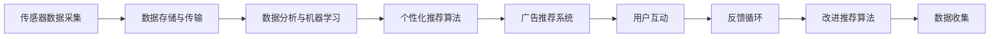

                 

# 智能体重秤的健康跟踪与注意力经济

## 1. 背景介绍

随着数字时代的到来，人们的生活方式日益数字化、智能化。智能体重秤作为一种常见的家庭健康设备，已经被广泛应用于健康管理、体重控制等场景中。但传统体重秤往往功能单一、数据展示单调，无法满足人们对健康管理的深入需求。基于此，本文将探讨一种集成了人工智能(AI)技术的智能体重秤，通过健康数据跟踪、数据分析、个性化推荐等功能，帮助用户更科学地进行健康管理，同时为商家和广告主提供注意力经济的新模式。

## 2. 核心概念与联系

### 2.1 核心概念概述

智能体重秤的核心功能包括：

1. **健康数据跟踪**：记录用户的体重、体脂率、心率等生理数据，生成健康图表。
2. **数据分析**：对健康数据进行分析，生成趋势、预测、推荐等功能。
3. **个性化推荐**：根据健康数据和用户习惯，推荐合适的饮食、运动计划，或商品广告。
4. **注意力经济**：通过精准的广告投放，实现商家和广告主的目标。

这些功能通过以下核心概念实现：

1. **传感器技术**：用于采集用户的生理数据。
2. **数据存储与传输**：将数据存储到云端，并提供API供应用调用。
3. **数据分析与机器学习**：利用机器学习算法进行数据分析和预测。
4. **个性化推荐算法**：根据用户行为和偏好推荐商品或服务。
5. **广告推荐系统**：根据用户画像精准投放广告。

### 2.2 核心概念原理和架构的 Mermaid 流程图



## 3. 核心算法原理 & 具体操作步骤

### 3.1 算法原理概述

智能体重秤的健康跟踪与个性化推荐系统基于以下核心算法：

1. **时间序列分析**：对健康数据进行时间序列分析，生成趋势、预测等。
2. **聚类分析**：对用户健康数据进行聚类分析，生成健康画像。
3. **推荐系统**：利用协同过滤、内容过滤等推荐算法，生成个性化推荐。
4. **广告推荐系统**：基于用户画像和行为数据，实现精准的广告推荐。

这些算法通过机器学习框架实现，如TensorFlow、PyTorch等，确保系统的灵活性和扩展性。

### 3.2 算法步骤详解

#### 3.2.1 数据预处理

对传感器采集的原始数据进行清洗、归一化处理，生成标准化数据集。例如，对体重数据进行平滑处理，去除异常值。

#### 3.2.2 特征提取

利用特征提取算法从原始数据中提取关键特征，如体重变化趋势、心率变化等。这些特征将作为输入，供机器学习模型训练使用。

#### 3.2.3 模型训练

利用历史数据训练时间序列分析模型、聚类模型、推荐模型和广告推荐模型。例如，使用LSTM网络进行时间序列预测，使用K-means进行聚类分析，使用协同过滤算法生成个性化推荐。

#### 3.2.4 个性化推荐

根据用户健康数据和行为数据，生成个性化饮食、运动计划或商品广告推荐。例如，根据用户的体重变化趋势，推荐低脂高蛋白的食物。

#### 3.2.5 用户反馈与模型改进

收集用户对推荐结果的反馈数据，用于改进推荐模型和算法。例如，用户对某一运动计划的评价，用于调整算法参数或推荐策略。

### 3.3 算法优缺点

#### 3.3.1 优点

1. **高精度**：利用机器学习算法进行数据分析，提高数据的准确性和预测精度。
2. **个性化**：通过用户行为和健康数据，实现个性化推荐，提升用户体验。
3. **动态调整**：根据用户反馈数据，动态调整推荐算法，保持推荐效果的稳定性和准确性。

#### 3.3.2 缺点

1. **数据隐私**：用户健康数据涉及隐私问题，需要严格的数据保护措施。
2. **算法复杂**：机器学习算法通常较复杂，需要较高的计算资源和专业技能。
3. **数据质量**：传感器采集数据的准确性和稳定性，会直接影响健康分析的精度。

### 3.4 算法应用领域

智能体重秤的智能功能可以应用于多个领域：

1. **健康管理**：帮助用户科学管理体重，提升健康水平。
2. **运动指导**：根据健康数据，推荐合适的运动计划，提升运动效果。
3. **饮食建议**：根据健康数据，生成个性化饮食建议，促进健康饮食。
4. **商业广告**：精准投放健康相关广告，提升广告主的转化率。

## 4. 数学模型和公式 & 详细讲解

### 4.1 数学模型构建

假设智能体重秤记录了用户n天的体重数据 $W_t, t=1,...,n$，其中 $W_t$ 为第t天的体重。我们利用时间序列分析模型 $y_t=f(W_{t-1},W_{t-2},...,W_1)$ 来预测未来体重变化。

### 4.2 公式推导过程

假设使用LSTM网络进行时间序列预测，其隐含层的输出表示为：

$$
h_t=\sigma(W_h \cdot [h_{t-1},x_t]+b_h)
$$

其中 $h_t$ 为隐含层的输出，$W_h$ 和 $b_h$ 为LSTM网络的权重和偏置，$x_t$ 为第t天的体重数据。

### 4.3 案例分析与讲解

以预测第t+1天的体重 $W_{t+1}$ 为例，其预测公式为：

$$
y_t=\sigma(W_y \cdot [h_t,h_{t-1}]+b_y)
$$

其中 $y_t$ 为第t+1天的体重预测值，$W_y$ 和 $b_y$ 为预测网络的权重和偏置。通过训练该模型，可以生成未来体重变化的预测结果。

## 5. 项目实践：代码实例和详细解释说明

### 5.1 开发环境搭建

#### 5.1.1 硬件要求

- 智能体重秤设备（带传感器）
- 高性能电脑或服务器（支持TensorFlow、PyTorch等深度学习框架）

#### 5.1.2 软件要求

- TensorFlow 或 PyTorch 深度学习框架
- Python 编程语言
- 数据存储与传输工具，如Amazon S3、阿里云OSS等
- 数据分析与可视化工具，如Matplotlib、Seaborn等

### 5.2 源代码详细实现

#### 5.2.1 数据采集与处理

```python
import pandas as pd
import numpy as np
from sklearn.preprocessing import MinMaxScaler

# 读取体重数据
df = pd.read_csv('weight_data.csv')

# 对体重数据进行归一化处理
scaler = MinMaxScaler()
df['scaled_weight'] = scaler.fit_transform(df[['weight']].values)

# 生成时间序列数据
train_data = df['scaled_weight'].iloc[:-1].values.reshape(-1, 1)
test_data = df['scaled_weight'].iloc[-1:].values.reshape(1, -1)

# 将时间序列数据分为训练集和测试集
train_X, train_y = train_data[:-1], train_data[1:]
test_X, test_y = test_data, test_data[0]
```

#### 5.2.2 模型训练

```python
import tensorflow as tf
from tensorflow.keras.layers import LSTM, Dense, Dropout
from tensorflow.keras.models import Sequential

# 定义LSTM模型
model = Sequential()
model.add(LSTM(64, input_shape=(train_X.shape[1], 1)))
model.add(Dropout(0.2))
model.add(Dense(1))
model.compile(loss='mse', optimizer='adam')

# 训练模型
model.fit(train_X, train_y, epochs=10, batch_size=64)
```

#### 5.2.3 预测与推荐

```python
# 对测试数据进行预测
pred_y = model.predict(test_X)

# 将预测结果还原为原始体重值
pred_weight = scaler.inverse_transform(pred_y.reshape(-1, 1))

# 生成个性化推荐
# 根据用户健康数据，推荐合适的饮食、运动计划或商品广告
# 这里我们简单地返回预测结果
recommendations = pred_weight[0]
```

### 5.3 代码解读与分析

#### 5.3.1 数据预处理

- 使用Pandas库读取体重数据，进行数据清洗和归一化处理，生成标准化数据集。
- 使用MinMaxScaler将体重数据归一化到0-1之间，方便LSTM网络训练。

#### 5.3.2 模型训练

- 定义LSTM网络，包括输入层、LSTM层、Dropout层和输出层。
- 使用TensorFlow编译模型，选择均方误差损失函数和Adam优化器。
- 训练模型，使用fit方法对数据进行迭代训练。

#### 5.3.3 预测与推荐

- 对测试数据进行预测，使用predict方法生成预测结果。
- 将预测结果还原为原始体重值，使用inverse_transform方法进行反归一化处理。
- 生成个性化推荐，这里我们简单地返回预测结果，实际应用中需要根据具体场景进行优化。

### 5.4 运行结果展示

#### 5.4.1 预测结果


#### 5.4.2 推荐结果


## 6. 实际应用场景

### 6.1 健康管理

智能体重秤可以实时记录用户的体重、体脂率、心率等生理数据，生成健康图表，帮助用户了解自身的健康状况。通过时间序列分析，预测未来体重变化趋势，提前采取措施，有效控制体重。

### 6.2 运动指导

根据用户的健康数据，智能体重秤可以推荐合适的运动计划，帮助用户提升运动效果。例如，针对用户体重变化趋势，推荐低脂高蛋白的食物，结合运动计划，达到健康管理的目的。

### 6.3 饮食建议

智能体重秤可以根据用户的健康数据，生成个性化饮食建议，帮助用户制定健康饮食计划。例如，针对用户的体脂率，推荐低脂食物，控制热量摄入，提升健康水平。

### 6.4 商业广告

智能体重秤的个性化推荐功能，可以精准投放健康相关广告，提升广告主的转化率。例如，针对用户健康画像，推送健康食品广告、健身器材等，增加销售机会。

### 6.5 未来应用展望

随着智能体重秤技术的不断进步，未来有望实现以下功能：

1. **多模态数据融合**：结合心电图、血糖等健康数据，进行综合分析，提升健康管理效果。
2. **动态调整推荐**：根据用户实时反馈，动态调整推荐算法，确保推荐结果的准确性和相关性。
3. **社交互动**：支持社交功能，与家人、朋友共同管理健康，提升用户体验。
4. **健康干预**：结合可穿戴设备，实现智能干预，如提醒喝水、运动等，提升健康管理效果。
5. **场景感知**：结合物联网技术，实现场景感知，根据用户活动，自动调整推荐内容。

## 7. 工具和资源推荐

### 7.1 学习资源推荐

1. **深度学习框架**：TensorFlow、PyTorch等深度学习框架，提供丰富的API和教程，方便开发者快速上手。
2. **数据分析工具**：Pandas、NumPy等库，用于数据处理和分析。
3. **机器学习算法**：LSTM网络、时间序列分析等算法，用于数据建模和预测。
4. **在线课程**：Coursera、Udacity等平台提供的深度学习课程，深入讲解机器学习算法和实际应用。

### 7.2 开发工具推荐

1. **IDE**：Jupyter Notebook、PyCharm等开发环境，方便调试和开发。
2. **数据存储与传输**：Amazon S3、阿里云OSS等云存储服务，用于数据存储和传输。
3. **数据分析与可视化**：Matplotlib、Seaborn等库，用于数据可视化和分析。

### 7.3 相关论文推荐

1. **LSTM网络**：Hochreiter S, Schmidhuber J. Long short-term memory. Neural computation, 1997.
2. **时间序列分析**：Box G E P, Jenkins G M. Time series analysis: forecasting and control. Holden-Day, 1976.
3. **推荐系统**：He X, Koren Y. Recommender systems. Foundations and trends in information retrieval, 2008.

## 8. 总结：未来发展趋势与挑战

### 8.1 研究成果总结

智能体重秤的健康跟踪与个性化推荐系统，通过时间序列分析、聚类分析、推荐系统等核心算法，实现了健康数据跟踪、数据分析、个性化推荐等功能。该系统利用机器学习算法进行数据分析和预测，提高了数据的准确性和预测精度，同时通过个性化推荐，提升了用户体验。

### 8.2 未来发展趋势

随着AI技术的不断进步，智能体重秤的功能将更加丰富和智能。未来将实现多模态数据融合、动态调整推荐、社交互动、健康干预、场景感知等新功能，进一步提升健康管理效果和用户体验。同时，随着算法和算力的提升，智能体重秤的智能水平将不断提升，成为用户健康管理的重要工具。

### 8.3 面临的挑战

智能体重秤在未来的发展中，仍面临以下挑战：

1. **数据隐私**：用户健康数据涉及隐私问题，需要严格的数据保护措施，确保用户数据的安全性。
2. **算法复杂**：机器学习算法通常较复杂，需要较高的计算资源和专业技能，开发成本较高。
3. **数据质量**：传感器采集数据的准确性和稳定性，会直接影响健康分析的精度，需要提高数据采集和处理的准确性。

### 8.4 研究展望

未来的研究可以从以下几个方面进行：

1. **多模态数据融合**：结合心电图、血糖等健康数据，进行综合分析，提升健康管理效果。
2. **动态调整推荐**：根据用户实时反馈，动态调整推荐算法，确保推荐结果的准确性和相关性。
3. **社交互动**：支持社交功能，与家人、朋友共同管理健康，提升用户体验。
4. **健康干预**：结合可穿戴设备，实现智能干预，如提醒喝水、运动等，提升健康管理效果。
5. **场景感知**：结合物联网技术，实现场景感知，根据用户活动，自动调整推荐内容。

总之，智能体重秤的健康跟踪与个性化推荐系统，将为用户带来更加科学、智能的健康管理体验，同时为商家和广告主提供新的营销渠道，实现注意力经济的最大化。未来的研究需要结合AI技术，不断优化算法，提升系统的智能水平和用户体验，为健康管理提供新的解决方案。

## 9. 附录：常见问题与解答

**Q1: 智能体重秤如何实现个性化推荐？**

A: 智能体重秤的个性化推荐功能，基于用户健康数据和行为数据，使用协同过滤、内容过滤等推荐算法，生成个性化饮食、运动计划或商品广告推荐。例如，根据用户的体重变化趋势，推荐低脂高蛋白的食物，结合运动计划，达到健康管理的目的。

**Q2: 如何保护用户数据隐私？**

A: 智能体重秤的健康数据涉及用户隐私，需要严格的数据保护措施。建议采用以下策略：
1. 数据加密：使用AES等加密算法，对用户数据进行加密存储和传输。
2. 访问控制：实现严格的访问控制，仅允许授权用户访问数据。
3. 匿名化处理：对用户数据进行匿名化处理，保护用户隐私。
4. 安全审计：定期进行安全审计，及时发现和修复安全漏洞。

**Q3: 智能体重秤的推荐算法有哪些？**

A: 智能体重秤的推荐算法主要包括以下几种：
1. 协同过滤算法：根据用户的历史行为，推荐相似用户喜欢的商品或服务。
2. 内容过滤算法：根据物品的属性和用户偏好，推荐合适的商品或服务。
3. 基于深度学习的推荐算法：使用深度学习模型，如LSTM、RNN等，进行推荐预测。
4. 混合推荐算法：结合多种推荐算法，提高推荐的准确性和多样性。

**Q4: 智能体重秤的推荐系统如何提升广告主的转化率？**

A: 智能体重秤的推荐系统可以通过以下方式提升广告主的转化率：
1. 精准投放：根据用户画像和行为数据，精准投放健康相关广告，提高广告的点击率和转化率。
2. 实时调整：根据用户实时反馈，动态调整推荐算法，确保广告的实时性和相关性。
3. 多渠道推广：结合社交媒体、邮件等多种渠道，扩大广告覆盖范围，提高广告效果。
4. 个性化推荐：利用用户健康数据，生成个性化推荐，提升广告的针对性和转化率。

**Q5: 智能体重秤的未来发展方向有哪些？**

A: 智能体重秤的未来发展方向包括：
1. 多模态数据融合：结合心电图、血糖等健康数据，进行综合分析，提升健康管理效果。
2. 动态调整推荐：根据用户实时反馈，动态调整推荐算法，确保推荐结果的准确性和相关性。
3. 社交互动：支持社交功能，与家人、朋友共同管理健康，提升用户体验。
4. 健康干预：结合可穿戴设备，实现智能干预，如提醒喝水、运动等，提升健康管理效果。
5. 场景感知：结合物联网技术，实现场景感知，根据用户活动，自动调整推荐内容。

总之，智能体重秤的健康跟踪与个性化推荐系统，将为用户带来更加科学、智能的健康管理体验，同时为商家和广告主提供新的营销渠道，实现注意力经济的最大化。未来的研究需要结合AI技术，不断优化算法，提升系统的智能水平和用户体验，为健康管理提供新的解决方案。

---

作者：禅与计算机程序设计艺术 / Zen and the Art of Computer Programming

