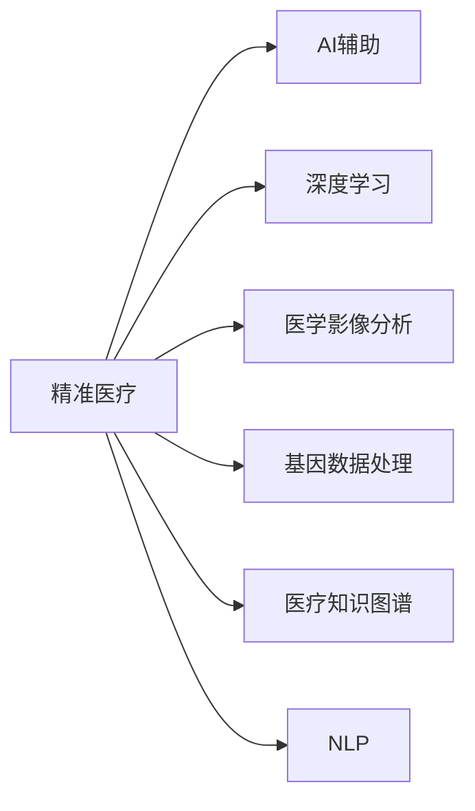

                 

# 智能医疗诊断创业：AI辅助的精准医疗

> 关键词：智能医疗,精准医疗,AI辅助,诊断,创业,模型构建,深度学习,应用场景,算法优化,数据处理

## 1. 背景介绍

### 1.1 问题由来

近年来，随着人工智能技术尤其是深度学习技术的飞速发展，医疗行业正逐渐从中受益。特别是在精准医疗方面，AI辅助的智能诊断系统已经开始展现出其独特的优势。精准医疗，旨在通过精确分析个体基因、环境和生活方式等因素，预测疾病风险，制定个性化治疗方案，从而提高诊疗效率和效果，降低医疗成本。AI技术在这一过程中起着关键作用，它不仅能快速处理海量医学数据，还能通过深度学习模型对复杂生物信息进行有效分析，辅助医生做出更加精准的诊断和治疗决策。

然而，虽然AI技术在医疗领域已经取得了一定的进展，但其在实际应用中仍面临诸多挑战。首先，医疗数据的采集和处理往往涉及严格的隐私保护和数据标准化，这为数据的获取和利用增加了难度。其次，医学领域的专业性和复杂性使得AI模型在构建和训练过程中需要大量的专业知识储备和实践经验。再者，AI模型的性能提升和鲁棒性增强也是一个长期且艰难的挑战。

## 2. 核心概念与联系

### 2.1 核心概念概述

为更好地理解AI辅助的精准医疗系统，本节将介绍几个关键概念及其相互联系：

- **精准医疗(Precision Medicine)**：以个体化医疗为基础，通过对基因、环境、生活方式等个性化因素的综合分析，制定个体化的疾病预防、诊断和治疗方案，从而提高诊疗效果。
- **AI辅助诊断**：利用人工智能技术，如深度学习、计算机视觉等，对医学影像、基因数据等进行分析，辅助医生进行诊断。
- **深度学习(Deep Learning)**：一种基于多层神经网络的学习方法，通过模拟人脑的神经元处理信息，能够学习复杂数据模式，应用于图像识别、自然语言处理、声音识别等任务。
- **医学影像分析**：通过对医学影像数据的自动化处理和分析，如CT、MRI、X光等，帮助医生发现病灶、评估病情等。
- **基因数据处理**：利用AI技术对基因序列、表达谱等数据进行分析，寻找与疾病相关的基因变异等，以支持个性化治疗方案的制定。
- **医疗知识图谱**：以知识图谱为代表的语义网络，用于存储和关联医学领域的各种知识，支持信息检索、推理等。
- **自然语言处理(Natural Language Processing, NLP)**：让计算机能够理解和生成人类语言的技术，包括文本分类、实体识别、问答系统等。

这些概念通过以下Mermaid流程图展示其相互联系：



### 2.2 核心概念原理和架构

**深度学习模型**：深度学习模型通常由多层神经网络构成，每一层负责提取不同的特征。以卷积神经网络(CNN)为例，它通过卷积层提取图像的局部特征，再通过池化层减小特征图尺寸，最后通过全连接层输出分类结果。其原理是通过大量标注数据进行反向传播，调整模型参数以最小化损失函数。

**医学影像分析**：医学影像分析主要利用CNN对医学影像数据进行处理和分析。具体来说，图像数据先经过预处理，包括尺寸归一化、去噪、增强等操作，然后通过卷积层、池化层等进行特征提取，最后输出诊断结果。如常用的U-Net模型，通过跳跃连接和反卷积操作，对医学影像进行精细化分割。

**基因数据处理**：基因数据处理通常包括基因序列比对、变异检测、表达谱分析等。利用深度学习模型，可以对基因数据进行特征提取和分类，如使用循环神经网络(RNN)对基因表达谱进行时间序列预测。

**自然语言处理**：NLP技术广泛应用于医学领域，如病历信息提取、医生笔记生成、智能问答系统等。通过预训练语言模型，如BERT、GPT等，可以对文本进行特征提取和分类，然后利用注意力机制和Transformer结构，进行文本推理和生成。

这些核心概念和技术构成了AI辅助精准医疗系统的基础架构，使得通过深度学习等技术，对海量医学数据进行处理和分析成为可能，从而为精准医疗提供了技术支持。

## 3. 核心算法原理 & 具体操作步骤

### 3.1 算法原理概述

AI辅助精准医疗系统的核心算法包括深度学习、医学影像分析、基因数据处理和自然语言处理等。这些算法通过对医学数据的处理和分析，辅助医生进行精准诊断和治疗。

- **深度学习**：通过大量标注数据训练深度学习模型，如卷积神经网络(CNN)、循环神经网络(RNN)、自编码器(AE)等，进行图像处理、序列分析和分类预测等。
- **医学影像分析**：利用深度学习模型对医学影像数据进行处理和分析，如通过U-Net模型进行医学影像分割，辅助医生发现和定位病灶。
- **基因数据处理**：利用深度学习模型对基因数据进行处理和分析，如通过RNN进行基因表达谱分析，发现与疾病相关的基因变异。
- **自然语言处理**：通过预训练语言模型对文本数据进行处理和分析，如通过BERT进行文本分类和实体识别，辅助医生提取关键信息。

### 3.2 算法步骤详解

AI辅助精准医疗系统的构建主要分为数据准备、模型训练、模型评估和模型应用四个步骤：

**Step 1: 数据准备**
- 收集医学影像、基因数据和文本数据等医疗数据。
- 对数据进行预处理，包括去噪、归一化、增强等操作。
- 将数据划分为训练集、验证集和测试集。

**Step 2: 模型训练**
- 选择合适的深度学习模型，如CNN、RNN等。
- 在训练集上训练模型，使用交叉熵等损失函数进行优化。
- 通过正则化技术如L2正则、Dropout等避免过拟合。
- 利用对抗训练等技术提高模型鲁棒性。

**Step 3: 模型评估**
- 在验证集上评估模型性能，使用准确率、召回率等指标进行评估。
- 根据评估结果调整模型参数，如学习率、批大小等。
- 利用模型融合技术提高性能，如集成多个模型进行输出预测。

**Step 4: 模型应用**
- 将训练好的模型应用于临床场景，辅助医生进行诊断和治疗。
- 在实际应用中，不断收集反馈数据，持续优化模型性能。
- 利用监控系统实时监测模型表现，确保系统稳定运行。

### 3.3 算法优缺点

**优点**：
- 通过深度学习等技术，能够快速处理海量医学数据，提高诊疗效率。
- 利用多模态数据融合，能够全面了解患者情况，制定个性化治疗方案。
- 辅助医生进行诊断和治疗，减轻医生工作负担，提升诊疗质量。

**缺点**：
- 数据采集和处理需要严格遵守隐私保护和数据标准化要求，增加了工作难度。
- 模型构建和训练需要大量专业知识储备和实践经验，需要高水平团队支持。
- 模型的性能和鲁棒性提升是一个长期且艰难的挑战，需要持续优化。

### 3.4 算法应用领域

AI辅助精准医疗系统在多个领域具有广泛的应用前景，例如：

- **医学影像分析**：利用深度学习模型对医学影像进行自动分析和诊断，如肺部CT影像分析、乳腺影像分析等。
- **基因数据处理**：利用深度学习模型对基因数据进行分析，发现与疾病相关的基因变异，如肿瘤基因检测、遗传病诊断等。
- **自然语言处理**：利用NLP技术对文本数据进行处理和分析，如病历信息提取、智能问答系统、医生笔记生成等。
- **个性化治疗**：根据患者基因数据和病历信息，制定个性化治疗方案，如精准化疗、靶向治疗等。
- **智能监测**：利用传感器和物联网技术，实时监测患者生理参数，辅助医生进行病情评估和远程诊断。

这些应用领域展示了AI辅助精准医疗系统的广泛潜力和应用价值，为医疗行业的智能化转型提供了新的方向和可能性。

## 4. 数学模型和公式 & 详细讲解 & 举例说明

### 4.1 数学模型构建

假设医学影像数据为$X \in \mathbb{R}^{n \times m}$，其中$n$为样本数，$m$为每个样本的特征数。定义深度学习模型为$f_{\theta}(X)$，其中$\theta$为模型参数。模型输出的诊断结果为$y \in \{0,1\}$，其中0表示正常，1表示异常。

定义交叉熵损失函数为$\ell(f_{\theta}(X),y)=-y\log(f_{\theta}(X))+ (1-y)\log(1-f_{\theta}(X))$。则经验风险为$\mathcal{L}(\theta)=\frac{1}{N}\sum_{i=1}^N \ell(f_{\theta}(x_i),y_i)$。

### 4.2 公式推导过程

以医学影像分析为例，假设采用U-Net模型，其架构包括编码器和解码器两个部分。假设编码器输出特征图为$F \in \mathbb{R}^{n \times m}$，解码器输出为$Y \in \mathbb{R}^{n \times m}$，定义交叉熵损失函数为$\ell(Y,Y^*)$。则模型损失函数为$\mathcal{L}(\theta)=\frac{1}{N}\sum_{i=1}^N \ell(Y_i,Y_i^*)$。

使用梯度下降等优化算法，更新模型参数$\theta$，使得$\mathcal{L}(\theta)$最小化。具体公式为：
$$
\theta \leftarrow \theta - \eta \nabla_{\theta}\mathcal{L}(\theta)
$$
其中$\eta$为学习率，$\nabla_{\theta}\mathcal{L}(\theta)$为损失函数对模型参数的梯度。

### 4.3 案例分析与讲解

以医学影像分割为例，假设采用U-Net模型对肺部CT影像进行分割，将正常组织和异常组织分割出来。定义损失函数为 Dice Loss，即：
$$
\ell(Y,Y^*) = 1 - \frac{2\sum_{i=1}^N \min(Y_i,Y_i^*)}{\sum_{i=1}^N (Y_i + Y_i^*)}
$$
其中$Y \in \{0,1\}$为模型输出，$Y^*$为标注结果。

在训练过程中，首先对影像进行预处理，包括尺寸归一化、去噪、增强等操作。然后将影像数据输入模型，通过编码器提取特征，在解码器中进行特征上采样和分类，最终输出分割结果。利用交叉熵损失函数对模型进行优化，使用Dice Loss进行性能评估。

## 5. 项目实践：代码实例和详细解释说明

### 5.1 开发环境搭建

在进行AI辅助精准医疗系统的开发时，需要准备以下开发环境：

1. 安装Python和相关包管理器，如pip、conda等。
2. 安装深度学习框架，如TensorFlow、PyTorch等。
3. 安装医学影像处理库，如OpenCV、SimpleITK等。
4. 安装基因数据处理库，如BioPython、Pandas等。
5. 安装自然语言处理库，如NLTK、spaCy等。
6. 安装数据可视化工具，如Matplotlib、Seaborn等。

### 5.2 源代码详细实现

以医学影像分割为例，下面给出使用PyTorch进行U-Net模型训练的代码实现：

```python
import torch
import torch.nn as nn
import torch.optim as optim
from torchvision.transforms import transforms
from torch.utils.data import DataLoader
from torchvision.datasets import DatasetFolder

class UNet(nn.Module):
    def __init__(self, in_channels=3, out_channels=1):
        super(UNet, self).__init__()
        self.encoder = nn.Sequential(
            nn.Conv2d(in_channels, 64, kernel_size=3, stride=1, padding=1),
            nn.ReLU(),
            nn.MaxPool2d(kernel_size=2, stride=2),
            nn.Conv2d(64, 128, kernel_size=3, stride=1, padding=1),
            nn.ReLU(),
            nn.MaxPool2d(kernel_size=2, stride=2),
            nn.Conv2d(128, 256, kernel_size=3, stride=1, padding=1),
            nn.ReLU(),
            nn.MaxPool2d(kernel_size=2, stride=2)
        )
        self.decoder = nn.Sequential(
            nn.ConvTranspose2d(256, 128, kernel_size=3, stride=2, padding=1),
            nn.ReLU(),
            nn.Conv2d(128, 64, kernel_size=3, stride=1, padding=1),
            nn.ReLU(),
            nn.Conv2d(64, out_channels, kernel_size=3, stride=1, padding=1),
            nn.Sigmoid()
        )

    def forward(self, x):
        x = self.encoder(x)
        x = self.decoder(x)
        return x

model = UNet()
criterion = nn.BCEWithLogitsLoss()
optimizer = optim.Adam(model.parameters(), lr=0.001)

# 加载医学影像数据集
train_data = DatasetFolder('train', transform=transforms.Compose([
    transforms.ToTensor(),
    transforms.Normalize(mean=[0.485, 0.456, 0.406],
                        std=[0.229, 0.224, 0.225])
]))

train_loader = DataLoader(train_data, batch_size=4, shuffle=True)

# 训练模型
for epoch in range(100):
    model.train()
    running_loss = 0.0
    for i, data in enumerate(train_loader, 0):
        inputs, labels = data
        inputs, labels = inputs.to(device), labels.to(device)
        optimizer.zero_grad()
        outputs = model(inputs)
        loss = criterion(outputs, labels)
        loss.backward()
        optimizer.step()

        running_loss += loss.item()
        if i % 100 == 99:
            print('[%d, %5d] loss: %.3f' %
                  (epoch + 1, i + 1, running_loss / 100))
            running_loss = 0.0
```

### 5.3 代码解读与分析

在上述代码中，首先定义了U-Net模型，包括编码器和解码器两个部分。然后定义了损失函数和优化器，使用Adam优化器进行模型训练。

接下来，加载医学影像数据集，进行预处理和归一化操作。在训练过程中，使用交叉熵损失函数对模型进行优化，并打印输出每轮的损失值。

## 6. 实际应用场景

### 6.1 智能诊断系统

智能诊断系统通过AI辅助精准医疗技术，可以快速、准确地对患者进行疾病诊断。例如，利用深度学习模型对医学影像进行自动分析和诊断，能够帮助医生快速定位病灶，提高诊断效率。智能诊断系统还可以根据患者基因数据和病历信息，制定个性化治疗方案，如精准化疗、靶向治疗等。

### 6.2 医疗影像分析

医疗影像分析是AI辅助精准医疗的重要应用之一。利用深度学习模型对医学影像进行自动分析和诊断，能够显著提高诊断效率和准确性。例如，肺部CT影像分析能够快速识别肺部结节、肺叶不张等异常情况，辅助医生进行诊断和治疗。乳腺影像分析能够帮助早期发现乳腺癌病变，提高乳腺癌的早期诊断率。

### 6.3 基因数据处理

基因数据处理是精准医疗的重要组成部分。利用深度学习模型对基因数据进行分析，能够发现与疾病相关的基因变异，支持个性化治疗方案的制定。例如，通过对肿瘤基因数据的分析，可以发现与肿瘤发生相关的基因突变，从而制定个性化的治疗方案，提高治疗效果。

### 6.4 自然语言处理

自然语言处理技术在AI辅助精准医疗中也有广泛应用。例如，病历信息提取技术能够从电子病历中提取关键信息，如病史、症状、体征等，辅助医生进行诊断和治疗。智能问答系统能够回答患者常见问题，提供医学知识普及，提高患者的健康意识。

## 7. 工具和资源推荐

### 7.1 学习资源推荐

为了帮助开发者掌握AI辅助精准医疗技术，推荐以下学习资源：

1. Coursera《深度学习在医疗中的应用》课程：由斯坦福大学教授讲授，涵盖深度学习在医疗领域的应用，包括医学影像分析、基因数据处理等。
2. ArXiv论文库：搜索相关领域的最新研究论文，了解前沿技术进展。
3. GitHub代码库：查找开源项目和代码示例，快速上手实践。
4. Kaggle竞赛平台：参加相关领域的竞赛，提升实战能力。

### 7.2 开发工具推荐

为了加速AI辅助精准医疗系统的开发，推荐以下工具：

1. PyTorch：深度学习框架，提供灵活的计算图，适合研究和开发。
2. TensorFlow：深度学习框架，提供分布式训练和部署功能，适合生产部署。
3. Weights & Biases：实验跟踪工具，记录和可视化模型训练过程中的各项指标。
4. TensorBoard：可视化工具，实时监测模型训练状态，提供丰富的图表呈现方式。
5. OpenCV：医学影像处理库，支持图像增强、分割等操作。
6. BioPython：基因数据处理库，支持序列比对、变异检测等操作。
7. spaCy：自然语言处理库，支持文本分类、实体识别等操作。

### 7.3 相关论文推荐

为深入了解AI辅助精准医疗技术的最新进展，推荐以下相关论文：

1. "U-Net: Convolutional Networks for Biomedical Image Segmentation"（U-Net论文）：提出U-Net模型，用于医学影像分割。
2. "Towards a Knowledge-Based Medicine: Representation Learning of Clinical Concepts"（知识图谱论文）：提出医疗知识图谱，用于存储和关联医学领域的各种知识。
3. "Deep Learning for Predicting Diagnosis and Treatment"（深度学习在医疗中的应用）：提出深度学习在医疗领域的多种应用，包括医学影像分析、基因数据处理等。
4. "Natural Language Processing for Clinical Decision Support: A Survey"（NLP在医疗中的应用）：综述了NLP技术在医疗领域的应用，包括病历信息提取、智能问答系统等。

## 8. 总结：未来发展趋势与挑战

### 8.1 研究成果总结

AI辅助精准医疗技术在医疗领域展现了巨大的潜力，通过深度学习等技术，能够快速处理海量医学数据，提高诊疗效率和效果。然而，在实际应用中，仍面临诸多挑战，如数据标准化、模型鲁棒性、隐私保护等。

### 8.2 未来发展趋势

未来，AI辅助精准医疗技术将呈现以下几个发展趋势：

1. 数据标准化和隐私保护：随着医疗数据的获取和使用规范化，数据标准化和隐私保护将得到进一步加强，确保数据的安全和高质量。
2. 模型鲁棒性和泛化能力：通过改进模型架构和优化算法，提高模型的鲁棒性和泛化能力，使其能够更好地适应不同的临床场景。
3. 多模态融合与协同建模：将医学影像、基因数据和自然语言处理等多模态数据融合，进行协同建模，提升诊断和治疗效果。
4. 持续学习和自适应：通过持续学习技术，使模型能够适应数据分布的变化，提高系统的稳定性和可靠性。
5. 伦理和法规遵守：加强伦理和法规的遵守，确保AI辅助精准医疗技术的合理应用，避免对患者的伤害和歧视。

### 8.3 面临的挑战

虽然AI辅助精准医疗技术在医疗领域展现了巨大的潜力，但仍然面临诸多挑战：

1. 数据标准化和隐私保护：数据标准化和隐私保护是医疗数据处理的关键问题，需要严格遵守相关法规和标准，确保数据的安全和高质量。
2. 模型鲁棒性和泛化能力：模型的鲁棒性和泛化能力是影响AI辅助精准医疗效果的重要因素，需要通过改进模型架构和优化算法来解决。
3. 隐私保护和伦理问题：医疗数据涉及患者的隐私信息，隐私保护和伦理问题需要得到重视，确保数据的安全和合理使用。
4. 技术成熟度和可靠性：AI辅助精准医疗技术在实际应用中仍存在一些技术成熟度和可靠性问题，需要通过不断的优化和改进来解决。
5. 算法透明性和可解释性：AI算法的透明性和可解释性是医疗领域的重要问题，需要通过改进算法设计来提高模型的透明性和可解释性。

### 8.4 研究展望

未来，AI辅助精准医疗技术需要在数据标准化、模型鲁棒性、隐私保护、伦理问题、技术成熟度等多个方面进行深入研究。只有从多个维度协同发力，才能使AI辅助精准医疗技术在医疗领域得到广泛应用，为人类健康带来更多福祉。

## 9. 附录：常见问题与解答

**Q1：AI辅助精准医疗技术的优势有哪些？**

A: AI辅助精准医疗技术具有以下优势：
1. 快速处理海量医学数据，提高诊疗效率。
2. 利用多模态数据融合，全面了解患者情况，制定个性化治疗方案。
3. 辅助医生进行诊断和治疗，减轻医生工作负担，提升诊疗质量。

**Q2：如何提高AI辅助精准医疗技术的鲁棒性和泛化能力？**

A: 提高AI辅助精准医疗技术的鲁棒性和泛化能力，可以从以下几个方面入手：
1. 改进模型架构，如使用更深的神经网络、加入残差连接等。
2. 优化算法，如使用更有效的优化器、引入正则化技术等。
3. 数据增强，如回译、旋转、缩放等，增加训练集的多样性。
4. 对抗训练，通过引入对抗样本，提高模型的鲁棒性。
5. 多模型集成，通过集成多个模型的输出，提高模型的泛化能力。

**Q3：AI辅助精准医疗技术在实际应用中面临哪些挑战？**

A: AI辅助精准医疗技术在实际应用中面临以下挑战：
1. 数据标准化和隐私保护：数据标准化和隐私保护是医疗数据处理的关键问题，需要严格遵守相关法规和标准，确保数据的安全和高质量。
2. 模型鲁棒性和泛化能力：模型的鲁棒性和泛化能力是影响AI辅助精准医疗效果的重要因素，需要通过改进模型架构和优化算法来解决。
3. 隐私保护和伦理问题：医疗数据涉及患者的隐私信息，隐私保护和伦理问题需要得到重视，确保数据的安全和合理使用。
4. 技术成熟度和可靠性：AI辅助精准医疗技术在实际应用中仍存在一些技术成熟度和可靠性问题，需要通过不断的优化和改进来解决。
5. 算法透明性和可解释性：AI算法的透明性和可解释性是医疗领域的重要问题，需要通过改进算法设计来提高模型的透明性和可解释性。

---

作者：禅与计算机程序设计艺术 / Zen and the Art of Computer Programming

