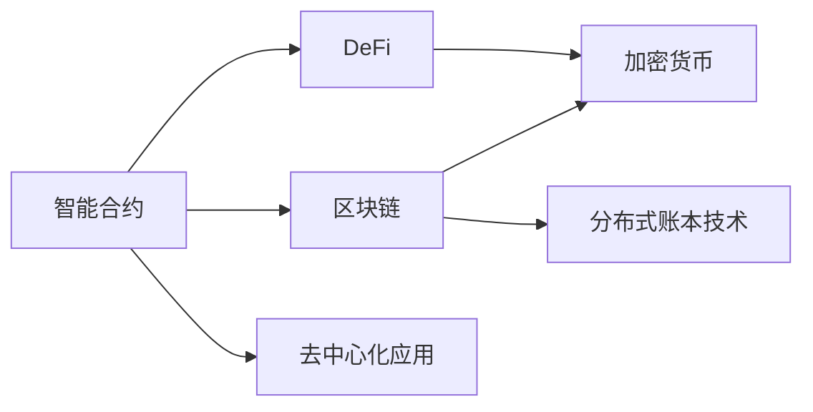

                 

# 智能合约创业：自动化交易的未来

> 关键词：智能合约,自动化交易,区块链,DeFi,创业,应用场景,技术挑战,发展前景

## 1. 背景介绍

### 1.1 问题由来

随着区块链技术的快速发展，智能合约作为其核心应用之一，正在逐步改变金融行业的运作方式。智能合约是一种无需第三方干预、自动执行的合约形式，基于区块链的不可篡改性和去中心化特性，能够实现自动化、透明的交易处理。

### 1.2 问题核心关键点

智能合约通过代码形式定义了交易条件和执行规则，当满足特定条件时，合约自动执行。这种自动化处理方式，极大降低了交易成本和结算时间，提高了系统的透明度和安全性。然而，智能合约创业领域也面临着诸多挑战，如技术复杂性高、安全漏洞频发、法律法规不健全等问题。

### 1.3 问题研究意义

智能合约创业领域，正处于技术创新和商业模式探索的关键时期。通过对智能合约原理、设计、实现、安全性等方面进行深入研究，可以为未来的创业者和开发者提供全面的技术指引，加速区块链技术在金融、供应链、保险等行业的应用，驱动全球经济的数字化转型。

## 2. 核心概念与联系

### 2.1 核心概念概述

为更好地理解智能合约创业的原理与实践，本节将介绍几个关键概念及其间的联系：

- 智能合约（Smart Contract）：一种基于区块链的去中心化自动化合约，通过代码形式定义交易规则和执行流程。

- 区块链（Blockchain）：一种去中心化的分布式账本技术，通过共识算法实现数据的透明、不可篡改和去信任。

- DeFi（Decentralized Finance）：基于区块链的金融系统，利用智能合约实现去中心化的资产交易、借贷、保险等金融服务。

- 加密货币（Cryptocurrency）：利用区块链技术实现的去中心化数字货币，包括比特币、以太坊等。

- 分布式账本技术（Distributed Ledger Technology, DLT）：一种分布式、去中心化的数据库技术，支持智能合约的存储和执行。

- 去中心化应用（Decentralized Application, DApp）：基于区块链的应用程序，通过智能合约实现自动化、透明的用户交互。

这些概念之间的逻辑关系可以通过以下Mermaid流程图来展示：



这个流程图展示了一个简单的概念关联网络，其中智能合约是核心，通过区块链、DeFi、加密货币、分布式账本技术和去中心化应用等概念，构建了智能合约在金融等领域的广泛应用场景。

## 3. 核心算法原理 & 具体操作步骤
### 3.1 算法原理概述

智能合约的核心思想是通过代码形式定义交易条件和执行规则，当满足特定条件时，合约自动执行。这种自动化处理方式，极大降低了交易成本和结算时间，提高了系统的透明度和安全性。

智能合约的基本原理可以概述为以下几个步骤：

1. **合约部署**：将智能合约代码部署到区块链网络。
2. **合约交互**：用户通过API调用智能合约函数，触发合同执行。
3. **合约执行**：智能合约自动验证交易条件，执行相应操作。
4. **合约状态更新**：交易完成后，更新区块链状态，实现资产转移或记录。

### 3.2 算法步骤详解

以下以一个简单的智能合约为例，详细讲解其部署和执行过程。

**步骤1：合约部署**
```solidity
// SPDX-License-Identifier: MIT
pragma solidity ^0.8.0;

contract SimpleContract {
    address public owner;
    uint256 public balance;

    constructor() {
        owner = msg.sender;
        balance = 100;
    }

    function withdraw(uint256 amount) public {
        require(msg.sender == owner);
        require(balance >= amount);
        balance -= amount;
        emit Withdraw(amount);
    }
}
```
在上述合约中，定义了一个名为`SimpleContract`的智能合约，包含一个所有者变量`owner`，一个余额变量`balance`，以及一个提款函数`withdraw`。合约部署到以太坊网络后，所有者可调用`withdraw`函数提款。

**步骤2：合约交互**
用户通过智能合约的API调用`withdraw`函数，触发提款操作：
```javascript
const contract = await ethers.getContractAt("SimpleContract", "0x1234567890abcdef");
await contract.withdraw(50);
```
在上述JavaScript代码中，通过`ethers`库获取智能合约实例，并调用`withdraw`函数，提款50个以太坊。

**步骤3：合约执行**
当`withdraw`函数被调用时，智能合约自动执行以下步骤：
1. 验证调用者是否是合约所有者，并检查余额是否足够。
2. 执行提款操作，减少余额，并记录提款记录。
3. 触发`Withdraw`事件，发布提款信息到区块链网络。

**步骤4：合约状态更新**
提款操作完成后，智能合约更新区块链状态，完成资产转移。

### 3.3 算法优缺点

智能合约具有以下优点：
1. 自动化处理：减少了人工操作，提高了交易效率。
2. 透明度高：所有交易记录公开透明，可追溯。
3. 安全性好：去中心化存储，防止单点故障和欺诈。

同时，智能合约也存在一些缺点：
1. 代码复杂：智能合约需要复杂的代码实现，难以调试和维护。
2. 安全风险：智能合约容易受到攻击，如重入攻击、溢出攻击等。
3. 执行成本高：高频交易可能带来高昂的 gas 费。
4. 法律问题：智能合约的法律地位尚未明确，可能导致争议。

### 3.4 算法应用领域

智能合约已在多个领域得到应用，主要包括：

- **金融行业**：利用智能合约进行去中心化交易、借贷、保险、清算等金融服务。
- **供应链管理**：通过智能合约实现货物追踪、结算、监管等供应链管理功能。
- **版权保护**：利用智能合约保护知识产权，实现版权交易和授权管理。
- **医疗健康**：利用智能合约进行医疗记录存储、隐私保护和医疗资源共享。
- **数字身份**：利用智能合约管理数字身份，实现身份认证和授权。

## 4. 数学模型和公式 & 详细讲解 & 举例说明
### 4.1 数学模型构建

智能合约的执行过程可以通过数学模型来建模，以更好理解和优化合约的执行效果。

假设一个智能合约的余额为 $B$，提款金额为 $A$，手续费率为 $r$，提款函数调用频率为 $F$，则每次提款的总手续费为 $H = F \times r \times B$。

定义合约的总手续费 $H_{total}$ 为所有提款手续费之和，合约的总余额 $B_{total}$ 为所有提款后的余额之和。则有：

$$ H_{total} = \sum_{i=1}^{n} F_i \times r_i \times B_i $$

$$ B_{total} = \sum_{i=1}^{n} (B_i - A_i) $$

其中 $F_i, r_i, B_i, A_i$ 分别表示第 $i$ 次提款的频率、手续费率、余额和提款金额。

### 4.2 公式推导过程

根据上述模型，可以推导出合约的平均提款费用 $H_{avg}$ 和平均余额 $B_{avg}$：

$$ H_{avg} = \frac{H_{total}}{n} $$

$$ B_{avg} = \frac{B_{total}}{n} $$

由于 $H_{avg} = F \times r \times B_{avg}$，可以得到：

$$ F = \frac{H_{avg}}{r \times B_{avg}} $$

这表明，每次提款的手续费率 $r$ 和平均余额 $B_{avg}$ 决定了合约的提款频率 $F$。

### 4.3 案例分析与讲解

假设一个智能合约的余额为1000个以太坊，手续费率为0.5%，提款频率为每天5次。则每次提款的手续费为：

$$ H = 5 \times 0.5\% \times 1000 = 25 $$

总提款次数 $n = 5 \times 365 = 1825$，总手续费 $H_{total} = 1825 \times 25 = 45625$。

平均提款手续费 $H_{avg} = \frac{45625}{1825} = 24.94$。

平均余额 $B_{avg} = \frac{1000 - \sum_{i=1}^{n} A_i}{1825}$，其中 $A_i$ 表示每次提款金额。

通过上述计算，可以评估智能合约的成本和效益，为合约设计提供参考。

## 5. 项目实践：代码实例和详细解释说明
### 5.1 开发环境搭建

在进行智能合约创业项目开发前，需要准备相应的开发环境。以下是使用Solidity进行智能合约开发的安装与配置流程：

1. 安装Node.js：从官网下载并安装Node.js，以便运行Solidity编译器和虚拟机。
2. 安装Truffle框架：使用npm安装Truffle，命令为：`npm install -g truffle`。
3. 安装以太坊钱包：使用MetaMask或MyEtherWallet等钱包，用于测试和部署智能合约。
4. 安装Ganache：使用Ganache本地测试网络，用于开发和测试智能合约。

完成上述步骤后，即可在Truffle环境下进行智能合约开发。

### 5.2 源代码详细实现

以下是一个简单的智能合约代码实现，用于管理数字资产：

```solidity
// SPDX-License-Identifier: MIT
pragma solidity ^0.8.0;

contract AssetManager {
    address public owner;
    uint256 public balance;
    mapping(address => uint256) balances;

    constructor() {
        owner = msg.sender;
        balance = 100;
    }

    function transfer(address _to, uint256 _amount) public {
        require(msg.sender == owner);
        require(balances[msg.sender] >= _amount);
        balances[msg.sender] -= _amount;
        balances[_to] += _amount;
        emit Transfer(_to, _amount);
    }

    function getBalance(address _address) public view returns (uint256) {
        return balances[_address];
    }
}
```

**步骤1：合约部署**
在Ganache中，部署智能合约：
```bash
truffle develop
```
进入`truffle develop`环境后，执行以下命令：
```bash
truffle migrate
```
即可在Ganache测试网络上部署智能合约。

**步骤2：合约交互**
在Truffle环境中，使用`truffle console`与智能合约交互：
```bash
truffle console
```
执行以下命令，调用`transfer`函数进行资产转移：
```javascript
const contract = await artifacts.require("AssetManager");
await contract.transfer("0xabcdef", 50);
```

**步骤3：合约执行**
当`transfer`函数被调用时，智能合约自动执行以下步骤：
1. 验证调用者是否是合约所有者，并检查余额是否足够。
2. 执行资产转移操作，更新余额和余额映射。
3. 触发`Transfer`事件，发布资产转移信息到区块链网络。

**步骤4：合约状态更新**
资产转移完成后，智能合约更新区块链状态，完成资产转移。

### 5.3 代码解读与分析

让我们再详细解读一下关键代码的实现细节：

**AssetManager合约**：
- `constructor`方法：初始化合约所有者和初始余额。
- `transfer`方法：用于资产转移，需要验证调用者身份和余额，并更新余额映射。
- `getBalance`方法：查询指定地址的余额，为公开函数，不消耗gas。

**truffle migrate命令**：
- 用于将合同部署到区块链测试网络，将合约字节码部署到链上，并记录地址。

**truffle console命令**：
- 用于与合约交互，调用合约中的函数，获取函数返回值。

通过上述代码实例，可以看出智能合约的实现过程大致分为合约部署、合约交互、合约执行和合约状态更新四个步骤，每一步都需要精确设计合约逻辑和事件触发。

## 6. 实际应用场景
### 6.1 智能合约创业项目

智能合约创业项目包括但不限于以下几种：

- **DeFi平台**：构建去中心化的借贷、交易、稳定币等金融服务平台，利用智能合约实现自动化的金融服务。
- **供应链金融**：通过智能合约实现供应链中货物流转、账款结算等自动化处理，提升供应链效率和信任度。
- **版权保护**：利用智能合约管理版权交易和授权，实现自动化的版权保护和收益分配。
- **身份认证**：通过智能合约实现数字身份管理，保护个人隐私和授权访问。

### 6.2 智能合约创业的前景

随着DeFi、Web3等概念的兴起，智能合约创业领域迎来了新的发展机遇。未来，智能合约将在以下方面取得更大突破：

- **跨链互操作**：实现不同区块链之间的智能合约互操作，促进区块链网络的协同发展。
- **隐私保护**：利用零知识证明、隐私计算等技术，实现智能合约的隐私保护。
- **自动化治理**：通过智能合约实现社区自治、治理和决策，提升系统的透明性和公正性。
- **去中心化存储**：利用智能合约管理去中心化存储系统，实现数据的高效和安全存储。

## 7. 工具和资源推荐
### 7.1 学习资源推荐

为了帮助开发者系统掌握智能合约创业的理论基础和实践技巧，这里推荐一些优质的学习资源：

1. **Solidity官方文档**：Solidity语言官方文档，全面介绍了Solidity语言基础、语法、库和标准。
2. **Truffle文档**：Truffle框架官方文档，提供了Truffle环境的搭建和智能合约的开发教程。
3. **Solidity by Example**： soliditybyexample.com 提供的Solidity学习资源，包括示例代码和解释。
4. **Mastering Ethereum**：以太坊编程指南，涵盖以太坊、Solidity、Truffle等技术栈。
5. **Blockchain Basics with Solidity**：Solidity基础教程，由Solidity官方社区提供。

通过对这些资源的学习实践，相信你一定能够快速掌握智能合约创业的技术要点，并用于解决实际的智能合约问题。

### 7.2 开发工具推荐

高效的开发离不开优秀的工具支持。以下是几款用于智能合约创业开发的常用工具：

1. **Solidity编译器**：Solidity语言编译器，用于将Solidity代码编译成以太坊虚拟机字节码。
2. **Ganache**：以太坊本地测试网络，用于测试和调试智能合约。
3. **MetaMask**：以太坊钱包，支持智能合约的调用和交易。
4. **Truffle**：智能合约开发框架，提供Truffle合约和编译器。
5. **MyEtherWallet**：以太坊钱包，支持智能合约的调用和交易。
6. **Remix IDE**：以太坊智能合约开发环境，支持在线编辑和调试智能合约。

合理利用这些工具，可以显著提升智能合约创业项目的开发效率，加快创新迭代的步伐。

### 7.3 相关论文推荐

智能合约创业领域的发展离不开学界的持续研究。以下是几篇奠基性的相关论文，推荐阅读：

1. **The Ethereum Virtual Machine: A Secure Model of Computation for Smart Contracts**：以太坊虚拟机技术介绍，介绍了智能合约的执行环境和安全性。
2. **Formal Verification of Solidity Smart Contracts**：智能合约的形式化验证，探讨了智能合约的安全性验证方法。
3. **Smart Contract Security: Analysis and Testing**：智能合约的安全性分析和测试技术，提供了智能合约的安全性和性能保障方案。
4. **Blockchain Security: Assessing Ethereum Smart Contracts**：以太坊智能合约的安全性评估方法，提供了智能合约的安全性保障方案。
5. **Decentralized Finance: Myths, Realities, and Promise**：DeFi技术综述，介绍了DeFi技术的基本原理和应用场景。

这些论文代表了大规模语言模型微调技术的发展脉络。通过学习这些前沿成果，可以帮助研究者把握学科前进方向，激发更多的创新灵感。

## 8. 总结：未来发展趋势与挑战
### 8.1 总结

本文对智能合约创业领域进行了全面系统的介绍。首先阐述了智能合约的基本原理、核心概念和实际应用，明确了智能合约在自动化交易、DeFi、供应链等领域的重要价值。其次，从原理到实践，详细讲解了智能合约的部署和执行过程，给出了智能合约开发的全套代码实例。同时，本文还广泛探讨了智能合约创业的前景和挑战，展示了智能合约在金融、供应链、版权保护等领域的广阔应用前景。

通过本文的系统梳理，可以看到，智能合约创业领域正处于快速发展阶段，智能合约技术有望在金融、供应链、版权保护等领域带来变革性影响。随着智能合约技术的不断成熟和普及，未来必将有更多的创业者和开发者涌入这一领域，推动区块链技术在全球经济中的深度应用。

### 8.2 未来发展趋势

展望未来，智能合约创业领域将呈现以下几个发展趋势：

1. **技术创新**：智能合约技术将不断创新，提升其性能、安全性和易用性，为更多应用场景提供支持。
2. **应用扩展**：智能合约将在更多行业领域得到应用，如医疗健康、数字身份、隐私保护等，推动全球经济的数字化转型。
3. **跨链互操作**：智能合约跨链技术将得到发展，实现不同区块链之间的互操作，提升区块链网络的协同性和可扩展性。
4. **隐私保护**：智能合约隐私保护技术将不断创新，实现隐私计算、零知识证明等技术应用，提升系统的隐私性和安全性。
5. **自动化治理**：智能合约将进一步应用于社区自治和治理，提升系统的透明性和公正性。
6. **去中心化存储**：智能合约去中心化存储技术将得到发展，实现数据的高效和安全存储。

这些趋势凸显了智能合约创业领域的发展潜力，为未来的创业者和开发者提供了广阔的空间和机遇。智能合约技术的发展，必将带来新的经济模式和商业机会，推动全球经济的数字化转型。

### 8.3 面临的挑战

尽管智能合约创业领域取得了一定的进展，但在迈向更加智能化、普适化应用的过程中，它仍面临着诸多挑战：

1. **技术复杂性高**：智能合约开发需要较高的技术门槛，开发者需要具备扎实的区块链、密码学和编程能力。
2. **安全风险**：智能合约容易受到攻击，如重入攻击、溢出攻击等，安全风险较高。
3. **法律问题**：智能合约的法律地位尚未明确，可能导致争议。
4. **用户接受度低**：智能合约的复杂性和安全性问题，导致部分用户对其接受度较低，应用推广难度较大。
5. **技术生态不完善**：智能合约创业领域的技术生态尚未成熟，缺乏完善的标准和规范。
6. **高性能问题**：智能合约的高频交易可能带来高昂的 gas 费，影响系统的性能和可用性。

正视智能合约创业领域所面临的挑战，积极应对并寻求突破，将是大规模语言模型微调技术走向成熟的必由之路。相信随着学界和产业界的共同努力，这些挑战终将一一被克服，智能合约技术必将在构建人机协同的智能时代中扮演越来越重要的角色。

### 8.4 研究展望

面对智能合约创业领域所面临的诸多挑战，未来的研究需要在以下几个方面寻求新的突破：

1. **技术创新**：开发更加易用、安全、高效的智能合约框架和工具，降低开发门槛，提升系统的性能和安全性。
2. **法律合规**：加强智能合约法律合规研究，明确智能合约的法律地位和权利义务，保障用户权益。
3. **用户教育**：开展智能合约教育，提升用户对智能合约的理解和接受度，推广智能合约应用。
4. **技术生态**：建立智能合约技术标准和规范，推动智能合约技术的广泛应用。
5. **性能优化**：优化智能合约的性能和计算效率，降低 gas 费和资源消耗，提升系统的可扩展性。

这些研究方向，将推动智能合约技术走向更加成熟和广泛应用，为未来的智能合约创业者和开发者提供更坚实的基础和方向。总之，智能合约创业领域需要多方面协同发力，才能实现技术的突破和应用落地，真正改变未来经济的发展轨迹。

## 9. 附录：常见问题与解答

**Q1：智能合约如何保证安全性？**

A: 智能合约的安全性依赖于以下几个方面：
1. 代码审查：通过代码审查和测试，确保智能合约的逻辑正确性和安全性。
2. 审计验证：通过第三方审计机构进行智能合约的安全性验证，发现潜在漏洞。
3. 安全协议：使用安全协议，如锁仓机制、延迟合约等，增强智能合约的安全性。
4. 多重签名：使用多重签名机制，确保智能合约的执行需要多个地址的共同签名。

**Q2：智能合约的部署流程是什么？**

A: 智能合约的部署流程大致分为以下步骤：
1. 编写智能合约代码。
2. 编译智能合约代码，生成以太坊虚拟机字节码。
3. 在区块链上创建账号。
4. 将合约字节码部署到区块链上。
5. 验证合约部署成功。

**Q3：智能合约如何实现去中心化？**

A: 智能合约通过区块链技术实现去中心化，具有以下几个特点：
1. 去信任：智能合约在区块链上运行，无需信任任何第三方，实现去信任机制。
2. 不可篡改：智能合约一旦部署，其代码和执行过程不可篡改，实现透明性。
3. 去中心化存储：智能合约将数据存储在区块链上，实现去中心化存储。

**Q4：智能合约在DeFi领域的应用场景有哪些？**

A: DeFi领域是智能合约的重要应用场景，包括但不限于以下几个方面：
1. 去中心化借贷：通过智能合约实现去中心化的借贷服务，无需中介机构参与。
2. 去中心化交易所：通过智能合约实现去中心化的交易平台，提高交易的透明性和安全性。
3. 去中心化稳定币：通过智能合约实现去中心化的稳定币，提供稳定的价值存储。
4. 去中心化保险：通过智能合约实现去中心化的保险服务，提供自动化的理赔和赔付。

**Q5：智能合约创业项目有哪些成功的案例？**

A: 智能合约创业项目中，已经有一些成功的案例，如：
1. MakerDAO：基于以太坊的稳定币发行平台，利用智能合约实现去中心化的稳定币发行和回购。
2. Compound Finance：基于以太坊的去中心化借贷平台，利用智能合约实现去中心化的借贷服务。
3. Curve DAO：基于以太坊的去中心化自动做市商，利用智能合约实现自动化的做市和交易。
4. Uniswap：基于以太坊的去中心化交易所，利用智能合约实现去中心化的交易和清算。

通过对这些成功案例的研究，可以更好地理解智能合约创业领域的实际应用和创新方向。

---

作者：禅与计算机程序设计艺术 / Zen and the Art of Computer Programming

