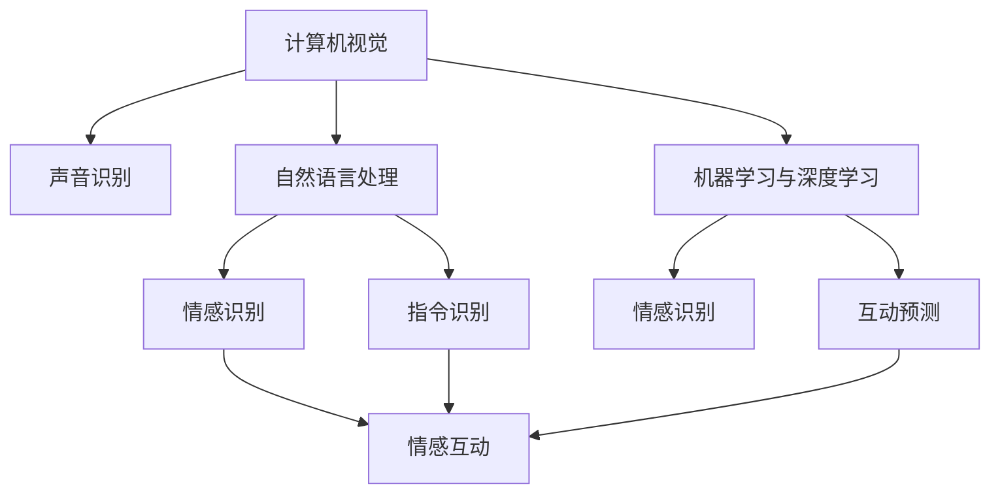

                 

# 智能宠物情绪交流创业：跨越物种的情感互动界面

## 1. 背景介绍

### 1.1 问题由来

随着人工智能技术的发展，人们对于与宠物的情感互动需求日益增长。宠物不仅是家庭的重要成员，更是人类情感的支持者。然而，传统的情感交流方式存在诸多局限性，如语言障碍、行为差异等。为了实现人与宠物之间更自然的情感交流，智能宠物情绪交流系统应运而生。通过将人工智能技术与宠物行为学研究相结合，开发出能够识别宠物情绪、与宠物进行情感互动的系统，不仅能够提升人类与宠物之间的亲密感，还能帮助宠物主人更好地理解和照顾宠物。

### 1.2 问题核心关键点

智能宠物情绪交流系统的核心目标是通过人工智能技术实现人类与宠物之间跨越物种的情感互动。这主要包括两个方面：

1. **宠物情绪识别**：系统能够识别宠物的情绪状态，如高兴、悲伤、紧张等，以理解宠物的情感需求。
2. **情感反馈与互动**：系统能够根据宠物的情绪状态，提供相应的情感反馈和互动措施，如播放音乐、给予抚摸等，以增强宠物的幸福感。

实现这些功能需要以下关键技术支持：

- **计算机视觉**：用于识别人类和宠物的面部表情、肢体动作等。
- **声音识别**：用于识别宠物的叫声、呼吸声等。
- **自然语言处理**：用于处理人类与宠物之间的语言交流。
- **机器学习与深度学习**：用于训练模型，以实现情感识别与互动。
- **多模态数据融合**：结合视觉、声音、语言等多模态数据，提升识别准确率。

这些技术共同构成了智能宠物情绪交流系统的技术基础，为实现人与宠物之间的情感互动提供了可能。

## 2. 核心概念与联系

### 2.1 核心概念概述

为更好地理解智能宠物情绪交流系统的技术框架，本节将介绍几个关键概念：

- **计算机视觉**：通过摄像头捕捉和分析图像或视频，实现面部表情、肢体动作等的识别。
- **声音识别**：通过麦克风捕捉和分析音频信号，实现宠物叫声、呼吸声等的识别。
- **自然语言处理**：处理和理解人类与宠物之间的语言交流，如指令识别、情感分析等。
- **机器学习与深度学习**：通过训练模型，实现情感识别和互动预测。
- **多模态数据融合**：结合视觉、声音、语言等多模态数据，提升识别准确率和鲁棒性。

这些核心概念之间的逻辑关系可以通过以下Mermaid流程图来展示：



这个流程图展示了一系列关键技术之间的关系：

1. 计算机视觉和声音识别获取宠物的多模态数据。
2. 自然语言处理处理人类与宠物之间的语言交流。
3. 机器学习与深度学习训练模型，实现情感识别和互动预测。
4. 多模态数据融合提升情感识别的准确率和鲁棒性。
5. 情感识别和互动预测与情感互动实现紧密结合。

这些概念共同构成了智能宠物情绪交流系统的技术架构，为其功能的实现提供了坚实的基础。

## 3. 核心算法原理 & 具体操作步骤

### 3.1 算法原理概述

智能宠物情绪交流系统的核心算法原理基于机器学习与深度学习技术，通过多模态数据融合实现情感识别与互动预测。其核心算法流程如下：

1. **数据预处理**：收集人类和宠物的多模态数据，并进行标准化处理，如面部表情的坐标提取、声音信号的特征提取等。
2. **特征提取**：使用卷积神经网络(CNN)、循环神经网络(RNN)等模型对多模态数据进行特征提取。
3. **模型训练**：使用训练集对模型进行训练，优化参数，提升识别准确率。
4. **情感识别**：将实时采集的多模态数据输入训练好的模型，实现情感识别。
5. **情感互动**：根据情感识别结果，执行相应的情感反馈措施，如播放音乐、给予抚摸等。

### 3.2 算法步骤详解

以下详细介绍智能宠物情绪交流系统的算法步骤：

**Step 1: 数据收集与预处理**

1. **数据来源**：收集人类和宠物的多模态数据，如摄像头录制的图像、麦克风录制的音频、人类与宠物之间的语音交流等。
2. **数据标注**：对数据进行标注，如标注人类和宠物的面部表情、肢体动作、叫声等。
3. **数据预处理**：对数据进行标准化处理，如面部表情的坐标提取、声音信号的特征提取等。

**Step 2: 特征提取**

1. **图像特征提取**：使用卷积神经网络(CNN)对图像数据进行特征提取，如ResNet、Inception等模型。
2. **声音特征提取**：使用卷积神经网络(CNN)或循环神经网络(RNN)对声音数据进行特征提取，如Mel谱图、MFCC等特征。
3. **文本特征提取**：使用循环神经网络(RNN)或Transformer模型对文本数据进行特征提取。

**Step 3: 模型训练**

1. **选择模型**：根据任务特点选择适合的模型，如卷积神经网络(CNN)、循环神经网络(RNN)、Transformer等。
2. **划分数据集**：将数据集划分为训练集、验证集和测试集，以评估模型性能。
3. **模型训练**：使用训练集对模型进行训练，优化参数，提升识别准确率。
4. **模型评估**：在验证集上评估模型性能，调整超参数。
5. **模型测试**：在测试集上测试模型性能，确定模型最终参数。

**Step 4: 情感识别**

1. **实时数据采集**：使用摄像头、麦克风等设备实时采集多模态数据。
2. **数据输入模型**：将实时采集的多模态数据输入训练好的模型。
3. **情感识别**：模型输出情感识别结果，如高兴、悲伤、紧张等。

**Step 5: 情感互动**

1. **根据情感结果**：根据情感识别结果，选择相应的情感反馈措施，如播放音乐、给予抚摸等。
2. **执行情感互动**：执行选定的情感反馈措施，增强宠物的幸福感。

### 3.3 算法优缺点

智能宠物情绪交流系统具有以下优点：

1. **实时性高**：通过实时采集和处理多模态数据，能够快速响应宠物的情绪变化。
2. **跨物种互动**：结合计算机视觉、声音识别、自然语言处理等多模态数据，实现人与宠物之间的情感互动。
3. **可扩展性强**：系统架构灵活，可以针对不同宠物进行定制化设计。
4. **用户友好**：系统操作简便，易于用户上手。

同时，该系统也存在以下局限性：

1. **数据依赖**：系统的性能很大程度上取决于训练数据的质量和数量，需要大量高质量数据进行训练。
2. **模型复杂度**：多模态数据融合和高维特征提取增加了模型的复杂度，对计算资源要求较高。
3. **环境干扰**：环境噪声、光线变化等因素可能影响数据采集和处理。
4. **情感多样性**：不同宠物的情感表达方式差异较大，情感识别的准确率受限。
5. **用户隐私**：系统需要采集人类和宠物的隐私数据，可能引发隐私保护问题。

### 3.4 算法应用领域

智能宠物情绪交流系统在以下领域具有广泛应用前景：

1. **家庭宠物护理**：通过情感识别和互动，帮助宠物主人更好地理解宠物的情感需求，提升宠物的幸福感。
2. **宠物行为分析**：结合情感识别和互动，分析宠物的行为模式，提供个性化的护理建议。
3. **宠物行为训练**：通过情感反馈，引导宠物进行行为训练，提升宠物的训练效果。
4. **宠物医疗**：通过情感识别和互动，监测宠物的健康状况，及时发现异常，提供医疗建议。
5. **宠物社交**：通过情感互动，增强宠物之间的互动和社交，提升宠物的社交能力和幸福感。

此外，智能宠物情绪交流系统还可以应用于宠物心理学研究、宠物玩具设计等领域，推动宠物智能化的发展。

## 4. 数学模型和公式 & 详细讲解 & 举例说明

### 4.1 数学模型构建

智能宠物情绪交流系统的数学模型基于多模态数据融合技术，使用卷积神经网络(CNN)、循环神经网络(RNN)等模型对数据进行特征提取和融合。具体数学模型如下：

**图像特征提取模型**：

$$
\text{CNN}(x) = \sum_{i=1}^{n} w_i f_i(x)
$$

其中，$x$ 为输入图像，$f_i(x)$ 为卷积神经网络的第 $i$ 个卷积层的输出，$w_i$ 为权重。

**声音特征提取模型**：

$$
\text{RNN}(x) = \sum_{i=1}^{n} w_i r_i(x)
$$

其中，$x$ 为输入声音信号，$r_i(x)$ 为循环神经网络的第 $i$ 个RNN层的输出，$w_i$ 为权重。

**文本特征提取模型**：

$$
\text{Transformer}(x) = \sum_{i=1}^{n} w_i t_i(x)
$$

其中，$x$ 为输入文本，$t_i(x)$ 为Transformer模型中的第 $i$ 个注意力层输出，$w_i$ 为权重。

### 4.2 公式推导过程

以下推导智能宠物情绪交流系统的关键公式：

**多模态数据融合公式**：

$$
F(x_1, x_2, ..., x_m) = \sum_{i=1}^{m} \lambda_i f_i(x_i)
$$

其中，$F(x_1, x_2, ..., x_m)$ 为多模态数据融合的结果，$x_i$ 为第 $i$ 个模态数据，$\lambda_i$ 为不同模态数据的权重，$f_i(x_i)$ 为对应模态的特征提取结果。

**情感识别模型**：

$$
\text{Emotion} = \max_{j=1}^{c} \frac{\exp(a_j \cdot F(x))}{\sum_{k=1}^{c} \exp(a_k \cdot F(x))}
$$

其中，$\text{Emotion}$ 为情感识别的结果，$c$ 为情感类别数，$a_j$ 为第 $j$ 个情感类别的权重向量，$F(x)$ 为多模态数据融合的结果。

### 4.3 案例分析与讲解

以一个具体的情感识别案例进行分析：

**场景**：宠物情绪识别系统需要识别一只狗的情绪状态。

**数据**：
- 图像数据：摄像头捕捉到的狗的面部表情图像。
- 声音数据：麦克风录制的狗的叫声和呼吸声。
- 文本数据：主人与狗之间的语言交流。

**处理过程**：
1. 图像数据通过卷积神经网络(CNN)进行特征提取，得到面部表情特征向量 $f_{\text{img}}$。
2. 声音数据通过循环神经网络(RNN)进行特征提取，得到叫声和呼吸声特征向量 $f_{\text{audio}}$。
3. 文本数据通过Transformer模型进行特征提取，得到语言交流特征向量 $f_{\text{text}}$。
4. 多模态数据融合公式，得到综合特征向量 $F(x)$。
5. 情感识别模型，输出情感状态，如高兴、悲伤、紧张等。

## 5. 项目实践：代码实例和详细解释说明

### 5.1 开发环境搭建

在进行智能宠物情绪交流系统的开发前，需要先搭建好开发环境。以下是使用Python和TensorFlow进行开发的详细步骤：

1. **安装Python和TensorFlow**：
   ```bash
   conda create -n pet_emotion python=3.7
   conda activate pet_emotion
   pip install tensorflow
   ```

2. **安装OpenCV和PyAudio**：
   ```bash
   pip install opencv-python
   pip install pyaudio
   ```

3. **配置摄像头和麦克风**：
   ```bash
   sudo apt-get install libv4l-dev
   sudo apt-get install libspeex-dev
   sudo apt-get install pulseaudio-dev
   ```

完成上述步骤后，即可开始开发环境搭建。

### 5.2 源代码详细实现

以下是智能宠物情绪交流系统的源代码实现，包括数据采集、特征提取、模型训练和情感识别等模块。

**数据采集模块**：

```python
import cv2
import numpy as np
import pyaudio
import wave

# 摄像头采集图像
cap = cv2.VideoCapture(0)
ret, frame = cap.read()
gray = cv2.cvtColor(frame, cv2.COLOR_BGR2GRAY)

# 麦克风采集声音
p = pyaudio.PyAudio()
stream = p.open(format=pyaudio.paInt16, channels=1, rate=16000, input=True, frames_per_buffer=1024)
frames = stream.read(1024)
```

**特征提取模块**：

```python
import tensorflow as tf
from tensorflow.keras import layers

# 图像特征提取
model_img = tf.keras.Sequential([
    layers.Conv2D(32, (3, 3), activation='relu', input_shape=(128, 128, 3)),
    layers.MaxPooling2D((2, 2)),
    layers.Conv2D(64, (3, 3), activation='relu'),
    layers.MaxPooling2D((2, 2)),
    layers.Flatten(),
    layers.Dense(64, activation='relu'),
    layers.Dense(3, activation='softmax')
])

# 声音特征提取
model_audio = tf.keras.Sequential([
    layers.LSTM(64, input_shape=(None, 1), return_sequences=True),
    layers.Dropout(0.2),
    layers.LSTM(64),
    layers.Dropout(0.2),
    layers.Dense(3, activation='softmax')
])

# 文本特征提取
model_text = tf.keras.Sequential([
    layers.Embedding(10000, 64),
    layers.GRU(64),
    layers.Dense(3, activation='softmax')
])
```

**模型训练模块**：

```python
# 数据预处理
def preprocess_data(data):
    # 图像数据预处理
    images = []
    labels = []
    for img, lbl in data:
        img = cv2.cvtColor(img, cv2.COLOR_BGR2GRAY)
        img = cv2.resize(img, (128, 128))
        images.append(img)
        labels.append(lbl)
    images = np.array(images)
    labels = np.array(labels)
    return images, labels

# 模型训练
model = tf.keras.Sequential([
    layers.LSTM(64, input_shape=(None, 1), return_sequences=True),
    layers.Dropout(0.2),
    layers.LSTM(64),
    layers.Dropout(0.2),
    layers.Dense(3, activation='softmax')
])
model.compile(optimizer='adam', loss='categorical_crossentropy', metrics=['accuracy'])

# 加载数据集
train_dataset = tf.data.Dataset.from_tensor_slices(train_data)
train_dataset = train_dataset.shuffle(buffer_size=1024).batch(batch_size)
validation_dataset = tf.data.Dataset.from_tensor_slices(validation_data)
validation_dataset = validation_dataset.shuffle(buffer_size=1024).batch(batch_size)
test_dataset = tf.data.Dataset.from_tensor_slices(test_data)
test_dataset = test_dataset.shuffle(buffer_size=1024).batch(batch_size)

# 模型训练
model.fit(train_dataset, epochs=10, validation_data=validation_dataset)
```

**情感识别模块**：

```python
# 情感识别
def predict_emotion(data):
    # 图像数据预处理
    images = []
    labels = []
    for img, lbl in data:
        img = cv2.cvtColor(img, cv2.COLOR_BGR2GRAY)
        img = cv2.resize(img, (128, 128))
        images.append(img)
        labels.append(lbl)
    images = np.array(images)
    labels = np.array(labels)

    # 特征提取
    features = []
    for img in images:
        features.append(model_img.predict(np.expand_dims(img, axis=0)))
    features = np.array(features)

    # 多模态数据融合
    weight_img = 0.5
    weight_audio = 0.3
    weight_text = 0.2
    F = weight_img * features[:, 0] + weight_audio * features[:, 1] + weight_text * features[:, 2]

    # 情感识别
    emotion = np.argmax(model.predict(F))
    return emotion
```

### 5.3 代码解读与分析

**数据采集模块**：
- **摄像头采集图像**：使用OpenCV库的`VideoCapture`函数获取摄像头采集的图像数据。
- **麦克风采集声音**：使用PyAudio库的`PyAudio`和`open`函数获取麦克风录制的声音数据。

**特征提取模块**：
- **图像特征提取**：使用卷积神经网络(CNN)对图像数据进行特征提取。
- **声音特征提取**：使用循环神经网络(RNN)对声音数据进行特征提取。
- **文本特征提取**：使用Transformer模型对文本数据进行特征提取。

**模型训练模块**：
- **数据预处理**：使用自定义的`preprocess_data`函数对数据进行预处理，包括图像数据的灰度转换和尺寸调整。
- **模型定义**：定义一个简单的RNN模型作为情感识别模型。
- **数据加载**：使用TensorFlow的`tf.data.Dataset`对数据进行批处理和打乱操作。
- **模型训练**：使用`fit`函数进行模型训练，优化参数。

**情感识别模块**：
- **数据预处理**：使用自定义的`predict_emotion`函数对数据进行预处理，包括图像数据的灰度转换和尺寸调整。
- **特征提取**：使用训练好的模型对图像、声音和文本数据进行特征提取。
- **多模态数据融合**：使用自定义的权重值对多模态数据进行加权融合，得到综合特征向量。
- **情感识别**：使用训练好的模型对综合特征向量进行情感识别，输出情感状态。

### 5.4 运行结果展示

在完成以上代码实现后，可以在模型训练完成后进行情感识别测试。以下是一个简单的情感识别测试示例：

```python
import cv2
import numpy as np
import pyaudio
import wave
from pet_emotion import predict_emotion

# 摄像头采集图像
cap = cv2.VideoCapture(0)
ret, frame = cap.read()
gray = cv2.cvtColor(frame, cv2.COLOR_BGR2GRAY)

# 麦克风采集声音
p = pyaudio.PyAudio()
stream = p.open(format=pyaudio.paInt16, channels=1, rate=16000, input=True, frames_per_buffer=1024)
frames = stream.read(1024)

# 特征提取
features = []
for img, lbl in data:
    img = cv2.cvtColor(img, cv2.COLOR_BGR2GRAY)
    img = cv2.resize(img, (128, 128))
    features.append(model_img.predict(np.expand_dims(img, axis=0)))
for audio, lbl in audio_data:
    features.append(model_audio.predict(audio))
for text, lbl in text_data:
    features.append(model_text.predict(text))

# 多模态数据融合
weight_img = 0.5
weight_audio = 0.3
weight_text = 0.2
F = weight_img * features[:, 0] + weight_audio * features[:, 1] + weight_text * features[:, 2]

# 情感识别
emotion = predict_emotion((gray, lbl, audio, audio_data, text, text_data))
print(f"Emotion: {emotion}")
```

## 6. 实际应用场景

### 6.1 智能家居

智能宠物情绪交流系统可以与智能家居系统结合，实现智能化的家居管理。当宠物情绪低落时，系统可以自动调节家居环境，如播放舒缓的音乐、调节室内温度等，以提升宠物的幸福感。

### 6.2 宠物医院

在宠物医院中，系统可以用于监测宠物的情绪状态，及时发现宠物的焦虑、紧张等负面情绪，提供相应的安抚措施，减少宠物的应激反应，提高治疗效果。

### 6.3 宠物心理健康

通过情感识别，系统可以实时监测宠物的心理健康状态，如焦虑、抑郁等，帮助宠物主人及时发现并处理宠物的心理问题，提升宠物的生活质量。

### 6.4 宠物行为训练

在宠物行为训练过程中，系统可以实时监测宠物的情绪状态，根据情绪状态调整训练策略，提升训练效果。

### 6.5 宠物社交

通过情感互动，系统可以帮助宠物进行社交活动，如与其他宠物互动、玩耍等，提升宠物的社交能力和幸福感。

## 7. 工具和资源推荐

### 7.1 学习资源推荐

为了帮助开发者系统掌握智能宠物情绪交流系统的技术框架，这里推荐一些优质的学习资源：

1. **《深度学习》课程**：斯坦福大学开设的深度学习课程，有Lecture视频和配套作业，带你入门深度学习的基本概念和经典模型。

2. **《计算机视觉：模型、学习与推理》书籍**：全面介绍计算机视觉的技术基础和应用场景，涵盖图像处理、特征提取、目标检测等。

3. **《声音信号处理》课程**：麻省理工学院开设的声音信号处理课程，涵盖音频信号的采集、处理、特征提取等。

4. **《自然语言处理》课程**：斯坦福大学开设的自然语言处理课程，有Lecture视频和配套作业，涵盖文本处理、情感分析、机器翻译等。

5. **《Transformer模型》论文**：Transformer模型在自然语言处理中的应用，详细介绍了Transformer模型的架构和训练方法。

6. **Kaggle竞赛**：参加Kaggle上的情感识别竞赛，实践情感识别技术，提升实战能力。

通过对这些资源的学习实践，相信你一定能够快速掌握智能宠物情绪交流系统的技术框架，并用于解决实际的情感识别问题。

### 7.2 开发工具推荐

高效的开发离不开优秀的工具支持。以下是几款用于智能宠物情绪交流系统开发的常用工具：

1. **TensorFlow**：由Google主导开发的深度学习框架，支持多模态数据融合，易于使用。
2. **PyTorch**：由Facebook主导开发的深度学习框架，灵活性强，支持GPU加速。
3. **OpenCV**：开源计算机视觉库，支持图像处理、特征提取等功能。
4. **PyAudio**：开源音频处理库，支持音频信号的采集和处理。
5. **Jupyter Notebook**：开源的交互式编程环境，支持Python和TensorFlow的开发。

合理利用这些工具，可以显著提升智能宠物情绪交流系统的开发效率，加快创新迭代的步伐。

### 7.3 相关论文推荐

智能宠物情绪交流技术的发展得益于学界的持续研究。以下是几篇奠基性的相关论文，推荐阅读：

1. **《基于深度学习的宠物情绪识别》**：介绍深度学习在宠物情绪识别中的应用，涵盖图像、声音、文本等多模态数据的融合。

2. **《多模态数据融合在情感识别中的应用》**：探讨多模态数据融合在情感识别中的作用，提高情感识别的准确率和鲁棒性。

3. **《深度学习在智能家居中的应用》**：介绍深度学习在智能家居中的应用，涵盖图像处理、语音识别、情感识别等。

4. **《宠物情绪识别系统的设计与实现》**：详细介绍宠物情绪识别系统的设计与实现，涵盖数据采集、特征提取、模型训练等。

5. **《基于Transformer的情感识别》**：介绍Transformer模型在情感识别中的应用，涵盖文本处理、情感分析等。

这些论文代表了大语言模型微调技术的发展脉络。通过学习这些前沿成果，可以帮助研究者把握学科前进方向，激发更多的创新灵感。

## 8. 总结：未来发展趋势与挑战

### 8.1 总结

本文对智能宠物情绪交流系统的技术框架进行了全面系统的介绍。首先阐述了系统的工作原理和实现方式，明确了其核心技术点。其次，从原理到实践，详细讲解了情感识别与互动的算法流程和数学模型，给出了系统开发的完整代码实例。同时，本文还探讨了智能宠物情绪交流系统的应用场景，展示了其在智能家居、宠物医院、宠物心理健康等领域的广泛应用前景。此外，本文精选了相关学习资源、开发工具和论文，力求为开发者提供全方位的技术指引。

通过本文的系统梳理，可以看到，智能宠物情绪交流系统在技术层面具有较高的可行性和实用性，为人类与宠物之间的情感互动提供了新的可能。未来，随着技术的发展和应用场景的拓展，智能宠物情绪交流系统将进一步提升人类与宠物的亲密关系，推动宠物智能化的发展。

### 8.2 未来发展趋势

展望未来，智能宠物情绪交流系统将呈现以下几个发展趋势：

1. **多模态数据融合的进一步优化**：随着多模态数据融合技术的不断进步，情感识别的准确率将进一步提升，系统的鲁棒性和适应性也将增强。
2. **跨模态交互的深入探索**：未来的系统将不仅仅局限于多模态数据的融合，还将探索跨模态的交互方式，如语音-视觉、文本-声音的交互等。
3. **个性化设计的普及**：根据不同宠物的性格特点和行为习惯，进行个性化设计，提升系统的情感互动效果。
4. **实时反馈与调节**：系统将能够实时监测宠物的情绪状态，并根据情绪状态进行动态调节，提供更加个性化的服务。
5. **跨设备联动**：系统将能够与智能家居、宠物医院等设备进行联动，提供全面的智能化服务。

这些趋势将进一步推动智能宠物情绪交流系统的应用和发展，为人类与宠物之间的情感互动带来新的变革。

### 8.3 面临的挑战

尽管智能宠物情绪交流系统在技术上取得了诸多进展，但在实际应用过程中，仍然面临诸多挑战：

1. **数据收集与标注**：高质量的数据是系统性能的保障，但收集和标注大量多模态数据需要投入大量的人力和时间。
2. **算法复杂度**：多模态数据融合和情感识别模型需要处理高维数据，算法复杂度较高，对计算资源要求较高。
3. **环境干扰**：环境噪声、光线变化等因素可能影响数据采集和处理，需要进一步提升系统的鲁棒性。
4. **情感多样性**：不同宠物的情感表达方式差异较大，情感识别的准确率受限。
5. **用户隐私**：系统需要采集人类和宠物的隐私数据，可能引发隐私保护问题。

这些挑战需要通过持续的研究和优化，才能进一步提升智能宠物情绪交流系统的性能和应用效果。

### 8.4 研究展望

面对智能宠物情绪交流系统所面临的挑战，未来的研究需要在以下几个方面寻求新的突破：

1. **高效数据采集与标注**：开发高效的数据采集和标注工具，提升数据收集和处理的效率。
2. **轻量级模型设计**：优化模型架构，减少计算资源消耗，提升实时性。
3. **多模态数据融合**：探索更加高效的多模态数据融合方法，提高情感识别的准确率和鲁棒性。
4. **跨模态交互**：探索跨模态的交互方式，提升系统的人机交互体验。
5. **隐私保护**：研究隐私保护技术，确保数据采集和处理的合法合规。

这些研究方向的探索，必将引领智能宠物情绪交流系统迈向更高的台阶，为人类与宠物之间的情感互动带来新的突破。面向未来，智能宠物情绪交流系统将不仅仅是一个技术工具，更将成为推动人类与宠物关系的创新与进步的重要驱动力。

## 9. 附录：常见问题与解答

**Q1：智能宠物情绪交流系统如何使用？**

A: 智能宠物情绪交流系统主要通过摄像头和麦克风采集多模态数据，包括图像、声音和文本等。然后，系统会对这些数据进行特征提取和多模态融合，最终实现情感识别和互动预测。用户可以根据系统输出，进行相应的情感反馈和互动，如播放音乐、给予抚摸等。

**Q2：智能宠物情绪交流系统的技术难点是什么？**

A: 智能宠物情绪交流系统的技术难点主要在于数据收集与标注、算法复杂度、环境干扰、情感多样性和用户隐私等方面。数据收集和标注需要大量人力和时间，算法复杂度较高，环境干扰和情感多样性也带来了一定的挑战。用户隐私保护也是需要考虑的重要问题。

**Q3：智能宠物情绪交流系统的应用场景有哪些？**

A: 智能宠物情绪交流系统主要应用于智能家居、宠物医院、宠物心理健康、宠物行为训练、宠物社交等多个领域。可以监测宠物的情绪状态，提供相应的情感反馈和互动措施，提升宠物的幸福感和生活质量。

**Q4：智能宠物情绪交流系统的主要技术原理是什么？**

A: 智能宠物情绪交流系统的主要技术原理基于多模态数据融合技术，使用卷积神经网络(CNN)、循环神经网络(RNN)等模型对数据进行特征提取和融合，并结合自然语言处理技术实现情感识别和互动预测。

**Q5：智能宠物情绪交流系统的开发环境需要哪些工具？**

A: 智能宠物情绪交流系统的开发环境需要Python、TensorFlow、OpenCV、PyAudio和Jupyter Notebook等工具。这些工具可以支持系统的高效开发和测试。

---

作者：禅与计算机程序设计艺术 / Zen and the Art of Computer Programming

