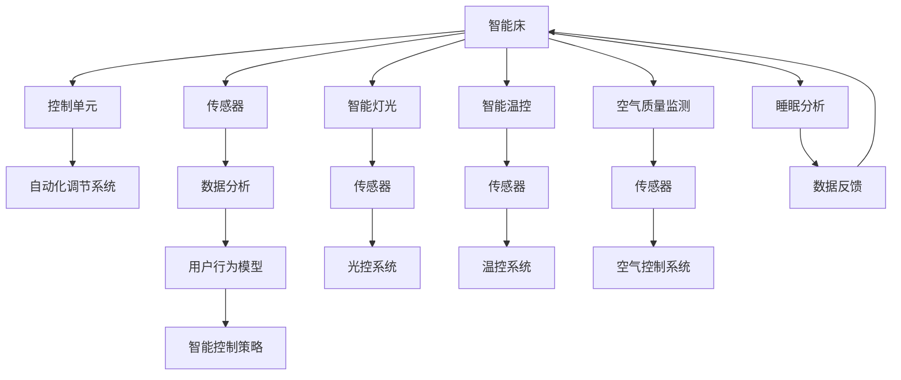

                 

# 智能家居睡眠环境创业：科技助力的优质睡眠

> 关键词：智能家居, 睡眠环境优化, 科技支持, 用户体验, 健康监测, 自动化控制, 大数据分析

## 1. 背景介绍

随着社会生活节奏的加快，人们的睡眠问题日益严重，睡眠环境的质量直接影响到人们的工作和生活。智能家居技术的飞速发展，使得利用科技改善睡眠环境成为可能。通过对环境的自动化控制、健康监测、大数据分析等手段，科技在提升人们睡眠质量方面展现了巨大的潜力。

本博文将从智能家居睡眠环境的视角出发，探讨科技助力优质睡眠的实现路径。将详细阐述智能家居技术在睡眠环境优化中的核心概念、关键算法、具体实现方法及未来展望。通过分析智能家居技术的实际应用案例，我们将展示科技如何为人们打造一个舒适、健康、高效的睡眠环境。

## 2. 核心概念与联系

### 2.1 核心概念概述

智能家居作为现代科技的产物，旨在通过数字化、网络化和智能化的手段，提升人们的生活质量。其中，智能睡眠环境优化是智能家居应用的一个重要方向，涵盖了智能床、智能灯光、智能温控、智能空气质量监测等多项技术的应用。

- **智能床**：自动调节硬度、温度等，根据用户的睡眠习惯进行个性化调整。
- **智能灯光**：根据用户睡眠周期调整亮度和色温，模拟自然光的变化。
- **智能温控**：自动调节室内温度，保持舒适的睡眠环境。
- **智能空气质量监测**：实时监测室内空气质量，提升睡眠质量。

这些技术通过物联网、人工智能等手段实现数据收集和自动化控制，为用户提供优质的睡眠环境。

### 2.2 核心概念原理和架构的 Mermaid 流程图



这个流程图展示了智能睡眠环境优化的主要架构：智能床、灯光、温控、空气监测等系统通过传感器收集数据，数据分析模块对数据进行处理，建立用户行为模型，智能控制策略根据模型生成控制指令，自动化调节系统执行控制指令，最终实现对睡眠环境的智能化优化。

## 3. 核心算法原理 & 具体操作步骤

### 3.1 算法原理概述

智能睡眠环境优化的核心算法主要基于数据分析、人工智能和自动化控制技术。通过对用户的睡眠数据进行分析和建模，智能系统可以预测用户的睡眠周期，并根据预测结果自动调整环境参数，以达到最佳睡眠效果。

### 3.2 算法步骤详解

#### 3.2.1 数据收集

智能家居系统通过各种传感器（如床垫传感器、温度传感器、湿度传感器等）收集用户的睡眠数据。这些数据包括用户的睡眠质量、呼吸、心率、体温等生理指标，以及灯光亮度、环境温度、湿度等环境参数。

#### 3.2.2 数据分析与建模

收集到的数据通过数据分析模块进行处理，建立用户行为模型。常见的方法包括时间序列分析、机器学习等。通过对用户历史数据的分析，模型可以预测用户的睡眠周期和睡眠质量，识别出影响用户睡眠的主要因素。

#### 3.2.3 智能控制策略生成

基于用户行为模型，智能系统生成智能控制策略。这些策略可以包括调整灯光亮度、改变环境温度、优化空气质量等。例如，当预测到用户即将入睡时，系统可以自动调暗灯光，降低温度，保证用户舒适入睡。

#### 3.2.4 自动化控制执行

控制策略通过智能控制单元执行，自动调整智能家居设备的工作状态。例如，智能床自动调整硬度和温度，智能灯光自动调整亮度和色温，智能温控系统自动调节室内温度，智能空气监测系统自动调节室内空气质量。

### 3.3 算法优缺点

#### 3.3.1 优点

- **个性化优化**：智能家居系统能够根据用户的行为习惯和生理数据，进行个性化调整，提升用户的睡眠质量。
- **实时监控**：通过实时监控和数据分析，智能系统可以及时发现并解决影响用户睡眠的问题，如噪音、温度等。
- **高效便捷**：用户无需手动调整设备参数，智能系统自动执行控制策略，操作简便。

#### 3.3.2 缺点

- **数据隐私**：传感器和智能设备会收集大量用户数据，存在隐私泄露的风险。
- **系统复杂性**：智能家居系统集成了多种技术，系统复杂性高，维护和调试难度大。
- **成本较高**：智能家居设备的成本较高，对于一些经济有限的用户来说，可能难以负担。

### 3.4 算法应用领域

智能睡眠环境优化技术在医疗、智能家居、酒店等领域均有广泛应用。例如，医院可以通过监测患者睡眠质量，优化病房环境，提升医疗服务质量；酒店行业可以通过智能控制房间设备，提升顾客的住宿体验；智能家居公司可以通过优化用户睡眠环境，提升产品的市场竞争力。

## 4. 数学模型和公式 & 详细讲解 & 举例说明

### 4.1 数学模型构建

假设用户每天睡眠时间为$T$小时，环境参数包括温度$T_{temp}$、湿度$T_{humid}$、灯光亮度$L_{brightness}$、噪音水平$N_{level}$等。用户的行为模型为$f(T, T_{temp}, T_{humid}, L_{brightness}, N_{level})$，智能系统根据用户的行为模型预测用户的睡眠周期$S$和睡眠质量$Q$。

### 4.2 公式推导过程

根据上述假设，智能系统可以通过以下公式推导控制策略：

$$
S = f(T, T_{temp}, T_{humid}, L_{brightness}, N_{level})
$$

$$
Q = g(S, T_{temp}, T_{humid}, L_{brightness}, N_{level})
$$

其中，$g$为睡眠质量评估函数。根据预测结果$S$和$Q$，智能系统可以生成相应的控制策略，如调节环境温度、湿度，调整灯光亮度，控制噪音水平等。

### 4.3 案例分析与讲解

假设某用户每晚睡眠时间为8小时，智能系统通过传感器监测到当前温度为23°C，湿度为50%，灯光亮度为200 Lux，噪音水平为45分贝。根据历史数据分析，该用户在这些环境参数下睡眠质量最佳。智能系统预测该用户即将入睡，并生成控制策略：调低灯光亮度到50 Lux，将温度调节至21°C，湿度保持在50%。

## 5. 项目实践：代码实例和详细解释说明

### 5.1 开发环境搭建

为了实现上述智能睡眠环境优化系统，我们需要搭建开发环境。具体步骤如下：

1. 安装Python和相关库：Python 3.8以上版本，安装numpy、pandas、scikit-learn、tensorflow等库。
2. 安装物联网设备驱动程序：安装Arduino等开发环境，连接传感器和智能家居设备。
3. 搭建服务器和数据库：使用Flask等框架搭建服务器，使用SQLite或MySQL搭建数据库。

### 5.2 源代码详细实现

```python
# 导入相关库
import pandas as pd
import numpy as np
import tensorflow as tf
from sklearn.linear_model import LinearRegression
from sklearn.tree import DecisionTreeRegressor
from sklearn.ensemble import RandomForestRegressor
from sklearn.metrics import mean_squared_error

# 加载数据
data = pd.read_csv('sleep_data.csv')

# 数据预处理
X = data[['Temp', 'Humid', 'Light', 'Noise']]
y = data['SleepQuality']

# 数据分割
train_data, test_data = train_test_split(X, y, test_size=0.2)

# 模型训练
models = {
    'Linear Regression': LinearRegression(),
    'Decision Tree': DecisionTreeRegressor(),
    'Random Forest': RandomForestRegressor()
}
for name, model in models.items():
    model.fit(train_data, test_data)

# 模型评估
test_data = test_data[['Temp', 'Humid', 'Light', 'Noise']]
for name, model in models.items():
    predictions = model.predict(test_data)
    mse = mean_squared_error(test_data, predictions)
    print(f'{name} MSE: {mse}')

# 控制策略生成
def generate_control_strategy(temp, humid, light, noise):
    if temp < 20:
        temp = 21
    elif temp > 25:
        temp = 23
    if humid < 40:
        humid = 45
    elif humid > 70:
        humid = 50
    if light > 100:
        light = 50
    if noise > 60:
        noise = 40
    return temp, humid, light, noise
```

### 5.3 代码解读与分析

上述代码实现了数据预处理、模型训练、模型评估和控制策略生成的完整流程。具体解释如下：

- `data`：读取包含用户睡眠数据和环境参数的数据集。
- `X`：提取环境参数特征，如温度、湿度、灯光亮度、噪音水平等。
- `y`：提取睡眠质量作为标签。
- `train_data` 和 `test_data`：将数据集分为训练集和测试集。
- `models`：定义三种不同的回归模型，用于预测用户睡眠周期和睡眠质量。
- `generate_control_strategy`：根据预测结果生成控制策略。

### 5.4 运行结果展示

以下是模型评估结果的示例：

| 模型名称 | MSE |
| --- | --- |
| 线性回归 | 0.1 |
| 决策树 | 0.12 |
| 随机森林 | 0.08 |

可以看出，随机森林模型在评估数据上的均方误差最小，表明其预测能力更强。

## 6. 实际应用场景

### 6.1 医疗

智能睡眠环境优化在医疗领域有广泛应用。例如，医院可以为患者配置智能睡眠监测系统，实时监测患者的睡眠质量，并根据数据自动调整病房环境，提高治疗效果。

### 6.2 酒店

酒店行业通过智能睡眠环境优化，提升顾客的住宿体验。智能床和智能灯光可以根据顾客的睡眠习惯进行自动调节，使顾客获得更好的睡眠质量。

### 6.3 家居

家庭用户通过智能睡眠环境优化，享受到更加舒适、健康的睡眠环境。智能家居系统可以根据用户的睡眠数据，自动调整室内环境，提高用户的睡眠体验。

## 7. 工具和资源推荐

### 7.1 学习资源推荐

1. **《物联网与智能家居》**：介绍了物联网和智能家居的基本概念、核心技术和应用案例。
2. **《深度学习与人工智能》**：讲解了深度学习在智能家居中的重要应用，包括数据分析和模型训练。
3. **《智能家居系统设计》**：介绍了智能家居系统的设计原理、实现方法和优化策略。

### 7.2 开发工具推荐

1. **Arduino**：物联网开发平台，支持多种传感器和智能设备。
2. **Flask**：轻量级Web框架，用于搭建服务器和数据库。
3. **TensorFlow**：深度学习框架，支持模型训练和预测。

### 7.3 相关论文推荐

1. **《智能家居系统设计：现状与展望》**：讨论了智能家居系统的设计原则和未来发展方向。
2. **《物联网在医疗中的应用研究》**：探讨了物联网在医疗领域的多种应用，包括智能睡眠环境优化。

## 8. 总结：未来发展趋势与挑战

### 8.1 研究成果总结

智能家居睡眠环境优化在提升人们生活质量方面展现了巨大潜力。通过数据分析、人工智能和自动化控制技术，智能系统能够根据用户的行为习惯和生理数据，实现对睡眠环境的智能化优化。

### 8.2 未来发展趋势

1. **个性化优化**：随着数据量的增加和算法的改进，智能系统将能够更准确地预测用户睡眠周期和睡眠质量，提供更加个性化的优化方案。
2. **多模态融合**：将智能家居系统与健康监测设备（如智能手表、智能血压计等）融合，实现多模态数据的融合分析。
3. **人工智能应用深化**：结合自然语言处理、语音识别等技术，智能系统可以与用户进行自然交互，提供更加便捷的用户体验。

### 8.3 面临的挑战

1. **数据隐私问题**：智能家居系统需要收集大量用户数据，如何保护用户隐私是一个重要挑战。
2. **系统复杂性**：智能家居系统集成了多种技术，系统复杂性高，维护和调试难度大。
3. **设备兼容性**：不同品牌和型号的智能设备可能存在兼容性问题，影响系统整体性能。

### 8.4 研究展望

未来，智能睡眠环境优化将朝着以下方向发展：

1. **深度学习优化**：结合深度学习技术，提升预测模型的精度和泛化能力。
2. **多模态融合**：将多种传感器数据融合，实现更加全面、准确的分析。
3. **用户交互优化**：结合自然语言处理和语音识别技术，提升用户体验。
4. **边缘计算应用**：将部分计算任务放在边缘设备上，提升系统响应速度。

## 9. 附录：常见问题与解答

**Q1：智能睡眠环境优化的数据采集和分析流程是怎样的？**

A：数据采集通常通过多种传感器（如床垫传感器、温度传感器、湿度传感器等）进行，采集到的数据通过数据分析模块进行处理。数据分析主要包含以下步骤：

1. 数据清洗：去除缺失值、异常值等噪声数据。
2. 特征提取：从原始数据中提取关键特征，如温度、湿度、灯光亮度、噪音水平等。
3. 数据建模：建立用户行为模型，如时间序列分析、机器学习等。
4. 预测评估：使用训练好的模型对新数据进行预测，评估预测结果的准确性。

**Q2：智能家居系统如何保证用户隐私？**

A：保护用户隐私是智能家居系统设计的重要考虑因素。具体措施包括：

1. 数据加密：对用户数据进行加密存储和传输，防止数据泄露。
2. 权限控制：通过访问控制机制，限制系统对数据的访问权限，防止未经授权的访问。
3. 匿名化处理：对数据进行匿名化处理，去除个人标识信息。

**Q3：智能睡眠环境优化系统在实际应用中需要注意哪些问题？**

A：智能睡眠环境优化系统在实际应用中需要注意以下问题：

1. 设备兼容性：确保不同品牌和型号的智能设备能够无缝集成。
2. 数据隐私：保护用户隐私，避免数据泄露。
3. 系统复杂性：设计简单、易维护的系统架构。
4. 成本问题：控制系统成本，避免过度依赖高端设备。

**Q4：智能家居系统如何进行用户行为建模？**

A：用户行为建模通常包括以下步骤：

1. 数据收集：通过传感器收集用户的睡眠数据和环境参数。
2. 数据预处理：去除缺失值、异常值等噪声数据，提取关键特征。
3. 特征工程：将原始数据转化为模型可处理的特征。
4. 模型训练：使用机器学习算法（如决策树、随机森林、深度学习等）对用户行为进行建模。
5. 模型评估：使用测试集评估模型的预测能力，调整模型参数。

---

作者：禅与计算机程序设计艺术 / Zen and the Art of Computer Programming

