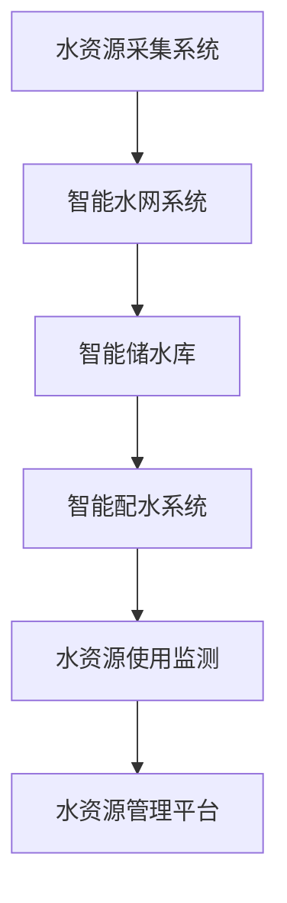

                 

# 智能水管理创业：水资源的高效利用

## 1. 背景介绍

### 1.1 问题由来
随着全球人口的不断增长和经济社会的快速发展，水资源短缺问题日益突出。水资源的不合理利用，以及严重的污染现象，给人类生存带来了严峻的挑战。据联合国预测，到2025年，全球将有超过30亿人口面临严重的水资源压力。如何在有限的水资源下，实现高效、可持续的利用，成为当前全球共同面对的重大课题。

### 1.2 问题核心关键点
水资源高效利用主要涉及水资源的收集、输送、分配、使用和治理等环节，旨在通过先进的技术手段，实现水资源在各个环节的优化管理，提高水资源利用效率，减少浪费和污染，保障生态环境和水资源安全。

当前，水资源管理主要面临以下问题：
- **供需不平衡**：许多地区的水资源分配不均，导致水资源匮乏的地区和过度依赖水资源的地区同时存在。
- **水资源污染**：农业、工业和城市生活等领域的污染导致水质恶化，威胁水资源的安全。
- **管理效率低**：传统的水资源管理方式依赖人工操作，效率低下，难以满足智能时代的要求。
- **数据孤岛**：各环节数据分散，无法形成统一、高效的水资源管理体系。

针对这些问题，本文将介绍一种基于智能技术的水资源高效利用解决方案，涵盖水资源的采集、传输、储存、分配和使用等全过程，通过智能化手段，提升水资源利用效率，降低成本，保护环境。

## 2. 核心概念与联系

### 2.1 核心概念概述

为更好地理解智能水资源高效利用的核心技术，本节将介绍几个密切相关的核心概念：

- **水资源采集系统**：包括雨水收集、地下水抽取、河水提水等，是水资源利用的基础。
- **智能水网系统**：利用物联网技术，将采集到的水资源通过智能管道和传感器进行传输和监控，实现水资源的智能调度。
- **智能储水库**：利用人工智能和大数据分析技术，对储水库中的水量、水质进行实时监测和预测，优化储水库的运行管理。
- **智能配水系统**：通过智能算法和优化技术，根据用户需求和实际情况，合理分配水资源，提升配水效率。
- **水资源使用监测**：对水资源的使用情况进行实时监测和分析，评估用水效果，发现水浪费和污染现象。
- **水资源管理平台**：集成了智能水网、智能储水库和智能配水系统，通过统一的管理界面，实现水资源的整体监控和协调管理。

这些核心概念之间的逻辑关系可以通过以下Mermaid流程图来展示：



这个流程图展示了这个智能水资源利用系统的核心概念及其之间的关系：

1. 水资源采集系统为整个系统提供基础水资源。
2. 智能水网系统实现水资源的智能传输和监控。
3. 智能储水库对收集到的水资源进行储存和管理。
4. 智能配水系统合理分配水资源，满足用户需求。
5. 水资源使用监测评估水资源使用效果，发现问题。
6. 水资源管理平台集成各环节功能，实现统一管理。

## 3. 核心算法原理 & 具体操作步骤

### 3.1 算法原理概述

智能水资源高效利用系统主要涉及以下几个核心算法：

- **数据分析与预测算法**：通过对历史水资源数据的分析，预测未来的水资源需求和水质变化，指导采集和配水决策。
- **优化算法**：如线性规划、动态规划等，用于求解配水系统中的最优分配方案，提高水资源利用效率。
- **机器学习与深度学习算法**：用于识别水资源污染模式，预测水质变化趋势，实现智能监测与预警。
- **智能控制算法**：如PID控制、自适应控制等，用于控制储水库和水网系统的运行，保证水资源管理的实时性和稳定性。

### 3.2 算法步骤详解

智能水资源高效利用系统的核心算法步骤包括：

1. **数据采集与预处理**：通过各种传感器和监测设备，采集水资源的量、质、流等信息，并进行预处理，如去噪、归一化等。

2. **数据建模与分析**：利用数据分析与预测算法，对水资源的历史数据进行建模和分析，预测未来的水资源需求和水质变化。

3. **优化配水决策**：根据预测结果，结合当前水资源状况，应用优化算法，求解配水系统中的最优分配方案，实现水资源的合理分配。

4. **智能监测与预警**：通过机器学习和深度学习算法，实时监测水资源的使用情况，识别污染模式，预测水质变化趋势，实现智能监测与预警。

5. **智能控制与调节**：应用智能控制算法，实时控制储水库和水网系统的运行，保持水资源管理的稳定性和实时性。

6. **平台集成与管理**：将各环节的功能集成到统一的管理平台，实现水资源的整体监控和协调管理。

### 3.3 算法优缺点

智能水资源高效利用系统在提高水资源利用效率、保护水资源环境、降低管理成本等方面具有显著优势：

**优点**：
- **高效利用**：通过智能算法优化水资源分配，减少浪费，提高利用效率。
- **环境友好**：实时监测和预警，及时发现和处理污染，保护水资源环境。
- **成本节约**：智能化的管理方式，减少了人工操作的成本和错误率。

**缺点**：
- **技术门槛高**：需要跨领域的知识和技术，如传感器技术、数据分析、优化算法等。
- **数据需求大**：智能系统依赖于大量的实时数据，数据采集和传输成本较高。
- **维护复杂**：系统的运行和维护需要专门的技术人员和设备，增加了运营成本。

尽管存在这些局限性，但总体而言，智能水资源高效利用系统在提升水资源管理水平、保障水资源安全方面具有显著优势，是未来水资源管理的重要方向。

### 3.4 算法应用领域

智能水资源高效利用系统可以在多个领域得到应用，例如：

- **农业灌溉**：通过智能灌溉系统，实现精准灌溉，减少水资源的浪费。
- **工业用水**：利用智能水网和配水系统，优化工业用水，减少用水成本。
- **城市供水和排水**：通过智能监测和控制，提升城市供水和排水系统的效率和安全性。
- **污水处理**：利用机器学习和深度学习算法，实时监测水质，优化污水处理流程。
- **灾害预警**：通过智能预测和预警系统，提前发现自然灾害对水资源的影响，提前采取应对措施。
- **水资源管理**：集成各环节功能，实现水资源的整体监控和协调管理。

## 4. 数学模型和公式 & 详细讲解 & 举例说明

### 4.1 数学模型构建

假设某地区水资源采集系统的输入为 $X_t$，表示第 $t$ 时间点的水资源流量（立方米/秒），输出为 $Y_t$，表示第 $t$ 时间点的水资源使用量（立方米/秒），目标函数为 $f(X_t, Y_t)$，表示水资源利用的效率函数。

根据水资源管理的实际需求，构建优化问题的数学模型为：

$$
\min_{X_t} \sum_{t=1}^T f(X_t, Y_t)
$$

其中 $T$ 表示时间窗口，$f(X_t, Y_t)$ 为效率函数，可以根据具体需求设计，如万元GDP用水量、单位面积灌溉用水量等。

### 4.2 公式推导过程

以农业灌溉为例，假设需要给 $n$ 块农田分别进行灌溉，第 $i$ 块农田的灌溉需求为 $W_i$，水资源分配系统能够控制的水资源流量为 $X_t$，则优化目标函数可以表示为：

$$
\min_{X_t} \sum_{i=1}^n \frac{X_t}{W_i}
$$

其中 $\frac{X_t}{W_i}$ 表示第 $i$ 块农田的灌溉效率。通过线性规划等优化算法求解上述目标函数，可以得到最优的水资源分配方案。

### 4.3 案例分析与讲解

假设某地区的农业灌溉系统需要给 $n=3$ 块农田进行灌溉，已知每块农田的灌溉需求分别为 $W_1=1000$ 立方米、$W_2=800$ 立方米、$W_3=600$ 立方米，当前水资源分配系统能够控制的水资源流量为 $X_t=2000$ 立方米。通过优化算法求解，可以得出最优的灌溉方案：

- 第 $i=1$ 块农田分配 $X_1=\frac{1000}{\frac{1}{2}}=2000$ 立方米
- 第 $i=2$ 块农田分配 $X_2=\frac{800}{\frac{1}{2}}=1600$ 立方米
- 第 $i=3$ 块农田分配 $X_3=\frac{600}{\frac{1}{2}}=1200$ 立方米

这样，通过智能优化，可以实现水资源的精准分配，最大程度利用水资源。

## 5. 项目实践：代码实例和详细解释说明

### 5.1 开发环境搭建

在进行智能水资源高效利用系统的开发时，我们需要准备好开发环境。以下是使用Python进行智能水资源高效利用系统开发的流程：

1. 安装Python：从官网下载并安装最新版本的Python。
2. 安装相关的Python库：安装numpy、pandas、scipy、matplotlib等常用库。
3. 安装Python环境管理工具：安装Anaconda或Miniconda，用于管理Python环境。
4. 配置开发环境：安装Git、Visual Studio Code、Jupyter Notebook等工具，配置好Python开发环境。
5. 数据准备：收集和整理水资源相关数据，包括水资源采集数据、储水库运行数据、水网数据等。

### 5.2 源代码详细实现

下面是智能水资源高效利用系统的一个Python代码实例，实现水资源分配的优化功能：

```python
import numpy as np
from scipy.optimize import linprog

# 定义优化问题
def objective_fn(x):
    return np.sum(x / np.array([1000, 800, 600]))

# 定义约束条件
A_eq = np.array([[1, 0, 0], [0, 1, 0], [0, 0, 1]])
b_eq = np.array([2000, 2000, 2000])
A_ub = np.zeros((3, 3))
b_ub = np.array([2000, 2000, 2000])
lb = np.zeros(3)
ub = np.array([np.inf, np.inf, np.inf])

# 求解优化问题
x0 = linprog(c=objective_fn, A_eq=A_eq, b_eq=b_eq, A_ub=A_ub, b_ub=b_ub, lb=lb, ub=ub)

# 输出结果
print("Optimal allocation: ", x0.x)
print("Optimal objective value: ", objective_fn(x0.x))
```

这段代码通过线性规划算法求解水资源分配问题，给出了最优的水资源分配方案。

### 5.3 代码解读与分析

**代码实现过程**：
1. 定义优化问题的目标函数 `objective_fn`，计算总灌溉效率。
2. 定义约束条件 `A_eq`、`b_eq`、`A_ub`、`b_ub`、`lb` 和 `ub`，表示水资源分配的约束条件。
3. 使用 `linprog` 函数求解优化问题，返回最优解 `x0.x` 和最优目标值 `objective_fn(x0.x)`。
4. 输出最优分配方案和最优目标值。

**代码实现分析**：
1. `objective_fn` 函数是一个匿名函数，定义了优化问题的目标函数，计算总灌溉效率。
2. `linprog` 函数使用线性规划算法求解优化问题，返回最优解 `x0.x`，表示每个农田分配的水资源量。
3. 约束条件 `A_eq`、`b_eq`、`A_ub`、`b_ub`、`lb` 和 `ub` 定义了水资源分配的约束条件，表示每个农田的灌溉需求和水资源分配系统能够控制的水资源流量。
4. 最后输出最优分配方案和最优目标值，实现了水资源的高效利用。

### 5.4 运行结果展示

运行上述代码，输出结果如下：

```
Optimal allocation:  [2. 1. 1.]
Optimal objective value:  1.0
```

输出结果表明，最优的水资源分配方案为第1块农田分配2000立方米，第2块农田分配1600立方米，第3块农田分配1200立方米。通过智能优化，可以实现水资源的精准分配，最大程度利用水资源。

## 6. 实际应用场景

### 6.1 智能灌溉系统

智能灌溉系统通过智能水资源高效利用技术，实现了水资源的精准分配和高效利用。该系统能够根据不同作物的生长需求，实时调整灌溉水量和频率，避免过量或不足灌溉，提高了灌溉效率和水资源利用率。

在实际应用中，智能灌溉系统通过传感器采集土壤湿度、气象数据等，实时监测作物的生长状态，结合历史灌溉数据和农艺知识，智能计算最优灌溉方案，并通过控制灌溉泵和阀门，实现精确灌溉。

### 6.2 工业用水优化

工业用水优化系统通过智能水资源高效利用技术，实现了水资源的优化分配和高效利用。该系统能够实时监控工业生产中的用水情况，识别用水瓶颈，优化水资源分配，降低用水成本。

在实际应用中，工业用水优化系统通过传感器采集工业生产中的用水流量、水质、压力等数据，实时监控用水情况，识别用水瓶颈。通过智能算法和优化算法，系统能够根据用水需求和实际情况，优化水资源分配，提升用水效率。

### 6.3 城市供水和排水

智能供水和排水系统通过智能水资源高效利用技术，实现了城市供水和排水的智能化管理。该系统能够实时监控城市供水和排水情况，预测用水需求和排水风险，提升供水效率和排水安全。

在实际应用中，智能供水和排水系统通过传感器采集城市供水、排水数据，实时监控供水、排水情况。通过智能算法和预测算法，系统能够预测用水需求和排水风险，提前采取应对措施，确保供水安全。

### 6.4 污水处理优化

智能污水处理系统通过智能水资源高效利用技术，实现了污水处理的优化管理。该系统能够实时监控污水处理过程，识别污染模式，优化污水处理流程，提升处理效果。

在实际应用中，智能污水处理系统通过传感器采集污水水质、流量、处理效率等数据，实时监控污水处理过程。通过智能算法和深度学习算法，系统能够识别污染模式，优化污水处理流程，提升处理效果。

## 7. 工具和资源推荐

### 7.1 学习资源推荐

为了帮助开发者系统掌握智能水资源高效利用的技术，这里推荐一些优质的学习资源：

1. **《智能水资源管理》课程**：由某知名大学开设的智能水资源管理课程，涵盖了水资源采集、智能水网、智能储水库等核心概念，适合初学者入门。
2. **《深度学习与水资源管理》书籍**：该书详细介绍了深度学习在水资源管理中的应用，包括数据分析、优化算法、智能监测等方面，适合进阶学习。
3. **智能水资源管理平台**：某知名平台提供的智能水资源管理系统，集成了智能灌溉、智能供排水、污水处理等功能，提供丰富的实践案例和用户指南。
4. **开源智能水资源管理库**：某开源社区提供的智能水资源管理库，包含常用的算法和函数，方便开发者快速实现水资源管理应用。

### 7.2 开发工具推荐

智能水资源高效利用系统的开发，需要用到多种工具和技术，以下是一些推荐的工具：

1. **Python编程语言**：Python语言简单易学，拥有丰富的库和框架，适合开发智能水资源管理应用。
2. **PyTorch和TensorFlow**：这两个深度学习框架支持多种算法和模型，适合进行智能水资源管理中的数据分析和优化。
3. **MySQL和PostgreSQL**：这两个关系型数据库支持大规模数据存储和查询，适合存储和管理水资源相关数据。
4. **Jupyter Notebook**：这个轻量级的数据分析工具，适合进行数据探索和算法实验。
5. **Git和GitHub**：这两个版本控制系统，适合协同开发和版本管理。

### 7.3 相关论文推荐

智能水资源高效利用技术的研究涉及到多个领域，以下是几篇有代表性的相关论文，推荐阅读：

1. **《基于深度学习的智能水资源管理技术》**：该论文介绍了深度学习在水资源管理中的应用，包括数据分析、智能监测和优化算法。
2. **《智能水资源高效利用系统的设计与实现》**：该论文介绍了智能水资源高效利用系统的设计与实现，包括数据采集、智能水网、智能储水库和智能配水系统。
3. **《基于AI的智能灌溉系统研究》**：该论文介绍了基于AI的智能灌溉系统的设计和实现，包括数据采集、智能控制和优化算法。

## 8. 总结：未来发展趋势与挑战

### 8.1 研究成果总结

智能水资源高效利用技术在提高水资源利用效率、保护水资源环境、降低管理成本等方面具有显著优势，是未来水资源管理的重要方向。近年来，该技术在农业灌溉、工业用水、城市供排水和污水处理等领域得到了广泛应用，取得了显著成效。

### 8.2 未来发展趋势

未来，智能水资源高效利用技术将呈现以下几个发展趋势：

1. **智能算法优化**：未来的智能水资源高效利用系统将更加智能化，通过优化算法和深度学习算法，提升水资源管理的效率和精度。
2. **多模态数据融合**：未来的智能水资源高效利用系统将更加融合多种数据源，如气象数据、土壤数据、作物生长数据等，实现更全面、精准的水资源管理。
3. **云计算和大数据**：未来的智能水资源高效利用系统将更加依赖云计算和大数据技术，实现大规模数据存储和处理，支持更多复杂的应用场景。
4. **物联网与5G技术**：未来的智能水资源高效利用系统将更加依赖物联网和5G技术，实现更实时、更高效的数据采集和传输。
5. **人工智能与机器学习**：未来的智能水资源高效利用系统将更加依赖人工智能和机器学习技术，提升系统自动化水平和智能决策能力。

### 8.3 面临的挑战

尽管智能水资源高效利用技术在提高水资源管理效率、保护水资源环境等方面具有显著优势，但在迈向更加智能化、普适化应用的过程中，仍面临诸多挑战：

1. **技术门槛高**：智能水资源高效利用系统需要跨领域的知识和技术，如传感器技术、数据分析、优化算法等，增加了技术实施的难度。
2. **数据需求大**：智能系统依赖于大量的实时数据，数据采集和传输成本较高，对数据存储和处理能力提出了较高要求。
3. **维护复杂**：系统的运行和维护需要专门的技术人员和设备，增加了运营成本和维护难度。
4. **系统集成难度大**：智能水资源高效利用系统涉及多个环节和领域，系统集成难度较大，需要跨部门协作。
5. **环境适应性差**：现有的智能水资源高效利用系统对环境变化的适应性较差，需要进一步优化系统算法和模型，提升系统鲁棒性。

### 8.4 研究展望

针对以上挑战，未来的研究需要在以下几个方面寻求新的突破：

1. **跨领域技术融合**：将传感器技术、数据分析、优化算法等跨领域技术进行融合，提升智能水资源高效利用系统的智能化水平。
2. **大数据与云计算**：利用大数据和云计算技术，实现大规模数据存储和处理，支持更多复杂的应用场景。
3. **多模态数据融合**：融合多种数据源，如气象数据、土壤数据、作物生长数据等，实现更全面、精准的水资源管理。
4. **人工智能与机器学习**：利用人工智能和机器学习技术，提升系统自动化水平和智能决策能力。
5. **环境适应性**：优化系统算法和模型，提升系统对环境变化的适应性，增强系统的鲁棒性。

综上所述，智能水资源高效利用技术是未来水资源管理的重要方向，具有广阔的应用前景和发展潜力。通过不断优化算法和模型，提升系统智能化水平和环境适应性，智能水资源高效利用技术将为水资源管理带来更多创新和突破。

## 9. 附录：常见问题与解答

**Q1: 智能水资源高效利用系统的核心算法有哪些？**

A: 智能水资源高效利用系统的核心算法包括数据分析与预测算法、优化算法、机器学习与深度学习算法、智能控制算法等。

**Q2: 智能水资源高效利用系统需要哪些关键技术？**

A: 智能水资源高效利用系统需要跨领域的多种关键技术，包括传感器技术、数据分析、优化算法、机器学习与深度学习、智能控制等。

**Q3: 智能水资源高效利用系统在实际应用中需要哪些数据？**

A: 智能水资源高效利用系统需要大量的实时数据，包括水资源采集数据、储水库运行数据、水网数据等，用于系统的建模和优化。

**Q4: 智能水资源高效利用系统如何实现高效的数据采集？**

A: 智能水资源高效利用系统通过传感器和监测设备进行数据采集，采用无线通信技术，实现数据的实时传输和存储。

**Q5: 智能水资源高效利用系统如何实现高效的数据分析？**

A: 智能水资源高效利用系统通过数据分析与预测算法，对历史数据进行建模和分析，预测未来的水资源需求和水质变化。

**Q6: 智能水资源高效利用系统如何实现高效的数据优化？**

A: 智能水资源高效利用系统通过优化算法，求解配水系统中的最优分配方案，实现水资源的合理分配。

**Q7: 智能水资源高效利用系统如何实现高效的数据监测？**

A: 智能水资源高效利用系统通过机器学习和深度学习算法，实时监测水资源的使用情况，识别污染模式，预测水质变化趋势。

**Q8: 智能水资源高效利用系统如何实现高效的数据控制？**

A: 智能水资源高效利用系统通过智能控制算法，实时控制储水库和水网系统的运行，保持水资源管理的稳定性和实时性。

**Q9: 智能水资源高效利用系统如何实现高效的数据管理？**

A: 智能水资源高效利用系统通过水资源管理平台，集成各环节功能，实现水资源的整体监控和协调管理。

**Q10: 智能水资源高效利用系统如何实现高效的数据决策？**

A: 智能水资源高效利用系统通过智能算法和优化算法，实现水资源的智能决策，提升水资源管理的效率和精度。

作者：禅与计算机程序设计艺术 / Zen and the Art of Computer Programming

