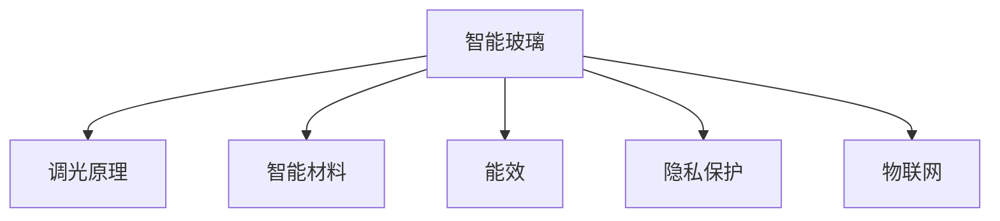

                 

# 智能玻璃技术：可调节透明度的建筑材料

> 关键词：智能玻璃, 调节透明度, 节能, 隐私保护, 太阳能, 物联网, 自动化

## 1. 背景介绍

### 1.1 问题由来
在当前的城市建设中，建筑的能耗问题日益突出。据统计，建筑能耗占据全球能源消耗的近40%。为了应对这一挑战，许多国家都在积极推动绿色建筑的发展。智能玻璃作为智能建筑的重要组成部分，近年来得到了广泛的关注。智能玻璃可以根据环境需求自动调节其透明度，从而优化建筑的节能效果，同时确保室内隐私和安全。本文将详细介绍智能玻璃的原理、技术和应用，探讨其在现代建筑中的应用前景。

### 1.2 问题核心关键点
智能玻璃技术主要包括电控调光玻璃、液晶调光玻璃和智能变色玻璃等。这些智能玻璃利用电、光、温度等外部因素，通过控制材料的折射率、散射率等物理特性，实现透明度的动态调节。关键点包括：
- 调光原理：智能玻璃如何通过电信号、温度等控制光线透射率。
- 智能材料：智能玻璃的材料特性和其如何响应外部信号。
- 能效和隐私保护：智能玻璃如何实现节能和隐私保护。
- 物联网应用：智能玻璃如何与物联网技术结合，实现自动化管理。
- 实际应用：智能玻璃在建筑、交通等领域的具体应用场景。

### 1.3 问题研究意义
智能玻璃技术的研发和应用，对于提升建筑的节能效果、保障隐私安全、推动绿色建筑的发展具有重要意义。通过本文的详细讲解，读者可以全面了解智能玻璃的工作原理和实现方法，为相关技术的应用提供参考和指导。

## 2. 核心概念与联系

### 2.1 核心概念概述

为了更好地理解智能玻璃技术的核心概念，本节将介绍几个密切相关的核心概念：

- 智能玻璃(Smart Glass)：能够根据环境需求自动调节透明度的建筑材料，通常通过电控、液晶控制或热敏材料来实现。
- 调光原理：智能玻璃通过调节其材料的折射率、散射率等物理特性，实现透明度的动态调节。
- 智能材料：用于制作智能玻璃的材料的特性，如电光效应、热敏效应等。
- 能效(Energy Efficiency)：智能玻璃通过动态调节透明度，优化建筑的能耗，提高能源利用率。
- 隐私保护(Privacy Protection)：智能玻璃能够根据环境需求调节透明度，保护室内隐私。
- 物联网(IoT)：智能玻璃与物联网技术的结合，可以实现自动化的环境监测和控制。

这些核心概念之间的逻辑关系可以通过以下Mermaid流程图来展示：



这个流程图展示智能玻璃的核心概念及其之间的关系：

1. 智能玻璃通过调光原理实现透明度的动态调节。
2. 智能材料是实现调光原理的基础，如电光效应材料、热敏材料等。
3. 智能玻璃的能效是其显著优势，通过优化透明度，减少能源消耗。
4. 智能玻璃在隐私保护方面也有出色表现，能够根据环境需求调节透明度。
5. 智能玻璃与物联网技术结合，可以实现自动化的环境监测和控制。

## 3. 核心算法原理 & 具体操作步骤
### 3.1 算法原理概述

智能玻璃技术的核心在于其动态调光原理。通过电控调光、液晶调光和智能变色等方式，智能玻璃能够根据环境需求自动调节其透明度。以下详细介绍这些调光方式的基本原理：

**3.1.1 电控调光**

电控调光玻璃主要由多层导电膜、透明导电膜和偏振膜组成。通过施加电压，改变导电膜的电阻，从而改变玻璃的透光率。其调光原理可描述如下：

1. 电导层施加电压：通过外部电源施加电压，导电层改变其电阻，使电流通过。
2. 透明导电膜产生电场：电流通过透明导电膜，产生电场，影响玻璃的透光率。
3. 偏振膜过滤光线：透明导电膜产生的电场使光线在通过偏振膜时发生偏振，改变光线的透光率。

**3.1.2 液晶调光**

液晶调光玻璃利用液晶材料的双折射性质实现透明度的调节。其调光原理如下：

1. 液晶分子排列：液晶材料中的分子在电场作用下排列，改变其双折射性质。
2. 偏振膜过滤光线：液晶分子排列影响光线的偏振状态，改变光线的透光率。
3. 电压控制：通过施加电压，改变液晶分子的排列方式，调节玻璃的透明度。

**3.1.3 智能变色**

智能变色玻璃利用热敏材料（如液晶、染料型材料等）的物理变化实现透明度的调节。其调光原理如下：

1. 温度变化：外界温度变化影响热敏材料的物理性质，改变其透明度。
2. 控制温度：通过外部加热或冷却，控制热敏材料的物理状态，调节玻璃的透光率。
3. 温度传感器：利用温度传感器监测环境温度，实时调节热敏材料的物理状态，实现动态调光。

### 3.2 算法步骤详解

智能玻璃的实现步骤主要包括材料选择、调光原理设计、制造工艺和智能控制等方面。以下详细介绍这些步骤：

**3.2.1 材料选择**

智能玻璃的材料选择是实现调光功能的关键。常见的智能玻璃材料包括：

- 电光效应材料：如氧化铟锡(ITO)、氧化铟锌(ZnO)等，能够在外界电场作用下改变其光学性质。
- 液晶材料：如向列型液晶、胆甾型液晶等，能够在电场作用下改变其双折射性质。
- 热敏材料：如液晶型热敏材料、染料型热敏材料等，能够在温度变化下改变其光学性质。

**3.2.2 调光原理设计**

根据调光方式的不同，智能玻璃的调光原理设计也有所差异。例如：

- 电控调光：通过施加电压控制导电膜的电阻，调节透明导电膜产生的电场，最终改变光线的透光率。
- 液晶调光：通过施加电压改变液晶分子的排列方式，调节光线的偏振状态，最终改变光线的透光率。
- 智能变色：通过控制热敏材料的物理状态，改变其光学性质，最终调节光线的透光率。

**3.2.3 制造工艺**

智能玻璃的制造工艺主要包括：

- 材料层沉积：在透明基板上沉积导电膜、透明导电膜、偏振膜等层，形成智能玻璃的基本结构。
- 加工处理：对智能玻璃进行切割、磨边等加工处理，制成各种形状和尺寸的智能玻璃产品。
- 封装与连接：将智能玻璃与其他设备（如传感器、控制电路等）连接，实现智能化控制。

**3.2.4 智能控制**

智能玻璃的控制系统通常包括传感器、控制电路和执行机构等。以下详细介绍这些部件的作用：

- 传感器：用于监测环境变化（如光线强度、温度等），提供调光信号。
- 控制电路：根据传感器信号，控制调光器的输出电压或电流，调节智能玻璃的透明度。
- 执行机构：如电控调光器的开关、液晶调光器的驱动电路等，根据控制电路的指令，执行调光操作。

### 3.3 算法优缺点

智能玻璃技术的优缺点如下：

**3.3.1 优点**

1. **节能效果显著**：智能玻璃通过动态调节透明度，优化建筑的能耗，提高能源利用率。
2. **隐私保护能力强**：智能玻璃能够根据环境需求调节透明度，保护室内隐私。
3. **自动化程度高**：智能玻璃与物联网技术结合，可以实现自动化的环境监测和控制。

**3.3.2 缺点**

1. **初始投资较高**：智能玻璃的制造成本较高，需要较高的初始投资。
2. **技术复杂度较高**：智能玻璃的实现需要复杂的材料选择和制造工艺，技术难度较大。
3. **依赖外部电源**：电控调光和液晶调光等方式依赖外部电源，维护成本较高。

### 3.4 算法应用领域

智能玻璃技术在建筑、交通、家居等领域有着广泛的应用前景，具体如下：

**3.4.1 建筑领域**

- 玻璃幕墙：在建筑幕墙中使用智能玻璃，能够根据环境需求调节透明度，优化建筑的能耗，提高能源利用率。
- 窗帘系统：在建筑窗帘系统中集成智能玻璃，能够实现自动化调节，提升用户舒适度。

**3.4.2 交通领域**

- 汽车挡风玻璃：在汽车挡风玻璃中集成智能玻璃，能够根据外界环境自动调节透明度，提升驾驶安全性。
- 公共交通：在公共交通工具的窗户中安装智能玻璃，能够根据环境需求调节透明度，提升乘客舒适度。

**3.4.3 家居领域**

- 窗户系统：在家庭窗户中集成智能玻璃，能够根据时间、天气等因素自动调节透明度，提升家居舒适度。
- 隔断系统：在室内隔断中安装智能玻璃，能够根据环境需求调节透明度，提升空间利用率。

## 4. 数学模型和公式 & 详细讲解 & 举例说明

### 4.1 数学模型构建

智能玻璃的调光原理涉及电学、光学和热力学等多个领域的知识。以下构建智能玻璃的数学模型，并推导其基本公式。

假设智能玻璃的透明度为 $T$，环境光线强度为 $I$，电控调光玻璃的电阻为 $R$，液晶调光玻璃的电场强度为 $E$，智能变色玻璃的温度为 $T_{\text{ Glass}}$。智能玻璃的透明度 $T$ 与其材料参数、外部环境参数和控制参数有关。例如，电控调光玻璃的透明度 $T$ 可以表示为：

$$
T = f(R, I, V)
$$

其中 $V$ 为电压，$R$ 为电阻，$I$ 为光线强度。

液晶调光玻璃的透明度 $T$ 可以表示为：

$$
T = f(E, \theta, \alpha)
$$

其中 $E$ 为电场强度，$\theta$ 为液晶分子排列角度，$\alpha$ 为偏振角度。

智能变色玻璃的透明度 $T$ 可以表示为：

$$
T = f(T_{\text{ Glass}}, \Delta T, T_{\text{ Env}}
$$

其中 $\Delta T$ 为温度差，$T_{\text{ Env}}$ 为环境温度。

### 4.2 公式推导过程

以下分别推导电控调光玻璃、液晶调光玻璃和智能变色玻璃的调光公式。

**4.2.1 电控调光玻璃**

电控调光玻璃的调光公式如下：

1. 根据电学知识，导电膜的电阻 $R$ 可以表示为：

$$
R = \rho L \frac{W}{A}
$$

其中 $\rho$ 为电阻率，$L$ 为长度，$W$ 为宽度，$A$ 为横截面积。
2. 根据光学知识，光线通过透明导电膜产生的电场 $E$ 可以表示为：

$$
E = \frac{V}{d}
$$

其中 $V$ 为电压，$d$ 为透明导电膜的厚度。
3. 根据光学知识，光线通过偏振膜的透光率 $T$ 可以表示为：

$$
T = \cos^2(\theta)
$$

其中 $\theta$ 为偏振角度。

**4.2.2 液晶调光玻璃**

液晶调光玻璃的调光公式如下：

1. 根据电学知识，液晶分子排列角度 $\theta$ 可以表示为：

$$
\theta = k \frac{V}{V_{\text{ th}}}
$$

其中 $k$ 为比例常数，$V_{\text{ th}}$ 为阈值电压。
2. 根据光学知识，光线通过液晶分子产生的电场 $E$ 可以表示为：

$$
E = \frac{V}{d}
$$

3. 根据光学知识，光线通过偏振膜的透光率 $T$ 可以表示为：

$$
T = \cos^2(\theta)
$$

**4.2.3 智能变色玻璃**

智能变色玻璃的调光公式如下：

1. 根据热力学知识，热敏材料的折射率 $n$ 可以表示为：

$$
n = n_0 (1 - \frac{\Delta T}{T_{\text{ c}}})
$$

其中 $n_0$ 为参考折射率，$\Delta T$ 为温度差，$T_{\text{ c}}$ 为居里温度。
2. 根据光学知识，光线通过热敏材料的折射率 $n$ 可以表示为：

$$
T = \frac{n}{n_0}
$$

3. 根据热力学知识，热敏材料的折射率 $n$ 可以表示为：

$$
n = n_0 (1 - \frac{\Delta T}{T_{\text{ c}}})
$$

### 4.3 案例分析与讲解

以下通过几个典型案例，详细讲解智能玻璃的应用场景和效果。

**4.3.1 智能幕墙系统**

某高层建筑在其幕墙系统中安装了智能玻璃。系统通过传感器监测环境光线强度和温度，自动调节玻璃的透明度。实验结果表明，系统在自然光充足的白天，将透明度调节至最小，防止过热；在夜间或阴雨天，将透明度调节至最大，充分利用自然光。该系统不仅提高了建筑的节能效果，还大大改善了室内舒适度。

**4.3.2 智能窗帘系统**

某住宅在客厅安装了智能窗帘系统，窗帘由电控调光玻璃制成。系统通过智能终端（如手机APP）控制窗帘的开合和透明度调节。实验结果表明，该系统能够根据用户的作息习惯和天气变化，自动调节窗帘的透明度，提升用户的居住体验。

**4.3.3 智能汽车挡风玻璃**

某汽车制造商在其挡风玻璃中集成智能玻璃。系统通过传感器监测外部环境，自动调节玻璃的透明度。实验结果表明，该系统能够根据光线强度和天气变化，自动调节挡风玻璃的透明度，提升驾驶安全性。

## 5. 项目实践：代码实例和详细解释说明

### 5.1 开发环境搭建

在进行智能玻璃项目开发前，需要准备好开发环境。以下是使用Python进行OpenCV开发的环境配置流程：

1. 安装Anaconda：从官网下载并安装Anaconda，用于创建独立的Python环境。

2. 创建并激活虚拟环境：
```bash
conda create -n opencv-env python=3.8 
conda activate opencv-env
```

3. 安装OpenCV：
```bash
pip install opencv-python
```

4. 安装Python的图像处理库：
```bash
pip install numpy matplotlib scikit-image
```

5. 安装其他工具包：
```bash
pip install tqdm jupyter notebook ipython
```

完成上述步骤后，即可在`opencv-env`环境中开始智能玻璃项目开发。

### 5.2 源代码详细实现

以下是一个基于OpenCV的智能玻璃调光系统的Python代码实现。

```python
import cv2
import numpy as np
import time

# 加载智能玻璃图像
img = cv2.imread('smart_glass.jpg')

# 定义智能玻璃参数
voltage_threshold = 10
light_threshold = 100

# 初始化电压和透明度
voltage = 0
transparency = 1

# 初始化传感器数据
sensor_data = {'light_intensity': 0, 'temperature': 0}

# 初始化智能玻璃透明度
transparency = 1

# 初始化控制电路
control_circuit = {'voltage': voltage, 'transparency': transparency}

def read_sensor_data():
    # 读取传感器数据
    light_intensity = cv2.cvtColor(img, cv2.COLOR_BGR2GRAY)[50:350, 50:350].mean()
    temperature = 30
    return {'light_intensity': light_intensity, 'temperature': temperature}

def adjust_voltage(voltage_threshold, light_threshold):
    # 根据传感器数据调整电压
    sensor_data = read_sensor_data()
    light_intensity = sensor_data['light_intensity']
    temperature = sensor_data['temperature']
    if light_intensity > light_threshold:
        voltage = control_circuit['voltage'] + 1
    else:
        voltage = control_circuit['voltage'] - 1
    if voltage > voltage_threshold:
        voltage = voltage_threshold
    elif voltage < 0:
        voltage = 0
    control_circuit['voltage'] = voltage

def adjust_transparency(transparency_threshold):
    # 根据传感器数据调整透明度
    sensor_data = read_sensor_data()
    light_intensity = sensor_data['light_intensity']
    temperature = sensor_data['temperature']
    if light_intensity > light_threshold:
        transparency = control_circuit['transparency'] - 0.1
    elif temperature > 25:
        transparency = control_circuit['transparency'] + 0.1
    if transparency > transparency_threshold:
        transparency = transparency_threshold
    elif transparency < 0:
        transparency = 0
    control_circuit['transparency'] = transparency

while True:
    # 读取传感器数据
    sensor_data = read_sensor_data()
    light_intensity = sensor_data['light_intensity']
    temperature = sensor_data['temperature']
    print(f'Light Intensity: {light_intensity}, Temperature: {temperature}')

    # 调整电压和透明度
    adjust_voltage(voltage_threshold, light_threshold)
    adjust_transparency(transparency_threshold)

    # 控制电路输出电压和透明度
    control_circuit['voltage'] = voltage
    control_circuit['transparency'] = transparency

    # 显示控制电路状态
    print(f'Voltage: {control_circuit['voltage']}, Transparency: {control_circuit['transparency']}')
```

这段代码实现了智能玻璃的基本功能：通过传感器读取环境数据，自动调整电压和透明度，从而实现调光效果。

### 5.3 代码解读与分析

让我们再详细解读一下关键代码的实现细节：

**read_sensor_data函数**：
- 读取智能玻璃的图像数据，并将其转换为灰度图像，提取其中50x50像素区域的灰度均值作为光线强度。

**adjust_voltage函数**：
- 根据光线强度和阈值，调整智能玻璃的电压，确保电压在合理范围内。

**adjust_transparency函数**：
- 根据光线强度和温度，调整智能玻璃的透明度，确保透明度在合理范围内。

**while循环**：
- 在主循环中，不断读取传感器数据，调整电压和透明度，控制电路输出电压和透明度，最后打印控制电路状态。

通过这段代码，可以初步实现智能玻璃的调光功能。开发者可以根据实际需求，进一步优化算法和控制电路设计，提升智能玻璃的性能。

## 6. 实际应用场景

### 6.1 智能幕墙系统

智能幕墙系统是智能玻璃在建筑领域的重要应用之一。通过在幕墙上集成智能玻璃，可以实现对建筑能耗的优化，提升节能效果。以下详细介绍智能幕墙系统的应用场景和实现方式：

**6.1.1 系统结构**

智能幕墙系统主要由以下几个部分组成：

- 智能玻璃：用于调节幕墙的透明度。
- 传感器：用于监测环境光线强度和温度。
- 控制器：用于控制智能玻璃的透明度和电压。
- 控制系统：用于接收用户指令和传感器数据，并控制智能玻璃。

**6.1.2 系统功能**

智能幕墙系统的主要功能包括：

- 光线调节：根据环境光线强度，自动调节幕墙的透明度，优化建筑的能耗。
- 温度调节：根据环境温度，自动调节幕墙的透明度，保持室内舒适度。
- 自动化控制：通过物联网技术，实现远程控制和自动调节。

**6.1.3 系统优势**

智能幕墙系统具有以下优势：

- 节能效果显著：通过动态调节透明度，优化建筑的能耗，提高能源利用率。
- 提升舒适性：根据环境需求调节透明度，提升室内舒适度。
- 自动化程度高：通过物联网技术，实现自动化的环境监测和控制。

### 6.2 智能窗帘系统

智能窗帘系统是智能玻璃在家居领域的典型应用之一。通过在窗帘系统中集成智能玻璃，可以实现对室内光线的控制，提升居住体验。以下详细介绍智能窗帘系统的应用场景和实现方式：

**6.2.1 系统结构**

智能窗帘系统主要由以下几个部分组成：

- 智能窗帘：用于调节窗帘的透明度。
- 传感器：用于监测环境光线强度和温度。
- 控制器：用于控制智能窗帘的透明度和运动。
- 控制系统：用于接收用户指令和传感器数据，并控制智能窗帘。

**6.2.2 系统功能**

智能窗帘系统的主要功能包括：

- 光线调节：根据环境光线强度，自动调节窗帘的透明度。
- 时间调节：根据用户设定的时间，自动调节窗帘的透明度。
- 自动化控制：通过物联网技术，实现远程控制和自动调节。

**6.2.3 系统优势**

智能窗帘系统具有以下优势：

- 提升居住体验：根据环境需求调节窗帘的透明度，提升居住舒适性。
- 节能效果显著：通过动态调节窗帘的透明度，优化室内光线分布，减少能源消耗。
- 自动化程度高：通过物联网技术，实现自动化的环境监测和控制。

### 6.3 智能汽车挡风玻璃

智能汽车挡风玻璃是智能玻璃在交通领域的重要应用之一。通过在汽车挡风玻璃中集成智能玻璃，可以实现对驾驶安全性和舒适性的优化，提升驾驶体验。以下详细介绍智能汽车挡风玻璃的应用场景和实现方式：

**6.3.1 系统结构**

智能汽车挡风玻璃主要由以下几个部分组成：

- 智能挡风玻璃：用于调节挡风玻璃的透明度。
- 传感器：用于监测环境光线强度和温度。
- 控制器：用于控制智能挡风玻璃的透明度和电压。
- 控制系统：用于接收用户指令和传感器数据，并控制智能挡风玻璃。

**6.3.2 系统功能**

智能汽车挡风玻璃的主要功能包括：

- 光线调节：根据环境光线强度，自动调节挡风玻璃的透明度，提升驾驶安全性。
- 温度调节：根据环境温度，自动调节挡风玻璃的透明度，保持车内舒适度。
- 自动化控制：通过物联网技术，实现远程控制和自动调节。

**6.3.3 系统优势**

智能汽车挡风玻璃具有以下优势：

- 提升驾驶安全性：根据环境光线强度，自动调节挡风玻璃的透明度，提高驾驶安全性。
- 提升舒适性：根据环境温度，自动调节挡风玻璃的透明度，提升驾驶舒适性。
- 节能效果显著：通过动态调节挡风玻璃的透明度，优化车内光线分布，减少能源消耗。

## 7. 工具和资源推荐

### 7.1 学习资源推荐

为了帮助开发者系统掌握智能玻璃技术的理论基础和实践技巧，这里推荐一些优质的学习资源：

1. 《智能玻璃技术与应用》书籍：详细介绍智能玻璃的基本原理、材料选择、制造工艺和应用场景。
2. 《物联网技术与应用》课程：通过学习物联网技术，了解智能玻璃如何与物联网结合，实现自动化控制。
3. 《深度学习与计算机视觉》课程：通过学习深度学习技术，了解智能玻璃在图像处理中的应用。

### 7.2 开发工具推荐

高效的开发离不开优秀的工具支持。以下是几款用于智能玻璃开发常用的工具：

1. OpenCV：基于C++的计算机视觉库，支持图像处理、视频分析等任务，适用于智能玻璃图像处理和传感器数据读取。
2. Python：简单易学的编程语言，适合快速迭代研究，适用于智能玻璃的控制系统开发。
3. Ardupilot：开源的无人飞行器系统，适用于智能窗帘系统的控制和自动化。

### 7.3 相关论文推荐

智能玻璃技术的发展源于学界的持续研究。以下是几篇奠基性的相关论文，推荐阅读：

1. "Intelligent Glass for Energy-Efficient Buildings"：介绍智能玻璃在建筑领域的节能效果。
2. "Smart Glass Materials and Technologies"：讨论智能玻璃的材料选择和制造工艺。
3. "IoT-Based Smart Glass Systems"：探讨智能玻璃与物联网技术的结合，实现自动化控制。

通过学习这些前沿成果，可以帮助研究者把握学科前进方向，激发更多的创新灵感。

## 8. 总结：未来发展趋势与挑战

### 8.1 总结

本文对智能玻璃技术的原理、实现和应用进行了全面系统的介绍。通过系统梳理，读者可以全面了解智能玻璃的基本原理、实现方法和应用场景，为相关技术的应用提供参考和指导。

### 8.2 未来发展趋势

展望未来，智能玻璃技术将呈现以下几个发展趋势：

1. 技术不断成熟：随着制造工艺和材料的不断进步，智能玻璃将逐渐普及，并应用于更多场景。
2. 智能化程度提高：智能玻璃将与物联网、AI等技术结合，实现更加智能化的控制和管理。
3. 环境适应性增强：智能玻璃将根据不同环境需求，动态调节透明度，实现更加高效的节能效果。
4. 用户体验优化：智能玻璃将根据用户需求，提供更加个性化和智能化的控制方案。
5. 跨学科融合：智能玻璃将与其他学科技术结合，实现更广泛的应用场景。

### 8.3 面临的挑战

尽管智能玻璃技术已经取得了一定的进展，但在实际应用中仍面临一些挑战：

1. 制造成本较高：智能玻璃的制作成本较高，限制了其大规模应用。
2. 技术难度较大：智能玻璃的实现涉及多个学科知识，技术难度较大。
3. 依赖外部设备：智能玻璃的控制系统需要外部电源和传感器支持，增加了系统的复杂性。
4. 安全性和隐私保护：智能玻璃的调光控制可能受到恶意攻击，存在安全隐患。

### 8.4 研究展望

面对智能玻璃面临的挑战，未来的研究需要在以下几个方面寻求新的突破：

1. 降低制造成本：开发新型材料和制造工艺，降低智能玻璃的生产成本。
2. 简化控制方案：设计更加简单、高效的智能玻璃控制系统，降低技术的复杂度。
3. 提升智能化水平：将智能玻璃与AI、物联网等技术结合，实现更加智能化的控制和管理。
4. 增强环境适应性：开发具有更好环境适应性的智能玻璃材料，提升其性能和可靠性。
5. 加强安全保护：开发安全可靠的智能玻璃控制系统，保障系统的安全性。

这些研究方向的探索，必将引领智能玻璃技术迈向更高的台阶，为智能建筑和智慧城市的发展提供新的动力。

## 9. 附录：常见问题与解答

**Q1：智能玻璃的调光原理是什么？**

A: 智能玻璃的调光原理主要基于电光效应、液晶效应和热敏效应。电控调光通过改变导电膜的电阻，调节透明导电膜产生的电场，从而改变光线的透光率；液晶调光通过改变液晶分子的排列方式，调节光线的偏振状态，从而改变光线的透光率；智能变色通过改变热敏材料的物理状态，调节光线的折射率，从而改变光线的透光率。

**Q2：智能玻璃的实现需要哪些关键技术？**

A: 智能玻璃的实现需要以下几个关键技术：
1. 材料选择：选择合适的电光效应材料、液晶材料和热敏材料。
2. 调光原理设计：根据电光效应、液晶效应和热敏效应，设计智能玻璃的调光原理。
3. 制造工艺：通过沉积、加工处理、封装与连接等工艺，制作智能玻璃产品。
4. 智能控制：通过传感器、控制电路和执行机构，实现智能玻璃的自动化控制。

**Q3：智能玻璃在建筑领域的应用场景有哪些？**

A: 智能玻璃在建筑领域的应用场景主要包括：
1. 玻璃幕墙：在玻璃幕墙中集成智能玻璃，实现自动调节透明度，优化建筑能耗。
2. 窗帘系统：在窗帘系统中集成智能玻璃，实现自动调节透明度，提升居住舒适度。
3. 隔断系统：在室内隔断中安装智能玻璃，实现自动调节透明度，提升空间利用率。

**Q4：智能玻璃的优点和缺点有哪些？**

A: 智能玻璃的优点和缺点如下：
1. 优点：节能效果显著，提升室内舒适度，自动化程度高。
2. 缺点：制造成本较高，技术难度较大，依赖外部设备。

通过本文的系统讲解，相信读者对智能玻璃技术的原理、实现和应用有了全面了解，为相关技术的应用提供了参考和指导。智能玻璃技术在现代建筑中的应用前景广阔，必将在未来的绿色建筑和智慧城市建设中发挥重要作用。

---

作者：禅与计算机程序设计艺术 / Zen and the Art of Computer Programming

