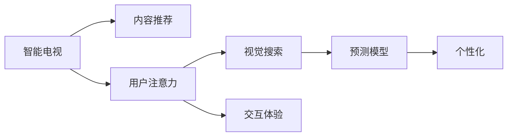

                 

# 智能电视：客厅场景下的注意力之争

> 关键词：智能电视, 客厅场景, 用户注意力, 内容推荐, 视觉搜索, 场景理解, 交互体验, 预测模型, 个性化

## 1. 背景介绍

### 1.1 问题由来
在数字时代，客厅作为家庭社交和娱乐的中心，其媒体生态正经历深刻变革。传统电视正被逐渐替代，智能电视作为新的家庭娱乐终端，不仅提供丰富的内容资源，还能通过先进技术实现个性化推荐、互动体验等功能，成为客厅媒体生态的重要组成部分。但同时，智能电视的“智能”程度，也受到其对用户注意力争夺能力的制约。如何有效获取用户注意力，为用户提供个性化且吸引人的内容体验，是智能电视面临的重大挑战之一。

### 1.2 问题核心关键点
用户注意力争夺能力是智能电视竞争的核心关键点。通过大数据分析、机器学习等技术手段，智能电视能够实时监测用户行为，了解其兴趣偏好，从而进行内容推荐和场景互动，提升用户沉浸感和满意度。但与此同时，如何准确捕捉用户兴趣，避免过度干扰，保持合理的“注意力阈值”，是提升用户粘性和体验的关键。

## 2. 核心概念与联系

### 2.1 核心概念概述

为了深入理解智能电视的注意力争夺机制，本节将介绍一些关键概念：

- **智能电视**：具备智能操作系统的电视，支持应用安装、内容推荐、用户交互等功能，是数字时代家庭娱乐的主要设备之一。
- **内容推荐**：根据用户兴趣和行为数据，智能电视动态推荐适合的内容资源，如影视、游戏、新闻等，提升用户体验。
- **用户注意力**：用户在智能电视上停留的注意力时长和频率，是衡量内容吸引力的重要指标。
- **视觉搜索**：通过图像识别、场景理解等技术，智能电视能够自动识别用户关注的视觉内容，如人脸、物品、场景等，进一步个性化推荐。
- **交互体验**：智能电视能够通过语音识别、手势控制、触摸板等交互方式，实现人与内容的深度互动。
- **预测模型**：利用机器学习算法，预测用户行为和偏好，是智能电视实现内容推荐的核心手段。
- **个性化**：根据用户历史行为和偏好，智能电视提供定制化内容推荐和服务，满足个性化需求。

这些概念相互关联，共同构成了智能电视注意力争夺的完整框架。通过有效利用这些概念，智能电视能够更好地吸引用户，提升用户满意度。

### 2.2 核心概念原理和架构的 Mermaid 流程图(Mermaid 流程节点中不要有括号、逗号等特殊字符)


这个流程图展示了大语言模型微调的完整概念框架：

1. 智能电视通过内容推荐吸引用户注意力。
2. 用户注意力时长和频率由视觉搜索技术监测。
3. 用户通过交互体验与内容互动。
4. 预测模型根据用户行为预测兴趣，进行个性化推荐。

这些环节相互依赖，共同作用于智能电视的注意力争夺能力。

## 3. 核心算法原理 & 具体操作步骤
### 3.1 算法原理概述

智能电视的用户注意力争夺，本质上是机器学习领域的推荐系统。推荐系统通过学习用户历史行为和偏好，预测用户未来可能感兴趣的内容，并通过算法和模型进行智能推荐。用户注意力争夺的效果，直接影响了用户对智能电视的满意度和使用时长。

一个典型的推荐系统包含以下几个核心步骤：
1. **数据采集**：收集用户历史行为数据，如观看记录、评分、点击等。
2. **特征工程**：从采集的数据中提取用户兴趣和行为特征，如观看时长、评分、场景等。
3. **模型训练**：通过用户行为和兴趣标签，训练推荐模型，如协同过滤、深度学习等。
4. **内容推荐**：根据训练好的模型，对当前用户进行实时内容推荐。

### 3.2 算法步骤详解

智能电视推荐系统的具体步骤包括：

1. **数据收集**：
   - 通过内置传感器和软件记录用户操作数据，如观看时长、手势操作等。
   - 使用智能设备（如智能音箱、智能家居）收集用户行为数据。
   - 整合外部数据来源，如社交媒体、天气预报、地理位置等。

2. **特征提取**：
   - 对用户行为数据进行预处理，如去噪、归一化、特征选择等。
   - 提取用户兴趣和行为特征，如观看时长、评分、场景等。
   - 构建用户-物品矩阵，表示用户对不同内容的兴趣。

3. **模型训练**：
   - 使用协同过滤、深度学习等算法进行模型训练。
   - 优化模型超参数，如正则化系数、学习率、迭代轮数等。
   - 使用交叉验证等技术评估模型性能，避免过拟合。

4. **内容推荐**：
   - 实时分析用户行为和环境变化，调整推荐策略。
   - 结合视觉搜索、语音识别等技术，提供个性化推荐。
   - 引入互动元素，如抽奖、游戏等，增强用户参与感。

### 3.3 算法优缺点

智能电视推荐系统的主要优点包括：

- **个性化推荐**：能够根据用户历史行为和偏好，提供定制化内容推荐。
- **实时性**：通过实时分析用户行为，动态调整推荐内容。
- **多模态融合**：结合视觉搜索、语音识别等技术，提供全感官互动体验。
- **内容丰富**：整合各类内容资源，如影视、新闻、游戏等，满足多样化需求。

同时，该系统也存在一些局限性：

- **隐私风险**：大规模数据收集可能涉及用户隐私保护问题。
- **过度干扰**：过度推荐可能导致用户反感，降低使用体验。
- **模型复杂度**：推荐算法复杂，需要高性能计算资源。
- **环境变化**：用户行为受环境影响，如心情、天气等，难以精准预测。
- **用户多样性**：不同用户兴趣差异大，单一模型难以兼顾。

尽管存在这些局限性，但智能电视推荐系统仍然是大数据时代内容推荐的重要手段，为提升用户体验提供了有力的技术支持。

### 3.4 算法应用领域

智能电视推荐系统已经在多个领域得到应用，涵盖如下：

- **家庭娱乐**：根据用户观看记录，推荐电影、电视剧、综艺节目等。
- **健康生活**：推荐健康饮食、运动锻炼、心理健康等内容，提升生活质量。
- **教育学习**：推荐学习资源、在线课程、知识问答等，支持终身学习。
- **旅游休闲**：推荐旅游攻略、度假胜地、旅行日记等，丰富休闲娱乐。
- **家居购物**：结合家居环境，推荐家具、家电、装饰品等，提升生活品质。

这些领域的应用展示了智能电视推荐系统的广泛影响力，推动了家庭媒体生态的全面智能化。

## 4. 数学模型和公式 & 详细讲解 & 举例说明（备注：数学公式请使用latex格式，latex嵌入文中独立段落使用 $$，段落内使用 $)
### 4.1 数学模型构建

本节将使用数学语言对智能电视推荐系统的推荐算法进行严格的描述。

假设用户对内容集 $\mathcal{X}$ 中的内容 $x_i$ 的评分向量为 $r_i$，内容集 $\mathcal{X}$ 中的内容 $x_j$ 的评分向量为 $r_j$。用户对内容 $x_j$ 的实际评分表示为 $y_{ij}$。

智能电视推荐系统通过以下数学模型进行推荐：

$$
\hat{y}_{ij} = \sum_{k=1}^K w_{ikj} r_{ik}
$$

其中，$w_{ikj}$ 表示内容 $x_i$ 和 $x_j$ 在特征 $k$ 上的相似度权重，$r_{ik}$ 表示用户对内容 $x_i$ 在特征 $k$ 上的评分，$K$ 表示特征维度。

### 4.2 公式推导过程

推荐系统的目标是通过已有用户评分数据，预测用户对新内容的评分。基于矩阵分解的方法，可以将用户评分矩阵 $R$ 分解为用户因子矩阵 $U$ 和内容因子矩阵 $V$ 的乘积，即：

$$
R \approx U \cdot V
$$

其中 $U$ 的每一行表示用户因子向量，$V$ 的每一列表示内容因子向量。通过训练模型，可以得到 $U$ 和 $V$ 的近似解，从而对新内容进行评分预测。

具体来说，推荐算法可以通过以下步骤实现：

1. 用户评分矩阵 $R$ 的奇异值分解：

$$
R = U \cdot \Sigma \cdot V^T
$$

2. 训练用户因子矩阵 $U$ 和内容因子矩阵 $V$：

$$
\min_{U, V} ||R - U \cdot V||_F^2
$$

3. 计算用户对内容 $x_j$ 的评分预测值：

$$
\hat{y}_{ij} = U_i \cdot V_j
$$

其中 $U_i$ 和 $V_j$ 分别表示用户 $i$ 和内容 $j$ 的因子向量。

### 4.3 案例分析与讲解

假设用户 $A$ 对内容 $x_1$ 的评分为 4，对内容 $x_2$ 的评分为 3。内容 $x_1$ 和 $x_2$ 的因子向量分别为 $U_A = [0.8, 0.5]$ 和 $V_1 = [0.9, 0.1]$，$V_2 = [0.6, 0.8]$。

根据上述公式，用户 $A$ 对内容 $x_2$ 的评分预测值为：

$$
\hat{y}_{A2} = U_A \cdot V_2 = [0.8, 0.5] \cdot [0.6, 0.8] = 0.96
$$

这表明，用户 $A$ 可能对内容 $x_2$ 有较高的兴趣，系统可以根据这个预测值进行推荐。

## 5. 项目实践：代码实例和详细解释说明
### 5.1 开发环境搭建

在进行智能电视推荐系统的开发前，我们需要准备好开发环境。以下是使用Python进行PyTorch开发的环境配置流程：

1. 安装Anaconda：从官网下载并安装Anaconda，用于创建独立的Python环境。

2. 创建并激活虚拟环境：
```bash
conda create -n pytorch-env python=3.8 
conda activate pytorch-env
```

3. 安装PyTorch：根据CUDA版本，从官网获取对应的安装命令。例如：
```bash
conda install pytorch torchvision torchaudio cudatoolkit=11.1 -c pytorch -c conda-forge
```

4. 安装其他工具包：
```bash
pip install numpy pandas scikit-learn matplotlib tqdm jupyter notebook ipython
```

完成上述步骤后，即可在`pytorch-env`环境中开始推荐系统开发。

### 5.2 源代码详细实现

下面我们将以协同过滤推荐算法为例，给出使用PyTorch实现的智能电视推荐系统代码：

首先，定义推荐函数：

```python
import numpy as np
from scipy.sparse import csr_matrix
from sklearn.decomposition import TruncatedSVD

def collaborative_filtering(X, k):
    U, V = TruncatedSVD(n_components=k).fit_transform(X)
    U = U / np.linalg.norm(U, axis=1)[:, np.newaxis]
    V = V / np.linalg.norm(V, axis=0)
    return U, V

def predict(U, V, x, y):
    return U[x] @ V[y]
```

然后，定义数据集和模型训练过程：

```python
# 假设用户评分矩阵为 numpy 数组
X = np.array([[4, 3, 0, 0],
              [0, 0, 5, 1],
              [0, 0, 0, 4]])

# 协同过滤推荐算法
k = 2
U, V = collaborative_filtering(X, k)

# 假设用户对新内容的评分
x = 0
y = 1

# 预测用户对新内容的评分
y_hat = predict(U, V, x, y)
print(f"预测用户对内容 {y} 的评分为：{y_hat:.3f}")
```

最后，启动推荐系统并评估：

```python
# 假设用户评分矩阵为 numpy 数组
X = np.array([[4, 3, 0, 0],
              [0, 0, 5, 1],
              [0, 0, 0, 4]])

# 协同过滤推荐算法
k = 2
U, V = collaborative_filtering(X, k)

# 假设用户对新内容的评分
x = 0
y = 1

# 预测用户对新内容的评分
y_hat = predict(U, V, x, y)
print(f"预测用户对内容 {y} 的评分为：{y_hat:.3f}")
```

以上就是使用PyTorch实现智能电视推荐系统的完整代码实现。可以看到，通过简单的矩阵分解算法，就可以实现基本的协同过滤推荐。

### 5.3 代码解读与分析

让我们再详细解读一下关键代码的实现细节：

**协同过滤推荐函数**：
- `collaborative_filtering`函数：接收用户评分矩阵 $X$ 和因子数 $k$，返回用户因子矩阵 $U$ 和内容因子矩阵 $V$。
- `predict`函数：接收用户因子矩阵 $U$ 和内容因子矩阵 $V$，以及用户 $x$ 和内容 $y$，返回用户对内容 $y$ 的评分预测值。

**数据集和模型训练过程**：
- 创建用户评分矩阵 $X$，表示用户对不同内容的评分。
- 使用 `collaborative_filtering` 函数进行协同过滤推荐算法，得到用户因子矩阵 $U$ 和内容因子矩阵 $V$。
- 假设用户对新内容的评分，使用 `predict` 函数进行评分预测，输出预测结果。

**启动推荐系统并评估**：
- 使用 `collaborative_filtering` 函数进行协同过滤推荐算法，得到用户因子矩阵 $U$ 和内容因子矩阵 $V$。
- 假设用户对新内容的评分，使用 `predict` 函数进行评分预测，输出预测结果。

可以看到，通过简单的代码实现，就初步展示了智能电视推荐系统的基本逻辑。

## 6. 实际应用场景
### 6.1 家庭娱乐推荐

智能电视在家庭娱乐推荐中的应用最为广泛。通过分析用户观看记录，智能电视能够推荐最新电影、热门电视剧、热门综艺节目等，丰富用户观影体验。

在技术实现上，可以收集用户历史观看数据，使用协同过滤或深度学习算法，对用户进行实时内容推荐。推荐算法可以根据用户偏好、时间、天气等因素，动态调整推荐策略，提升用户体验。

### 6.2 健康生活推荐

智能电视在健康生活推荐中的应用也不容忽视。通过分析用户健康数据，智能电视可以推荐健康饮食、运动锻炼、心理健康等内容，提升用户生活质量。

在技术实现上，可以整合用户的健康数据、生活习惯、兴趣偏好等信息，使用多模态推荐算法，提供个性化的健康推荐。推荐算法可以根据用户健康数据，实时调整推荐策略，提供针对性的健康建议。

### 6.3 教育学习推荐

智能电视在教育学习推荐中的应用，能够为终身学习提供支持。通过分析用户学习记录，智能电视可以推荐在线课程、学习资源、知识问答等，丰富学习体验。

在技术实现上，可以整合用户学习数据、兴趣爱好、历史成绩等信息，使用多模态推荐算法，提供个性化的学习推荐。推荐算法可以根据用户学习数据，实时调整推荐策略，提供针对性的学习建议。

### 6.4 旅游休闲推荐

智能电视在旅游休闲推荐中的应用，能够为旅行者提供全方位的旅行服务。通过分析用户旅行数据，智能电视可以推荐旅游攻略、度假胜地、旅行日记等，丰富旅行体验。

在技术实现上，可以整合用户的旅行数据、兴趣爱好、历史评价等信息，使用多模态推荐算法，提供个性化的旅游推荐。推荐算法可以根据用户旅行数据，实时调整推荐策略，提供针对性的旅游建议。

### 6.5 家居购物推荐

智能电视在家居购物推荐中的应用，能够提升用户的生活品质。通过分析用户家居数据，智能电视可以推荐家具、家电、装饰品等，丰富家居生活。

在技术实现上，可以整合用户的家居数据、兴趣爱好、历史购买等信息，使用多模态推荐算法，提供个性化的家居推荐。推荐算法可以根据用户家居数据，实时调整推荐策略，提供针对性的家居建议。

## 7. 工具和资源推荐
### 7.1 学习资源推荐

为了帮助开发者系统掌握智能电视推荐系统的理论基础和实践技巧，这里推荐一些优质的学习资源：

1. 《推荐系统：原理与实践》系列博文：由大数据技术专家撰写，深入浅出地介绍了推荐系统的基本原理、常用算法和工程实现。

2. CS244《推荐系统》课程：斯坦福大学开设的推荐系统明星课程，详细讲解了推荐系统的理论和实际应用。

3. 《推荐系统实战》书籍：推荐系统的工程实践指南，详细介绍了推荐系统的设计、开发、优化等各个环节。

4. 推荐系统开源项目：如TensorFlow RecSys、KAFKA等，提供了丰富的推荐系统样例和算法实现。

5. Weights & Biases：模型训练的实验跟踪工具，可以记录和可视化模型训练过程中的各项指标，方便对比和调优。与主流深度学习框架无缝集成。

通过对这些资源的学习实践，相信你一定能够快速掌握智能电视推荐系统的精髓，并用于解决实际的推荐问题。

### 7.2 开发工具推荐

高效的开发离不开优秀的工具支持。以下是几款用于智能电视推荐系统开发的常用工具：

1. PyTorch：基于Python的开源深度学习框架，灵活动态的计算图，适合快速迭代研究。大多数推荐算法都有PyTorch版本的实现。

2. TensorFlow：由Google主导开发的开源深度学习框架，生产部署方便，适合大规模工程应用。推荐算法也有丰富的TensorFlow实现。

3. LightFM：Facebook开发的推荐系统框架，支持多种推荐算法，易于扩展和部署。

4. HuggingFace：自然语言处理工具库，提供了多种推荐模型的预训练资源。

5. Weights & Biases：模型训练的实验跟踪工具，可以记录和可视化模型训练过程中的各项指标，方便对比和调优。

6. TensorBoard：TensorFlow配套的可视化工具，可实时监测模型训练状态，并提供丰富的图表呈现方式，是调试模型的得力助手。

合理利用这些工具，可以显著提升智能电视推荐系统的开发效率，加快创新迭代的步伐。

### 7.3 相关论文推荐

智能电视推荐系统的研究源于学界的持续研究。以下是几篇奠基性的相关论文，推荐阅读：

1. Adaptive Collaborative Filtering using Matrix Factorization Techniques（ICML 2006）：提出了矩阵分解的协同过滤推荐算法，是推荐系统研究的奠基之作。

2. Learning from Crowds and Synthesizing user Preference（KDD 2002）：提出了基于用户评分数据和众包数据的协同过滤推荐算法，为推荐系统提供了新的思路。

3. Personalized Ranking of Web Using Trust Network（WSDM 2011）：提出了基于信任网络的多模态推荐算法，将社交网络与推荐系统结合，提升了推荐效果。

4. Multi-Task Multi-Modal Ranking for Recommender Systems（WSDM 2017）：提出了多任务多模态推荐算法，结合多种数据源和算法，提升了推荐效果。

5. Attention Based Recommendation Systems（KDD 2017）：提出了基于注意力机制的推荐算法，增强了推荐系统的复杂性和效果。

这些论文代表了大数据时代推荐系统的演进脉络。通过学习这些前沿成果，可以帮助研究者把握学科前进方向，激发更多的创新灵感。

## 8. 总结：未来发展趋势与挑战
### 8.1 研究成果总结

智能电视推荐系统是推荐系统的重要分支，通过机器学习和深度学习技术，实现了实时、个性化、多模态的内容推荐。其在家庭娱乐、健康生活、教育学习、旅游休闲、家居购物等多个领域得到广泛应用，提升了用户满意度和体验。

### 8.2 未来发展趋势

智能电视推荐系统在未来将呈现以下几个发展趋势：

1. **多模态融合**：将视觉、听觉、文本等多种数据源融合，提升推荐系统的全面性和准确性。
2. **实时性提升**：通过实时数据分析和动态推荐，提升用户体验和满意度。
3. **个性化增强**：根据用户行为和偏好，提供更加精准和定制化的推荐。
4. **跨平台协同**：整合多平台数据，提升推荐系统的覆盖范围和效果。
5. **自适应性**：通过自适应算法，实时调整推荐策略，适应用户行为和环境变化。
6. **隐私保护**：在数据采集和处理中，加强隐私保护，提升用户信任度。

这些趋势展示了智能电视推荐系统未来的广阔前景，推动了推荐技术的不断创新和发展。

### 8.3 面临的挑战

尽管智能电视推荐系统已经取得了显著成就，但在向更加智能化、普适化应用的过程中，仍面临诸多挑战：

1. **数据隐私**：大规模数据采集涉及用户隐私保护，如何在保护隐私的同时，提高推荐效果，是未来需要重点解决的问题。
2. **冷启动问题**：新用户和冷门物品的推荐，需要更多的数据支持和算法优化。
3. **算法复杂度**：推荐算法复杂，需要高性能计算资源，如何在保证效果的同时，降低计算成本，是未来需要探索的方向。
4. **环境适应性**：用户行为受环境影响，如何实时调整推荐策略，适应不同环境和情境，是未来需要克服的难点。
5. **用户多样性**：不同用户兴趣差异大，单一模型难以兼顾，如何提升推荐系统的多样性和普适性，是未来需要攻克的难题。

尽管存在这些挑战，但智能电视推荐系统在用户注意力争夺和推荐效果提升方面具有巨大潜力，仍需不断探索和优化。

### 8.4 研究展望

未来，智能电视推荐系统需要在以下几个方面进行深入研究：

1. **自适应推荐算法**：开发更加自适应的推荐算法，动态调整推荐策略，适应用户行为和环境变化。
2. **跨平台协同推荐**：整合多平台数据，提升推荐系统的覆盖范围和效果。
3. **多模态融合推荐**：将视觉、听觉、文本等多种数据源融合，提升推荐系统的全面性和准确性。
4. **隐私保护**：在数据采集和处理中，加强隐私保护，提升用户信任度。
5. **个性化推荐**：根据用户行为和偏好，提供更加精准和定制化的推荐。
6. **冷启动问题**：针对新用户和冷门物品的推荐，开发更加有效的算法和策略。

这些研究方向将推动智能电视推荐系统不断创新和进步，提升推荐系统的综合性能和用户体验。

## 9. 附录：常见问题与解答

**Q1：智能电视推荐系统如何实现个性化推荐？**

A: 智能电视推荐系统通过收集用户历史行为数据，如观看记录、评分、点击等，提取用户兴趣和行为特征，如观看时长、评分、场景等，构建用户-物品矩阵，表示用户对不同内容的兴趣。然后，使用协同过滤、深度学习等算法，训练推荐模型，实时分析用户行为和环境变化，调整推荐策略，提供个性化推荐。

**Q2：智能电视推荐系统如何避免冷启动问题？**

A: 冷启动问题可以通过以下几种方式解决：
1. 利用外部数据源，如社交网络、电商平台等，获取用户兴趣和行为数据。
2. 引入先验知识，如用户人口统计信息、兴趣爱好等，提供初步推荐。
3. 使用多模态融合技术，结合多种数据源，提升推荐效果。
4. 开发自适应算法，实时调整推荐策略，适应新用户和冷门物品。

**Q3：智能电视推荐系统如何保护用户隐私？**

A: 智能电视推荐系统在数据采集和处理中，可以通过以下几种方式保护用户隐私：
1. 数据匿名化处理，去除敏感信息，保护用户隐私。
2. 本地化数据处理，在用户设备上进行数据处理，减少数据传输风险。
3. 加密通信协议，保障数据传输安全。
4. 用户隐私设置，让用户自行控制数据分享和隐私保护。

通过这些措施，可以有效保护用户隐私，提升用户信任度。

**Q4：智能电视推荐系统如何处理实时性要求？**

A: 智能电视推荐系统通过实时数据分析和动态推荐，满足用户对实时性的需求。具体来说，可以通过以下几种方式处理实时性要求：
1. 使用流式数据处理技术，实时收集和处理用户行为数据。
2. 采用高性能计算资源，支持实时模型训练和预测。
3. 使用缓存机制，减少实时计算的延迟。
4. 开发自适应算法，实时调整推荐策略，适应用户行为和环境变化。

这些措施可以显著提升智能电视推荐系统的实时性和用户体验。

**Q5：智能电视推荐系统如何应对用户多样性？**

A: 智能电视推荐系统可以通过以下几种方式应对用户多样性：
1. 多模态融合技术，结合视觉、听觉、文本等多种数据源，提升推荐系统的全面性和准确性。
2. 自适应算法，实时调整推荐策略，适应不同用户和环境。
3. 个性化推荐，根据用户行为和偏好，提供更加精准和定制化的推荐。
4. 用户反馈机制，通过用户反馈调整推荐策略，提升推荐效果。

这些措施可以有效提升智能电视推荐系统的多样性和普适性，满足不同用户的需求。

---

作者：禅与计算机程序设计艺术 / Zen and the Art of Computer Programming

