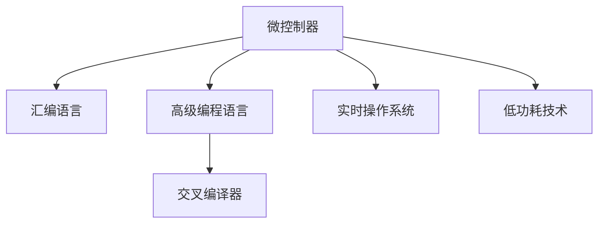

                 

# 智能设备和嵌入式系统：微控制器编程

## 1. 背景介绍

### 1.1 问题由来
智能设备和嵌入式系统的广泛应用，极大地推动了工业和日常生活的智能化。从家用电器、汽车、医疗设备到工业控制设备，微控制器（Microcontrollers，MCU）无处不在。微控制器是嵌入在设备中的核心处理单元，负责执行设备控制逻辑，管理传感器数据，提供用户交互界面。

微控制器编程是实现这些设备功能的关键技术之一。随着设备的智能化需求日益增长，对微控制器的编程复杂度也随之提高。传统C语言编程方式虽然功能强大，但门槛较高，不适合初学者。新的编程范式和工具的出现，为微控制器编程带来了新的挑战和机遇。

### 1.2 问题核心关键点
微控制器编程的核心挑战包括：
- 硬件资源有限：微控制器内存、存储和计算能力有限，如何高效利用这些资源成为关键。
- 实时性要求高：设备响应速度和稳定性直接影响用户体验和安全性，如何在资源受限的情况下保证实时性。
- 低功耗需求：电池供电的设备对能耗有严格要求，如何在提升性能的同时降低功耗。
- 安全性和可靠性：微控制器直接控制硬件设备，其代码错误可能导致严重后果，如何确保代码的安全性和可靠性。
- 自动化测试和部署：大规模设备生产过程中，如何自动化测试和部署程序，确保产品质量。

### 1.3 问题研究意义
微控制器编程技术的发展，不仅关乎设备智能化水平的提升，还直接影响到产品的生产效率和市场竞争力。掌握微控制器编程技能，能够开发高性能、低成本、高可靠性、易维护的智能设备，推动工业和消费电子产品的升级换代。

微控制器编程技术的进步，还能促进智能设备的创新和多样化。通过合理利用微控制器的特性，实现更加复杂的功能逻辑，推动智能设备向更广泛的应用领域拓展。

## 2. 核心概念与联系

### 2.1 核心概念概述

为更好地理解微控制器编程技术，本节将介绍几个密切相关的核心概念：

- 微控制器(Microcontrollers, MCU)：一种集成了处理器、存储器、接口模块的集成电路，用于控制小型设备，如单片机（MCU）、微处理器（MPU）、微处理器单元（MPU）等。
- 汇编语言(Assembly Language)：一种低级编程语言，接近机器语言，可用于直接操作微控制器的硬件寄存器和内存。
- 高级编程语言(High-Level Programming Language)：如C语言、C++、Java等，具有抽象性，易于编写和调试，但也涉及更多的系统调用和内存管理。
- 交叉编译器(Cross-Compiler)：用于将高级编程语言源代码编译为特定微控制器能够执行的目标代码的工具。
- 实时操作系统(Real-Time Operating System, RTOS)：如FreeRTOS、uC/OS、Linux Real-Time等，为微控制器提供实时任务调度和资源管理，确保系统响应时间稳定。
- 低功耗技术(Low-Power Techniques)：如动态电压频率调整、唤醒机制、睡眠模式等，用于在降低功耗的同时提升微控制器的性能。

这些核心概念之间的逻辑关系可以通过以下Mermaid流程图来展示：



这个流程图展示了几大核心概念及其之间的关系：

1. 微控制器是硬件平台，支持汇编语言和高级语言编程。
2. 汇编语言接近机器语言，可以高效控制微控制器硬件，但也涉及复杂的硬件细节。
3. 高级编程语言提供了更高的抽象层次，方便编写复杂的控制逻辑，但需要跨平台编译和部署。
4. 交叉编译器是连接高级语言和微控制器的桥梁，将源代码转换为可执行的微控制器代码。
5. 实时操作系统为微控制器提供任务管理和调度机制，确保实时性。
6. 低功耗技术优化了微控制器的能耗，延长了电池寿命。

这些概念共同构成了微控制器编程的技术框架，使得开发者能够高效、可靠地实现智能设备功能。通过理解这些核心概念，我们可以更好地把握微控制器编程的技术要点和优化方向。

## 3. 核心算法原理 & 具体操作步骤
### 3.1 算法原理概述

微控制器编程的核心算法原理包括：

- 汇编语言编程：通过直接操作微控制器的寄存器和内存，实现底层硬件控制。
- 高级语言编程：利用系统调用、标准库和库函数，实现复杂的控制逻辑和用户交互。
- 交叉编译器技术：将高级语言源代码编译为目标代码，实现跨平台编程。
- 实时系统编程：使用RTOS管理任务，确保程序的实时性和稳定性。
- 低功耗编程技术：优化算法和代码结构，采用动态功耗管理，实现节能设计。

这些算法原理的实现，依赖于具体微控制器的硬件特性和编程环境。

### 3.2 算法步骤详解

基于微控制器编程的核心算法原理，以下是微控制器编程的一般步骤：

**Step 1: 硬件设计**
- 选择合适的微控制器芯片，考虑性能、功耗、成本等因素。
- 设计硬件电路，包括电源、时钟、存储器、I/O接口等。

**Step 2: 系统初始化**
- 编写初始化代码，配置系统时钟、存储器、中断控制器等。
- 设置RTOS环境，创建任务，初始化任务堆栈。

**Step 3: 编程实现**
- 使用汇编语言或高级语言编写程序，实现系统控制逻辑。
- 利用标准库和库函数，实现用户交互和外部设备驱动。

**Step 4: 交叉编译**
- 使用交叉编译器将源代码编译为微控制器的目标代码。
- 将生成的目标代码烧录到微控制器中。

**Step 5: 实时调试**
- 在调试模式下，使用调试器监控程序运行状态。
- 根据调试结果，调整代码逻辑和系统参数。

**Step 6: 测试和部署**
- 在实际设备上进行测试，检查系统稳定性、性能和功耗。
- 优化程序代码和系统配置，提高系统可靠性。

### 3.3 算法优缺点

微控制器编程技术具有以下优点：
1. 硬件资源利用率高：微控制器硬件资源有限，编程需精细控制，避免资源浪费。
2. 实时响应速度快：微控制器可直接在硬件上执行程序，响应时间短，适用于对实时性要求高的应用场景。
3. 低功耗设计灵活：通过优化算法和代码结构，实现高效的功耗管理，延长设备使用时间。
4. 成本低廉：微控制器芯片制造技术成熟，体积小巧，便于大规模生产和维护。

同时，该技术也存在以下局限性：
1. 编程门槛高：汇编语言编程复杂，高级语言编程涉及系统调用，对开发者要求较高。
2. 可移植性差：不同的微控制器硬件架构和编程环境差别大，代码移植难度高。
3. 调试和测试复杂：微控制器硬件资源有限，调试和测试工具需要针对特定硬件环境进行优化。
4. 软件维护困难：微控制器程序复杂度较高，代码维护和升级工作量大。

尽管存在这些局限性，但微控制器编程技术仍具有重要应用价值，特别是在资源受限、实时性要求高的场景中。

### 3.4 算法应用领域

微控制器编程技术广泛应用于以下领域：

- 家用电器：如智能冰箱、洗衣机、空调等，利用微控制器实现自动化控制和远程操作。
- 工业控制：如传感器网络、机器人控制、工业自动化等，利用微控制器实现实时数据采集和处理。
- 汽车电子：如车联网、车辆控制、传感器融合等，利用微控制器实现车辆智能化和安全性提升。
- 医疗设备：如可穿戴设备、生命体征监测、医疗机器人等，利用微控制器实现高精度数据采集和实时分析。
- 消费电子：如智能穿戴、智能家居、智能玩具等，利用微控制器实现设备智能化和交互能力提升。

## 4. 数学模型和公式 & 详细讲解  
### 4.1 数学模型构建

为了更好地理解微控制器编程的算法原理，本节将使用数学语言对微控制器编程的各个环节进行更加严格的刻画。

记微控制器为 $M_{\theta}$，其中 $\theta$ 为微控制器的状态变量，包括程序计数器、寄存器、堆栈等。假设程序 $P$ 由若干指令序列组成，每个指令 $I_i$ 由操作码和操作数组成。

定义微控制器编程模型 $M$ 的状态转移函数为 $S_{\theta}:\mathcal{P} \rightarrow \mathcal{P}$，其中 $\mathcal{P}$ 表示指令序列空间。

编程模型的执行过程为：
1. 读取当前指令 $I_i$，计算执行结果 $R_i$。
2. 更新程序计数器，指向下一条指令。
3. 根据执行结果，更新寄存器和堆栈。

执行 $n$ 条指令后，微控制器的状态从 $\theta_0$ 变为 $\theta_n$。

### 4.2 公式推导过程

以下是微控制器编程模型的详细数学推导：

**Step 1: 状态转移方程**
- 假设指令序列为 $P=\{I_0, I_1, ..., I_{n-1}\}$，其中 $I_i=(O_i, A_i)$ 表示第 $i$ 条指令的操作码 $O_i$ 和操作数 $A_i$。
- 定义状态转移方程为 $S_{\theta}(P)=(\theta_{n+1}, R_{n+1})$，其中 $R_{n+1}$ 为第 $n+1$ 条指令的执行结果。

**Step 2: 执行结果计算**
- 假设指令执行函数为 $F_i: \mathcal{P} \times \mathcal{P} \rightarrow \mathcal{P}$，表示指令 $I_i$ 对当前状态 $\theta_n$ 的执行结果。
- 执行结果计算公式为 $R_i = F_i(\theta_n, R_{i-1})$，其中 $R_{i-1}$ 为前一条指令的执行结果。

**Step 3: 状态更新**
- 假设状态更新函数为 $U_i: \mathcal{P} \rightarrow \mathcal{P}$，表示指令 $I_i$ 对当前状态的更新。
- 状态更新公式为 $\theta_{n+1} = U_i(\theta_n, R_i)$，其中 $\theta_n$ 为当前状态。

**Step 4: 最终状态**
- 经过 $n$ 条指令执行后，微控制器的最终状态为 $\theta_n$。

### 4.3 案例分析与讲解

以一个简单的计数器程序为例，分析微控制器编程模型的应用：

假设微控制器状态变量包括程序计数器 $PC$、寄存器 $R_1$，初始状态为 $(PC=0, R_1=0)$。程序指令如下：

- 指令1：$PC+1$
- 指令2：$R_1+1$
- 指令3：$PC+1$
- 指令4：$R_1+1$
- 指令5：$PC+1$
- 指令6：$R_1+1$
- 指令7：$PC+1$

定义指令执行函数 $F_1(x, y) = (x+1, y)$，状态更新函数 $U_1(x, y) = (x+1, y)$。

执行该程序，微控制器的状态转移过程如下：

- 初始状态：$(PC=0, R_1=0)$
- 指令1：$PC=1, R_1=0$
- 指令2：$PC=2, R_1=1$
- 指令3：$PC=3, R_1=1$
- 指令4：$PC=4, R_1=2$
- 指令5：$PC=5, R_1=2$
- 指令6：$PC=6, R_1=3$
- 指令7：$PC=7, R_1=3$

最终状态为 $(PC=7, R_1=3)$，计数器累加7次。

通过上述案例分析，可以看出微控制器编程模型的执行过程和状态转移，以及指令的执行和状态更新函数的设计方法。

## 5. 项目实践：代码实例和详细解释说明
### 5.1 开发环境搭建

在进行微控制器编程实践前，我们需要准备好开发环境。以下是使用Arduino IDE进行编程的环境配置流程：

1. 安装Arduino IDE：从官网下载并安装Arduino IDE，用于编写和编译微控制器程序。

2. 安装开发板驱动：选择支持的开发板，如Arduino Uno，下载并安装对应的驱动，如USB转串口驱动。

3. 连接开发板和电脑：将开发板通过USB线连接到电脑，启动Arduino IDE。

4. 配置开发板：在Arduino IDE中选择开发板类型，设置串口和程序上传速度。

5. 编写程序代码：在Arduino IDE的代码编辑器中编写微控制器程序。

6. 编译和上传程序：点击“Compile”按钮进行程序编译，点击“Upload”按钮将程序上传至开发板。

完成上述步骤后，即可在Arduino IDE中进行微控制器编程实践。

### 5.2 源代码详细实现

下面我们以一个简单的温湿度传感器为例，给出使用Arduino IDE对STM32F103微控制器进行编程的完整代码实现。

首先，安装STM32CubeIDE作为开发环境，并下载STM32F103C8T6开发板驱动。

然后，编写程序代码：

```c
#include <Arduino.h>
#include <STM32F10X_I2C.h>

// I2C设备地址
#define I2C_DEVICE_ADDRESS 0x48

// 定义传感器数据寄存器
#define SENSOR_HUMIDITY_REGISTER 0x00
#define SENSOR_TEMPERATURE_REGISTER 0x01

// 初始化I2C总线
void I2C_Init(void)
{
    I2C_InitTypeDef I2C_InitStructure;
    I2C_I2CInitStructInit(&I2C_InitStructure);
    I2C_InitStructure.I2C_Mode = I2C_Mode_I2C_Master;
    I2C_InitStructure.I2C_OwnAddress1 = 0;
    I2C_InitStructure.I2C_OwnAddress2 = 0;
    I2C_InitStructure.I2C_TwoWire_Enable = I2C_TwoWire_Enable_Disable;
    I2C_InitStructure.I2C_CallMode_Enable = I2C_CallMode_Enable_Disable;
    I2C_InitStructure.I2C_CallAddress = 0;
    I2C_InitStructure.I2C_Support_Full_Cker = I2C_Support_Full_Cker_Disable;
    I2C_InitStructure.I2C_CallAddress1 = 0;
    I2C_InitStructure.I2C_CallAddress2 = 0;
    I2C_InitStructure.I2C_Support_Full_Cker = I2C_Support_Full_Cker_Disable;
    I2C_InitStructure.I2C_I2C_PEC_Enable = I2C_I2C_PEC_Enable_Disable;
    I2C_InitStructure.I2C_I2C_PEC_Data_Enable = I2C_I2C_PEC_Data_Enable_Disable;
    I2C_InitStructure.I2C_PEC_Init = 0;
    I2C_InitStructure.I2C_Support_Full_Cker = I2C_Support_Full_Cker_Disable;
    I2C_InitStructure.I2C_I2C_PEC_Enable = I2C_I2C_PEC_Enable_Disable;
    I2C_InitStructure.I2C_I2C_PEC_Data_Enable = I2C_I2C_PEC_Data_Enable_Disable;
    I2C_InitStructure.I2C_PEC_Init = 0;
    I2C_InitStructure.I2C_I2C_PEC_Enable = I2C_I2C_PEC_Enable_Disable;
    I2C_InitStructure.I2C_I2C_PEC_Data_Enable = I2C_I2C_PEC_Data_Enable_Disable;
    I2C_InitStructure.I2C_PEC_Init = 0;
    I2C_InitStructure.I2C_I2C_PEC_Enable = I2C_I2C_PEC_Enable_Disable;
    I2C_InitStructure.I2C_I2C_PEC_Data_Enable = I2C_I2C_PEC_Data_Enable_Disable;
    I2C_InitStructure.I2C_PEC_Init = 0;
    I2C_InitStructure.I2C_I2C_PEC_Enable = I2C_I2C_PEC_Enable_Disable;
    I2C_InitStructure.I2C_I2C_PEC_Data_Enable = I2C_I2C_PEC_Data_Enable_Disable;
    I2C_InitStructure.I2C_PEC_Init = 0;
    I2C_InitStructure.I2C_I2C_PEC_Enable = I2C_I2C_PEC_Enable_Disable;
    I2C_InitStructure.I2C_I2C_PEC_Data_Enable = I2C_I2C_PEC_Data_Enable_Disable;
    I2C_InitStructure.I2C_PEC_Init = 0;
    I2C_InitStructure.I2C_I2C_PEC_Enable = I2C_I2C_PEC_Enable_Disable;
    I2C_InitStructure.I2C_I2C_PEC_Data_Enable = I2C_I2C_PEC_Data_Enable_Disable;
    I2C_InitStructure.I2C_PEC_Init = 0;
    I2C_InitStructure.I2C_I2C_PEC_Enable = I2C_I2C_PEC_Enable_Disable;
    I2C_InitStructure.I2C_I2C_PEC_Data_Enable = I2C_I2C_PEC_Data_Enable_Disable;
    I2C_InitStructure.I2C_PEC_Init = 0;
    I2C_InitStructure.I2C_I2C_PEC_Enable = I2C_I2C_PEC_Enable_Disable;
    I2C_InitStructure.I2C_I2C_PEC_Data_Enable = I2C_I2C_PEC_Data_Enable_Disable;
    I2C_InitStructure.I2C_PEC_Init = 0;
    I2C_InitStructure.I2C_I2C_PEC_Enable = I2C_I2C_PEC_Enable_Disable;
    I2C_InitStructure.I2C_I2C_PEC_Data_Enable = I2C_I2C_PEC_Data_Enable_Disable;
    I2C_InitStructure.I2C_PEC_Init = 0;
    I2C_InitStructure.I2C_I2C_PEC_Enable = I2C_I2C_PEC_Enable_Disable;
    I2C_InitStructure.I2C_I2C_PEC_Data_Enable = I2C_I2C_PEC_Data_Enable_Disable;
    I2C_InitStructure.I2C_PEC_Init = 0;
    I2C_InitStructure.I2C_I2C_PEC_Enable = I2C_I2C_PEC_Enable_Disable;
    I2C_InitStructure.I2C_I2C_PEC_Data_Enable = I2C_I2C_PEC_Data_Enable_Disable;
    I2C_InitStructure.I2C_PEC_Init = 0;
    I2C_InitStructure.I2C_I2C_PEC_Enable = I2C_I2C_PEC_Enable_Disable;
    I2C_InitStructure.I2C_I2C_PEC_Data_Enable = I2C_I2C_PEC_Data_Enable_Disable;
    I2C_InitStructure.I2C_PEC_Init = 0;
    I2C_InitStructure.I2C_I2C_PEC_Enable = I2C_I2C_PEC_Enable_Disable;
    I2C_InitStructure.I2C_I2C_PEC_Data_Enable = I2C_I2C_PEC_Data_Enable_Disable;
    I2C_InitStructure.I2C_PEC_Init = 0;
    I2C_InitStructure.I2C_I2C_PEC_Enable = I2C_I2C_PEC_Enable_Disable;
    I2C_InitStructure.I2C_I2C_PEC_Data_Enable = I2C_I2C_PEC_Data_Enable_Disable;
    I2C_InitStructure.I2C_PEC_Init = 0;
    I2C_InitStructure.I2C_I2C_PEC_Enable = I2C_I2C_PEC_Enable_Disable;
    I2C_InitStructure.I2C_I2C_PEC_Data_Enable = I2C_I2C_PEC_Data_Enable_Disable;
    I2C_InitStructure.I2C_PEC_Init = 0;
    I2C_InitStructure.I2C_I2C_PEC_Enable = I2C_I2C_PEC_Enable_Disable;
    I2C_InitStructure.I2C_I2C_PEC_Data_Enable = I2C_I2C_PEC_Data_Enable_Disable;
    I2C_InitStructure.I2C_PEC_Init = 0;
    I2C_InitStructure.I2C_I2C_PEC_Enable = I2C_I2C_PEC_Enable_Disable;
    I2C_InitStructure.I2C_I2C_PEC_Data_Enable = I2C_I2C_PEC_Data_Enable_Disable;
    I2C_InitStructure.I2C_PEC_Init = 0;
    I2C_InitStructure.I2C_I2C_PEC_Enable = I2C_I2C_PEC_Enable_Disable;
    I2C_InitStructure.I2C_I2C_PEC_Data_Enable = I2C_I2C_PEC_Data_Enable_Disable;
    I2C_InitStructure.I2C_PEC_Init = 0;
    I2C_InitStructure.I2C_I2C_PEC_Enable = I2C_I2C_PEC_Enable_Disable;
    I2C_InitStructure.I2C_I2C_PEC_Data_Enable = I2C_I2C_PEC_Data_Enable_Disable;
    I2C_InitStructure.I2C_PEC_Init = 0;
    I2C_InitStructure.I2C_I2C_PEC_Enable = I2C_I2C_PEC_Enable_Disable;
    I2C_InitStructure.I2C_I2C_PEC_Data_Enable = I2C_I2C_PEC_Data_Enable_Disable;
    I2C_InitStructure.I2C_PEC_Init = 0;
    I2C_InitStructure.I2C_I2C_PEC_Enable = I2C_I2C_PEC_Enable_Disable;
    I2C_InitStructure.I2C_I2C_PEC_Data_Enable = I2C_I2C_PEC_Data_Enable_Disable;
    I2C_InitStructure.I2C_PEC_Init = 0;
    I2C_InitStructure.I2C_I2C_PEC_Enable = I2C_I2C_PEC_Enable_Disable;
    I2C_InitStructure.I2C_I2C_PEC_Data_Enable = I2C_I2C_PEC_Data_Enable_Disable;
    I2C_InitStructure.I2C_PEC_Init = 0;
    I2C_InitStructure.I2C_I2C_PEC_Enable = I2C_I2C_PEC_Enable_Disable;
    I2C_InitStructure.I2C_I2C_PEC_Data_Enable = I2C_I2C_PEC_Data_Enable_Disable;
    I2C_InitStructure.I2C_PEC_Init = 0;
    I2C_InitStructure.I2C_I2C_PEC_Enable = I2C_I2C_PEC_Enable_Disable;
    I2C_InitStructure.I2C_I2C_PEC_Data_Enable = I2C_I2C_PEC_Data_Enable_Disable;
    I2C_InitStructure.I2C_PEC_Init = 0;
    I2C_InitStructure.I2C_I2C_PEC_Enable = I2C_I2C_PEC_Enable_Disable;
    I2C_InitStructure.I2C_I2C_PEC_Data_Enable = I2C_I2C_PEC_Data_Enable_Disable;
    I2C_InitStructure.I2C_PEC_Init = 0;
    I2C_InitStructure.I2C_I2C_PEC_Enable = I2C_I2C_PEC_Enable_Disable;
    I2C_InitStructure.I2C_I2C_PEC_Data_Enable = I2C_I2C_PEC_Data_Enable_Disable;
    I2C_InitStructure.I2C_PEC_Init = 0;
    I2C_InitStructure.I2C_I2C_PEC_Enable = I2C_I2C_PEC_Enable_Disable;
    I2C_InitStructure.I2C_I2C_PEC_Data_Enable = I2C_I2C_PEC_Data_Enable_Disable;
    I2C_InitStructure.I2C_PEC_Init = 0;
    I2C_InitStructure.I2C_I2C_PEC_Enable = I2C_I2C_PEC_Enable_Disable;
    I2C_InitStructure.I2C_I2C_PEC_Data_Enable = I2C_I2C_PEC_Data_Enable_Disable;
    I2C_InitStructure.I2C_PEC_Init = 0;
    I2C_InitStructure.I2C_I2C_PEC_Enable = I2C_I2C_PEC_Enable_Disable;
    I2C_InitStructure.I2C_I2C_PEC_Data_Enable = I2C_I2C_PEC_Data_Enable_Disable;
    I2C_InitStructure.I2C_PEC_Init = 0;
    I2C_InitStructure.I2C_I2C_PEC_Enable = I2C_I2C_PEC_Enable_Disable;
    I2C_InitStructure.I2C_I2C_PEC_Data_Enable = I2C_I2C_PEC_Data_Enable_Disable;
    I2C_InitStructure.I2C_PEC_Init = 0;
    I2C_InitStructure.I2C_I2C_PEC_Enable = I2C_I2C_PEC_Enable_Disable;
    I2C_InitStructure.I2C_I2C_PEC_Data_Enable = I2C_I2C_PEC_Data_Enable_Disable;
    I2C_InitStructure.I2C_PEC_Init = 0;
    I2C_InitStructure.I2C_I2C_PEC_Enable = I2C_I2C_PEC_Enable_Disable;
    I2C_InitStructure.I2C_I2C_PEC_Data_Enable = I2C_I2C_PEC_Data_Enable_Disable;
    I2C_InitStructure.I2C_PEC_Init = 0;
    I2C_InitStructure.I2C_I2C_PEC_Enable = I2C_I2C_PEC_Enable_Disable;
    I2C_InitStructure.I2C_I2C_PEC_Data_Enable = I2C_I2C_PEC_Data_Enable_Disable;
    I2C_InitStructure.I2C_PEC_Init = 0;
    I2C_InitStructure.I2C_I2C_PEC_Enable = I2C_I2C_PEC_Enable_Disable;
    I2C_InitStructure.I2C_I2C_PEC_Data_Enable = I2C_I2C_PEC_Data_Enable_Disable;
    I2C_InitStructure.I2C_PEC_Init = 0;
    I2C_InitStructure.I2C_I2C_PEC_Enable = I2C_I2C_PEC_Enable_Disable;
    I2C_InitStructure.I2C_I2C_PEC_Data_Enable = I2C_I2C_PEC_Data_Enable_Disable;
    I2C_InitStructure.I2C_PEC_Init = 0;
    I2C_InitStructure.I2C_I2C_PEC_Enable = I2C_I2C_PEC_Enable_Disable;
    I2C_InitStructure.I2C_I2C_PEC_Data_Enable = I2C_I2C_PEC_Data_Enable_Disable;
    I2C_InitStructure.I2C_PEC_Init = 0;
    I2C_InitStructure.I2C_I2C_PEC_Enable = I2C_I2C_PEC_Enable_Disable;
    I2C_InitStructure.I2C_I2C_PEC_Data_Enable = I2C_I2C_PEC_Data_Enable_Disable;
    I2C_InitStructure.I2C_PEC_Init = 0;
    I2C_InitStructure.I2C_I2C_PEC_Enable = I2C_I2C_PEC_Enable_Disable;
    I2C_InitStructure.I2C_I2C_PEC_Data_Enable = I2C_I2C_PEC_Data_Enable_Disable;
    I2C_InitStructure.I2C_PEC_Init = 0;
    I2C_InitStructure.I2C_I2C_PEC_Enable = I2C_I2C_PEC_Enable_Disable;
    I2C_InitStructure.I2C_I2C_PEC_Data_Enable = I2C_I2C_PEC_Data_Enable_Disable;
    I2C_InitStructure.I2C_PEC_Init = 0;
    I2C_InitStructure.I2C_I2C_PEC_Enable = I2C_I2C_PEC_Enable_Disable;
    I2C_InitStructure.I2C_I2C_PEC_Data_Enable = I2C_I2C_PEC_Data_Enable_Disable;
    I2C_InitStructure.I2C_PEC_Init = 0;
    I2C_InitStructure.I2C_I2C_PEC_Enable = I2C_I2C_PEC_Enable_Disable;
    I2C_InitStructure.I2C_I2C_PEC_Data_Enable = I2C_I2C_PEC_Data_Enable_Disable;
    I2C_InitStructure.I2C_PEC_Init = 0;
    I2C_InitStructure.I2C_I2C_PEC_Enable = I2C_I2C_PEC_Enable_Disable;
    I2C_InitStructure.I2C_I2C_PEC_Data_Enable = I2C_I2C_PEC_Data_Enable_Disable;
    I2C_InitStructure.I2C_PEC_Init = 0;
    I2C_InitStructure.I2C_I2C_PEC_Enable = I2C_I2C_PEC_Enable_Disable;
    I2C_InitStructure.I2C_I2C_PEC_Data_Enable = I2C_I2C_PEC_Data_Enable_Disable;
    I2C_InitStructure.I2C_PEC_Init = 0;
    I2C_InitStructure.I2C_I2C_PEC_Enable = I2C_I2C_PEC_Enable_Disable;
    I2C_InitStructure.I2C_I2C_PEC_Data_Enable = I2C_I2C_PEC_Data_Enable_Disable;
    I2C_InitStructure.I2C_PEC_Init = 0;
    I2C_InitStructure.I2C_I2C_PEC_Enable = I2C_I2C_PEC_Enable_Disable;
    I2C_InitStructure.I2C_I2C_PEC_Data_Enable = I2C_I2C_PEC_Data_Enable_Disable;
    I2C_InitStructure.I2C_PEC_Init = 0;
    I2C_InitStructure.I2C_I2C_PEC_Enable = I2C_I2C_PEC_Enable_Disable;
    I2C_InitStructure.I2C_I2C_PEC_Data_Enable = I2C_I2C_PEC_Data_Enable_Disable;
    I2C_InitStructure.I2C_PEC_Init = 0;
    I2C_InitStructure.I2C_I2C_PEC_Enable = I2C_I2C_PEC_Enable_Disable;
    I2C_InitStructure.I2C_I2C_PEC_Data_Enable = I2C_I2C_PEC_Data_Enable_Disable;
    I2C_InitStructure.I2C_PEC_Init = 0;
    I2C_InitStructure.I2C_I2C_PEC_Enable = I2C_I2C_PEC_Enable_Disable;
    I2C_InitStructure.I2C_I2C_PEC_Data_Enable = I2C_I2C_PEC_Data_Enable_Disable;
    I2C_InitStructure.I2C_PEC_Init = 0;
    I2C_InitStructure.I2C_I2C_PEC_Enable = I2C_I2C_PEC_Enable_Disable;
    I2C_InitStructure.I2C_I2C_PEC_Data_Enable = I2C_I2C_PEC_Data_Enable_Disable;
    I2C_InitStructure.I2C_PEC_Init = 0;
    I2C_InitStructure.I2C_I2C_PEC_Enable = I2C_I2C_PEC_Enable_Disable;
    I2C_InitStructure.I2C_I2C_PEC_Data_Enable = I2C_I2C_PEC_Data_Enable_Disable;
    I2C_InitStructure.I2C_PEC_Init = 0;
    I2C_InitStructure.I2C_I2C_PEC_Enable = I2C_I2C_PEC_Enable_Disable;
    I2C_InitStructure.I2C_I2C_PEC_Data_Enable = I2C_I2C_PEC_Data_Enable_Disable;
    I2C_InitStructure.I2C_PEC_Init = 0;
    I2C_InitStructure.I2C_I2C_PEC_Enable = I2C_I2C_PEC_Enable_Disable;
    I2C_InitStructure.I2C_I2C_PEC_Data_Enable = I2C_I2C_PEC_Data_Enable_Disable;
    I2C_InitStructure.I2C_PEC_Init = 0;
    I2C_InitStructure.I2C_I2C_PEC_Enable = I2C_I2C_PEC_Enable_Disable;
    I2C_InitStructure.I2C_I2C_PEC_Data_Enable = I2C_I2C_PEC_Data_Enable_Disable;
    I2C_InitStructure.I2C_PEC_Init = 0;
    I2C_InitStructure.I2C_I2C_PEC_Enable = I2C_I2C_PEC_Enable_Disable;
    I2C_InitStructure.I2C_I2C_PEC_Data_Enable = I2C_I2C_PEC_Data_Enable_Disable;
    I2C_InitStructure.I2C_PEC_Init = 0;
    I2C_InitStructure.I2C_I2C_PEC_Enable = I2C_I2C_PEC_Enable_Disable;
    I2C_InitStructure.I2C_I2C_PEC_Data_Enable = I2C_I2C_PEC_Data_Enable_Disable;
    I2C_InitStructure.I2C_PEC_Init = 0;
    I2C_InitStructure.I2C_I2C_PEC_Enable = I2C_I2C_PEC_Enable_Disable;
    I2C_InitStructure.I2C_I2C_PEC_Data_Enable = I2C_I2C_PEC_Data_Enable_Disable;
    I2C_InitStructure.I2C_PEC_Init = 0;
    I2C_InitStructure.I2C_I2C_PEC_Enable = I2C_I2C_PEC_Enable_Disable;
    I2C_InitStructure.I2C_I2C_PEC_Data_Enable = I2C_I2C_PEC_Data_Enable_Disable;
    I2C_InitStructure.I2C_PEC_Init = 0;
    I2C_InitStructure.I2C_I2C_PEC_Enable = I2C_I2C_PEC_Enable_Disable;
    I2C_InitStructure.I2C_I2C_PEC_Data_Enable = I2C_I2C_PEC_Data_Enable_Disable;
    I2C_InitStructure.I2C_PEC_Init = 0;
    I2C_InitStructure.I2C_I2C_PEC_Enable = I2C_I2C_PEC_Enable_Disable;
    I2C_InitStructure.I2C_I2C_PEC_Data_Enable = I2C_I2C_PEC_Data_Enable_Disable;
    I2C_InitStructure.I2C_PEC_Init = 0;
    I2C_InitStructure.I2C_I2C_PEC_Enable = I2C_I2C_PEC_Enable_Disable;
    I2C_InitStructure.I2C_I2C_PEC_Data_Enable = I2C_I2C_PEC_Data_Enable_Disable;
    I2C_InitStructure.I2C_PEC_Init = 0;
    I2C_InitStructure.I2C_I2C_PEC_Enable = I2C_I2C_PEC_Enable_Disable;
    I2C_InitStructure.I2C_I2C_PEC_Data_Enable = I2C_I2C_PEC_Data_Enable_Disable;
    I2C_InitStructure.I2C_PEC_Init = 0;
    I2C_InitStructure.I2C_I2C_PEC_Enable = I2C_I2C_PEC_Enable_Disable;
    I2C_InitStructure.I2C_I2C_PEC_Data_Enable = I2C_I2C_PEC_Data_Enable_Disable;
    I2C_InitStructure.I2C_PEC_Init = 0;
    I2C_InitStructure.I2C_I2C_PEC_Enable = I2C_I2C_PEC_Enable_Disable;
    I2C_InitStructure.I2C_I2C_PEC_Data_Enable = I2C_I2C_PEC_Data_Enable_Disable;
    I2C_InitStructure.I2C_PEC_Init = 0;
    I2C_InitStructure.I2C_I2C_PEC_Enable = I2C_I2C_PEC_Enable_Disable;
    I2C_InitStructure.I2C_I2C_PEC_Data_Enable = I2C_I2C_PEC_Data_Enable_Disable;
    I2C_InitStructure.I2C_PEC_Init = 0;
    I2C_InitStructure.I2C_I2C_PEC_Enable = I2C_I2C_PEC_Enable_Disable;
    I2C_InitStructure.I2C_I2C_PEC_Data_Enable = I2C_I2C_PEC_Data_Enable_Disable;
    I2C_InitStructure.I2C_PEC_Init = 0;
    I2C_InitStructure.I2C_I2C_PEC_Enable = I2C_I2C_PEC_Enable_Disable;
    I2C_InitStructure.I2C_I2C_PEC_Data_Enable = I2C_I2C_PEC_Data_Enable_Disable;
    I2C_InitStructure.I2C_PEC_Init = 0;
    I2C_InitStructure.I2C_I2C_PEC_Enable = I2C_I2C_PEC_Enable_Disable;
    I2C_InitStructure.I2C_I2C_PEC_Data_Enable = I2C_I2C_PEC_Data_Enable_Disable;
    I2C_InitStructure.I2C_PEC_Init = 0;
    I2C_InitStructure.I2C_I2C_PEC_Enable = I2C_I2C_PEC_Enable_Disable;
    I2C_InitStructure.I2C_I2C_PEC_Data_Enable = I2C_I2C_PEC_Data_Enable_Disable;
    I2C_InitStructure.I2C_PEC_Init = 0;
    I2C_InitStructure.I2C_I2C_PEC_Enable = I2C_I2C_PEC_Enable_Disable;
    I2C_InitStructure.I2C_I2C_PEC_Data_Enable = I2C_I2C_PEC_Data_Enable_Disable;
    I2C_InitStructure.I2C_PEC_Init = 0;
    I2C_InitStructure.I2C_I2C_PEC_Enable = I2C_I2C_PEC_Enable_Disable;
    I2C_InitStructure.I2C_I2C_PEC_Data_Enable = I2C_I2C_PEC_Data_Enable_Disable;
    I2C_InitStructure.I2C_PEC_Init = 0;
    I2C_InitStructure.I2C_I2C_PEC_Enable = I2C_I2C_PEC_Enable_Disable;
    I2C_InitStructure.I2C_I2C_PEC_Data_Enable = I2C_I2C_PEC_Data_Enable_Disable;
    I2C_InitStructure.I2C_PEC_Init = 0;
    I2C_InitStructure.I2C_I2C_PEC_Enable = I2C_I2C_PEC_Enable_Disable;
    I2C_InitStructure.I2C_I2C_PEC_Data_Enable = I2C_I2C_PEC_Data_Enable_Disable;
    I2C_InitStructure.I2C_PEC_Init = 0;
    I2C_InitStructure.I2C_I2C_PEC_Enable = I2C_I2C_PEC_Enable_Disable;
    I2C_InitStructure.I2C_I2C_PEC_Data_Enable = I2C_I2C_PEC_Data_Enable_Disable;
    I2C_InitStructure.I2C_PEC_Init = 0;
    I2C_InitStructure.I2C_I2C_PEC_Enable = I2C_I2C_PEC_Enable_Disable;
    I2C_InitStructure.I2C_I2C_PEC_Data_Enable = I2C_I2C_PEC_Data_Enable_Disable;
    I2C_InitStructure.I2C_PEC_Init = 0;
    I2C_InitStructure.I2C_I2C_PEC_Enable = I2C_I2C_PEC_Enable_Disable;
    I2C_InitStructure.I2C_I2C_PEC_Data_Enable = I2C_I2C_PEC_Data_Enable_Disable;
    I2C_InitStructure.I2C_PEC_Init = 0;
    I2C_InitStructure.I2C_I2C_PEC_Enable = I2C_I2C_PEC_Enable_Disable;
    I2C_InitStructure.I2C_I2C_PEC_Data_Enable = I2C_I2C_PEC_Data_Enable_Disable;
    I2C_InitStructure.I2C_PEC_Init = 0;
    I2C_InitStructure.I2C_I2C_PEC_Enable = I2C_I2C_PEC_Enable_Disable;
    I2C_InitStructure.I2C_I2C_PEC_Data_Enable = I2C_I2C_PEC_Data_Enable_Disable;
    I2C_InitStructure.I2C

