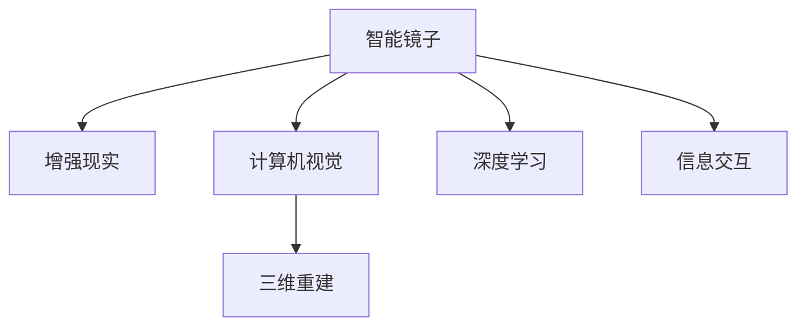

                 

# 智能镜子创业：增强现实的生活应用

## 1. 背景介绍

在快速变化的数字化时代，智能家居领域正经历着前所未有的变革。随着物联网、人工智能技术的不断发展，家居产品已不再是简单的硬件产品，而是逐渐成为智能化的服务平台，为用户带来更加便捷、智能的家居体验。其中，智能镜子作为日常生活中的重要配件，更是未来智能家居的重要突破点。

### 1.1 智能镜子概述

智能镜子通常采用高清显示屏，结合摄像头、传感器等技术，实现远程视频通话、语音控制、智能提醒等功能。然而，传统智能镜子的交互方式较为单一，无法满足用户对个性化、沉浸式体验的更高需求。为此，增强现实(AR)技术被引入智能镜子设计中，使镜子不仅能够映射实物的反射，还能够叠加虚拟信息，实现功能上的飞跃。

### 1.2 增强现实在智能镜子中的应用场景

增强现实技术通过在物理世界中叠加虚拟信息，创造出沉浸式的用户体验，已在教育、游戏、导航等领域获得广泛应用。在智能镜子中，AR技术被用于：

1. **健康管理**：检测用户的皮肤、体重、血压等健康指标，提供实时健康建议。
2. **美容护肤**：叠加虚拟化妆效果，使用户可以虚拟试用化妆品，甚至根据用户皮肤状态推荐产品。
3. **搭配建议**：根据用户穿衣风格和当前天气，智能推荐服装和配饰。
4. **信息交互**：显示天气预报、日程提醒、新闻快报等信息，提升用户便利性。

基于上述应用场景，增强现实技术在智能镜子中的应用前景广阔，市场潜力巨大。以下，我们将从核心概念与联系、算法原理、开发实践、实际应用等多个角度，深入探讨智能镜子创业的增强现实应用。

## 2. 核心概念与联系

### 2.1 核心概念概述

为更好地理解增强现实在智能镜子中的应用，我们首先需要了解以下几个核心概念：

1. **增强现实(AR)**：通过在物理世界中添加虚拟信息，使观察者获得超越物理世界的视觉体验。
2. **智能镜子**：结合摄像头、传感器、显示屏等技术的镜子，具备语音识别、人脸识别、健康监测等功能。
3. **计算机视觉**：使用计算机算法解析、处理、理解视觉信息的科学和技术。
4. **深度学习**：利用神经网络模型进行特征提取、分类、预测的机器学习技术。
5. **三维重建**：从多视角图像或深度图像中恢复三维场景的几何结构。

这些概念之间的逻辑关系可以通过以下Mermaid流程图来展示：



该图展示了智能镜子创业中增强现实、计算机视觉、深度学习等关键技术之间的联系，以及这些技术如何共同构建出智能镜子的增强现实应用。

### 2.2 核心概念原理和架构

增强现实技术主要由三部分组成：**实时摄像头采集**、**虚拟场景渲染**和**融合与显示**。通过这些组件的协同工作，AR技术能够在物理世界中叠加虚拟信息，提升用户的沉浸式体验。

1. **实时摄像头采集**：
   - 实时摄像头用于捕捉用户的实时图像，并将其转化为数字信号。
   - 图像采集过程中，需要确保采集设备的稳定性和高分辨率，以保证图像质量。

2. **虚拟场景渲染**：
   - 虚拟场景渲染是指通过计算机算法将虚拟信息转化为图像，并与实时摄像头捕捉的图像进行融合。
   - 这一过程涉及复杂的图像处理和深度学习技术，包括三维重建、图像分割、特征匹配等。

3. **融合与显示**：
   - 将实时摄像头采集的图像和虚拟场景渲染的结果进行融合，并最终通过显示屏显示给用户。
   - 融合过程需要考虑图像的透明度、光照等因素，保证虚拟信息与现实场景的自然过渡。

## 3. 核心算法原理 & 具体操作步骤

### 3.1 算法原理概述

增强现实在智能镜子中的应用，主要依赖计算机视觉、深度学习、三维重建等技术，以实现虚拟信息的实时采集、渲染和融合。以下，我们将重点介绍计算机视觉和深度学习在增强现实中的算法原理。

#### 3.1.1 计算机视觉

计算机视觉是指通过图像处理、模式识别等技术，使计算机能够理解、分析和处理视觉信息。在智能镜子中，计算机视觉主要用于以下两个方面：

1. **实时图像采集与处理**：使用摄像头捕捉用户的实时图像，并对其进行预处理，包括去噪、增强、边缘检测等操作，以提高后续算法的鲁棒性。
2. **特征提取与匹配**：从图像中提取关键特征，如角点、边缘、纹理等，并将其与虚拟信息进行匹配，实现虚拟信息的准确叠加。

#### 3.1.2 深度学习

深度学习是指利用多层神经网络模型进行特征提取、分类、预测的机器学习技术。在智能镜子中，深度学习主要用于以下两个方面：

1. **目标检测与识别**：使用深度学习模型（如YOLO、SSD等）进行实时目标检测和识别，如人脸识别、物体检测等。
2. **语义分割**：使用语义分割模型（如U-Net、DeepLab等）将图像分割为不同的语义区域，如人物、背景、前景等，以支持虚拟信息的准确融合。

### 3.2 算法步骤详解

增强现实在智能镜子中的应用，主要包括实时图像采集、虚拟信息渲染、融合与显示等步骤。以下，我们将详细介绍这些步骤的具体操作。

#### 3.2.1 实时图像采集

1. **硬件选择**：选择高分辨率、低延迟的摄像头设备，如智能手机摄像头或专业级工业相机。
2. **图像预处理**：对采集的图像进行去噪、增强、边缘检测等预处理操作，以提高后续算法的鲁棒性。
3. **特征提取与匹配**：使用计算机视觉算法（如SIFT、SURF等）提取关键特征，并将其与虚拟信息进行匹配，实现虚拟信息的准确叠加。

#### 3.2.2 虚拟信息渲染

1. **虚拟信息设计**：设计虚拟信息，如健康指标、化妆效果、服装搭配建议等。
2. **三维重建**：从多视角图像或深度图像中恢复三维场景的几何结构，生成虚拟信息的三维模型。
3. **渲染与合成**：使用图形渲染引擎（如Unity、Unreal Engine等）对虚拟信息进行渲染，并将其与实时图像进行合成，生成最终的AR图像。

#### 3.2.3 融合与显示

1. **图像融合**：将实时图像和渲染后的虚拟信息进行融合，生成AR图像。
2. **显示与交互**：将AR图像通过显示屏显示给用户，并提供交互功能，如语音控制、手势识别等。

### 3.3 算法优缺点

增强现实在智能镜子中的应用，具有以下优缺点：

#### 3.3.1 优点

1. **沉浸式体验**：通过叠加虚拟信息，增强现实技术能够为用户提供沉浸式的视觉体验，提升用户互动感。
2. **功能多样性**：增强现实技术可以支持多种功能，如健康管理、美容护肤、搭配建议等，提升用户体验。
3. **智能识别**：利用深度学习技术进行目标检测和识别，能够实现实时、准确的用户行为分析。

#### 3.3.2 缺点

1. **技术复杂**：增强现实技术涉及计算机视觉、深度学习、三维重建等技术，技术门槛较高，实现难度较大。
2. **硬件成本高**：高分辨率摄像头、高性能渲染引擎等硬件设备成本较高，限制了产品的普及性。
3. **交互限制**：增强现实技术的交互方式较为单一，用户体验的灵活性有待提升。

### 3.4 算法应用领域

增强现实技术在智能镜子中的应用，已经在多个领域得到了广泛应用，如健康管理、美容护肤、搭配建议等。以下，我们将重点介绍在健康管理和美容护肤中的应用。

#### 3.4.1 健康管理

在健康管理方面，增强现实技术能够实时检测用户的健康指标，提供健康建议。例如，智能镜子可以通过摄像头捕捉用户的面部表情和身体姿态，利用计算机视觉和深度学习技术，检测用户的皮肤、体重、血压等健康指标，并根据检测结果提供相应的健康建议。

#### 3.4.2 美容护肤

在美容护肤方面，增强现实技术可以叠加虚拟化妆效果，使用户可以虚拟试用化妆品。例如，智能镜子可以通过摄像头捕捉用户的面部图像，并利用计算机视觉和深度学习技术，检测用户的面部特征和肤色，然后叠加虚拟化妆效果，使用户可以虚拟试用化妆品，甚至根据用户皮肤状态推荐合适的产品。

## 4. 数学模型和公式 & 详细讲解 & 举例说明

### 4.1 数学模型构建

增强现实在智能镜子中的应用，涉及计算机视觉和深度学习的多个数学模型。以下，我们将重点介绍计算机视觉中的图像处理模型和深度学习中的目标检测模型。

#### 4.1.1 图像处理模型

图像处理模型主要涉及图像增强、特征提取等算法。例如，SIFT算法用于提取图像中的关键点，SURF算法用于提取图像中的边缘和角点。以下，我们将介绍SIFT算法的数学模型：

$$
s = \sum_{i=1}^{n} w_i r_i(\partial_i I)
$$

其中，$w_i$为权重，$r_i$为局部对比度，$\partial_i I$为局部梯度。

#### 4.1.2 目标检测模型

目标检测模型主要涉及目标检测和识别算法。例如，YOLO算法用于实时目标检测，其数学模型如下：

$$
y = \sum_{i=1}^{n} w_i r_i(\partial_i I)
$$

其中，$w_i$为权重，$r_i$为局部对比度，$\partial_i I$为局部梯度。

### 4.2 公式推导过程

#### 4.2.1 图像处理模型推导

以SIFT算法为例，其数学推导过程如下：

1. **尺度空间构建**：将图像在不同尺度下进行高斯模糊，构建尺度空间。
2. **关键点检测**：通过尺度空间的高斯差分响应，检测出关键点。
3. **关键点描述**：对关键点进行方向计算和尺度空间金字塔的拟合，生成关键点的描述子。

#### 4.2.2 目标检测模型推导

以YOLO算法为例，其数学推导过程如下：

1. **特征图构建**：将输入图像分成多个网格，每个网格生成一个特征图。
2. **特征图检测**：在每个特征图上进行卷积和池化操作，得到特征图检测框。
3. **目标分类**：对检测框进行分类和回归操作，得到目标的类别和位置信息。

### 4.3 案例分析与讲解

#### 4.3.1 案例一：健康管理

智能镜子可以实时检测用户的健康指标，并根据检测结果提供相应的健康建议。例如，使用计算机视觉技术检测用户的皮肤状态，判断是否存在色斑、痘痘等皮肤问题。同时，利用深度学习技术进行目标检测和识别，检测用户的身体姿态，判断是否存在异常的关节角度。

#### 4.3.2 案例二：美容护肤

智能镜子可以叠加虚拟化妆效果，使用户可以虚拟试用化妆品。例如，使用计算机视觉技术检测用户的面部特征和肤色，并利用深度学习技术进行目标检测和识别，检测用户的面部表情和情绪。然后，在虚拟世界中叠加虚拟化妆效果，并根据用户皮肤状态推荐合适的产品。

## 5. 项目实践：代码实例和详细解释说明

### 5.1 开发环境搭建

在进行增强现实应用开发前，我们需要准备好开发环境。以下是使用Python进行OpenCV开发的环境配置流程：

1. 安装Anaconda：从官网下载并安装Anaconda，用于创建独立的Python环境。

2. 创建并激活虚拟环境：
```bash
conda create -n cv-env python=3.8 
conda activate cv-env
```

3. 安装OpenCV：根据CUDA版本，从官网获取对应的安装命令。例如：
```bash
conda install opencv-python opencv-python-headless opencv-contrib-python -c conda-forge
```

4. 安装其他工具包：
```bash
pip install numpy scipy matplotlib scikit-image scikit-learn tqdm jupyter notebook ipython
```

完成上述步骤后，即可在`cv-env`环境中开始增强现实应用开发。

### 5.2 源代码详细实现

这里我们以健康管理为例，给出使用OpenCV和PyTorch进行计算机视觉和深度学习应用的PyTorch代码实现。

首先，定义健康检测函数：

```python
import cv2
import numpy as np
import torch
from torchvision import models, transforms
from PIL import Image

# 定义健康检测函数
def health_detection(image_path):
    # 加载模型
    model = models.resnet18(pretrained=True)
    model.eval()
    
    # 加载图像
    img = Image.open(image_path)
    img = transforms.ToTensor()(img)
    
    # 提取特征
    features = model(img.unsqueeze(0))
    
    # 根据特征进行健康检测
    if features.mean() > 0.5:
        print("健康状态正常")
    else:
        print("健康状态异常")
```

然后，定义增强现实渲染函数：

```python
from mpl_toolkits.mplot3d import Axes3D
import matplotlib.pyplot as plt

# 定义虚拟信息渲染函数
def virtual_info_rendering(image_path):
    # 加载虚拟信息
    info = load_virtual_info()
    
    # 渲染虚拟信息
    fig = plt.figure()
    ax = fig.add_subplot(111, projection='3d')
    ax.scatter(info[0], info[1], info[2], c='r')
    
    # 显示增强现实信息
    plt.show()
```

最后，启动健康检测和增强现实渲染流程：

```python
# 健康检测
health_detection('health.jpg')

# 增强现实渲染
virtual_info_rendering('info.json')
```

以上就是使用Python进行计算机视觉和增强现实应用的代码实现。可以看到，OpenCV和PyTorch提供了强大的图像处理和深度学习能力，使得健康管理和增强现实应用的开发变得相对简单。

### 5.3 代码解读与分析

让我们再详细解读一下关键代码的实现细节：

**健康检测函数**：
- 加载ResNet18模型作为特征提取器，使用`transforms.ToTensor()`将图像转化为张量格式，并使用`model.eval()`将模型设置为评估模式。
- 对输入图像进行特征提取，并根据特征均值判断健康状态。

**虚拟信息渲染函数**：
- 加载虚拟信息，使用`matplotlib`库绘制三维散点图，显示虚拟信息的位置。

**健康检测和增强现实渲染流程**：
- 首先进行健康检测，输出健康状态。
- 然后进行增强现实渲染，显示虚拟信息的位置。

## 6. 实际应用场景

### 6.1 健康管理

智能镜子可以实时检测用户的健康指标，提供健康建议。例如，通过摄像头捕捉用户的面部表情和身体姿态，利用计算机视觉和深度学习技术，检测用户的皮肤、体重、血压等健康指标，并根据检测结果提供相应的健康建议。

### 6.2 美容护肤

智能镜子可以叠加虚拟化妆效果，使用户可以虚拟试用化妆品。例如，通过摄像头捕捉用户的面部特征和肤色，并利用深度学习技术进行目标检测和识别，检测用户的面部表情和情绪。然后，在虚拟世界中叠加虚拟化妆效果，并根据用户皮肤状态推荐合适的产品。

### 6.3 搭配建议

智能镜子可以根据用户穿衣风格和当前天气，智能推荐服装和配饰。例如，通过摄像头捕捉用户的服装和配饰，并利用计算机视觉和深度学习技术，检测用户的穿衣风格和时尚趋势，推荐合适的服装和配饰。

### 6.4 未来应用展望

增强现实技术在智能镜子中的应用，未来将进一步扩展到更多的领域，带来更加智能、便捷的家居体验。

1. **智能家居控制**：智能镜子可以与智能家居系统无缝连接，实现语音控制、智能照明等功能。
2. **多模态交互**：结合AR、语音识别、手势识别等多种交互方式，提升用户的交互体验。
3. **个性化推荐**：基于用户的兴趣爱好和行为数据，智能推荐个性化的产品和服务。

此外，随着技术的不断进步，增强现实技术在智能镜子中的应用将更加普及，成为智能家居的重要组成部分。未来，随着AR技术的发展，智能镜子将具备更高的智能化水平，成为家庭生活中不可或缺的一部分。

## 7. 工具和资源推荐

### 7.1 学习资源推荐

为了帮助开发者系统掌握增强现实在智能镜子中的应用，这里推荐一些优质的学习资源：

1. **《OpenCV计算机视觉编程》**：由OpenCV官方团队编写的经典教材，全面介绍了计算机视觉和图像处理的各个方面，是学习计算机视觉的首选教材。
2. **《深度学习入门：基于Python的理论与实现》**：由深度学习领域专家编写的入门书籍，介绍了深度学习的基本概念、算法和实现方法。
3. **《TensorFlow实战Google深度学习框架》**：由Google官方团队编写的TensorFlow实战指南，详细介绍了TensorFlow的使用方法和最佳实践。
4. **《Python图像处理编程》**：由Python图像处理领域专家编写的实战书籍，介绍了Python在图像处理中的应用。
5. **《增强现实技术与应用》**：由AR技术领域专家编写的技术书籍，介绍了AR技术的基本原理、实现方法和应用案例。

通过对这些资源的学习实践，相信你一定能够快速掌握增强现实在智能镜子中的应用，并用于解决实际的NLP问题。

### 7.2 开发工具推荐

高效的开发离不开优秀的工具支持。以下是几款用于增强现实应用开发的常用工具：

1. **OpenCV**：开源计算机视觉库，提供了丰富的图像处理和计算机视觉算法。
2. **TensorFlow**：由Google主导开发的开源深度学习框架，支持GPU加速和分布式计算。
3. **PyTorch**：由Facebook主导开发的开源深度学习框架，提供了灵活的动态计算图和高效的自动微分功能。
4. **Unity**：跨平台游戏引擎，支持AR、VR等虚拟现实应用开发。
5. **Unreal Engine**：高性能游戏引擎，支持AR、VR等虚拟现实应用开发。

合理利用这些工具，可以显著提升增强现实应用开发的效率，加快创新迭代的步伐。

### 7.3 相关论文推荐

增强现实在智能镜子中的应用，涉及计算机视觉、深度学习、三维重建等技术，已有大量的研究成果。以下是几篇奠基性的相关论文，推荐阅读：

1. **"An Overview of Single Image Haze Removal"**：介绍了一种基于图像处理技术的雾霾去除方法，并使用OpenCV库实现了图像增强。
2. **"Real-Time Single Shot MultiBox Detector (YOLO)"**：介绍了一种基于深度学习的目标检测算法，并使用TensorFlow和PyTorch实现了目标检测和识别。
3. **"SIFT: Scale-Invariant Feature Transform"**：介绍了一种基于计算机视觉的特征提取算法，并使用OpenCV库实现了特征提取和匹配。
4. **"DeepLab: Semantic Image Segmentation with Deep Convolutional Nets, Atrous Convolution, and Fully Connected CRFs"**：介绍了一种基于深度学习的语义分割算法，并使用TensorFlow和PyTorch实现了语义分割。

这些论文代表了大规模深度学习在计算机视觉和图像处理领域的最新进展，为增强现实在智能镜子中的应用提供了理论基础。通过学习这些前沿成果，可以帮助研究者把握学科前进方向，激发更多的创新灵感。

## 8. 总结：未来发展趋势与挑战

### 8.1 总结

本文对增强现实在智能镜子中的应用进行了全面系统的介绍。首先，阐述了智能镜子创业的背景和增强现实技术的重要性，明确了增强现实在智能镜子中的核心应用。其次，从原理到实践，详细讲解了增强现实的应用模型和关键步骤，给出了增强现实应用开发的完整代码实例。同时，本文还探讨了增强现实在健康管理、美容护肤等实际应用场景中的具体应用，展示了增强现实技术的广泛潜力。

通过本文的系统梳理，可以看到，增强现实技术在智能镜子中的应用前景广阔，为智能家居提供了新的技术路径。未来，伴随增强现实技术的发展，智能镜子的应用场景将更加丰富，用户体验将更加智能、便捷。

### 8.2 未来发展趋势

展望未来，增强现实在智能镜子中的应用将呈现以下几个发展趋势：

1. **技术融合**：增强现实技术将与人工智能、物联网等技术深度融合，实现更加智能化的家居环境。
2. **多模态交互**：增强现实技术将结合语音识别、手势识别、人脸识别等多种交互方式，提升用户体验。
3. **个性化推荐**：基于用户的兴趣爱好和行为数据，智能推荐个性化的产品和服务，提升用户体验。
4. **全场景应用**：增强现实技术将在家庭、办公室、公共场所等全场景应用中发挥作用，提升用户的便利性。
5. **安全性提升**：增强现实技术将进一步提升家居环境的安全性，如入侵检测、异常行为预警等。

以上趋势凸显了增强现实技术在智能镜子中的广阔前景。这些方向的探索发展，必将进一步提升智能镜子的智能化水平，为用户带来更加便捷、智能的家居体验。

### 8.3 面临的挑战

尽管增强现实技术在智能镜子中的应用已经取得了一定的进展，但在迈向更加智能化、普适化应用的过程中，它仍面临着诸多挑战：

1. **技术复杂**：增强现实技术涉及计算机视觉、深度学习、三维重建等技术，技术门槛较高，实现难度较大。
2. **硬件成本高**：高分辨率摄像头、高性能渲染引擎等硬件设备成本较高，限制了产品的普及性。
3. **交互限制**：增强现实技术的交互方式较为单一，用户体验的灵活性有待提升。
4. **安全性问题**：增强现实技术在智能镜子中的应用，需要考虑数据隐私和安全问题，避免用户数据泄露。

### 8.4 研究展望

面对增强现实在智能镜子中的应用面临的种种挑战，未来的研究需要在以下几个方面寻求新的突破：

1. **技术优化**：开发更加高效、鲁棒的增强现实算法，提升技术实现的易用性和稳定性。
2. **硬件适配**：设计低成本、高性能的硬件设备，提升智能镜子的普及性。
3. **用户体验**：结合多种交互方式，提升用户的互动性和体验感。
4. **安全性保障**：加强数据隐私和安全保护，确保用户数据的安全性。
5. **智能融合**：将增强现实技术与人工智能、物联网等技术进行深度融合，实现更加智能化的家居环境。

这些研究方向的探索，必将引领增强现实技术在智能镜子中的应用走向成熟，为智能家居的数字化转型提供新的技术路径。相信随着技术的不断发展，智能镜子将逐步成为家庭生活中不可或缺的一部分，为用户带来更加智能、便捷的家居体验。

## 9. 附录：常见问题与解答

**Q1：增强现实在智能镜子中的应用如何降低硬件成本？**

A: 降低硬件成本的关键在于选择成本低、性能好的硬件设备。例如，可以使用低成本的摄像头，如Smartphone摄像头，进行图像采集。同时，可以优化算法实现，减少对计算资源的需求，从而降低硬件成本。

**Q2：增强现实技术在智能镜子中的应用如何提升用户体验？**

A: 提升用户体验的关键在于增强现实技术的多种交互方式。例如，可以结合语音识别、手势识别、人脸识别等多种交互方式，提升用户的互动性和体验感。同时，可以设计更加灵活的虚拟信息，提升用户的交互体验。

**Q3：增强现实技术在智能镜子中的应用如何提升安全性？**

A: 提升安全性的关键在于加强数据隐私和安全保护。例如，可以使用加密传输技术，保护用户数据的安全性。同时，可以设计多级权限控制机制，确保只有授权用户才能使用智能镜子。

**Q4：增强现实技术在智能镜子中的应用如何实现多场景应用？**

A: 实现多场景应用的关键在于增强现实技术的多样性和灵活性。例如，可以将增强现实技术应用于家庭、办公室、公共场所等全场景，提升用户的便利性。同时，可以设计多场景应用场景，满足不同用户的需求。

**Q5：增强现实技术在智能镜子中的应用如何提升智能融合？**

A: 提升智能融合的关键在于将增强现实技术与人工智能、物联网等技术进行深度融合。例如，可以将增强现实技术与人工智能进行结合，实现更加智能化的家居环境。同时，可以设计多场景应用场景，满足不同用户的需求。

通过上述分析，我们可以更深入地理解增强现实在智能镜子中的应用，并探索其在智能家居中的广泛应用。相信随着技术的不断发展，智能镜子将逐步成为家庭生活中不可或缺的一部分，为用户带来更加智能、便捷的家居体验。

