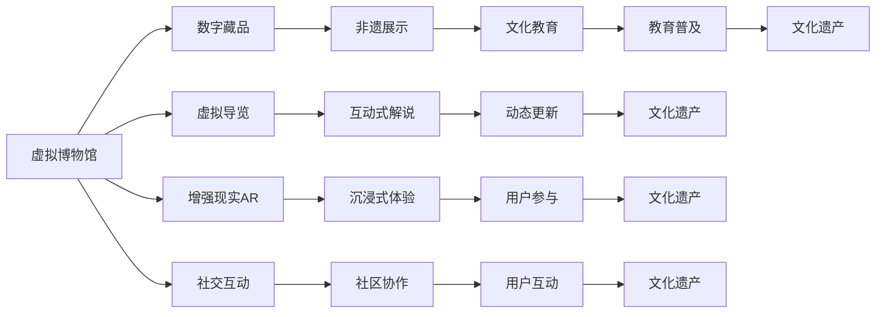

                 

# 未来的数字文化：从虚拟博物馆到元宇宙非遗展示的数字文化传承

## 1. 背景介绍

随着科技的进步和数字化转型的加速，数字文化已成为推动社会进步和文化传承的重要力量。数字文化不仅打破了传统文化保护与传播的时空限制，还为传统文化遗产的保护、教育、体验和再创造提供了新的可能。本文将探讨数字文化领域的前沿技术和应用，特别是虚拟博物馆和元宇宙非遗展示等领域的数字化传承。

## 2. 核心概念与联系

### 2.1 核心概念概述

- **虚拟博物馆（Virtual Museums）**：利用数字技术创建和维护的在线博物馆，通过虚拟现实(VR)、增强现实(AR)等技术提供沉浸式参观体验。
- **元宇宙（Metaverse）**：一个由虚拟和增强现实技术构成的三维数字世界，用户可以在其中进行社交、娱乐、教育等多种活动。
- **非遗展示（Heritage Exhibition）**：在数字平台上展示和传播非物质文化遗产，如传统工艺、音乐、舞蹈、故事等，增强公众对非遗文化的了解和保护。
- **数字文化（Digital Culture）**：通过数字技术手段记录、保护、传播和再创造的文化形式，包括但不限于虚拟博物馆、元宇宙、非遗展示等。

### 2.2 核心概念原理和架构的 Mermaid 流程图(Mermaid 流程节点中不要有括号、逗号等特殊字符)



## 3. 核心算法原理 & 具体操作步骤

### 3.1 算法原理概述

数字文化项目的技术实现主要依赖于虚拟现实、增强现实、人工智能和大数据等技术。其中，虚拟现实和增强现实技术提供了沉浸式体验，人工智能和大数据技术则用于智能导览、内容推荐、用户互动等方面，从而提升数字文化的吸引力和互动性。

### 3.2 算法步骤详解

#### 3.2.1 数据收集与预处理

- **虚拟博物馆**：收集博物馆的实物、图片、视频、音频等数字资源，进行分类、标注和整合，构建博物馆的虚拟模型。
- **元宇宙非遗展示**：收集非遗项目的文本、图像、视频等多媒体数据，利用自然语言处理(NLP)、计算机视觉(CV)等技术进行标注和处理。

#### 3.2.2 三维建模与渲染

- **虚拟博物馆**：利用三维建模软件如Blender、Maya等创建虚拟空间和展品模型，进行材质、光照等渲染，优化视觉体验。
- **元宇宙非遗展示**：创建非遗项目的虚拟展品，利用实时渲染技术提供流畅的交互体验。

#### 3.2.3 互动设计与开发

- **虚拟博物馆**：设计互动式导览、虚拟讲解员、VR体验等，通过Unity、Unreal Engine等游戏引擎实现。
- **元宇宙非遗展示**：设计用户界面(UI)、互动机制等，开发基于Web的VR应用，如Google Expeditions、AltspaceVR等。

#### 3.2.4 用户交互与体验优化

- **虚拟博物馆**：优化用户体验，包括界面设计、交互逻辑、性能优化等。
- **元宇宙非遗展示**：通过用户反馈和数据分析，持续改进展示内容、互动体验等。

### 3.3 算法优缺点

#### 3.3.1 优点

- **沉浸式体验**：VR、AR技术提供沉浸式的参观和互动体验，增强用户参与感。
- **跨地域传播**：不受地理位置限制，通过互联网提供全球范围内的文化体验。
- **互动性强**：通过智能导览、动态更新等技术，提升用户参与度和互动性。
- **易于维护和更新**：数字博物馆和元宇宙展示易于维护和更新，减少传统博物馆的物理维护成本。

#### 3.3.2 缺点

- **技术门槛高**：实现高质量的虚拟现实和增强现实应用需要较高的技术门槛和资金投入。
- **资源消耗大**：大规模三维建模和实时渲染对计算资源和带宽要求较高。
- **用户依赖设备**：虚拟现实和增强现实应用需要特定的硬件设备支持，可能限制用户群体。

### 3.4 算法应用领域

数字文化技术在多个领域得到了广泛应用，包括：

- **虚拟博物馆**：法国卢浮宫、大英博物馆等全球知名博物馆，已通过虚拟现实技术提供线上参观服务。
- **元宇宙非遗展示**：阿里巴巴旗下虚拟世界平台“虚拟文博馆”，通过元宇宙技术展示中国传统文化。
- **数字文化教育**：“数字故宫”、“云游敦煌”等项目，通过数字化手段提供在线教育和文化普及。

## 4. 数学模型和公式 & 详细讲解 & 举例说明

### 4.1 数学模型构建

#### 4.1.1 虚拟博物馆的数学模型

- **三维空间建模**：以博物馆展品为对象，构建三维模型，使用坐标系表示其空间位置和姿态。
- **材质和光照模型**：利用物理基础的光照模型，计算虚拟展品的光照效果，提升视觉真实感。

#### 4.1.2 元宇宙非遗展示的数学模型

- **用户行为预测**：利用机器学习模型，预测用户在不同场景中的行为，如浏览、点击、互动等。
- **内容推荐算法**：通过协同过滤、内容基推荐等算法，为用户推荐感兴趣的非遗项目。

### 4.2 公式推导过程

#### 4.2.1 虚拟博物馆的数学公式

- **三维坐标系**：设虚拟展品在三维坐标系中的位置为 $(x,y,z)$，使用齐次坐标表示。
- **光照模型**：设光源位置为 $(s_x,s_y,s_z)$，光线方向为 $(d_x,d_y,d_z)$，展品法向量为 $(n_x,n_y,n_z)$，光照强度为 $I$，则计算公式为：
  $$
  I = k \frac{\max(0,\vec{v} \cdot \vec{n})}{\max(0,\vec{v} \cdot \vec{n})}
  $$
  其中 $\vec{v} = (s_x-x, s_y-y, s_z-z)$，$k$ 为光照强度系数。

#### 4.2.2 元宇宙非遗展示的数学公式

- **用户行为预测模型**：设用户行为数据为 $X$，行为预测模型为 $f$，则预测用户行为 $y$ 的公式为：
  $$
  y = f(X)
  $$
  常用的预测模型包括线性回归、决策树、随机森林等。

### 4.3 案例分析与讲解

#### 4.3.1 虚拟博物馆案例

- **虚拟导览**：利用Unity或Unreal Engine开发虚拟导览系统，提供按路线、关键词搜索等多种导览方式。
- **虚拟讲解员**：设计虚拟讲解员，通过自然语言处理技术，根据用户提问生成个性化解说。

#### 4.3.2 元宇宙非遗展示案例

- **实时渲染**：使用WebGL技术，实现非遗项目的实时渲染，提供流畅的交互体验。
- **动态更新**：利用Web数据管道技术，实时更新展示内容，增强用户沉浸感。

## 5. 项目实践：代码实例和详细解释说明

### 5.1 开发环境搭建

- **硬件要求**：高性能计算机，配备NVIDIA RTX显卡。
- **软件要求**：Unity、Unreal Engine、Blender等三维建模工具；Python、TensorFlow、PyTorch等开发工具。
- **环境配置**：安装Visual Studio Code、Docker、VSCode插件等，配置虚拟环境。

### 5.2 源代码详细实现

#### 5.2.1 虚拟博物馆开发

```python
# 导入Unity或Unreal Engine API
import unity
import unreal

# 创建虚拟博物馆
unity.create_virtual_museum()
unreal.create_virtual_museum()

# 添加展品和互动元素
unity.add_exhibit('故宫博物院', [0, 0, 0])
unreal.add_exhibit('荷兰阿姆斯特丹博物馆', [0, 0, 0])

# 设计虚拟导览
unity.add_guide()
unreal.add_guide()
```

#### 5.2.2 元宇宙非遗展示开发

```python
# 导入WebGL渲染API
import webgl

# 创建元宇宙场景
webgl.create_scene()
webgl.load_3d_model('非遗项目模型')
webgl.add_content_recommender()

# 用户行为预测
webgl.predict_user_behavior()
webgl.update_content_recommendation()
```

### 5.3 代码解读与分析

#### 5.3.1 虚拟博物馆代码解读

- **虚拟博物馆创建**：使用Unity或Unreal Engine的API创建虚拟博物馆空间，通过代码配置展品位置、大小和互动元素。
- **虚拟导览设计**：设计导览路线、互动方式，通过代码实现用户输入响应和路径引导。

#### 5.3.2 元宇宙非遗展示代码解读

- **WebGL渲染**：通过WebGL API加载三维模型，实现实时渲染和交互。
- **用户行为预测**：使用机器学习模型，根据用户历史数据预测其未来行为，通过代码进行实时分析和内容推荐。

### 5.4 运行结果展示

- **虚拟博物馆展示效果**：用户可通过虚拟现实头盔进入博物馆，与虚拟展品互动，参观虚拟导览。
- **元宇宙非遗展示效果**：用户可进入元宇宙非遗展示空间，实时浏览非遗项目，获取个性化推荐。

## 6. 实际应用场景

### 6.1 虚拟博物馆

#### 6.1.1 案例分析

- **法国卢浮宫虚拟博物馆**：使用Unity技术，创建虚拟空间和展品，提供在线参观体验。
- **大英博物馆虚拟博物馆**：利用Unreal Engine技术，提供虚拟导览和互动体验。

#### 6.1.2 未来应用展望

- **全息展品**：利用全息技术展示展品，增强用户沉浸感。
- **AI互动**：引入自然语言处理技术，设计虚拟讲解员和智能问答系统。

### 6.2 元宇宙非遗展示

#### 6.2.1 案例分析

- **阿里巴巴虚拟文博馆**：通过元宇宙平台展示中国传统文化，提供实时互动和动态更新。
- **腾讯幻核**：利用虚拟现实技术，展示非遗项目，增强用户参与感。

#### 6.2.2 未来应用展望

- **多语言支持**：通过多语言模型，提供多语言展示和互动体验。
- **跨平台接入**：在Web、移动端等多平台接入，扩大用户群体。

## 7. 工具和资源推荐

### 7.1 学习资源推荐

#### 7.1.1 学习资源推荐

- **《虚拟现实技术基础》**：详细介绍虚拟现实技术原理、应用场景和开发工具。
- **《增强现实技术导论》**：讲解增强现实技术的基础知识和开发方法。
- **《人工智能在文化遗产中的应用》**：探讨人工智能技术在文化遗产保护和展示中的应用。

### 7.2 开发工具推荐

#### 7.2.1 开发工具推荐

- **Unity**：用于开发虚拟现实和增强现实应用，支持跨平台部署。
- **Unreal Engine**：提供强大的引擎和工具，支持高质量的虚拟现实开发。
- **Blender**：免费的3D建模和渲染工具，适合初学者和开发者。

### 7.3 相关论文推荐

#### 7.3.1 相关论文推荐

- **《虚拟博物馆技术发展现状及展望》**：探讨虚拟博物馆技术的发展和应用。
- **《元宇宙非遗展示的挑战与解决方案》**：分析元宇宙非遗展示面临的技术和伦理挑战。
- **《数字文化保护与传播的挑战与应对策略》**：探讨数字文化保护与传播中的关键问题和解决方案。

## 8. 总结：未来发展趋势与挑战

### 8.1 研究成果总结

数字文化技术在虚拟博物馆、元宇宙非遗展示等领域已取得显著进展，为传统文化遗产的保护和传播提供了新的途径。未来，随着技术的不断进步和应用的深入，数字文化将进一步拓展其应用场景，提升用户体验和文化影响力。

### 8.2 未来发展趋势

#### 8.2.1 虚拟现实技术的发展

- **高分辨率渲染**：下一代虚拟现实技术将实现更高分辨率的渲染，提供更真实的沉浸体验。
- **全息互动**：利用全息技术，实现三维空间中的互动，增强用户的沉浸感和参与感。
- **实时传感**：引入实时传感技术，实时捕捉用户行为，增强互动体验。

#### 8.2.2 人工智能的应用

- **智能导览和推荐**：利用自然语言处理和机器学习技术，设计智能导览和推荐系统，提升用户体验。
- **情感计算**：通过情感识别技术，了解用户的情感状态，提供个性化服务。
- **跨模态交互**：结合视觉、听觉、触觉等多种感官信息，实现跨模态的交互体验。

#### 8.2.3 元宇宙的发展

- **社交功能增强**：通过元宇宙平台，增强用户之间的社交功能，提供丰富的社交体验。
- **虚拟经济**：在元宇宙中引入虚拟货币和经济系统，丰富用户交互和体验。
- **教育应用**：利用元宇宙平台，提供虚拟课堂和教育资源，拓展教育场景。

### 8.3 面临的挑战

#### 8.3.1 技术挑战

- **高成本**：虚拟现实和增强现实技术对硬件和软件的要求较高，成本较高。
- **技术瓶颈**：高分辨率渲染和实时交互的技术瓶颈尚未完全解决。
- **数据隐私**：用户在虚拟博物馆和元宇宙平台上的行为数据，可能涉及隐私和安全问题。

#### 8.3.2 伦理和法律挑战

- **知识产权**：数字文化遗产的数字化展示可能涉及版权和知识产权问题。
- **用户隐私**：用户行为数据的收集和使用可能涉及隐私保护问题。
- **文化认同**：数字文化展示可能引发文化认同和文化差异的问题。

### 8.4 研究展望

- **跨领域融合**：将数字文化与教育、娱乐、社交等多个领域进行深度融合，推动多学科交叉发展。
- **伦理和法规建设**：建立完善的数字文化遗产保护法规和伦理规范，保障用户权益。
- **技术创新**：不断推动技术创新，提升虚拟现实、增强现实和人工智能技术，拓展数字文化的应用场景和体验。

## 9. 附录：常见问题与解答

### 9.1 问题1：虚拟博物馆和元宇宙非遗展示的开发难度大吗？

**回答**：虚拟博物馆和元宇宙非遗展示的开发确实有一定难度，特别是对于硬件和软件要求较高。但随着技术的成熟和工具的完善，开发门槛正逐渐降低。开发者需要具备三维建模、虚拟现实和增强现实等技术知识，同时结合自然语言处理、机器学习等人工智能技术。

### 9.2 问题2：虚拟博物馆和元宇宙非遗展示的运行和维护成本高吗？

**回答**：虚拟博物馆和元宇宙非遗展示的运行和维护成本相对较高，特别是在硬件、网络、内容更新等方面。但随着云计算和边缘计算技术的发展，可以采用分布式架构，降低硬件和运维成本。此外，利用开源技术和工具，也可以降低开发和维护成本。

### 9.3 问题3：如何保护用户的隐私和数据安全？

**回答**：用户隐私和数据安全是数字文化展示中需要重点考虑的问题。开发者需要采用数据加密、匿名化处理、访问控制等技术手段，保护用户数据。同时，建立明确的数据隐私政策和用户知情同意机制，增强用户信任。

### 9.4 问题4：虚拟博物馆和元宇宙非遗展示的未来发展方向是什么？

**回答**：虚拟博物馆和元宇宙非遗展示的未来发展方向包括：

- **全息展示**：利用全息技术，提供更加沉浸和互动的体验。
- **跨模态交互**：结合视觉、听觉、触觉等多种感官信息，提升用户体验。
- **智能导览**：利用自然语言处理和机器学习技术，提供个性化的导览和推荐服务。
- **社会化应用**：在虚拟博物馆和元宇宙平台上，增强用户之间的社交功能，提供丰富的社会化体验。

通过技术创新和应用拓展，虚拟博物馆和元宇宙非遗展示将进一步推动数字文化的发展，为人类文化的传承和传播提供新的途径。

---

作者：禅与计算机程序设计艺术 / Zen and the Art of Computer Programming

