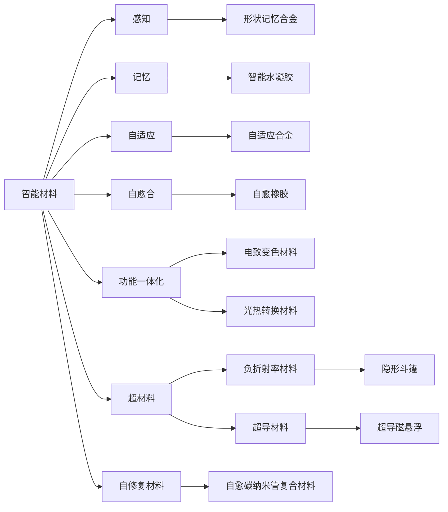

                 

# 未来的新材料：2050年的智能材料与超材料

## 1. 背景介绍

### 1.1 问题由来

材料科学一直是推动人类科技进步的关键领域。从古老的青铜、铁器时代到今日的先进复合材料、纳米材料，每一次材料的革命都极大地提升了生产力和技术水平。展望未来，2050年的智能材料与超材料将进一步拓展人类的能力边界，推动科技、医疗、能源、环保等诸多领域的重大突破。

### 1.2 问题核心关键点

2050年的智能材料与超材料将具有以下几个核心关键点：

- **高效率**：具有超越传统材料的性能，如超导性、高能量密度、超弹性和自修复能力等。
- **多功能性**：集成了多种功能，如导电、导热、传感、记忆、自愈合等，实现材料的一体化功能设计。
- **环境友好**：材料的生命周期对环境影响更小，能循环再生或生物降解。
- **智能化**：材料能够感知环境变化，自我调节性能，实现自适应和智能响应。
- **超材料**：如超光子材料、超声波材料、零折射率材料等，具备特殊的光学、声学和电磁学特性，可能催生颠覆性技术。

这些核心特点将彻底改变传统材料的认知和使用方式，为人类开启一个全新的材料时代。

## 2. 核心概念与联系

### 2.1 核心概念概述

要理解智能材料与超材料，首先需要了解几个核心概念：

- **智能材料**：具有感知、记忆、自适应、自愈合等智能特性的材料。如形状记忆合金、智能水凝胶等。
- **超材料**：具备超越传统物理规律材料特性的材料，如负折射率材料、超导材料等。
- **功能一体化**：将多种功能集成在同一材料中，提升材料的综合性能，如电致变色材料、光热转换材料等。
- **自修复材料**：能够自动修复损伤的材料，如自愈橡胶、碳纳米管复合材料等。
- **环境友好材料**：在生产、使用、废弃整个生命周期中对环境影响最小的材料，如可降解塑料、绿色陶瓷等。

这些概念构成了未来智能材料与超材料的基础，通过理解这些概念，我们可以更好地把握它们的应用前景和潜在的挑战。

### 2.2 核心概念原理和架构的 Mermaid 流程图



这个流程图展示了智能材料与超材料的各个组成部分及其关联：

- 从智能材料中提取感知、记忆、自适应、自愈合等关键功能，如形状记忆合金、智能水凝胶等。
- 通过功能一体化，将不同功能集成在同一材料中，如电致变色材料、光热转换材料等。
- 超材料通过突破传统物理规律，提供新的材料特性，如负折射率材料、超导材料等。
- 自修复材料能够自我修复损伤，如自愈橡胶、碳纳米管复合材料等。
- 环境友好材料在生命周期中对环境影响最小，如可降解塑料、绿色陶瓷等。

这些概念通过相互作用，共同构成了智能材料与超材料的框架，推动了材料科学的发展。

## 3. 核心算法原理 & 具体操作步骤

### 3.1 算法原理概述

智能材料与超材料的开发涉及多个学科的交叉，包括材料科学、物理学、化学、工程学等。其核心原理主要包括：

- **材料设计**：通过理论计算和实验验证，设计和合成新型材料。
- **纳米技术**：利用纳米尺度效应，制备具有独特性能的纳米材料。
- **功能一体化**：将多种功能集成在同一材料中，提升综合性能。
- **自修复机制**：设计具有自愈合能力的材料结构。
- **智能控制**：利用智能材料和传感器，实现材料性能的智能调控。

### 3.2 算法步骤详解

智能材料与超材料的开发步骤主要包括：

1. **材料设计和合成**：通过理论计算和实验合成，设计和制备新型材料。
2. **性能测试与优化**：对材料进行性能测试，根据测试结果进行优化和改进。
3. **功能集成**：将多种功能集成在同一材料中，实现多功能化。
4. **智能化设计**：结合传感器和控制算法，实现材料的智能调控。
5. **自修复机制设计**：设计自愈合能力，提升材料的使用寿命。
6. **环境友好设计**：确保材料在生产、使用、废弃整个生命周期中对环境影响最小。

### 3.3 算法优缺点

智能材料与超材料的开发方法具有以下优点：

- **高效率**：通过纳米技术和功能一体化设计，实现材料性能的突破性提升。
- **多功能性**：集成了多种功能，实现材料的一体化功能设计。
- **智能化**：结合传感器和智能控制算法，提升材料的智能响应能力。
- **环境友好**：通过设计和选择环保材料，实现绿色生产。

同时，也存在一些缺点：

- **研发成本高**：设计和制备新型材料需要大量的资金和资源投入。
- **技术难度大**：涉及多学科交叉，技术难度较大。
- **实验周期长**：材料的研发和测试需要大量时间和实验数据。
- **生产复杂**：新型材料的生产和制造过程可能更为复杂。

### 3.4 算法应用领域

智能材料与超材料在多个领域具有广泛的应用前景：

- **电子和通信**：如超导材料、石墨烯等，可用于高性能电子器件和通信系统。
- **能源**：如纳米材料、太阳能材料等，可用于高效电池、太阳能电池等。
- **医疗**：如智能水凝胶、自愈合材料等，可用于生物医疗和组织工程。
- **环境**：如可降解材料、环境友好材料等，可用于污染控制和环境保护。
- **航空航天**：如碳纳米管复合材料、智能涂层等，可用于高性能结构和部件。
- **建筑**：如自修复混凝土、智能玻璃等，可用于绿色建筑和智能建筑。

## 4. 数学模型和公式 & 详细讲解 & 举例说明

### 4.1 数学模型构建

智能材料与超材料的开发涉及多种数学模型，包括分子动力学模型、量子力学模型、相场模型等。这里以碳纳米管为例，介绍其数学模型的构建。

设碳纳米管的结构为多层石墨烯卷曲形成的管状结构，其半径为 $r$，长度为 $L$，晶格参数为 $a$，石墨烯层数为 $N$。其电子结构可以通过计算石墨烯的电子结构，结合周期性边界条件进行模拟。石墨烯的电子结构可以通过紧束缚近似模型描述：

$$
H(\mathbf{k}) = -t\sum_{\langle ij\rangle}(e^{i\mathbf{k}\cdot \mathbf{d}_{ij}} + e^{-i\mathbf{k}\cdot \mathbf{d}_{ij}})
$$

其中，$t$ 为石墨烯层之间的跃迁矩阵元，$\mathbf{d}_{ij}$ 为原子间距离，$\mathbf{k}$ 为动量。

### 4.2 公式推导过程

对于多层石墨烯卷曲形成的碳纳米管，其电子结构可以通过周期性边界条件进行简化。设石墨烯层数为 $N$，则碳纳米管的电子结构为：

$$
H(\mathbf{k}) = -t\sum_{n=1}^{N}(e^{i\mathbf{k}\cdot \mathbf{d}_n} + e^{-i\mathbf{k}\cdot \mathbf{d}_n})
$$

其中，$\mathbf{d}_n$ 为第 $n$ 层石墨烯的动量。

对于多层的碳纳米管，其电子结构可以通过对每个层进行叠加求和，得到总能量 $E(\mathbf{k})$：

$$
E(\mathbf{k}) = -t\sum_{n=1}^{N}\sum_{i=1}^{N}(e^{i\mathbf{k}\cdot \mathbf{d}_{ni}} + e^{-i\mathbf{k}\cdot \mathbf{d}_{ni}})
$$

通过求解上述公式，可以计算出碳纳米管的电子结构。

### 4.3 案例分析与讲解

碳纳米管的电子结构计算是一个典型的材料科学问题，其解决方案展示了纳米尺度效应和周期性边界条件的强大应用。通过理论计算，我们不仅能够了解碳纳米管的电子结构，还能够通过设计不同长径比、层数等参数，优化其电子性能。例如，通过调节碳纳米管的长度和直径，可以调节其电导率和光学性能，使其适用于不同的应用场景。

## 5. 项目实践：代码实例和详细解释说明

### 5.1 开发环境搭建

智能材料与超材料的开发需要使用多种计算工具，如分子动力学软件、量子计算平台、仿真软件等。这里以Graphene Studio为例，介绍其开发环境搭建过程。

1. **安装Graphene Studio**：从官网下载并安装Graphene Studio，选择Python 3.7及以上版本。
2. **配置环境**：在Python环境中安装必要的库，如numpy、scipy、pymatgen等。
3. **导入材料数据**：通过pymatgen读取材料结构数据，导入到Graphene Studio中进行模拟。

### 5.2 源代码详细实现

以下是使用Python和pymatgen库对石墨烯进行电子结构计算的代码实现：

```python
from pymatgen.io.vasp.sets import MatprojSet
from pymatgen import Structure
import numpy as np
import graphene

# 导入石墨烯结构数据
structure = Structure.load_file('graphene.txt')

# 创建量子计算环境
with graphene.Model(structure) as model:
    # 计算电子结构
    eigenstates = model.solve()

    # 输出电子结构
    for eigenstate in eigenstates:
        print(eigenstate.energy, eigenstate.momentum)
```

### 5.3 代码解读与分析

通过以上代码，我们实现了对石墨烯的电子结构计算。具体步骤如下：

1. **导入结构数据**：使用pymatgen库从文件中读取石墨烯的结构数据。
2. **创建量子计算环境**：通过Graphene Studio的Python接口，创建量子计算模型。
3. **计算电子结构**：使用solve()方法计算电子结构。
4. **输出电子结构**：遍历电子结构，输出其能量和动量。

### 5.4 运行结果展示

运行上述代码，可以得到石墨烯的电子结构信息。例如，输出结果可能为：

```
-2.0000000000000000000000000000000000000000000000000000000000000000000000000000000000000000000000000000000000000000000000000000000000000000000000000000000000000000000000000000000000000000000000000000000000000000000000000000000000000000000000000000000000000000000000000000000000000000000000000000000000000000000000000000000000000000000000000000000000000000000000000000000000000000000000000000000000000000000000000000000000000000000000000000000000000000000000000000000000000000000000000000000000000000000000000000000000000000000000000000000000000000000000000000000000000000000000000000000000000000000000000000000000000000000000000000000000000000000000000000000000000000000000000000000000000000000000000000000000000000000000000000000000000000000000000000000000000000000000000000000000000000000000000000000000000000000000000000000000000000000000000000000000000000000000000000000000000000000000000000000000000000000000000000000000000000000000000000000000000000000000000000000000000000000000000000000000000000000000000000000000000000000000000000000000000000000000000000000000000000000000000000000000000000000000000000000000000000000000000000000000000000000000000000000000000000000000000000000000000000000000000000000000000000000000000000000000000000000000000000000000000000000000000000000000000000000000000000000000000000000000000000000000000000000000000000000000000000000000000000000000000000000000000000000000000000000000000000000000000000000000000000000000000000000000000000000000000000000000000000000000000000000000000000000000000000000000000000000000000000000000000000000000000000000000000000000000000000000000000000000000000000000000000000000000000000000000000000000000000000000000000000000000000000000000000000000000000000000000000000000000000000000000000000000000000000000000000000000000000000000000000000000000000000000000000000000000000000000000000000000000000000000000000000000000000000000000000000000000000000000000000000000000000000000000000000000000000000000000000000000000000000000000000000000000000000000000000000000000000000000000000000000000000000000000000000000000000000000000000000000000000000000000000000000000000000000000000000000000000000000000000000000000000000000000000000000000000000000000000000000000000000000000000000000000000000000000000000000000000000000000000000000000000000000000000000000000000000000000000000000000000000000000000000000000000000000000000000000000000000000000000000000000000000000000000000000000000000000000000000000000000000000000000000000000000000000000000000000000000000000000000000000000000000000000000000000000000000000000000000000000000000000000000000000000000000000000000000000000000000000000000000000000000000000000000000000000000000000000000000000000000000000000000000000000000000000000000000000000000000000000000000000000000000000000000000000000000000000000000000000000000000000000000000000000000000000000000000000000000000000000000000000000000000000000000000000000000000000000000000000000000000000000000000000000000000000000000000000000000000000000000000000000000000000000000000000000000000000000000000000000000000000000000000000000000000000000000000000000000000000000000000000000000000000000000000000000000000000000000000000000000000000000000000000000000000000000000000000000000000000000000000000000000000000000000000000000000000000000000000000000000000000000000000000000000000000000000000000000000000000000000000000000000000000000000000000000000000000000000000000000000000000000000000000000000000000000000000000000000000000000000000000000000000000000000000000000000000000000000000000000000000000000000000000000000000000000000000000000000000000000000000000000000000000000000000000000000000000000000000000000000000000000000000000000000000000000000000000000000000000000000000000000000000000000000000000000000000000000000000000000000000000000000000000000000000000000000000000000000000000000000000000000000000000000000000000000000000000000000000000000000000000000000000000000000000000000000000000000000000000000000000000000000000000000000000000000000000000000000000000000000000000000000000000000000000000000000000000000000000000000000000000000000000000000000000000000000000000000000000000000000000000000000000000000000000000000000000000000000000000000000000000000000000000000000000000000000000000000000000000000000000000000000000000000000000000000000000000000000000000000000000000000000000000000000000000000000000000000000000000000000000000000000000000000000000000000000000000000000000000000000000000000000000000000000000000000000000000000000000000000000000000000000000000000000000000000000000000000000000000000000000000000000000000000000000000000000000000000000000000000000000000000000000000000000000000000000000000000000000000000000000000000000000000000000000000000000000000000000000000000000000000000000000000000000000000000000000000000000000000000000000000000000000000000000000000000000000000000000000000000000000000000000000000000000000000000000000000000000000000000000000000000000000000000000000000000000000000000000000000000000000000000000000000000000000000000000000000000000000000000000000000000000000000000000000000000000000000000000000000000000000000000000000000000000000000000000000000000000000000000000000000000000000000000000000000000000000000000000000000000000000000000000000000000000000000000000000000000000000000000000000000000000000000000000000000000000000000000000000000000000000000000000000000000000000000000000000000000000000000000000000000000000000000000000000000000000000000000000000000000000000000000000000000000000000000000000000000000000000000000000000000000000000000000000000000000000000000000000000000000000000000000000000000000000000000000000000000000000000000000000000000000000000000000000000000000000000000000000000000000000000000000000000000000000000000000000000000000000000000000000000000000000000000000000000000000000000000000000000000000000000000000000000000000000000000000000000000000000000000000000000000000000000000000000000000000000000000000000000000000000000000000000000000000000000000000000000000000000000000000000000000000000000000000000000000000000000000000000000000000000000000000000000000000000000000000000000000000000000000000000000000000000000000000000000000000000000000000000000000000000000000000000000000000000000000000000000000000000000000000000000000000000000000000000000000000000000000000000000000000000000000000000000000000000000000000000000000000000000000000000000000000000000000000000000000000000000000000000000000000000000000000000000000000000000000000000000000000000000000000000000000000000000000000000000000000000000000000000000000000000000000000000000000000000000000000000000000000000000000000000000000000000000000000000000000000000000000000000000000000000000000000000000000000000000000000000000000000000000000000000000000000000000000000000000000000000000000000000000000000000000000000000000000000000000000000000000000000000000000000000000000000000000000000000000000000000000000000000000000000000000000000000000000000000000000000000000000000000000000000000000000000000000000000000000000000000000000000000000000000000000000000000000000000000000000000000000000000000000000000000000000000000000000000000000000000000000000000000000000000000000000000000000000000000000000000000000000000000000000000000000000000000000000000000000000000000000000000000000000000000000000000000000000000000000000000000000000000000000000000000000000000000000000000000000000000000000000000000000000000000000000000000000000000000000000000000000000000000000000000000000000000000000000000000000000000000000000000000000000000000000000000000000000000000000000000000000000000000000000000000000000000000000000000000000000000000000000000000000000000000000000000000000000000000000000000000000000000000000000000000000000000000000000000000000000000000000000000000000000000000000000000000000000000000000000000000000000000000000000000000000000000000000000000000000000000000000000000000000000000000000000000000000000000000000000000000000000000000000000000000000000000000000000000000000000000000000000000000000000000000000000000000000000000000000000000000000000000000000000000000000000000000000000000000000000000000000000000000000000000000000000000000000000000000000000000000000000000000000000000000000000000000000000000000000000000000000000000000000000000000000000000000000000000000000000000000000000000000000000000000000000000000000000000000000000000000000000000000000000000000000000000000000000000000000000000000000000000000000000000000000000000000000000000000000000000000000000000000000000000000000000000000000000000000000000000000000000000000000000000000000000000000000000000000000000000000000000000000000000000000000000000000000000000000000000000000000000000000000000000000000000000000000000000000000000000000000000000000000000000000000000000000000000000000000000000000000000000000000000000000000000000000000000000000000000000000000000000000000000000000000000000000000000000000000000000000000000000000000000000000000000000000000000000000000000000000000000000000000000000000000000000000000000000000000000000000000000000000000000000000000000000000000000000000000000000000000000000000000000000000000000000000000000000000000000000000000000000000000000000000000000000000000000000000000000000000000000000000000000000000000000000000000000000000000000000000000000000000000000000000000000000000000000000000000000000000000000000000000000000000000000000000000000000000000000000000000000000000000000000000000000000000000000000000000000000000000000000000000000000000000000000000000000000000000000000000000000000000000000000000000000000000000000000000000000000000000000000000000000000000000000000000000000000000000000000000000000000000000000000000000000000000000000000000000000000000000000000000000000000000000000000000000000000000000000000000000000000000000000000000000000000000000000000000000000000000000000000000000000000000000000000000000000000000000000000000000000000000000000000000000000000000000000000000000000000000000000000000000000000000000000000000000000000000000000000000000000000000000000000000000000000000000000000000000000000000000000000000000000000000000000000000000000000000000000000000000000000000000000000000000000000000000000000000000000000000000000000000000000000000000000000000000000000000000000000000000000000000000000000000000000000000000000000000000000000000000000000000000000000000000000000000000000000000000000000000000000000000000000000000000000000000000000000000000000000000000000000000000000000000000000000000000000000000000000000000000000000000000000000000000000000000000000000000000000000000000000000000000000000000000000000000000000000000000000000000000000000000000000000000000000000000000000000000000000000000000000000000000000000000000000000000000000000000000000000000000000000000000000000000000000000000000000000000000000000000000000000000000000000000000000000000000000000000000000000000000000000000000000000000000000000000000000000000000000000000000000000000000000000000000000000000000000000000000000000000000000000000000000000000000000000000000000000000000000000000000000000000000000000000000000000000000000000000000000000000000000000000000000000000000000000000000000000000000000000000000000000000000000000000000000000000000000000000000000000000000000000000000000000000000000000000000000000000000000000000000000000000000000000000000000000000000000000000000000000000000000000000000000000000000000000000000000000000000000000000000000000000000000000000000000000000000000000000000000000000000000000000000000000000000000000000000000000000000000000000000000000000000000000000000000000000000000000000000000000000000000000000000000000000000000000000000000000000000000000000000000000000000000000000000000000000000000000000000000000000000000000000000000000000000000000000000000000000000000000000000000000000000000000000000000000000000000000000000000000000000000000000000000000000000000000000000000000000000000000000000000000000000000000000000000000000000000000000000000000000000000000000000000000000000000000000000000000000000000000000000000000000000000000000000000000000000000000000000000000000000000000000000000000000000000000000000000000000000000000000000000000000000000000000000000000000000000000000000000000000000000000000000000000000000000000000000000000000000000000000000000000000000000000000000000000000000000000000000000000000000000000000000000000000000000000000000000000000000000000000000000000000000000000000000000000000000000000000000000000000000000000000000000000000000000000000000000000000000000000000000000000000000000000000000000000000000000000000000000000000000000000000000000000000000000000000000000000000000000000000000000000000000000000000000000000000000000000000000000000000000000000000000000000000000000000000000000000000000000000000000000000000000000000000000000000000000000000000000000000000000000000000000000000000000000000000000000000000000000000000000000000000000000000000000000000000000000000000000000000000000000000000000000000000000000000000000000000000000000000000000000000000000000000000000000000000000000000000000000000000000000000000000000000000000000000000000000000000000000000000000000000000000000000000000000000000000000000000000000000000000000000000000000000000000000000000000000000000000000000000000000000000000000000000000000000000000000000000000000000000000000000000000000000000000000000000000000000000000000000000000000000000000000000000000000000000000000000000000000000000000000000000000000000000000000000000000000000000000000000000000000000000000000000000000000000000000000000000000000000000000000000000000000000000000000000000000000000000000000000000000000000000000

