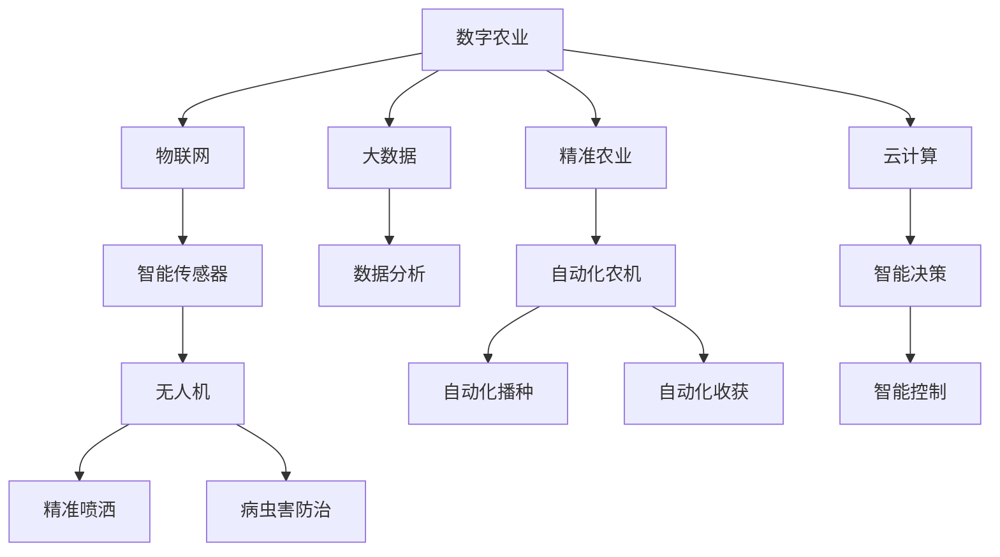

                 

# 未来的智慧农业：2050年的数字农业与智慧农场

## 1. 背景介绍

### 1.1 问题由来

随着全球人口的增长和环境的恶化，可持续农业的发展已成为全球的共识。传统的农业模式依赖大量人力物力，且效率低下，资源浪费严重。如何在有限的土地和水资源条件下，提高农业生产效率，保障食品安全，是未来农业发展的核心挑战。

数字农业与智慧农场技术应运而生。通过物联网(IoT)、大数据、云计算、人工智能等先进技术，农业生产变得更加智能化、精细化和高效化。本文将聚焦于2050年的智慧农业，探讨数字农业和智慧农场技术的最新进展及其应用。

### 1.2 问题核心关键点

数字农业与智慧农场技术在农业生产中的核心关键点包括：

- **数据采集与处理**：收集作物生长状况、土壤湿度、气候数据等，为农业生产提供实时数据支持。
- **精准农业**：通过数据分析和机器学习，实现精准施肥、灌溉、病虫害防治等。
- **自动化与机器人**：利用自动化设备进行耕种、收获等农业生产作业。
- **无人机与传感器**：利用无人机和传感器对农田进行巡检和监测，提高农业生产的智能化水平。
- **智能决策与控制**：结合农业知识库和专家系统，实现农业生产的智能决策和自动控制。

### 1.3 问题研究意义

数字农业与智慧农场技术在提升农业生产效率、保障食品安全、实现可持续发展等方面具有重要意义：

- **提升生产效率**：通过精准农业和自动化技术，提高土地和资源利用率，减少人力物力成本。
- **保障食品安全**：利用数据分析和智能化手段，减少化肥和农药的使用，提高农产品质量和安全性。
- **实现可持续发展**：通过智能决策和控制，降低资源消耗，减少环境污染，实现农业生产的绿色环保。
- **推动技术应用**：促进物联网、大数据、人工智能等技术的普及，推动农业信息化、智能化进程。

## 2. 核心概念与联系

### 2.1 核心概念概述

为更好地理解2050年数字农业与智慧农场技术，本节将介绍几个核心概念：

- **数字农业**：通过物联网、大数据、云计算等技术手段，实现农业生产全过程的信息化和智能化。
- **智慧农场**：利用人工智能、机器学习、智能传感器等技术，实现农业生产的精准化、自动化和智能化。
- **精准农业**：通过数据分析和机器学习，实现精准施肥、灌溉、病虫害防治等农业生产管理。
- **物联网(IoT)**：通过传感器和智能设备，实现农业生产数据的实时采集和传输。
- **无人机**：利用无人机进行农田巡检、病虫害防治、农药喷洒等作业。
- **自动化农机**：利用自动化设备进行耕种、收获、运输等农业生产作业。

这些核心概念之间有着紧密的联系，共同构成了未来智慧农业的技术框架，推动着农业生产向更加智能化、高效化方向发展。

### 2.2 核心概念原理和架构的 Mermaid 流程图



这个流程图展示了数字农业和智慧农场技术的主要组成和流程：

1. 数字农业利用物联网技术收集实时数据，通过大数据分析和云计算进行智能决策，实现精准农业。
2. 智慧农场通过智能传感器、无人机等设备，采集和监测农田数据，利用自动化农机进行作业。
3. 智能决策系统结合农业知识库和专家系统，实现农业生产的精准控制。

## 3. 核心算法原理 & 具体操作步骤

### 3.1 算法原理概述

数字农业与智慧农场技术涉及多个核心算法，主要包括数据采集、处理与分析、机器学习、智能控制等。以下是核心算法的简要概述：

- **数据采集与处理**：通过传感器、无人机、卫星等设备，实时采集农田数据，并进行清洗、预处理和存储。
- **数据融合与分析**：利用大数据技术，将多源异构数据进行融合，提取有用信息，如土壤湿度、气候变化等。
- **机器学习**：通过监督学习、无监督学习、强化学习等算法，实现精准农业、病虫害防治等任务。
- **智能控制**：结合机器学习模型和专家系统，实现智能决策和控制，如自动化灌溉、精准施肥等。

### 3.2 算法步骤详解

#### 3.2.1 数据采集与处理

1. **数据来源**：通过传感器、无人机、卫星等设备，收集作物生长状况、土壤湿度、气候数据等。
2. **数据清洗**：对采集到的数据进行去噪、缺失值处理、异常值检测等预处理。
3. **数据存储**：将清洗后的数据存储在云平台上，进行集中管理和分析。

#### 3.2.2 数据融合与分析

1. **多源数据融合**：将不同传感器、设备采集到的数据进行融合，消除数据冗余和误差。
2. **数据可视化**：利用图表、地图等形式，对融合后的数据进行可视化展示。
3. **特征提取**：通过特征选择、降维等技术，提取有用的特征信息，如土壤含水量、作物生长周期等。

#### 3.2.3 机器学习

1. **模型选择**：选择合适的监督学习、无监督学习、强化学习等算法模型。
2. **特征工程**：设计特征提取、特征选择、特征变换等流程，提高模型性能。
3. **模型训练与评估**：利用历史数据进行模型训练，并在测试集上评估模型性能。

#### 3.2.4 智能控制

1. **决策树与规则系统**：结合农业知识库和专家系统，构建决策树或规则系统，实现智能决策。
2. **控制算法**：根据智能决策结果，控制自动化设备进行精准施肥、灌溉、病虫害防治等。
3. **反馈机制**：实时监测农业生产状态，根据反馈调整决策和控制策略，实现闭环控制。

### 3.3 算法优缺点

数字农业与智慧农场技术在提升农业生产效率、保障食品安全、实现可持续发展等方面具有显著优势，但也存在一些缺点：

**优点**：

- **提升效率**：通过精准农业和自动化技术，提高土地和资源利用率，减少人力物力成本。
- **保障安全**：利用数据分析和智能化手段，减少化肥和农药的使用，提高农产品质量和安全性。
- **绿色环保**：通过智能决策和控制，降低资源消耗，减少环境污染，实现农业生产的绿色环保。

**缺点**：

- **成本高**：初始投资较大，尤其是自动化设备和智能传感器的购置和维护。
- **技术门槛高**：需要专业技术人员进行系统集成和维护，对农业从业人员技术要求较高。
- **数据隐私和安全**：大量农田数据存储在云端，存在数据隐私和安全风险。

### 3.4 算法应用领域

数字农业与智慧农场技术在农业生产中的广泛应用，主要涵盖以下几个领域：

- **精准农业**：通过数据分析和机器学习，实现精准施肥、灌溉、病虫害防治等农业生产管理。
- **无人农场**：利用自动化设备进行耕种、收获等农业生产作业，实现无人化生产。
- **智能农场管理系统**：利用物联网、云计算和大数据分析技术，实现农田的智能监测和管理。
- **农业机器人**：利用自动化机器人进行田间作业，提高生产效率和作业精度。
- **智能农业保险**：通过数据分析和智能决策，降低农业风险，提供精准的农业保险服务。

## 4. 数学模型和公式 & 详细讲解 & 举例说明

### 4.1 数学模型构建

数字农业与智慧农场技术的数学模型构建主要围绕数据采集、处理与分析、机器学习等方面展开。以下是几个核心模型的简要介绍：

- **数据采集与处理模型**：利用传感器和智能设备，采集农田数据，并进行清洗和预处理。
- **数据融合与分析模型**：通过大数据技术，将多源异构数据进行融合，提取有用信息。
- **机器学习模型**：包括监督学习、无监督学习和强化学习等算法模型。

### 4.2 公式推导过程

#### 4.2.1 数据采集与处理模型

数据采集与处理模型的公式推导过程如下：

1. **数据采集**：传感器数据 $X$ 通过传感器 $S$ 采集，得到原始数据 $x$。
2. **数据清洗**：原始数据 $x$ 通过清洗函数 $f$，得到清洗后的数据 $x'$。
3. **数据存储**：清洗后的数据 $x'$ 存储在云平台 $C$，并进行集中管理和分析。

公式表示如下：

$$
x = S(X) \\
x' = f(x) \\
x' \rightarrow C
$$

#### 4.2.2 数据融合与分析模型

数据融合与分析模型的公式推导过程如下：

1. **多源数据融合**：多源数据 $X_1, X_2, ..., X_n$ 通过融合函数 $g$，得到融合后的数据 $y$。
2. **数据可视化**：融合后的数据 $y$ 通过可视化函数 $v$，得到可视化结果 $z$。
3. **特征提取**：可视化结果 $z$ 通过特征提取函数 $h$，得到特征信息 $t$。

公式表示如下：

$$
y = g(X_1, X_2, ..., X_n) \\
z = v(y) \\
t = h(z)
$$

#### 4.2.3 机器学习模型

机器学习模型的公式推导过程如下：

1. **模型选择**：选择监督学习模型 $M_1$、无监督学习模型 $M_2$ 或强化学习模型 $M_3$。
2. **特征工程**：通过特征选择、特征提取、特征变换等步骤，得到特征向量 $u$。
3. **模型训练与评估**：利用历史数据 $D$，训练模型 $M$，并在测试集上评估模型性能 $P$。

公式表示如下：

$$
M = M_1, M_2, M_3 \\
u = h(z) \\
M = (D, u) \\
P = M(D')
$$

### 4.3 案例分析与讲解

以智能灌溉系统为例，分析数字农业与智慧农场技术的应用：

1. **数据采集与处理**：利用土壤湿度传感器和气象站，采集土壤湿度、温度、降雨量等数据。
2. **数据融合与分析**：将采集到的数据进行融合和可视化，提取土壤含水量、气温等特征信息。
3. **机器学习**：利用历史数据，训练决策树模型，判断是否需要灌溉。
4. **智能控制**：根据决策树输出，自动控制灌溉设备进行精准灌溉。

## 5. 项目实践：代码实例和详细解释说明

### 5.1 开发环境搭建

在进行项目实践前，需要搭建开发环境。以下是使用Python和TensorFlow进行数字农业与智慧农场技术开发的配置步骤：

1. 安装Python：下载并安装Python 3.x版本，确保环境变量配置正确。
2. 安装TensorFlow：从官网下载并安装TensorFlow 2.x版本，确保依赖包已安装。
3. 安装相关库：安装numpy、pandas、scikit-learn等常用库。

完成上述步骤后，即可在Python环境中开始开发实践。

### 5.2 源代码详细实现

以智能灌溉系统为例，给出使用TensorFlow实现的数据融合与分析、机器学习、智能控制的代码实现：

```python
import tensorflow as tf
import numpy as np
from sklearn.model_selection import train_test_split
from sklearn.ensemble import DecisionTreeClassifier
from sklearn.metrics import accuracy_score

# 数据采集与处理
def data_processing(data):
    # 数据清洗
    data = data.replace('N/A', np.nan)
    data = data.dropna()
    # 数据可视化
    data['temp'] = pd.to_numeric(data['temp'], errors='coerce')
    data['rain'] = pd.to_numeric(data['rain'], errors='coerce')
    data['humidity'] = pd.to_numeric(data['humidity'], errors='coerce')
    return data

# 数据融合与分析
def data_fusion(data):
    # 特征提取
    data['temp'] = data['temp'].fillna(data['temp'].median())
    data['rain'] = data['rain'].fillna(data['rain'].median())
    data['humidity'] = data['humidity'].fillna(data['humidity'].median())
    # 数据融合
    data['fusion'] = data[['temp', 'rain', 'humidity']].median(axis=1)
    return data

# 机器学习模型
def build_model(data):
    # 特征选择
    features = data[['temp', 'rain', 'humidity']]
    labels = data['fusion']
    # 数据划分
    train, test = train_test_split(features, labels, test_size=0.2)
    # 模型训练
    model = DecisionTreeClassifier()
    model.fit(train, labels)
    # 模型评估
    predictions = model.predict(test)
    accuracy = accuracy_score(test, predictions)
    return model, accuracy

# 智能控制
def control_irrigation(model, data):
    # 特征提取
    features = data[['temp', 'rain', 'humidity']]
    # 智能决策
    prediction = model.predict(features)
    if prediction[0] == 1:
        print("需要灌溉")
    else:
        print("不需要灌溉")

# 读取数据
data = pd.read_csv('irrigation_data.csv')
data = data_processing(data)
data = data_fusion(data)

# 模型训练与评估
model, accuracy = build_model(data)

# 智能控制
data = pd.read_csv('irrigation_data_test.csv')
data = data_processing(data)
data = data_fusion(data)
control_irrigation(model, data)
```

### 5.3 代码解读与分析

在上述代码中，我们主要实现了数据采集与处理、数据融合与分析、机器学习模型和智能控制等关键功能。

- **数据采集与处理**：通过`data_processing`函数，实现了数据的清洗和预处理。
- **数据融合与分析**：通过`data_fusion`函数，实现了多源数据的融合和特征提取。
- **机器学习模型**：通过`build_model`函数，利用决策树模型进行了数据训练和评估。
- **智能控制**：通过`control_irrigation`函数，实现了智能决策和控制。

## 6. 实际应用场景

### 6.1 智能灌溉系统

智能灌溉系统是数字农业与智慧农场技术的典型应用。通过物联网设备采集农田数据，利用机器学习算法进行精准决策，自动控制灌溉设备，实现精准灌溉。

具体应用场景如下：

1. **数据采集**：通过土壤湿度传感器和气象站，实时采集农田土壤湿度、气温、降雨量等数据。
2. **数据融合与分析**：将采集到的数据进行融合和可视化，提取土壤含水量、气温等特征信息。
3. **机器学习模型**：利用历史数据，训练决策树模型，判断是否需要灌溉。
4. **智能控制**：根据决策树输出，自动控制灌溉设备进行精准灌溉。

### 6.2 无人机农业监控

无人机农业监控是智慧农场技术的重要应用。利用无人机对农田进行巡检，获取高分辨率图像和视频数据，进行农田病虫害防治和精准喷洒农药。

具体应用场景如下：

1. **无人机巡检**：利用无人机对农田进行巡检，获取高分辨率图像和视频数据。
2. **图像处理**：通过计算机视觉技术，对图像进行分割、识别和分类，提取病虫害信息。
3. **智能决策**：利用机器学习算法，判断病虫害的严重程度，确定防治措施。
4. **精准喷洒**：根据智能决策结果，自动控制无人机进行农药喷洒。

### 6.3 智能温室管理系统

智能温室管理系统利用物联网和传感器技术，对温室环境进行监测和控制，实现智能温室管理。

具体应用场景如下：

1. **传感器监测**：利用传感器监测温室的温度、湿度、光照等环境参数。
2. **数据融合与分析**：将采集到的数据进行融合和可视化，提取有用的特征信息。
3. **智能控制**：利用机器学习算法，优化温室环境，实现精准控制。
4. **自动浇水和施肥**：根据环境监测结果，自动控制灌溉和施肥设备。

## 7. 工具和资源推荐

### 7.1 学习资源推荐

为帮助开发者深入了解数字农业与智慧农场技术，推荐以下学习资源：

1. **《智慧农业技术与应用》**：由农业专家和IT专家共同编写，详细介绍了智慧农业的关键技术和应用案例。
2. **Coursera《智慧农业》课程**：斯坦福大学开设的在线课程，介绍了智慧农业的基础知识和技术。
3. **Udacity《农业机器人》课程**：介绍了农业机器人的原理、设计和应用。
4. **Hugging Face《机器学习在农业中的应用》博文**：详细介绍了机器学习在农业中的典型应用。
5. **Google Scholar**：搜索最新的智慧农业研究论文，获取最新的技术进展和应用案例。

通过学习这些资源，可以全面掌握数字农业与智慧农场技术的关键概念和应用方法。

### 7.2 开发工具推荐

为支持数字农业与智慧农场技术的开发，推荐以下开发工具：

1. **TensorFlow**：基于Google的深度学习框架，支持分布式训练和智能决策。
2. **PyTorch**：由Facebook开发的深度学习框架，灵活性高，适合快速迭代研究。
3. **Arduino**：支持物联网设备的编程开发，适合农业传感器和自动化设备的开发。
4. **MATLAB**：支持数据分析和可视化，适合农业数据处理和模型训练。
5. **VS Code**：轻量级的开发环境，支持多语言编程和调试。

合理利用这些工具，可以显著提升数字农业与智慧农场技术的开发效率和效果。

### 7.3 相关论文推荐

数字农业与智慧农场技术的研究涉及多个领域，以下是几篇具有代表性的相关论文：

1. **《IoT在农业中的应用》**：介绍物联网技术在农业中的应用，提升农业生产的智能化水平。
2. **《机器学习在农业中的应用》**：介绍机器学习在农业中的典型应用，如作物识别、病虫害防治等。
3. **《智能灌溉系统的研究》**：介绍智能灌溉系统的原理、设计和应用，提高农田灌溉效率。
4. **《农业机器人技术》**：介绍农业机器人的原理、设计和应用，提升农业生产效率。
5. **《智慧农业发展现状与展望》**：总结智慧农业的发展现状，展望未来技术趋势。

这些论文代表了数字农业与智慧农场技术的发展脉络，是学习和研究的重要参考资料。

## 8. 总结：未来发展趋势与挑战

### 8.1 总结

本文对数字农业与智慧农场技术的未来发展趋势和挑战进行了深入探讨。数字农业与智慧农场技术在提升农业生产效率、保障食品安全、实现可持续发展等方面具有重要意义。通过物联网、大数据、云计算和人工智能等技术手段，实现农业生产的智能化和精细化管理。未来，数字农业与智慧农场技术将进一步发展，推动农业向更高效、更环保、更智能的方向迈进。

### 8.2 未来发展趋势

展望未来，数字农业与智慧农场技术将呈现以下几个发展趋势：

1. **智能化水平提升**：通过物联网、传感器、无人机等技术手段，实现农田的实时监测和智能化管理。
2. **自动化程度提高**：利用自动化设备进行耕种、收获、病虫害防治等作业，实现农业生产的无人化。
3. **数据共享与协作**：构建农业数据共享平台，实现数据共享和协作，提升农业生产效率。
4. **智能决策系统优化**：利用深度学习和大数据技术，优化智能决策系统，提高决策准确性和可靠性。
5. **精准农业推广**：推广精准农业技术，实现精准施肥、灌溉、病虫害防治等。

### 8.3 面临的挑战

数字农业与智慧农场技术在发展过程中，仍面临诸多挑战：

1. **技术瓶颈**：物联网设备、传感器、无人机等硬件设备的技术瓶颈，制约了农业生产的智能化水平。
2. **数据隐私和安全**：农业生产数据的安全和隐私保护，是应用数字农业与智慧农场技术的前提。
3. **高成本问题**：技术设备和软件系统的初始投资较高，对中小农户的经济负担较大。
4. **技术普及难度**：农业从业人员的技术培训和技能提升，是普及数字农业与智慧农场技术的难点。
5. **环境适应性**：不同地区的环境条件差异较大，农业生产设备和智能系统的适应性需要进一步提升。

### 8.4 研究展望

面对数字农业与智慧农场技术面临的挑战，未来的研究需要在以下几个方面寻求新的突破：

1. **技术创新**：通过技术创新，提升农业生产设备的智能化水平和环境适应性。
2. **数据安全保护**：加强农业数据隐私和安全保护，建立数据共享和协作机制。
3. **成本控制**：降低技术设备和软件系统的初始投资，提高农业生产的经济效益。
4. **技术培训**：加强农业从业人员的技能培训，提高技术普及率。
5. **国际合作**：加强国际合作，共享农业技术和经验，推动全球农业信息化进程。

通过多方面的协同努力，数字农业与智慧农场技术必将迎来更加广泛的应用，推动农业生产向智能化、高效化和绿色环保的方向迈进。

## 9. 附录：常见问题与解答

**Q1：数字农业与智慧农场技术的优势是什么？**

A: 数字农业与智慧农场技术在提升农业生产效率、保障食品安全、实现可持续发展等方面具有显著优势：

1. **提升效率**：通过精准农业和自动化技术，提高土地和资源利用率，减少人力物力成本。
2. **保障安全**：利用数据分析和智能化手段，减少化肥和农药的使用，提高农产品质量和安全性。
3. **绿色环保**：通过智能决策和控制，降低资源消耗，减少环境污染，实现农业生产的绿色环保。

**Q2：数字农业与智慧农场技术的实现需要哪些硬件设备？**

A: 数字农业与智慧农场技术的实现需要以下硬件设备：

1. **传感器和监测设备**：如土壤湿度传感器、气象站、光照传感器等，实时采集农田数据。
2. **无人机和机器人**：利用无人机和机器人进行农田巡检、病虫害防治、精准喷洒等作业。
3. **自动化农机**：利用自动化设备进行耕种、收获等农业生产作业。
4. **智能终端**：如智能大棚、智能温室等，实现农田的智能化管理。

**Q3：数字农业与智慧农场技术在实际应用中需要注意哪些问题？**

A: 数字农业与智慧农场技术在实际应用中需要注意以下问题：

1. **数据隐私和安全**：大量农田数据存储在云端，存在数据隐私和安全风险，需要加强数据保护。
2. **技术普及和培训**：农业从业人员的技术培训和技能提升，是普及数字农业与智慧农场技术的难点，需要加强技术普及和培训。
3. **成本控制**：技术设备和软件系统的初始投资较高，对中小农户的经济负担较大，需要控制成本。
4. **环境适应性**：不同地区的环境条件差异较大，农业生产设备和智能系统的适应性需要进一步提升。

**Q4：数字农业与智慧农场技术的未来发展方向是什么？**

A: 数字农业与智慧农场技术的未来发展方向包括：

1. **智能化水平提升**：通过物联网、传感器、无人机等技术手段，实现农田的实时监测和智能化管理。
2. **自动化程度提高**：利用自动化设备进行耕种、收获、病虫害防治等作业，实现农业生产的无人化。
3. **数据共享与协作**：构建农业数据共享平台，实现数据共享和协作，提升农业生产效率。
4. **智能决策系统优化**：利用深度学习和大数据技术，优化智能决策系统，提高决策准确性和可靠性。
5. **精准农业推广**：推广精准农业技术，实现精准施肥、灌溉、病虫害防治等。

通过不断技术创新和优化，数字农业与智慧农场技术必将推动农业生产向智能化、高效化和绿色环保的方向迈进。

---

作者：禅与计算机程序设计艺术 / Zen and the Art of Computer Programming

