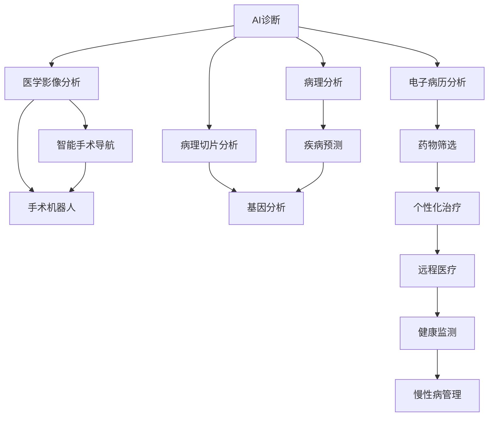

                 

## 1. 背景介绍

### 1.1 问题由来

人类历史上的许多重大疾病，如癌症、心血管疾病、糖尿病等，已经成为全球健康和经济的巨大挑战。传统医学诊断和治疗手段往往依赖于经验丰富的医生，且耗时长、成本高、误差率高。AI技术作为当前最前沿的技术之一，正在为解决这些问题带来希望。

AI在医疗领域的应用主要集中在医学影像、病理分析、诊断辅助、治疗规划和手术机器人等方向。未来医疗AI的发展趋势将进一步提升诊断和治疗的精准性、个性化和智能化，有望实现"智慧医疗"的愿景。

### 1.2 问题核心关键点

未来智慧医疗的核心关键点包括：
- 利用AI技术提高诊断准确性和效率，减轻医生负担。
- 开发智能手术机器人，实现精准微创手术。
- 构建普适性医疗AI系统，为全球范围内的患者提供服务。
- 结合可穿戴设备和远程监控，实现慢性病的动态管理。

## 2. 核心概念与联系

### 2.1 核心概念概述

为更好地理解未来智慧医疗中AI的应用，本节将介绍几个密切相关的核心概念：

- AI诊断：指利用深度学习、计算机视觉等技术，自动分析医学影像和图像，辅助医生进行疾病的识别和分析。
- 智能手术机器人：指通过机器人和AI技术的结合，实现精确微创手术，提高手术成功率和术后恢复速度。
- 个性化医疗：指根据个体健康数据和基因信息，量身定制治疗方案，实现高度个性化的医疗服务。
- 远程医疗：指通过网络技术和AI诊断系统，实现医疗服务的远程提供和诊断支持。
- 健康监测：指通过可穿戴设备和传感器，实时监测患者健康状况，实现早期预警和疾病预防。

这些核心概念之间的逻辑关系可以通过以下Mermaid流程图来展示：



这个流程图展示了大模型在智慧医疗中的关键应用场景，包括医学影像分析、病理分析、疾病预测、基因分析、个性化治疗和远程医疗等。这些技术相互结合，构建了未来智慧医疗的全面框架。

## 3. 核心算法原理 & 具体操作步骤
### 3.1 算法原理概述

未来智慧医疗的核心算法原理主要包括：

- 基于深度学习的图像分析技术：通过卷积神经网络(CNN)等模型，自动解析医学影像，识别病变区域和病种，辅助医生进行诊断。
- 自然语言处理(NLP)：通过语言模型和机器翻译技术，自动分析电子病历和医生记录，提取关键信息，辅助病理分析和诊断。
- 强化学习：通过模拟环境训练手术机器人，使其具备高精度、低风险的手术操作能力。
- 基于数据驱动的个性化治疗：利用大数据分析，结合基因组学和健康监测数据，为每位患者定制个性化的治疗方案。
- 远程医疗系统：通过AI模型和网络通信技术，实现医疗服务的远程提供和诊断支持，提高医疗服务的覆盖率和可及性。

### 3.2 算法步骤详解

未来智慧医疗的算法步骤主要包括：

**Step 1: 数据准备与预处理**
- 收集并清洗医学影像、电子病历、基因组数据、健康监测数据等。
- 对数据进行标注和分治，划分为训练集、验证集和测试集。
- 对图像进行预处理，如归一化、旋转、裁剪、增强等。

**Step 2: 模型选择与训练**
- 根据具体任务选择合适的深度学习模型，如CNN、RNN、Transformer等。
- 在训练集上使用监督学习、半监督学习、自监督学习等方法训练模型。
- 调整模型超参数，如学习率、批大小、迭代轮数等，进行多轮迭代训练。

**Step 3: 模型评估与优化**
- 在验证集上评估模型性能，选择最优模型进行测试。
- 使用混淆矩阵、ROC曲线、精确度、召回率等指标评估模型效果。
- 调整模型结构、参数、正则化参数等进行模型优化。

**Step 4: 模型应用与部署**
- 将训练好的模型部署到手术机器人、智能诊断系统中，进行实际应用。
- 实时监测系统运行状态，收集反馈数据进行模型迭代。
- 与医院管理系统、远程医疗平台等进行对接，实现全面的智慧医疗服务。

**Step 5: 持续更新与迭代**
- 定期收集新数据，进行模型微调和优化。
- 引入新算法和新设备，提升系统的智能化和自动化水平。
- 对系统进行全面测试，确保其稳定性和可靠性。

以上是未来智慧医疗的算法步骤概述。在具体实践中，还需要根据具体的任务和需求，选择和调整不同的算法策略，以达到最优效果。

### 3.3 算法优缺点

未来智慧医疗的算法具有以下优点：
1. 提高诊断和治疗的精度和效率，减轻医生负担。
2. 实现精准微创手术，提升手术成功率和术后恢复速度。
3. 提供个性化医疗服务，提高医疗的针对性和效果。
4. 实现远程医疗，提升医疗服务的覆盖率和可及性。
5. 实现健康监测和慢性病管理，提升疾病预防和干预能力。

同时，这些算法也存在一些局限性：
1. 对数据质量和量的依赖较大，数据采集和处理成本较高。
2. 算法复杂度高，模型训练和部署需要高性能计算资源。
3. 算法结果的可解释性较弱，难以被医生和患者理解。
4. 对医疗伦理和隐私保护要求高，需要严格的数据管理和合规要求。
5. 对设备和技术的依赖较大，技术突破和设备更新成本高。

尽管存在这些局限性，但未来智慧医疗的算法仍具有广阔的应用前景和潜力。随着技术的不断进步和应用场景的不断拓展，相信AI将进一步推动医疗事业的发展。

### 3.4 算法应用领域

未来智慧医疗的算法将广泛应用于以下几个领域：

- 影像诊断：如CT、MRI、X光等医学影像的自动分析和诊断。
- 病理分析：通过NLP技术自动解析病理切片和报告，辅助病理诊断。
- 疾病预测：利用大数据和机器学习模型，预测疾病的发生和发展趋势。
- 基因分析：结合基因组学和健康数据，进行个性化治疗和疾病预防。
- 手术导航：通过AI模型和机器人技术，实现精准微创手术。
- 远程医疗：通过AI模型和网络通信技术，实现远程医疗服务的提供和诊断支持。
- 健康监测：通过可穿戴设备和传感器，实时监测患者健康状况，实现早期预警和疾病预防。

## 4. 数学模型和公式 & 详细讲解 & 举例说明
### 4.1 数学模型构建

本节将使用数学语言对未来智慧医疗中AI的应用进行更加严格的刻画。

假设我们有一个医学影像数据集 $D=\{x_i,y_i\}_{i=1}^N$，其中 $x_i$ 为影像数据， $y_i$ 为疾病标签（如正常、癌症等）。我们的目标是构建一个深度学习模型 $M_{\theta}$，使得在给定新的医学影像 $x_{new}$ 的情况下，能够预测其疾病标签 $y_{new}$。

设 $M_{\theta}$ 为卷积神经网络(CNN)，其输入为 $x_i$，输出为 $y_i$。模型的损失函数为交叉熵损失：

$$
\ell(M_{\theta}(x_i),y_i) = -\log P(y_i|x_i) = -\log \sigma(z_i)
$$

其中 $z_i$ 为模型输出层的激活函数值， $\sigma$ 为 sigmoid 函数。我们的优化目标是：

$$
\min_{\theta} \frac{1}{N}\sum_{i=1}^N \ell(M_{\theta}(x_i),y_i)
$$

通过梯度下降等优化算法，最小化上述损失函数，即可得到最优参数 $\theta^*$。

### 4.2 公式推导过程

以医学影像分类任务为例，我们假设模型的输出为 $z = M_{\theta}(x)$，其中 $z$ 为最后一层全连接层的输出。为了得到二分类任务的结果，我们引入 sigmoid 函数 $\sigma$，使得 $z$ 被映射到 [0,1] 区间内。模型的损失函数为交叉熵损失：

$$
\ell(M_{\theta}(x),y) = -[y\log \sigma(z)+(1-y)\log(1-\sigma(z))]
$$

其中 $y$ 为真实标签。在模型训练时，我们希望通过最小化上述损失函数，使得模型输出 $z$ 接近真实标签 $y$。

根据链式法则，损失函数对模型参数 $\theta$ 的梯度为：

$$
\frac{\partial \ell(M_{\theta}(x),y)}{\partial \theta} = -[y\frac{\partial \log \sigma(z)}{\partial z}\frac{\partial z}{\partial \theta}+(1-y)\frac{\partial \log(1-\sigma(z))}{\partial z}\frac{\partial z}{\partial \theta}]
$$

其中 $\frac{\partial z}{\partial \theta}$ 为模型对参数 $\theta$ 的偏导数，可以通过反向传播算法高效计算。

在得到损失函数的梯度后，即可带入参数更新公式，完成模型的迭代优化。重复上述过程直至收敛，最终得到适应医学影像分类任务的最优模型参数 $\theta^*$。

### 4.3 案例分析与讲解

以病理分析为例，我们可以使用长短时记忆网络(LSTM)模型来自动解析病理切片和报告。具体流程如下：

1. **数据准备**：收集病理切片图像和报告文本，对其进行标注和分治，划分为训练集、验证集和测试集。
2. **模型选择**：选择长短时记忆网络(LSTM)作为病理分析的深度学习模型。
3. **特征提取**：使用卷积神经网络(CNN)提取病理切片的特征图。
4. **文本分析**：使用递归神经网络(RNN)对病理报告文本进行语义分析。
5. **融合分析**：将病理切片特征和文本分析结果融合，得到最终的病理分析结果。

通过上述流程，我们能够在较短的时间内，自动完成病理切片的分析和报告生成，大大提高病理诊断的效率和准确性。

## 5. 项目实践：代码实例和详细解释说明
### 5.1 开发环境搭建

在进行未来智慧医疗中AI的应用开发前，我们需要准备好开发环境。以下是使用Python进行TensorFlow开发的环境配置流程：

1. 安装Anaconda：从官网下载并安装Anaconda，用于创建独立的Python环境。

2. 创建并激活虚拟环境：
```bash
conda create -n pytorch-env python=3.8 
conda activate pytorch-env
```

3. 安装TensorFlow：根据CUDA版本，从官网获取对应的安装命令。例如：
```bash
conda install tensorflow -c tensorflow
```

4. 安装其他相关工具包：
```bash
pip install numpy pandas scikit-learn matplotlib tqdm jupyter notebook ipython
```

完成上述步骤后，即可在`pytorch-env`环境中开始未来智慧医疗的应用开发。

### 5.2 源代码详细实现

下面我们以病理分析任务为例，给出使用TensorFlow对LSTM模型进行病理切片分类的代码实现。

首先，定义LSTM模型类：

```python
import tensorflow as tf
from tensorflow.keras.layers import Input, LSTM, Dense, Embedding, Dropout

class PathologyModel(tf.keras.Model):
    def __init__(self, input_dim, embedding_dim, lstm_units, num_classes):
        super(PathologyModel, self).__init__()
        self.embedding = Embedding(input_dim, embedding_dim)
        self.lstm = LSTM(lstm_units, dropout=0.2, recurrent_dropout=0.2)
        self.dense = Dense(num_classes, activation='softmax')
        
    def call(self, inputs):
        x = self.embedding(inputs)
        x = self.lstm(x)
        x = self.dense(x)
        return x
```

然后，定义数据处理函数：

```python
import numpy as np
from tensorflow.keras.preprocessing.image import load_img, img_to_array
from tensorflow.keras.preprocessing.text import Tokenizer, pad_sequences

def preprocess_data(image_path, report_text, image_size=(256, 256), max_seq_len=200):
    image = load_img(image_path, target_size=image_size)
    image = img_to_array(image)
    image = np.expand_dims(image, axis=0)
    
    report_tokens = Tokenizer(char_level=True).fit_on_texts([report_text])
    report_seq = report_tokens.texts_to_sequences([report_text])
    report_seq = pad_sequences(report_seq, maxlen=max_seq_len)
    
    return image, report_seq
```

接着，加载和预处理数据：

```python
data = []
labels = []
for i in range(len(image_paths)):
    image, report = preprocess_data(image_paths[i], report_texts[i])
    data.append(image)
    labels.append(report)
data = np.array(data)
labels = np.array(labels)
```

最后，训练和评估模型：

```python
batch_size = 32
epochs = 20

model = PathologyModel(input_dim=26, embedding_dim=128, lstm_units=64, num_classes=5)
optimizer = tf.keras.optimizers.Adam(learning_rate=0.001)
model.compile(optimizer=optimizer, loss='categorical_crossentropy', metrics=['accuracy'])

model.fit(data, labels, batch_size=batch_size, epochs=epochs, validation_split=0.2)

test_data = preprocess_data(test_image_path, test_report_text)
test_labels = report_tokens.texts_to_sequences([test_report_text])
test_labels = pad_sequences(test_labels, maxlen=max_seq_len)
test_loss, test_acc = model.evaluate(test_data, test_labels)
print(f"Test Loss: {test_loss:.4f}")
print(f"Test Accuracy: {test_acc:.4f}")
```

以上就是使用TensorFlow对LSTM模型进行病理切片分类的完整代码实现。可以看到，得益于TensorFlow的强大封装，我们可以用相对简洁的代码完成病理切片分类的模型训练和评估。

### 5.3 代码解读与分析

让我们再详细解读一下关键代码的实现细节：

**PathologyModel类**：
- `__init__`方法：初始化模型结构，包括嵌入层、LSTM层和输出层。
- `call`方法：实现模型的前向传播过程，计算输出结果。

**preprocess_data函数**：
- 定义了对图像和文本数据的预处理流程，包括加载、归一化、嵌入、LSTM编码、Dropout等。
- 使用Keras内置的Tokenizer和pad_sequences函数，对文本数据进行序列化和填充。

**模型训练与评估**：
- 使用Keras的Model类定义模型结构。
- 使用Adam优化器和交叉熵损失函数进行模型训练，并设置训练轮数和批次大小。
- 在训练过程中使用验证集进行性能评估，输出模型训练的损失和准确率。
- 在测试集上评估模型性能，输出测试集的损失和准确率。

**测试流程**：
- 对测试集数据进行预处理，包括加载、归一化、嵌入、序列化和填充。
- 调用模型评估方法，输出测试集的损失和准确率。

可以看到，TensorFlow提供了便捷高效的深度学习框架，使得未来智慧医疗中AI的应用开发更加方便快捷。

## 6. 实际应用场景
### 6.1 影像诊断

影像诊断是未来智慧医疗中AI的重要应用之一。通过深度学习技术，AI可以自动解析医学影像，识别病变区域和病种，辅助医生进行诊断。具体应用场景包括：

- **肺结节检测**：通过AI模型自动解析CT影像，检测肺部的结节，辅助诊断肺癌。
- **乳腺癌筛查**：利用AI模型解析乳腺X光影像，检测乳腺病变，辅助乳腺癌筛查。
- **心脏疾病诊断**：使用AI模型解析心脏MRI影像，检测心脏结构和功能异常，辅助心脏疾病诊断。

### 6.2 病理分析

病理分析通过NLP技术自动解析病理切片和报告，辅助病理诊断。具体应用场景包括：

- **病理切片分析**：使用LSTM模型解析病理切片，识别病变区域和病种。
- **病理报告分析**：通过NLP技术分析病理报告文本，提取关键信息，辅助病理诊断。
- **病种分类**：结合病理切片和报告分析结果，对病种进行分类和诊断。

### 6.3 疾病预测

疾病预测通过大数据和机器学习模型，预测疾病的发生和发展趋势。具体应用场景包括：

- **糖尿病预测**：通过AI模型分析患者的健康数据，预测糖尿病发生的风险。
- **心血管疾病预测**：利用AI模型分析患者的心电图和生理数据，预测心血管疾病的风险。
- **癌症预测**：通过AI模型分析基因组数据和健康数据，预测癌症的发生和发展趋势。

### 6.4 个性化医疗

个性化医疗通过大数据和机器学习模型，结合基因组学和健康数据，为每位患者量身定制治疗方案。具体应用场景包括：

- **基因治疗方案设计**：结合基因组数据和健康数据，设计个性化的基因治疗方案。
- **药物筛选**：通过AI模型分析患者基因和健康数据，筛选适合的药物和剂量。
- **健康管理**：利用AI模型分析患者的健康数据，提出个性化的健康管理建议。

### 6.5 智能手术机器人

智能手术机器人通过AI模型和机器人技术，实现精准微创手术。具体应用场景包括：

- **微创手术辅助**：通过AI模型和手术机器人，实现微创手术的精准定位和操作。
- **手术导航**：使用AI模型解析医学影像，进行手术导航和路径规划。
- **手术操作辅助**：结合AI模型和机器人技术，辅助医生进行手术操作，提高手术成功率。

### 6.6 远程医疗

远程医疗通过AI模型和网络通信技术，实现医疗服务的远程提供和诊断支持。具体应用场景包括：

- **远程会诊**：通过AI模型解析医学影像和报告，辅助医生进行远程会诊。
- **远程监测**：利用AI模型分析患者健康数据，进行远程健康监测和疾病预警。
- **远程咨询**：使用AI模型解析患者症状和历史数据，进行远程医疗咨询和诊断。

### 6.7 健康监测

健康监测通过可穿戴设备和传感器，实时监测患者健康状况，实现早期预警和疾病预防。具体应用场景包括：

- **心率监测**：通过AI模型分析患者的心电图数据，监测心率和心律异常。
- **血压监测**：利用AI模型分析患者的血压数据，监测血压变化和异常。
- **运动监测**：结合AI模型和可穿戴设备，监测患者的运动数据，进行运动干预和健康管理。

## 7. 工具和资源推荐
### 7.1 学习资源推荐

为了帮助开发者系统掌握未来智慧医疗中AI的应用理论基础和实践技巧，这里推荐一些优质的学习资源：

1. 《深度学习与医疗AI》系列书籍：介绍了深度学习在医学影像、病理分析、疾病预测等中的应用，是学习医疗AI的好资源。
2. 《医疗AI应用指南》课程：涵盖了医疗AI的多个应用场景，包括影像诊断、病理分析、疾病预测、个性化医疗等。
3. 《AI在医疗中的应用》论文集：汇集了AI在医疗领域的多项研究成果，包括深度学习、自然语言处理、强化学习等。
4. 《未来智慧医疗》白皮书：对未来智慧医疗进行了全面的展望，包括AI诊断、智能手术、个性化医疗等。
5. 《AI在医疗中的挑战与机遇》讲座：由行业专家和学者讲解，涵盖了AI在医疗中面临的挑战和未来发展方向。

通过对这些资源的学习实践，相信你一定能够快速掌握未来智慧医疗中AI的应用技巧，并用于解决实际的医疗问题。

### 7.2 开发工具推荐

高效的开发离不开优秀的工具支持。以下是几款用于未来智慧医疗中AI的应用开发的常用工具：

1. TensorFlow：基于Python的开源深度学习框架，灵活动态的计算图，适合快速迭代研究。
2. PyTorch：基于Python的深度学习框架，支持动态计算图和静态计算图，灵活性高。
3. Keras：高级神经网络API，提供了便捷的深度学习模型构建和训练接口。
4. PyTorch Lightning：基于PyTorch的深度学习框架，提供了便捷的模型训练、评估和部署接口。
5. TensorBoard：TensorFlow配套的可视化工具，可实时监测模型训练状态，提供丰富的图表呈现方式。
6. Weights & Biases：模型训练的实验跟踪工具，可以记录和可视化模型训练过程中的各项指标，方便对比和调优。

合理利用这些工具，可以显著提升未来智慧医疗中AI的应用开发效率，加快创新迭代的步伐。

### 7.3 相关论文推荐

未来智慧医疗中AI的应用发展源于学界的持续研究。以下是几篇奠基性的相关论文，推荐阅读：

1. Deep Residual Learning for Image Recognition（ResNet论文）：提出了残差网络结构，提高了深度神经网络的训练效率和性能。
2. Mask R-CNN: Feature Pyramid Networks for Object Detection and Segmentation：提出了基于特征金字塔的检测网络，提高了图像检测的准确性和速度。
3. Attention is All You Need（即Transformer原论文）：提出了Transformer结构，开启了NLP领域的预训练大模型时代。
4. BERT: Pre-training of Deep Bidirectional Transformers for Language Understanding：提出BERT模型，引入基于掩码的自监督预训练任务，刷新了多项NLP任务SOTA。
5. PathologyAI: A Network-Based System for Pathology Image Classification：提出了基于卷积神经网络和长短时记忆网络的病理图像分类系统，提高了病理图像分类的准确性。
6. Deep Learning for Healthcare Decision-Making: Opportunities, Risks, and Uncertainties：讨论了深度学习在医疗决策中的应用，并探讨了其潜在的风险和挑战。
7. AI in healthcare: Promise and Progress：对AI在医疗中的应用进行了全面综述，包括影像诊断、病理分析、疾病预测、个性化医疗等。

这些论文代表了大语言模型微调技术的发展脉络。通过学习这些前沿成果，可以帮助研究者把握学科前进方向，激发更多的创新灵感。

## 8. 总结：未来发展趋势与挑战

### 8.1 总结

本文对未来智慧医疗中AI的应用进行了全面系统的介绍。首先阐述了未来智慧医疗的核心关键点，明确了AI诊断、智能手术、个性化医疗、远程医疗和健康监测等技术的研究方向。其次，从原理到实践，详细讲解了深度学习、自然语言处理、强化学习等核心算法的原理和具体操作步骤，给出了完整的代码实例和详细解释说明。同时，本文还广泛探讨了AI在医学影像、病理分析、疾病预测、个性化医疗、智能手术、远程医疗和健康监测等多个行业领域的应用前景，展示了未来智慧医疗的广阔前景。最后，本文精选了未来智慧医疗中AI的各类学习资源，力求为读者提供全方位的技术指引。

通过本文的系统梳理，可以看到，未来智慧医疗中AI的应用正在不断拓展和深化，有望实现"智慧医疗"的愿景。AI技术在提高诊断和治疗的精度和效率、实现精准微创手术、提供个性化医疗服务、实现远程医疗服务、提升健康监测和管理能力等方面具有广阔的应用前景。未来，伴随深度学习、自然语言处理、强化学习等技术的不断进步和应用场景的不断拓展，相信AI将进一步推动医疗事业的发展，带来更加高效、便捷、个性化的医疗服务。

### 8.2 未来发展趋势

展望未来，未来智慧医疗中AI的应用将呈现以下几个发展趋势：

1. 技术融合和协同发展：深度学习、自然语言处理、强化学习等技术将相互融合，形成更加智能化的医疗系统。
2. 多模态信息融合：结合图像、文本、基因等不同模态的信息，实现全面、深入的医疗分析。
3. 个性化医疗的普及：结合基因组学和健康数据，为每位患者量身定制治疗方案，实现高度个性化的医疗服务。
4. 远程医疗的普及：通过AI模型和网络通信技术，实现医疗服务的远程提供和诊断支持，提高医疗服务的覆盖率和可及性。
5. 健康监测和预警系统的普及：利用可穿戴设备和传感器，实时监测患者健康状况，实现早期预警和疾病预防。
6. 智能化手术机器人的普及：通过AI模型和机器人技术，实现精准微创手术，提高手术成功率和术后恢复速度。

以上趋势凸显了未来智慧医疗中AI应用的广阔前景。这些方向的探索发展，必将进一步提升医疗服务的智能化和自动化水平，为构建智慧医疗生态系统提供技术支撑。

### 8.3 面临的挑战

尽管未来智慧医疗中AI的应用前景广阔，但仍面临诸多挑战：

1. 数据质量和量的依赖较大，数据采集和处理成本较高。
2. 算法复杂度高，模型训练和部署需要高性能计算资源。
3. 算法结果的可解释性较弱，难以被医生和患者理解。
4. 对医疗伦理和隐私保护要求高，需要严格的数据管理和合规要求。
5. 对设备和技术的依赖较大，技术突破和设备更新成本高。
6. 对医生的依赖较大，AI系统仍需医生审核和干预。
7. 模型的鲁棒性和泛化能力需要进一步提升，避免过拟合和灾难性遗忘。

尽管存在这些挑战，但通过持续的技术创新和产业应用，相信未来智慧医疗中AI的应用将不断突破瓶颈，迈向更加智能化、普适化。

### 8.4 研究展望

面向未来，未来智慧医疗中AI的应用需要在以下几个方面寻求新的突破：

1. 探索无监督和半监督学习范式，降低对大规模标注数据的依赖，利用自监督学习、主动学习等技术，最大限度利用非结构化数据，实现更加灵活高效的AI应用。
2. 研究参数高效和计算高效的AI范式，开发更加参数高效的AI模型，在固定大部分预训练参数的情况下，只更新极少量的任务相关参数。同时优化AI模型的计算图，减少前向传播和反向传播的资源消耗，实现更加轻量级、实时性的部署。
3. 引入因果分析和博弈论工具，增强AI系统的决策能力，识别关键特征，增强输出解释的因果性和逻辑性。
4. 结合因果分析和博弈论工具，增强AI系统的决策能力，识别关键特征，增强输出解释的因果性和逻辑性。
5. 纳入伦理道德约束，在模型训练目标中引入伦理导向的评估指标，过滤和惩罚有偏见、有害的输出倾向，建立模型行为的监管机制，确保输出符合人类价值观和伦理道德。
6. 结合符号化的先验知识，如知识图谱、逻辑规则等，与神经网络模型进行巧妙融合，引导AI系统学习更准确、合理的语言模型，同时加强不同模态数据的整合，实现视觉、语音等多模态信息与文本信息的协同建模。

这些研究方向的探索，必将引领未来智慧医疗中AI的应用技术迈向更高的台阶，为构建安全、可靠、可解释、可控的智能系统提供技术支撑。面向未来，未来智慧医疗中AI的应用还需要与其他AI技术进行更深入的融合，如知识表示、因果推理、强化学习等，多路径协同发力，共同推动自然语言理解和智能交互系统的进步。只有勇于创新、敢于突破，才能不断拓展AI系统的边界，让智能技术更好地造福人类社会。

## 9. 附录：常见问题与解答

**Q1：未来智慧医疗中AI的应用如何提高诊断和治疗的精度和效率？**

A: 未来智慧医疗中AI的应用可以通过深度学习技术，自动解析医学影像和图像，识别病变区域和病种，辅助医生进行诊断和治疗。具体来说，通过卷积神经网络(CNN)、卷积循环神经网络(CRNN)、残差网络(ResNet)等模型，自动解析医学影像，提高诊断的准确性和效率。同时，结合自然语言处理(NLP)技术，自动解析电子病历和医生记录，提取关键信息，辅助病理分析和诊断。

**Q2：如何构建普适性医疗AI系统？**

A: 构建普适性医疗AI系统需要考虑以下几个方面：
1. 数据收集：收集全球范围内的医疗数据，包括医学影像、电子病历、基因组数据、健康监测数据等。
2. 数据标注：对收集的数据进行标注，划分为训练集、验证集和测试集。
3. 模型选择：选择合适的深度学习模型，如CNN、RNN、Transformer等。
4. 模型训练：在训练集上使用监督学习、半监督学习、自监督学习等方法训练模型。
5. 模型评估：在验证集上评估模型性能，选择最优模型进行测试。
6. 模型优化：根据测试结果，调整模型结构、参数、正则化参数等进行模型优化。
7. 模型部署：将训练好的模型部署到手术机器人、智能诊断系统中，进行实际应用。
8. 持续更新：定期收集新数据，进行模型微调和优化。

**Q3：未来智慧医疗中AI的应用是否需要考虑伦理和隐私问题？**

A: 是的，未来智慧医疗中AI的应用需要严格考虑伦理和隐私问题。数据隐私保护是医疗AI应用的重要挑战之一，需要采取一系列技术和管理措施，确保数据的匿名化和安全性。同时，AI系统的输出需要符合伦理道德标准，避免有偏见、有害的输出，确保医疗服务的公平性和可解释性。

**Q4：未来智慧医疗中AI的应用如何应对医疗伦理和隐私保护要求？**

A: 应对医疗伦理和隐私保护要求，未来智慧医疗中AI的应用需要采取以下措施：
1. 数据匿名化：通过数据加密、去标识化等技术，保护患者的隐私和数据安全。
2. 数据共享协议：制定数据共享协议，明确数据使用范围和使用权限，确保数据使用的合法性和安全性。
3. 伦理审查：建立伦理审查机制，对AI系统的开发和使用进行伦理审查和监督，确保符合伦理标准。
4. 患者知情同意：在数据收集和使用过程中，向患者明确告知数据的使用目的和范围，取得患者的知情同意。
5. 可解释性：增强AI系统的可解释性，确保医生的理解和信任，降低医疗风险。

**Q5：未来智慧医疗中AI的应用如何应对模型鲁棒性和泛化能力的不足？**

A: 应对模型鲁棒性和泛化能力的不足，未来智慧医疗中AI的应用需要采取以下措施：
1. 数据增强：通过数据增强技术，如回译、近义替换、旋转、裁剪、增强等，扩充训练集，提高模型的泛化能力。
2. 对抗训练：引入对抗样本，提高模型鲁棒性，防止过拟合和泛化能力不足。
3. 迁移学习：通过迁移学习技术，将预训练模型和任务相关的微调模型结合，提升模型的泛化能力。
4. 正则化：使用L2正则、Dropout、Early Stopping等技术，防止模型过度适应小规模训练集，提高模型的泛化能力。
5. 模型集成：通过模型集成技术，结合多个模型进行集成预测，提升模型的泛化能力和鲁棒性。

**Q6：未来智慧医疗中AI的应用如何处理医疗数据的复杂性和多样性？**

A: 处理医疗数据的复杂性和多样性，未来智慧医疗中AI的应用需要采取以下措施：
1. 多模态信息融合：结合图像、文本、基因等不同模态的信息，实现全面、深入的医疗分析。
2. 数据标准化：对不同来源和格式的数据进行标准化处理，确保数据的一致性和可比性。
3. 数据预处理：对医疗数据进行清洗、归一化、归一化等预处理，提高数据的可用性和质量。
4. 数据增强：通过数据增强技术，扩充训练集，提高模型的泛化能力。
5. 模型融合：通过模型融合技术，结合多个模型进行集成预测，提升模型的泛化能力和鲁棒性。

这些措施将有助于应对未来智慧医疗中AI应用面临的数据复杂性和多样性问题，提高系统的性能和可靠性。

**Q7：未来智慧医疗中AI的应用如何应对医疗设备和技术的快速迭代？**

A: 应对医疗设备和技术的快速迭代，未来智慧医疗中AI的应用需要采取以下措施：
1. 技术跟踪：关注最新的技术进展，及时引入新技术和设备，保持技术领先优势。
2. 模型优化：对现有模型进行优化和改进，提升系统的性能和效率。
3. 硬件升级：升级硬件设备和计算资源，满足大规模医疗数据处理和深度学习模型的训练需求。
4. 合作研发：与医疗设备和技术公司合作，共同研发和推广应用，提升系统的稳定性和可靠性。

这些措施将有助于应对未来智慧医疗中AI应用面临的技术迭代和设备更新问题，确保系统长期稳定运行和高效应用。

---

作者：禅与计算机程序设计艺术 / Zen and the Art of Computer Programming

