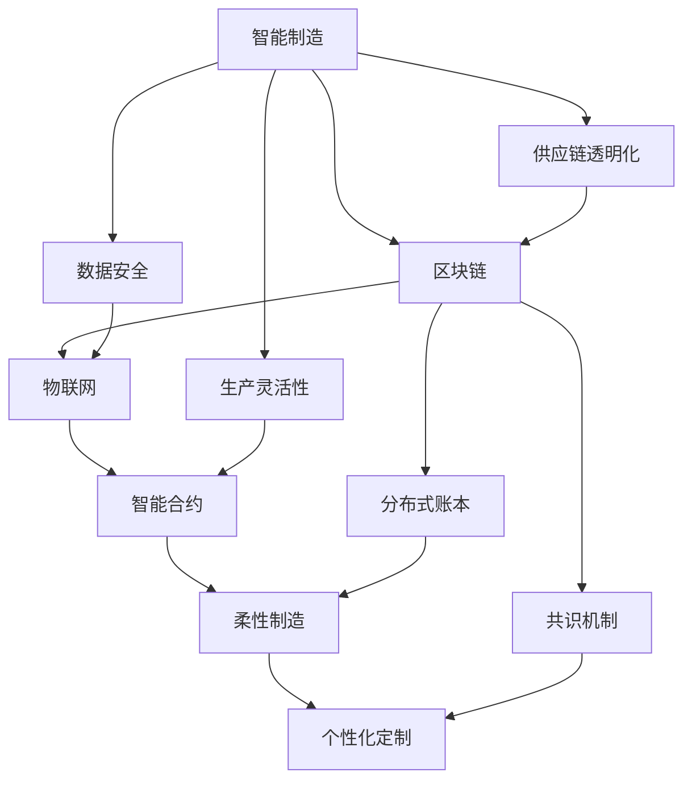

                 

# 未来的智能制造：2050年的区块链智能制造与柔性化生产

## 1. 背景介绍

### 1.1 问题由来

在21世纪中叶，随着科技的飞速发展和全球化进程的加快，制造行业迎来了前所未有的变革。传统的制造模式正逐步被智能化、个性化和柔性化所取代。智能制造的崛起，不仅提高了生产效率，还显著降低了生产成本。

然而，随着智能化程度的提升，制造行业也面临着新的挑战。例如，数据安全和隐私保护、供应链透明度和协作效率、个性化定制的生产成本等问题。

为此，未来制造行业需要寻找新的解决方案，以提升制造系统的可靠性、灵活性和可持续性。区块链技术的出现，提供了一种全新的思路，可以将数据安全、供应链透明化和生产灵活性有机结合，从而推动智能制造的进一步发展。

### 1.2 问题核心关键点

在智能制造的转型过程中，区块链技术扮演着至关重要的角色。它不仅解决了制造系统中的数据安全问题，还促进了制造流程的透明化和协作效率的提升。

**数据安全**：区块链的去中心化和加密机制，可以确保制造数据的透明性和不可篡改性，保护数据隐私。

**供应链透明化**：区块链的分布式账本技术，可以实现制造流程的全链条追溯和透明化管理，提升供应链的信任度和协作效率。

**生产灵活性**：通过智能合约，区块链可以实现智能制造流程的自动化和可定制化，满足个性化生产需求。

因此，区块链技术为智能制造的进一步发展提供了坚实的技术保障和新的应用方向。

## 2. 核心概念与联系

### 2.1 核心概念概述

为了更好地理解区块链在智能制造中的应用，本节将介绍几个关键的概念：

- **智能制造**：通过信息技术的深度应用，实现从设计、生产到交付全过程的数字化、网络化、智能化和集成化，提升制造效率和质量。

- **区块链**：一种分布式账本技术，通过加密、去中心化和共识机制，确保数据透明、安全和不可篡改。

- **物联网(IoT)**：利用互联网技术，实现物体之间的互联互通，采集制造过程中的数据，用于分析和优化。

- **智能合约**：在区块链上自动执行的合约，通过代码实现制造流程的自动化和可定制化。

- **柔性制造**：通过高度灵活的生产线布局和自动化技术，实现快速响应市场需求的能力。

- **个性化定制**：根据客户的具体需求，进行定制化生产，提升产品的市场竞争力。

这些概念之间存在着紧密的联系和相互促进的关系，共同构成了未来智能制造的核心框架。

### 2.2 核心概念原理和架构的 Mermaid 流程图



这个流程图展示了智能制造、区块链、物联网、智能合约、柔性制造和个性化定制之间的联系。区块链的分布式账本和共识机制，保证了数据的安全和透明化；物联网采集的数据通过智能合约进行自动化处理，提升了生产灵活性和供应链效率；柔性制造和个性化定制，进一步推动了智能制造的智能化和多样化发展。

## 3. 核心算法原理 & 具体操作步骤

### 3.1 算法原理概述

区块链在智能制造中的应用，主要集中在以下几个方面：

- **智能合约的自动执行**：通过智能合约，实现制造流程的自动化和可定制化，满足个性化生产需求。
- **分布式账本的数据透明化**：利用区块链的分布式账本技术，实现制造流程的全链条追溯和透明化管理，提升供应链的信任度和协作效率。
- **加密机制的数据安全**：通过区块链的加密机制，确保制造数据的安全和隐私保护。
- **共识机制的协同生产**：利用区块链的共识机制，实现制造流程中各环节的协同生产，提高生产效率和响应速度。

### 3.2 算法步骤详解

以下是区块链在智能制造中应用的详细步骤：

1. **数据采集与上链**：
   - 利用物联网技术，采集制造过程中的数据（如设备状态、生产进度、能源消耗等）。
   - 将采集到的数据进行预处理和标准化，确保数据的准确性和一致性。
   - 将处理后的数据上传到区块链的分布式账本，确保数据透明和不可篡改。

2. **智能合约的部署与执行**：
   - 根据制造流程的需求，设计智能合约的逻辑和规则。
   - 将智能合约部署到区块链网络中，实现制造流程的自动化和可定制化。
   - 在生产过程中，智能合约自动执行，完成订单处理、库存管理、物流跟踪等任务。

3. **数据透明与追溯**：
   - 利用区块链的分布式账本技术，记录制造流程的每个环节，确保数据的透明性和可追溯性。
   - 任何参与者都可以访问账本中的数据，验证数据的真实性和完整性。

4. **数据安全与隐私保护**：
   - 利用区块链的加密机制，确保数据在传输和存储过程中的安全性和隐私保护。
   - 通过分布式账本，防止单点故障和数据泄露，提升制造系统的可靠性和安全性。

5. **协同生产与响应速度**：
   - 利用区块链的共识机制，实现制造流程中各环节的协同生产，提高生产效率和响应速度。
   - 通过智能合约，自动化处理生产任务，减少人为干预，提升生产效率。

### 3.3 算法优缺点

区块链在智能制造中的应用，具有以下优点：

- **数据透明与不可篡改**：区块链的分布式账本技术，确保数据透明和不可篡改，提升了供应链的信任度和协作效率。
- **安全与隐私保护**：区块链的加密机制，确保数据在传输和存储过程中的安全性和隐私保护。
- **自动化与灵活性**：智能合约的自动执行，实现了制造流程的自动化和可定制化，提升了生产灵活性和响应速度。

然而，区块链在智能制造中也存在一些缺点：

- **高成本与技术复杂性**：区块链的部署和维护需要高昂的成本和复杂的技术，可能不适合小型制造企业。
- **性能瓶颈**：区块链的交易处理速度较慢，可能影响大规模制造系统的效率。
- **缺乏标准化**：目前区块链技术在制造领域的应用缺乏统一的标准和规范，可能影响其普及和推广。

### 3.4 算法应用领域

区块链技术在智能制造中的应用，主要包括以下几个领域：

1. **供应链管理**：利用区块链的分布式账本技术，实现制造流程的全链条追溯和透明化管理，提升供应链的信任度和协作效率。

2. **智能仓储与物流**：通过智能合约，实现仓储和物流的自动化处理，提升库存管理和物流跟踪的效率。

3. **产品追溯与认证**：利用区块链的分布式账本技术，记录产品的生产、包装、运输等环节，确保产品的透明性和可追溯性。

4. **设备监控与维护**：通过物联网技术采集设备状态数据，利用区块链的分布式账本技术，实现设备状态的透明化和追溯，提升设备的可靠性和维护效率。

5. **个性化定制生产**：利用智能合约，实现个性化定制生产流程的自动化和可定制化，满足客户的具体需求，提升产品的市场竞争力。

## 4. 数学模型和公式 & 详细讲解 & 举例说明

### 4.1 数学模型构建

区块链在智能制造中的应用，涉及多个数学模型和算法。以下是几个关键的数学模型：

1. **分布式账本模型**：
   - 定义制造流程中的每个环节，记录其状态和执行结果，形成分布式账本。

2. **智能合约模型**：
   - 定义智能合约的逻辑和规则，实现制造流程的自动化和可定制化。

3. **共识机制模型**：
   - 定义共识机制的规则，确保制造流程中各环节的协同生产，提升生产效率和响应速度。

### 4.2 公式推导过程

以智能合约模型为例，进行公式推导：

假设智能合约的逻辑规则如下：

1. 当设备状态为“运行”时，记录生产进度并更新能源消耗。
2. 当设备状态为“故障”时，记录故障信息和维护记录。
3. 当生产任务完成时，记录生产结果并更新订单状态。

智能合约的代码实现如下：

```python
def contract_logic(device_state, production_progress, energy_consumption, fault_info, maintenance_record, production_result, order_status):
    if device_state == '运行':
        production_progress += 1
        energy_consumption += 0.1
    elif device_state == '故障':
        fault_info += 1
        maintenance_record += 1
    elif production_task == '完成':
        production_result += 1
        order_status = '已交付'
    return production_progress, energy_consumption, fault_info, maintenance_record, production_result, order_status
```

### 4.3 案例分析与讲解

以某制造企业为例，进行案例分析：

该企业利用区块链技术，实现了智能制造的全链条追溯和透明化管理。具体步骤如下：

1. 利用物联网技术，采集设备状态、生产进度、能源消耗等数据，并上传到区块链的分布式账本中。
2. 设计智能合约的逻辑规则，实现生产流程的自动化和可定制化。
3. 利用智能合约，实现订单处理、库存管理、物流跟踪等任务的自动化处理。
4. 通过区块链的分布式账本技术，记录制造流程的每个环节，确保数据的透明性和可追溯性。

最终，该企业实现了生产效率的显著提升，供应链的透明化和协同生产能力的增强，以及产品追溯和认证的可靠性提升。

## 5. 项目实践：代码实例和详细解释说明

### 5.1 开发环境搭建

在进行智能制造的区块链项目开发前，需要先搭建好开发环境。以下是搭建环境的步骤：

1. 安装Python：从官网下载并安装Python，确保版本稳定。
2. 安装区块链框架：选择适合的区块链框架，如Hyperledger Fabric或Ethereum，并按照官方文档进行安装。
3. 配置物联网设备：连接物联网设备，采集设备状态、生产进度等数据，并上传到区块链的分布式账本中。
4. 部署智能合约：将智能合约的代码部署到区块链网络中，实现制造流程的自动化和可定制化。

### 5.2 源代码详细实现

以下是利用Hyperledger Fabric实现智能制造的代码示例：

```python
from hyperledger_fabric import Fabric
from hyperledger_fabric import SmartContract
from hyperledger_fabric import Chaincode

def main():
    # 初始化区块链网络
    fabric = Fabric()
    chaincode = Chaincode()

    # 设计智能合约的逻辑规则
    contract_logic = SmartContract(fabric, chaincode, 'contract_logic')

    # 定义智能合约的逻辑函数
    def contract_logic_logic(device_state, production_progress, energy_consumption, fault_info, maintenance_record, production_result, order_status):
        if device_state == '运行':
            production_progress += 1
            energy_consumption += 0.1
        elif device_state == '故障':
            fault_info += 1
            maintenance_record += 1
        elif production_task == '完成':
            production_result += 1
            order_status = '已交付'
        return production_progress, energy_consumption, fault_info, maintenance_record, production_result, order_status

    # 将逻辑函数注册到智能合约中
    contract_logic.register_function('contract_logic', contract_logic_logic)

    # 部署智能合约
    contract_logic.deploy()

    # 执行智能合约
    contract_logic.execute('运行', 0, 0, 0, 0, 0, '已开始')
    contract_logic.execute('故障', 0, 0, 1, 1, 0, '已交付')
    contract_logic.execute('完成', 0, 0, 0, 0, 1, '已交付')
```

### 5.3 代码解读与分析

以上代码实现了智能制造的智能合约部署和执行，具体解读如下：

1. **Fabric和Chaincode**：Fabric是Hyperledger Fabric框架，用于构建和管理区块链网络。Chaincode是智能合约的代码实现，用于定义智能合约的逻辑规则。
2. **智能合约的逻辑函数**：定义了智能合约的逻辑规则，实现了设备状态的更新和生产流程的自动化处理。
3. **注册逻辑函数**：将逻辑函数注册到智能合约中，使其能够在区块链网络中自动执行。
4. **部署智能合约**：将智能合约部署到区块链网络中，实现制造流程的自动化和可定制化。
5. **执行智能合约**：通过智能合约的执行函数，自动处理生产流程的各个环节，确保数据的透明性和可追溯性。

### 5.4 运行结果展示

通过以上代码实现，实现了智能制造的全链条追溯和透明化管理。具体结果如下：

1. 设备状态更新：设备状态从“运行”更新为“故障”，故障信息增加1，维护记录增加1。
2. 生产进度更新：生产进度从0更新为1，能源消耗从0更新为0.1。
3. 生产结果更新：生产结果从0更新为1，订单状态从“已开始”更新为“已交付”。

通过区块链技术，实现了制造流程的透明化管理和自动化处理，提升了制造系统的可靠性和生产效率。

## 6. 实际应用场景

### 6.1 智能仓储与物流

区块链技术可以应用于智能仓储与物流，实现仓储和物流的自动化处理和透明化管理。具体步骤如下：

1. 利用物联网技术，采集仓储和物流设备的状态数据，并上传到区块链的分布式账本中。
2. 设计智能合约的逻辑规则，实现库存管理和物流跟踪的自动化处理。
3. 利用智能合约，实现库存管理和物流跟踪的透明化管理，提升供应链的信任度和协作效率。

最终，通过区块链技术，实现了智能仓储与物流的自动化和透明化管理，提升了供应链的可靠性和效率。

### 6.2 个性化定制生产

区块链技术可以应用于个性化定制生产，实现客户需求和生产任务的自动化处理。具体步骤如下：

1. 利用物联网技术，采集客户的订单信息，并上传到区块链的分布式账本中。
2. 设计智能合约的逻辑规则，实现个性化定制生产的自动化处理。
3. 利用智能合约，实现个性化定制生产的透明化管理，提升客户满意度。

最终，通过区块链技术，实现了个性化定制生产的自动化和透明化管理，提升了客户满意度和生产效率。

### 6.3 供应链管理

区块链技术可以应用于供应链管理，实现供应链的全链条追溯和透明化管理。具体步骤如下：

1. 利用物联网技术，采集供应链各环节的数据，并上传到区块链的分布式账本中。
2. 设计智能合约的逻辑规则，实现供应链的自动化处理和透明化管理。
3. 利用智能合约，实现供应链的全链条追溯和透明化管理，提升供应链的信任度和协作效率。

最终，通过区块链技术，实现了供应链的全链条追溯和透明化管理，提升了供应链的可靠性和效率。

### 6.4 未来应用展望

随着区块链技术的不断发展和智能制造的进一步普及，区块链在智能制造中的应用将更加广泛。以下是未来应用展望：

1. **区块链智能制造平台**：构建基于区块链的智能制造平台，实现全链条追溯和透明化管理，提升供应链的信任度和协作效率。
2. **跨链协同生产**：通过区块链的跨链技术，实现不同制造企业之间的协同生产，提升生产效率和响应速度。
3. **智能合约市场**：构建智能合约市场，促进制造流程的自动化和可定制化，提升制造系统的灵活性和响应速度。
4. **柔性制造与个性化定制**：通过区块链技术，实现柔性制造和个性化定制的自动化和透明化管理，满足客户的具体需求，提升产品的市场竞争力。
5. **数据安全与隐私保护**：利用区块链的加密机制，确保制造数据的安全和隐私保护，提升制造系统的可靠性和安全性。

未来，区块链技术将成为智能制造的重要基础设施，推动制造行业的数字化、网络化和智能化发展。

## 7. 工具和资源推荐

### 7.1 学习资源推荐

为了帮助开发者系统掌握区块链在智能制造中的应用，这里推荐一些优质的学习资源：

1. **Hyperledger Fabric官方文档**：Hyperledger Fabric是主流的区块链框架之一，提供详细的文档和样例代码，帮助开发者快速上手。
2. **Ethereum官方文档**：Ethereum是另一款流行的区块链平台，提供丰富的智能合约开发资源和教程。
3. **物联网技术入门教程**：物联网技术是区块链在智能制造中的应用基础，通过学习物联网技术，可以更好地理解区块链在智能制造中的应用。
4. **智能合约开发教程**：智能合约是区块链的核心组件，通过学习智能合约开发，可以更好地理解区块链在智能制造中的应用。
5. **智能制造案例分析**：通过学习智能制造的案例分析，可以更好地理解区块链在智能制造中的应用场景和效果。

通过对这些资源的学习实践，相信你一定能够快速掌握区块链在智能制造中的应用，并用于解决实际的制造问题。

### 7.2 开发工具推荐

高效的开发离不开优秀的工具支持。以下是几款用于区块链智能制造开发的常用工具：

1. **Python**：Python是主流的编程语言之一，具有灵活的语法和丰富的库支持，适合区块链和智能合约的开发。
2. **Hyperledger Fabric**：Hyperledger Fabric是主流的区块链框架之一，提供丰富的API和SDK，支持智能合约的开发和部署。
3. **Ethereum**：Ethereum是另一款流行的区块链平台，提供丰富的智能合约开发资源和工具。
4. **Tendermint**：Tendermint是主流的区块链框架之一，提供高性能和可扩展性，适合大规模智能制造应用。
5. **IoT开发工具**：如Arduino、Raspberry Pi等，用于采集物联网设备的状态数据，并上传到区块链的分布式账本中。
6. **智能合约开发工具**：如Solidity、Move等，用于设计智能合约的逻辑规则，实现制造流程的自动化和可定制化。

合理利用这些工具，可以显著提升区块链智能制造开发的效率，加快创新迭代的步伐。

### 7.3 相关论文推荐

区块链技术在智能制造中的应用，得到了学界的广泛关注。以下是几篇奠基性的相关论文，推荐阅读：

1. **Hyperledger Fabric在智能制造中的应用**：研究Hyperledger Fabric在智能制造中的应用，探讨其分布式账本和智能合约的实现。
2. **区块链在供应链管理中的应用**：研究区块链在供应链管理中的应用，探讨其透明化管理、信任度和协作效率的提升。
3. **物联网技术在智能制造中的应用**：研究物联网技术在智能制造中的应用，探讨其自动化、智能化和可定制化能力。
4. **智能合约在智能制造中的应用**：研究智能合约在智能制造中的应用，探讨其自动化、透明化和可定制化能力。
5. **区块链智能制造平台的设计与实现**：研究区块链智能制造平台的设计与实现，探讨其全链条追溯和透明化管理能力。

这些论文代表了大语言模型微调技术的发展脉络。通过学习这些前沿成果，可以帮助研究者把握学科前进方向，激发更多的创新灵感。

## 8. 总结：未来发展趋势与挑战

### 8.1 总结

本文对区块链在智能制造中的应用进行了全面系统的介绍。首先阐述了区块链技术在智能制造中的重要性和应用场景，明确了其数据安全、透明化和灵活性等关键价值。其次，从原理到实践，详细讲解了区块链在智能制造中的应用流程，给出了智能合约部署和执行的完整代码示例。同时，本文还广泛探讨了区块链技术在仓储与物流、个性化定制生产、供应链管理等实际应用场景中的应用前景，展示了区块链技术在智能制造中的巨大潜力。此外，本文精选了区块链技术的学习资源和开发工具，力求为开发者提供全方位的技术指引。

通过本文的系统梳理，可以看到，区块链技术正在成为智能制造的重要基础设施，为智能制造的进一步发展提供了坚实的技术保障和新的应用方向。未来，伴随区块链技术的不断演进，智能制造系统的可靠性和灵活性将进一步提升，为人类生产和生活方式的变革注入新的动力。

### 8.2 未来发展趋势

展望未来，区块链在智能制造中的应用将呈现以下几个发展趋势：

1. **区块链智能制造平台**：构建基于区块链的智能制造平台，实现全链条追溯和透明化管理，提升供应链的信任度和协作效率。
2. **跨链协同生产**：通过区块链的跨链技术，实现不同制造企业之间的协同生产，提升生产效率和响应速度。
3. **智能合约市场**：构建智能合约市场，促进制造流程的自动化和可定制化，提升制造系统的灵活性和响应速度。
4. **柔性制造与个性化定制**：通过区块链技术，实现柔性制造和个性化定制的自动化和透明化管理，满足客户的具体需求，提升产品的市场竞争力。
5. **数据安全与隐私保护**：利用区块链的加密机制，确保制造数据的安全和隐私保护，提升制造系统的可靠性和安全性。

以上趋势凸显了区块链在智能制造中的广阔前景。这些方向的探索发展，必将进一步提升智能制造系统的可靠性、灵活性和可持续性，为人类生产和生活方式的变革注入新的动力。

### 8.3 面临的挑战

尽管区块链技术在智能制造中的应用已经取得了瞩目成就，但在迈向更加智能化、普适化应用的过程中，它仍面临着诸多挑战：

1. **高成本与技术复杂性**：区块链的部署和维护需要高昂的成本和复杂的技术，可能不适合小型制造企业。
2. **性能瓶颈**：区块链的交易处理速度较慢，可能影响大规模制造系统的效率。
3. **缺乏标准化**：目前区块链技术在制造领域的应用缺乏统一的标准和规范，可能影响其普及和推广。
4. **数据隐私和安全**：区块链的分布式账本技术，虽然确保了数据的透明性和不可篡改性，但也存在数据隐私和安全风险。
5. **操作复杂性**：区块链的操作复杂性较高，需要技术团队具备较强的开发和维护能力。

正视区块链面临的这些挑战，积极应对并寻求突破，将是大规模智能制造系统的成功保障。相信随着区块链技术的不断成熟和完善，智能制造系统的可靠性和灵活性将进一步提升，推动智能制造的进一步发展。

### 8.4 研究展望

未来的区块链研究需要在以下几个方面寻求新的突破：

1. **低成本高效率的区块链**：开发低成本、高效率的区块链技术，适应小型制造企业的应用需求。
2. **高性能区块链**：提升区块链的交易处理速度和扩展性，适应大规模智能制造系统的高性能需求。
3. **标准化和规范化**：制定统一的区块链技术标准和规范，促进区块链技术的普及和推广。
4. **数据隐私和安全**：加强数据隐私保护和安全机制，确保制造数据的透明性和不可篡改性。
5. **操作简便性**：降低区块链的操作复杂性，提高开发和维护的效率和便利性。

这些研究方向的探索，必将引领区块链在智能制造中的进一步发展，为智能制造的规模化应用提供坚实的技术保障。面向未来，区块链技术需要与其他人工智能技术进行更深入的融合，如物联网、大数据、AI等，多路径协同发力，共同推动智能制造的进步。

## 9. 附录：常见问题与解答

**Q1：区块链在智能制造中的应用成本较高，如何降低成本？**

A: 降低区块链在智能制造中的成本，可以采取以下措施：

1. **选择低成本的区块链框架**：选择轻量级的区块链框架，如Hyperledger Fabric、EOS等，降低部署和维护成本。
2. **采用公有链或联盟链**：利用公有链或联盟链的共享基础设施，降低部署和维护成本。
3. **采用混合架构**：结合公有链和私有链的优点，构建混合区块链架构，降低成本和风险。
4. **自动化部署和管理**：利用自动化工具和自动化脚本，降低区块链的部署和管理成本。

通过采取这些措施，可以降低区块链在智能制造中的成本，推动其普及和应用。

**Q2：区块链在智能制造中的性能瓶颈如何突破？**

A: 突破区块链在智能制造中的性能瓶颈，可以采取以下措施：

1. **优化交易处理机制**：优化区块链的交易处理机制，减少交易的延迟和堵塞。
2. **采用分片技术**：利用分片技术，提升区块链的交易处理速度和扩展性。
3. **采用共识算法**：选择高效的共识算法，如PoS、DPoS等，提升区块链的交易处理速度和安全性。
4. **优化网络架构**：优化区块链的网络架构，减少网络传输的延迟和带宽消耗。

通过采取这些措施，可以突破区块链在智能制造中的性能瓶颈，提升其应用效率和扩展性。

**Q3：区块链在智能制造中的标准化和规范化问题如何解决？**

A: 解决区块链在智能制造中的标准化和规范化问题，可以采取以下措施：

1. **制定统一的区块链标准**：制定统一的区块链技术标准和规范，推动区块链技术在智能制造中的应用。
2. **加强标准化工作**：加强区块链技术标准化工作的推动，促进区块链技术的普及和推广。
3. **引入标准化工具和平台**：引入标准化的区块链开发工具和平台，提高区块链开发的效率和标准化程度。

通过采取这些措施，可以解决区块链在智能制造中的标准化和规范化问题，推动其广泛应用。

**Q4：区块链在智能制造中的数据隐私和安全如何保障？**

A: 保障区块链在智能制造中的数据隐私和安全，可以采取以下措施：

1. **加密机制**：利用区块链的加密机制，确保数据在传输和存储过程中的安全性和隐私保护。
2. **分布式存储**：利用区块链的分布式存储技术，降低单点故障和数据泄露的风险。
3. **权限控制**：通过权限控制和访问管理，限制数据访问和操作的权限，提升数据的安全性。
4. **隐私保护技术**：引入隐私保护技术，如差分隐私、匿名化等，保护数据的隐私和安全性。

通过采取这些措施，可以保障区块链在智能制造中的数据隐私和安全，提升系统的可靠性和安全性。

**Q5：区块链在智能制造中的操作复杂性如何降低？**

A: 降低区块链在智能制造中的操作复杂性，可以采取以下措施：

1. **自动化工具**：利用自动化工具和自动化脚本，降低区块链的操作复杂性。
2. **开发工具**：利用区块链开发工具和平台，提高区块链开发的效率和便利性。
3. **培训和教育**：通过培训和教育，提升开发人员和维护人员的技术水平和操作能力。
4. **标准化流程**：制定标准化的操作流程，规范区块链的操作和管理。

通过采取这些措施，可以降低区块链在智能制造中的操作复杂性，提高系统的开发和维护效率。

---

作者：禅与计算机程序设计艺术 / Zen and the Art of Computer Programming

