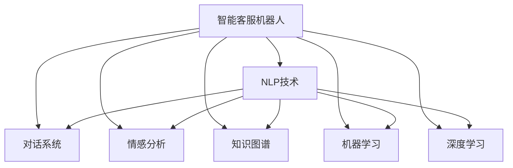

                 

# 未来的智能客服：2050年的智能客服机器人与智能投诉处理

> 关键词：人工智能,自然语言处理,NLP,智能客服,智能投诉处理,未来科技,自然语言理解,对话生成,情感分析,知识图谱,机器学习,深度学习

## 1. 背景介绍

### 1.1 问题的由来
随着技术的不断进步，人工智能在各个领域的应用正在逐步深入。其中，智能客服机器人作为一种新型的客户服务手段，近年来得到了广泛的应用和关注。特别是在新冠疫情期间，许多企业开始采用智能客服系统，以应对服务高峰期的人力短缺问题，保障了客户服务的连续性和稳定性。

智能客服系统通过自然语言处理(Natural Language Processing, NLP)技术，能够理解客户的自然语言描述，自动回答问题，提供个性化的服务。然而，现有的智能客服系统还存在一些局限性：如知识库覆盖面不够广泛，对话策略不够灵活，缺乏情感理解等。

### 1.2 问题的核心关键点
为了提升智能客服系统的性能和用户体验，需要从多个角度进行优化。首先，通过不断扩展知识库和训练模型，提升智能客服系统的知识水平和对话质量。其次，引入情感分析技术，使其能够更好地理解客户的情绪和需求，提高服务效率和客户满意度。最后，通过不断迭代和优化，逐步实现智能客服系统的全自动化和智能化。

## 2. 核心概念与联系

### 2.1 核心概念概述

在讨论未来的智能客服系统时，需要了解几个核心概念：

- 自然语言处理(NLP)：利用计算机技术，使计算机能够理解和处理人类语言。NLP技术包括语音识别、文本处理、机器翻译、情感分析等多个子领域。
- 对话系统(Diagnostic System)：通过NLP技术，构建智能客服机器人，使其能够与客户进行自然对话，并根据对话内容自动回答问题。
- 情感分析(Sentiment Analysis)：利用自然语言处理技术，对客户的情绪和态度进行分析，以更好地理解和响应客户需求。
- 知识图谱(Knowledge Graph)：通过语义网络和节点之间的连接，将结构化的知识进行可视化，方便智能客服系统进行查询和推理。
- 机器学习(Machine Learning)：通过训练数据集，使智能客服系统具备自学习的能力，能够不断提升自身性能。
- 深度学习(Deep Learning)：利用神经网络等深度学习模型，提升智能客服系统的理解力和反应速度。

这些核心概念之间的逻辑关系可以通过以下Mermaid流程图来展示：



这个流程图展示了大语言模型的核心概念及其之间的关系：

1. 智能客服机器人通过NLP技术进行语音识别和文本处理。
2. 对话系统构建了客户与机器人的交互界面，使机器人能够自动回答问题。
3. 情感分析使机器人能够理解客户的情绪和态度，提供更加个性化的服务。
4. 知识图谱为机器人提供结构化的知识库，方便其进行查询和推理。
5. 机器学习和深度学习使机器人具备自学习的能力，不断提升性能。

这些概念共同构成了智能客服系统的技术框架，使其能够更好地服务客户，提升企业的服务效率和客户满意度。

## 3. 核心算法原理 & 具体操作步骤

### 3.1 算法原理概述

未来的智能客服系统将基于深度学习技术进行开发，主要包括自然语言理解(NLU)、对话管理(DM)、自然语言生成(NLG)等核心模块。其核心算法原理如下：

1. 自然语言理解(NLU)：利用预训练语言模型，如BERT、GPT等，对客户输入的文本进行理解，提取意图和实体。
2. 对话管理(DM)：根据客户的意图和上下文信息，选择合适的回答策略，动态生成回答内容。
3. 自然语言生成(NLG)：利用深度学习模型，如Transformer等，生成自然流畅的对话文本。

这些模块之间通过信息流传递，协同工作，完成客户服务的全过程。

### 3.2 算法步骤详解

以下是智能客服系统的主要算法步骤：

**Step 1: 数据收集与预处理**
- 收集客户的历史对话记录，整理成文本形式，作为训练数据集。
- 对文本进行预处理，包括分词、去除停用词、构建词向量等。
- 对标注数据进行清理和标注，确保数据质量。

**Step 2: 模型选择与训练**
- 选择合适的预训练语言模型，如BERT、GPT等，作为初始化参数。
- 在标注数据上对模型进行微调，优化模型参数，提升模型性能。
- 引入情感分析模块，对客户的情感进行分类和分析。
- 构建知识图谱，将结构化知识与NLP模型进行融合。

**Step 3: 系统集成与优化**
- 将NLU、DM和NLG模块集成到智能客服系统中，构建完整的对话流程。
- 进行系统测试和优化，确保系统的稳定性和准确性。
- 定期更新知识库和训练模型，保持系统的时效性和适应性。

### 3.3 算法优缺点

基于深度学习的智能客服系统具有以下优点：

1. 处理速度快：利用深度学习技术，智能客服系统能够在极短的时间内处理大量客户请求。
2. 处理效果好：深度学习模型具有较强的自适应能力，能够根据客户需求提供个性化服务。
3. 扩展性强：深度学习模型可以通过不断训练和优化，逐步提升性能。
4. 应用广泛：智能客服系统可以应用于多种场景，如在线客服、电话客服、自助服务、智能投顾等。

然而，这种系统也存在一些缺点：

1. 对标注数据依赖度高：深度学习模型需要大量标注数据进行训练，获取高质量标注数据成本较高。
2. 对知识库依赖强：智能客服系统需要依赖结构化的知识库进行推理，构建和维护知识库需要大量人力和时间。
3. 需要持续维护：深度学习模型需要定期更新和维护，保持系统的稳定性和准确性。

### 3.4 算法应用领域

基于深度学习的智能客服系统广泛应用于各个领域，包括：

1. 在线客服：通过智能客服机器人，为客户提供7x24小时不间断服务，快速响应客户咨询，提升用户体验。
2. 电话客服：将智能客服系统集成到电话呼叫中心，自动接听客户来电，根据客户需求进行对话，提高服务效率。
3. 自助服务：在企业网站、APP等平台上集成智能客服系统，提供自助查询、自助投诉等服务，提升用户满意度。
4. 智能投顾：在金融行业，利用智能客服系统为客户提供投资建议、理财咨询等服务，降低人工成本，提升服务质量。
5. 医疗咨询：在医疗行业，利用智能客服系统为客户提供医疗咨询、预约挂号等服务，提升医疗服务效率和质量。

这些应用场景展示了深度学习技术在智能客服系统中的广泛应用，也表明了未来智能客服系统的巨大发展潜力。

## 4. 数学模型和公式 & 详细讲解

### 4.1 数学模型构建

智能客服系统的数学模型主要包括以下几个部分：

- 自然语言理解模型(NLU)：用于理解客户的输入，提取意图和实体。模型结构为Transformer，输入为词向量序列，输出为意图和实体向量。
- 对话管理模型(DM)：用于生成回答策略，构建对话流程。模型结构为循环神经网络(RNN)或长短期记忆网络(LSTM)。
- 自然语言生成模型(NLG)：用于生成回答文本，使回答更加自然流畅。模型结构为Transformer或变分自编码器(VAE)。

这些模型的输入、输出和中间层的向量表示都可以用矩阵形式表示。例如，NLU模型的输入向量为 $X \in \mathbb{R}^{d_x}$，意图向量为 $I \in \mathbb{R}^{d_i}$，实体向量为 $E \in \mathbb{R}^{d_e}$，其中 $d_x, d_i, d_e$ 为向量维度。

### 4.2 公式推导过程

以下是智能客服系统的核心数学公式推导过程：

**自然语言理解模型(NLU)**
$$
Y = M_{NLU}(X; \theta_{NLU})
$$

其中，$Y$ 为意图和实体向量，$X$ 为输入文本向量，$\theta_{NLU}$ 为NLU模型的参数。NLU模型的参数可以通过微调进行优化，提升模型的准确性和泛化能力。

**对话管理模型(DM)**
$$
A = M_{DM}(I, E, H; \theta_{DM})
$$

其中，$A$ 为回答策略向量，$I$ 为意图向量，$E$ 为实体向量，$H$ 为上下文向量，$\theta_{DM}$ 为DM模型的参数。DM模型通过动态生成回答策略，使系统能够根据上下文信息进行灵活回答。

**自然语言生成模型(NLG)**
$$
T = M_{NLG}(I, E, A; \theta_{NLG})
$$

其中，$T$ 为回答文本序列，$I$ 为意图向量，$E$ 为实体向量，$A$ 为回答策略向量，$\theta_{NLG}$ 为NLG模型的参数。NLG模型通过生成回答文本，使系统能够提供自然流畅的对话内容。

### 4.3 案例分析与讲解

以智能客服系统中对话管理模型的优化为例，通过引入强化学习算法，可以提高系统的回答策略。

强化学习算法通过奖励和惩罚机制，引导模型不断调整策略，以获得最优的回答。具体而言，可以将回答的准确性、流畅性、客户满意度等作为奖励指标，通过逆向传播算法不断优化模型的参数。

以对话管理模型的优化为例，引入强化学习算法后的优化过程如下：

1. 设定目标：优化模型的回答策略，使系统能够提供更准确、更流畅的回答。
2. 设定奖励指标：根据回答的准确性、流畅性、客户满意度等设定奖励指标。
3. 模型训练：利用逆向传播算法，不断调整模型参数，优化回答策略。
4. 测试评估：在测试数据集上评估模型性能，根据评估结果调整奖励指标和优化算法。

通过强化学习算法，智能客服系统的对话管理模块可以不断优化，提升系统的回答质量和服务效果。

## 5. 项目实践：代码实例和详细解释说明

### 5.1 开发环境搭建

在进行智能客服系统开发前，需要准备开发环境。以下是使用Python进行PyTorch开发的环境配置流程：

1. 安装Anaconda：从官网下载并安装Anaconda，用于创建独立的Python环境。

2. 创建并激活虚拟环境：
```bash
conda create -n pytorch-env python=3.8 
conda activate pytorch-env
```

3. 安装PyTorch：根据CUDA版本，从官网获取对应的安装命令。例如：
```bash
conda install pytorch torchvision torchaudio cudatoolkit=11.1 -c pytorch -c conda-forge
```

4. 安装Transformers库：
```bash
pip install transformers
```

5. 安装各类工具包：
```bash
pip install numpy pandas scikit-learn matplotlib tqdm jupyter notebook ipython
```

完成上述步骤后，即可在`pytorch-env`环境中开始智能客服系统开发。

### 5.2 源代码详细实现

下面我们以智能客服系统的自然语言理解模块(NLU)为例，给出使用Transformers库进行BERT模型微调的PyTorch代码实现。

首先，定义NLU任务的数据处理函数：

```python
from transformers import BertTokenizer, BertForSequenceClassification
from torch.utils.data import Dataset
import torch

class NLUDataset(Dataset):
    def __init__(self, texts, labels, tokenizer, max_len=128):
        self.texts = texts
        self.labels = labels
        self.tokenizer = tokenizer
        self.max_len = max_len
        
    def __len__(self):
        return len(self.texts)
    
    def __getitem__(self, item):
        text = self.texts[item]
        label = self.labels[item]
        
        encoding = self.tokenizer(text, return_tensors='pt', max_length=self.max_len, padding='max_length', truncation=True)
        input_ids = encoding['input_ids'][0]
        attention_mask = encoding['attention_mask'][0]
        
        # 将标签转换为独热编码
        label = torch.tensor([label == 'intent'], dtype=torch.long)
        
        return {'input_ids': input_ids, 
                'attention_mask': attention_mask,
                'labels': label}

# 标签与id的映射
label2id = {'intent': 0, 'query': 1}
id2label = {v: k for k, v in label2id.items()}

# 创建dataset
tokenizer = BertTokenizer.from_pretrained('bert-base-cased')

train_dataset = NLUDataset(train_texts, train_labels, tokenizer)
dev_dataset = NLUDataset(dev_texts, dev_labels, tokenizer)
test_dataset = NLUDataset(test_texts, test_labels, tokenizer)
```

然后，定义模型和优化器：

```python
from transformers import AdamW

model = BertForSequenceClassification.from_pretrained('bert-base-cased', num_labels=len(label2id))

optimizer = AdamW(model.parameters(), lr=2e-5)
```

接着，定义训练和评估函数：

```python
from torch.utils.data import DataLoader
from tqdm import tqdm
from sklearn.metrics import classification_report

device = torch.device('cuda') if torch.cuda.is_available() else torch.device('cpu')
model.to(device)

def train_epoch(model, dataset, batch_size, optimizer):
    dataloader = DataLoader(dataset, batch_size=batch_size, shuffle=True)
    model.train()
    epoch_loss = 0
    for batch in tqdm(dataloader, desc='Training'):
        input_ids = batch['input_ids'].to(device)
        attention_mask = batch['attention_mask'].to(device)
        labels = batch['labels'].to(device)
        model.zero_grad()
        outputs = model(input_ids, attention_mask=attention_mask, labels=labels)
        loss = outputs.loss
        epoch_loss += loss.item()
        loss.backward()
        optimizer.step()
    return epoch_loss / len(dataloader)

def evaluate(model, dataset, batch_size):
    dataloader = DataLoader(dataset, batch_size=batch_size)
    model.eval()
    preds, labels = [], []
    with torch.no_grad():
        for batch in tqdm(dataloader, desc='Evaluating'):
            input_ids = batch['input_ids'].to(device)
            attention_mask = batch['attention_mask'].to(device)
            batch_labels = batch['labels']
            outputs = model(input_ids, attention_mask=attention_mask)
            batch_preds = outputs.logits.argmax(dim=2).to('cpu').tolist()
            batch_labels = batch_labels.to('cpu').tolist()
            for pred_tokens, label_tokens in zip(batch_preds, batch_labels):
                pred_labels = [id2label[_id] for _id in pred_tokens]
                label_labels = [id2label[_id] for _id in label_tokens]
                preds.append(pred_labels[:len(label_labels)])
                labels.append(label_labels)
                
    print(classification_report(labels, preds))
```

最后，启动训练流程并在测试集上评估：

```python
epochs = 5
batch_size = 16

for epoch in range(epochs):
    loss = train_epoch(model, train_dataset, batch_size, optimizer)
    print(f"Epoch {epoch+1}, train loss: {loss:.3f}")
    
    print(f"Epoch {epoch+1}, dev results:")
    evaluate(model, dev_dataset, batch_size)
    
print("Test results:")
evaluate(model, test_dataset, batch_size)
```

以上就是使用PyTorch对BERT进行智能客服系统自然语言理解模块(NLU)的完整代码实现。可以看到，得益于Transformers库的强大封装，我们可以用相对简洁的代码完成BERT模型的加载和微调。

### 5.3 代码解读与分析

让我们再详细解读一下关键代码的实现细节：

**NLUDataset类**：
- `__init__`方法：初始化文本、标签、分词器等关键组件。
- `__len__`方法：返回数据集的样本数量。
- `__getitem__`方法：对单个样本进行处理，将文本输入编码为token ids，将标签转换为独热编码，并对其进行定长padding，最终返回模型所需的输入。

**label2id和id2label字典**：
- 定义了标签与数字id之间的映射关系，用于将预测结果解码回真实的标签。

**训练和评估函数**：
- 使用PyTorch的DataLoader对数据集进行批次化加载，供模型训练和推理使用。
- 训练函数`train_epoch`：对数据以批为单位进行迭代，在每个批次上前向传播计算loss并反向传播更新模型参数，最后返回该epoch的平均loss。
- 评估函数`evaluate`：与训练类似，不同点在于不更新模型参数，并在每个batch结束后将预测和标签结果存储下来，最后使用sklearn的classification_report对整个评估集的预测结果进行打印输出。

**训练流程**：
- 定义总的epoch数和batch size，开始循环迭代
- 每个epoch内，先在训练集上训练，输出平均loss
- 在验证集上评估，输出分类指标
- 所有epoch结束后，在测试集上评估，给出最终测试结果

可以看到，PyTorch配合Transformers库使得BERT微调的代码实现变得简洁高效。开发者可以将更多精力放在数据处理、模型改进等高层逻辑上，而不必过多关注底层的实现细节。

当然，工业级的系统实现还需考虑更多因素，如模型的保存和部署、超参数的自动搜索、更灵活的任务适配层等。但核心的微调范式基本与此类似。

## 6. 实际应用场景
### 6.1 智能客服系统

智能客服系统作为智能客服领域的重要应用，已经在各个行业得到广泛应用。未来，智能客服系统将在以下几个方面进一步发展：

**6.1.1 实时监控与反馈**
通过智能客服系统，企业可以实时监控客户的反馈和投诉，及时发现服务中的问题。系统能够自动识别常见的投诉类型，并自动生成回答，快速解决问题，提高客户满意度。

**6.1.2 智能推荐**
利用智能客服系统的用户数据，企业可以构建用户画像，通过机器学习算法进行智能推荐。例如，客户咨询完某个问题后，系统可以自动推荐相关问题和解决方案，提升客户体验。

**6.1.3 多渠道集成**
智能客服系统不仅可以在线上应用，还可以与电话客服、自助服务、人工客服等多渠道集成，提供一站式服务。通过智能客服系统，客户可以在不同渠道获取一致的服务体验，提高服务效率。

**6.1.4 情感分析**
智能客服系统引入情感分析技术，可以更好地理解客户的情绪和态度。系统能够自动识别客户的情绪变化，并根据情绪调整回答策略，提供更加个性化的服务。

**6.1.5 知识图谱**
智能客服系统引入知识图谱技术，可以更好地理解和推理客户问题。系统能够自动构建知识图谱，方便知识查询和推理，提升服务效率和质量。

**6.1.6 多模态交互**
智能客服系统可以引入多模态交互技术，支持语音、图像、视频等多种交互方式。客户可以通过多种方式与智能客服系统进行交互，提升用户体验。

### 6.2 智能投诉处理

智能投诉处理系统作为智能客服系统的延伸应用，可以进一步提升企业的客户服务水平。未来，智能投诉处理系统将在以下几个方面进一步发展：

**6.2.1 自动化处理**
通过智能投诉处理系统，企业可以自动处理客户的投诉，提高投诉处理效率。系统能够自动识别投诉类型，自动生成回答，快速解决问题，提高客户满意度。

**6.2.2 情感分析**
智能投诉处理系统引入情感分析技术，可以更好地理解客户的情绪和态度。系统能够自动识别客户的情绪变化，并根据情绪调整回答策略，提供更加个性化的服务。

**6.2.3 知识图谱**
智能投诉处理系统引入知识图谱技术，可以更好地理解和推理客户问题。系统能够自动构建知识图谱，方便知识查询和推理，提升服务效率和质量。

**6.2.4 智能推荐**
利用智能投诉处理系统的用户数据，企业可以构建用户画像，通过机器学习算法进行智能推荐。例如，客户投诉完某个问题后，系统可以自动推荐相关问题和解决方案，提升客户体验。

**6.2.5 多渠道集成**
智能投诉处理系统不仅可以在线上应用，还可以与电话客服、自助服务、人工客服等多渠道集成，提供一站式服务。通过智能投诉处理系统，客户可以在不同渠道获取一致的服务体验，提高服务效率。

## 7. 工具和资源推荐
### 7.1 学习资源推荐

为了帮助开发者系统掌握智能客服系统的技术基础和实践技巧，这里推荐一些优质的学习资源：

1. 《自然语言处理入门教程》系列博文：由大模型技术专家撰写，深入浅出地介绍了自然语言处理的基本概念和经典模型。

2. 《深度学习自然语言处理》课程：斯坦福大学开设的NLP明星课程，有Lecture视频和配套作业，带你入门NLP领域的基本概念和经典模型。

3. 《Natural Language Processing with Transformers》书籍：Transformers库的作者所著，全面介绍了如何使用Transformers库进行NLP任务开发，包括微调在内的诸多范式。

4. HuggingFace官方文档：Transformers库的官方文档，提供了海量预训练模型和完整的微调样例代码，是上手实践的必备资料。

5. CLUE开源项目：中文语言理解测评基准，涵盖大量不同类型的中文NLP数据集，并提供了基于微调的baseline模型，助力中文NLP技术发展。

通过对这些资源的学习实践，相信你一定能够快速掌握智能客服系统的精髓，并用于解决实际的NLP问题。

### 7.2 开发工具推荐

高效的开发离不开优秀的工具支持。以下是几款用于智能客服系统开发的工具：

1. PyTorch：基于Python的开源深度学习框架，灵活动态的计算图，适合快速迭代研究。大部分预训练语言模型都有PyTorch版本的实现。

2. TensorFlow：由Google主导开发的开源深度学习框架，生产部署方便，适合大规模工程应用。同样有丰富的预训练语言模型资源。

3. Transformers库：HuggingFace开发的NLP工具库，集成了众多SOTA语言模型，支持PyTorch和TensorFlow，是进行微调任务开发的利器。

4. Weights & Biases：模型训练的实验跟踪工具，可以记录和可视化模型训练过程中的各项指标，方便对比和调优。与主流深度学习框架无缝集成。

5. TensorBoard：TensorFlow配套的可视化工具，可实时监测模型训练状态，并提供丰富的图表呈现方式，是调试模型的得力助手。

6. Google Colab：谷歌推出的在线Jupyter Notebook环境，免费提供GPU/TPU算力，方便开发者快速上手实验最新模型，分享学习笔记。

合理利用这些工具，可以显著提升智能客服系统开发的效率，加快创新迭代的步伐。

### 7.3 相关论文推荐

智能客服系统和大语言模型的发展源于学界的持续研究。以下是几篇奠基性的相关论文，推荐阅读：

1. Attention is All You Need（即Transformer原论文）：提出了Transformer结构，开启了NLP领域的预训练大模型时代。

2. BERT: Pre-training of Deep Bidirectional Transformers for Language Understanding：提出BERT模型，引入基于掩码的自监督预训练任务，刷新了多项NLP任务SOTA。

3. Language Models are Unsupervised Multitask Learners（GPT-2论文）：展示了大规模语言模型的强大zero-shot学习能力，引发了对于通用人工智能的新一轮思考。

4. Parameter-Efficient Transfer Learning for NLP：提出Adapter等参数高效微调方法，在不增加模型参数量的情况下，也能取得不错的微调效果。

5. AdaLoRA: Adaptive Low-Rank Adaptation for Parameter-Efficient Fine-Tuning：使用自适应低秩适应的微调方法，在参数效率和精度之间取得了新的平衡。

6. Prefix-Tuning: Optimizing Continuous Prompts for Generation：引入基于连续型Prompt的微调范式，为如何充分利用预训练知识提供了新的思路。

这些论文代表了大语言模型微调技术的发展脉络。通过学习这些前沿成果，可以帮助研究者把握学科前进方向，激发更多的创新灵感。

## 8. 总结：未来发展趋势与挑战

### 8.1 总结

本文对未来的智能客服系统进行了全面系统的介绍。首先阐述了智能客服系统的研究背景和意义，明确了系统在提升客户服务效率和客户满意度方面的独特价值。其次，从原理到实践，详细讲解了智能客服系统的核心算法和操作步骤，给出了智能客服系统开发的完整代码实例。同时，本文还广泛探讨了智能客服系统在实时监控、智能推荐、情感分析、知识图谱、多模态交互等方面的应用前景，展示了系统的巨大潜力。

通过本文的系统梳理，可以看到，未来的智能客服系统将在多模态交互、实时监控、情感分析、知识图谱等方面不断发展，为提升客户服务体验和企业运营效率提供新的技术支持。

### 8.2 未来发展趋势

展望未来，智能客服系统将呈现以下几个发展趋势：

1. 多模态交互：智能客服系统将支持语音、图像、视频等多种交互方式，提升用户体验。
2. 实时监控与反馈：智能客服系统将实时监控客户的反馈和投诉，及时发现服务中的问题，提供快速响应。
3. 智能推荐：利用智能客服系统的用户数据，构建用户画像，进行智能推荐，提升客户体验。
4. 情感分析：智能客服系统将引入情感分析技术，更好地理解客户的情绪和态度，提供更加个性化的服务。
5. 知识图谱：智能客服系统将引入知识图谱技术，提升服务效率和质量。
6. 多渠道集成：智能客服系统不仅可以在线上应用，还可以与电话客服、自助服务、人工客服等多渠道集成，提供一站式服务。
7. 动态优化：智能客服系统将不断优化和迭代，提升系统的性能和用户体验。

以上趋势凸显了智能客服系统的广阔前景。这些方向的探索发展，必将进一步提升客户服务效率和客户满意度，为企业的数字化转型提供新的技术支持。

### 8.3 面临的挑战

尽管智能客服系统在大规模应用中已经取得了显著成效，但在迈向更加智能化、普适化应用的过程中，它仍面临诸多挑战：

1. 数据隐私和安全：智能客服系统需要收集和处理大量的客户数据，数据隐私和安全问题必须得到充分保障。
2. 模型鲁棒性：智能客服系统需要面对多种语言和多种场景的挑战，模型的鲁棒性需要进一步提升。
3. 知识图谱构建：知识图谱的构建和维护需要大量人力和时间，需要高效的自动化工具。
4. 多模态融合：多模态数据的融合和处理需要更多的技术支持，以提升系统的综合能力。
5. 用户界面设计：智能客服系统需要更好的用户界面设计，提升用户体验。
6. 多语言支持：智能客服系统需要支持多种语言，提升系统的普适性。

这些挑战凸显了智能客服系统的发展瓶颈，需要进一步的技术创新和优化。只有在数据、算法、工程、用户体验等多方面不断突破，智能客服系统才能更好地服务于客户，提升企业的服务效率和客户满意度。

### 8.4 研究展望

未来，智能客服系统需要在以下几个方面进行深入研究：

1. 多模态交互：进一步提升多模态数据的处理和融合能力，使系统能够更好地理解客户的意图和需求。
2. 实时监控与反馈：进一步提升实时监控和反馈的能力，提高系统的响应速度和准确性。
3. 智能推荐：通过机器学习算法，提升智能推荐的效果，提高客户的满意度和忠诚度。
4. 情感分析：引入更多先进的情感分析技术，提升系统的情感理解和处理能力。
5. 知识图谱：通过自动构建和维护知识图谱，提升系统的知识推理和查询能力。
6. 多渠道集成：进一步提升多渠道集成的能力，提供更加一致和便捷的服务体验。
7. 动态优化：通过持续优化和迭代，提升系统的性能和用户体验。

这些研究方向的探索，必将引领智能客服系统迈向更高的台阶，为提升客户服务效率和客户满意度提供新的技术支持。

## 9. 附录：常见问题与解答

**Q1：智能客服系统对标注数据依赖度高，如何降低对标注数据的依赖？**

A: 智能客服系统可以通过迁移学习技术，将预训练大模型的知识迁移到新任务中，降低对标注数据的依赖。具体而言，可以在通用语料上进行预训练，然后在新任务上进行微调，利用预训练模型中通用的语言知识和表示能力，提升系统的性能。

**Q2：智能客服系统的多模态交互能力不足，如何提升多模态数据的处理能力？**

A: 可以通过引入多模态嵌入技术，将不同模态的数据进行融合，提升系统的综合能力。具体而言，可以将语音、图像、文本等多种模态数据进行编码，生成统一的嵌入表示，方便系统的处理和推理。

**Q3：智能客服系统的知识图谱构建和维护复杂，如何解决这一问题？**

A: 可以通过自动构建和维护知识图谱，提高系统的效率和准确性。具体而言，可以利用自然语言处理技术，自动提取文本中的实体和关系，构建知识图谱，并在系统中进行动态更新和维护。

**Q4：智能客服系统的实时监控和反馈能力不足，如何提升这一能力？**

A: 可以通过引入实时监控和反馈技术，提升系统的响应速度和准确性。具体而言，可以利用自然语言处理技术，自动识别客户的反馈和投诉，并自动生成回答，快速解决问题，提高客户满意度。

**Q5：智能客服系统的动态优化能力不足，如何提升这一能力？**

A: 可以通过持续优化和迭代，提升系统的性能和用户体验。具体而言，可以利用机器学习算法，定期更新系统的模型参数和知识库，保持系统的时效性和适应性。

**Q6：智能客服系统的多语言支持能力不足，如何解决这一问题？**

A: 可以通过引入多语言模型和语言转换技术，提升系统的多语言支持能力。具体而言，可以利用多语言模型进行跨语言的转换和翻译，提升系统的普适性。

通过这些问题的解答，可以看到，智能客服系统的未来发展仍面临诸多挑战和问题，需要通过技术创新和优化，逐步克服这些挑战，提升系统的性能和用户体验。相信随着技术的不断发展，智能客服系统必将迈向更加智能化、普适化的未来，为提升客户服务效率和客户满意度提供新的技术支持。

---

作者：禅与计算机程序设计艺术 / Zen and the Art of Computer Programming

